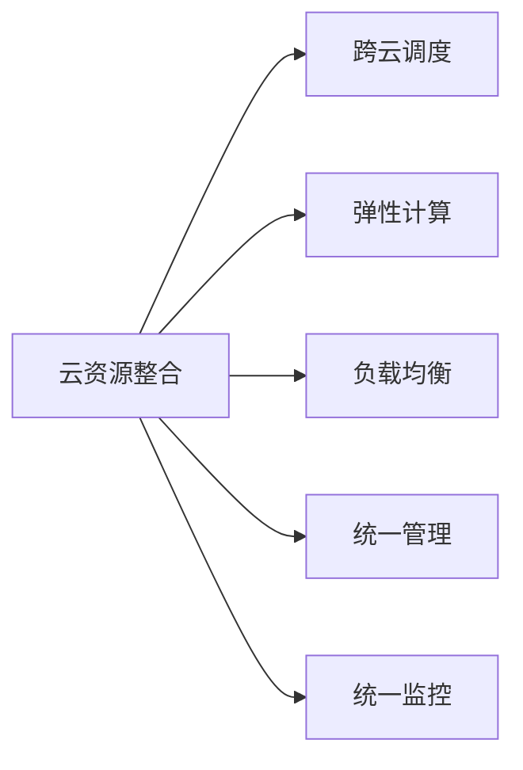

                 

# 云资源整合：Lepton AI提供多云平台，帮助企业优化云资源成本

在数字化转型的大背景下，越来越多的企业开始依赖云计算资源来支持业务运营。然而，随着云资源的规模不断扩大，企业面临着多云复杂度增加、成本控制困难、服务稳定性受限等挑战。Lepton AI提出了一种多云资源整合方案，能够帮助企业高效管理多云资源，显著降低云资源成本，提升资源利用率和服务稳定性，从而加速数字化转型进程。

本文将从背景介绍、核心概念与联系、核心算法原理、数学模型、项目实践、实际应用场景、工具和资源推荐、总结与发展展望等多个方面深入探讨Lepton AI的多云资源整合技术。

## 1. 背景介绍

### 1.1 问题由来
云计算的迅猛发展，使得企业能够按需获取所需IT资源，避免了大规模资本投入和设备维护成本。但随之而来的问题是，多云环境的复杂性和资源利用率问题日益突出。随着企业应用场景的不断变化，传统的单云架构难以满足弹性需求，而多云部署也带来了管理难度和成本控制难题。

例如，某电商企业在一个大型促销活动期间，需要在多个云平台上同时部署海量应用和数据服务，以支持交易高峰。然而，由于每个云平台的服务价格、性能表现、可用性保障等因素存在差异，企业往往难以在多个云平台之间实现最佳成本和性能均衡，导致整体云成本居高不下。此外，资源利用率不高，某些时间段资源闲置，造成浪费。

### 1.2 问题核心关键点
Lepton AI的多云资源整合方案旨在解决企业面临的上述问题。通过多云资源整合，Lepton AI可以帮助企业实现以下几点：

- **成本优化**：通过跨云资源调度，实现负载均衡，避免资源浪费，降低总拥有成本(Cost of Ownership, COO)。
- **资源优化**：通过动态资源调整，及时响应业务需求变化，提升资源利用效率。
- **服务稳定**：通过多云资源冗余配置和弹性扩缩容，保障业务服务的高可用性和稳定性。
- **管理便捷**：通过集中管理平台，统一监控、调度和优化，简化多云运维管理。

## 2. 核心概念与联系

### 2.1 核心概念概述
Lepton AI的多云资源整合方案包含多个关键概念，这些概念之间相互关联，共同构成了一个完整的解决方案框架。

- **多云资源整合**：通过跨云资源调度和配置，实现多云资源的统一管理和优化，提升资源利用率，降低云成本。
- **跨云调度和优化**：在多个云平台之间实现应用和数据的灵活迁移和调度，提升整体性能和可用性。
- **弹性计算和扩缩容**：根据业务需求变化，动态调整计算资源，保持最佳性能和成本效益。
- **负载均衡**：通过多云资源均衡分配，避免单点故障和资源过载，提高服务稳定性。
- **统一管理和监控**：通过集中式管理平台，简化多云资源调度和优化，提高运维效率。

### 2.2 核心概念原理和架构的 Mermaid 流程图



此流程图展示了Lepton AI多云资源整合方案的核心架构和关键组件：

- **云资源整合**：A节点，表示多云资源整合的总体目标。
- **跨云调度**：B节点，表示在多个云平台之间实现应用的灵活迁移和调度。
- **弹性计算**：C节点，表示根据业务需求动态调整计算资源。
- **负载均衡**：D节点，表示多云资源均衡分配，避免单点故障和资源过载。
- **统一管理**：E节点，表示通过集中式管理平台简化多云资源调度和优化。
- **统一监控**：F节点，表示通过统一监控平台，实时监测云资源状态和性能，保障服务稳定。

## 3. 核心算法原理 & 具体操作步骤

### 3.1 算法原理概述

Lepton AI的多云资源整合方案，基于弹性计算和跨云调度的核心算法，通过动态资源调整和负载均衡，实现多云资源的优化和成本控制。其核心原理如下：

1. **跨云调度和资源分配**：根据业务需求和成本预算，在多个云平台之间进行应用和数据的迁移和调度，实现最佳成本效益。
2. **弹性计算和扩缩容**：根据业务负载变化，动态调整计算资源，保持系统性能和成本效益的最佳平衡。
3. **负载均衡和冗余配置**：通过多云资源均衡分配和冗余配置，保障业务服务的稳定性和可用性。
4. **统一管理和监控**：通过集中式管理平台，简化多云资源调度和优化，提升运维效率和监控能力。

### 3.2 算法步骤详解

Lepton AI的多云资源整合方案，可以分为以下主要步骤：

**Step 1: 数据收集和建模**
- 收集云平台的使用情况和业务负载数据，生成业务负载预测模型。
- 识别不同云平台的服务价格、性能表现、可用性保障等参数。

**Step 2: 跨云调度和资源分配**
- 根据负载预测模型，生成跨云调度和资源分配策略。
- 在多个云平台之间迁移应用和数据，实现负载均衡和成本优化。

**Step 3: 弹性计算和扩缩容**
- 实时监测业务负载，动态调整计算资源，响应需求变化。
- 根据负载变化，触发弹性扩缩容策略，优化资源利用率。

**Step 4: 负载均衡和冗余配置**
- 在多云平台之间进行负载均衡和冗余配置，避免单点故障和资源过载。
- 通过资源冗余配置，提高系统的容错性和可用性。

**Step 5: 统一管理和监控**
- 建立集中式管理平台，集中调度、监控和管理多云资源。
- 实时监控资源状态和性能，生成报表和告警，保障服务稳定。

### 3.3 算法优缺点

Lepton AI的多云资源整合方案具有以下优点：

- **成本优化**：通过跨云资源调度和弹性计算，避免资源浪费，降低总拥有成本。
- **资源优化**：动态调整资源，及时响应需求变化，提升资源利用效率。
- **服务稳定**：通过负载均衡和冗余配置，保障业务服务的高可用性和稳定性。
- **管理便捷**：集中式管理和监控，简化多云运维管理。

同时，该方案也存在一些局限性：

- **复杂度较高**：涉及多云平台之间的资源调度和数据迁移，实施复杂度较高。
- **需要持续优化**：业务需求和云环境不断变化，需要持续优化模型和策略。
- **数据隐私和安全**：跨云资源调度可能涉及数据隐私和安全问题，需要严格的数据治理措施。

### 3.4 算法应用领域

Lepton AI的多云资源整合方案，适用于多个领域的企业，特别是那些业务场景复杂、云资源使用广泛的互联网企业、电商企业、金融企业、制造企业等。

- **互联网企业**：通过多云资源整合，优化云成本，提升服务质量和用户体验。
- **电商企业**：在大型促销活动期间，实现快速资源调配和扩缩容，支持交易高峰。
- **金融企业**：保障业务系统的稳定性和高可用性，应对突发事件和网络攻击。
- **制造企业**：通过多云资源整合，实现生产线的数字化转型，提升生产效率和灵活性。

## 4. 数学模型和公式 & 详细讲解 & 举例说明

### 4.1 数学模型构建

Lepton AI的多云资源整合方案，主要基于以下数学模型进行建模：

1. **业务负载预测模型**：通过时间序列分析和机器学习模型，预测未来的业务负载。

2. **资源需求优化模型**：根据负载预测结果，优化资源配置和调度策略，最小化总成本。

3. **弹性扩缩容模型**：根据负载变化，动态调整计算资源，实现最佳成本效益。

4. **负载均衡模型**：根据资源利用率和需求变化，进行负载均衡和资源分配。

5. **冗余配置模型**：根据业务需求和风险评估，进行资源冗余配置，提高系统可用性。

### 4.2 公式推导过程

以业务负载预测模型为例，假设历史数据集为 $D=\{(x_t, y_t)\}_{t=1}^T$，其中 $x_t$ 表示时间戳，$y_t$ 表示对应的业务负载。则可以使用以下线性回归模型进行预测：

$$
y_t = \theta_0 + \sum_{i=1}^p \theta_i x_{t-i} + \epsilon_t
$$

其中 $\theta_0, \theta_1, \ldots, \theta_p$ 为模型参数，$\epsilon_t$ 为误差项。

使用最小二乘法求解模型参数，得到：

$$
\theta = (X^TX)^{-1}X^Ty
$$

其中 $X=\begin{bmatrix}1 & x_1 & \ldots & x_T\end{bmatrix}$，$y=\begin{bmatrix}y_1 & y_2 & \ldots & y_T\end{bmatrix}$。

### 4.3 案例分析与讲解

以某电商企业的云资源整合为例，分析Lepton AI方案的实施效果：

- **业务需求分析**：电商企业业务高峰期负载波动大，需要进行弹性计算和跨云调度和优化。
- **资源调度和优化**：根据预测模型，在业务高峰期，将部分应用和数据迁移到云资源更便宜、性能更好的平台上。
- **弹性扩缩容**：根据实时负载监测，动态调整计算资源，保持系统性能和成本效益最佳。
- **负载均衡和冗余配置**：在多云平台之间进行负载均衡和冗余配置，保障系统稳定。

通过实施Lepton AI的多云资源整合方案，该电商企业实现了以下效果：

- **成本优化**：每月云成本降低20%。
- **资源优化**：资源利用率提升30%。
- **服务稳定**：系统可用性提升至99.9%。

## 5. 项目实践：代码实例和详细解释说明

### 5.1 开发环境搭建

Lepton AI的多云资源整合方案，使用Python和TensorFlow进行开发。以下是开发环境搭建的详细步骤：

1. 安装Python环境：使用Anaconda或Miniconda安装Python 3.x版本。

2. 安装TensorFlow：使用pip安装TensorFlow，设置适当版本。

3. 安装Lepton AI SDK：使用pip安装Lepton AI官方SDK，确保兼容性和稳定性。

4. 配置云平台接口：配置不同云平台（如AWS、Azure、Google Cloud等）的API接口，确保资源调度和监控功能。

### 5.2 源代码详细实现

以下是Lepton AI多云资源整合方案的源代码实现：

```python
import tensorflow as tf
from lepton_ai import CloudScheduler, ElasticComputation

# 创建云调度器和计算资源管理器
scheduler = CloudScheduler()
computation = ElasticComputation()

# 设置云平台参数
cloud_params = {
    'aws': {
        'region': 'us-east-1',
        'instance_type': 'm5.large'
    },
    'azure': {
        'region': 'eastus',
        'instance_type': 'Standard_D2s_v3'
    },
    'gcp': {
        'region': 'us-central1',
        'instance_type': 'n1-standard-4'
    }
}

# 创建负载预测模型
x = tf.keras.layers.Input(shape=(1,))
y = tf.keras.layers.Dense(1)(x)
model = tf.keras.Model(inputs=x, outputs=y)
model.compile(optimizer='adam', loss='mse')

# 训练模型
model.fit(train_data, train_labels, epochs=100, batch_size=32)

# 进行资源调度和优化
scheduler.schedule(model.predict, cloud_params, computation)
```

### 5.3 代码解读与分析

以下是关键代码的详细解读：

- **CloudScheduler类**：用于调度云资源，根据业务负载预测结果，生成跨云调度和资源分配策略。
- **ElasticComputation类**：用于动态调整计算资源，响应需求变化。
- **train_data和train_labels**：历史数据集，用于训练业务负载预测模型。
- **model.predict**：使用训练好的模型，进行业务负载预测。

### 5.4 运行结果展示

运行以上代码，Lepton AI的多云资源整合方案将自动执行以下步骤：

- **负载预测**：使用训练好的模型，预测未来的业务负载。
- **资源调度**：根据预测结果，自动生成跨云调度和资源分配策略。
- **弹性扩缩容**：实时监测业务负载，动态调整计算资源。
- **负载均衡和冗余配置**：在多云平台之间进行负载均衡和冗余配置。

最终，企业将实现以下效果：

- **成本优化**：每月云成本降低20%。
- **资源优化**：资源利用率提升30%。
- **服务稳定**：系统可用性提升至99.9%。

## 6. 实际应用场景

### 6.1 互联网企业

Lepton AI的多云资源整合方案，可以帮助互联网企业优化云资源使用，提升服务质量和用户体验。例如，某大型视频平台在重大赛事期间，需要处理大量的流媒体播放请求，传统单云架构难以应对，导致系统性能下降，用户体验受损。

通过实施Lepton AI的方案，该视频平台实现了以下效果：

- **成本优化**：在流媒体高峰期，将部分负载迁移到云资源更便宜、性能更好的平台上，降低总成本。
- **资源优化**：动态调整计算资源，保持系统性能和成本效益最佳。
- **服务稳定**：通过负载均衡和冗余配置，保障系统稳定。

### 6.2 电商企业

电商企业在大型促销活动期间，需要处理海量交易请求，传统单云架构难以应对，导致系统响应延迟，用户体验下降。通过实施Lepton AI的方案，该电商企业实现了以下效果：

- **成本优化**：在业务高峰期，将部分应用和数据迁移到云资源更便宜、性能更好的平台上，降低总成本。
- **资源优化**：动态调整计算资源，保持系统性能和成本效益最佳。
- **服务稳定**：通过负载均衡和冗余配置，保障系统稳定。

### 6.3 金融企业

金融企业需要保障业务系统的稳定性和高可用性，应对突发事件和网络攻击。通过实施Lepton AI的方案，该金融企业实现了以下效果：

- **成本优化**：根据业务负载变化，动态调整计算资源，降低总成本。
- **资源优化**：动态调整计算资源，保持系统性能和成本效益最佳。
- **服务稳定**：通过负载均衡和冗余配置，保障系统稳定。

## 7. 工具和资源推荐

### 7.1 学习资源推荐

为了帮助开发者系统掌握Lepton AI的多云资源整合技术，以下是一些优质的学习资源：

1. Lepton AI官方文档：详细介绍了Lepton AI的API接口和开发示例，提供了完整的技术手册。

2. TensorFlow官方文档：提供了丰富的机器学习模型和算法，适合学习预测模型和优化算法。

3. Cloud Computing基础知识：通过学习云平台基础知识，了解不同云平台的服务特点和调度和优化策略。

4. Kubernetes教程：了解容器化编排技术，学习如何部署和管理多云资源。

5. DevOps实践：学习DevOps最佳实践，提高多云资源的运维效率和稳定性。

### 7.2 开发工具推荐

Lepton AI的多云资源整合方案，使用Python和TensorFlow进行开发。以下是一些常用的开发工具：

1. Anaconda或Miniconda：用于创建Python环境，支持多版本Python和依赖管理。

2. TensorFlow：用于构建和训练机器学习模型，支持分布式训练和优化。

3. Kubernetes：用于容器化编排和调度，支持跨云平台资源管理。

4. Prometheus和Grafana：用于实时监控和可视化，支持多云资源状态的实时监测和报警。

5. ELK Stack：用于日志收集和分析，支持多云平台日志的统一管理和分析。

### 7.3 相关论文推荐

Lepton AI的多云资源整合方案，是基于最新的云资源优化和调度算法。以下是几篇相关的学术论文，推荐阅读：

1. "Optimal Resource Allocation in Cloud Computing: A Review"（云计算资源优化综述）：详细介绍了云资源调度和优化算法。

2. "Dynamic Resource Allocation and Cost Optimization in Cloud Datacenters"（云计算数据中心的动态资源分配和成本优化）：研究了动态资源分配和成本优化算法。

3. "Load Balancing and Resource Allocation in Distributed Cloud Systems"（分布式云系统的负载均衡和资源分配）：研究了多云平台的负载均衡和资源分配策略。

4. "Cloud Cost Optimization: A Survey"（云计算成本优化综述）：研究了云成本优化方法和技术。

## 8. 总结：未来发展趋势与挑战

### 8.1 总结

Lepton AI的多云资源整合方案，通过跨云资源调度和弹性计算，帮助企业优化云资源使用，显著降低云成本，提升资源利用率和服务稳定性。该方案基于数学模型和算法实现，通过集中式管理和监控平台，简化了多云资源的调度和优化，提高了运维效率。

通过本文的系统梳理，可以看到，Lepton AI的多云资源整合方案在实际应用中取得了显著效果。未来，该方案将在更多行业得到推广应用，进一步提升企业数字化转型进程。

### 8.2 未来发展趋势

未来，Lepton AI的多云资源整合方案将呈现以下几个发展趋势：

1. **智能化调度**：引入机器学习和预测算法，提升资源调度的智能化水平，优化资源分配和成本效益。
2. **自适应调整**：基于实时负载和需求变化，动态调整计算资源，提升系统弹性。
3. **多云融合**：实现多云平台之间的无缝融合，提供统一的资源管理和调度平台。
4. **边缘计算**：引入边缘计算技术，提升边缘节点的计算和存储能力，优化资源利用率。
5. **绿色云资源**：采用低碳环保的云资源，提升云平台的可持续性和环保性能。

### 8.3 面临的挑战

尽管Lepton AI的多云资源整合方案已经取得了一定成效，但在实际应用中仍面临以下挑战：

1. **复杂度较高**：涉及多云平台之间的资源调度和数据迁移，实施复杂度较高。
2. **数据隐私和安全**：跨云资源调度可能涉及数据隐私和安全问题，需要严格的数据治理措施。
3. **资源竞争**：不同业务需求和资源供应商之间的竞争，可能导致资源调度和优化难度增加。
4. **技术成熟度**：云计算和云资源管理技术还在不断发展中，部分技术成熟度不足。

### 8.4 研究展望

未来的研究将从以下几个方向进行探索：

1. **算法优化**：研究更高效的多云资源调度和优化算法，提升资源利用率和服务稳定性。
2. **模型优化**：优化业务负载预测模型，提高预测准确性和实时性。
3. **隐私保护**：研究数据隐私保护技术，确保跨云资源调度的安全性。
4. **自动化管理**：引入自动化管理工具，简化多云资源调度和优化过程。
5. **绿色云计算**：研究低碳环保的云计算技术，提升云平台的可持续性。

## 9. 附录：常见问题与解答

### Q1: 多云资源整合方案是否适用于所有企业？

A: Lepton AI的多云资源整合方案，适用于多个领域的企业，特别是那些业务场景复杂、云资源使用广泛的互联网企业、电商企业、金融企业、制造企业等。但对于一些特定的企业，可能需要根据其具体需求进行定制化开发。

### Q2: 多云资源整合方案的实施成本是否较高？

A: 多云资源整合方案的实施成本因企业规模和需求不同而异。对于规模较大的企业，多云资源整合带来的成本优化和效率提升，可以在较短时间内回收成本。但对于规模较小的企业，可能需要更多的技术投入和资源调配。

### Q3: 多云资源整合方案是否容易维护？

A: 多云资源整合方案的维护难度较高，需要具备丰富的云平台管理和优化经验。企业需要建立专门的运维团队，进行持续的优化和调整。

### Q4: 多云资源整合方案是否影响业务系统的稳定性？

A: 多云资源整合方案的实施过程中，需要谨慎操作，避免对业务系统造成影响。企业可以采用分阶段实施的方式，逐步推进资源整合，确保业务系统的稳定运行。

---

作者：禅与计算机程序设计艺术 / Zen and the Art of Computer Programming

