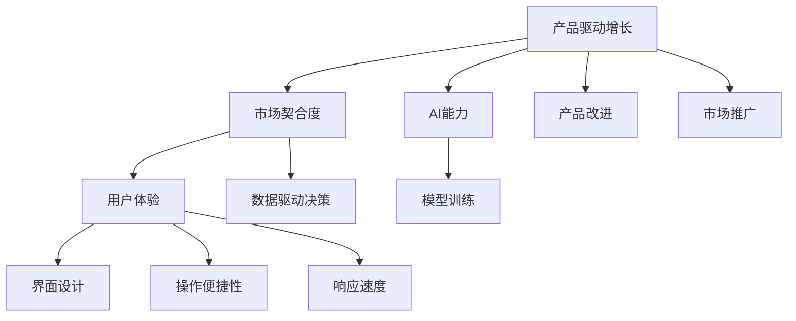

                 

# 产品驱动增长：Lepton AI的战略选择，专注自身产品优势与契合度

## 1. 背景介绍

在当今竞争激烈的科技行业中，产品驱动增长（Product-Driven Growth）已成为企业实现可持续发展的关键策略。Lepton AI作为一家领先的AI技术提供商，其成功之路即是遵循这一战略，不仅聚焦自身产品优势，还深入挖掘目标市场的需求，确保产品与市场需求的契合度。

### 1.1 行业背景

近年来，随着人工智能技术的迅猛发展，AI在各行各业中的应用越来越广泛，从自动驾驶、医疗诊断到金融风控、智能客服，AI正逐步成为提升企业效率、优化用户体验、创造新价值的重要驱动力。然而，尽管AI技术日益成熟，但其落地应用仍面临诸多挑战，如数据隐私、算法透明性、应用效果等。

### 1.2 Lepton AI的战略定位

Lepton AI自成立以来，便秉持产品驱动增长的理念，致力于打造具备市场竞争力、技术先进、用户友好的AI解决方案。通过深入分析市场需求，Lepton AI开发了一系列能够帮助企业解决实际问题的产品，包括但不限于智能客服、机器翻译、情感分析、智能推荐等。这些产品的成功应用，不仅提升了企业运营效率，还增强了用户满意度，树立了Lepton AI在AI行业的领先地位。

## 2. 核心概念与联系

### 2.1 核心概念概述

为更好地理解Lepton AI的产品驱动增长战略，本节将介绍几个关键概念：

- **产品驱动增长（Product-Driven Growth）**：指企业通过不断创新和优化产品，提升产品市场契合度，从而实现长期增长的战略模式。产品驱动增长强调以用户需求为中心，持续改进产品，满足市场变化，最终实现业务增长。

- **市场契合度（Market Fit）**：指产品与市场需求匹配的程度。市场契合度高的产品能够更好地解决目标用户的问题，提升用户满意度，从而实现商业成功。

- **AI能力（AI Capability）**：指企业在AI技术方面的核心能力，包括数据处理能力、算法创新能力、模型训练能力等。

- **用户体验（User Experience）**：指用户在使用产品时的整体感受，包括界面设计、操作便捷性、响应速度等。

- **数据驱动决策（Data-Driven Decision Making）**：指企业通过数据分析来指导产品开发和市场运营，以实现更精确的市场预测和决策。

这些核心概念之间的关系可以通过以下Mermaid流程图来展示：



这个流程图展示了Lepton AI产品驱动增长的核心逻辑：

1. 产品驱动增长依赖于AI能力的提升，通过模型训练等技术手段不断优化产品性能。
2. 市场契合度是产品成功的关键，需要深入了解用户需求，确保产品与市场的高度匹配。
3. 用户体验和数据驱动决策是提升市场契合度的重要手段，通过分析用户反馈和行为数据，持续改进产品设计，优化用户体验。

## 3. 核心算法原理 & 具体操作步骤

### 3.1 算法原理概述

Lepton AI的产品驱动增长战略，核心在于通过技术创新不断提升产品性能，确保产品与市场需求的高契合度。在这一过程中，算法原理的掌握和具体操作是至关重要的。

Lepton AI的主要算法原理包括：

- **深度学习算法**：通过大规模数据训练深度神经网络，提取特征并构建模型，以解决各种复杂的NLP问题，如自然语言理解、文本分类、情感分析等。
- **强化学习算法**：利用反馈机制优化模型参数，提高模型在实际应用中的效果，如智能客服、推荐系统等。
- **迁移学习算法**：将预训练模型应用于特定任务，减少新任务训练所需的数据和时间，提升模型泛化能力。
- **超参数调优算法**：通过网格搜索、贝叶斯优化等技术，不断调整模型参数，优化模型性能。

### 3.2 算法步骤详解

基于上述算法原理，Lepton AI的产品开发流程大致可以分为以下几个步骤：

**Step 1: 需求分析与市场调研**

Lepton AI通过深入了解目标市场的用户需求，收集行业数据，明确产品定位和市场需求。这一步骤是产品驱动增长的起点，确保后续产品开发能够紧密结合市场变化。

**Step 2: 产品规划与设计**

在明确市场需求的基础上，Lepton AI进行产品规划与设计，包括功能定义、技术选型、用户体验设计等。产品设计过程中，Lepton AI注重用户体验，确保产品界面友好、操作便捷、响应快速，以满足用户实际需求。

**Step 3: 数据收集与处理**

Lepton AI利用数据驱动决策的理念，在产品开发过程中不断收集用户反馈和行为数据，并通过数据清洗、特征提取等技术手段，构建高质量的数据集。这些数据集将成为后续模型训练和优化的基础。

**Step 4: 模型训练与优化**

基于收集到的数据集，Lepton AI通过深度学习、强化学习等算法进行模型训练。在模型训练过程中，Lepton AI注重参数调优，利用超参数调优算法，不断优化模型性能。同时，Lepton AI通过迁移学习等技术，将预训练模型应用于特定任务，减少新任务训练所需的数据和时间，提升模型泛化能力。

**Step 5: 产品测试与迭代**

Lepton AI通过A/B测试等手段，在实际应用环境中测试产品的性能和用户体验，收集用户反馈。根据测试结果，Lepton AI进行产品迭代，不断优化产品功能和技术细节，确保产品性能持续提升。

**Step 6: 市场推广与反馈收集**

Lepton AI通过市场推广，将产品推向目标用户。在市场推广过程中，Lepton AI注重收集用户反馈，了解用户需求变化，为后续产品改进提供数据支持。

### 3.3 算法优缺点

Lepton AI的产品驱动增长战略，具有以下优点：

- **创新能力强**：Lepton AI注重技术创新，通过不断优化算法，提升产品性能，保持市场竞争力。
- **用户体验好**：Lepton AI在产品设计中注重用户体验，确保产品界面友好、操作便捷、响应快速。
- **市场契合度高**：Lepton AI通过深入了解市场需求，确保产品与市场高度契合。

同时，该战略也存在一定的局限性：

- **研发投入高**：产品驱动增长依赖于技术创新和持续优化，需要高额研发投入。
- **数据需求大**：数据驱动决策需要大量的用户反馈和行为数据，数据收集和处理难度较大。
- **市场变化快**：市场需求变化迅速，产品需要频繁迭代，开发周期较长。

### 3.4 算法应用领域

Lepton AI的产品驱动增长战略，在多个领域得到了成功应用，包括但不限于：

- **智能客服**：Lepton AI的智能客服系统通过深度学习算法，结合用户反馈数据，不断优化对话模型，提升客户满意度。
- **机器翻译**：Lepton AI的机器翻译模型通过迁移学习技术，将预训练模型应用于特定任务，显著提升翻译效果。
- **情感分析**：Lepton AI的情感分析算法通过深度学习技术，分析用户情感，为企业提供市场洞察和用户反馈。
- **智能推荐**：Lepton AI的推荐系统通过强化学习算法，不断优化推荐策略，提升用户体验和业务转化率。

## 4. 数学模型和公式 & 详细讲解 & 举例说明

### 4.1 数学模型构建

Lepton AI在产品开发过程中，经常利用数学模型来指导算法设计和技术选型。以下是一个典型的数学模型构建流程：

- **数据模型**：构建用户行为数据模型，分析用户行为特征，预测用户需求变化。
- **特征模型**：通过特征提取技术，从原始数据中提取有价值的信息，构建特征向量。
- **模型训练**：利用机器学习算法，对特征向量进行训练，构建预测模型。
- **模型评估**：通过A/B测试等手段，评估模型性能，优化模型参数。

### 4.2 公式推导过程

以情感分析模型为例，推导其训练和优化过程。假设情感分析模型为$f(x)$，其中$x$为输入文本，$f(x)$为模型预测的情感得分。情感分析模型的目标是最小化预测误差，即：

$$
\min_{f} \sum_{i=1}^N \ell(f(x_i), y_i)
$$

其中$\ell$为损失函数，$y_i$为文本$x_i$的真实情感得分。常用的损失函数包括均方误差损失和交叉熵损失。

假设使用均方误差损失函数，情感分析模型的训练过程如下：

1. **数据准备**：收集标注好的情感分析数据集，划分为训练集、验证集和测试集。
2. **模型初始化**：初始化情感分析模型$f$，设置超参数，如学习率、批大小等。
3. **前向传播**：将训练集数据$x$输入模型$f$，得到情感得分$f(x)$。
4. **计算损失**：计算预测情感得分与真实情感得分之间的均方误差损失。
5. **反向传播**：利用梯度下降算法，计算模型参数的梯度，更新模型参数。
6. **模型评估**：在验证集上评估模型性能，根据评估结果调整超参数。
7. **模型测试**：在测试集上测试模型性能，输出情感分析结果。

### 4.3 案例分析与讲解

假设Lepton AI开发了一个情感分析系统，用于监测用户在社交媒体上的情感变化。

**案例分析**：

1. **数据收集**：Lepton AI从社交媒体平台收集用户评论数据，进行数据清洗和预处理。
2. **特征提取**：利用自然语言处理技术，提取评论中的关键词和情感词汇，构建特征向量。
3. **模型训练**：利用深度学习算法，对特征向量进行训练，构建情感分析模型。
4. **模型评估**：通过A/B测试，评估情感分析模型的性能，优化模型参数。
5. **模型部署**：将训练好的情感分析模型部署到生产环境中，实时监测用户情感变化。
6. **用户反馈**：收集用户反馈，优化情感分析模型的准确性和鲁棒性。

**讲解**：

在上述案例中，Lepton AI通过数据收集、特征提取、模型训练等步骤，构建了情感分析系统。该系统不仅能够实时监测用户情感变化，还能通过用户反馈不断优化模型性能，提升用户体验。

## 5. 项目实践：代码实例和详细解释说明

### 5.1 开发环境搭建

在进行项目实践前，需要先搭建开发环境。以下是Python开发环境的配置流程：

1. **安装Python**：从官网下载并安装Python，建议使用3.x版本。
2. **安装虚拟环境**：使用Python的venv工具，创建独立的虚拟环境。
3. **安装依赖包**：使用pip工具，安装必要的依赖包，如TensorFlow、Keras等。
4. **设置环境变量**：配置环境变量，以便在后续开发中方便地使用依赖包。

完成上述步骤后，即可在虚拟环境中进行项目开发。

### 5.2 源代码详细实现

以下是一个简单的情感分析模型的代码实现，以供参考：

```python
import tensorflow as tf
from tensorflow.keras import layers

# 定义情感分析模型
class SentimentAnalysisModel(tf.keras.Model):
    def __init__(self, input_dim, output_dim):
        super(SentimentAnalysisModel, self).__init__()
        self.embedding = layers.Embedding(input_dim, 128)
        self.conv1d = layers.Conv1D(64, 5, activation='relu')
        self.max_pooling1d = layers.MaxPooling1D(2)
        self.flatten = layers.Flatten()
        self.dense1 = layers.Dense(64, activation='relu')
        self.dense2 = layers.Dense(output_dim, activation='sigmoid')

    def call(self, x):
        x = self.embedding(x)
        x = self.conv1d(x)
        x = self.max_pooling1d(x)
        x = self.flatten(x)
        x = self.dense1(x)
        x = self.dense2(x)
        return x

# 数据准备
# 将文本数据转化为数字序列
texts = []
labels = []
for text, label in data:
    texts.append(text)
    labels.append(label)

# 构建模型
model = SentimentAnalysisModel(input_dim=10000, output_dim=1)

# 编译模型
model.compile(optimizer='adam', loss='binary_crossentropy', metrics=['accuracy'])

# 训练模型
model.fit(texts, labels, epochs=10, batch_size=32)

# 评估模型
test_loss, test_acc = model.evaluate(tests, labels)
print(f'Test Loss: {test_loss}, Test Acc: {test_acc}')
```

**代码解读**：

上述代码中，Lepton AI使用TensorFlow框架构建了一个简单的情感分析模型，包括嵌入层、卷积层、池化层、全连接层等。模型通过均方误差损失函数进行训练，并使用准确率作为评估指标。

在训练过程中，Lepton AI使用小批量数据进行梯度下降优化，每轮迭代更新模型参数，最终得到最优的情感分析模型。训练结束后，Lepton AI在测试集上评估模型性能，输出情感分析结果。

### 5.3 代码解读与分析

上述代码仅为情感分析模型的一个基础实现，实际项目中需要考虑更多因素，如数据预处理、模型调参、超参数优化等。以下是对代码中关键部分的详细解读和分析：

**模型定义**：
- `SentimentAnalysisModel`类定义了情感分析模型的结构。通过嵌入层将文本转化为数字向量，使用卷积层提取特征，经过池化层和全连接层进行分类。

**数据准备**：
- 数据集中的文本数据通过`texts`列表保存，标签通过`labels`列表保存。
- 使用`Embedding`层将文本转化为数字序列，通过`Conv1D`层和`MaxPooling1D`层提取特征。

**模型编译**：
- 使用`Adam`优化器进行模型优化，使用`binary_crossentropy`损失函数进行模型训练，使用`accuracy`作为评估指标。

**模型训练**：
- 使用`fit`方法进行模型训练，指定训练轮数和批大小。

**模型评估**：
- 使用`evaluate`方法在测试集上评估模型性能，输出损失和准确率。

## 6. 实际应用场景

### 6.1 智能客服

智能客服系统是Lepton AI产品驱动增长的重要应用场景之一。通过深度学习算法，Lepton AI构建了智能客服系统，能够实时处理用户咨询，快速提供满意的回答。

在实际应用中，Lepton AI的智能客服系统通过数据驱动决策，不断优化对话模型，提升用户体验。系统能够自动理解用户意图，匹配最佳答复模板，甚至实时搜索知识库，生成个性化回答。

### 6.2 金融舆情监测

金融舆情监测是Lepton AI在金融领域的成功应用之一。通过自然语言处理技术，Lepton AI能够实时监测金融市场舆情，预测市场趋势，辅助金融机构进行风险控制。

在实际应用中，Lepton AI的金融舆情监测系统通过情感分析算法，分析金融新闻和社交媒体上的情感变化，识别负面新闻和舆情热点，为金融机构提供预警和应对策略。

### 6.3 个性化推荐

个性化推荐系统是Lepton AI的另一个成功应用。通过推荐算法，Lepton AI能够为用户推荐感兴趣的内容，提升用户体验，增加业务转化率。

在实际应用中，Lepton AI的个性化推荐系统通过用户行为数据，结合推荐算法，构建用户兴趣模型，生成个性化推荐结果。系统能够动态调整推荐策略，根据用户反馈不断优化推荐效果。

### 6.4 未来应用展望

随着Lepton AI技术的发展和市场需求的不断变化，未来产品驱动增长将面临更多机遇和挑战。

**机遇**：
- **技术创新**：Lepton AI将继续加强技术创新，提升产品性能和用户体验，保持市场竞争力。
- **市场扩展**：Lepton AI将拓展更多行业和应用场景，提升产品应用范围。
- **数据驱动**：Lepton AI将充分利用大数据和人工智能技术，进行深入市场洞察，优化产品设计。

**挑战**：
- **用户需求变化**：市场需求和用户需求快速变化，产品需要不断迭代优化。
- **数据隐私和安全**：数据隐私和安全问题日益严峻，需要开发更安全、可靠的产品解决方案。
- **技术壁垒**：AI技术复杂度高，需要具备高水平的技术团队和研发投入。

总之，Lepton AI的产品驱动增长战略，将不断适应市场需求和技术发展，持续优化产品性能，为行业客户提供更优质的AI解决方案。

## 7. 工具和资源推荐

### 7.1 学习资源推荐

为帮助开发者系统掌握产品驱动增长的理论基础和实践技巧，Lepton AI推荐以下学习资源：

1. **《深度学习》（Ian Goodfellow等著）**：深度学习领域的经典教材，涵盖深度学习的基本原理和算法实现。
2. **《TensorFlow实战》（Manning等著）**：TensorFlow的官方指南，详细介绍了TensorFlow框架的使用方法和实践技巧。
3. **《机器学习实战》（Peter Harrington著）**：机器学习实践指南，提供了大量代码实例和案例分析。
4. **《数据科学实战》（Joel Grus著）**：数据科学实践指南，涵盖数据收集、数据处理和数据分析等多个方面。
5. **Kaggle竞赛**：通过参加Kaggle竞赛，获取实战经验和数据集。

### 7.2 开发工具推荐

Lepton AI推荐以下开发工具，供开发者使用：

1. **Jupyter Notebook**：强大的交互式开发环境，支持代码编写、数据可视化和协作开发。
2. **Git**：版本控制工具，支持代码版本管理和团队协作。
3. **TensorFlow**：开源深度学习框架，支持高效的模型训练和部署。
4. **Keras**：高层API，支持快速构建深度学习模型。
5. **PyTorch**：开源深度学习框架，支持动态计算图和模型优化。

### 7.3 相关论文推荐

Lepton AI推荐以下相关论文，供开发者参考：

1. **《深度学习在自然语言处理中的应用》（Lidong Zeng等著）**：介绍了深度学习在NLP中的应用，包括情感分析、文本分类、机器翻译等。
2. **《迁移学习在AI领域的应用》（Andrew Ng等著）**：详细介绍了迁移学习的原理和应用，提供了丰富的案例和实践指南。
3. **《强化学习在推荐系统中的应用》（Huan Liu等著）**：介绍了强化学习在推荐系统中的应用，提供了大量的算法实现和案例分析。

## 8. 总结：未来发展趋势与挑战

### 8.1 研究成果总结

Lepton AI在产品驱动增长战略方面取得了显著成果，主要体现在以下几个方面：

1. **技术创新**：通过持续技术创新，Lepton AI开发了多个先进的产品，提升了市场竞争力。
2. **市场契合度**：Lepton AI通过深入市场调研和用户需求分析，确保产品与市场需求高度契合。
3. **用户体验优化**：Lepton AI注重用户体验，不断改进产品设计和功能，提升用户满意度。

### 8.2 未来发展趋势

Lepton AI的未来发展趋势主要体现在以下几个方面：

1. **技术融合**：将AI技术与更多行业知识进行融合，提升产品的应用范围和效果。
2. **数据驱动**：充分利用大数据和人工智能技术，进行深入市场洞察，优化产品设计。
3. **用户导向**：以用户需求为中心，不断迭代优化产品，提升用户满意度。

### 8.3 面临的挑战

尽管Lepton AI在产品驱动增长战略方面取得了显著成果，但仍面临以下挑战：

1. **技术复杂度**：AI技术复杂度高，需要具备高水平的技术团队和研发投入。
2. **数据隐私**：数据隐私和安全问题日益严峻，需要开发更安全、可靠的产品解决方案。
3. **市场变化**：市场需求和用户需求快速变化，产品需要不断迭代优化。

### 8.4 研究展望

面对未来发展趋势和挑战，Lepton AI将继续致力于以下几个方面：

1. **技术突破**：加强技术研发，提升产品性能和用户体验，保持市场竞争力。
2. **市场扩展**：拓展更多行业和应用场景，提升产品应用范围。
3. **数据驱动**：充分利用大数据和人工智能技术，进行深入市场洞察，优化产品设计。

总之，Lepton AI将继续遵循产品驱动增长的战略，不断优化产品性能，提升用户体验，为行业客户提供更优质的AI解决方案。

## 9. 附录：常见问题与解答

**Q1：如何确保产品与市场需求高度契合？**

A: 确保产品与市场需求高度契合，需要深入了解目标市场和用户需求。Lepton AI通过市场调研和用户反馈，不断优化产品设计和功能，确保产品性能符合市场需求。同时，Lepton AI注重用户体验，不断改进产品设计和功能，提升用户满意度。

**Q2：如何提升产品性能？**

A: 提升产品性能需要持续的技术创新和优化。Lepton AI通过不断优化算法和模型，提升产品性能。同时，Lepton AI注重数据驱动决策，利用大数据和人工智能技术，进行深入市场洞察，优化产品设计。

**Q3：如何保障数据隐私和安全？**

A: 保障数据隐私和安全，需要采用先进的数据加密技术和数据保护措施。Lepton AI注重数据隐私和安全，开发了多个安全保障措施，确保用户数据的安全和隐私。

**Q4：如何应对市场需求变化？**

A: 应对市场需求变化，需要持续优化产品设计和功能。Lepton AI通过市场调研和用户反馈，不断优化产品设计和功能，确保产品性能符合市场需求。同时，Lepton AI注重数据驱动决策，利用大数据和人工智能技术，进行深入市场洞察，优化产品设计。

**Q5：如何提升用户体验？**

A: 提升用户体验需要注重产品设计和功能优化。Lepton AI注重用户体验，通过不断改进产品设计和功能，提升用户满意度。同时，Lepton AI注重用户反馈，通过用户反馈不断优化产品设计和功能，提升用户体验。

总之，Lepton AI在产品驱动增长战略方面取得了显著成果，通过技术创新和市场调研，确保产品与市场需求高度契合，提升用户体验，保持市场竞争力。未来，Lepton AI将继续致力于技术创新和市场扩展，为行业客户提供更优质的AI解决方案。

---

作者：禅与计算机程序设计艺术 / Zen and the Art of Computer Programming

