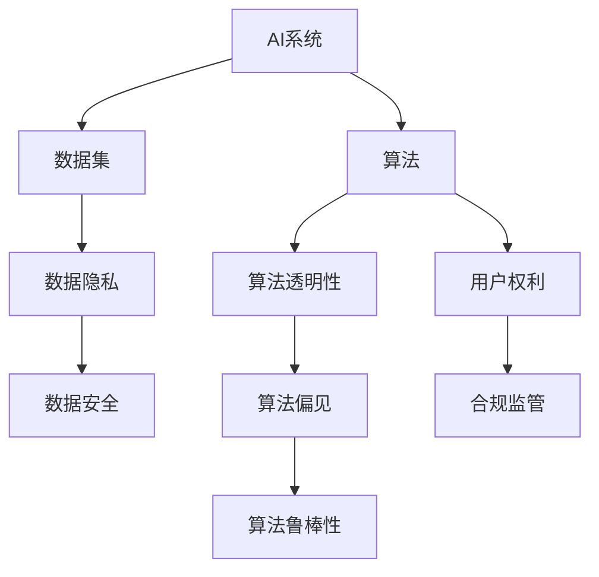

                 

# 人工智能伦理和隐私考虑

> 关键词：人工智能, 伦理, 隐私保护, 数据安全, 算法透明度, 合规监管, 用户权利

## 1. 背景介绍

### 1.1 问题由来

随着人工智能(AI)技术的飞速发展，AI在医疗、金融、教育、交通等多个领域的应用愈加广泛。AI带来的诸多便利和创新，同时也给社会带来了前所未有的伦理和隐私挑战。在AI的决策和应用过程中，如何平衡技术进步与伦理道德、隐私保护，成为了全社会共同关注的重要课题。

在AI的落地应用中，数据隐私、算法透明性、责任归属等问题尤为突出。例如，AI在医疗领域的应用可能涉及患者隐私数据；在金融领域，算法决策的透明性和公平性直接影响金融稳定；在教育领域，AI在学生评估和个性化推荐中的公平性和隐私保护问题也日益凸显。这些问题不仅关乎技术本身，还涉及到法律、政策、伦理等多方面的考量，要求从技术、伦理、法规等多角度进行全面考量。

本文将深入探讨人工智能伦理和隐私保护的相关问题，从算法原理、实践操作、应用场景等多个维度，详细剖析当前存在的挑战和应对措施，以期为AI技术的健康发展提供有益参考。

## 2. 核心概念与联系

### 2.1 核心概念概述

为了更好地理解人工智能伦理和隐私保护，我们需要明确几个关键概念：

- **人工智能(AI)**：指由计算机程序、硬件和数据组成的系统，能够执行通常需要人类智能的任务，如学习、推理、感知、自然语言处理等。
- **算法透明性(Algorithm Transparency)**：指算法的决策过程、输入输出规则、参数设定等是否可被解释和理解。
- **数据隐私(Data Privacy)**：指个人数据的收集、使用、存储、传输等环节中，如何保护数据主体（通常是个人）的隐私权益。
- **数据安全(Data Security)**：指数据在存储和传输过程中，如何防止未经授权的访问、篡改和破坏。
- **算法偏见(Bias)**：指算法在训练和应用过程中，由于数据偏差、设计缺陷等因素，导致对某些群体或个体产生不公正的对待。
- **算法鲁棒性(Robustness)**：指算法在面对异常输入、攻击等情况下，仍能保持稳定的性能和决策。

这些概念之间的逻辑关系可以通过以下Mermaid流程图来展示：



这个流程图展示了AI系统与数据、算法、用户权利、合规监管等概念之间的关联。算法的透明性、偏见、鲁棒性等直接影响AI系统的性能和可信度，而数据隐私、安全、用户权利、合规监管等则从法律、伦理、政策等多方面约束AI系统的使用。

## 3. 核心算法原理 & 具体操作步骤

### 3.1 算法原理概述

在AI伦理和隐私保护中，算法透明性是一个核心问题。算法透明性不仅关乎数据隐私保护，还直接影响算法的公平性、可解释性和可接受度。

算法透明性通常包括算法的决策过程、输入输出规则、参数设定等是否可被解释和理解。在实际应用中，可以通过以下步骤实现算法透明性：

1. **算法说明**：提供算法的原理、工作流程、参数设置等信息，使外部人员能够理解算法的核心工作机制。
2. **决策路径**：详细描述算法的决策路径，展示输入如何转化为输出，帮助用户理解和审查算法的决策过程。
3. **参数可调性**：提供算法的参数设置说明，使用户能够调整算法参数，观察其对输出结果的影响。
4. **结果可解释性**：提供算法的输出结果的解释，说明其背后的逻辑和依据。

### 3.2 算法步骤详解

实现算法透明性的具体操作步骤包括：

1. **设计透明算法**：在算法设计和实现过程中，注重算法可解释性，避免使用过于复杂和黑盒化的技术。例如，使用线性回归、决策树、规则引擎等透明性较高的算法，而非深度神经网络等复杂模型。
2. **记录决策过程**：在算法决策过程中，记录决策路径和参数设置，供用户和监管机构审查。
3. **提供解释接口**：开发易于使用的接口，让用户能够输入数据，观察算法的输出和解释。
4. **进行效果验证**：定期评估算法的输出结果，验证其公平性、一致性和准确性。

### 3.3 算法优缺点

**算法透明性的优点**：

- 提高用户信任度：透明的算法使用户能够理解和接受算法决策，提高系统的可信度和用户满意度。
- 增强法律合规性：透明的算法更容易满足法律和政策的要求，减少法律风险。
- 促进公平性：透明的算法有助于发现和纠正算法偏见，提高算法的公平性和公正性。

**算法透明性的缺点**：

- 影响性能：过于复杂的算法解释会降低算法的性能，增加计算成本。
- 隐私泄露：算法的解释可能涉及敏感数据和参数，存在隐私泄露的风险。
- 操作复杂：透明的算法需要更多的操作和维护，增加技术负担。

### 3.4 算法应用领域

算法透明性在AI的多个领域均有应用：

- **医疗领域**：在诊断和治疗建议中，提供算法决策的透明性和可解释性，帮助医生和患者理解和接受AI的诊断结果。
- **金融领域**：在信贷审批、风险评估中，提供算法的决策依据和影响因素，增强决策透明度，减少歧视性偏见。
- **教育领域**：在学生评估和个性化推荐中，提供算法的评分和推荐依据，帮助学生和教师理解和改进AI系统的决策。

## 4. 数学模型和公式 & 详细讲解  
### 4.1 数学模型构建

在AI伦理和隐私保护中，数学模型主要用于数据隐私和安全保护。常见的数学模型包括：

- **差分隐私(Differential Privacy)**：通过在数据中添加噪声，使得个体数据的加入或离开对模型输出结果的影响很小，从而保护数据隐私。
- **同态加密(Homomorphic Encryption)**：允许在不解密的情况下，对加密数据进行计算，保护数据隐私。
- **多方安全计算(MPC)**：允许多个参与方在不共享各自数据的情况下，协同计算一个共同的结果，保护数据隐私。

### 4.2 公式推导过程

以差分隐私为例，差分隐私的数学公式为：

$$
\mathbb{P}[A(\mathcal{D}) \leq \epsilon] \leq e^{-\epsilon^2/2\delta^2}
$$

其中，$A(\mathcal{D})$为算法输出的结果，$\mathcal{D}$为数据集，$\epsilon$为隐私保护参数，$\delta$为算法可信度参数。

差分隐私的原理是通过在数据集$\mathcal{D}$中引入噪声，使得算法输出$A(\mathcal{D})$对于个体数据的加入或离开对模型输出结果的影响很小。差分隐私的数学推导过程较为复杂，涉及信息论、统计学等多个领域的知识，本文不再展开详细推导。

### 4.3 案例分析与讲解

以下以医疗领域的AI应用为例，讲解差分隐私的应用。

在医疗领域，AI用于疾病诊断和治疗建议时，需要处理大量的患者数据，包括病历、影像、基因信息等。如果这些数据被泄露，可能会对患者的隐私造成严重威胁。

通过差分隐私技术，可以在数据中加入噪声，使得单个患者的加入或离开对模型输出结果的影响很小。例如，在疾病诊断中，使用差分隐私算法处理患者的基因信息，即使攻击者获取了部分基因数据，也难以影响整体的诊断结果。

## 5. 项目实践：代码实例和详细解释说明

### 5.1 开发环境搭建

在实现AI伦理和隐私保护的代码实例之前，首先需要准备开发环境。以下是Python环境搭建的步骤：

1. **安装Python**：从官网下载并安装Python。
2. **安装必要的库**：安装numpy、pandas、scikit-learn等常用库。
3. **安装差分隐私库**：安装差分隐私库，如pydiffpriv。
4. **配置环境变量**：配置环境变量，如PATH、PYTHONPATH等。

### 5.2 源代码详细实现

以下是一个简单的差分隐私算法实现代码：

```python
import numpy as np
from pydiffpriv import DPStochasticLearner

# 生成一个正态分布的数据集
data = np.random.normal(0, 1, (100, 10))

# 定义差分隐私保护参数
epsilon = 0.1
delta = 0.01

# 创建差分隐私学习器
dp_learner = DPStochasticLearner(np.mean, epsilon=epsilon, delta=delta)

# 进行差分隐私处理
result = dp_learner.fit(data)

print(f"差分隐私保护后的均值：{result.mean()}")
```

### 5.3 代码解读与分析

**代码解读**：

1. **数据生成**：使用numpy生成一个10维的正态分布数据集。
2. **差分隐私参数设置**：定义差分隐私的参数$\epsilon$和$\delta$。
3. **创建差分隐私学习器**：使用pydiffpriv库创建差分隐私学习器，指定均值计算函数和隐私保护参数。
4. **差分隐私处理**：使用差分隐私学习器对数据进行处理，得到差分隐私保护后的结果。
5. **结果输出**：输出差分隐私保护后的均值。

**代码分析**：

1. **差分隐私参数**：$\epsilon$和$\delta$是差分隐私的重要参数，$\epsilon$越小，隐私保护越强，但算法效率越低；$\delta$越小，算法可信度越高，但隐私保护越弱。
2. **差分隐私学习器**：差分隐私学习器使用差分隐私技术对数据进行处理，保护数据隐私。
3. **差分隐私处理**：差分隐私处理会引入噪声，使得单个数据的加入或离开对结果的影响很小。

## 6. 实际应用场景

### 6.1 医疗领域

在医疗领域，AI用于疾病诊断和治疗建议时，数据隐私和安全保护尤为关键。通过差分隐私技术，可以在保护患者隐私的前提下，利用AI技术提高诊断和治疗的准确性。

例如，医院可以收集大量患者数据，使用差分隐私技术处理数据，在不泄露患者隐私的前提下，训练AI模型进行疾病诊断。医生可以根据AI模型输出的结果，制定个性化的治疗方案。

### 6.2 金融领域

在金融领域，AI用于信贷审批、风险评估等任务时，算法透明性和数据隐私保护同样重要。通过差分隐私技术，可以保护客户数据隐私，防止数据泄露和滥用。

例如，银行可以使用差分隐私技术处理客户贷款数据，训练AI模型进行风险评估。在审批贷款时，AI模型输出风险评估结果，银行可以根据结果进行决策，同时保护客户隐私。

### 6.3 教育领域

在教育领域，AI用于学生评估和个性化推荐时，算法的透明性和数据隐私保护也很重要。通过差分隐私技术，可以在保护学生隐私的前提下，利用AI技术进行评估和推荐。

例如，学校可以收集学生的学习数据，使用差分隐私技术处理数据，训练AI模型进行学生评估和个性化推荐。教师可以根据AI模型输出的结果，制定教学计划，帮助学生提高学习效果。

## 7. 工具和资源推荐

### 7.1 学习资源推荐

为了深入理解人工智能伦理和隐私保护，推荐以下学习资源：

1. **《人工智能伦理与隐私保护》系列文章**：系统介绍了AI伦理和隐私保护的理论基础和实际应用。
2. **《数据隐私与安全》课程**：介绍数据隐私保护的技术和方法，适合初学者和进阶者。
3. **《AI伦理与政策》书籍**：详细探讨AI伦理和政策的问题，提供系统的理论框架和实践指导。
4. **《差分隐私算法》书籍**：详细介绍差分隐私算法的设计和实现，适合对差分隐私感兴趣的读者。

### 7.2 开发工具推荐

以下是几个常用的开发工具，可用于实现AI伦理和隐私保护：

1. **Jupyter Notebook**：Python编程和数据处理的平台，支持代码交互式执行和可视化。
2. **PyDiffPriv**：Python差分隐私库，提供多种差分隐私算法的实现。
3. **TensorFlow Privacy**：TensorFlow的差分隐私库，支持深度学习模型中的隐私保护。
4. **Google Colab**：Google提供的在线Jupyter Notebook平台，支持GPU和TPU算力，方便快速实验。

### 7.3 相关论文推荐

以下几篇论文详细探讨了AI伦理和隐私保护问题，推荐阅读：

1. **《AI伦理：概念、原则与挑战》**：探讨AI伦理的基本概念、伦理原则和面临的挑战。
2. **《数据隐私保护技术综述》**：系统介绍数据隐私保护的技术和方法，包括差分隐私、同态加密、多方安全计算等。
3. **《AI公平性与算法偏见》**：分析AI算法偏见的原因和影响，提出消除偏见的策略。
4. **《差分隐私：理论基础与算法实现》**：详细介绍差分隐私的理论基础和算法实现。

## 8. 总结：未来发展趋势与挑战

### 8.1 研究成果总结

本文对人工智能伦理和隐私保护进行了全面系统的介绍，主要从算法透明性、差分隐私、数据安全等角度探讨了AI应用中的伦理和隐私问题。通过数学模型和实践代码的详细讲解，为AI技术的健康发展提供了有益参考。

### 8.2 未来发展趋势

未来，人工智能伦理和隐私保护将呈现以下几个发展趋势：

1. **算法透明性**：随着AI技术的发展，越来越多的算法透明性技术将被应用到实际场景中，提高算法的可信度和用户满意度。
2. **隐私保护技术**：差分隐私、同态加密、多方安全计算等隐私保护技术将更加成熟和广泛应用，保护数据隐私。
3. **法律法规**：各国政府和监管机构将制定更为严格的数据隐私和安全保护法律法规，规范AI技术的应用。
4. **伦理标准**：国际组织和标准化机构将制定AI伦理标准，指导AI技术的开发和应用。
5. **用户权利**：用户将获得更多的权利和选择权，能够更好地控制和管理自己的数据。

### 8.3 面临的挑战

尽管AI伦理和隐私保护技术不断进步，但在实现和应用过程中，仍面临诸多挑战：

1. **技术复杂性**：算法透明性和隐私保护技术需要高水平的技术支持和复杂的系统设计。
2. **法规滞后**：现有的法律法规可能难以适应快速发展的AI技术，需要不断更新和完善。
3. **用户接受度**：部分用户对AI技术缺乏了解，难以理解和接受算法的透明性和隐私保护措施。
4. **隐私泄露风险**：数据泄露和滥用仍然是AI应用中面临的重大风险。
5. **伦理困境**：AI算法在决策过程中可能面临伦理困境，如公平性、偏见等。

### 8.4 研究展望

未来，AI伦理和隐私保护的研究需要从技术、法律、伦理等多个角度进行全面探索：

1. **技术优化**：不断优化算法透明性和隐私保护技术，提高算法的可信度和用户满意度。
2. **法律法规完善**：制定和完善AI伦理和隐私保护的法律法规，保障用户权利和数据安全。
3. **伦理标准制定**：制定和推广AI伦理标准，指导AI技术的开发和应用。
4. **用户教育**：加强AI伦理和隐私保护知识的普及和教育，提高用户对AI技术的理解和使用。

## 9. 附录：常见问题与解答

**Q1：什么是AI伦理和隐私保护？**

A: AI伦理和隐私保护是指在AI技术的开发和应用过程中，如何平衡技术进步与伦理道德、隐私保护。主要包括算法透明性、数据隐私、数据安全等方面的考虑。

**Q2：AI伦理和隐私保护的重要意义是什么？**

A: AI伦理和隐私保护的重要意义在于保护用户权利和数据隐私，防止数据滥用和泄露，提高算法的可信度和用户满意度，促进AI技术的健康发展。

**Q3：如何实现AI算法的透明性？**

A: 实现AI算法的透明性通常包括以下步骤：
1. 提供算法原理、工作流程、参数设置等信息。
2. 记录算法的决策路径和参数设置。
3. 开发易于使用的接口，提供解释和输出。

**Q4：差分隐私技术有哪些应用场景？**

A: 差分隐私技术主要应用于数据隐私保护，其应用场景包括：
1. 医疗领域：保护患者隐私，防止数据泄露。
2. 金融领域：保护客户数据，防止数据滥用。
3. 教育领域：保护学生数据，防止数据泄露。

**Q5：AI伦理和隐私保护面临哪些挑战？**

A: AI伦理和隐私保护面临的挑战包括：
1. 技术复杂性：算法透明性和隐私保护技术需要高水平的技术支持和复杂的系统设计。
2. 法规滞后：现有的法律法规可能难以适应快速发展的AI技术。
3. 用户接受度：部分用户对AI技术缺乏了解，难以理解和接受算法的透明性和隐私保护措施。
4. 隐私泄露风险：数据泄露和滥用仍然是AI应用中面临的重大风险。
5. 伦理困境：AI算法在决策过程中可能面临伦理困境，如公平性、偏见等。

**Q6：未来AI伦理和隐私保护的研究方向有哪些？**

A: 未来AI伦理和隐私保护的研究方向包括：
1. 技术优化：不断优化算法透明性和隐私保护技术。
2. 法律法规完善：制定和完善AI伦理和隐私保护的法律法规。
3. 伦理标准制定：制定和推广AI伦理标准。
4. 用户教育：加强AI伦理和隐私保护知识的普及和教育。

---

作者：禅与计算机程序设计艺术 / Zen and the Art of Computer Programming

