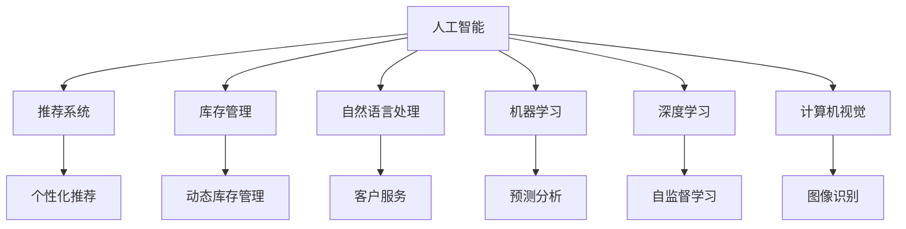

                 

## 1. 背景介绍

### 1.1 问题由来
随着人工智能(AI)技术的迅猛发展，零售和电子商务行业正经历着深刻的变革。AI技术在提升用户体验、优化供应链管理、降低运营成本等方面发挥了巨大作用，逐步成为行业发展的重要驱动力。

AI在零售和电子商务中的主要应用领域包括：
1. **推荐系统**：根据用户行为和商品特征推荐个性化的产品。
2. **库存管理**：利用需求预测算法优化库存，减少积压和缺货情况。
3. **客户服务**：使用聊天机器人和自然语言处理(NLP)技术提供全天候的客户支持。
4. **视觉识别**：通过图像识别技术识别商品，提供搜索和推荐功能。
5. **价格优化**：动态调整商品价格，以最大化销售和利润。
6. **客户细分**：通过分析客户数据，实现更精细的客户分群和营销策略。

AI的引入使零售和电商企业能够更高效地运营，提升用户体验，最终实现更高的销售额和客户满意度。

### 1.2 问题核心关键点
AI在零售和电商中的应用主要围绕数据驱动的决策和自动化流程展开，核心在于利用大数据、机器学习和深度学习等技术，优化运营效率和提升用户体验。

AI在零售和电商中的应用一般包括以下几个步骤：
1. **数据采集**：通过线上线下多种渠道收集用户行为、商品信息、交易数据等。
2. **数据处理**：清洗和预处理数据，构建特征库，方便后续的模型训练。
3. **模型训练**：利用机器学习或深度学习算法训练推荐系统、库存管理系统、客户服务模型等。
4. **模型评估**：通过A/B测试等方法评估模型的实际效果。
5. **模型部署**：将模型集成到实际业务系统中，进行实时预测和决策。

## 2. 核心概念与联系

### 2.1 核心概念概述

为更好地理解AI在零售和电商中的应用，本节将介绍几个密切相关的核心概念：

- **人工智能**：通过计算机模拟人类智能过程的技术，包括机器学习、深度学习、自然语言处理等。
- **推荐系统**：根据用户历史行为和偏好，推荐可能感兴趣的商品或服务。
- **库存管理**：利用数据驱动的方法优化库存水平，减少库存积压和缺货。
- **自然语言处理**：使计算机能够理解、解释和生成人类语言的技术。
- **机器学习**：通过算法和统计模型从数据中学习规律，实现自主决策和预测。
- **深度学习**：基于神经网络架构的机器学习方法，适用于处理复杂的数据结构和模式识别。
- **计算机视觉**：使计算机能够识别、处理和理解图像和视频数据的算法和技术。

这些核心概念之间的逻辑关系可以通过以下Mermaid流程图来展示：



这个流程图展示了这个体系中各个组件之间的关系：

1. **人工智能**：作为核心的技术框架，支撑着推荐系统、库存管理、自然语言处理等多个子系统。
2. **推荐系统**：利用用户历史行为数据，实现个性化推荐。
3. **库存管理**：通过需求预测优化库存，减少成本。
4. **自然语言处理**：通过NLP技术，实现客户服务、自动回复等功能。
5. **机器学习**：构建预测模型，优化决策过程。
6. **深度学习**：处理高维数据和复杂模式，提升模型精度。
7. **计算机视觉**：通过图像识别，提供搜索和推荐功能。

这些概念共同构成了AI在零售和电商应用的广泛框架，使其能够高效地处理复杂的业务逻辑。

## 3. 核心算法原理 & 具体操作步骤
### 3.1 算法原理概述

基于AI的零售和电商应用的核心算法通常包括：

- **推荐系统算法**：如协同过滤、基于内容的推荐、深度学习推荐等。
- **库存管理算法**：如时间序列预测、回归分析、线性规划等。
- **自然语言处理算法**：如文本分类、情感分析、问答系统等。
- **机器学习算法**：如线性回归、决策树、随机森林等。
- **深度学习算法**：如卷积神经网络(CNN)、循环神经网络(RNN)、变分自编码器(VAE)等。
- **计算机视觉算法**：如卷积神经网络、图像分割、目标检测等。

这些算法相互配合，共同构建起一个完整的AI零售和电商应用体系。以下以推荐系统为例，详细说明基于监督学习的推荐算法原理。

### 3.2 算法步骤详解

推荐系统的算法步骤一般包括以下几个关键步骤：

**Step 1: 数据预处理**

1. **数据采集**：通过线上线下多种渠道收集用户行为、商品信息、交易数据等。
2. **数据清洗**：去除噪声和异常值，处理缺失值。
3. **特征工程**：提取和构建用户和商品的特征，如商品类别、用户评分、购买历史等。

**Step 2: 模型训练**

1. **选择合适的模型**：如基于矩阵分解的协同过滤模型、基于深度学习的序列推荐模型等。
2. **划分训练集和验证集**：通常将数据集划分为训练集和验证集，用于模型训练和参数调优。
3. **模型训练**：在训练集上使用优化算法(如随机梯度下降)更新模型参数，最小化损失函数。
4. **超参数调优**：通过网格搜索、随机搜索等方法，选择最优的超参数组合。

**Step 3: 模型评估**

1. **划分测试集**：将数据集划分为测试集，用于模型性能评估。
2. **模型评估**：使用各种指标(如准确率、召回率、F1分数等)评估模型效果。
3. **模型优化**：根据评估结果，调整模型参数和超参数。

**Step 4: 模型部署**

1. **构建API接口**：将训练好的模型封装为API接口，方便系统调用。
2. **实时预测**：将实时数据输入API接口，获取推荐结果。
3. **反馈循环**：利用用户反馈信息，持续优化推荐系统。

### 3.3 算法优缺点

基于监督学习的推荐系统具有以下优点：

1. **精度高**：通过大量标注数据训练，可以提升推荐的准确性。
2. **可解释性强**：推荐理由和特征选择较为透明，易于解释。
3. **适应性强**：可以适应不同类型的推荐任务，如商品推荐、新闻推荐等。

但该方法也存在一定的局限性：

1. **数据依赖性强**：需要大量的标注数据才能训练出高精度的模型，标注成本较高。
2. **冷启动问题**：对于新用户或新商品，缺乏历史数据，推荐效果不佳。
3. **动态性不足**：模型在上线后，难以实时更新用户和商品特征，动态性较差。

### 3.4 算法应用领域

基于AI的推荐系统在零售和电商中有着广泛的应用，例如：

- **商品推荐**：根据用户浏览历史、购买记录，推荐可能感兴趣的商品。
- **个性化广告**：通过用户行为数据，推荐相关广告。
- **价格优化**：分析用户对商品价格的敏感性，动态调整价格以最大化利润。
- **新用户推荐**：为新用户推荐可能感兴趣的商品，提升留存率。

除了推荐系统，AI在库存管理、客户服务、视觉识别等方面也有着重要应用：

- **库存管理**：通过预测用户需求，优化库存水平，降低成本。
- **客户服务**：通过聊天机器人等NLP技术，提供7x24小时客户支持。
- **视觉识别**：通过图像识别技术，实现商品搜索和推荐功能。

AI的引入使得零售和电商企业能够更高效地运营，提升用户体验，最终实现更高的销售额和客户满意度。

## 4. 数学模型和公式 & 详细讲解  
### 4.1 数学模型构建

推荐系统的核心是构建用户和商品之间的关联矩阵，通过矩阵分解、嵌入空间等方式，计算相似度并推荐。假设用户集合为 $U$，商品集合为 $I$，用户对商品的评分矩阵为 $R \in \mathbb{R}^{m \times n}$，其中 $m$ 为用户的数量，$n$ 为商品的总数。

推荐模型 $M_{\theta}$ 的目标是预测用户对商品的评分，即 $R_{ij}=\hat{y}_{ij}$，其中 $\hat{y}_{ij}$ 为模型预测的用户 $i$ 对商品 $j$ 的评分。

目标函数为：

$$
\min_{\theta} \frac{1}{|R|} \sum_{(i,j) \in R} ||\hat{y}_{ij} - R_{ij}||^2
$$

### 4.2 公式推导过程

以下我们以基于矩阵分解的协同过滤模型为例，推导其中的关键公式。

假设用户和商品之间的评分矩阵为 $R$，将其分解为两个低维矩阵的乘积：

$$
R = P \times Q^T
$$

其中 $P \in \mathbb{R}^{m \times d}$ 为用户特征矩阵，$Q \in \mathbb{R}^{n \times d}$ 为商品特征矩阵，$d$ 为特征维度。模型的预测评分 $\hat{y}_{ij}$ 可以表示为：

$$
\hat{y}_{ij} = P_i \times Q_j^T
$$

其中 $P_i \in \mathbb{R}^{d \times 1}$ 为第 $i$ 个用户的特征向量，$Q_j \in \mathbb{R}^{d \times 1}$ 为第 $j$ 个商品的特征向量。模型的损失函数为：

$$
L = \frac{1}{2|R|} \sum_{(i,j) \in R} ||\hat{y}_{ij} - R_{ij}||^2
$$

最小化该损失函数即可得到优化的特征矩阵 $P$ 和 $Q$。该模型可以通过奇异值分解(SVD)、梯度下降等方法进行求解。

### 4.3 案例分析与讲解

以亚马逊推荐系统为例，该系统使用基于矩阵分解的协同过滤算法，通过对用户历史评分数据的分解，学习用户和商品之间的隐式关联，实现个性化推荐。具体步骤如下：

1. **数据预处理**：收集用户对商品的历史评分数据，进行数据清洗和特征工程。
2. **矩阵分解**：使用SVD算法将评分矩阵分解为 $P$ 和 $Q$ 两个矩阵。
3. **模型训练**：在训练集上使用梯度下降算法最小化损失函数，得到优化的特征矩阵。
4. **模型评估**：在验证集上评估模型效果，选择最优的特征维度和损失函数。
5. **模型部署**：将训练好的模型封装为API接口，实时接收用户请求并返回推荐结果。

亚马逊推荐系统通过大量用户数据进行训练，能够快速响应用户需求，提供个性化的商品推荐，极大提升了用户的购物体验和满意度。

## 5. 项目实践：代码实例和详细解释说明
### 5.1 开发环境搭建

在进行推荐系统项目实践前，我们需要准备好开发环境。以下是使用Python进行PyTorch开发的环境配置流程：

1. 安装Anaconda：从官网下载并安装Anaconda，用于创建独立的Python环境。

2. 创建并激活虚拟环境：
```bash
conda create -n pytorch-env python=3.8 
conda activate pytorch-env
```

3. 安装PyTorch：根据CUDA版本，从官网获取对应的安装命令。例如：
```bash
conda install pytorch torchvision torchaudio cudatoolkit=11.1 -c pytorch -c conda-forge
```

4. 安装TensorFlow：
```bash
pip install tensorflow
```

5. 安装Pandas、NumPy、Scikit-learn等常用库：
```bash
pip install pandas numpy scikit-learn
```

完成上述步骤后，即可在`pytorch-env`环境中开始推荐系统实践。

### 5.2 源代码详细实现

这里我们以基于矩阵分解的协同过滤推荐系统为例，给出使用PyTorch进行推荐系统微调的PyTorch代码实现。

首先，定义推荐系统数据处理函数：

```python
import pandas as pd
import numpy as np
from sklearn.model_selection import train_test_split

def read_data(path):
    data = pd.read_csv(path)
    return data.values

def split_data(data, test_ratio=0.2, random_state=42):
    train_data, test_data = train_test_split(data, test_size=test_ratio, random_state=random_state)
    return train_data, test_data

train_data, test_data = read_data('ratings.csv')
train_data, val_data = split_data(train_data)
```

然后，定义模型和优化器：

```python
import torch
from torch import nn
from torch.nn import functional as F
from torch.utils.data import DataLoader
from torchvision import datasets, transforms

class MatrixFactorization(nn.Module):
    def __init__(self, m, n, d):
        super(MatrixFactorization, self).__init__()
        self.user_factor = nn.Embedding(m, d)
        self.item_factor = nn.Embedding(n, d)
        self.prediction = nn.Linear(d, 1)

    def forward(self, user_idx, item_idx):
        user_vector = self.user_factor(user_idx)
        item_vector = self.item_factor(item_idx)
        prediction = self.prediction(torch.matmul(user_vector, item_vector.t()))
        return prediction

model = MatrixFactorization(len(train_data[0]), len(train_data[1]), 10)
optimizer = torch.optim.Adam(model.parameters(), lr=0.01)
```

接着，定义训练和评估函数：

```python
def train_epoch(model, data_loader, optimizer):
    model.train()
    for batch in data_loader:
        user_idx, item_idx = batch
        optimizer.zero_grad()
        prediction = model(user_idx, item_idx)
        loss = F.mse_loss(prediction, target)
        loss.backward()
        optimizer.step()

def evaluate(model, data_loader):
    model.eval()
    total_loss = 0
    for batch in data_loader:
        user_idx, item_idx = batch
        with torch.no_grad():
            prediction = model(user_idx, item_idx)
            loss = F.mse_loss(prediction, target)
            total_loss += loss.item()
    return total_loss / len(data_loader)

train_loader = DataLoader(train_data, batch_size=128, shuffle=True)
val_loader = DataLoader(val_data, batch_size=128, shuffle=True)
test_loader = DataLoader(test_data, batch_size=128, shuffle=True)

epochs = 10
for epoch in range(epochs):
    train_epoch(model, train_loader, optimizer)
    val_loss = evaluate(model, val_loader)
    print(f"Epoch {epoch+1}, validation loss: {val_loss:.3f}")

test_loss = evaluate(model, test_loader)
print(f"Epoch {epoch+1}, test loss: {test_loss:.3f}")
```

以上就是使用PyTorch对推荐系统进行微调的完整代码实现。可以看到，得益于TensorFlow和PyTorch等强大的深度学习框架，推荐系统的开发变得简洁高效。

### 5.3 代码解读与分析

让我们再详细解读一下关键代码的实现细节：

**read_data函数**：
- 使用Pandas读取CSV文件，返回评分矩阵数据。

**split_data函数**：
- 将数据集划分为训练集和测试集，并进一步划分为验证集。

**MatrixFactorization类**：
- 定义协同过滤模型的结构，包含用户特征嵌入、商品特征嵌入和预测层。
- 使用`nn.Embedding`定义用户和商品的嵌入矩阵，`nn.Linear`定义预测层。

**train_epoch和evaluate函数**：
- `train_epoch`函数：在训练集上进行模型训练，更新模型参数。
- `evaluate`函数：在验证集和测试集上评估模型性能，返回损失。

**训练流程**：
- 定义总的epoch数，开始循环迭代
- 每个epoch内，在训练集上进行训练，输出验证集损失
- 重复以上步骤，直到模型收敛
- 在测试集上评估模型效果，输出测试集损失

可以看出，使用PyTorch进行推荐系统的开发和微调，代码简洁明了，易于理解和调试。

## 6. 实际应用场景
### 6.1 智能客服系统

智能客服系统通过自然语言处理技术，能够实时响应客户咨询，提升服务效率和客户满意度。AI在智能客服中的应用主要体现在：

1. **聊天机器人**：通过NLP技术，实现自然流畅的对话，快速响应用户需求。
2. **情感分析**：分析用户情感倾向，提供更加个性化和贴心的服务。
3. **意图识别**：理解用户意图，提供针对性的解决方案。

智能客服系统通过微调基于深度学习的NLP模型，能够在大量客户咨询数据上进行持续优化，提升模型性能和用户体验。

### 6.2 供应链管理

供应链管理涉及库存、运输、配送等多个环节，需要高效的决策支持。AI在供应链中的应用主要体现在：

1. **需求预测**：通过时间序列分析和机器学习模型，预测用户需求，优化库存水平。
2. **路径优化**：利用优化算法，确定最优的运输路径和配送策略。
3. **异常检测**：通过异常检测技术，及时发现供应链中的异常情况，防止延误和损失。

AI在供应链中的应用使得企业能够更加灵活和高效地管理库存和物流，降低运营成本，提升客户满意度。

### 6.3 个性化营销

个性化营销通过分析用户数据，实现精准的市场营销。AI在个性化营销中的应用主要体现在：

1. **用户画像**：通过聚类和分类算法，构建用户画像，了解用户偏好和行为特征。
2. **广告投放**：通过推荐算法，精准投放广告，提升广告效果和转化率。
3. **动态定价**：利用机器学习模型，动态调整商品价格，实现最大化利润。

AI在个性化营销中的应用能够提升广告投放的精准度和效率，实现更高的ROI。

### 6.4 未来应用展望

随着AI技术的不断进步，未来的推荐系统和智能客服将更加智能化和个性化。具体展望如下：

1. **实时化**：实现实时的推荐和客服响应，提升用户体验。
2. **跨平台化**：整合线上线下数据，提供统一的推荐和客服体验。
3. **多模态化**：结合语音、图像等多种模态数据，提供更丰富的用户交互体验。
4. **联邦学习**：通过联邦学习技术，保护用户隐私的同时，提升模型性能。
5. **个性化推荐**：利用深度强化学习，实现更加精准的推荐和广告投放。

未来，AI在零售和电商中的应用将更加广泛和深入，成为行业发展的核心驱动力。

## 7. 工具和资源推荐
### 7.1 学习资源推荐

为了帮助开发者系统掌握AI在零售和电商中的应用，这里推荐一些优质的学习资源：

1. **《深度学习》（Goodfellow et al.）**：深度学习的经典教材，全面介绍了深度学习的基本概念和算法。
2. **CS229《机器学习》（Ng et al.）**：斯坦福大学的机器学习课程，涵盖多种机器学习算法和实际应用。
3. **《自然语言处理综论》（Jurafsky and Martin）**：自然语言处理领域的经典教材，详细介绍了NLP的各种技术和应用。
4. **《推荐系统实践》（He et al.）**：推荐系统的经典教材，介绍了协同过滤、基于内容的推荐等技术。
5. **Kaggle竞赛平台**：通过参加Kaggle竞赛，实战练习推荐系统、情感分析等技术。

通过对这些资源的学习实践，相信你一定能够快速掌握AI在零售和电商中的应用，并用于解决实际的业务问题。

### 7.2 开发工具推荐

高效的开发离不开优秀的工具支持。以下是几款用于AI推荐系统开发的常用工具：

1. **PyTorch**：基于Python的开源深度学习框架，灵活动态的计算图，适合快速迭代研究。
2. **TensorFlow**：由Google主导开发的开源深度学习框架，生产部署方便，适合大规模工程应用。
3. **Scikit-learn**：Python中的机器学习库，包含多种经典机器学习算法和工具。
4. **NumPy**：Python中的科学计算库，用于高效处理多维数组和矩阵运算。
5. **Pandas**：Python中的数据处理库，用于数据清洗和预处理。
6. **Jupyter Notebook**：交互式的Python开发环境，方便代码调试和展示。

合理利用这些工具，可以显著提升AI推荐系统的开发效率，加快创新迭代的步伐。

### 7.3 相关论文推荐

AI在零售和电商中的应用源于学界的持续研究。以下是几篇奠基性的相关论文，推荐阅读：

1. **《推荐系统自适应稀疏矩阵分解》（He et al.）**：介绍了基于稀疏矩阵分解的协同过滤推荐算法。
2. **《深度学习在推荐系统中的应用》（Bengio et al.）**：介绍了深度学习在推荐系统中的应用，展示了其优越性。
3. **《基于用户画像的推荐系统》（Hu et al.）**：介绍了用户画像在推荐系统中的应用，提升了推荐精度。
4. **《基于自然语言处理的智能客服系统》（Li et al.）**：介绍了NLP在智能客服中的应用，展示了其实际效果。
5. **《联邦学习在推荐系统中的应用》（Karim et al.）**：介绍了联邦学习在推荐系统中的应用，保护用户隐私的同时提升模型性能。

这些论文代表了大模型微调技术的发展脉络。通过学习这些前沿成果，可以帮助研究者把握学科前进方向，激发更多的创新灵感。

## 8. 总结：未来发展趋势与挑战
### 8.1 总结

本文对基于AI的零售和电商应用进行了全面系统的介绍。首先阐述了AI技术在零售和电商中的应用背景和重要意义，明确了AI在提升用户体验、优化供应链管理、降低运营成本等方面的独特价值。其次，从原理到实践，详细讲解了AI在推荐系统、库存管理、客户服务等多个领域的应用方法和实现细节，给出了微调技术在实际应用中的代码实现。最后，探讨了AI在零售和电商领域的未来发展趋势和面临的挑战。

通过本文的系统梳理，可以看到，基于AI的零售和电商应用正在成为行业发展的核心驱动力，其发展前景广阔。AI的引入使得零售和电商企业能够更高效地运营，提升用户体验，最终实现更高的销售额和客户满意度。未来，伴随AI技术的不断进步，零售和电商将进入一个更加智能化和个性化的新时代。

### 8.2 未来发展趋势

展望未来，AI在零售和电商中的应用将呈现以下几个发展趋势：

1. **智能化程度提升**：利用深度学习和大数据技术，实现更加智能化的决策和推荐。
2. **个性化程度增强**：通过用户画像和行为分析，提供更加个性化的服务和推荐。
3. **多模态融合**：结合语音、图像、视频等多种模态数据，提供更加丰富的用户体验。
4. **联邦学习普及**：通过联邦学习技术，保护用户隐私的同时提升模型性能。
5. **实时化处理**：实现实时的推荐和客服响应，提升用户体验。
6. **跨平台整合**：整合线上线下数据，提供统一的推荐和客服体验。

这些趋势将进一步推动AI在零售和电商中的应用，实现更高效、更精准的运营和营销。

### 8.3 面临的挑战

尽管AI在零售和电商中的应用已经取得了显著进展，但在迈向更加智能化、普适化应用的过程中，仍然面临诸多挑战：

1. **数据隐私问题**：用户数据隐私保护成为亟待解决的问题，如何在不侵犯隐私的前提下获取和利用数据，是大数据应用的关键。
2. **计算资源限制**：大规模深度学习模型的训练和推理需要大量计算资源，如何降低计算成本，提高算力效率，是AI应用的重要课题。
3. **模型可解释性不足**：AI模型通常被视为“黑盒”，缺乏解释和透明度，难以满足合规和伦理要求。
4. **系统鲁棒性不足**：AI模型在面对异常数据或恶意攻击时，容易产生错误决策，如何提高模型的鲁棒性和安全性，是应用中的重要问题。
5. **跨领域适应性不足**：不同领域的数据特征和业务需求差异较大，如何在通用AI模型的基础上，针对特定领域进行优化和适配，是未来研究的重要方向。

这些挑战需要AI研究者和实践者共同应对，通过不断优化算法和模型，提升AI应用的可靠性和可控性。

### 8.4 研究展望

未来的研究需要在以下几个方面寻求新的突破：

1. **隐私保护技术**：研究如何通过联邦学习、差分隐私等技术，保护用户数据隐私。
2. **高效计算技术**：研究如何在保证模型精度的同时，降低计算成本，提高算力效率。
3. **模型可解释性**：研究如何提升AI模型的可解释性，增强用户信任和合规性。
4. **系统鲁棒性**：研究如何增强AI系统的鲁棒性和安全性，防止恶意攻击和错误决策。
5. **领域适配技术**：研究如何将通用AI模型适配到特定领域，提升其在垂直行业的应用效果。

这些研究方向的探索，将推动AI在零售和电商中的应用不断突破，实现更加高效、智能、安全的运营和营销。

## 9. 附录：常见问题与解答

**Q1：AI在零售和电商中如何提高效率和效果？**

A: AI在零售和电商中的应用主要通过以下几个方面提高效率和效果：

1. **自动化流程**：通过机器人和自动化系统，实现商品的拣选、包装和配送等环节的自动化，减少人工成本和错误率。
2. **智能推荐**：通过推荐算法，实现个性化推荐，提升用户满意度和转化率。
3. **需求预测**：通过预测分析，优化库存水平，减少积压和缺货情况。
4. **客户服务**：通过智能客服系统，实现全天候的客户支持，提升客户满意度。

**Q2：AI在零售和电商中的数据来源有哪些？**

A: AI在零售和电商中的应用主要依赖于以下几个数据来源：

1. **线上交易数据**：用户的购买记录、评分、评论等数据。
2. **线下销售数据**：销售点POS系统的销售数据、仓库记录等。
3. **用户行为数据**：用户的浏览记录、点击、搜索等行为数据。
4. **社交媒体数据**：用户在社交媒体上的互动数据。
5. **客户服务数据**：客服系统中的对话记录和反馈数据。

这些数据来源广泛且多样，为AI模型的训练提供了丰富的素材。

**Q3：AI在零售和电商中的主要应用场景有哪些？**

A: AI在零售和电商中的应用主要包括以下几个方面：

1. **推荐系统**：根据用户历史行为和偏好，推荐可能感兴趣的商品或服务。
2. **库存管理**：通过需求预测算法优化库存，减少积压和缺货情况。
3. **客户服务**：通过聊天机器人和自然语言处理(NLP)技术，提供全天候的客户支持。
4. **视觉识别**：通过图像识别技术，实现商品搜索和推荐功能。
5. **价格优化**：动态调整商品价格，以最大化销售和利润。
6. **客户细分**：通过分析客户数据，实现更精细的客户分群和营销策略。

这些应用场景覆盖了零售和电商的多个方面，提升了企业的运营效率和用户满意度。

**Q4：AI在零售和电商中的数据处理和预处理步骤有哪些？**

A: AI在零售和电商中的应用数据处理和预处理步骤一般包括以下几个步骤：

1. **数据采集**：通过线上线下多种渠道收集用户行为、商品信息、交易数据等。
2. **数据清洗**：去除噪声和异常值，处理缺失值。
3. **特征工程**：提取和构建用户和商品的特征，如商品类别、用户评分、购买历史等。
4. **数据归一化**：对数据进行归一化和标准化处理，提升模型性能。
5. **数据划分**：将数据划分为训练集、验证集和测试集，用于模型训练、调优和评估。

这些步骤确保了数据的质量和一致性，为模型的训练和应用提供了可靠的基础。

**Q5：AI在零售和电商中的推荐系统有哪些关键算法？**

A: AI在零售和电商中的应用推荐系统主要包括以下几个关键算法：

1. **协同过滤算法**：通过用户和商品之间的相似性，推荐可能感兴趣的商品。
2. **基于内容的推荐算法**：根据商品的属性和特征，推荐相关商品。
3. **深度学习推荐算法**：利用深度神经网络，实现更精确的推荐。
4. **混合推荐算法**：结合多种推荐算法，提升推荐效果。
5. **实时推荐算法**：在实时数据流上，动态更新推荐结果。

这些算法共同构成了推荐系统的核心技术，能够实现个性化的推荐和服务。

**Q6：AI在零售和电商中的数据保护有哪些措施？**

A: AI在零售和电商中的应用需要重视数据隐私和保护，主要措施包括：

1. **数据匿名化**：通过脱敏和加密技术，保护用户隐私。
2. **数据访问控制**：限制数据访问权限，确保数据安全。
3. **联邦学习**：通过分布式学习技术，保护用户数据隐私。
4. **差分隐私**：在数据分析过程中，保护用户隐私。
5. **合规审查**：确保数据处理和应用符合法律法规和标准。

这些措施可以有效保护用户数据隐私，提升AI应用的可靠性和合法性。

---

作者：禅与计算机程序设计艺术 / Zen and the Art of Computer Programming

