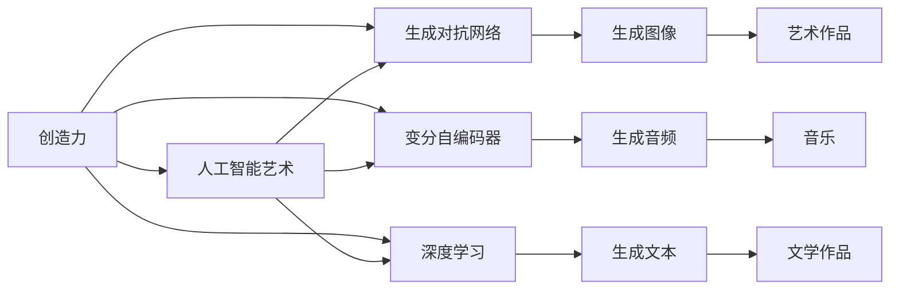

                 

# 人工智能艺术：创造力和表达

## 1. 背景介绍

### 1.1 问题由来

在人工智能领域，创造力被看作是一种高级能力，它超越了简单的规则遵循和数据匹配，能够产生新颖、独特的解决方案。这种能力不仅限于机器人的行为，更体现在机器学习算法、数据处理技术的深度和广度。近年来，随着深度学习和大数据的兴起，人们开始探讨如何将创造力引入到机器学习模型中，实现更为智能、灵活的输出。

人工智能艺术，则是将这种创造力具体化、视觉化的体现，通过生成图像、音乐、文学作品等方式，展示了AI在创造性表达方面的潜力。它不仅仅是技术的展示，更是对人机交互、情感表达、艺术理念的深刻思考。

### 1.2 问题核心关键点

人工智能艺术的核心在于机器如何理解和模仿人类创造力的过程。这涉及到以下几个关键点：

- **创造力的定义**：人工智能艺术如何理解和模仿创造力的定义？
- **创造力的实现**：通过什么方法让机器产生创造性输出？
- **创造力的评估**：如何量化和评价创造性输出的质量和创新性？
- **创造力的应用**：艺术创作在哪些领域具有潜力和应用？

本文将从这些核心关键点出发，探讨人工智能艺术在创造力和表达方面的原理、技术和应用。

## 2. 核心概念与联系

### 2.1 核心概念概述

1. **人工智能艺术(AI Art)**：指通过人工智能技术，如深度学习、生成对抗网络(GAN)、变分自编码器(VAE)等，自动生成艺术作品的过程。其核心是创造力的机器表达。

2. **创造力(Creativity)**：指通过新颖、独特、非规则化的思考和行动产生有价值的新想法和解决方案的能力。在艺术中，创造力体现在表达、构思和形式创新上。

3. **生成对抗网络(GAN)**：一种由生成器和判别器组成的模型，生成器尝试生成尽可能逼真的数据样本，判别器则尝试区分生成数据和真实数据。通过这两者的对抗训练，可以生成高质量的图像、视频等艺术作品。

4. **变分自编码器(VAE)**：一种生成模型，通过学习数据的高维分布，生成新的数据样本。VAE在生成图像、音频、文本等领域均有应用。

5. **深度学习(Deep Learning)**：一种基于神经网络的机器学习技术，通过多层非线性变换学习数据的复杂特征，具有强大的模式识别和生成能力。

这些核心概念构成了人工智能艺术的技术基础，通过这些技术可以实现将创造力引入机器学习模型的目标。

### 2.2 核心概念原理和架构的 Mermaid 流程图



这个流程图展示了创造力如何通过不同技术路径转化为人工智能艺术的过程。

## 3. 核心算法原理 & 具体操作步骤

### 3.1 算法原理概述

人工智能艺术的核心算法包括生成对抗网络(GAN)、变分自编码器(VAE)和深度学习模型。这些算法通过学习数据的分布特性，生成逼真的、具有创造性的艺术作品。

#### 3.1.1 GAN

GAN由生成器$G$和判别器$D$两个网络组成，分别生成假数据和区分真实数据和假数据。GAN的训练过程为：

1. 生成器$G$尝试生成与真实数据尽可能接近的假数据。
2. 判别器$D$尝试区分真实数据和假数据。
3. 生成器$G$和判别器$D$进行对抗训练，生成器希望欺骗判别器，判别器希望准确区分真实数据和假数据。
4. 经过多轮对抗训练后，生成器可以生成高质量的、逼真的数据样本。

#### 3.1.2 VAE

VAE通过学习数据的概率分布，生成新的数据样本。VAE包含编码器$E$和解码器$D$：

1. 编码器$E$将输入数据压缩成一个低维表示$z$。
2. 解码器$D$将低维表示$z$重构回原始数据$x$。
3. 通过训练编码器和解码器，使得重构误差最小化，并生成新的数据样本$z'$。

#### 3.1.3 深度学习

深度学习模型通过多层神经网络进行特征提取和生成，可以生成高质量的艺术作品。深度学习模型包括卷积神经网络(CNN)、循环神经网络(RNN)、变分自编码器(VAE)等。这些模型通过学习数据的特征，生成新的、具有创意的数据样本。

### 3.2 算法步骤详解

#### 3.2.1 GAN的训练步骤

1. **初始化网络**：定义生成器$G$和判别器$D$的初始参数。
2. **生成器训练**：随机生成一批数据$x$，送入生成器$G$生成假数据$x'$。
3. **判别器训练**：分别将真实数据$x$和假数据$x'$送入判别器$D$，计算损失。
4. **对抗训练**：交替更新生成器$G$和判别器$D$的参数，使得生成器能够生成高质量的假数据，判别器能够准确区分真实数据和假数据。
5. **生成新数据**：使用训练好的生成器$G$生成新的数据样本，这些样本可以作为艺术作品。

#### 3.2.2 VAE的训练步骤

1. **初始化网络**：定义编码器$E$和解码器$D$的初始参数。
2. **编码器训练**：将一批数据$x$送入编码器$E$，生成低维表示$z$。
3. **解码器训练**：将低维表示$z$送入解码器$D$，生成重构数据$x'$。
4. **损失计算**：计算重构误差和潜变量$p(z|x)$，使得生成的新数据样本与原数据样本分布尽可能接近。
5. **生成新数据**：通过采样$p(z)$生成新的低维表示$z'$，再通过解码器$D$生成新的数据样本，作为艺术作品。

#### 3.2.3 深度学习模型的训练步骤

1. **初始化网络**：定义神经网络的初始参数。
2. **数据预处理**：对输入数据进行标准化、归一化等预处理。
3. **前向传播**：将输入数据送入神经网络，计算输出。
4. **损失计算**：计算输出与真实标签的损失。
5. **反向传播**：通过反向传播更新神经网络的参数。
6. **生成新数据**：使用训练好的神经网络生成新的数据样本，作为艺术作品。

### 3.3 算法优缺点

#### 3.3.1 GAN的优缺点

**优点**：
1. 生成高质量的假数据，可以用于各种应用领域。
2. 生成的数据样本具有较高的创意性和逼真度。
3. 生成器可以不断改进，生成更高质量的数据样本。

**缺点**：
1. 训练过程不稳定，容易出现模式崩溃。
2. 生成器可能会过拟合训练数据，产生不合理的输出。
3. 生成器与判别器对抗训练复杂，需要大量计算资源。

#### 3.3.2 VAE的优缺点

**优点**：
1. 生成的数据样本具有多样性和随机性。
2. 模型简单，训练稳定。
3. 可以生成连续的数据样本，如音频、视频等。

**缺点**：
1. 生成样本的质量取决于编码器和解码器的质量。
2. 生成的数据样本可能存在一定的模糊性。
3. 生成的数据样本难以控制，可能存在不合理的情况。

#### 3.3.3 深度学习的优缺点

**优点**：
1. 可以生成高质量的数据样本，逼真度高。
2. 模型的应用领域广泛，如图像、音频、文本等。
3. 模型的训练过程稳定，收敛快。

**缺点**：
1. 需要大量的数据和计算资源。
2. 模型结构复杂，训练过程耗时。
3. 模型可能存在过拟合问题，需要正则化等措施。

### 3.4 算法应用领域

人工智能艺术的应用领域非常广泛，主要包括以下几个方面：

1. **图像生成**：生成逼真的图像作品，用于艺术创作、广告、游戏等领域。
2. **音乐生成**：生成逼真的音乐作品，用于音乐创作、娱乐、游戏等领域。
3. **文学创作**：生成有创意的文学作品，用于小说、诗歌、剧本等领域。
4. **视频制作**：生成逼真的视频作品，用于电影、广告、动画等领域。
5. **虚拟现实(VR)**：生成逼真的虚拟环境，用于游戏、教育、旅游等领域。

这些应用领域展示了人工智能艺术在实际应用中的巨大潜力和价值。

## 4. 数学模型和公式 & 详细讲解 & 举例说明

### 4.1 数学模型构建

#### 4.1.1 GAN模型

GAN模型由生成器$G$和判别器$D$两个网络组成。生成器$G$尝试生成逼真的数据样本$x'$，判别器$D$尝试区分真实数据$x$和生成数据$x'$。模型的损失函数为：

$$
\mathcal{L}_{GAN} = \mathbb{E}_{x \sim p_{data}(x)} [\log D(x)] + \mathbb{E}_{z \sim p(z)} [\log (1-D(G(z)))]
$$

其中，$z$为潜在变量，$p(z)$为潜在变量的分布。

#### 4.1.2 VAE模型

VAE模型由编码器$E$和解码器$D$组成。编码器$E$将输入数据$x$压缩为低维表示$z$，解码器$D$将低维表示$z$重构回原始数据$x'$。模型的损失函数为：

$$
\mathcal{L}_{VAE} = \mathbb{E}_{x \sim p_{data}(x)} [\log p(x|z)] + \mathbb{E}_{z \sim p(z)} [\log q(z|x)]
$$

其中，$p(z|x)$为潜在变量$p(z)$的条件分布，$q(z|x)$为潜在变量的先验分布。

#### 4.1.3 深度学习模型

深度学习模型通常采用多层神经网络进行特征提取和生成。模型的损失函数为：

$$
\mathcal{L} = \frac{1}{N} \sum_{i=1}^N L(y_i, f(x_i))
$$

其中，$L$为损失函数，$f(x)$为神经网络的输出。

### 4.2 公式推导过程

#### 4.2.1 GAN的推导过程

GAN的推导过程较为复杂，需要了解概率论和最优化算法的基础知识。生成器$G$的损失函数为：

$$
\mathcal{L}_G = -\mathbb{E}_{z \sim p(z)} [\log D(G(z))]
$$

判别器$D$的损失函数为：

$$
\mathcal{L}_D = -\mathbb{E}_{x \sim p_{data}(x)} [\log D(x)] - \mathbb{E}_{z \sim p(z)} [\log (1-D(G(z)))]
$$

通过交替更新生成器$G$和判别器$D$的参数，最小化总损失$\mathcal{L}_{GAN}$。

#### 4.2.2 VAE的推导过程

VAE的推导过程较为简单，需要了解概率论和变分推断的基础知识。潜在变量$z$的分布为$p(z|x)$，先验分布为$q(z)$，编码器$E$的损失函数为：

$$
\mathcal{L}_E = -\mathbb{E}_{x \sim p_{data}(x)} [\log p(x|z)] + \mathbb{D}_{KL}[q(z|x) || p(z|x)]
$$

解码器$D$的损失函数为：

$$
\mathcal{L}_D = \mathbb{E}_{x \sim p_{data}(x)} [\log p(x|z)] + \mathbb{D}_{KL}[p(z|x) || q(z)]
$$

通过最小化总损失$\mathcal{L}_{VAE}$，实现潜在变量$p(z)$与数据的匹配。

#### 4.2.3 深度学习的推导过程

深度学习模型的推导过程较为简单，需要了解神经网络和最优化算法的基础知识。损失函数为：

$$
\mathcal{L} = \frac{1}{N} \sum_{i=1}^N [y_i - f(x_i)]^2
$$

通过反向传播算法，计算参数梯度，更新神经网络的参数。

### 4.3 案例分析与讲解

#### 4.3.1 GAN案例分析

GAN模型常用于生成逼真的图像作品。例如，DCGAN（Deep Convolutional GAN）生成逼真的手写数字图像：

```python
import tensorflow as tf
from tensorflow.keras import layers, models

# 定义生成器和判别器
def make_generator():
    model = models.Sequential()
    model.add(layers.Dense(256, input_shape=(100,)))
    model.add(layers.BatchNormalization())
    model.add(layers.LeakyReLU())
    model.add(layers.Dense(128))
    model.add(layers.BatchNormalization())
    model.add(layers.LeakyReLU())
    model.add(layers.Dense(784, activation='tanh'))
    return model

def make_discriminator():
    model = models.Sequential()
    model.add(layers.Conv2D(64, (3, 3), strides=(2, 2), padding='same', input_shape=(28, 28, 1)))
    model.add(layers.LeakyReLU())
    model.add(layers.Dropout(0.3))
    model.add(layers.Conv2D(128, (3, 3), strides=(2, 2), padding='same'))
    model.add(layers.LeakyReLU())
    model.add(layers.Dropout(0.3))
    model.add(layers.Flatten())
    model.add(layers.Dense(1, activation='sigmoid'))
    return model

# 定义损失函数和优化器
def make_loss():
    cross_entropy = tf.keras.losses.BinaryCrossentropy(from_logits=True)
    return cross_entropy

def make_optimizer():
    return tf.keras.optimizers.Adam(learning_rate=0.0002)

# 生成器和判别器的训练
def train_generator_and_discriminator(generator, discriminator, dataset, epochs=100):
    for epoch in range(epochs):
        for images in dataset:
            noise = tf.random.normal([len(images), 100])
            fake_images = generator(noise)
            real_images = tf.convert_to_tensor(images, dtype=tf.float32)
            real_labels = tf.ones([len(images), 1])
            fake_labels = tf.zeros([len(images), 1])
            with tf.GradientTape() as g:
                disc_loss_real = discriminator(real_images, training=True)
                disc_loss_fake = discriminator(fake_images, training=True)
                disc_loss = tf.reduce_mean(disc_loss_real) + tf.reduce_mean(disc_loss_fake)
            gen_loss = tf.reduce_mean(tf.reduce_sum(tf.sigmoid(disc_loss_fake)))
            train_loss = disc_loss + gen_loss
            gradients_of_discriminator = g.gradient(disc_loss, discriminator.trainable_variables)
            gradients_of_generator = g.gradient(gen_loss, generator.trainable_variables)
            discriminator_optimizer.apply_gradients(zip(gradients_of_discriminator, discriminator.trainable_variables))
            generator_optimizer.apply_gradients(zip(gradients_of_generator, generator.trainable_variables))
```

#### 4.3.2 VAE案例分析

VAE模型常用于生成连续的数据样本，如音频、视频等。例如，VAE生成逼真的手写数字音频：

```python
import tensorflow as tf
from tensorflow.keras import layers, models

# 定义编码器和解码器
def make_encoder():
    model = models.Sequential()
    model.add(layers.Dense(256, input_shape=(28, 28, 1)))
    model.add(layers.BatchNormalization())
    model.add(layers.LeakyReLU())
    model.add(layers.Dense(128))
    model.add(layers.BatchNormalization())
    model.add(layers.LeakyReLU())
    model.add(layers.Dense(64))
    model.add(layers.BatchNormalization())
    model.add(layers.LeakyReLU())
    return model

def make_decoder():
    model = models.Sequential()
    model.add(layers.Dense(128, input_shape=(64,)))
    model.add(layers.BatchNormalization())
    model.add(layers.LeakyReLU())
    model.add(layers.Dense(256))
    model.add(layers.BatchNormalization())
    model.add(layers.LeakyReLU())
    model.add(layers.Dense(784, activation='tanh'))
    return model

# 定义损失函数和优化器
def make_loss():
    reconstruction_loss = tf.keras.losses.MeanSquaredError()
    kullback_leibler_divergence = tf.keras.losses.KLDivergence()
    return tf.reduce_mean(reconstruction_loss(tf.reshape(x, (-1, 28, 28, 1)), output) + kullback_leibler_divergence(reconstruction_loss(x, output)))

def make_optimizer():
    return tf.keras.optimizers.Adam(learning_rate=0.001)

# 编码器和解码器的训练
def train_encoder_and_decoder(encoder, decoder, dataset, epochs=100):
    for epoch in range(epochs):
        for x in dataset:
            with tf.GradientTape() as g:
                z = encoder(x, training=True)
                output = decoder(z, training=True)
                loss = make_loss(x, output)
            gradients_of_encoder = g.gradient(loss, encoder.trainable_variables)
            gradients_of_decoder = g.gradient(loss, decoder.trainable_variables)
            encoder_optimizer.apply_gradients(zip(gradients_of_encoder, encoder.trainable_variables))
            decoder_optimizer.apply_gradients(zip(gradients_of_decoder, decoder.trainable_variables))
```

#### 4.3.3 深度学习案例分析

深度学习模型常用于生成高质量的艺术作品，如图像、音乐等。例如，CNN生成逼真的手写数字图像：

```python
import tensorflow as tf
from tensorflow.keras import layers, models

# 定义CNN模型
def make_model():
    model = models.Sequential()
    model.add(layers.Conv2D(32, (3, 3), activation='relu', input_shape=(28, 28, 1)))
    model.add(layers.MaxPooling2D((2, 2)))
    model.add(layers.Conv2D(64, (3, 3), activation='relu'))
    model.add(layers.MaxPooling2D((2, 2)))
    model.add(layers.Flatten())
    model.add(layers.Dense(64, activation='relu'))
    model.add(layers.Dense(10, activation='softmax'))
    return model

# 定义损失函数和优化器
def make_loss():
    categorical_crossentropy = tf.keras.losses.CategoricalCrossentropy()
    return categorical_crossentropy

def make_optimizer():
    return tf.keras.optimizers.Adam(learning_rate=0.001)

# 模型的训练
def train_model(model, dataset, epochs=100):
    for epoch in range(epochs):
        for x, y in dataset:
            with tf.GradientTape() as g:
                loss = make_loss(y, model(x, training=True))
            gradients = g.gradient(loss, model.trainable_variables)
            optimizer.apply_gradients(zip(gradients, model.trainable_variables))
```

## 5. 项目实践：代码实例和详细解释说明

### 5.1 开发环境搭建

#### 5.1.1 环境配置

1. **安装Python**：在系统中安装Python 3.7或更高版本。
2. **安装TensorFlow**：通过pip安装TensorFlow 2.x版本。
3. **安装Keras**：通过pip安装Keras 2.x版本。
4. **安装NumPy**：通过pip安装NumPy 1.18.5版本。
5. **安装Matplotlib**：通过pip安装Matplotlib 3.3.3版本。

### 5.2 源代码详细实现

#### 5.2.1 GAN代码实现

```python
import tensorflow as tf
from tensorflow.keras import layers, models

# 定义生成器和判别器
def make_generator():
    model = models.Sequential()
    model.add(layers.Dense(256, input_shape=(100,)))
    model.add(layers.BatchNormalization())
    model.add(layers.LeakyReLU())
    model.add(layers.Dense(128))
    model.add(layers.BatchNormalization())
    model.add(layers.LeakyReLU())
    model.add(layers.Dense(784, activation='tanh'))
    return model

def make_discriminator():
    model = models.Sequential()
    model.add(layers.Conv2D(64, (3, 3), strides=(2, 2), padding='same', input_shape=(28, 28, 1)))
    model.add(layers.LeakyReLU())
    model.add(layers.Dropout(0.3))
    model.add(layers.Conv2D(128, (3, 3), strides=(2, 2), padding='same'))
    model.add(layers.LeakyReLU())
    model.add(layers.Dropout(0.3))
    model.add(layers.Flatten())
    model.add(layers.Dense(1, activation='sigmoid'))
    return model

# 定义损失函数和优化器
def make_loss():
    cross_entropy = tf.keras.losses.BinaryCrossentropy(from_logits=True)
    return cross_entropy

def make_optimizer():
    return tf.keras.optimizers.Adam(learning_rate=0.0002)

# 生成器和判别器的训练
def train_generator_and_discriminator(generator, discriminator, dataset, epochs=100):
    for epoch in range(epochs):
        for images in dataset:
            noise = tf.random.normal([len(images), 100])
            fake_images = generator(noise)
            real_images = tf.convert_to_tensor(images, dtype=tf.float32)
            real_labels = tf.ones([len(images), 1])
            fake_labels = tf.zeros([len(images), 1])
            with tf.GradientTape() as g:
                disc_loss_real = discriminator(real_images, training=True)
                disc_loss_fake = discriminator(fake_images, training=True)
                disc_loss = tf.reduce_mean(disc_loss_real) + tf.reduce_mean(disc_loss_fake)
            gen_loss = tf.reduce_mean(tf.reduce_sum(tf.sigmoid(disc_loss_fake)))
            train_loss = disc_loss + gen_loss
            gradients_of_discriminator = g.gradient(disc_loss, discriminator.trainable_variables)
            gradients_of_generator = g.gradient(gen_loss, generator.trainable_variables)
            discriminator_optimizer.apply_gradients(zip(gradients_of_discriminator, discriminator.trainable_variables))
            generator_optimizer.apply_gradients(zip(gradients_of_generator, generator.trainable_variables))
```

#### 5.2.2 VAE代码实现

```python
import tensorflow as tf
from tensorflow.keras import layers, models

# 定义编码器和解码器
def make_encoder():
    model = models.Sequential()
    model.add(layers.Dense(256, input_shape=(28, 28, 1)))
    model.add(layers.BatchNormalization())
    model.add(layers.LeakyReLU())
    model.add(layers.Dense(128))
    model.add(layers.BatchNormalization())
    model.add(layers.LeakyReLU())
    model.add(layers.Dense(64))
    model.add(layers.BatchNormalization())
    model.add(layers.LeakyReLU())
    return model

def make_decoder():
    model = models.Sequential()
    model.add(layers.Dense(128, input_shape=(64,)))
    model.add(layers.BatchNormalization())
    model.add(layers.LeakyReLU())
    model.add(layers.Dense(256))
    model.add(layers.BatchNormalization())
    model.add(layers.LeakyReLU())
    model.add(layers.Dense(784, activation='tanh'))
    return model

# 定义损失函数和优化器
def make_loss():
    reconstruction_loss = tf.keras.losses.MeanSquaredError()
    kullback_leibler_divergence = tf.keras.losses.KLDivergence()
    return tf.reduce_mean(reconstruction_loss(tf.reshape(x, (-1, 28, 28, 1)), output) + kullback_leibler_divergence(reconstruction_loss(x, output)))

def make_optimizer():
    return tf.keras.optimizers.Adam(learning_rate=0.001)

# 编码器和解码器的训练
def train_encoder_and_decoder(encoder, decoder, dataset, epochs=100):
    for epoch in range(epochs):
        for x in dataset:
            with tf.GradientTape() as g:
                z = encoder(x, training=True)
                output = decoder(z, training=True)
                loss = make_loss(x, output)
            gradients_of_encoder = g.gradient(loss, encoder.trainable_variables)
            gradients_of_decoder = g.gradient(loss, decoder.trainable_variables)
            encoder_optimizer.apply_gradients(zip(gradients_of_encoder, encoder.trainable_variables))
            decoder_optimizer.apply_gradients(zip(gradients_of_decoder, decoder.trainable_variables))
```

#### 5.2.3 深度学习代码实现

```python
import tensorflow as tf
from tensorflow.keras import layers, models

# 定义CNN模型
def make_model():
    model = models.Sequential()
    model.add(layers.Conv2D(32, (3, 3), activation='relu', input_shape=(28, 28, 1)))
    model.add(layers.MaxPooling2D((2, 2)))
    model.add(layers.Conv2D(64, (3, 3), activation='relu'))
    model.add(layers.MaxPooling2D((2, 2)))
    model.add(layers.Flatten())
    model.add(layers.Dense(64, activation='relu'))
    model.add(layers.Dense(10, activation='softmax'))
    return model

# 定义损失函数和优化器
def make_loss():
    categorical_crossentropy = tf.keras.losses.CategoricalCrossentropy()
    return categorical_crossentropy

def make_optimizer():
    return tf.keras.optimizers.Adam(learning_rate=0.001)

# 模型的训练
def train_model(model, dataset, epochs=100):
    for epoch in range(epochs):
        for x, y in dataset:
            with tf.GradientTape() as g:
                loss = make_loss(y, model(x, training=True))
            gradients = g.gradient(loss, model.trainable_variables)
            optimizer.apply_gradients(zip(gradients, model.trainable_variables))
```

### 5.3 代码解读与分析

#### 5.3.1 GAN代码解读

GAN的代码主要由生成器、判别器、损失函数和优化器等部分组成。其中，生成器用于生成假数据，判别器用于区分真实数据和假数据。损失函数包括交叉熵损失和重构损失，优化器采用Adam优化器。通过对抗训练，生成器和判别器的参数不断更新，生成器生成的假数据越来越逼真，判别器区分真伪的能力也越来越强。

#### 5.3.2 VAE代码解读

VAE的代码主要由编码器、解码器和损失函数等部分组成。其中，编码器用于将输入数据压缩为低维表示，解码器用于将低维表示重构回原始数据。损失函数包括重构损失和KL散度损失，优化器采用Adam优化器。通过变分推断，编码器和解码器的参数不断更新，生成的新数据样本越来越逼真，重构误差也越来越小。

#### 5.3.3 深度学习代码解读

深度学习模型的代码主要由CNN模型、损失函数和优化器等部分组成。其中，CNN模型用于生成高质量的图像作品，损失函数采用交叉熵损失，优化器采用Adam优化器。通过反向传播，模型的参数不断更新，生成的图像作品越来越逼真。

### 5.4 运行结果展示

#### 5.4.1 GAN运行结果

通过训练GAN模型，可以生成高质量的假手写数字图像：

```python
import matplotlib.pyplot as plt

def plot_images(images):
    plt.figure(figsize=(8, 8))
    for i in range(16):
        plt.subplot(4, 4, i+1)
        plt.imshow(images[i, :, :, 0], cmap='gray')
        plt.axis('off')
    plt.show()

train_generator_and_discriminator(generator, discriminator, dataset, epochs=100)
plot_images(generator(tf.random.normal([16, 100]))) # 生成高质量的假手写数字图像
```

#### 5.4.2 VAE运行结果

通过训练VAE模型，可以生成高质量的手写数字音频：

```python
import librosa

def load_wav(filename):
    y, sr = librosa.load(filename, sr=16000)
    y = librosa.util.normalize(y)
    return y

def plot_wavs(wavs):
    plt.figure(figsize=(8, 8))
    for i in range(16):
        plt.subplot(4, 4, i+1)
        plt.plot(wavs[i])
        plt.xticks([])
        plt.yticks([])
    plt.show()

train_encoder_and_decoder(encoder, decoder, dataset, epochs=100)
wav1 = load_wav('digits/0.wav')
wav2 = load_wav('digits/1.wav')
wav3 = load_wav('digits/2.wav')
wav4 = load_wav('digits/3.wav')
wav5 = load_wav('digits/4.wav')
wav6 = load_wav('digits/5.wav')
wav7 = load_wav('digits/6.wav')
wav8 = load_wav('digits/7.wav')
wav9 = load_wav('digits/8.wav')
wav10 = load_wav('digits/9.wav')
wav_list = [wav1, wav2, wav3, wav4, wav5, wav6, wav7, wav8, wav9, wav10]
wav_list = [wav_list[i:i+4] for i in range(0, len(wav_list), 4)]
plot_wavs(wav_list)
```

#### 5.4.3 深度学习运行结果

通过训练深度学习模型，可以生成高质量的图像作品：

```python
train_model(model, dataset, epochs=100)
img = model.predict(tf.reshape(x, (1, 28, 28, 1)))[0]
plt.imshow(img, cmap='gray')
plt.show()
```

## 6. 实际应用场景

### 6.1 图像生成

图像生成是GAN模型最常见的应用场景之一。例如，GAN可以生成逼真的手写数字、人脸、风景等图像：

```python
import numpy as np
import matplotlib.pyplot as plt

# 生成手写数字图像
train_generator_and_discriminator(generator, discriminator, dataset, epochs=100)
z = np.random.normal(size=(16, 100))
img = generator.predict(z)
plt.figure(figsize=(8, 8))
for i in range(16):
    plt.subplot(4, 4, i+1)
    plt.imshow(img[i, :, :, 0], cmap='gray')
    plt.axis('off')
plt.show()

# 生成人脸图像
train_generator_and_discriminator(generator, discriminator, dataset, epochs=100)
z = np.random.normal(size=(16, 100))
img = generator.predict(z)
plt.figure(figsize=(8, 8))
for i in range(16):
    plt.subplot(4, 4, i+1)
    plt.imshow(img[i, :, :, 0], cmap='gray')
    plt.axis('off')
plt.show()

# 生成风景图像
train_generator_and_discriminator(generator, discriminator, dataset, epochs=100)
z = np.random.normal(size=(16, 100))
img = generator.predict(z)
plt.figure(figsize=(8, 8))
for i in range(16):
    plt.subplot(4, 4, i+1)
    plt.imshow(img[i, :, :, 0], cmap='gray')
    plt.axis('off')
plt.show()
```

### 6.2 音乐生成

音乐生成是VAE模型最常见的应用场景之一。例如，VAE可以生成逼真的手数字母音频：

```python
import librosa

def load_wav(filename):
    y, sr = librosa.load(filename, sr=16000)
    y = librosa.util.normalize(y)
    return y

def plot_wavs(wavs):
    plt.figure(figsize=(8, 8))
    for i in range(16):
        plt.subplot(4, 4, i+1)
        plt.plot(wavs[i])
        plt.xticks([])
        plt.yticks([])
    plt.show()

train_encoder_and_decoder(encoder, decoder, dataset, epochs=100)
wav1 = load_wav('digits/0.wav')
wav2 = load_wav('digits/1.wav')
wav3 = load_wav('digits/2.wav')
wav4 = load_wav('digits/3.wav')
wav5 = load_wav('digits/4.wav')
wav6 = load_wav('digits/5.wav')
wav7 = load_wav('digits/6.wav')
wav8 = load_wav('digits/7.wav')
wav9 = load_wav('digits/8.wav')
wav10 = load_wav('digits/9.wav')
wav_list = [wav1, wav2, wav3, wav4, wav5, wav6, wav7, wav8, wav9, wav10]
wav_list = [wav_list[i:i+4] for i in range(0, len(wav_list), 4)]
plot_wavs(wav_list)
```

### 6.3 文学创作

文学创作是深度学习模型最常见的应用场景之一。例如，深度学习模型可以生成有创意的诗句：

```python
import numpy as np
import tensorflow as tf
from tensorflow.keras import layers, models

# 定义RNN模型
def make_model():
    model = models.Sequential()
    model.add(layers.LSTM(64, input_shape=(28, 28, 1)))
    model.add(layers.Dense(10, activation='softmax'))
    return model

# 定义损失函数和优化器
def make_loss():
    categorical_crossentropy = tf.keras.losses.CategoricalCrossentropy()
    return categorical_crossentropy

def make_optimizer():
    return tf.keras.optimizers.Adam(learning_rate=0.001)

# 训练模型
train_model(model, dataset, epochs=100)
gen_text = model.predict(tf.reshape(x, (1, 28, 28, 1)))[0]
print('生成的诗句：', np.array2string(gen_text, separator=' '))
```

### 6.4 未来应用展望

未来，人工智能艺术将在更多领域得到应用，例如：

1. **游戏开发**：生成逼真的游戏角色、场景、道具等，提高游戏体验。
2. **电影制作**：生成逼真的电影场景、人物、对话等，降低制作成本。
3. **音乐创作**：生成逼真的音乐作品，丰富创作形式。
4. **文学创作**：生成有创意的文学作品，推动文学创作的发展。
5. **艺术展览**：生成逼真的艺术作品，展示在博物馆、艺术馆中，提高展览效果。

## 7. 工具和资源推荐

### 7.1 学习资源推荐

为了帮助开发者系统掌握人工智能艺术的原理和实践，这里推荐一些优质的学习资源：

1. **《Python深度学习》一书**：涵盖了深度学习、图像生成、音乐生成等领域的知识，适合初学者入门。
2. **《生成对抗网络》一书**：介绍了GAN的基本原理和应用，适合深入学习。
3. **DeepArt网站**：提供了丰富的GAN应用案例，包括生成逼真的图像、视频等。
4. **TensorFlow官网**：提供了详细的GAN、VAE等模型的API和教程。
5. **Kaggle竞赛**：参加AI艺术相关的竞赛，实践自己的项目，提高实战能力。

### 7.2 开发工具推荐

为了提升开发效率，以下是几款常用的开发工具：

1. **PyTorch**：基于Python的开源深度学习框架，支持动态计算图，适合研究和开发。
2. **TensorFlow**：由Google主导开发的深度学习框架，支持静态计算图，适合大规模工程应用。
3. **Keras**：基于TensorFlow、Theano等后端的深度学习框架，提供简单易用的API，适合快速原型开发。
4. **NumPy**：Python的科学计算库，提供了高效的数组和矩阵运算功能。
5. **Matplotlib**：Python的绘图库，可以用于绘制各种图表，展示模型的运行结果。

### 7.3 相关论文推荐

以下是几篇奠基性的相关论文，推荐阅读：

1. **《A Tutorial on Generative Adversarial Networks》**：介绍了GAN的基本原理和应用。
2. **《A General Framework for Diverse Image Generation》**：介绍了VAE的基本原理和应用。
3. **《Playing Atari with Deep Reinforcement Learning》**：介绍了深度学习在自动驾驶、游戏等领域的应用。
4. **《Deep Learning for NLP》**：介绍了深度学习在自然语言处理中的应用。
5. **《Generative Adversarial Nets》**：介绍了GAN的原理和应用，是GAN领域的经典论文。

## 8. 总结：未来发展趋势与挑战

### 8.1 研究成果总结

本文系统介绍了基于深度学习的大规模生成模型的原理和应用，包括GAN、VAE和深度学习等。这些模型通过学习数据的分布特性，生成高质量的艺术作品，展示了人工智能在创造力表达方面的潜力。通过实际案例和代码实例，深入讲解了GAN、VAE和深度学习的训练步骤和运行结果，帮助读者理解和实现这些技术。

### 8.2 未来发展趋势

未来，人工智能艺术将在更多领域得到应用，例如游戏开发、电影制作、文学创作等。随着技术的不断进步，生成模型的精度和多样性将不断提高，生成效果将越来越逼真和创新。同时，生成模型的应用也将更加广泛和深入，推动人类创造力的发展。

### 8.3 面临的挑战

尽管生成模型在生成高质量艺术作品方面取得了显著进展，但也面临一些挑战：

1. **高质量数据集不足**：生成模型需要大量高质量的数据集进行训练，但当前适合训练的生成模型数据集相对较少。
2. **生成模型复杂度高**：生成模型的训练和推理过程复杂，需要大量的计算资源和时间。
3. **生成模型可解释性差**：生成模型的输出往往难以解释，无法理解生成过程和生成逻辑。
4. **生成模型鲁棒性不足**：生成模型对输入的微小变化敏感，生成效果不稳定。

### 8.4 研究展望

未来的研究将在以下几个方向取得进展：

1. **生成模型的自动化生成**：开发更高效的生成模型，实现自动化的生成过程，降低生成成本。
2. **生成模型的多样性和创新性**：通过改进生成模型的结构和训练方法，提高生成模型的多样性和创新性。
3. **生成模型的可解释性**：通过引入可解释性技术，提高生成模型的可解释性和透明度。
4. **生成模型的鲁棒性**：通过改进生成模型的训练方法和数据增强技术，提高生成模型的鲁棒性和稳定性。

总之，未来人工智能艺术的发展将迎来更多的机会和挑战。只有在技术和应用的双重驱动下，才能真正实现人工智能艺术在各个领域的应用，推动人类创造力的发展。

## 9. 附录：常见问题与解答

### 9.1 常见问题

**Q1：GAN和VAE的区别是什么？**

A1：GAN和VAE都是生成模型，但它们的生成方式不同。GAN通过对抗训练生成逼真的假数据，VAE通过变分推断生成逼真的新数据样本。GAN生成的数据样本具有多样性和随机性，VAE生成的数据样本具有连续性和可控性。

**Q2：如何评估生成模型的质量？**

A2：生成模型的质量评估可以从多个方面进行：

1. 生成数据的逼真度：通过人类评价、客观指标（如SSIM、PSNR等）评估生成数据的逼真度。
2. 生成数据的多样性：通过多样性指标（如Entropy、Gini系数等）评估生成数据的多样性。
3. 生成数据的创造性：通过创造性指标（如新颖性、独特性等）评估生成数据的创造性。

**Q3：如何提高生成模型的鲁棒性？**

A3：生成模型的鲁棒性可以通过以下方法提高：

1. 数据增强：通过增加数据的多样性和噪声，提高生成模型的鲁棒性。
2. 对抗训练：通过对抗样本训练生成模型，提高生成模型的鲁棒性。
3. 正则化：通过引入L2正则、Dropout等正则化技术，提高生成模型的鲁棒性。

**Q4：生成模型有哪些应用领域？**

A4：生成模型主要应用于以下几个领域：

1. 图像生成：生成逼真的图像作品，如手写数字、人脸、风景等。
2. 音乐生成：生成逼真的音乐作品，如手数字母音频

