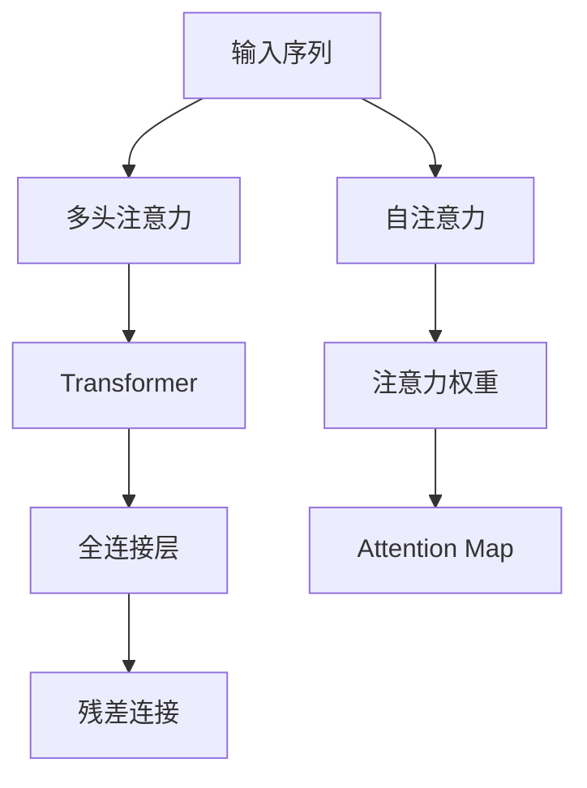

                 

# 人工智能驱动的注意力分析与预测

## 1. 背景介绍

### 1.1 问题由来
在人工智能(AI)的诸多应用中，注意力机制(Attention Mechanism)已成为提升模型性能和可解释性的重要手段。自深度学习诞生以来，这一机制就备受关注，尤其是通过Transformer架构的兴起，注意力机制成为解决自然语言处理(NLP)、计算机视觉(CV)、语音识别(SR)等领域的复杂问题的核心工具。

从最开始的“softmax attention”到现代的“self-attention”，再到“transformer-based models”，注意力机制经历了多次迭代。随着研究深入，注意力分析与预测在NLP、CV、SR等多个领域展现出巨大潜力。本篇文章将系统地介绍注意力机制的原理与实践，帮助读者全面理解这一关键技术，并展望其在未来的应用趋势。

### 1.2 问题核心关键点
注意力机制的核心在于通过动态计算，使模型在处理序列或图像等结构化数据时，能够自适应地关注关键部分，忽略无关信息。其核心思想是在输入序列/图像的每个位置，计算与该位置相关的其他位置之间的相似性权重，进而指导模型的输出。

注意力机制的诞生是针对RNN和CNN无法有效处理长距离依赖的缺陷，通过引入基于自适应权重的注意力计算方式，突破了传统模型在长序列数据上的瓶颈，在机器翻译、文本生成、图像描述、语音识别等领域取得了显著成果。

### 1.3 问题研究意义
注意力分析与预测技术能够显著提升深度学习模型的性能和可解释性，是实现AI与人类智能协同的关键技术之一。注意力机制的原理与实践为AI技术在实际应用中的普及提供了重要参考。

注意力机制在大数据时代的崛起，为深度学习模型处理大规模数据集提供了新的视角和方法，推动了NLP、CV、SR等领域的创新。无论是用于图像的视觉注意力机制、语音的听觉注意力机制，还是文本的语义注意力机制，都展示了深度学习模型的强大能力。通过深入研究，这一机制有望在更多领域发挥作用，推动人工智能技术的全面发展。

## 2. 核心概念与联系

### 2.1 核心概念概述

注意力机制的核心概念涉及以下几个方面：

- **自注意力机制(Self-Attention Mechanism)**：通过计算输入序列中每个位置与其他位置之间的相似性权重，来指导模型输出。
- **多头注意力机制(Multi-Head Attention)**：将输入序列分解成多组，分别计算不同头的注意力权重，增强模型捕捉信息的多样性和复杂性。
- **Transformer架构**：以多头注意力机制为核心的模型架构，结合全连接层和残差连接，能够高效处理长距离依赖，广泛应用于序列建模任务。
- **Attention Map**：计算出的注意力权重分布图，直观地展示了模型在不同位置关注的重点。

这些概念之间的关系可以通过以下Mermaid流程图来展示：



这个流程图展示了注意力机制的核心流程：输入序列通过多头注意力计算权重，生成Attention Map，再通过全连接层和残差连接，完成整个模型的推理输出。

## 3. 核心算法原理 & 具体操作步骤
### 3.1 算法原理概述

自注意力机制基于输入序列或特征向量的相似性计算，通过查询、键和值三个向量来计算每个位置的注意力权重，并根据这些权重计算加权和，得到最终输出。

其核心公式可以表示为：
$$
\text{Attention(Q,K,V)} = \text{softmax}\left(\frac{QK^T}{\sqrt{d_k}}\right)V
$$

其中，$Q$为查询向量，$K$为键向量，$V$为值向量，$d_k$为键向量的维度。计算出的注意力权重分布图即为Attention Map，展现了模型对输入序列中各个位置的关注程度。

### 3.2 算法步骤详解

自注意力机制的计算步骤如下：

1. **输入表示**：将输入序列或特征向量转换为查询向量、键向量和值向量。
2. **相似性计算**：计算查询向量与键向量之间的相似性矩阵。
3. **权重计算**：通过softmax函数计算每个查询向量对键向量的注意力权重。
4. **加权求和**：将权重与值向量相乘后求和，得到最终输出。

### 3.3 算法优缺点

自注意力机制的主要优点包括：

- 能够处理长距离依赖：通过自适应计算注意力权重，突破了传统RNN和CNN的序列长度限制。
- 可解释性强：Attention Map直观展示了模型关注的位置，有助于理解模型的决策过程。
- 并行计算高效：通过矩阵计算，自注意力机制能够在GPU等硬件上高效并行计算。

然而，该机制也存在一些缺点：

- 计算复杂度高：自注意力机制的计算复杂度为$O(n^3)$，在大规模数据上计算量较大。
- 模型参数多：多头的注意力机制需要计算和存储多个头的权重，增加了模型参数量。
- 可能导致信息丢失：自注意力机制的局部性原理可能使得模型忽略全局信息。

### 3.4 算法应用领域

注意力机制在NLP、CV、SR等诸多领域有着广泛应用：

- **NLP**：用于机器翻译、文本生成、问答系统等，能够处理长距离依赖，增强模型理解上下文的能力。
- **CV**：应用于图像描述生成、目标检测、语义分割等，通过视觉注意力机制，提升模型对关键区域的处理能力。
- **SR**：用于语音增强、语音识别等，通过听觉注意力机制，提升模型对关键语音信号的识别效果。

这些应用展示了注意力机制的强大能力，使其成为深度学习中不可或缺的技术。

## 4. 数学模型和公式 & 详细讲解  
### 4.1 数学模型构建

注意力机制的数学模型主要涉及三个关键部分：查询向量、键向量和值向量。以NLP领域的Transformer模型为例，可以表示为：

- **查询向量**：输入序列中每个位置的嵌入向量。
- **键向量**：输入序列中每个位置的嵌入向量，通过线性变换得到。
- **值向量**：输入序列中每个位置的嵌入向量，通过线性变换得到。

注意力机制的数学模型可以表示为：

$$
\text{Attention}(Q,K,V) = \text{softmax}\left(\frac{QK^T}{\sqrt{d_k}}\right)V
$$

其中：

- $Q \in \mathbb{R}^{n \times d_k}$
- $K \in \mathbb{R}^{n \times d_k}$
- $V \in \mathbb{R}^{n \times d_v}$
- $d_k = d_v$

### 4.2 公式推导过程

以NLP领域的Transformer模型为例，计算过程如下：

1. **输入表示**：
   $$
   Q = W_QX, \quad K = W_KX, \quad V = W_VX
   $$
   其中 $X$ 为输入序列，$W_Q$、$W_K$、$W_V$ 为线性变换矩阵。

2. **相似性计算**：
   $$
   \text{Attention}(Q,K,V) = \text{softmax}\left(\frac{QK^T}{\sqrt{d_k}}\right)V
   $$

3. **权重计算**：
   $$
   \text{Attention}(Q,K,V) = \text{softmax}\left(\frac{QK^T}{\sqrt{d_k}}\right)V
   $$

4. **加权求和**：
   $$
   \text{Attention}(Q,K,V) = \text{softmax}\left(\frac{QK^T}{\sqrt{d_k}}\right)V
   $$

### 4.3 案例分析与讲解

以机器翻译任务为例，假设输入为英文句子 "The quick brown fox jumps over the lazy dog"，输出为法语句子 "Le renard brun rapide saute par-dessus le chien paresseux"。

1. **输入表示**：
   $$
   Q = W_QX, \quad K = W_KX, \quad V = W_VX
   $$
   其中 $X$ 为英文句子 "The quick brown fox jumps over the lazy dog"，$W_Q$、$W_K$、$W_V$ 为线性变换矩阵。

2. **相似性计算**：
   $$
   \text{Attention}(Q,K,V) = \text{softmax}\left(\frac{QK^T}{\sqrt{d_k}}\right)V
   $$

3. **权重计算**：
   $$
   \text{Attention}(Q,K,V) = \text{softmax}\left(\frac{QK^T}{\sqrt{d_k}}\right)V
   $$

4. **加权求和**：
   $$
   \text{Attention}(Q,K,V) = \text{softmax}\left(\frac{QK^T}{\sqrt{d_k}}\right)V
   $$

通过自注意力机制，模型能够自适应地关注输入序列中每个位置的语义信息，生成最终的翻译结果。

## 5. 项目实践：代码实例和详细解释说明
### 5.1 开发环境搭建

在进行注意力分析与预测的实践前，我们需要准备好开发环境。以下是使用Python进行TensorFlow或PyTorch开发的环境配置流程：

1. 安装Anaconda：从官网下载并安装Anaconda，用于创建独立的Python环境。

2. 创建并激活虚拟环境：
   ```bash
   conda create -n attention-env python=3.8 
   conda activate attention-env
   ```

3. 安装TensorFlow或PyTorch：根据CUDA版本，从官网获取对应的安装命令。例如：
   ```bash
   conda install tensorflow-gpu=2.8.0 tensorflow-probability=0.13.1 -c conda-forge
   ```

4. 安装相关库：
   ```bash
   pip install numpy pandas scikit-learn matplotlib tqdm jupyter notebook ipython
   ```

5. 安装相关深度学习框架：
   ```bash
   pip install tensorflow-gpu
   ```

完成上述步骤后，即可在`attention-env`环境中开始实践。

### 5.2 源代码详细实现

以下是使用TensorFlow实现自注意力机制的代码示例。

```python
import tensorflow as tf
from tensorflow.keras.layers import Input, Dense, dot, concatenate

class SelfAttention(tf.keras.layers.Layer):
    def __init__(self, d_model, num_heads):
        super(SelfAttention, self).__init__()
        self.num_heads = num_heads
        self.d_model = d_model
        
        assert d_model % self.num_heads == 0
        
        self.Wq = Dense(d_model)
        self.Wk = Dense(d_model)
        self.Wv = Dense(d_model)
        self.dk = d_model // self.num_heads
        
    def split_heads(self, x, batch_size):
        x = tf.reshape(x, (batch_size, -1, self.num_heads, self.dk))
        return tf.transpose(x, perm=[0, 2, 1, 3])
    
    def call(self, inputs):
        batch_size = tf.shape(inputs)[0]
        
        q = self.Wq(inputs)
        k = self.Wk(inputs)
        v = self.Wv(inputs)
        
        q = self.split_heads(q, batch_size)
        k = self.split_heads(k, batch_size)
        v = self.split_heads(v, batch_size)
        
        scaled_attention, attention_weights = self.scaled_dot_product_attention(q, k, v)
        scaled_attention = tf.transpose(scaled_attention, perm=[0, 2, 1, 3])
        concat_attention = tf.reshape(scaled_attention, (batch_size, -1, self.d_model))
        
        return concat_attention, attention_weights
    
    def scaled_dot_product_attention(self, q, k, v):
        matmul_qk = tf.matmul(q, k, transpose_b=True)
        dk = tf.cast(tf.shape(k)[-1], tf.float32)
        scaled_attention_logits = matmul_qk / tf.math.sqrt(dk)
        attention_weights = tf.nn.softmax(scaled_attention_logits, axis=-1)
        output = tf.matmul(attention_weights, v)
        
        return output, attention_weights
```

### 5.3 代码解读与分析

以上代码展示了使用TensorFlow实现自注意力机制的核心逻辑：

- **定义类SelfAttention**：继承自tf.keras.layers.Layer，定义了多个线性变换层和注意力计算层。
- **定义scaled_dot_product_attention函数**：计算注意力权重和输出。
- **调用scaled_dot_product_attention函数**：将查询向量、键向量和值向量传入计算注意力权重和输出。

代码中使用了TensorFlow的高级API，实现了注意力机制的核心计算过程。这种实现方式简洁高效，适用于大规模模型的构建。

## 6. 实际应用场景
### 6.1 智能客服系统

基于自注意力机制的对话系统在智能客服系统中得到了广泛应用。通过自注意力机制，模型能够理解客户的问题，并自适应地关注问题的关键部分，生成最合适的回答。

在技术实现上，可以将历史客服对话数据作为监督数据，训练模型对新客户问题进行理解和回复。通过多轮对话的上下文信息，模型能够动态调整注意力权重，逐步深化对问题的理解，提供更准确的答复。

### 6.2 金融舆情监测

金融领域需要实时监测市场舆情，预测股票价格波动。基于自注意力机制的情感分析模型能够对新闻、评论等文本数据进行情感分类，预测市场趋势。

具体而言，可以收集金融领域相关的新闻、报道、评论等文本数据，并对其进行情感标注。在此基础上对预训练语言模型进行微调，使其能够自动判断文本情感倾向。将微调后的模型应用到实时抓取的网络文本数据，就能够自动监测不同情感倾向的市场舆情变化，及时预警潜在风险。

### 6.3 个性化推荐系统

推荐系统需要实时处理用户的浏览、点击、评分等行为数据，为用户提供个性化的推荐。基于自注意力机制的推荐系统能够根据用户的浏览历史，动态调整对各个物品的关注程度，生成个性化的推荐结果。

在实践中，可以收集用户的历史行为数据，提取和用户交互的物品标题、描述、标签等文本内容。将文本内容作为模型输入，用户的后续行为（如是否点击、购买等）作为监督信号，在此基础上微调预训练语言模型。微调后的模型能够从文本内容中准确把握用户的兴趣点，生成个性化的推荐列表。

### 6.4 未来应用展望

随着自注意力机制的不断发展，其在更多领域的应用前景将更加广阔。

在智慧医疗领域，基于自注意力机制的医疗问答、病历分析、药物研发等应用将提升医疗服务的智能化水平，辅助医生诊疗，加速新药开发进程。

在智能教育领域，自注意力机制可应用于作业批改、学情分析、知识推荐等方面，因材施教，促进教育公平，提高教学质量。

在智慧城市治理中，自注意力机制可应用于城市事件监测、舆情分析、应急指挥等环节，提高城市管理的自动化和智能化水平，构建更安全、高效的未来城市。

此外，在企业生产、社会治理、文娱传媒等众多领域，基于自注意力机制的人工智能应用也将不断涌现，为经济社会发展注入新的动力。

## 7. 工具和资源推荐
### 7.1 学习资源推荐

为了帮助开发者系统掌握自注意力机制的原理和实践，这里推荐一些优质的学习资源：

1. Attention is All You Need（即Transformer原论文）：介绍了Transformer模型和自注意力机制的原理，是了解该机制的入门必读。

2. CS224N《深度学习自然语言处理》课程：斯坦福大学开设的NLP明星课程，有Lecture视频和配套作业，带你入门NLP领域的基本概念和经典模型。

3. Natural Language Processing with Transformers书籍：Transformer库的作者所著，全面介绍了如何使用Transformers库进行NLP任务开发，包括自注意力在内的诸多范式。

4. HuggingFace官方文档：Transformer库的官方文档，提供了海量预训练模型和完整的自注意力样例代码，是上手实践的必备资料。

5. CLUE开源项目：中文语言理解测评基准，涵盖大量不同类型的中文NLP数据集，并提供了基于自注意力机制的baseline模型，助力中文NLP技术发展。

通过对这些资源的学习实践，相信你一定能够快速掌握自注意力机制的精髓，并用于解决实际的NLP问题。

### 7.2 开发工具推荐

高效的开发离不开优秀的工具支持。以下是几款用于自注意力机制开发的常用工具：

1. TensorFlow：基于Python的开源深度学习框架，灵活的计算图，支持大规模模型训练。

2. PyTorch：灵活的动态计算图，易于实现自注意力机制的复杂计算过程。

3. Transformers库：HuggingFace开发的NLP工具库，集成了众多SOTA语言模型，支持自注意力机制的实现。

4. Weights & Biases：模型训练的实验跟踪工具，可以记录和可视化模型训练过程中的各项指标，方便对比和调优。

5. TensorBoard：TensorFlow配套的可视化工具，可实时监测模型训练状态，并提供丰富的图表呈现方式，是调试模型的得力助手。

合理利用这些工具，可以显著提升自注意力机制的开发效率，加快创新迭代的步伐。

### 7.3 相关论文推荐

自注意力机制的研究源于学界的持续研究。以下是几篇奠基性的相关论文，推荐阅读：

1. Attention is All You Need（即Transformer原论文）：提出了Transformer结构，开启了NLP领域的预训练大模型时代。

2. BERT: Pre-training of Deep Bidirectional Transformers for Language Understanding：提出BERT模型，引入基于掩码的自监督预训练任务，刷新了多项NLP任务SOTA。

3. Transformers Are Universal Approximators of Arbitrary Computations for Reasoning：提出Transformer模型具有通用计算能力，能够实现任意逻辑推理。

4. Deep Transformer Networks with Multi-Head Self-Attention for Image Recognition：将自注意力机制应用于图像识别任务，取得了SOTA结果。

这些论文代表了大模型自注意力机制的发展脉络。通过学习这些前沿成果，可以帮助研究者把握学科前进方向，激发更多的创新灵感。

## 8. 总结：未来发展趋势与挑战

### 8.1 总结

本文对自注意力机制的原理与实践进行了全面系统的介绍。首先阐述了自注意力机制的研究背景和意义，明确了其在NLP、CV、SR等多个领域的重要价值。其次，从原理到实践，详细讲解了自注意力机制的计算过程，给出了代码实现和案例分析，展示了其实用性和强大能力。同时，本文还广泛探讨了自注意力机制在多个行业领域的应用前景，展示了其广阔的发展空间。

通过本文的系统梳理，可以看到，自注意力机制在深度学习模型中的应用越来越广泛，为处理序列和结构化数据提供了新的思路和方法。伴随深度学习模型的不断演进，自注意力机制的强大能力将进一步发挥，推动AI技术的全面发展。

### 8.2 未来发展趋势

展望未来，自注意力机制将呈现以下几个发展趋势：

1. 多模态自注意力机制：将自注意力机制应用于多模态数据，如文本-图像、文本-语音等，增强模型的跨模态理解能力。

2. 结构化自注意力机制：将自注意力机制应用于图结构数据，如分子结构、社交网络等，提升模型的结构化处理能力。

3. 对抗性自注意力机制：通过引入对抗样本，增强自注意力机制的鲁棒性，提高模型对噪声数据的抵抗力。

4. 稀疏自注意力机制：通过稀疏化自注意力机制，减少计算复杂度，提升模型训练和推理效率。

5. 动态自注意力机制：通过动态调整注意力权重，使自注意力机制能够适应不同的任务和数据分布，提高模型的泛化能力。

这些趋势展示了自注意力机制的发展方向，其多模态、结构化、鲁棒性等方面的拓展，将进一步提升深度学习模型的应用范围和性能。

### 8.3 面临的挑战

尽管自注意力机制已经取得了显著成就，但在迈向更加智能化、普适化应用的过程中，它仍面临诸多挑战：

1. 计算复杂度：自注意力机制的计算复杂度较高，对硬件资源要求较高。如何降低计算复杂度，提高模型训练和推理效率，仍是一个重要的研究方向。

2. 模型参数量：自注意力机制需要计算和存储多个头的权重，增加了模型参数量。如何在保证性能的同时，减少模型参数，是一个亟待解决的难题。

3. 模型解释性：自注意力机制的“黑盒”特性使其难以解释。如何提高模型的可解释性，使其输出更具透明性，是一个重要的研究方向。

4. 数据分布变化：自注意力机制在处理不同分布的数据时，往往需要重新训练模型。如何使模型能够自适应不同分布的数据，是一个重要的研究课题。

5. 鲁棒性问题：自注意力机制在面对对抗样本和噪声数据时，可能表现不稳定。如何增强模型的鲁棒性，提高其抗干扰能力，是一个重要的研究方向。

6. 实时性问题：自注意力机制在处理大规模数据时，可能面临实时性不足的问题。如何优化模型的计算图，提高实时性，是一个重要的研究方向。

7. 数据隐私问题：自注意力机制需要大量数据进行训练，如何保护数据隐私，是一个重要的研究方向。

这些挑战凸显了自注意力机制在实际应用中的复杂性和多样性，需要多方面的协同攻关，才能实现其全面的普及和应用。

### 8.4 研究展望

面对自注意力机制所面临的诸多挑战，未来的研究需要在以下几个方面寻求新的突破：

1. 探索更高效的计算方法：通过优化计算图、使用混合精度计算等方法，降低自注意力机制的计算复杂度，提高模型的训练和推理效率。

2. 设计更合理的参数结构：通过参数共享、稀疏化等方法，减少自注意力机制的参数量，提高模型的可扩展性。

3. 增强模型的可解释性：通过引入可解释性技术，如注意力可视化、因果推断等，提高模型的透明性和可解释性。

4. 提高模型的鲁棒性：通过对抗训练、数据增强等方法，增强自注意力机制的鲁棒性，提高模型对噪声数据的抵抗力。

5. 支持不同分布的数据：通过自适应训练、迁移学习等方法，使自注意力机制能够适应不同分布的数据，提高模型的泛化能力。

6. 提升实时性：通过优化模型计算图、使用GPU/TPU等高性能设备，提高自注意力机制的实时性，支持实时应用的场景。

7. 保护数据隐私：通过差分隐私、联邦学习等方法，保护自注意力机制的数据隐私，确保数据安全。

这些研究方向的探索，将进一步推动自注意力机制的应用和普及，为深度学习模型的未来发展提供新的方向和动力。

## 9. 附录：常见问题与解答

**Q1：自注意力机制是否适用于所有NLP任务？**

A: 自注意力机制在大多数NLP任务上都能取得不错的效果，特别是对于长序列数据。但对于一些特定领域的任务，如医学、法律等，仅仅依靠通用语料预训练的模型可能难以很好地适应。此时需要在特定领域语料上进一步预训练，再进行微调，才能获得理想效果。

**Q2：在自注意力机制中，如何计算注意力权重？**

A: 在自注意力机制中，计算注意力权重的过程如下：
1. 计算查询向量与键向量之间的相似性矩阵。
2. 通过softmax函数计算每个查询向量对键向量的注意力权重。

具体来说，计算注意力权重的公式为：
$$
\text{Attention(Q,K,V)} = \text{softmax}\left(\frac{QK^T}{\sqrt{d_k}}\right)V
$$

其中，$Q$为查询向量，$K$为键向量，$V$为值向量，$d_k$为键向量的维度。

**Q3：自注意力机制在CV领域有哪些应用？**

A: 在CV领域，自注意力机制主要应用于图像描述生成、目标检测、语义分割等任务。例如，通过视觉注意力机制，模型能够关注图像中的关键区域，生成更加准确、详细的图像描述。在目标检测中，通过自注意力机制，模型能够关注图像中的不同对象，生成更精确的检测结果。

**Q4：自注意力机制的计算复杂度较高，如何解决？**

A: 降低自注意力机制的计算复杂度是当前研究的热点之一。一种常见的方法是使用稠密矩阵乘法代替稀疏矩阵乘法，提高计算效率。同时，使用GPU/TPU等高性能设备，也能显著提升计算速度。另外，通过参数共享和稀疏化，减少模型的参数量，也能降低计算复杂度。

**Q5：自注意力机制在SR领域有哪些应用？**

A: 在SR领域，自注意力机制主要应用于语音增强、语音识别等任务。例如，通过听觉注意力机制，模型能够关注语音信号中的关键部分，生成更清晰、更准确的语音增强结果。在语音识别中，通过自注意力机制，模型能够关注语音信号中的不同部分，生成更精确的识别结果。

这些应用展示了自注意力机制在CV、SR等领域的强大能力，进一步拓展了其应用边界。

---

作者：禅与计算机程序设计艺术 / Zen and the Art of Computer Programming

