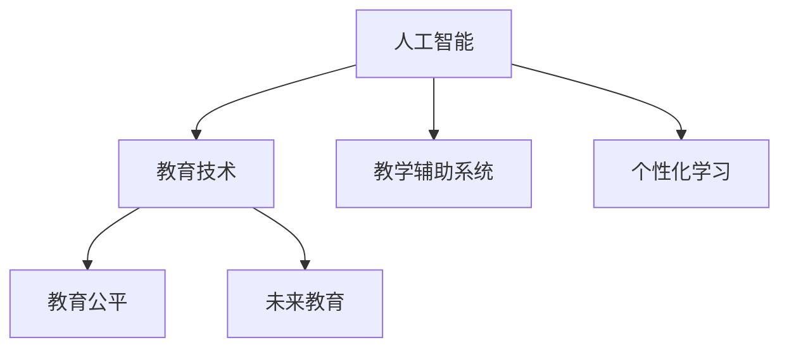

                 

# 人工智能：教育变革的催化剂

> 关键词：人工智能,教育技术,教学辅助,个性化学习,教育公平,未来教育

## 1. 背景介绍

### 1.1 问题由来

随着信息技术的飞速发展，人工智能(AI)技术已经成为改变世界的重要力量。在众多应用场景中，人工智能在教育领域的应用尤为引人注目。人工智能为教育带来了革命性的变化，提供了个性化的教学模式，提升了教育资源的利用效率，推动了教育公平的实现，为未来教育发展注入了新的活力。

然而，尽管人工智能技术在教育领域展示了巨大的潜力，但实际应用中仍面临着诸多挑战和问题。本文章旨在深入探讨人工智能在教育中的核心概念、关键算法、具体应用，并提出未来发展的趋势和展望。

### 1.2 问题核心关键点

人工智能在教育中的应用主要体现在以下几个方面：

1. **教学辅助**：通过智能化的教学工具，辅助教师进行课堂管理和作业批改，提升教学效率。
2. **个性化学习**：利用数据分析，为每个学生量身定制学习计划和资源，实现因材施教。
3. **教育公平**：通过在线教育平台，打破地域限制，为偏远地区学生提供优质教育资源。
4. **未来教育**：探索基于人工智能的教育新模式，如虚拟教室、智能导师等，重构传统教育体系。

这些核心关键点构成了人工智能在教育应用中的主要方向，其技术实现、挑战和未来趋势值得深入探讨。

## 2. 核心概念与联系

### 2.1 核心概念概述

为更好地理解人工智能在教育中的应用，本节将介绍几个核心概念：

- **人工智能**：利用计算机算法和数据处理技术，模拟人类智能行为，包括学习、推理、规划等。
- **教育技术**：运用信息技术手段，改进和提升教育过程和效果的技术体系。
- **教学辅助系统**：利用人工智能技术，辅助教师进行教学管理、资源推荐等。
- **个性化学习**：根据学生特点和需求，定制个性化的学习内容和路径。
- **教育公平**：通过技术手段，缩小教育资源分布的不平等，为所有人提供平等受教育的机会。
- **未来教育**：基于人工智能和新兴技术，重构教育体系，探索新的教学模式和学习方式。

这些概念之间的逻辑关系可以通过以下Mermaid流程图来展示：



这个流程图展示了人工智能与教育技术的紧密联系及其对教学辅助、个性化学习、教育公平和未来教育的影响。

## 3. 核心算法原理 & 具体操作步骤

### 3.1 算法原理概述

人工智能在教育中的核心算法原理主要包括机器学习、深度学习、自然语言处理(NLP)等。这些技术共同构成了个性化学习、教学辅助和教育公平的基础。

- **机器学习**：通过数据训练模型，实现对特定任务的预测和决策。
- **深度学习**：利用神经网络模型，处理大规模非结构化数据，实现复杂模式识别和推理。
- **自然语言处理**：分析、理解和生成自然语言文本，支持智能交互和内容推荐。

这些算法共同为人工智能在教育中的应用提供了技术支持，具体到教育场景中的应用如下：

1. **个性化推荐系统**：基于学生的学习行为和偏好，推荐个性化学习资源。
2. **智能批改系统**：利用深度学习技术，自动批改作业和测试，提供即时反馈。
3. **虚拟助手和导师**：通过自然语言处理技术，实现智能答疑、学习指导等功能。

### 3.2 算法步骤详解

以下以个性化推荐系统为例，详细介绍其核心算法步骤：

1. **数据收集**：收集学生的学习行为数据，如阅读时长、答题情况、兴趣爱好等。
2. **数据预处理**：清洗和归一化数据，去除噪音和异常值，准备输入模型。
3. **特征提取**：利用特征工程技术，从原始数据中提取有用的特征，如阅读习惯、答题难度等。
4. **模型训练**：使用机器学习或深度学习算法训练模型，如协同过滤、基于内容推荐等。
5. **推荐生成**：根据模型预测结果，生成个性化推荐列表，供学生选择。
6. **反馈和优化**：根据学生的实际反馈，调整模型参数和策略，优化推荐效果。

### 3.3 算法优缺点

人工智能在教育中的应用具有以下优点：

1. **高效性**：自动化处理大量数据和任务，提升教育资源利用效率。
2. **个性化**：根据学生特点和需求，提供定制化学习体验，提升学习效果。
3. **普及性**：通过在线平台，打破地域限制，促进教育公平。

同时，也存在一些缺点：

1. **技术依赖**：需要强大的技术支持和数据资源，对设备和网络要求较高。
2. **数据隐私**：学生的学习数据涉及隐私保护，需严格遵守相关法律法规。
3. **伦理挑战**：人工智能在教育中的应用可能带来一些伦理问题，如数据偏见、算法透明性等。

### 3.4 算法应用领域

人工智能在教育中的应用领域非常广泛，包括但不限于：

1. **在线教育**：支持MOOCs（大规模开放在线课程）和SPOCs（小规模私有在线课程）等。
2. **智能教室**：实现课堂管理、作业批改、智能答疑等功能。
3. **教育游戏**：通过游戏化学习，提升学生兴趣和参与度。
4. **虚拟学习助手**：提供24/7的学习支持，解答学生疑问。
5. **考试评估**：自动生成和批改考试，减轻教师负担。
6. **职业培训**：利用虚拟现实(VR)和增强现实(AR)技术，提供沉浸式学习体验。

## 4. 数学模型和公式 & 详细讲解  
### 4.1 数学模型构建

以个性化推荐系统为例，我们可以构建如下数学模型：

设学生集合为 $S=\{s_1,s_2,...,s_n\}$，学习资源集合为 $R=\{r_1,r_2,...,r_m\}$，学生对资源的评分矩阵为 $X_{n\times m}$，资源向量为 $r=\{r_1,r_2,...,r_m\}$，学生向量为 $s=\{s_1,s_2,...,s_n\}$。

模型目标是最小化预测误差，即：

$$
\min_{\theta} \sum_{i=1}^n \sum_{j=1}^m (y_{ij} - X_{ij}\theta) ^2
$$

其中，$y_{ij}$ 表示学生 $s_i$ 对资源 $r_j$ 的评分，$\theta$ 为模型参数。

### 4.2 公式推导过程

采用矩阵分解技术，可以简化模型的参数矩阵 $\theta$，使其更加稀疏，从而降低计算复杂度。假设 $\theta$ 可以分解为 $X_{n\times m} = \alpha \beta^T$，其中 $\alpha$ 为学生矩阵，$\beta$ 为资源矩阵。则模型目标变为：

$$
\min_{\alpha,\beta} ||X_{n\times m} - \alpha \beta^T||_F^2
$$

其中 $||\cdot||_F$ 表示矩阵的 Frobenius 范数。

利用矩阵分解算法，如奇异值分解(SVD)或矩阵分解(SVD)，可以求解 $\alpha$ 和 $\beta$。具体的推导过程如下：

$$
X_{n\times m} \approx \alpha \beta^T
$$

$$
X_{n\times m} \beta = \alpha X_{m\times m}
$$

$$
\alpha = X_{n\times m} \beta (X_{m\times m} \beta)^{-1}
$$

$$
\beta = (X_{n\times m}^T X_{n\times m})^{-1} X_{n\times m}^T
$$

### 4.3 案例分析与讲解

以MOOC平台的学生推荐为例，假设有一个包含10万学生和5000门课程的MOOC平台，使用上述模型进行学生和课程的推荐。通过收集学生的学习行为数据，包括课程选择、观看时长、问答互动等，以及课程的评价和用户评分，可以进行如下步骤：

1. **数据预处理**：清洗和归一化数据，去除异常值。
2. **特征提取**：提取学生的学习习惯、偏好和课程的难度、内容等信息。
3. **矩阵分解**：使用SVD算法对学习行为矩阵和用户评分矩阵进行分解。
4. **推荐生成**：根据分解后的矩阵，生成个性化的课程推荐列表。
5. **反馈优化**：根据用户反馈，调整模型参数和策略，优化推荐效果。

## 5. 项目实践：代码实例和详细解释说明
### 5.1 开发环境搭建

在进行教育技术的项目实践前，我们需要准备好开发环境。以下是使用Python进行教育技术开发的环境配置流程：

1. 安装Anaconda：从官网下载并安装Anaconda，用于创建独立的Python环境。

2. 创建并激活虚拟环境：
```bash
conda create -n edutech-env python=3.8 
conda activate edutech-env
```

3. 安装相关工具包：
```bash
pip install pandas numpy scikit-learn matplotlib seaborn plotly
```

4. 安装TensorFlow和PyTorch：
```bash
pip install tensorflow==2.4.0 pytorch torchvision torchaudio
```

5. 安装Jupyter Notebook和Flask：
```bash
pip install jupyter notebook flask
```

完成上述步骤后，即可在`edutech-env`环境中开始项目开发。

### 5.2 源代码详细实现

以下是一个简单的个性化推荐系统示例，用于推荐MOOC平台上的课程。

```python
import pandas as pd
import numpy as np
import matplotlib.pyplot as plt
from sklearn.decomposition import TruncatedSVD

# 构建学生和课程评分矩阵
data = pd.read_csv('data.csv')
X = pd.get_dummies(data['课程'].values, prefix='课程', prefix_sep='-')
X = X.to_numpy()

# 训练模型
model = TruncatedSVD(n_components=10, random_state=42)
X_train = model.fit_transform(X)

# 生成推荐列表
similarity_matrix = np.dot(X_train.T, X_train)
idx = np.argsort(similarity_matrix)[1:]
recommendations = list(idx[:5])  # 推荐前5门课程

# 输出推荐结果
print('推荐课程：', [data['课程'][recommendations[i]] for i in recommendations])
```

在这个示例中，我们使用了Scikit-learn库中的TruncatedSVD算法进行矩阵分解。通过构建学生和课程的评分矩阵，利用SVD算法进行分解，最后根据相似度生成推荐列表。

### 5.3 代码解读与分析

让我们再详细解读一下关键代码的实现细节：

**数据预处理**：
- 使用Pandas库读取数据集，构建学生和课程的评分矩阵。
- 使用`pd.get_dummies`将课程名称转化为哑变量，方便模型处理。

**模型训练**：
- 使用TruncatedSVD算法进行矩阵分解，将评分矩阵分解为学生和课程的潜在特征矩阵。
- `n_components`参数指定分解后的矩阵维度，这里取10。

**推荐生成**：
- 利用分解后的矩阵计算学生和课程之间的相似度，使用`np.argsort`排序。
- 根据相似度生成推荐列表，这里取前5门课程。

**输出结果**：
- 输出推荐课程列表，方便查看和验证。

通过这个示例代码，可以看到，利用Scikit-learn库，我们可以很容易地实现一个简单的个性化推荐系统。当然，实际应用中还需要更复杂的算法和数据处理，但这个示例展示了基本流程和思路。

## 6. 实际应用场景

### 6.1 智能教室

智能教室通过集成多种AI技术，实现了教学过程的自动化和智能化。具体应用包括：

- **自适应学习系统**：根据学生的学习行为和表现，动态调整课程难度和内容。
- **课堂行为分析**：通过摄像头和传感器，实时监测学生的注意力和情绪，提供及时反馈。
- **智能作业批改**：利用OCR和NLP技术，自动批改作业和试卷，减轻教师负担。
- **虚拟实验平台**：利用虚拟现实技术，提供沉浸式实验环境，增强学习体验。

### 6.2 教育游戏

教育游戏将AI技术应用于游戏设计，通过互动和挑战，提升学生的学习兴趣和参与度。具体应用包括：

- **互动故事游戏**：通过角色扮演和情节推进，引导学生完成学习任务。
- **智能问答系统**：在游戏中嵌入AI答疑功能，解决学生疑问，提供即时反馈。
- **虚拟实验室**：利用VR技术，提供实验场景和操作，增强学习效果。
- **个性化学习路径**：根据学生的学习进度和表现，自动调整游戏难度和内容。

### 6.3 职业培训

职业培训通过AI技术，为在职人员提供技能提升和职业转型的支持。具体应用包括：

- **个性化学习计划**：根据个人职业目标和学习需求，定制化培训内容。
- **智能导师系统**：通过自然语言处理技术，提供个性化的学习指导和答疑。
- **虚拟仿真平台**：利用模拟技术，提供安全、高效的实践机会。
- **技能评估系统**：自动评估学员的学习成果，提供定制化反馈和建议。

### 6.4 未来应用展望

未来，人工智能在教育中的应用将更加广泛和深入，可能包括：

1. **虚拟现实和增强现实**：通过VR和AR技术，提供沉浸式学习体验，模拟真实环境，增强学习效果。
2. **自适应教育系统**：通过AI技术，实现完全自适应学习，根据学生的实时反馈和表现，动态调整学习路径和内容。
3. **智能导师和助教**：利用NLP和语音识别技术，提供智能答疑和辅导，减轻教师负担。
4. **跨学科融合**：将不同学科的知识和技能进行融合，培养学生的综合素质和创新能力。
5. **个性化发展指导**：利用数据分析和机器学习技术，提供个性化的职业发展规划和建议。
6. **教育资源的全球共享**：通过在线平台和AI技术，打破地域限制，实现全球教育资源的共享和合作。

这些未来应用将进一步拓展人工智能在教育中的应用范围，为教育的个性化、普惠化和智能化提供更多可能。

## 7. 工具和资源推荐

### 7.1 学习资源推荐

为了帮助开发者系统掌握人工智能在教育中的应用，这里推荐一些优质的学习资源：

1. **《教育技术概论》**：介绍教育技术和AI技术的基本概念和应用，适合入门学习。
2. **Coursera和edX的AI和机器学习课程**：由顶尖大学和公司开设的课程，涵盖深度学习和AI在教育中的应用。
3. **《Python教育技术编程》**：详细介绍Python在教育技术项目中的应用，提供实际案例和代码实现。
4. **Udacity的AI教育方向课程**：提供系统化的AI教育技术课程，涵盖从数据到模型的全流程。
5. **IEEE的AI教育技术论文库**：收录大量前沿的AI教育技术研究论文，提供深入的学术背景和最新进展。

### 7.2 开发工具推荐

高效的教育技术开发需要借助一些优秀的工具。以下是几款推荐工具：

1. **Jupyter Notebook**：开源的交互式编程环境，支持Python、R等多种语言，便于协作和分享。
2. **TensorBoard**：TensorFlow配套的可视化工具，实时监测模型训练状态，提供丰富的图表呈现方式。
3. **Flask**：轻量级的Web框架，适合开发在线教育平台和移动应用。
4. **PyTorch**：灵活的深度学习框架，支持动态计算图，适合科研和实验开发。
5. **Scikit-learn**：强大的机器学习库，提供丰富的算法和工具，适合数据预处理和模型训练。

合理利用这些工具，可以显著提升教育技术项目的开发效率，加快创新迭代的步伐。

### 7.3 相关论文推荐

人工智能在教育中的应用领域已经取得了众多研究成果，以下是几篇奠基性的相关论文，推荐阅读：

1. **《基于深度学习的个性化推荐系统》**：介绍深度学习在个性化推荐中的应用，包含推荐算法和实际案例。
2. **《自适应学习系统：设计与实现》**：讨论自适应学习系统的设计和实现方法，涵盖数据驱动和自反馈机制。
3. **《智能导师系统：理论与实践》**：介绍智能导师系统的构建方法，包括NLP和机器学习技术的应用。
4. **《虚拟现实在教育中的应用》**：探讨VR技术在教育中的潜力，包括沉浸式学习环境和虚拟实验平台。
5. **《教育公平：基于AI的在线教育模式》**：讨论在线教育的公平性问题，如何利用AI技术缩小教育资源的不平等。

这些论文代表了大数据和人工智能在教育中的应用方向，通过学习这些前沿成果，可以帮助研究者把握学科前进方向，激发更多的创新灵感。

## 8. 总结：未来发展趋势与挑战

### 8.1 总结

本文对人工智能在教育中的应用进行了全面系统的介绍。首先阐述了教育变革的驱动因素和未来趋势，明确了人工智能在个性化学习、教学辅助和教育公平中的关键作用。其次，从原理到实践，详细讲解了机器学习、深度学习、自然语言处理等核心算法，提供了完整的代码实现和详细解读。同时，本文还广泛探讨了人工智能在教育中的实际应用场景，展示了其广阔的前景。此外，本文精选了学习资源、开发工具和相关论文，力求为读者提供全方位的技术指引。

通过本文的系统梳理，可以看到，人工智能在教育中的应用正在深刻改变传统教育模式，推动教育技术的快速发展和普及。未来，随着技术的不断进步和应用场景的扩展，人工智能必将在教育领域发挥更加重要的作用。

### 8.2 未来发展趋势

展望未来，人工智能在教育中的应用将呈现以下几个发展趋势：

1. **数据驱动的教育**：通过大数据分析和机器学习，实现个性化学习路径和智能辅导。
2. **自适应学习系统的普及**：利用AI技术，实现完全自适应的学习模式，提升学习效率和效果。
3. **教育资源的全球共享**：通过在线平台和AI技术，实现全球教育资源的共享和合作，促进教育公平。
4. **虚拟现实和增强现实的应用**：利用VR和AR技术，提供沉浸式学习体验，增强学习效果。
5. **跨学科融合教育**：将不同学科的知识和技能进行融合，培养学生的综合素质和创新能力。
6. **智能导师和助教的普及**：通过NLP和语音识别技术，提供智能答疑和辅导，减轻教师负担。

这些趋势将推动教育技术的不断进步，为学生提供更加个性化、普惠化和智能化的学习体验。

### 8.3 面临的挑战

尽管人工智能在教育中的应用取得了显著进展，但面临的挑战依然不少：

1. **数据隐私和安全**：学生的学习数据涉及隐私保护，需严格遵守相关法律法规。
2. **技术门槛高**：教育技术开发需要跨学科的知识和技能，门槛较高，需要大量资源投入。
3. **伦理和公平性**：AI在教育中的应用可能带来数据偏见、算法透明性等伦理问题。
4. **技术普及性**：部分地区和学校可能缺乏必要的设备和网络支持，无法普及AI技术。
5. **教师的接受度**：部分教师可能对AI技术持怀疑态度，需要加强培训和引导。
6. **系统稳定性**：AI系统可能存在一定的故障率和误判，需保证系统稳定可靠。

这些挑战需要各界共同努力，不断优化技术应用，提升教育公平性和可及性，实现人工智能在教育中的可持续发展。

### 8.4 研究展望

未来的教育技术研究需要在以下几个方面寻求新的突破：

1. **数据隐私保护**：开发更加安全和透明的数据保护技术，确保学生数据的隐私和安全。
2. **算法透明性**：提高AI算法的透明性，使其决策过程可解释、可审计。
3. **跨学科合作**：加强教育技术与其他学科的合作，推动跨学科知识和技能的整合。
4. **社会责任**：研究AI技术的社会影响和伦理问题，确保技术应用的公平性和普惠性。
5. **个性化学习**：开发更加个性化和自适应的学习系统，提升学习效果和体验。
6. **教育公平**：利用AI技术，缩小教育资源的不平等，促进教育公平和普惠。

只有综合考虑技术、社会、伦理等因素，才能实现人工智能在教育中的全面发展和应用。

## 9. 附录：常见问题与解答

**Q1：什么是自适应学习系统？**

A: 自适应学习系统是一种利用人工智能技术，根据学生的学习行为和表现，动态调整课程难度和内容的学习系统。它通过收集学生的学习数据，如阅读时长、答题情况等，分析学生的学习风格和能力，然后实时调整课程的难度、节奏和内容，以适应每个学生的个性化需求。

**Q2：如何利用人工智能实现个性化学习？**

A: 利用人工智能实现个性化学习，通常需要以下几个步骤：

1. 数据收集：收集学生的学习行为数据，如阅读时长、答题情况、兴趣爱好等。
2. 数据预处理：清洗和归一化数据，去除噪音和异常值，准备输入模型。
3. 特征提取：利用特征工程技术，从原始数据中提取有用的特征，如阅读习惯、答题难度等。
4. 模型训练：使用机器学习或深度学习算法训练模型，如协同过滤、基于内容推荐等。
5. 推荐生成：根据模型预测结果，生成个性化的学习资源或任务。
6. 反馈优化：根据学生的实际反馈，调整模型参数和策略，优化推荐效果。

**Q3：人工智能在教育中的应用有哪些优点？**

A: 人工智能在教育中的应用具有以下优点：

1. 高效性：自动化处理大量数据和任务，提升教育资源利用效率。
2. 个性化：根据学生特点和需求，提供定制化学习体验，提升学习效果。
3. 普及性：通过在线平台，打破地域限制，促进教育公平。

**Q4：人工智能在教育中的应用有哪些缺点？**

A: 人工智能在教育中的应用也存在一些缺点：

1. 技术依赖：需要强大的技术支持和数据资源，对设备和网络要求较高。
2. 数据隐私：学生的学习数据涉及隐私保护，需严格遵守相关法律法规。
3. 伦理挑战：AI在教育中的应用可能带来一些伦理问题，如数据偏见、算法透明性等。

这些缺点需要在使用人工智能技术时加以注意，并采取相应的措施加以克服。

**Q5：如何评估人工智能在教育中的效果？**

A: 评估人工智能在教育中的效果，通常需要考虑以下几个方面：

1. 学习效果：评估学生在学习过程中的进步和掌握情况。
2. 学习体验：评估学生的学习兴趣和参与度，是否感到愉悦和满足。
3. 资源利用：评估教育资源的利用效率和公平性，是否能够惠及更多学生。
4. 数据隐私：评估学生数据的隐私保护情况，是否符合法律法规。
5. 系统稳定性：评估AI系统的稳定性和可靠性，是否能够持续运行。

通过综合考虑这些方面，可以全面评估人工智能在教育中的效果，发现问题并加以改进。

---

作者：禅与计算机程序设计艺术 / Zen and the Art of Computer Programming

