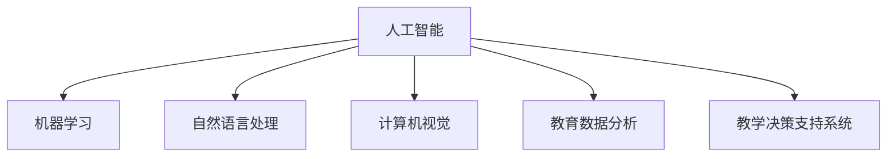

                 

# 人工智能：教育变革的催化剂

## 1. 背景介绍

### 1.1 问题由来
教育领域正面临着前所未有的变革，从传统教学模式到智能化教育转型，人工智能（AI）作为重要推手，正逐渐改变教育的面貌。无论是K-12教育、高等教育还是成人教育，AI技术的渗透都将彻底颠覆传统教育的方式，为教育带来新的活力和可能。

教育中的AI应用正从辅助性角色逐渐转变为主导角色。从智能推荐系统到个性化学习路径，从智能批改作业到个性化辅导，AI技术的引入正让教育更加高效、公平、个性化。本文将全面介绍AI如何成为教育变革的催化剂，并探讨其在实际应用中的具体实践。

### 1.2 问题核心关键点
人工智能在教育领域的应用核心关键点主要包括：

- **个性化教育**：利用AI技术，根据学生的学习特点和兴趣，提供定制化的学习内容和路径，提升学习效果。
- **智能评估与反馈**：通过AI技术实现自动化评估和即时反馈，减轻教师负担，提升学生学习体验。
- **教育资源优化**：运用AI技术进行教育资源的智能化管理和调度，提高资源利用率。
- **学习数据分析**：通过AI技术分析学习数据，识别学习障碍和薄弱环节，提供针对性建议。
- **教师辅助决策**：利用AI技术辅助教师进行教学决策和课程设计，提升教学效果。

这些关键点共同构成了AI在教育领域的应用框架，使得教育变得更加智能化和高效化。通过理解这些核心概念，我们可以更好地把握AI在教育中的作用和潜力。

## 2. 核心概念与联系

### 2.1 核心概念概述

为更好地理解AI在教育中的应用，本节将介绍几个密切相关的核心概念：

- **人工智能（AI）**：一种使机器能够执行通常需要人类智能的任务的技术。在教育领域，AI主要通过机器学习、自然语言处理、计算机视觉等技术实现。

- **机器学习（ML）**：AI的一个分支，让计算机能够从数据中学习并改进性能，广泛应用于个性化推荐、智能评估等任务。

- **自然语言处理（NLP）**：使计算机能够理解、处理和生成自然语言的技术，广泛应用于智能辅导、智能评估等。

- **计算机视觉（CV）**：使计算机能够“看”的技术，在教育中的应用包括智能批改作业、虚拟实验室等。

- **教育数据分析（EDA）**：通过对学习数据的分析，发现学习规律和趋势，提供教学建议。

- **教学决策支持系统（DSS）**：利用AI技术辅助教师进行教学决策和课程设计，提升教学效果。

这些核心概念之间的逻辑关系可以通过以下Mermaid流程图来展示：



这个流程图展示了我AI的核心概念及其之间的关系：

1. 人工智能通过机器学习、自然语言处理、计算机视觉等技术实现。
2. 教育数据分析是AI在教育中的重要应用，提供教学建议。
3. 教学决策支持系统利用AI技术辅助教师决策。

这些概念共同构成了AI在教育中的应用框架，使得AI能够更好地服务于教育领域。

## 3. 核心算法原理 & 具体操作步骤
### 3.1 算法原理概述

AI在教育中的应用主要依赖于机器学习模型。其核心思想是通过收集学生的学习数据，训练模型以预测学生的学习行为和结果，从而提供个性化的学习建议和评估反馈。具体来说，主要包括以下几个关键步骤：

1. **数据收集与预处理**：收集学生的学习数据，如成绩、作业、出勤等，并进行清洗和标准化。
2. **模型训练与优化**：选择合适的机器学习模型（如决策树、随机森林、神经网络等），利用学习数据进行训练和优化。
3. **学习路径生成**：根据训练好的模型，生成适合学生的个性化学习路径。
4. **智能评估与反馈**：利用AI技术进行自动化评估和即时反馈，提供个性化的学习建议。
5. **教学决策支持**：利用AI技术辅助教师进行教学决策和课程设计。

### 3.2 算法步骤详解

以智能推荐系统为例，介绍AI在教育中的应用步骤：

**Step 1: 数据收集与预处理**
- 收集学生的学习数据，如成绩、作业、出勤等。
- 对数据进行清洗和标准化，去除噪声和异常值。

**Step 2: 特征工程**
- 提取学生的特征，如学习兴趣、学科偏好、学习风格等。
- 将特征编码成数值形式，供模型训练使用。

**Step 3: 模型选择与训练**
- 选择合适的机器学习模型，如协同过滤、基于内容的推荐等。
- 使用学习数据训练模型，调整超参数以优化模型性能。

**Step 4: 个性化推荐**
- 根据训练好的模型，生成适合学生的个性化推荐内容。
- 对推荐结果进行排序和筛选，确保推荐的准确性和相关性。

**Step 5: 智能评估与反馈**
- 利用AI技术进行自动化评估，生成学生的学习报告和反馈。
- 根据评估结果，调整推荐内容，优化学习路径。

**Step 6: 教学决策支持**
- 利用AI技术辅助教师进行教学决策，如课程设计、教学方法等。
- 分析学生的学习数据，提供教学建议和改进方案。

### 3.3 算法优缺点

AI在教育中的应用具有以下优点：
1. **个性化教育**：能够根据学生的学习特点和兴趣，提供定制化的学习内容和路径，提升学习效果。
2. **智能化评估**：通过AI技术实现自动化评估和即时反馈，减轻教师负担，提升学生学习体验。
3. **资源优化**：运用AI技术进行教育资源的智能化管理和调度，提高资源利用率。
4. **数据分析**：通过AI技术分析学习数据，识别学习障碍和薄弱环节，提供针对性建议。
5. **教师辅助**：利用AI技术辅助教师进行教学决策和课程设计，提升教学效果。

同时，该方法也存在一定的局限性：
1. **数据依赖**：AI应用需要大量的学习数据进行训练和优化，数据获取和处理的成本较高。
2. **模型偏差**：如果数据存在偏差，模型也会反映这种偏差，影响推荐和学习评估的准确性。
3. **隐私和安全**：收集和处理学生数据时，需要特别注意隐私和安全问题。
4. **技术门槛**：AI应用需要一定的技术背景和专业技能，普通教师和家长可能难以理解和操作。

尽管存在这些局限性，但AI在教育中的应用前景广阔，正逐步改变传统的教育模式。

### 3.4 算法应用领域

AI在教育中的应用已经涵盖了多个领域，例如：

- **智能推荐系统**：根据学生的学习数据和行为，推荐合适的学习资源和内容。
- **智能辅导系统**：利用AI技术进行个性化辅导，提升学生的学习效果。
- **智能评估系统**：通过AI技术进行自动化评估，及时反馈学习成果。
- **虚拟实验室**：利用计算机视觉技术，构建虚拟实验环境，进行科学实验和探索。
- **语音识别**：利用自然语言处理技术，进行语音识别和文本转写，提升教学互动性。
- **情感分析**：通过自然语言处理技术，分析学生的情感和反馈，提升教学质量。

除了这些应用领域外，AI在教育中还有许多创新应用，如智能作业批改、个性化学习路径生成、智能教室管理等，为教育带来了新的可能。

## 4. 数学模型和公式 & 详细讲解  
### 4.1 数学模型构建

本节将使用数学语言对AI在教育中的应用进行更加严格的刻画。

记学生集合为 $S=\{s_1, s_2, \ldots, s_N\}$，学习数据为 $D=\{(x_i, y_i)\}_{i=1}^N$，其中 $x_i$ 为学习特征，$y_i$ 为学习结果。

定义学生的学习路径为 $P(s)$，目标是最小化学生完成学习路径所需的时间：

$$
\min_{P} \sum_{s \in S} T(P(s))
$$

其中 $T(P(s))$ 为学习路径 $P$ 中所有步骤的总时间。

### 4.2 公式推导过程

假设学生 $s$ 的学习路径为 $P(s)$，包含 $n$ 个步骤，每个步骤的时间为 $t_j$，则总时间为：

$$
T(P(s)) = \sum_{j=1}^n t_j
$$

因此，目标函数变为：

$$
\min_{P} \sum_{s \in S} \sum_{j=1}^n t_j
$$

在实际应用中，目标函数需要根据具体的学习路径生成算法进行优化。例如，可以使用协同过滤算法，通过学习其他学生的学习路径和效果，生成适合学生 $s$ 的学习路径。

### 4.3 案例分析与讲解

以智能推荐系统为例，利用协同过滤算法进行推荐：

1. **用户行为数据收集**：收集学生的学习行为数据，如浏览、阅读、观看等。
2. **用户行为数据预处理**：对数据进行清洗和标准化，去除噪声和异常值。
3. **用户行为数据编码**：将用户行为数据编码为数值形式，供模型训练使用。
4. **协同过滤模型训练**：使用协同过滤算法，如基于矩阵分解的方法，训练推荐模型。
5. **推荐内容生成**：根据训练好的模型，生成适合学生的推荐内容。
6. **推荐结果评估**：利用AI技术进行自动化评估，生成学生的学习报告和反馈。

在实践中，协同过滤算法通常采用矩阵分解的方法，将用户行为数据表示为用户-物品的评分矩阵，并通过奇异值分解等技术进行模型训练。推荐内容生成的具体方法包括基于内容的推荐、协同过滤推荐等。推荐结果的评估方法包括准确率、召回率、F1分数等。

## 5. 项目实践：代码实例和详细解释说明
### 5.1 开发环境搭建

在进行AI教育应用开发前，我们需要准备好开发环境。以下是使用Python进行PyTorch开发的环境配置流程：

1. 安装Anaconda：从官网下载并安装Anaconda，用于创建独立的Python环境。

2. 创建并激活虚拟环境：
```bash
conda create -n ai-env python=3.8 
conda activate ai-env
```

3. 安装PyTorch：根据CUDA版本，从官网获取对应的安装命令。例如：
```bash
conda install pytorch torchvision torchaudio cudatoolkit=11.1 -c pytorch -c conda-forge
```

4. 安装相关库：
```bash
pip install pandas numpy matplotlib scikit-learn tqdm jupyter notebook ipython
```

完成上述步骤后，即可在`ai-env`环境中开始AI教育应用开发。

### 5.2 源代码详细实现

这里我们以智能推荐系统为例，给出使用PyTorch进行协同过滤算法的实现。

首先，定义协同过滤模型：

```python
import torch
from torch import nn

class CollaborativeFiltering(nn.Module):
    def __init__(self, n_users, n_items, n_factors=10, lr=0.01):
        super(CollaborativeFiltering, self).__init__()
        self.n_users = n_users
        self.n_items = n_items
        self.factors = nn.EmbeddingBag(n_users + n_items, n_factors)
        self.factors.weight.data.normal_(0, 0.01)
        self.regularization = nn.L1Regularization()
        self.lr = lr
        
    def forward(self, user_idx, item_idx):
        user_factors = self.factors(user_idx, self.n_users)
        item_factors = self.factors(item_idx, self.n_items)
        user_item = user_factors * item_factors.t()
        pred = user_item.mean(1)
        pred = self.regularization(pred)
        return pred
    
    def fit(self, user_idx, item_idx, ratings):
        optimizer = torch.optim.Adam(self.parameters(), lr=self.lr)
        for i in range(100):
            pred = self.forward(user_idx, item_idx)
            loss = (pred - ratings).pow(2).mean()
            optimizer.zero_grad()
            loss.backward()
            optimizer.step()
        return self
```

然后，定义数据处理函数：

```python
import numpy as np

def generate_data():
    n_users = 1000
    n_items = 10000
    n_factors = 10
    user_factors = np.random.normal(0, 0.01, size=(n_users, n_factors))
    item_factors = np.random.normal(0, 0.01, size=(n_items, n_factors))
    user_idx = np.arange(n_users)
    item_idx = np.arange(n_items)
    ratings = np.dot(user_factors, item_factors.t())
    ratings += np.random.normal(0, 0.1, size=(n_users, n_items))
    return user_idx, item_idx, ratings
```

接着，定义模型训练函数：

```python
def train_model():
    user_idx, item_idx, ratings = generate_data()
    
    model = CollaborativeFiltering(n_users, n_items)
    model.fit(user_idx, item_idx, ratings)
    
    return model
```

最后，启动训练流程：

```python
model = train_model()

# 测试模型
user_idx = np.random.randint(0, n_users, size=10)
item_idx = np.random.randint(0, n_items, size=10)
ratings = model.forward(user_idx, item_idx).detach().numpy()
print(ratings)
```

以上就是使用PyTorch进行协同过滤算法的完整代码实现。可以看到，通过简单的代码实现，我们就可以训练出协同过滤模型，并对其输出进行评估和优化。

### 5.3 代码解读与分析

让我们再详细解读一下关键代码的实现细节：

**CollaborativeFiltering类**：
- `__init__`方法：初始化模型参数，包括用户-物品的因子矩阵和正则化项。
- `forward`方法：定义模型的前向传播过程，计算用户-物品的评分矩阵，并应用正则化项。
- `fit`方法：定义模型的训练过程，使用Adam优化器更新模型参数。

**generate_data函数**：
- 生成用户行为数据，包括用户索引、物品索引和评分矩阵。
- 随机生成用户和物品的因子，计算评分矩阵。
- 添加噪声，确保数据具有多样性。

**train_model函数**：
- 实例化协同过滤模型，并进行训练。
- 训练过程中，使用Adam优化器更新模型参数，最小化预测值与实际评分之间的平方误差。

通过这些代码实现，我们可以快速搭建和训练协同过滤模型，并将其应用于实际的教育应用场景。

当然，实际的应用开发还需考虑更多因素，如模型的保存和部署、超参数的自动搜索、更灵活的任务适配层等。但核心的算法原理和代码实现，可以帮助开发者快速上手并进行迭代优化。

## 6. 实际应用场景
### 6.1 智能推荐系统

智能推荐系统在教育中的应用广泛，可以根据学生的学习行为和偏好，推荐合适的学习资源和内容。例如，学生阅读了某篇文章，推荐系统可以根据其阅读历史，推荐类似的文章或书籍。

在技术实现上，智能推荐系统通常基于协同过滤、基于内容的推荐等算法，结合机器学习模型进行训练和优化。通过推荐系统，学生可以获取更加个性化的学习资源，提升学习效果。

### 6.2 智能辅导系统

智能辅导系统利用AI技术进行个性化辅导，提升学生的学习效果。例如，学生在解答某个问题时遇到困难，智能辅导系统可以提供解题步骤、解题思路和类似问题的参考解答，帮助学生理解和掌握知识点。

智能辅导系统通常结合自然语言处理和机器学习技术，根据学生的提问和回答，进行智能分析和反馈。通过辅导系统的辅助，学生可以更加高效地掌握知识点，提升学习效率。

### 6.3 智能评估系统

智能评估系统通过AI技术进行自动化评估，生成学生的学习报告和反馈。例如，学生完成作业后，智能评估系统可以根据作业答案，自动生成评语和得分，帮助学生了解自己的学习情况。

智能评估系统通常结合机器学习和自然语言处理技术，根据学生的答案和问题，进行自动评分和分析。通过评估系统，教师可以减轻工作负担，学生可以获得及时的反馈和建议，提升学习效果。

### 6.4 未来应用展望

随着AI技术的不断进步，基于AI的教育应用将具备更强的智能化和个性化能力。未来的教育应用将涵盖以下方向：

- **智能教室**：结合AI技术和物联网设备，实现智能化的课堂管理。例如，通过人脸识别技术，自动考勤和管理课堂秩序。
- **虚拟实验室**：利用计算机视觉技术，构建虚拟实验环境，进行科学实验和探索。例如，虚拟实验室可以提供虚拟实验仪器和环境，让学生进行实验操作。
- **智能作业批改**：通过自然语言处理和机器学习技术，自动批改作业，提供即时反馈。例如，利用文本分类和情感分析技术，自动判别作业答案的正确性。
- **智能课程设计**：利用AI技术辅助教师进行课程设计，提升教学效果。例如，通过学习数据分析，生成个性化的教学方案和推荐内容。

这些应用方向将使得AI在教育中的作用更加全面和深入，为学生提供更加智能化和个性化的学习体验。

## 7. 工具和资源推荐
### 7.1 学习资源推荐

为了帮助开发者系统掌握AI在教育中的应用理论基础和实践技巧，这里推荐一些优质的学习资源：

1. **《深度学习》（Ian Goodfellow）**：介绍深度学习的基本原理和应用，涵盖机器学习、自然语言处理等多个领域。
2. **《TensorFlow实战指南》（Douglas Gregory）**：介绍TensorFlow的使用方法，提供丰富的案例和实践指南。
3. **《Python数据科学手册》（Jake VanderPlas）**：介绍Python在数据科学中的应用，涵盖数据处理、机器学习等多个方面。
4. **Coursera《机器学习》课程**：由斯坦福大学Andrew Ng教授主讲，提供机器学习的基础知识和实践技巧。
5. **Kaggle竞赛平台**：提供丰富的机器学习竞赛和数据集，帮助开发者提升实践能力。

通过对这些资源的学习实践，相信你一定能够快速掌握AI在教育中的应用精髓，并用于解决实际的NLP问题。

### 7.2 开发工具推荐

高效的开发离不开优秀的工具支持。以下是几款用于AI教育应用开发的常用工具：

1. **PyTorch**：基于Python的开源深度学习框架，灵活动态的计算图，适合快速迭代研究。大多数AI教育应用都有PyTorch版本的实现。
2. **TensorFlow**：由Google主导开发的开源深度学习框架，生产部署方便，适合大规模工程应用。同样有丰富的AI教育应用资源。
3. **Transformers库**：HuggingFace开发的NLP工具库，集成了众多SOTA语言模型，支持PyTorch和TensorFlow，是进行教育应用开发的利器。
4. **Jupyter Notebook**：提供交互式编程环境，适合进行数据处理和模型训练。
5. **Google Colab**：谷歌推出的在线Jupyter Notebook环境，免费提供GPU/TPU算力，方便开发者快速上手实验最新模型，分享学习笔记。

合理利用这些工具，可以显著提升AI教育应用开发的效率，加快创新迭代的步伐。

### 7.3 相关论文推荐

AI在教育领域的发展源于学界的持续研究。以下是几篇奠基性的相关论文，推荐阅读：

1. **《深度学习在教育中的应用》（A Review）**：综述深度学习在教育中的应用，涵盖个性化推荐、智能评估等多个方面。
2. **《基于机器学习的智能推荐系统》（Machine Learning based Recommendation Systems）**：介绍机器学习在推荐系统中的应用，提供丰富的案例和实现方法。
3. **《智能辅导系统在教育中的应用》（Smart Tutoring Systems in Education）**：介绍智能辅导系统的设计思路和实现方法，提供具体的案例和分析。
4. **《智能评估系统的构建》（Construction of Intelligent Evaluation Systems）**：介绍智能评估系统的设计思路和实现方法，提供具体的案例和分析。
5. **《智能教室的设计与实现》（Design and Realization of Smart Classrooms）**：介绍智能教室的设计思路和实现方法，提供具体的案例和分析。

这些论文代表了大语言模型微调技术的发展脉络。通过学习这些前沿成果，可以帮助研究者把握学科前进方向，激发更多的创新灵感。

## 8. 总结：未来发展趋势与挑战

### 8.1 总结

本文对AI在教育中的应用进行了全面系统的介绍。首先阐述了AI在教育中的背景和重要性，明确了AI在个性化教育、智能评估等方面的独特价值。其次，从原理到实践，详细讲解了协同过滤等算法的数学原理和具体实现步骤，给出了AI教育应用开发的完整代码实例。同时，本文还广泛探讨了AI在智能推荐系统、智能辅导系统、智能评估系统等多个领域的实际应用，展示了AI在教育中的广泛前景。

通过本文的系统梳理，可以看到，AI在教育中的应用正在逐步成为教育领域的重要推动力，极大地提升了教育的智能化水平和教学效果。未来，伴随AI技术的不断演进，AI在教育中的应用将更加广泛和深入，为学生提供更加个性化、高效的学习体验。

### 8.2 未来发展趋势

展望未来，AI在教育中的应用将呈现以下几个发展趋势：

1. **更加智能化**：随着AI技术的不断进步，AI教育应用将具备更强的智能化和个性化能力，能够根据学生的学习行为和偏好，提供更加个性化的学习资源和路径。
2. **多模态融合**：AI教育应用将不再局限于单一模态，而是融合视觉、听觉、触觉等多种模态信息，提升学习体验。
3. **泛化能力提升**：AI教育应用将具备更强的泛化能力，能够应对各种不同类型的学习任务，提供更加广泛的应用场景。
4. **跨学科融合**：AI教育应用将与更多学科进行融合，提供跨学科的学习资源和路径，培养学生的综合素质。
5. **社会化学习**：AI教育应用将支持学生之间的互动和合作，提升社会化学习的效果。
6. **教师辅助决策**：AI教育应用将更深入地辅助教师进行教学决策和课程设计，提升教学效果。

以上趋势凸显了AI在教育中的广阔前景。这些方向的探索发展，将使得AI教育应用更加全面和深入，为教育带来更多的创新和可能。

### 8.3 面临的挑战

尽管AI在教育中的应用前景广阔，但在迈向更加智能化、普适化应用的过程中，仍面临诸多挑战：

1. **数据隐私和安全**：AI教育应用需要收集和处理大量的学生数据，数据隐私和安全问题需要特别注意。
2. **技术复杂度**：AI教育应用需要较高的技术背景和专业技能，普通教师和家长可能难以理解和操作。
3. **模型偏见**：AI模型可能学习到数据中的偏见，反映在推荐和评估结果中，影响公平性。
4. **成本高昂**：AI教育应用开发和部署需要较高的技术成本和资源投入，难以普及。
5. **效果评估**：AI教育应用的效果评估需要科学合理的方法，缺乏统一的标准和指标。

正视AI在教育应用中面临的这些挑战，积极应对并寻求突破，将是大语言模型微调走向成熟的必由之路。相信随着学界和产业界的共同努力，这些挑战终将一一被克服，AI在教育中的应用必将在未来取得更加辉煌的成果。

### 8.4 研究展望

面对AI在教育应用中面临的挑战，未来的研究需要在以下几个方面寻求新的突破：

1. **隐私保护技术**：开发更加隐私友好的AI教育应用，保护学生的隐私和安全。
2. **用户界面优化**：设计更加友好的用户界面，使得AI教育应用易于使用和理解。
3. **偏见识别与消除**：开发能够识别和消除偏见的AI模型，提升公平性。
4. **资源优化**：优化AI教育应用的资源消耗，降低成本。
5. **效果评估**：开发科学合理的效果评估方法，确保AI教育应用的效果和质量。

这些研究方向的探索，将引领AI教育应用技术迈向更高的台阶，为教育带来更多的创新和可能。面向未来，AI教育应用需要从技术、教育、社会等多个维度协同发力，共同推动教育智能化进程。

## 9. 附录：常见问题与解答

**Q1：AI在教育中的应用是否仅限于智能推荐系统？**

A: AI在教育中的应用不仅仅局限于智能推荐系统。AI在教育中的应用还包括智能辅导系统、智能评估系统、虚拟实验室等多个领域。通过AI技术，教育可以变得更加智能化和个性化。

**Q2：AI在教育中的应用是否会取代教师的作用？**

A: AI在教育中的应用旨在辅助教师，而不是取代教师。AI可以提供个性化的学习资源和路径，减轻教师的工作负担，提升教学效果。但教师的角色仍然不可或缺，特别是在情感、价值观等方面。

**Q3：AI在教育中的应用是否会加剧教育的不平等？**

A: AI在教育中的应用旨在提供更加公平、个性化的教育。通过AI技术，可以为资源匮乏地区的学生提供更多的学习机会和资源。但AI应用的效果也依赖于数据的质量和代表性，如果数据存在偏见，AI应用也会反映这种偏见，加剧教育的不平等。

**Q4：AI在教育中的应用是否会侵犯学生的隐私？**

A: AI在教育中的应用需要特别注意学生的隐私保护。学校和教育机构需要制定严格的数据保护政策，确保学生数据的合法使用和安全存储。AI应用应该遵守相关法律法规，保护学生的隐私。

**Q5：AI在教育中的应用是否需要高昂的技术成本？**

A: 目前AI在教育中的应用需要较高的技术成本和资源投入，但随着技术的成熟和普及，AI教育应用将逐渐降低成本。政府和教育机构可以提供相应的支持和资助，帮助学校和教育机构进行AI教育应用开发和部署。

通过本文的详细介绍和分析，相信你对AI在教育中的应用有了更加深入的理解和认识。未来，随着AI技术的不断进步，AI在教育中的应用将更加广泛和深入，为学生提供更加智能化和个性化的学习体验。

---

作者：禅与计算机程序设计艺术 / Zen and the Art of Computer Programming

