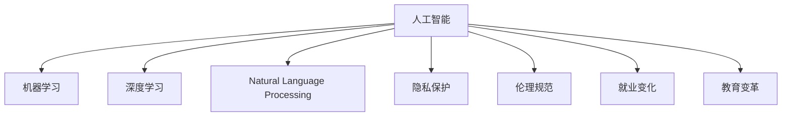

                 

# 人工智能：社会影响与思考

> 关键词：人工智能,社会影响,技术伦理,隐私保护,就业变化,教育变革,伦理规范,未来展望

## 1. 背景介绍

### 1.1 问题由来
随着人工智能技术的飞速发展，其在各个领域的应用逐渐深入，从制造业、医疗保健到金融、教育，再到日常生活的方方面面，人工智能的触角已经延伸至社会的每一个角落。人工智能的广泛应用带来了前所未有的生产力和便利性，但同时也引发了一系列复杂的社会问题。从隐私保护到就业影响，从伦理规范到未来展望，这些问题使得人工智能的社会影响成为一个值得深入探讨的重要议题。

### 1.2 问题核心关键点
人工智能的社会影响是一个多维度的议题，涉及到技术、伦理、经济、法律等多个层面。其核心关键点包括：
1. **隐私保护**：人工智能在收集、处理大量个人数据的过程中，如何确保用户隐私不被侵犯。
2. **就业变化**：自动化和智能化技术的广泛应用，是否会对人类就业产生重大影响。
3. **伦理规范**：如何在技术应用中平衡效率与公正，避免算法偏见和歧视。
4. **未来展望**：人工智能将如何改变未来社会的运作方式，带来哪些新的机遇与挑战。

### 1.3 问题研究意义
研究人工智能的社会影响，对于理解技术进步对社会结构和个体生活的影响，制定相应的政策法规，以及推动技术的健康发展，具有重要意义：

1. **促进政策制定**：帮助政策制定者理解和评估人工智能对社会的正面和负面影响，制定更加合理的政策和法规。
2. **指导企业实践**：为企业提供技术伦理和社会责任方面的指导，促进可持续的商业实践。
3. **提升公众意识**：增强公众对人工智能技术及其社会影响的认识，促进社会对技术发展的积极参与和监督。
4. **推动学术研究**：为学术界提供丰富的研究素材和方向，推动人工智能相关领域的研究进步。

## 2. 核心概念与联系

### 2.1 核心概念概述

为更好地理解人工智能的社会影响，本节将介绍几个密切相关的核心概念：

- **人工智能(Artificial Intelligence, AI)**：指能够模拟人类智能行为的技术，包括机器学习、深度学习、自然语言处理等。
- **机器学习(Machine Learning, ML)**：指通过数据训练模型，使模型能够自动从数据中学习规律，并应用到新数据中。
- **深度学习(Deep Learning, DL)**：机器学习的一个分支，通过构建多层次神经网络，学习数据的复杂表示。
- **自然语言处理(Natural Language Processing, NLP)**：处理和理解人类语言的技术，包括语言模型、文本分类、机器翻译等。
- **隐私保护(Privacy Protection)**：保护个人信息不被非法收集、使用或泄露的措施和技术手段。
- **伦理规范(Ethical Norms)**：指导技术应用中行为规范的标准和准则，如公平性、透明性、可解释性等。
- **就业变化(Employment Changes)**：人工智能技术自动化和智能化带来的就业市场变化，包括岗位消失与新增等。
- **教育变革(Education Transformation)**：人工智能技术在教育领域的应用，带来的教学模式、内容和学习方式的变化。

这些核心概念之间的逻辑关系可以通过以下Mermaid流程图来展示：



这个流程图展示了人工智能与其他核心概念的关联：

1. 人工智能通过机器学习和深度学习实现，对自然语言处理和隐私保护等有直接影响。
2. 人工智能的应用涉及伦理规范和就业变化等社会问题。
3. 人工智能在教育变革中扮演着重要角色。

## 3. 核心算法原理 & 具体操作步骤
### 3.1 算法原理概述

人工智能的社会影响研究，涉及多学科的知识和技能，包括计算机科学、社会学、心理学、法律等。其核心算法原理主要包括以下几个方面：

1. **数据采集与分析**：收集人工智能应用相关的数据，分析其在不同领域中的表现和影响。
2. **模型训练与评估**：构建和训练反映人工智能社会影响的模型，评估其预测和决策能力。
3. **社会模拟与仿真**：使用社会模拟和仿真技术，预测人工智能未来可能带来的社会变化。
4. **政策建议与实施**：基于模型预测结果，提出相应的政策建议，并评估其可行性。

### 3.2 算法步骤详解

以下将详细介绍人工智能社会影响研究的详细步骤：

**Step 1: 数据收集与预处理**
- 收集人工智能在不同领域（如医疗、教育、金融等）的应用数据。
- 对数据进行清洗和预处理，去除噪声和异常值，确保数据质量。
- 对数据进行标注，为后续的模型训练和分析提供依据。

**Step 2: 模型构建与训练**
- 根据研究目的，选择合适的机器学习或深度学习模型。
- 使用收集的数据对模型进行训练，调整模型参数以获得最佳性能。
- 对模型进行评估，确保其在特定场景下的表现和泛化能力。

**Step 3: 社会模拟与仿真**
- 使用构建的模型进行社会模拟，预测未来人工智能可能带来的社会变化。
- 引入复杂性因素，如人口、经济、政策等，进行多维度仿真。
- 对仿真结果进行敏感性分析和假设检验，确保结果的可靠性。

**Step 4: 政策建议与实施**
- 基于模拟和仿真结果，提出相应的政策建议。
- 评估政策建议的可行性和潜在影响，进行成本效益分析。
- 与政策制定者合作，推动政策的制定和实施。

### 3.3 算法优缺点

人工智能社会影响研究的优点包括：
1. **数据驱动**：基于大量数据，能够提供客观、准确的分析结果。
2. **模型透明**：使用机器学习和深度学习模型，其工作原理和决策过程可解释。
3. **跨学科融合**：融合社会学、心理学、法律等学科，提供多维度的分析视角。

同时，该方法也存在一些局限性：
1. **数据质量依赖**：依赖于数据的质量和数量，数据不足或质量不高可能导致分析结果不准确。
2. **模型复杂性**：深度学习模型通常复杂，不易解释和调试。
3. **假设限制**：社会模拟和仿真依赖于一系列假设，无法完全反映现实世界的情况。
4. **政策实施难度**：政策建议的实施需要广泛的社会共识和资源支持，可能面临阻力。

尽管存在这些局限性，但就目前而言，基于数据驱动和模型预测的研究方法，仍然是评估人工智能社会影响的重要手段。

### 3.4 算法应用领域

人工智能社会影响研究的应用领域广泛，包括但不限于以下几个方面：

- **医疗领域**：研究人工智能在疾病诊断、治疗方案推荐等方面的应用，评估其对医疗资源分配和社会公平的影响。
- **教育领域**：分析人工智能在个性化学习、智能评估、在线教育等方面的应用，探讨其对教育质量和社会公平的影响。
- **金融领域**：探讨人工智能在风险评估、投资策略、反欺诈等方面的应用，评估其对金融市场稳定和消费者权益的影响。
- **就业市场**：分析人工智能对就业结构、技能需求、劳动市场供需的影响，提出应对策略。
- **公共安全**：研究人工智能在监控、预测犯罪、应急响应等方面的应用，评估其对社会安全和个人隐私的影响。

这些领域的研究，不仅能够帮助相关企业和机构制定相应的政策和实践，还能够为政府决策提供科学依据。

## 4. 数学模型和公式 & 详细讲解  
### 4.1 数学模型构建

人工智能社会影响研究涉及多个学科的数学模型，这里以社会模拟和仿真为例，介绍其数学模型构建过程。

假设社会系统由人口、经济、技术等多个子系统组成，每个子系统都可以表示为一个数学模型。假设社会系统可以表示为一个线性动态系统：

$$
\mathbf{x}(t+1) = \mathbf{A}\mathbf{x}(t) + \mathbf{B}\mathbf{u}(t) + \mathbf{C}\mathbf{w}(t)
$$

其中：
- $\mathbf{x}(t)$ 表示社会系统在时刻 $t$ 的状态向量，包括人口数量、GDP、技术水平等。
- $\mathbf{A}$ 为状态转移矩阵，描述系统内部的相互作用。
- $\mathbf{B}$ 为控制矩阵，描述外部的干预因素，如政策、技术进步等。
- $\mathbf{u}(t)$ 为控制向量，描述外部的干预措施，如财政政策、技术研发等。
- $\mathbf{C}$ 为干扰矩阵，描述外部的扰动因素，如自然灾害、战争等。
- $\mathbf{w}(t)$ 为干扰向量，表示外部的随机扰动因素。

### 4.2 公式推导过程

在上述线性动态系统的基础上，我们可以进一步推导出社会模拟和仿真的数学模型。假设我们希望预测社会系统在未来 $T$ 年的变化，即求解：

$$
\mathbf{x}(T) = \mathbf{A}^T \mathbf{x}(0) + \sum_{k=0}^{T-1}\mathbf{A}^k\mathbf{B}\mathbf{u}(k)
$$

其中，$\mathbf{A}^k$ 表示 $k$ 次的状态转移矩阵，$\mathbf{B}\mathbf{u}(k)$ 表示在时刻 $k$ 的干预措施对系统状态的影响。

对于非线性动态系统，可以使用数值仿真方法进行求解，如Runge-Kutta方法、Adams-Bashforth方法等。这些方法通过离散化系统方程，逐步求解，得到系统状态的演化轨迹。

### 4.3 案例分析与讲解

以人工智能在医疗领域的应用为例，分析其对医疗资源分配和社会公平的影响。假设我们使用线性动态系统模型描述医疗资源的变化，模型的状态变量包括医疗设备数量、医疗人员数量、患者数量等。

**Step 1: 数据收集与预处理**
- 收集医疗设备、人员和患者的历史数据。
- 对数据进行清洗和标注，确保数据的完整性和一致性。

**Step 2: 模型构建与训练**
- 使用机器学习模型（如线性回归、决策树等）对医疗资源进行建模。
- 使用历史数据对模型进行训练，调整模型参数以获得最佳性能。
- 对模型进行评估，确保其在特定场景下的表现和泛化能力。

**Step 3: 社会模拟与仿真**
- 使用训练好的模型进行社会模拟，预测未来医疗资源的变化。
- 引入复杂性因素，如人口增长、老龄化、政策变化等，进行多维度仿真。
- 对仿真结果进行敏感性分析和假设检验，确保结果的可靠性。

**Step 4: 政策建议与实施**
- 基于模拟和仿真结果，提出相应的政策建议，如增加医疗投入、提高医疗人员技能等。
- 评估政策建议的可行性和潜在影响，进行成本效益分析。
- 与政策制定者合作，推动政策的制定和实施。

## 5. 项目实践：代码实例和详细解释说明
### 5.1 开发环境搭建

在进行人工智能社会影响研究时，需要搭建一个适合数据处理、模型训练和仿真分析的开发环境。以下是Python的开发环境搭建流程：

1. 安装Anaconda：从官网下载并安装Anaconda，用于创建独立的Python环境。

2. 创建并激活虚拟环境：
```bash
conda create -n ai-env python=3.8 
conda activate ai-env
```

3. 安装Python科学计算库：
```bash
conda install numpy scipy pandas matplotlib seaborn scikit-learn statsmodels statsmodels
```

4. 安装数据处理和可视化工具：
```bash
conda install pandas-profiling dask-gufunc dask
```

5. 安装模型训练库：
```bash
conda install torch torchvision torchaudio transformers
```

6. 安装社会模拟和仿真库：
```bash
conda install pymc3 arviz
```

完成上述步骤后，即可在`ai-env`环境中开始人工智能社会影响研究的实践。

### 5.2 源代码详细实现

这里以社会模拟和仿真为例，给出使用Python进行模型构建和仿真的代码实现。

首先，定义状态变量和模型参数：

```python
import numpy as np
from scipy.integrate import odeint

# 状态变量
x = np.zeros((n_states, n_timesteps))
# 控制向量
u = np.zeros((n_controls, n_timesteps))
# 干扰向量
w = np.zeros((n_disturbances, n_timesteps))

# 模型参数
A = np.array([...])  # 状态转移矩阵
B = np.array([...])  # 控制矩阵
C = np.array([...])  # 干扰矩阵
```

然后，构建社会系统方程：

```python
def system_dynamics(x, u, w, t):
    dx = np.zeros_like(x)
    for i in range(n_states):
        for j in range(n_states):
            dx[i] += A[i, j] * x[j]
        for j in range(n_controls):
            dx[i] += B[i, j] * u[j]
        for j in range(n_disturbances):
            dx[i] += C[i, j] * w[j]
    return dx

# 模拟未来T年系统状态变化
def simulate_system(A, B, C, initial_state, control, disturbance, timesteps):
    x = initial_state
    for t in range(n_timesteps - 1):
        dx = system_dynamics(x, control, disturbance, t)
        x = x + dx * dt
    return x

# 假设控制措施和干扰因素
control = np.array([...])
disturbance = np.array([...])
initial_state = np.array([...])
dt = 1.0
timesteps = 10

# 计算未来T年系统状态
x = simulate_system(A, B, C, initial_state, control, disturbance, timesteps)
```

最后，进行模型评估和分析：

```python
import matplotlib.pyplot as plt

# 绘制系统状态变化图
plt.plot(timesteps, x)
plt.xlabel('Year')
plt.ylabel('Resource Quantity')
plt.title('Resource Dynamics')
plt.show()

# 进行敏感性分析
def sensitivity_analysis(A, B, C, initial_state, control, disturbance, timesteps):
    sensitivity = np.zeros((n_states, n_controls + n_disturbances))
    for i in range(n_states):
        for j in range(n_controls + n_disturbances):
            A_i = A.copy()
            A_i[:, i] = A[:, j]
            x = simulate_system(A_i, B, C, initial_state, control, disturbance, timesteps)
            sensitivity[i, j] = np.linalg.norm(x - initial_state) / np.linalg.norm(x)
    return sensitivity

# 进行敏感性分析
sensitivity = sensitivity_analysis(A, B, C, initial_state, control, disturbance, timesteps)
plt.imshow(sensitivity, cmap='hot', interpolation='nearest')
plt.colorbar()
plt.xlabel('State')
plt.ylabel('Control/Disturbance')
plt.title('Sensitivity Analysis')
plt.show()
```

以上就是使用Python进行社会模拟和仿真的完整代码实现。可以看到，借助SciPy和NumPy库，我们可以方便地构建和求解复杂的多维动态系统模型，进行社会模拟和仿真分析。

### 5.3 代码解读与分析

让我们再详细解读一下关键代码的实现细节：

**状态变量和模型参数**：
- 使用NumPy数组定义状态变量、控制向量和干扰向量，以及模型参数。
- 状态变量和模型参数的具体数值需要根据实际情况进行设置。

**系统动态方程**：
- 使用SciPy的odeint函数进行系统动态方程的求解。
- 系统动态方程根据实际情况进行调整，确保其符合现实世界的物理和逻辑规则。

**模拟未来系统状态变化**：
- 使用自定义函数`simulate_system`进行未来系统状态的模拟。
- 模拟过程中需要考虑控制措施和干扰因素的影响。

**模型评估和分析**：
- 使用Matplotlib库绘制系统状态变化图。
- 进行敏感性分析，评估模型对不同因素的敏感度。

## 6. 实际应用场景

### 6.1 智能医疗

人工智能在医疗领域的应用，包括疾病诊断、治疗方案推荐、医疗资源分配等，带来了诸多社会影响。通过社会模拟和仿真，可以预测人工智能在这些场景下的应用效果，为政策制定提供参考。

**智能诊断系统**：通过深度学习模型对医疗影像进行分析和诊断，可以提高诊断的准确性和效率，减少误诊率。社会模拟可以预测该技术对医疗资源分配和社会公平的影响，提出相应的政策建议。

**个性化治疗方案**：基于患者的历史数据和基因信息，通过机器学习模型预测最优治疗方案。社会模拟可以评估个性化治疗对医疗资源配置、患者权益和医疗费用的影响，提出优化建议。

**医疗资源配置**：使用人工智能对医疗资源进行预测和分配，提高资源利用效率，减少等待时间。社会模拟可以评估不同资源配置策略对患者满意度和医疗质量的影响，提供决策支持。

### 6.2 教育领域

人工智能在教育领域的应用，包括智能评估、个性化学习、在线教育等，带来了教育方式的深刻变革。社会模拟和仿真可以预测这些技术对教育公平、教学质量和学习效果的影响。

**智能评估系统**：通过自然语言处理技术自动评估学生的作业和考试，提高评估的客观性和效率。社会模拟可以评估该技术对教育公平和学习动力的影响，提出优化建议。

**个性化学习系统**：基于学生的学习行为和成绩数据，通过机器学习模型推荐个性化的学习内容。社会模拟可以评估个性化学习对学生学习效果、教育公平和学习动力的影响，提供政策建议。

**在线教育平台**：使用人工智能技术提供高质量的在线教育资源，缓解教育资源不均的矛盾。社会模拟可以评估在线教育对教育公平和教育质量的影响，提出优化策略。

### 6.3 金融行业

人工智能在金融领域的应用，包括风险评估、投资策略、反欺诈等，带来了金融市场的深刻变化。社会模拟和仿真可以预测这些技术对金融稳定、消费者权益和市场公平的影响。

**风险评估系统**：通过机器学习模型预测金融市场的风险和趋势，提供决策支持。社会模拟可以评估该技术对金融市场稳定性和投资者保护的影响，提出优化建议。

**智能投资策略**：基于历史数据和市场动态，使用人工智能生成投资建议，优化投资组合。社会模拟可以评估智能投资对市场效率和投资者收益的影响，提供政策建议。

**反欺诈系统**：使用人工智能技术检测和防范金融欺诈行为，保护消费者权益。社会模拟可以评估反欺诈技术对金融安全和消费者保护的影响，提出优化策略。

### 6.4 未来应用展望

人工智能的未来应用前景广阔，涵盖了从医疗、教育、金融到智能制造、智慧城市等多个领域。以下是几个可能的发展方向：

- **智慧城市**：通过人工智能技术优化城市管理和公共服务，提高城市运行的效率和可持续性。社会模拟可以评估智慧城市对城市治理和社会公平的影响，提供政策建议。

- **智能制造**：使用人工智能优化生产流程和资源分配，提高制造业的效率和质量。社会模拟可以评估智能制造对就业市场、技能需求和资源配置的影响，提供决策支持。

- **智能医疗**：通过人工智能提高医疗服务的可及性和质量，减少医疗资源的浪费。社会模拟可以评估智能医疗对医疗资源分配和社会公平的影响，提出优化建议。

- **智能教育**：使用人工智能技术改进教育方式和资源分配，提升教育质量和公平性。社会模拟可以评估智能教育对教育公平和教学效果的影响，提供政策建议。

## 7. 工具和资源推荐
### 7.1 学习资源推荐

为了帮助开发者系统掌握人工智能社会影响的研究方法，这里推荐一些优质的学习资源：

1. **《人工智能社会影响》系列课程**：由多所知名大学和机构开设，涵盖了人工智能对社会各个领域的影响，包括隐私保护、就业变化、伦理规范等。

2. **《数据科学与人工智能》书籍**：深入浅出地介绍了数据科学和人工智能的基础知识，包括数据处理、机器学习、深度学习等。

3. **Kaggle平台**：提供大量公开数据集和竞赛任务，让你在实践中学习人工智能的实际应用，并与其他数据科学家交流分享。

4. **arXiv预印本库**：汇集了大量前沿的学术研究成果，涵盖人工智能的各个方向，提供丰富的学习资源。

5. **Python社区**：如Stack Overflow、GitHub等平台，聚集了大量的Python开发者和数据科学家，提供丰富的学习资源和代码示例。

通过对这些资源的学习实践，相信你一定能够快速掌握人工智能社会影响的研究方法，并用于解决实际问题。

### 7.2 开发工具推荐

高效的开发离不开优秀的工具支持。以下是几款用于人工智能社会影响研究开发的常用工具：

1. **Anaconda**：用于创建和管理Python环境，支持多语言和开源软件包的安装和管理。

2. **Jupyter Notebook**：支持Python、R等多种编程语言，提供交互式编程和数据可视化功能，是数据科学家常用的开发工具。

3. **SciPy**：用于科学计算和数据分析，提供丰富的数值计算、优化、统计分析等功能。

4. **NumPy**：用于高性能数组计算，是Python中最常用的数值计算库之一。

5. **Scikit-learn**：用于机器学习算法和数据处理，提供简单易用的接口和高效的模型实现。

6. **Pandas**：用于数据处理和分析，提供丰富的数据结构和数据操作函数。

合理利用这些工具，可以显著提升人工智能社会影响研究的开发效率，加快创新迭代的步伐。

### 7.3 相关论文推荐

人工智能社会影响的研究涉及多学科的交叉，以下是几篇奠基性的相关论文，推荐阅读：

1. **《人工智能伦理与社会影响》**：系统地探讨了人工智能技术在各个领域的应用，提出了相应的伦理规范和社会责任。

2. **《隐私保护与人工智能》**：介绍了隐私保护技术在人工智能中的应用，讨论了数据隐私和安全问题。

3. **《人工智能与就业市场》**：研究了人工智能对就业市场的影响，提出了应对策略和政策建议。

4. **《智能教育与社会公平》**：探讨了人工智能在教育领域的应用，分析了其对教育公平和学习效果的影响。

5. **《智慧城市与社会治理》**：研究了人工智能在智慧城市治理中的应用，讨论了其对城市治理和社会公平的影响。

这些论文代表了大规模人工智能社会影响研究的前沿，为学术界和产业界提供了宝贵的参考和借鉴。

## 8. 总结：未来发展趋势与挑战

### 8.1 研究成果总结

本文对人工智能社会影响的研究进行了系统梳理，涵盖了隐私保护、就业变化、伦理规范等多个方面，提供了一套完整的分析和评估框架。通过大量的数学模型和实例分析，展示了人工智能技术在实际应用中的社会影响，并提出了相应的政策建议。

### 8.2 未来发展趋势

展望未来，人工智能社会影响研究将呈现以下几个发展趋势：

1. **跨学科融合**：随着人工智能应用的深入，将需要更多的跨学科合作，涵盖社会学、心理学、法律等多个领域，共同探讨人工智能对社会的影响。

2. **模型优化与解释**：未来的研究将更加注重模型的优化和解释，提高模型的可解释性和透明度，增强公众对人工智能的信任和接受度。

3. **政策制定与实施**：基于社会模拟和仿真的政策建议，将逐渐在各个领域得到应用，推动政策的制定和实施，实现技术进步与社会发展的协同。

4. **国际合作与交流**：人工智能对社会的影响具有全球性，未来的研究将更加注重国际合作，分享经验，共同应对全球性挑战。

### 8.3 面临的挑战

尽管人工智能社会影响研究已经取得了一定的进展，但仍面临诸多挑战：

1. **数据质量问题**：人工智能社会影响研究依赖大量高质量数据，数据的获取和处理往往面临质量、隐私和伦理等多方面的挑战。

2. **模型复杂性**：复杂的社会系统难以用单一模型描述，模型的构建和调试难度较大。

3. **政策实施难度**：政策建议的制定和实施需要多方协作，面临利益冲突、资源限制等多重挑战。

4. **伦理规范缺失**：人工智能技术的应用往往缺乏明确的伦理规范，如何在技术进步和伦理道德之间找到平衡，是一个亟待解决的问题。

5. **公众接受度**：人工智能技术对社会的影响复杂多样，公众对其接受度存在较大差异，如何提升公众理解和接受度，是一个长期的挑战。

### 8.4 研究展望

面对人工智能社会影响研究的挑战，未来的研究需要在以下几个方面寻求新的突破：

1. **数据治理与隐私保护**：建立健全的数据治理体系，确保数据质量和安全，保护个人隐私和权益。

2. **多学科协同研究**：加强跨学科合作，形成系统性、综合性的人工智能社会影响研究方法。

3. **模型解释与透明度**：提升模型的可解释性和透明度，增强公众信任和接受度。

4. **政策制定与实施**：推动政策的制定和实施，实现技术进步与社会发展的协同。

5. **伦理规范建设**：制定明确的伦理规范，引导人工智能技术的健康发展。

这些研究方向将推动人工智能社会影响研究的深入，促进人工智能技术在各个领域的健康应用，实现技术进步与社会发展的协同。

## 9. 附录：常见问题与解答

**Q1：人工智能社会影响研究的难点是什么？**

A: 人工智能社会影响研究的难点主要包括数据获取和处理、模型构建和优化、政策制定和实施等。

1. **数据获取和处理**：高质量数据的获取和处理往往面临质量、隐私和伦理等多方面的挑战，需要建立健全的数据治理体系。

2. **模型构建和优化**：复杂的社会系统难以用单一模型描述，模型的构建和调试难度较大。

3. **政策制定和实施**：政策建议的制定和实施需要多方协作，面临利益冲突、资源限制等多重挑战。

**Q2：人工智能如何影响就业市场？**

A: 人工智能对就业市场的影响主要体现在以下几个方面：

1. **自动化取代岗位**：自动化和智能化技术可以取代一些重复性、低技能的工作岗位，导致部分劳动力失业。

2. **新兴岗位产生**：人工智能技术的发展也会带来一些新兴岗位，如数据分析、算法工程师等，需要培养相关技能。

3. **技能需求变化**：人工智能的应用需要更高的技术技能，推动劳动力市场的技能需求结构发生变化。

4. **产业结构调整**：人工智能技术将推动产业结构的优化和升级，提高经济效率和竞争力。

**Q3：人工智能如何影响教育公平？**

A: 人工智能对教育公平的影响主要体现在以下几个方面：

1. **个性化学习**：通过个性化学习系统，能够根据学生的学习行为和需求提供定制化的学习内容，提高学习效果。

2. **教育资源分配**：人工智能技术可以帮助优化教育资源的分配，确保优质教育资源的可及性。

3. **教育机会均等**：人工智能可以消除地域、性别、经济等方面的教育不平等，提供更加公平的教育机会。

4. **教育质量提升**：人工智能技术可以提高教育质量，帮助学生更好地掌握知识和技能。

**Q4：人工智能对医疗资源分配有何影响？**

A: 人工智能对医疗资源分配的影响主要体现在以下几个方面：

1. **提高诊疗效率**：通过智能诊断和个性化治疗，可以显著提高诊疗效率，减少医疗资源的浪费。

2. **优化资源配置**：人工智能技术可以帮助优化医疗资源的配置，确保资源的合理利用。

3. **促进医疗公平**：人工智能技术可以帮助缩小医疗资源的地域和城乡差距，提高医疗服务的公平性。

4. **支持医疗决策**：人工智能技术可以提供决策支持，帮助医生制定更加合理的诊疗方案。

这些问题的解答，展示了人工智能技术在各个领域的应用和影响，为读者提供了全面的视角和深入的理解。

---

作者：禅与计算机程序设计艺术 / Zen and the Art of Computer Programming

