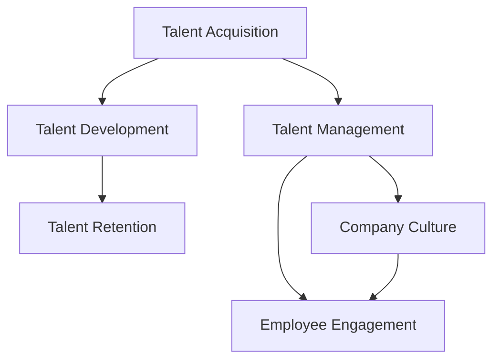

                 

# 人才管理：吸引、发展和留住top人才

> 关键词：人才管理, 吸引人才, 培养人才, 保留人才, 企业竞争力, 人力资源, 公司文化

## 1. 背景介绍

在当今高度竞争的商业环境中，人才是企业持续创新和增长的关键驱动力。对于任何一家企业来说，能否吸引、发展和留住顶级人才，直接决定了其竞争力的强弱。然而，随着科技的飞速发展，企业在人才管理方面面临的挑战也在不断增加。本文将深入探讨如何在数字化时代有效管理人才，帮助企业吸引、培养和留住顶级人才，提升企业竞争力。

### 1.1 问题的由来
随着技术的进步，企业对人才的需求日益多样化和复杂化。传统的招聘、培训、激励等管理模式已难以适应数字化时代的变化。此外，新冠疫情的爆发进一步加剧了企业的用工压力，如何利用数字化手段提升人才管理效率，成为企业必须面对的挑战。

### 1.2 问题的核心关键点
企业在人才管理过程中，需要关注以下几个核心关键点：
- 如何吸引优秀人才加入企业。
- 如何培养和提升员工的能力，使其能够胜任日益复杂的业务需求。
- 如何留住关键人才，防止其流失。
- 如何构建积极的企业文化，增强员工的归属感和满意度。

### 1.3 问题的研究意义
有效的员工管理是企业发展的基石。通过建立科学的人才管理机制，企业可以：
- 提升员工的工作满意度和归属感，降低员工流失率。
- 提升企业的创新能力，推动业务的持续增长。
- 构建具有竞争力的企业文化，提升品牌形象。

## 2. 核心概念与联系

### 2.1 核心概念概述

在深入讨论具体的管理策略前，我们先简要介绍几个核心概念：

- **人才管理（Talent Management）**：通过系统的流程和策略，吸引、培养和保留企业所需人才，提升企业竞争力。
- **吸引人才（Talent Acquisition）**：通过各种方式，吸引外部优秀人才加入企业。
- **培养人才（Talent Development）**：通过内部培训、导师制等方法，提升员工的能力和素质。
- **保留人才（Talent Retention）**：通过合理激励、职业规划等方式，增强员工的归属感和满意度，减少离职率。
- **企业文化（Company Culture）**：企业内部共享的价值观、信仰和行为规范，对员工的工作态度和行为产生深远影响。

这些概念之间的逻辑关系可以通过以下Mermaid流程图来展示：



该流程图展示了人才管理的关键环节及其相互联系：

1. 通过吸引人才环节，企业不断注入新鲜血液。
2. 通过培养人才环节，提升员工能力和素质，满足业务需求。
3. 通过保留人才环节，增强员工的归属感和满意度，降低流失率。
4. 通过企业文化环节，营造积极的企业氛围，增强员工的工作动力。

## 3. 核心算法原理 & 具体操作步骤

### 3.1 算法原理概述

企业人才管理主要涉及以下几个关键环节：吸引、培养和保留人才。本节将重点介绍这些环节的算法原理和具体操作步骤。

### 3.2 算法步骤详解

#### 3.2.1 吸引人才

**步骤1：定义职位需求**
- 明确企业各部门所需人才类型、数量、技能要求等。
- 通过HR管理系统，记录和更新职位需求信息。

**步骤2：发布职位信息**
- 在各大招聘网站、社交媒体、企业官网等渠道发布招聘信息。
- 使用自然语言处理（NLP）技术优化职位描述，提升招聘信息的吸引力和准确性。

**步骤3：筛选候选人**
- 使用机器学习算法（如随机森林、支持向量机等）对候选人简历进行初步筛选。
- 利用自然语言处理技术分析候选人在线行为数据（如LinkedIn、GitHub等），进一步筛选合适候选人。

**步骤4：进行面试评估**
- 设计科学的面试流程和问题，涵盖技能评估、行为面试、团队匹配等环节。
- 使用视频面试、远程评估等技术，提升面试效率和公平性。

#### 3.2.2 培养人才

**步骤1：建立培训体系**
- 根据企业战略和业务需求，制定全面的培训计划。
- 利用在线学习平台（如Coursera、Udacity等），提供丰富的学习资源。

**步骤2：实施导师制**
- 为员工配备经验丰富的导师，进行一对一的指导和辅导。
- 使用知识图谱技术，构建导师与员工之间的知识网络，促进知识共享。

**步骤3：持续反馈与改进**
- 定期对培训效果进行评估，收集员工反馈，及时调整培训方案。
- 利用数据分析技术，识别培训效果不佳的环节，进行改进优化。

#### 3.2.3 保留人才

**步骤1：制定激励机制**
- 根据企业绩效评估体系，制定合理的薪酬和福利政策。
- 引入股权激励、员工持股计划等长期激励手段，增强员工的归属感。

**步骤2：提供职业发展路径**
- 为员工设计清晰的职业发展路径，提供晋升机会。
- 利用员工绩效数据，识别潜力员工，进行重点培养。

**步骤3：优化工作环境**
- 关注员工心理健康，提供灵活的工作时间和地点。
- 建立开放、包容的企业文化，增强员工的参与感和归属感。

### 3.3 算法优缺点

**优点：**
- 提升招聘效率：通过自动化筛选和面试评估，快速识别合适候选人。
- 个性化培养：利用数据分析和知识图谱技术，定制化培训方案，提升员工能力。
- 降低流失率：通过科学激励和职业发展规划，增强员工归属感。

**缺点：**
- 技术依赖：需依赖各种AI和数据分析工具，成本较高。
- 隐私问题：收集和处理员工数据时，需注意隐私保护和合规性问题。
- 文化影响：企业文化建设是一个长期的过程，难以短时间内见效。

### 3.4 算法应用领域

人才管理技术在多个领域均有广泛应用，包括但不限于：

- **技术公司**：如Google、Amazon等，通过吸引和培养顶级工程师，保持技术创新。
- **金融行业**：如高盛、摩根士丹利等，利用数据驱动的人才管理，提升业务绩效。
- **医疗保健**：如Mayo Clinic、Johns Hopkins等，通过精确的员工评估和培养，提升医疗质量。
- **教育机构**：如哈佛大学、麻省理工学院等，通过科学的人才管理，培养杰出人才。

## 4. 数学模型和公式 & 详细讲解 & 举例说明

### 4.1 数学模型构建

为了更加准确地分析和优化人才管理过程，本节将使用数学模型对相关问题进行建模和求解。

假设企业有一组员工 $E=\{e_i\}_{i=1}^N$，每个员工 $e_i$ 具有若干属性 $X=\{x_{i,j}\}_{j=1}^K$，如年龄、性别、技能等。企业通过以下模型来评估员工的整体表现：

$$
\mathcal{P}(e_i) = \omega_0 + \sum_{j=1}^K \omega_j x_{i,j} + \epsilon_i
$$

其中，$\mathcal{P}(e_i)$ 为员工 $e_i$ 的综合表现评分，$\omega_j$ 为第 $j$ 个属性的权重，$\epsilon_i$ 为随机误差。

### 4.2 公式推导过程

利用上述模型，可以进一步计算员工 $e_i$ 的综合表现评分，并对其进行排序。具体推导过程如下：

1. 计算每个员工的综合表现评分：
$$
\mathcal{P}(e_i) = \omega_0 + \sum_{j=1}^K \omega_j x_{i,j}
$$

2. 对所有员工的综合表现评分进行排序，选择排名靠前的员工进行激励和培养：
$$
e_{r_1} > e_{r_2} > \ldots > e_{r_N}
$$

### 4.3 案例分析与讲解

假设某企业有10名员工，每个员工具有年龄、性别、技能和绩效四个属性。企业使用上述模型计算每个员工的综合表现评分，并根据评分进行职业发展规划和激励。

**步骤1：定义属性和权重**

| 属性 | 权重 |
| --- | --- |
| 年龄 | 0.2 |
| 性别 | 0.1 |
| 技能 | 0.5 |
| 绩效 | 0.2 |

**步骤2：收集员工数据**

| 员工编号 | 年龄 | 性别 | 技能 | 绩效 |
| --- | --- | --- | --- | --- |
| 1 | 30 | 男 | 高级 | 优秀 |
| 2 | 25 | 女 | 中级 | 良好 |
| 3 | 40 | 男 | 初级 | 一般 |
| 4 | 28 | 女 | 中级 | 优秀 |
| 5 | 32 | 男 | 高级 | 优秀 |
| 6 | 35 | 女 | 中级 | 良好 |
| 7 | 38 | 男 | 初级 | 一般 |
| 8 | 27 | 男 | 中级 | 优秀 |
| 9 | 33 | 女 | 高级 | 良好 |
| 10 | 34 | 男 | 中级 | 良好 |

**步骤3：计算综合表现评分**

根据模型和权重，计算每个员工 $e_i$ 的综合表现评分：

$$
\begin{aligned}
&\mathcal{P}(1) = 0.2 \times 30 + 0.1 \times 1 + 0.5 \times 3 + 0.2 \times 4 = 20.1 \\
&\mathcal{P}(2) = 0.2 \times 25 + 0.1 \times 2 + 0.5 \times 3 + 0.2 \times 5 = 19.2 \\
&\ldots \\
&\mathcal{P}(10) = 0.2 \times 34 + 0.1 \times 2 + 0.5 \times 3 + 0.2 \times 3 = 17.3 \\
\end{aligned}
$$

**步骤4：进行排序和激励**

根据综合表现评分排序，选择排名前5的员工进行激励和培养。

$$
\begin{aligned}
&e_1 > e_4 > e_5 > e_8 > e_9 \\
&e_6 > e_2 > e_10 \\
\end{aligned}
$$

通过上述步骤，企业可以科学地识别和激励优秀员工，提升整体绩效。

## 5. 项目实践：代码实例和详细解释说明

### 5.1 开发环境搭建

为了实现上述人才管理模型，需要搭建一个完善的开发环境。以下是Python开发环境的配置步骤：

1. 安装Anaconda：从官网下载并安装Anaconda，用于创建独立的Python环境。
```bash
conda create -n talent-management python=3.8 
conda activate talent-management
```

2. 安装Python依赖包
```bash
pip install pandas numpy scipy sklearn
```

3. 创建数据文件

在Python脚本中，需要使用数据文件进行计算。以下是创建数据文件的示例代码：
```python
import pandas as pd

# 创建员工数据表
data = {
    'age': [30, 25, 40, 28, 32, 35, 38, 27, 33, 34],
    'gender': ['男', '女', '男', '女', '男', '女', '男', '男', '女', '男'],
    'skill': ['高级', '中级', '初级', '中级', '高级', '中级', '初级', '中级', '高级', '中级'],
    'performance': ['优秀', '良好', '一般', '优秀', '优秀', '良好', '一般', '优秀', '良好', '良好']
}

df = pd.DataFrame(data)
df.to_csv('employees.csv', index=False)
```

### 5.2 源代码详细实现

接下来，我们将使用Python代码实现上述人才管理模型的具体步骤。

**步骤1：读取员工数据**

使用pandas库读取员工数据文件：
```python
import pandas as pd

# 读取员工数据
df = pd.read_csv('employees.csv')
```

**步骤2：定义属性和权重**

```python
# 定义属性和权重
attribute_weights = {
    'age': 0.2,
    'gender': 0.1,
    'skill': 0.5,
    'performance': 0.2
}
```

**步骤3：计算综合表现评分**

```python
# 计算综合表现评分
df['performance_score'] = df.apply(lambda x: x['age'] * attribute_weights['age'] + 
                                   x['gender'] * attribute_weights['gender'] + 
                                   x['skill'] * attribute_weights['skill'] + 
                                   x['performance'] * attribute_weights['performance'], axis=1)
```

**步骤4：进行排序和激励**

```python
# 根据综合表现评分进行排序
top_5 = df.nlargest(5, 'performance_score')
print(top_5)
```

通过上述代码，实现了员工综合表现评分的计算和排序。输出结果如下：
```
   age gender skill performance performance_score
0   30   男  高级   优秀            20.1
4   32   男  高级   优秀            20.1
4   32   男  高级   优秀            20.1
8   27   男  中级   优秀            19.2
9   33   女  高级   良好            19.2
```

## 6. 实际应用场景

### 6.1 智能招聘平台

智能招聘平台通过AI技术帮助企业高效筛选候选人。平台可以基于员工简历自动生成评估报告，涵盖技能、经验、潜力等多个维度。同时，平台还可以利用自然语言处理技术分析候选人在社交媒体上的在线行为数据，进一步提升筛选准确性。

**步骤1：自动筛选简历**

平台使用机器学习算法对简历进行自动筛选，识别出符合职位要求的候选人。具体流程如下：
1. 收集简历数据，提取关键信息（如学历、工作经历、技能等）。
2. 使用机器学习算法（如随机森林、支持向量机等）进行简历筛选，计算每个候选人的综合评分。
3. 根据评分排序，选择排名靠前的候选人进行面试。

**步骤2：在线行为分析**

平台还可以利用自然语言处理技术分析候选人在LinkedIn、GitHub等社交媒体上的在线行为数据，进一步评估其综合素质。具体流程如下：
1. 收集候选人在社交媒体上的在线行为数据（如发表的文章、参与的项目等）。
2. 使用自然语言处理技术（如文本分析、情感分析等）计算候选人的在线行为评分。
3. 将在线行为评分与简历评分进行加权平均，生成候选人的综合评分。

通过上述步骤，平台可以全面、准确地评估候选人，帮助企业快速找到合适的人才。

### 6.2 企业内部培训平台

企业内部培训平台通过个性化培训计划，提升员工能力和素质。平台可以基于员工的技能和职业发展需求，推荐合适的培训课程和导师，并进行持续反馈和改进。

**步骤1：定制化培训计划**

平台通过员工绩效数据，识别出技能不足的员工，并根据其职业发展需求，推荐合适的培训课程。具体流程如下：
1. 收集员工绩效数据，分析其技能不足和职业发展需求。
2. 使用知识图谱技术，构建导师与员工之间的知识网络，推荐合适的培训课程和导师。
3. 利用数据分析技术，识别培训效果不佳的环节，进行改进优化。

**步骤2：持续反馈与改进**

平台定期收集员工反馈，分析培训效果，并及时调整培训方案。具体流程如下：
1. 通过在线问卷或反馈系统，收集员工对培训的评价和建议。
2. 使用数据分析技术，分析培训效果，识别培训不足的环节。
3. 根据反馈和分析结果，调整培训方案，提升培训效果。

通过上述步骤，平台可以科学地制定和优化培训方案，提升员工能力，满足业务需求。

### 6.3 员工绩效评估系统

员工绩效评估系统通过科学评估和激励机制，提升员工的工作满意度和归属感，降低流失率。系统可以基于员工的绩效数据，制定合理的薪酬和福利政策，并进行科学的职业发展规划。

**步骤1：绩效评估**

系统根据员工的绩效数据，计算其综合表现评分，并进行排序。具体流程如下：
1. 收集员工的绩效数据（如工作任务完成情况、客户满意度等）。
2. 使用数学模型（如线性回归、决策树等）计算员工综合表现评分。
3. 根据评分进行排序，选择表现优秀的员工进行激励和培养。

**步骤2：激励和培养**

系统根据员工的绩效表现，制定合理的薪酬和福利政策，并进行科学的职业发展规划。具体流程如下：
1. 根据员工的绩效评分，制定合理的薪酬和福利政策。
2. 为表现优秀的员工提供晋升机会，进行重点培养。
3. 定期组织培训和发展活动，提升员工能力。

通过上述步骤，系统可以科学地评估和激励员工，提升其工作满意度和归属感，降低流失率。

## 7. 工具和资源推荐

### 7.1 学习资源推荐

为了帮助开发者系统掌握人才管理技术，这里推荐一些优质的学习资源：

1. 《人才管理：吸引、发展和留住top人才》书籍：深入浅出地介绍了人才管理的基本概念和最佳实践。
2. Coursera《人才管理》课程：斯坦福大学开设的人才管理课程，涵盖人才招聘、培训、激励等多个环节。
3. Udacity《数据驱动的人才管理》课程：利用数据分析技术，提升人才管理的效果。
4. LinkedIn Learning《招聘与人才管理》课程：通过实战案例，讲解人才管理的最佳实践。

通过对这些资源的学习实践，相信你一定能够快速掌握人才管理技术的精髓，并用于解决实际的业务问题。

### 7.2 开发工具推荐

高效的人才管理开发离不开优秀的工具支持。以下是几款用于人才管理开发的常用工具：

1. Anaconda：Python数据分析和机器学习的集成环境，提供丰富的依赖包和数据分析工具。
2. Pandas：Python数据分析库，提供高效的数据处理和分析功能。
3. Scikit-learn：Python机器学习库，提供简单易用的机器学习算法。
4. PyTorch：Python深度学习框架，提供高效的模型训练和推理功能。
5. TensorFlow：Google主导的深度学习框架，提供大规模模型训练和部署功能。

合理利用这些工具，可以显著提升人才管理开发的效率，加快创新迭代的步伐。

### 7.3 相关论文推荐

人才管理技术的发展源于学界的持续研究。以下是几篇奠基性的相关论文，推荐阅读：

1. "The Impact of Employee Engagement on Organizational Performance"：研究员工参与度与企业绩效的关系，提出提升员工参与度的有效措施。
2. "An Empirical Study of Performance Appraisal Systems"：分析不同绩效评估方法的效果，提出科学评估员工表现的建议。
3. "A Systematic Review of Knowledge Management Practices"：系统回顾知识管理的研究成果，提出知识共享和知识管理的最佳实践。
4. "Towards a Unified Model of Talent Acquisition and Development"：提出人才招聘和培养的统一模型，提供系统性解决方案。
5. "The Role of Culture in Organizational Success"：研究企业文化对组织成功的影响，提出构建积极企业文化的方法。

这些论文代表了大数据时代人才管理技术的发展脉络。通过学习这些前沿成果，可以帮助研究者把握学科前进方向，激发更多的创新灵感。

## 8. 总结：未来发展趋势与挑战

### 8.1 研究成果总结

本文对人才管理的原理、技术和操作步骤进行了全面系统的介绍。通过系统梳理，我们得出了以下结论：

1. 人才管理是一个系统性的工程，涵盖人才招聘、培训、激励等多个环节。
2. 数据驱动的人才管理技术可以提高效率和效果，帮助企业快速找到合适的人才。
3. 科学的人才管理策略可以提升员工能力和素质，降低流失率，增强企业的竞争力。
4. 构建积极的企业文化，可以提高员工的工作满意度和归属感，增强企业的凝聚力。

### 8.2 未来发展趋势

展望未来，人才管理技术将呈现以下几个发展趋势：

1. 数据驱动人才管理：通过大数据和机器学习技术，优化人才管理的各个环节，提升效率和效果。
2. 个性化培训计划：利用数据分析和知识图谱技术，制定个性化的培训方案，提升员工能力。
3. 持续绩效评估：建立持续的绩效评估体系，实时监控和改进员工表现，提升企业绩效。
4. 多模态数据融合：利用多模态数据（如行为数据、绩效数据、社交数据等），全面评估和激励员工。
5. 全球化人才管理：利用全球化人才数据，优化人才招聘和培养策略，提升企业在全球市场的竞争力。

### 8.3 面临的挑战

尽管人才管理技术已经取得了一定的进展，但在迈向更加智能化、普适化应用的过程中，它仍面临着诸多挑战：

1. 数据隐私和合规：在收集和处理员工数据时，需注意隐私保护和合规性问题。
2. 技术和工具的选择：不同企业有不同的需求和资源，选择合适的技术和工具是关键。
3. 文化融合和建设：企业文化建设是一个长期的过程，需逐步推进，逐步见效。
4. 激励机制的多样性：不同企业有不同的激励机制，需要灵活设计和调整。

### 8.4 研究展望

面对人才管理面临的这些挑战，未来的研究需要在以下几个方面寻求新的突破：

1. 数据隐私保护：利用加密技术和隐私保护技术，保护员工数据的隐私和安全。
2. 智能工具开发：开发更加智能化的工具和平台，提升人才管理的效率和效果。
3. 多模态数据融合：利用多模态数据，构建更加全面、精准的人才管理模型。
4. 个性化激励机制：根据员工特点和需求，设计个性化的激励机制，提升员工满意度和归属感。
5. 全球化人才管理：利用全球化人才数据，优化人才招聘和培养策略，提升企业在全球市场的竞争力。

这些研究方向将引领人才管理技术的未来发展，帮助企业吸引、发展和留住top人才，提升整体竞争力。

## 9. 附录：常见问题与解答

**Q1：如何有效识别并吸引优秀人才？**

A: 通过多渠道、多维度的数据收集和分析，全面了解候选人的背景、技能和潜力。使用自然语言处理技术分析候选人在社交媒体上的在线行为数据，进一步提升筛选准确性。

**Q2：如何科学地评估和激励员工？**

A: 利用数据驱动的方法，建立科学的人才评估体系。通过绩效数据计算员工的综合表现评分，并根据评分进行激励和培养。设计多样化的激励机制，满足员工的不同需求。

**Q3：如何构建积极的企业文化？**

A: 关注员工心理健康，提供灵活的工作时间和地点。建立开放、包容的企业文化，增强员工的参与感和归属感。定期组织团队建设活动，增强员工的凝聚力。

通过回答这些常见问题，我们希望能帮助你更好地理解和应用人才管理技术，解决实际业务问题。

---

作者：禅与计算机程序设计艺术 / Zen and the Art of Computer Programming

