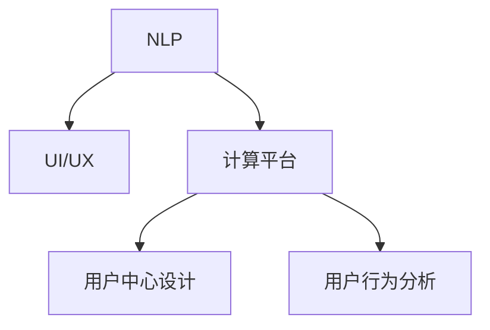

                 

# 人机交互：打造高效便捷的人类计算平台

> 关键词：人机交互,自然语言处理(NLP),界面设计,计算平台,高效便捷

## 1. 背景介绍

### 1.1 问题由来
随着科技的飞速发展，人类社会正经历前所未有的数字化转型。信息爆炸时代，人们对于计算平台的要求日益提升，不仅仅关注计算效率和精度，更重视用户的使用体验。如何通过技术手段，改善人机交互方式，打造高效便捷、易于使用的计算平台，成为了当前技术创新的重要课题。

### 1.2 问题核心关键点
人机交互技术，旨在建立高效、自然、易用的计算平台，将复杂的技术逻辑以更易理解的形式呈现给用户，从而提升用户的工作效率和满意度。其核心关键点包括：

- 自然语言处理(NLP)：通过理解自然语言，降低用户输入负担，提升交互效率。
- 界面设计(UI/UX)：通过人性化的界面和交互设计，使用户能够轻松上手，避免繁琐操作。
- 计算平台(计算能力与计算效率)：通过高效计算引擎，确保任务处理速度，避免卡顿和等待。
- 便捷性：通过友好的使用引导和即时反馈，让用户能够快速上手并适应。

## 2. 核心概念与联系

### 2.1 核心概念概述

为更好地理解人机交互技术的核心概念及其相互联系，本节将介绍几个密切相关的核心概念：

- **自然语言处理(Natural Language Processing, NLP)**：利用计算机技术处理、理解和生成自然语言。NLP使计算机能够理解人类语言，从而进行更高效、自然的交互。

- **界面设计(UI/UX)**：研究如何设计用户界面（UI）和用户体验（UX），提升用户的操作体验和满意度。

- **计算平台**：包括计算能力、计算效率、算法设计等方面。计算平台是实现高效便捷人机交互的基础设施。

- **用户中心设计**：以用户需求和体验为中心，进行产品设计，确保产品的易用性和亲和力。

- **用户行为分析**：通过分析用户行为数据，优化产品功能，提升用户满意度。

这些核心概念之间的逻辑关系可以通过以下Mermaid流程图来展示：



这个流程图展示出人机交互技术的核心概念及其之间的关系：

1. **NLP** 是实现自然交互的关键技术。
2. **UI/UX** 通过界面和交互设计提升用户体验。
3. **计算平台** 提供计算能力与效率，支持高效交互。
4. **用户中心设计** 和 **用户行为分析** 则确保产品与用户需求和体验紧密相连，从而提升整体满意度。

## 3. 核心算法原理 & 具体操作步骤

### 3.1 算法原理概述

人机交互技术涵盖了自然语言处理、界面设计、计算平台等多个领域。其核心算法原理主要包括以下几个方面：

- **自然语言理解(自然语言处理)**：通过算法使计算机能够理解和解析自然语言，提取关键信息。
- **界面生成与渲染**：通过算法设计直观、易用的界面，并根据用户操作进行动态渲染。
- **计算优化算法**：通过优化算法，提高计算效率，确保任务处理速度。

### 3.2 算法步骤详解

下面以自然语言处理和界面设计为例，详细讲解其算法步骤：

**自然语言处理算法步骤**：

1. **分词与词性标注**：将文本分割成词语，并标注每个词语的词性。
2. **句法分析**：分析句子的结构，提取主谓宾等成分。
3. **语义理解**：通过上下文理解词语和句子的含义。
4. **实体识别与关系抽取**：识别文本中的实体，提取实体之间的关系。
5. **对话管理**：通过对话管理模块，控制对话流程，生成自然语言回复。

**界面设计算法步骤**：

1. **用户需求分析**：通过问卷、访谈等方式，了解用户需求。
2. **信息架构设计**：设计信息结构，确定核心功能和交互路径。
3. **界面原型设计**：设计界面原型，进行用户测试。
4. **界面优化**：根据用户反馈，优化界面设计。
5. **界面渲染**：使用图形渲染技术，动态生成界面元素。

### 3.3 算法优缺点

人机交互技术的核心算法具有以下优点：

- **高效性**：通过算法优化，可以显著提升计算速度和处理效率。
- **智能化**：通过NLP等技术，使计算机能够理解自然语言，实现自然交互。
- **易用性**：通过界面设计，降低用户操作门槛，提升用户体验。

同时，这些算法也存在一些局限性：

- **复杂度**：设计和优化算法需要投入大量时间和资源，特别是对于一些复杂任务。
- **准确性**：算法的准确性受限于数据和模型的质量，可能需要大量的训练和调整。
- **可解释性**：一些高级算法（如深度学习）模型的决策过程难以解释，用户难以理解。
- **适应性**：算法设计往往需要针对特定任务进行调整，通用性不足。

### 3.4 算法应用领域

人机交互技术广泛应用于多个领域，包括但不限于：

- **智能助手**：通过NLP和UI设计，提供语音、文本交互的智能助手。
- **自动化办公系统**：通过自然语言处理和界面设计，提升办公效率。
- **医疗健康应用**：通过NLP和界面设计，提供智能问诊和健康管理服务。
- **智能家居设备**：通过自然语言理解和界面设计，实现与用户更自然的交互。
- **游戏与虚拟现实(VR/AR)**：通过界面设计，提供沉浸式的交互体验。
- **教育培训平台**：通过NLP和UI设计，提供个性化学习体验。

## 4. 数学模型和公式 & 详细讲解 & 举例说明

### 4.1 数学模型构建

本节将使用数学语言对自然语言处理和界面设计的算法模型进行更加严格的刻画。

假设输入的自然语言文本为 $X=\{x_1, x_2, \ldots, x_n\}$，其中每个 $x_i$ 是一个词语。

**自然语言处理模型**：

- **分词与词性标注模型**：
  $$
  P(\{w_i\} | X) = \prod_{i=1}^n P(w_i | X)
  $$
  其中 $w_i$ 为词语，$X$ 为文本。

- **句法分析模型**：
  $$
  P(\{S_i\} | X) = \prod_{i=1}^n P(S_i | X)
  $$
  其中 $S_i$ 为句子成分，$X$ 为文本。

- **语义理解模型**：
  $$
  P(\{m_i\} | X) = \prod_{i=1}^n P(m_i | X)
  $$
  其中 $m_i$ 为词语的含义，$X$ 为文本。

- **实体识别与关系抽取模型**：
  $$
  P(\{E_i, R_i\} | X) = \prod_{i=1}^n P(E_i, R_i | X)
  $$
  其中 $E_i$ 为实体，$R_i$ 为实体之间的关系，$X$ 为文本。

- **对话管理模型**：
  $$
  P(\{R_i\} | X, H) = \prod_{i=1}^n P(R_i | X, H)
  $$
  其中 $R_i$ 为回复，$X$ 为文本，$H$ 为对话历史，$H$ 对回复有重要影响。

**界面设计模型**：

- **用户需求分析模型**：
  $$
  P(D | Q) = \prod_{i=1}^n P(d_i | q_i)
  $$
  其中 $D$ 为需求，$Q$ 为问卷，$d_i$ 为需求项，$q_i$ 为问卷项。

- **信息架构设计模型**：
  $$
  P(I | D) = \prod_{i=1}^n P(i | d_i)
  $$
  其中 $I$ 为信息架构，$D$ 为需求，$i$ 为信息项。

- **界面原型设计模型**：
  $$
  P(P | I) = \prod_{i=1}^n P(p_i | i)
  $$
  其中 $P$ 为原型设计，$I$ 为信息架构，$p_i$ 为界面元素。

- **界面优化模型**：
  $$
  P(O | P, U) = \prod_{i=1}^n P(o_i | p_i, u_i)
  $$
  其中 $O$ 为界面优化，$P$ 为原型设计，$U$ 为用户反馈，$u_i$ 为用户反馈项，$o_i$ 为优化项。

- **界面渲染模型**：
  $$
  P(R | P, G) = \prod_{i=1}^n P(r_i | p_i, g_i)
  $$
  其中 $R$ 为界面渲染，$P$ 为原型设计，$G$ 为图形渲染技术，$r_i$ 为渲染后的界面元素。

### 4.2 公式推导过程

以下我们以自然语言处理中的句法分析为例，推导相关公式：

假设输入的自然语言文本为 $X=\{x_1, x_2, \ldots, x_n\}$，句法分析的目标是确定每个词语 $x_i$ 在句子中的成分 $S_i$，表示为 $(x_i, S_i)$。

使用条件概率模型，句法分析公式可以表示为：
$$
P(S_i | x_i, X) = \frac{P(x_i, S_i | X)}{P(x_i | X)}
$$

其中，$P(x_i, S_i | X)$ 为句子成分 $S_i$ 下词语 $x_i$ 出现的概率，$P(x_i | X)$ 为词语 $x_i$ 在文本 $X$ 中出现的概率。

根据句法分析的定义，可以进一步分解为：
$$
P(x_i, S_i | X) = P(S_i | X) \cdot P(x_i | S_i, X)
$$
$$
P(x_i | S_i, X) = \frac{P(x_i, S_i | X)}{P(S_i | X)}
$$

将上式代入句法分析公式，得：
$$
P(S_i | x_i, X) = \frac{P(S_i | X) \cdot P(x_i | S_i, X)}{P(x_i | X)}
$$

根据贝叶斯定理，可以进一步推导出：
$$
P(S_i | x_i, X) = \frac{P(x_i | S_i, X) \cdot P(S_i | X)}{P(x_i | X)}
$$

这个公式展示了如何通过句法分析模型计算每个词语的成分 $S_i$，从而实现自然语言理解。

### 4.3 案例分析与讲解

**案例：智能客服系统中的自然语言处理**

智能客服系统是自然语言处理在实际应用中的典型案例。其核心算法包括：

1. **分词与词性标注**：将用户输入的文本进行分词和词性标注，提取关键信息。

2. **句法分析**：分析句子结构，确定主谓宾等成分，从而理解用户意图。

3. **语义理解**：通过上下文理解词语和句子的含义，实现对用户意图的准确把握。

4. **实体识别与关系抽取**：识别文本中的实体，如用户姓名、账户信息等，提取实体之间的关系，如用户与账号之间的关系。

5. **对话管理**：通过对话管理模块，控制对话流程，生成自然语言回复，提升用户体验。

通过这些核心算法，智能客服系统能够实现对用户问题的快速理解与响应，极大提升客服效率和用户满意度。

## 5. 项目实践：代码实例和详细解释说明

### 5.1 开发环境搭建

在进行人机交互技术的项目实践前，我们需要准备好开发环境。以下是使用Python进行TensorFlow开发的开发环境配置流程：

1. 安装Anaconda：从官网下载并安装Anaconda，用于创建独立的Python环境。

2. 创建并激活虚拟环境：
```bash
conda create -n tensorflow-env python=3.8 
conda activate tensorflow-env
```

3. 安装TensorFlow：根据CUDA版本，从官网获取对应的安装命令。例如：
```bash
conda install tensorflow-gpu -c conda-forge
```

4. 安装各类工具包：
```bash
pip install numpy pandas scikit-learn matplotlib tqdm jupyter notebook ipython
```

完成上述步骤后，即可在`tensorflow-env`环境中开始项目实践。

### 5.2 源代码详细实现

这里我们以构建一个简单的智能客服系统的自然语言处理模块为例，给出使用TensorFlow进行自然语言处理的代码实现。

首先，导入所需的库和数据：

```python
import tensorflow as tf
import numpy as np
from tensorflow.keras.preprocessing.text import Tokenizer
from tensorflow.keras.preprocessing.sequence import pad_sequences
from tensorflow.keras.models import Sequential
from tensorflow.keras.layers import Embedding, LSTM, Dense

# 导入数据
with open('train.txt', 'r', encoding='utf-8') as f:
    train_data = f.readlines()
# 数据预处理
tokenizer = Tokenizer()
tokenizer.fit_on_texts(train_data)
train_sequences = tokenizer.texts_to_sequences(train_data)
train_padded = pad_sequences(train_sequences, maxlen=200)
```

接着，定义模型：

```python
# 定义模型
model = Sequential()
model.add(Embedding(input_dim=len(tokenizer.word_index) + 1, output_dim=128, input_length=200))
model.add(LSTM(128, dropout=0.2, recurrent_dropout=0.2))
model.add(Dense(1, activation='sigmoid'))
```

然后，编译和训练模型：

```python
# 编译模型
model.compile(optimizer='adam', loss='binary_crossentropy', metrics=['accuracy'])

# 训练模型
model.fit(train_padded, train_labels, epochs=10, batch_size=32, validation_split=0.2)
```

最后，评估模型性能：

```python
# 评估模型
test_data = ...
test_labels = ...
test_sequences = tokenizer.texts_to_sequences(test_data)
test_padded = pad_sequences(test_sequences, maxlen=200)
model.evaluate(test_padded, test_labels)
```

完整代码如下：

```python
import tensorflow as tf
import numpy as np
from tensorflow.keras.preprocessing.text import Tokenizer
from tensorflow.keras.preprocessing.sequence import pad_sequences
from tensorflow.keras.models import Sequential
from tensorflow.keras.layers import Embedding, LSTM, Dense

# 导入数据
with open('train.txt', 'r', encoding='utf-8') as f:
    train_data = f.readlines()
# 数据预处理
tokenizer = Tokenizer()
tokenizer.fit_on_texts(train_data)
train_sequences = tokenizer.texts_to_sequences(train_data)
train_padded = pad_sequences(train_sequences, maxlen=200)

# 定义模型
model = Sequential()
model.add(Embedding(input_dim=len(tokenizer.word_index) + 1, output_dim=128, input_length=200))
model.add(LSTM(128, dropout=0.2, recurrent_dropout=0.2))
model.add(Dense(1, activation='sigmoid'))

# 编译模型
model.compile(optimizer='adam', loss='binary_crossentropy', metrics=['accuracy'])

# 训练模型
model.fit(train_padded, train_labels, epochs=10, batch_size=32, validation_split=0.2)

# 评估模型
test_data = ...
test_labels = ...
test_sequences = tokenizer.texts_to_sequences(test_data)
test_padded = pad_sequences(test_sequences, maxlen=200)
model.evaluate(test_padded, test_labels)
```

### 5.3 代码解读与分析

让我们再详细解读一下关键代码的实现细节：

**数据预处理**：
- 使用 `Tokenizer` 类对文本进行分词和词性标注，将文本转换为数字序列。
- 使用 `pad_sequences` 函数对序列进行填充，确保所有序列长度一致，方便输入模型。

**模型定义**：
- 定义了一个简单的神经网络模型，包含一个嵌入层（Embedding）、一个LSTM层和一个全连接层（Dense）。嵌入层将单词转换为向量表示，LSTM层进行序列建模，全连接层输出二分类结果。

**模型编译与训练**：
- 使用 `compile` 函数编译模型，指定优化器、损失函数和评估指标。
- 使用 `fit` 函数训练模型，指定训练数据、批次大小、训练轮数和验证集比例。

**模型评估**：
- 使用 `evaluate` 函数评估模型在测试集上的性能，输出准确率和损失值。

## 6. 实际应用场景

### 6.1 智能客服系统

智能客服系统是自然语言处理在实际应用中的典型案例。通过自然语言处理技术，智能客服系统能够实现对用户问题的快速理解与响应，极大提升客服效率和用户满意度。

**应用场景**：
- 自动回复常见问题：系统能够识别用户提出的常见问题，并自动生成简洁明了的回复。
- 智能路由：根据用户意图，将问题自动转接给相关客服人员，提高处理效率。
- 情感分析：通过分析用户情感，及时调整回答策略，提高用户满意度。

**技术实现**：
- 分词与词性标注：对用户输入的文本进行分词和词性标注，提取关键信息。
- 句法分析：分析句子结构，确定主谓宾等成分，从而理解用户意图。
- 语义理解：通过上下文理解词语和句子的含义，实现对用户意图的准确把握。
- 实体识别与关系抽取：识别文本中的实体，如用户姓名、账户信息等，提取实体之间的关系，如用户与账号之间的关系。
- 对话管理：通过对话管理模块，控制对话流程，生成自然语言回复，提升用户体验。

### 6.2 自动化办公系统

自动化办公系统通过自然语言处理和界面设计技术，极大提升办公效率和工作体验。

**应用场景**：
- 智能文档生成：系统能够根据模板自动生成各种文档，如合同、报告等。
- 任务调度：根据任务描述，自动安排任务处理优先级和分配任务。
- 智能助手：通过NLP技术，实现语音和文本交互，快速响应各种办公需求。

**技术实现**：
- 分词与词性标注：对文档进行分词和词性标注，提取关键信息。
- 句法分析：分析句子结构，确定主谓宾等成分，从而理解文档内容。
- 语义理解：通过上下文理解词语和句子的含义，实现对文档内容的准确把握。
- 实体识别与关系抽取：识别文档中的实体，如日期、地点等，提取实体之间的关系。
- 对话管理：通过对话管理模块，控制对话流程，生成自然语言回复，提升用户体验。

### 6.3 医疗健康应用

医疗健康应用通过自然语言处理和界面设计技术，提供智能问诊和健康管理服务。

**应用场景**：
- 智能问诊：系统能够根据患者描述，自动生成初步诊断报告。
- 健康管理：根据健康数据，提供个性化的健康建议和监测。
- 电子病历：自动生成和更新电子病历，提升医院工作效率。

**技术实现**：
- 分词与词性标注：对患者描述进行分词和词性标注，提取关键信息。
- 句法分析：分析句子结构，确定主谓宾等成分，从而理解患者描述。
- 语义理解：通过上下文理解词语和句子的含义，实现对患者描述的准确把握。
- 实体识别与关系抽取：识别文本中的实体，如症状、药物等，提取实体之间的关系。
- 对话管理：通过对话管理模块，控制对话流程，生成自然语言回复，提升用户体验。

### 6.4 未来应用展望

随着人机交互技术的发展，未来将会有更多应用场景得到拓展。

**未来趋势**：
- **多模态交互**：结合视觉、听觉等多模态信息，提升交互体验。
- **智能决策**：通过机器学习和深度学习，提升决策准确性和智能化水平。
- **个性化推荐**：根据用户行为和偏好，提供个性化推荐服务，提升用户满意度。
- **增强现实(AR)和虚拟现实(VR)**：结合AR和VR技术，提供沉浸式交互体验。
- **泛在计算**：通过物联网和边缘计算技术，实现随时随地计算服务。

## 7. 工具和资源推荐

### 7.1 学习资源推荐

为了帮助开发者系统掌握人机交互技术的理论基础和实践技巧，这里推荐一些优质的学习资源：

1. 《深度学习》（Ian Goodfellow著）：深度学习领域的经典教材，详细介绍了深度学习的基本概念和算法原理。
2. 《自然语言处理综论》（Daniel Jurafsky和James H. Martin著）：自然语言处理领域的权威教材，涵盖了NLP的各个方面。
3. 《用户界面设计》（Jesse James Garrett著）：界面设计领域的经典书籍，介绍了UI设计的原则和实践方法。
4. 《人机交互的心理学与工程》（John Du])).这本书介绍了人机交互的心理学基础和工程实践。
5. Coursera的《自然语言处理专项课程》：斯坦福大学开设的NLP专项课程，涵盖了自然语言处理的基本概念和核心算法。
6. Udacity的《人机交互设计》课程：谷歌和Adobe合作的UI/UX设计课程，介绍了设计思维和实践方法。

通过对这些资源的学习实践，相信你一定能够快速掌握人机交互技术的精髓，并用于解决实际的NLP问题。

### 7.2 开发工具推荐

高效的开发离不开优秀的工具支持。以下是几款用于人机交互技术开发的常用工具：

1. TensorFlow：基于Python的开源深度学习框架，灵活动态的计算图，适合快速迭代研究。目前支持自然语言处理、图像处理等多个领域。
2. PyTorch：基于Python的开源深度学习框架，灵活的动态图，支持分布式计算和GPU加速。适用于自然语言处理等任务。
3. Jupyter Notebook：一个交互式的开发环境，支持Python、R等多种编程语言，适合进行数据探索和模型验证。
4. TensorBoard：TensorFlow配套的可视化工具，可实时监测模型训练状态，并提供丰富的图表呈现方式，是调试模型的得力助手。
5. Weights & Biases：模型训练的实验跟踪工具，可以记录和可视化模型训练过程中的各项指标，方便对比和调优。
6. WeChat Mini Program：提供微信小程序开发平台，支持自然语言处理、语音识别等技术，方便接入用户交互场景。

合理利用这些工具，可以显著提升人机交互技术的开发效率，加快创新迭代的步伐。

### 7.3 相关论文推荐

人机交互技术的发展离不开学界的持续研究。以下是几篇奠基性的相关论文，推荐阅读：

1. 《Siri: Redefining the Digital Assistant Experience》（苹果公司论文）：介绍了Siri语音助手的技术实现和用户体验设计。
2. 《Microsoft Cortana: Building a Conversational Agent》（微软公司论文）：介绍了Cortana语音助手的技术实现和用户体验设计。
3. 《Google Assistant: Building a Natural-Language Understanding System with Deep Learning》（谷歌公司论文）：介绍了Google Assistant的自然语言理解和生成技术。
4. 《Deep Reinforcement Learning for Personalized Daily Routine Scheduling》（MIT论文）：介绍了使用深度强化学习技术进行个性化日常任务调度。
5. 《The Design of Everyday Things》（唐纳德·A·诺曼著）：经典的用户界面设计书籍，介绍了设计原则和实践方法。
6. 《Human-Computer Interaction: History, Foundations, and Design》（David Kelley著）：介绍了人机交互的历史、基础和设计方法。

这些论文代表了大语言模型微调技术的发展脉络。通过学习这些前沿成果，可以帮助研究者把握学科前进方向，激发更多的创新灵感。

## 8. 总结：未来发展趋势与挑战

### 8.1 总结

本文对基于自然语言处理和界面设计的人机交互技术进行了全面系统的介绍。首先阐述了人机交互技术的研究背景和意义，明确了人机交互在提升用户体验和效率方面的重要作用。其次，从原理到实践，详细讲解了自然语言处理和界面设计的算法步骤，给出了完整的代码实例和详细解读。同时，本文还探讨了人机交互技术在多个实际应用场景中的具体实现和未来趋势。

通过本文的系统梳理，可以看到，基于自然语言处理和界面设计的人机交互技术正逐步成为主流技术，极大地提升了用户体验和系统效率。未来，随着技术的不断进步，人机交互技术将在更多领域得到应用，为人类带来更加便捷、智能的计算平台。

### 8.2 未来发展趋势

展望未来，人机交互技术将呈现以下几个发展趋势：

1. **多模态交互**：结合视觉、听觉、触觉等多模态信息，提供更加丰富、自然的交互体验。
2. **个性化推荐**：通过机器学习和大数据技术，提供个性化的推荐服务，提升用户满意度。
3. **智能决策**：结合自然语言处理和机器学习技术，提升决策的智能化水平。
4. **增强现实(AR)和虚拟现实(VR)**：结合AR和VR技术，提供沉浸式、互动式的人机交互体验。
5. **泛在计算**：通过物联网和边缘计算技术，实现随时随地、无处不在的计算服务。
6. **交互界面优化**：通过人机交互技术的不断改进，提升界面设计和用户体验。

### 8.3 面临的挑战

尽管人机交互技术已经取得了显著进展，但在迈向更加智能化、普适化应用的过程中，仍面临诸多挑战：

1. **数据隐私和安全**：人机交互技术需要大量用户数据，如何保护用户隐私和数据安全是一个重要问题。
2. **模型鲁棒性和公平性**：人机交互模型需要具备高鲁棒性和公平性，避免偏见和歧视。
3. **用户界面设计复杂性**：界面设计需要兼顾美观、易用、高效等多重需求，设计难度较大。
4. **交互体验一致性**：不同设备、不同平台上的交互体验需要保持一致，才能提高用户满意度。
5. **实时性要求高**：交互系统需要实时响应，对计算资源和网络带宽要求较高。
6. **技术门槛高**：人机交互技术需要结合自然语言处理、界面设计、人工智能等多个领域的知识，技术门槛较高。

### 8.4 研究展望

面对人机交互技术所面临的种种挑战，未来的研究需要在以下几个方面寻求新的突破：

1. **隐私保护技术**：开发更加安全、隐私保护的技术，确保用户数据安全。
2. **公平性算法**：研究公平性算法，提升模型鲁棒性和公平性。
3. **智能交互设计**：结合人工智能和设计思维，设计更加智能、易用的界面。
4. **跨平台一致性**：研究跨平台交互技术，实现不同设备、不同平台上的体验一致。
5. **实时响应技术**：开发高效、低延迟的实时响应技术，提高系统性能。
6. **技术普及教育**：推广人机交互技术，降低技术门槛，提高开发者能力。

这些研究方向的探索，必将引领人机交互技术迈向更高的台阶，为构建安全、可靠、可解释、可控的智能系统铺平道路。面向未来，人机交互技术还需要与其他人工智能技术进行更深入的融合，如知识表示、因果推理、强化学习等，多路径协同发力，共同推动自然语言理解和智能交互系统的进步。只有勇于创新、敢于突破，才能不断拓展人机交互的边界，让智能技术更好地造福人类社会。

## 9. 附录：常见问题与解答

**Q1：如何构建高效的人机交互界面？**

A: 高效的人机交互界面设计需要考虑以下几个方面：
1. **用户需求分析**：通过问卷、访谈等方式，了解用户需求和行为习惯。
2. **界面原型设计**：使用线框图或原型工具，设计界面原型，进行用户测试。
3. **界面优化**：根据用户反馈，优化界面设计，确保易用性和直观性。
4. **界面渲染**：使用图形渲染技术，动态生成界面元素，提升视觉效果。
5. **反馈机制**：提供即时反馈，如动画效果、提示信息等，提升用户体验。

**Q2：如何提升人机交互系统的鲁棒性？**

A: 提升人机交互系统的鲁棒性，需要从数据、模型和算法等多个方面进行改进：
1. **数据清洗**：使用数据清洗技术，去除噪声和异常数据，提升数据质量。
2. **模型优化**：使用正则化、Dropout等技术，避免模型过拟合。
3. **算法改进**：引入对抗训练、集成学习等技术，提升模型鲁棒性。
4. **用户交互优化**：引入多轮对话、上下文理解等技术，提升用户交互体验。
5. **多模态融合**：结合视觉、听觉等多模态信息，提升系统的鲁棒性和适应性。

**Q3：人机交互系统的设计原则是什么？**

A: 人机交互系统的设计原则主要包括：
1. **用户中心**：以用户需求和体验为中心，进行产品设计。
2. **简洁直观**：界面设计简洁直观，避免复杂操作和繁琐步骤。
3. **易用性**：界面操作简单易懂，用户能够轻松上手。
4. **可扩展性**：系统设计具备可扩展性，能够根据需求进行调整和升级。
5. **一致性**：不同设备、不同平台上的交互体验需要保持一致，提升用户体验。

**Q4：如何优化人机交互系统的实时性？**

A: 优化人机交互系统的实时性，需要从计算资源和网络带宽等多个方面进行改进：
1. **计算优化**：使用高效的算法和数据结构，减少计算量和时间消耗。
2. **资源优化**：使用GPU、TPU等高性能计算资源，提升计算效率。
3. **数据压缩**：使用数据压缩技术，减少数据传输和存储的带宽和时间消耗。
4. **边缘计算**：将计算任务分配到边缘设备上，减少网络传输延迟。
5. **缓存技术**：使用缓存技术，提高数据的访问速度。

**Q5：人机交互系统面临的最大挑战是什么？**

A: 人机交互系统面临的最大挑战主要包括以下几个方面：
1. **数据隐私和安全**：人机交互系统需要大量用户数据，如何保护用户隐私和数据安全是一个重要问题。
2. **模型鲁棒性和公平性**：人机交互模型需要具备高鲁棒性和公平性，避免偏见和歧视。
3. **交互体验一致性**：不同设备、不同平台上的交互体验需要保持一致，才能提高用户满意度。
4. **技术门槛高**：人机交互技术需要结合自然语言处理、界面设计、人工智能等多个领域的知识，技术门槛较高。

**Q6：人机交互系统的未来发展方向是什么？**

A: 人机交互系统的未来发展方向主要包括：
1. **多模态交互**：结合视觉、听觉、触觉等多模态信息，提供更加丰富、自然的交互体验。
2. **个性化推荐**：通过机器学习和大数据技术，提供个性化的推荐服务，提升用户满意度。
3. **智能决策**：结合自然语言处理和机器学习技术，提升决策的智能化水平。
4. **增强现实(AR)和虚拟现实(VR)**：结合AR和VR技术，提供沉浸式、互动式的人机交互体验。
5. **泛在计算**：通过物联网和边缘计算技术，实现随时随地、无处不在的计算服务。

通过不断优化和创新，人机交互技术将在更多领域得到应用，为人类带来更加便捷、智能的计算平台。相信随着技术的不断进步，人机交互技术将成为人工智能落地应用的重要范式，推动人工智能技术在更广阔的领域加速渗透。

