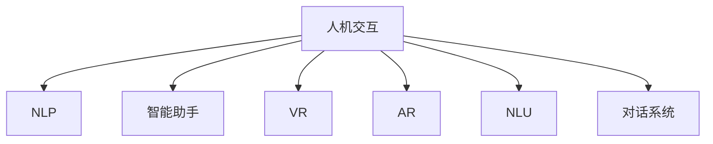

                 

# 人机交互：打造高效便捷的人类计算系统

> 关键词：人机交互,人类计算系统,自然语言处理(NLP),智能助手,虚拟现实(VR),增强现实(AR),自然语言理解(NLU),对话系统,交互界面,用户体验设计,交互模型

## 1. 背景介绍

### 1.1 问题由来
在当今信息爆炸的时代，人类面临着海量数据的处理和存储挑战。如何高效便捷地利用这些数据，使计算机更好地服务于人类生活，已成为亟待解决的问题。人机交互技术作为连接计算机和人类感知与行为的桥梁，正逐步引领计算方式的发展。自然语言处理(NLP)、智能助手、虚拟现实(VR)、增强现实(AR)等前沿技术正在迅速改变我们的计算习惯，并激发更多创新应用。

### 1.2 问题核心关键点
目前，人机交互技术的核心在于提升用户与计算机之间的互动效率和自然性。这包括但不限于以下几个关键点：
- 自然语言理解与生成：通过NLP技术，使计算机能够理解和生成自然语言，实现与用户的无障碍交流。
- 智能辅助与决策：利用机器学习、人工智能等技术，为用户提供个性化、精准的辅助决策。
- 多模态交互：结合文本、图像、语音等多种模态信息，丰富用户交互体验。
- 增强现实与虚拟现实：利用AR/VR技术，打造沉浸式、互动式的计算环境。

这些技术的综合运用，使得计算机不再仅仅是冷冰冰的工具，而是成为用户获取信息、完成任务的智能伙伴。

### 1.3 问题研究意义
研究人机交互技术，对于提升计算效率、优化用户体验、推动各行各业的数字化转型，具有重要意义：

1. 提升计算效率：通过自然语言理解和智能决策，极大地减少了用户操作复杂度，提升了计算效率。
2. 优化用户体验：结合多模态交互和沉浸式计算环境，为用户提供更加自然、便捷的使用体验。
3. 推动产业升级：在医疗、教育、零售等众多领域，人机交互技术正在赋能传统行业，推动产业升级和转型。
4. 激发创新应用：人机交互技术的发展，催生了智能助手、虚拟现实游戏、增强现实导航等创新应用，拓展了计算应用的边界。
5. 增进社会福祉：智能医疗、教育辅助等应用，正在改善人们的生活质量，增进社会福祉。

## 2. 核心概念与联系

### 2.1 核心概念概述

为更好地理解人机交互的核心概念，本节将介绍几个关键概念及其相互关系：

- 人机交互(Human-Computer Interaction, HCI)：研究如何让计算机更好地理解人类的感知与行为，以及如何通过用户界面提供高效便捷的服务。
- 自然语言处理(Natural Language Processing, NLP)：使计算机能够理解和生成自然语言的技术。
- 智能助手(Chatbot, AI Assistant)：基于NLP和机器学习技术，能够理解并回应用户查询的人工智能系统。
- 虚拟现实(Virtual Reality, VR)：通过计算机生成的虚拟环境，让用户身临其境地体验，常用于游戏、培训等场景。
- 增强现实(Augmented Reality, AR)：在现实世界场景中添加虚拟信息，丰富用户的交互体验。
- 自然语言理解(Natural Language Understanding, NLU)：使计算机能够理解和解释自然语言的技术，通常作为智能助手和对话系统的基础。
- 对话系统(Dialogue System)：通过自然语言生成和理解，实现人机之间的自然对话。

这些核心概念之间的逻辑关系可以通过以下Mermaid流程图来展示：



这个流程图展示了自己对核心概念的逻辑关系：

1. 人机交互技术的实现，通常依赖NLP和NLU技术。
2. 智能助手和对话系统是NLP和NLU技术的重要应用场景。
3. 虚拟现实和增强现实是展示人机交互效果的重要媒介。

这些概念共同构成了人机交互的核心框架，推动着计算方式的不断进步。

## 3. 核心算法原理 & 具体操作步骤
### 3.1 算法原理概述

人机交互的算法原理，主要围绕以下几个关键点展开：

- **自然语言理解(NLU)**：使计算机能够理解自然语言文本，包括语义分析、实体识别、意图推断等。
- **自然语言生成(NLG)**：使计算机能够生成自然语言文本，如回复用户查询、生成报告等。
- **对话管理**：通过对话策略和模型，管理对话流程，确保对话的自然性和连贯性。
- **多模态交互**：结合文本、图像、语音等多种信息源，丰富交互体验。
- **情感计算**：通过情感分析，识别用户情绪，调整交互策略，提升用户体验。

这些算法通常基于深度学习、自然语言处理、计算机视觉等技术，并结合用户行为数据，进行模型训练和优化。

### 3.2 算法步骤详解

基于人机交互的算法步骤大致可以分为以下几个步骤：

**Step 1: 数据准备**
- 收集和整理用于训练模型的数据，如用户查询、对话记录、文本数据等。
- 清洗数据，去除噪音和无关信息，保证数据质量。

**Step 2: 模型选择与训练**
- 选择合适的模型架构，如基于Transformer的NLP模型、深度神经网络等。
- 利用收集的数据，训练模型，优化模型参数。
- 使用交叉验证等技术，评估模型性能。

**Step 3: 模型评估与优化**
- 在验证集上评估模型性能，调整模型参数或架构，避免过拟合。
- 使用A/B测试等方法，优化模型在实际环境中的应用效果。

**Step 4: 集成与部署**
- 将训练好的模型集成到应用程序中。
- 进行系统部署，确保系统的稳定性和高效性。
- 定期更新模型和数据，保持系统性能。

**Step 5: 用户反馈与迭代**
- 收集用户反馈，识别问题和改进点。
- 根据用户反馈，进行模型和系统的迭代优化。

### 3.3 算法优缺点

人机交互算法具有以下优点：
1. **高效便捷**：自然语言理解和生成技术，大大降低了用户操作复杂度。
2. **个性化服务**：通过用户行为数据分析，提供个性化、精准的辅助决策。
3. **多样化的交互方式**：结合多模态交互和虚拟现实/增强现实技术，丰富用户体验。

然而，也存在一些局限性：
1. **数据依赖**：模型性能依赖高质量的数据，数据收集和标注成本较高。
2. **技术复杂**：算法实现复杂，需要深度学习、自然语言处理等多学科知识。
3. **交互质量不稳定**：自然语言理解和生成的准确性受限于数据和模型，可能存在理解错误或生成不自然的问题。
4. **隐私和安全问题**：用户数据可能被滥用或泄露，需要严格的数据保护措施。

尽管存在这些局限性，但人机交互技术已经在众多领域得到了广泛应用，并不断推动着计算方式的变革。

### 3.4 算法应用领域

人机交互技术在以下领域已经得到了广泛应用：

- **智能助手**：如Siri、Alexa、Google Assistant等，通过NLP技术，提供实时响应和信息检索服务。
- **客户服务**：企业客户服务系统，通过智能助手处理常见问题，提升客户满意度。
- **医疗健康**：智能医疗助手，提供诊断建议、病情监控等服务。
- **教育培训**：智能教育平台，通过智能助手辅助教学，提供个性化学习建议。
- **金融服务**：智能金融助手，提供财务咨询、交易分析等服务。
- **电子商务**：智能客服和推荐系统，提升用户购物体验。
- **虚拟现实游戏**：通过AR/VR技术，提供沉浸式游戏体验。
- **增强现实导航**：AR导航应用，帮助用户便捷找到目的地。

此外，人机交互技术也在持续探索新的应用场景，如智能家居、自动驾驶、工业自动化等领域，为各行各业带来智能化升级。

## 4. 数学模型和公式 & 详细讲解  
### 4.1 数学模型构建

人机交互的核心在于理解自然语言，因此本节将重点介绍自然语言理解(NLU)的数学模型。

假设自然语言文本为 $x \in \mathcal{X}$，其中 $\mathcal{X}$ 为文本空间，模型为 $M_{\theta}$，其中 $\theta$ 为模型参数。定义模型的损失函数为 $\ell(M_{\theta}(x),y)$，其中 $y$ 为模型的预测输出。

假设模型 $M_{\theta}$ 通过深度学习技术进行训练，目标是最大化模型在训练数据上的准确率，即：

$$
\theta^* = \mathop{\arg\max}_{\theta} \mathcal{L}(M_{\theta})
$$

其中 $\mathcal{L}$ 为模型在训练集 $D$ 上的损失函数，通常为交叉熵损失：

$$
\mathcal{L}(M_{\theta}) = -\frac{1}{N}\sum_{i=1}^N \ell(M_{\theta}(x_i),y_i)
$$

在实际应用中，模型 $M_{\theta}$ 通过反向传播算法进行训练，不断更新参数 $\theta$，最小化损失函数 $\mathcal{L}$，直至收敛。

### 4.2 公式推导过程

以下我们以命名实体识别(NER)任务为例，推导自然语言理解模型的公式。

假设模型 $M_{\theta}$ 在输入 $x$ 上的预测结果为 $y = \{(y_1, y_2, ..., y_n)\}$，表示对输入文本进行实体标注。定义损失函数为交叉熵损失：

$$
\ell(M_{\theta}(x),y) = -\sum_{i=1}^N \log \left(\frac{e^{M_{\theta}(x)_i}}{\sum_{j=1}^N e^{M_{\theta}(x)_j}}\right)
$$

其中 $M_{\theta}(x)_i$ 为模型对第 $i$ 个实体的预测概率。

定义训练集 $D$ 上的损失函数 $\mathcal{L}$：

$$
\mathcal{L}(M_{\theta}) = -\frac{1}{N}\sum_{i=1}^N \ell(M_{\theta}(x_i),y_i)
$$

通过反向传播算法计算损失函数对模型参数 $\theta$ 的梯度，进行参数更新：

$$
\theta \leftarrow \theta - \eta \nabla_{\theta}\mathcal{L}(\theta)
$$

其中 $\eta$ 为学习率。

在得到模型参数 $\theta$ 后，将 $M_{\theta}$ 应用于新输入文本 $x$，即可得到预测结果 $y$。

### 4.3 案例分析与讲解

以智能助手为例，其核心算法包括：

- **意图识别**：通过NLU模型，识别用户查询的意图。
- **对话管理**：根据用户意图，选择合适的回复，进行对话流程管理。
- **自然语言生成**：通过NLG模型，生成符合语法和语义规则的自然语言回复。

在具体实现中，智能助手通常分为两个阶段：

1. **意图识别阶段**：
   - 通过NLU模型，分析用户查询文本。
   - 识别用户意图，如“天气预报”、“航班查询”等。
   - 将用户意图转化为内部表示。

2. **回复生成阶段**：
   - 根据用户意图，选择合适的回复模板。
   - 通过NLG模型，生成符合语境的自然语言回复。
   - 进行对话管理，确保对话流程连贯自然。

以智能助手回复“天气预报”为例，整个过程如下：

1. 用户输入查询：“北京今天的天气怎么样？”
2. NLU模型分析查询，识别意图：“天气预报”。
3. 根据意图，选择合适的回复模板。
4. NLG模型生成回复：“北京今天的天气晴朗，气温28°C。”
5. 对话管理，确认回复。

通过这一过程，智能助手能够提供及时、准确的回复，提升用户体验。

## 5. 项目实践：代码实例和详细解释说明
### 5.1 开发环境搭建

在进行人机交互项目开发前，我们需要准备好开发环境。以下是使用Python进行PyTorch开发的环境配置流程：

1. 安装Anaconda：从官网下载并安装Anaconda，用于创建独立的Python环境。

2. 创建并激活虚拟环境：
```bash
conda create -n pytorch-env python=3.8 
conda activate pytorch-env
```

3. 安装PyTorch：根据CUDA版本，从官网获取对应的安装命令。例如：
```bash
conda install pytorch torchvision torchaudio cudatoolkit=11.1 -c pytorch -c conda-forge
```

4. 安装Natural Language Toolkit (NLTK)和spaCy等自然语言处理库：
```bash
pip install nltk spacy
```

5. 安装HuggingFace Transformers库：
```bash
pip install transformers
```

6. 安装各类工具包：
```bash
pip install numpy pandas scikit-learn matplotlib tqdm jupyter notebook ipython
```

完成上述步骤后，即可在`pytorch-env`环境中开始项目实践。

### 5.2 源代码详细实现

这里我们以智能助手中的意图识别为例，使用Transformer模型进行意图识别的代码实现。

首先，定义意图识别数据处理函数：

```python
import spacy
from transformers import BertTokenizer, BertForTokenClassification
from torch.utils.data import Dataset, DataLoader
import torch

# 加载spaCy模型
nlp = spacy.load('en_core_web_sm')

class IntentDataset(Dataset):
    def __init__(self, texts, labels):
        self.texts = texts
        self.labels = labels
        self.tokenizer = BertTokenizer.from_pretrained('bert-base-cased')

    def __len__(self):
        return len(self.texts)
    
    def __getitem__(self, item):
        text = self.texts[item]
        label = self.labels[item]
        
        encoding = self.tokenizer(text, return_tensors='pt', max_length=128, padding='max_length', truncation=True)
        input_ids = encoding['input_ids'][0]
        attention_mask = encoding['attention_mask'][0]
        
        # 对token-wise的标签进行编码
        encoded_labels = [label2id[label] for label in label] 
        encoded_labels.extend([label2id['O']] * (self.max_len - len(encoded_labels)))
        labels = torch.tensor(encoded_labels, dtype=torch.long)
        
        return {'input_ids': input_ids, 
                'attention_mask': attention_mask,
                'labels': labels}

# 标签与id的映射
label2id = {'O': 0, 'weather_forecast': 1, 'flight_query': 2, 'restaurant_booking': 3}
id2label = {v: k for k, v in label2id.items()}

# 创建dataset
tokenizer = BertTokenizer.from_pretrained('bert-base-cased')

train_dataset = IntentDataset(train_texts, train_labels)
dev_dataset = IntentDataset(dev_texts, dev_labels)
test_dataset = IntentDataset(test_texts, test_labels)
```

然后，定义模型和优化器：

```python
from transformers import BertForTokenClassification, AdamW

model = BertForTokenClassification.from_pretrained('bert-base-cased', num_labels=len(label2id))

optimizer = AdamW(model.parameters(), lr=2e-5)
```

接着，定义训练和评估函数：

```python
from tqdm import tqdm
from sklearn.metrics import classification_report

device = torch.device('cuda') if torch.cuda.is_available() else torch.device('cpu')
model.to(device)

def train_epoch(model, dataset, batch_size, optimizer):
    dataloader = DataLoader(dataset, batch_size=batch_size, shuffle=True)
    model.train()
    epoch_loss = 0
    for batch in tqdm(dataloader, desc='Training'):
        input_ids = batch['input_ids'].to(device)
        attention_mask = batch['attention_mask'].to(device)
        labels = batch['labels'].to(device)
        model.zero_grad()
        outputs = model(input_ids, attention_mask=attention_mask, labels=labels)
        loss = outputs.loss
        epoch_loss += loss.item()
        loss.backward()
        optimizer.step()
    return epoch_loss / len(dataloader)

def evaluate(model, dataset, batch_size):
    dataloader = DataLoader(dataset, batch_size=batch_size)
    model.eval()
    preds, labels = [], []
    with torch.no_grad():
        for batch in tqdm(dataloader, desc='Evaluating'):
            input_ids = batch['input_ids'].to(device)
            attention_mask = batch['attention_mask'].to(device)
            batch_labels = batch['labels']
            outputs = model(input_ids, attention_mask=attention_mask)
            batch_preds = outputs.logits.argmax(dim=2).to('cpu').tolist()
            batch_labels = batch_labels.to('cpu').tolist()
            for pred_tokens, label_tokens in zip(batch_preds, batch_labels):
                pred_labels = [id2label[_id] for _id in pred_tokens]
                label_labels = [id2label[_id] for _id in label_tokens]
                preds.append(pred_labels[:len(label_tokens)])
                labels.append(label_labels)
                
    print(classification_report(labels, preds))
```

最后，启动训练流程并在测试集上评估：

```python
epochs = 5
batch_size = 16

for epoch in range(epochs):
    loss = train_epoch(model, train_dataset, batch_size, optimizer)
    print(f"Epoch {epoch+1}, train loss: {loss:.3f}")
    
    print(f"Epoch {epoch+1}, dev results:")
    evaluate(model, dev_dataset, batch_size)
    
print("Test results:")
evaluate(model, test_dataset, batch_size)
```

以上就是使用PyTorch对Bert模型进行意图识别任务微调的完整代码实现。可以看到，得益于Transformer库的强大封装，我们可以用相对简洁的代码完成Bert模型的加载和微调。

### 5.3 代码解读与分析

让我们再详细解读一下关键代码的实现细节：

**IntentDataset类**：
- `__init__`方法：初始化文本、标签、分词器等关键组件。
- `__len__`方法：返回数据集的样本数量。
- `__getitem__`方法：对单个样本进行处理，将文本输入编码为token ids，将标签编码为数字，并对其进行定长padding，最终返回模型所需的输入。

**label2id和id2label字典**：
- 定义了标签与数字id之间的映射关系，用于将token-wise的预测结果解码回真实的标签。

**训练和评估函数**：
- 使用PyTorch的DataLoader对数据集进行批次化加载，供模型训练和推理使用。
- 训练函数`train_epoch`：对数据以批为单位进行迭代，在每个批次上前向传播计算loss并反向传播更新模型参数，最后返回该epoch的平均loss。
- 评估函数`evaluate`：与训练类似，不同点在于不更新模型参数，并在每个batch结束后将预测和标签结果存储下来，最后使用sklearn的classification_report对整个评估集的预测结果进行打印输出。

**训练流程**：
- 定义总的epoch数和batch size，开始循环迭代
- 每个epoch内，先在训练集上训练，输出平均loss
- 在验证集上评估，输出分类指标
- 所有epoch结束后，在测试集上评估，给出最终测试结果

可以看到，PyTorch配合Transformer库使得BERT微调的代码实现变得简洁高效。开发者可以将更多精力放在数据处理、模型改进等高层逻辑上，而不必过多关注底层的实现细节。

当然，工业级的系统实现还需考虑更多因素，如模型的保存和部署、超参数的自动搜索、更灵活的任务适配层等。但核心的微调范式基本与此类似。

## 6. 实际应用场景
### 6.1 智能客服系统

基于人机交互技术的智能客服系统，正在逐步替代传统的人工客服。智能客服能够7x24小时不间断服务，快速响应客户咨询，用自然流畅的语言解答各类常见问题。

在技术实现上，可以收集企业内部的历史客服对话记录，将问题和最佳答复构建成监督数据，在此基础上对预训练语言模型进行微调。微调后的语言模型能够自动理解用户意图，匹配最合适的答案模板进行回复。对于客户提出的新问题，还可以接入检索系统实时搜索相关内容，动态组织生成回答。如此构建的智能客服系统，能大幅提升客户咨询体验和问题解决效率。

### 6.2 医疗健康应用

人机交互技术在医疗健康领域也有着广泛应用。智能医疗助手能够帮助医生进行病情诊断、治疗方案推荐等。通过自然语言理解技术，智能助手能够解析医生的描述，进行实体识别和意图推断，从而生成相应的医疗建议。

在具体实现中，智能助手通常结合医疗知识库和医学专业术语，进行模型训练和优化。通过多轮对话，智能助手能够逐步理解医生的专业描述，提供精准的医疗建议。此外，智能助手还可以通过自然语言生成技术，自动生成病历记录、医疗报告等，减轻医生的负担。

### 6.3 智能家居系统

智能家居系统通过人机交互技术，实现了家庭设备的智能控制和家居环境的自动化管理。用户可以通过语音助手或移动设备，控制家中的灯光、温度、安防等设备。

在技术实现上，语音助手通常结合语音识别和自然语言理解技术，识别用户的语音指令，生成相应的控制命令，进行家居设备的控制。通过持续学习和用户行为分析，语音助手能够逐渐理解用户的语音习惯，提供更加个性化的服务。

### 6.4 未来应用展望

随着人机交互技术的不断进步，未来的应用场景将更加广阔。

- **智慧医疗**：智能医疗助手将进一步普及，提供更加精准、便捷的医疗服务。
- **智能教育**：智能教育平台将结合NLP技术，提供个性化学习建议，提升教育质量。
- **智能办公**：智能助手将辅助办公，提供会议记录、邮件分类、日程安排等服务。
- **虚拟现实游戏**：通过AR/VR技术，构建沉浸式的游戏体验，革新游戏行业。
- **增强现实导航**：AR导航应用将帮助用户便捷找到目的地，提升出行效率。
- **智能制造**：智能助手将辅助生产，进行设备监控、质量检测、故障预测等。
- **智能交通**：智能助手将辅助交通管理，提供实时路况、路线规划等服务。
- **智能金融**：智能助手将辅助金融服务，提供投资建议、风险评估等服务。

总之，人机交互技术正在不断拓展应用领域，推动各行各业的数字化转型，提升人们的生活质量。未来，随着技术的不断进步，人机交互将更加智能化、普适化，为人类带来更多便利和高效。

## 7. 工具和资源推荐
### 7.1 学习资源推荐

为了帮助开发者系统掌握人机交互技术，这里推荐一些优质的学习资源：

1. 《Human-Computer Interaction》系列书籍：介绍人机交互的基础理论和设计原则，适合初学者入门。
2. 《Designing Interactive Systems》课程：斯坦福大学开设的人机交互课程，涵盖交互设计、用户研究、原型设计等内容。
3. 《Natural Language Processing with PyTorch》书籍：介绍NLP技术在Python平台上的实现，适合希望深入学习NLP技术的开发者。
4. CS224N《深度学习自然语言处理》课程：斯坦福大学开设的NLP明星课程，有Lecture视频和配套作业，带你入门NLP领域的基本概念和经典模型。
5. 《Hands-On Machine Learning with Scikit-Learn, Keras, and TensorFlow》书籍：介绍机器学习在Python平台上的实现，适合希望深入学习机器学习的开发者。
6. Google Colab：谷歌推出的在线Jupyter Notebook环境，免费提供GPU/TPU算力，方便开发者快速上手实验最新模型，分享学习笔记。
7. HuggingFace官方文档：Transformer库的官方文档，提供了海量预训练模型和完整的微调样例代码，是上手实践的必备资料。
8. Coursera上的《AI for Everyone》课程：由Andrew Ng教授主讲，介绍人工智能的基本概念和应用场景，适合所有技术背景的读者。

通过对这些资源的学习实践，相信你一定能够快速掌握人机交互技术，并用于解决实际的NLP问题。

### 7.2 开发工具推荐

高效的开发离不开优秀的工具支持。以下是几款用于人机交互开发的常用工具：

1. PyTorch：基于Python的开源深度学习框架，灵活动态的计算图，适合快速迭代研究。大部分预训练语言模型都有PyTorch版本的实现。
2. TensorFlow：由Google主导开发的开源深度学习框架，生产部署方便，适合大规模工程应用。同样有丰富的预训练语言模型资源。
3. NLTK：自然语言处理工具包，提供了大量的NLP工具和语料库，适合文本分析和处理。
4. spaCy：自然语言处理库，提供高效的NLP功能，支持多种语言。
5. Weights & Biases：模型训练的实验跟踪工具，可以记录和可视化模型训练过程中的各项指标，方便对比和调优。与主流深度学习框架无缝集成。
6. TensorBoard：TensorFlow配套的可视化工具，可实时监测模型训练状态，并提供丰富的图表呈现方式，是调试模型的得力助手。
7. Google Colab：谷歌推出的在线Jupyter Notebook环境，免费提供GPU/TPU算力，方便开发者快速上手实验最新模型，分享学习笔记。
8. Jupyter Notebook：Python开发常用的交互式编程环境，支持代码、文本、图片等多种格式，适合数据探索和模型验证。

合理利用这些工具，可以显著提升人机交互任务的开发效率，加快创新迭代的步伐。

### 7.3 相关论文推荐

人机交互技术的发展源于学界的持续研究。以下是几篇奠基性的相关论文，推荐阅读：

1. Turing Test and Machine Translation（图灵测试与机器翻译）：图灵奖获得者Alan Turing提出的机器翻译算法，奠定了NLP研究的基础。
2. Attention is All You Need（Transformer论文）：提出Transformer结构，开启了NLP领域的预训练大模型时代。
3. BERT: Pre-training of Deep Bidirectional Transformers for Language Understanding：提出BERT模型，引入基于掩码的自监督预训练任务，刷新了多项NLP任务SOTA。
4. Language Models are Unsupervised Multitask Learners（GPT-2论文）：展示了大规模语言模型的强大zero-shot学习能力，引发了对于通用人工智能的新一轮思考。
5. Exploring the Limits of Transfer Learning with a Unified Text-to-Text Transformer（T5论文）：提出T5模型，将大规模语言模型应用于各种NLP任务，取得了SOTA的性能。
6. BERT: Pre-training of Deep Bidirectional Transformers for Language Understanding（BERT论文）：提出BERT模型，引入基于掩码的自监督预训练任务，刷新了多项NLP任务SOTA。
7. Parameter-Efficient Transfer Learning for NLP（PEFT论文）：提出 Adapter等参数高效微调方法，在固定大部分预训练参数的情况下，仍可取得不错的微调效果。
8. Transformers are Architecturally Rich but Simple（Transformer架构分析）：分析Transformer架构的优势和特点，为后续研究提供了理论基础。

这些论文代表了大语言模型微调技术的发展脉络。通过学习这些前沿成果，可以帮助研究者把握学科前进方向，激发更多的创新灵感。

## 8. 总结：未来发展趋势与挑战
### 8.1 总结

本文对基于人机交互技术的计算系统进行了全面系统的介绍。首先阐述了人机交互技术的发展背景和重要性，明确了其对提升计算效率、优化用户体验、推动各行各业的数字化转型等方面的独特价值。其次，从原理到实践，详细讲解了人机交互的核心算法和操作步骤，给出了项目开发的完整代码实例。同时，本文还广泛探讨了人机交互技术在智能客服、医疗健康、智能家居等众多领域的应用前景，展示了其巨大的潜力。

通过本文的系统梳理，可以看到，基于人机交互技术的计算系统正在引领计算方式的变革，极大地提升了用户与计算机之间的互动效率和自然性。得益于自然语言理解和自然语言生成的技术进步，计算系统能够更好地理解和生成自然语言，实现与用户的无障碍交流。未来，随着技术的不断进步，人机交互将更加智能化、普适化，为人类带来更多便利和高效。

### 8.2 未来发展趋势

展望未来，人机交互技术将呈现以下几个发展趋势：

1. **智能交互技术的发展**：随着自然语言处理和机器学习技术的进步，人机交互将更加智能化和自然化，能够更好地理解和响应用户需求。
2. **多模态交互的普及**：结合文本、图像、语音等多种模态信息，实现更加丰富和自然的人机交互体验。
3. **虚拟现实和增强现实技术的融合**：通过AR/VR技术，构建沉浸式、互动式的计算环境，提升用户体验。
4. **持续学习和自我适应**：人机交互系统将具备持续学习和自我适应的能力，能够不断从新数据中学习和改进，适应不同的用户需求。
5. **隐私和安全保护**：随着用户数据的广泛使用，隐私和安全保护将成为人机交互系统的重要研究方向，确保数据的安全和用户的隐私。
6. **跨领域应用的拓展**：人机交互技术将广泛应用于医疗、教育、金融、智能制造等多个领域，推动产业升级和转型。

以上趋势凸显了人机交互技术的广阔前景。这些方向的探索发展，必将进一步提升计算系统的性能和应用范围，为人类带来更多便利和高效。

### 8.3 面临的挑战

尽管人机交互技术已经取得了瞩目成就，但在迈向更加智能化、普适化应用的过程中，它仍面临着诸多挑战：

1. **数据依赖**：模型性能依赖高质量的数据，数据收集和标注成本较高。
2. **技术复杂**：算法实现复杂，需要深度学习、自然语言处理等多学科知识。
3. **交互质量不稳定**：自然语言理解和生成的准确性受限于数据和模型，可能存在理解错误或生成不自然的问题。
4. **隐私和安全问题**：用户数据可能被滥用或泄露，需要严格的数据保护措施。
5. **跨领域适配性不足**：在特定领域的数据和模型上训练得到的交互系统，可能难以泛化到其他领域。
6. **资源消耗较大**：深度学习模型需要大量的计算资源和存储空间，部署和维护成本较高。

尽管存在这些挑战，但人机交互技术已经在众多领域得到了广泛应用，并不断推动着计算方式的变革。未来，随着技术的不断进步和相关研究的深入，这些挑战终将一一被克服，人机交互技术必将在构建人机协同的智能时代中扮演越来越重要的角色。

### 8.4 研究展望

面对人机交互技术所面临的种种挑战，未来的研究需要在以下几个方面寻求新的突破：

1. **无监督和半监督学习**：探索无监督和半监督学习技术，摆脱对大规模标注数据的依赖，利用自监督学习、主动学习等方法，最大限度利用非结构化数据，实现更加灵活高效的交互系统。
2. **多模态交互**：结合文本、图像、语音等多种信息源，丰富交互体验，实现更加全面和自然的人机交互。
3. **跨领域适配性提升**：开发跨领域适配性强的交互系统，能够在不同领域之间无缝迁移，提升系统的通用性。
4. **隐私和安全保护**：探索隐私保护和安全防护技术，确保用户数据的安全和用户的隐私。
5. **低成本和高效能**：开发低成本、高效能的交互系统，减少计算资源的消耗，降低部署和维护成本。
6. **智能化和自然化**：通过深度学习、自然语言处理等技术，提升交互系统的智能化和自然化水平，提升用户体验。
7. **跨学科融合**：探索人机交互技术与其他学科的融合，如心理学、社会学、伦理学等，推动人机交互系统的伦理和社会责任。

这些研究方向的探索，必将引领人机交互技术迈向更高的台阶，为构建安全、可靠、可解释、可控的智能系统铺平道路。面向未来，人机交互技术还需要与其他人工智能技术进行更深入的融合，如知识表示、因果推理、强化学习等，多路径协同发力，共同推动自然语言理解和智能交互系统的进步。只有勇于创新、敢于突破，才能不断拓展人机交互的边界，让智能技术更好地造福人类社会。

## 9. 附录：常见问题与解答

**Q1：人机交互技术是否适用于所有计算场景？**

A: 人机交互技术适用于大多数计算场景，特别是需要与用户进行频繁互动的场景。但对于一些不需要复杂交互的场景，如数据处理、计算分析等，人机交互技术可能不是最优选择。

**Q2：如何选择适合人机交互任务的算法和模型？**

A: 选择适合的算法和模型需要考虑任务的具体需求和特点。一般而言，可以选择如下步骤：
1. 分析任务需求，明确用户期望的交互方式和反馈类型。
2. 根据任务类型选择合适的NLP算法，如命名实体识别、意图识别等。
3. 选择适合的模型架构，如基于Transformer的模型，在性能和效率之间进行权衡。
4. 进行模型训练和优化，确保模型的泛化能力和适应性。

**Q3：如何提高人机交互系统的效率和性能？**

A: 提高人机交互系统的效率和性能可以从以下几个方面入手：
1. 优化模型架构，减少参数量和计算量。
2. 使用分布式训练和推理，提高系统的并发性和吞吐量。
3. 优化数据流和计算图，减少内存和计算资源的消耗。
4. 引入缓存和预加载技术，加速数据访问和模型推理。
5. 进行模型的量化和压缩，减小模型的存储和计算资源消耗。

**Q4：如何保证人机交互系统的安全性和隐私保护？**

A: 保证人机交互系统的安全性和隐私保护需要采取以下措施：
1. 加强数据加密和访问控制，防止数据泄露和非法访问。
2. 引入隐私保护技术，如差分隐私、联邦学习等，保护用户隐私。
3. 设计合理的权限管理和审计机制，确保系统的安全性和可靠性。
4. 进行系统漏洞和安全测试，及时发现和修复潜在的安全隐患。
5. 遵守相关的法律法规和标准，确保系统的合法性和合规性。

**Q5：如何评估人机交互系统的性能和效果？**

A: 评估人机交互系统的性能和效果可以从以下几个方面入手：
1. 使用精确度和召回率等指标，评估模型的预测准确性。
2. 使用用户满意度调查和反馈，评估系统的交互体验和用户满意度。
3. 使用A/B测试等方法，评估不同算法和模型之间的效果差异。
4. 进行系统负载和性能测试，评估系统的稳定性和效率。
5. 进行用户行为分析和长期跟踪，评估系统的长期效果和用户留存率。

总之，评估人机交互系统的性能和效果需要结合多种方法和指标，进行全面的分析和优化。只有不断改进和优化系统，才能真正实现高效、便捷、智能的计算体验。

---

作者：禅与计算机程序设计艺术 / Zen and the Art of Computer Programming

