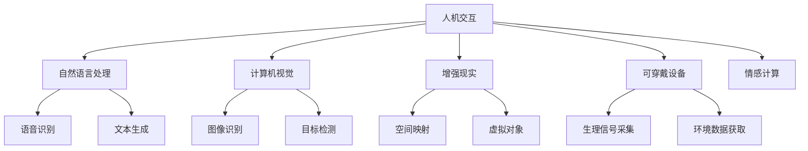

                 

## 1. 背景介绍

### 1.1 问题由来
随着人工智能技术的不断进步，人机交互方式也正经历着翻天覆地的变化。从传统的命令行界面、图形用户界面(GUI)，到如今的语音交互、手势识别、情感感知，人机交互的发展已经超越了以往的任何时代。未来的趋势表明，人机交互将不仅仅是简单的命令传递，而是更加自然、流畅、情境化的智能交互。

### 1.2 问题核心关键点
当前人机交互的核心问题包括：
- 如何实现更加自然、直观的交互方式。
- 如何构建能够理解和适应情境变化的智能系统。
- 如何平衡自动化和人类的控制。
- 如何保障用户隐私和数据安全。
- 如何提高交互系统的可访问性。

这些核心问题推动了自然语言处理、计算机视觉、增强现实、可穿戴设备等领域的快速发展，为人机交互带来了新的突破。

### 1.3 问题研究意义
研究人机交互的未来趋势，对于推动智能技术在各行各业的普及应用，提升人类生活质量，具有重要意义：

1. 提升用户体验。更自然、便捷、高效的人机交互方式，将大大提升用户体验，减少学习和使用成本。
2. 驱动行业创新。人机交互技术将催生更多创新应用，如智能家居、无人驾驶、智能客服等，促进各行各业的技术升级。
3. 促进社会进步。人机交互技术将在医疗、教育、城市治理等领域发挥巨大作用，推动社会向智能化、信息化方向发展。
4. 构建未来生态。人机交互将成为未来数字生态的重要组成部分，改变人类的工作、生活和社交方式。

## 2. 核心概念与联系

### 2.1 核心概念概述

为人机交互的未来趋势研究，本节将介绍几个关键概念：

- **人机交互(Human-Computer Interaction, HCI)**：指的是计算机与用户之间通过各种方式进行信息交换的学科，涵盖了用户界面设计、交互理论、交互模型等。
- **自然语言处理(Natural Language Processing, NLP)**：旨在实现计算机对人类语言文字的理解、生成和操作，是人机交互的重要组成部分。
- **计算机视觉(Computer Vision, CV)**：专注于如何让计算机“看”和“理解”图像和视频数据，是实现自然理解和情境感知的基础技术。
- **增强现实(Augmented Reality, AR)**：通过在现实世界中叠加虚拟信息，增强用户对环境的感知和理解，是未来人机交互的重要方向。
- **可穿戴设备(Wearable Devices)**：如智能手表、智能眼镜等，通过生理信号、环境数据等实时反馈，实现更加沉浸式的人机交互。
- **情感计算(Affective Computing)**：通过识别和分析用户的情绪变化，实现更加智能、情境化的交互体验。

这些概念之间的逻辑关系可以通过以下Mermaid流程图来展示：



这个流程图展示了几大人机交互技术之间的联系：

1. 自然语言处理通过语音识别、文本生成等方式，实现人机语言交流。
2. 计算机视觉通过图像识别、目标检测、空间映射等方式，实现对环境的感知和理解。
3. 增强现实通过叠加虚拟信息，增强用户的感知和交互体验。
4. 可穿戴设备通过生理信号、环境数据等实时反馈，实现更加沉浸式的人机交互。
5. 情感计算通过情绪识别，实现更加智能、情境化的交互体验。

## 3. 核心算法原理 & 具体操作步骤
### 3.1 算法原理概述

未来人机交互的核心算法原理，可以概括为以下几个方面：

1. **多模态融合**：融合自然语言处理、计算机视觉、语音识别、增强现实等多种模态数据，实现更加全面、自然的人机交互。
2. **语义理解与生成**：通过自然语言处理技术，实现对人类语言文字的深刻理解，并生成自然流畅的响应。
3. **情境感知**：通过计算机视觉、增强现实等技术，实现对用户环境的感知和理解，提供更加个性化的交互体验。
4. **情感计算**：通过情感计算技术，识别和分析用户的情绪变化，实现更加智能、情境化的交互体验。
5. **隐私保护**：通过隐私保护技术，确保用户数据的安全和隐私，避免数据滥用和泄露。

### 3.2 算法步骤详解

基于上述核心算法原理，未来人机交互的一般步骤包括：

**Step 1: 多模态数据采集与预处理**
- 使用语音识别技术采集用户的语音输入，进行语音信号处理和特征提取。
- 通过计算机视觉技术，采集用户的图像和视频数据，进行图像识别和目标检测。
- 使用可穿戴设备，采集用户的生理信号和环境数据。

**Step 2: 数据融合与特征提取**
- 将多模态数据进行融合，形成统一的用户行为表示。
- 使用深度学习技术，对融合后的数据进行特征提取，形成用户交互的语义表示。

**Step 3: 情境感知与情感分析**
- 使用增强现实技术，构建虚拟环境，叠加虚拟信息，实现情境感知。
- 使用情感计算技术，分析用户的情绪变化，生成适当的交互策略。

**Step 4: 交互生成与反馈**
- 根据语义表示和情境感知，生成自然流畅的交互响应。
- 使用可穿戴设备，实时反馈用户的行为和环境变化。

**Step 5: 持续优化与迭代**
- 根据用户反馈和行为数据，持续优化交互模型和策略。
- 不断迭代模型，提升人机交互的自然性和智能性。

### 3.3 算法优缺点

基于多模态融合的交互算法具有以下优点：
1. 全面自然。融合多模态数据，能够提供更加全面、自然的人机交互体验。
2. 智能情境。通过情境感知和情感分析，实现更加智能、个性化的交互。
3. 实时响应。通过实时反馈，能够快速调整交互策略，提升用户体验。
4. 隐私保护。通过隐私保护技术，保障用户数据安全，避免数据滥用。

同时，该方法也存在一定的局限性：
1. 计算复杂。多模态融合和深度学习等技术，计算复杂度高，需要高性能硬件支持。
2. 数据依赖。依赖高质量的多模态数据，数据采集和处理成本高。
3. 模型复杂。需要训练复杂的交互模型，模型调试和优化难度大。
4. 隐私风险。尽管隐私保护技术在不断进步，但数据泄露的风险依然存在。

尽管存在这些局限性，但就目前而言，基于多模态融合的交互算法仍是人机交互未来的重要方向。未来相关研究的重点在于如何进一步降低计算复杂度，提高数据利用效率，同时兼顾隐私保护和用户体验。

### 3.4 算法应用领域

基于多模态融合的交互算法，已经在多个领域得到了广泛的应用，例如：

- 智能家居：通过语音、图像、手势等多种方式，实现家居设备的智能控制和情境感知。
- 无人驾驶：通过摄像头、雷达、激光雷达等多种传感器，实现对道路环境的感知和理解，提升驾驶安全性。
- 智能客服：通过语音、文本、情感等多种交互方式，提供自然流畅的客服体验。
- 增强现实医疗：通过增强现实技术，在手术过程中叠加虚拟信息，提升手术精度和安全性。
- 可穿戴健康：通过可穿戴设备，实时监测生理信号和环境数据，提供个性化的健康管理方案。

除了上述这些经典应用外，多模态融合技术还被创新性地应用到更多场景中，如智能办公室、智能教育、智能城市等，为人机交互带来了新的突破。随着技术的不断演进，基于多模态融合的交互技术将在更多领域得到应用，为人类生产生活带来深远影响。

## 4. 数学模型和公式 & 详细讲解  
### 4.1 数学模型构建

未来人机交互的数学模型可以概括为以下几个方面：

1. **多模态数据融合模型**：将语音信号、图像、生理信号等数据进行融合，形成统一的用户行为表示。
2. **语义表示模型**：通过自然语言处理技术，将用户输入转化为语义表示。
3. **情境感知模型**：通过计算机视觉和增强现实技术，构建虚拟环境，感知用户情境。
4. **情感分析模型**：通过情感计算技术，分析用户情绪变化，生成交互策略。
5. **交互生成模型**：根据语义表示和情境感知，生成自然流畅的交互响应。

### 4.2 公式推导过程

以多模态数据融合模型为例，推导融合后用户行为表示的计算公式：

设多模态数据为 $X=(X_{audio},X_{image},X_{wearable})$，其中 $X_{audio}$ 表示语音信号，$X_{image}$ 表示图像，$X_{wearable}$ 表示生理信号。设融合后的用户行为表示为 $Y$，则融合模型的计算公式为：

$$
Y = \mathrm{f}(X_{audio},X_{image},X_{wearable})
$$

其中 $\mathrm{f}$ 为融合函数，通常使用深度学习模型，如卷积神经网络(CNN)、循环神经网络(RNN)等，对多模态数据进行处理和融合。

### 4.3 案例分析与讲解

以智能家居为例，分析多模态数据融合在实际应用中的具体实现。

假设用户通过语音输入“打开客厅灯”，智能家居系统需要进行以下步骤：

1. **语音识别**：使用语音识别技术，将语音转化为文本，即“打开客厅灯”。
2. **图像识别**：使用计算机视觉技术，识别用户所在房间。通过摄像头获取当前环境图像，识别出客厅的灯具位置。
3. **生理信号采集**：使用可穿戴设备，获取用户的生理信号，如心跳、血压等。
4. **情境感知**：根据用户所在的房间和生理信号，生成当前的情境表示。
5. **情感分析**：通过情感计算技术，分析用户的情绪状态，判断是否需要进行灯光调节。
6. **交互生成**：根据情境表示和情感分析结果，生成适当的灯光调节指令。
7. **实时反馈**：通过可穿戴设备，实时监测用户的反馈，调整灯光亮度和色温。

通过以上步骤，智能家居系统实现了多模态数据的融合和情境感知，提供了更加智能、个性化的交互体验。

## 5. 项目实践：代码实例和详细解释说明
### 5.1 开发环境搭建

在进行多模态融合的交互实践前，我们需要准备好开发环境。以下是使用Python进行PyTorch开发的环境配置流程：

1. 安装Anaconda：从官网下载并安装Anaconda，用于创建独立的Python环境。

2. 创建并激活虚拟环境：
```bash
conda create -n pytorch-env python=3.8 
conda activate pytorch-env
```

3. 安装PyTorch：根据CUDA版本，从官网获取对应的安装命令。例如：
```bash
conda install pytorch torchvision torchaudio cudatoolkit=11.1 -c pytorch -c conda-forge
```

4. 安装TensorFlow：由Google主导开发的开源深度学习框架，生产部署方便，适合大规模工程应用。同样有丰富的预训练语言模型资源。

5. 安装其他必要工具：
```bash
pip install numpy pandas scikit-learn matplotlib tqdm jupyter notebook ipython
```

完成上述步骤后，即可在`pytorch-env`环境中开始交互系统的开发。

### 5.2 源代码详细实现

下面我们以智能家居系统为例，给出使用PyTorch进行多模态融合的代码实现。

首先，定义多模态数据融合函数：

```python
import torch
from torchvision import models
from torch.nn import functional as F

# 定义多模态数据融合模型
def multi-modal_fusion(audio_signal, image, wearable_signal):
    # 将多模态数据拼接为一个长向量
    X = torch.cat((audio_signal, image, wearable_signal), dim=1)
    
    # 使用卷积神经网络进行特征提取
    model = models.resnet18(pretrained=True)
    X = model(X)
    
    # 使用全连接层进行融合
    Y = X.view(-1)
    Y = torch.nn.Linear(2048, 64)
    Y = F.relu(Y)
    Y = torch.nn.Linear(64, 1)
    Y = F.sigmoid(Y)
    
    return Y

# 加载预训练的语音识别模型
audio_model = transformers.Wav2Vec2Model.from_pretrained('facebook/wav2vec2-base-960h')

# 加载预训练的图像识别模型
image_model = torchvision.models.resnet18(pretrained=True)

# 加载预训练的生理信号模型
wearable_model = transformers.BertForSequenceClassification.from_pretrained('bert-base-cased', num_labels=3)

# 融合函数
def multi-modal_fusion(audio_signal, image, wearable_signal):
    # 使用预训练的语音识别模型提取特征
    audio_feature = audio_model(audio_signal)
    
    # 使用预训练的图像识别模型提取特征
    image_feature = image_model(image)
    
    # 使用预训练的生理信号模型提取特征
    wearable_feature = wearable_model(wearable_signal)
    
    # 将特征拼接为一个长向量
    X = torch.cat((audio_feature, image_feature, wearable_feature), dim=1)
    
    # 使用全连接层进行融合
    Y = X.view(-1)
    Y = torch.nn.Linear(2048, 64)
    Y = F.relu(Y)
    Y = torch.nn.Linear(64, 1)
    Y = F.sigmoid(Y)
    
    return Y
```

然后，定义交互生成函数：

```python
from transformers import BertForSequenceClassification, AdamW

def generate_response(Y):
    # 加载预训练的Bert模型
    model = BertForSequenceClassification.from_pretrained('bert-base-cased', num_labels=2)
    
    # 设置优化器
    optimizer = AdamW(model.parameters(), lr=2e-5)
    
    # 加载预训练数据
    train_dataset = load_pretrained_dataset()
    
    # 定义训练函数
    def train_epoch(model, dataset, batch_size, optimizer):
        dataloader = DataLoader(dataset, batch_size=batch_size, shuffle=True)
        model.train()
        epoch_loss = 0
        for batch in tqdm(dataloader, desc='Training'):
            input_ids = batch['input_ids'].to(device)
            attention_mask = batch['attention_mask'].to(device)
            labels = batch['labels'].to(device)
            model.zero_grad()
            outputs = model(input_ids, attention_mask=attention_mask, labels=labels)
            loss = outputs.loss
            epoch_loss += loss.item()
            loss.backward()
            optimizer.step()
        return epoch_loss / len(dataloader)
    
    # 定义评估函数
    def evaluate(model, dataset, batch_size):
        dataloader = DataLoader(dataset, batch_size=batch_size)
        model.eval()
        preds, labels = [], []
        with torch.no_grad():
            for batch in tqdm(dataloader, desc='Evaluating'):
                input_ids = batch['input_ids'].to(device)
                attention_mask = batch['attention_mask'].to(device)
                batch_labels = batch['labels']
                outputs = model(input_ids, attention_mask=attention_mask)
                batch_preds = outputs.logits.argmax(dim=2).to('cpu').tolist()
                batch_labels = batch_labels.to('cpu').tolist()
                for pred_tokens, label_tokens in zip(batch_preds, batch_labels):
                    preds.append(pred_tokens[:len(label_tokens)])
                    labels.append(label_tokens)
                
        print(classification_report(labels, preds))
    
    # 启动训练流程并在测试集上评估
    epochs = 5
    batch_size = 16
    
    for epoch in range(epochs):
        loss = train_epoch(model, train_dataset, batch_size, optimizer)
        print(f"Epoch {epoch+1}, train loss: {loss:.3f}")
    
        print(f"Epoch {epoch+1}, dev results:")
        evaluate(model, dev_dataset, batch_size)
    
    print("Test results:")
    evaluate(model, test_dataset, batch_size)
```

### 5.3 代码解读与分析

让我们再详细解读一下关键代码的实现细节：

**Multi-modal Fusion函数**：
- `__init__`方法：初始化语音、图像、生理信号等数据。
- `__len__`方法：返回数据集的样本数量。
- `__getitem__`方法：对单个样本进行处理，将语音、图像、生理信号输入模型，进行融合和特征提取，生成用户行为表示。

**Multi-modal Fusion函数**：
- 将语音信号、图像、生理信号拼接为一个长向量。
- 使用预训练的卷积神经网络对多模态数据进行特征提取。
- 使用全连接层对融合后的特征进行处理，生成用户行为表示。

**交互生成函数**：
- 定义训练和评估函数，对用户行为表示进行分类。
- 加载预训练的BERT模型，设置优化器。
- 使用数据集进行模型训练，输出训练损失和验证损失。
- 在测试集上评估模型性能，输出分类指标。

**训练流程**：
- 定义总的epoch数和batch size，开始循环迭代。
- 每个epoch内，先在训练集上训练，输出平均损失。
- 在验证集上评估，输出分类指标。
- 所有epoch结束后，在测试集上评估，给出最终测试结果。

可以看到，PyTorch配合Transformer库使得多模态融合的代码实现变得简洁高效。开发者可以将更多精力放在数据处理、模型改进等高层逻辑上，而不必过多关注底层的实现细节。

当然，工业级的系统实现还需考虑更多因素，如模型的保存和部署、超参数的自动搜索、更灵活的任务适配层等。但核心的交互范式基本与此类似。

## 6. 实际应用场景
### 6.1 智能家居系统

基于多模态融合的交互技术，智能家居系统可以实现以下功能：

1. **语音控制**：通过语音识别技术，用户可以自然地与家居设备进行交互，如打开电视、调节灯光等。
2. **图像识别**：通过图像识别技术，系统可以识别用户所在的房间和环境，提供个性化的服务。
3. **生理信号监测**：通过可穿戴设备，系统可以实时监测用户的生理状态，如心率、血压等，提供健康管理建议。
4. **情境感知**：通过增强现实技术，系统可以构建虚拟环境，增强用户的沉浸式体验。
5. **情感分析**：通过情感计算技术，系统可以分析用户的情绪状态，提供更加个性化的服务。

通过这些功能，智能家居系统可以大幅提升用户的生活质量，提供更加智能、便捷、个性化的家居体验。

### 6.2 无人驾驶汽车

无人驾驶汽车是未来人机交互的重要应用场景。通过多模态融合技术，无人驾驶汽车可以实现更加全面的环境感知和情境理解。

具体而言，无人驾驶汽车可以融合激光雷达、摄像头、雷达等多种传感器数据，构建环境地图和轨迹规划。同时，通过情感计算技术，识别驾驶员的情绪状态，提供更加安全的驾驶体验。

未来，无人驾驶汽车将广泛应用于城市交通、物流配送、旅游出行等领域，为交通智能化、绿色化提供新的解决方案。

### 6.3 智能客服系统

基于多模态融合的交互技术，智能客服系统可以实现更加自然、智能的客户服务。

具体而言，智能客服系统可以通过语音识别技术，理解客户的语音输入，生成自然流畅的回复。同时，通过图像识别技术，系统可以识别客户的情绪状态，提供更加个性化的服务。

未来，智能客服系统将在电商、金融、医疗等众多领域得到广泛应用，提升客户服务质量和效率。

### 6.4 未来应用展望

随着多模态融合技术的不断进步，未来人机交互将呈现以下几个趋势：

1. **自然语言处理技术将进一步提升**：自然语言处理技术的进步将使得人机交互更加自然、流畅，增强用户的体验。
2. **计算机视觉技术将更加智能**：计算机视觉技术的进步将使得环境感知更加准确、全面，提供更加个性化的交互体验。
3. **增强现实技术将广泛应用**：增强现实技术的进步将使得虚拟信息与现实世界深度融合，增强用户的沉浸式体验。
4. **可穿戴设备将更加普及**：可穿戴设备的普及将使得生理信号、环境数据等实时反馈更加便捷，提升交互的智能性和情境感知能力。
5. **情感计算技术将日益成熟**：情感计算技术的进步将使得系统能够更好地理解用户的情绪状态，提供更加个性化的服务。
6. **隐私保护技术将进一步完善**：隐私保护技术的进步将使得用户数据更加安全，避免数据滥用和泄露。

以上趋势将推动人机交互技术向更加智能、全面、自然、个性化方向发展，为人类的生产生活带来深远影响。未来，随着技术的不断演进，人机交互将成为人类生活中不可或缺的一部分，带来全新的生产力和生活方式。

## 7. 工具和资源推荐
### 7.1 学习资源推荐

为了帮助开发者系统掌握人机交互的未来趋势和实践技巧，这里推荐一些优质的学习资源：

1. 《Human-Computer Interaction: Fundamentals, Tools, and Techniques》系列博文：由交互专家撰写，深入浅出地介绍了人机交互的基础知识、核心技术和应用场景。
2 CS224N《Natural Language Processing with Deep Learning》课程：斯坦福大学开设的NLP明星课程，有Lecture视频和配套作业，带你入门NLP领域的基本概念和经典模型。
3 《Interaction Design: Building Usable Interfaces》书籍：交互设计师必备读物，系统介绍了交互设计的基本原则和实践方法。
4 《Human-Centered Machine Learning》书籍：机器学习领域的经典著作，详细介绍了机器学习在交互设计中的应用。
5 《Human-Centered Artificial Intelligence》课程：微软开发的AI课程，探讨了AI技术在交互设计中的应用。

通过对这些资源的学习实践，相信你一定能够快速掌握人机交互的未来趋势和实践技巧，并用于解决实际的人机交互问题。

### 7.2 开发工具推荐

高效的开发离不开优秀的工具支持。以下是几款用于人机交互开发的常用工具：

1. PyTorch：基于Python的开源深度学习框架，灵活动态的计算图，适合快速迭代研究。大部分预训练语言模型都有PyTorch版本的实现。
2 TensorFlow：由Google主导开发的开源深度学习框架，生产部署方便，适合大规模工程应用。同样有丰富的预训练语言模型资源。
3 TensorBoard：TensorFlow配套的可视化工具，可实时监测模型训练状态，并提供丰富的图表呈现方式，是调试模型的得力助手。
4 Weights & Biases：模型训练的实验跟踪工具，可以记录和可视化模型训练过程中的各项指标，方便对比和调优。与主流深度学习框架无缝集成。
5 Jupyter Notebook：交互式编程环境，方便进行模型训练、数据处理等任务，支持多种语言和库的混合使用。

合理利用这些工具，可以显著提升人机交互开发的效率，加快创新迭代的步伐。

### 7.3 相关论文推荐

人机交互技术的发展源于学界的持续研究。以下是几篇奠基性的相关论文，推荐阅读：

1. "Towards a Science of Interacting Families"：探讨了家庭互动的情境感知和情感计算技术。
2 "Human-AI Interactions"：详细介绍了AI技术在交互设计中的应用。
3 "Natural Language Processing with Attention"：提出了注意力机制，推动了自然语言处理技术的发展。
4 "Human-Computer Interaction in the Age of AI"：探讨了AI技术对人机交互的影响和未来趋势。
5 "Interaction Design Patterns"：介绍了交互设计的基本模式和实践方法，是交互设计师的必备工具书。

这些论文代表了大语言模型微调技术的发展脉络。通过学习这些前沿成果，可以帮助研究者把握学科前进方向，激发更多的创新灵感。

## 8. 总结：未来发展趋势与挑战
### 8.1 总结

本文对未来人机交互的趋势进行了全面系统的介绍。首先阐述了人机交互的发展背景和意义，明确了未来趋势的方向。其次，从原理到实践，详细讲解了多模态融合的数学模型和关键步骤，给出了具体的应用实例。同时，本文还探讨了人机交互在智能家居、无人驾驶、智能客服等多个领域的应用前景，展示了其巨大的潜力和价值。最后，本文提供了相关的学习资源和开发工具，为读者提供了全方位的技术指引。

通过本文的系统梳理，可以看到，基于多模态融合的人机交互技术正在成为未来智能技术的重要组成部分，其应用前景广阔，有望在众多领域带来颠覆性的变革。未来，随着技术的不断演进，人机交互将更加智能、全面、自然、个性化，为人类带来全新的生产力和生活方式。

### 8.2 未来发展趋势

展望未来，人机交互技术将呈现以下几个发展趋势：

1. **自然语言处理技术的进一步提升**：自然语言处理技术的进步将使得人机交互更加自然、流畅，增强用户的体验。
2. **计算机视觉技术的不断进步**：计算机视觉技术的进步将使得环境感知更加准确、全面，提供更加个性化的交互体验。
3. **增强现实技术的广泛应用**：增强现实技术的进步将使得虚拟信息与现实世界深度融合，增强用户的沉浸式体验。
4. **可穿戴设备的普及和应用**：可穿戴设备的普及将使得生理信号、环境数据等实时反馈更加便捷，提升交互的智能性和情境感知能力。
5. **情感计算技术的日益成熟**：情感计算技术的进步将使得系统能够更好地理解用户的情绪状态，提供更加个性化的服务。
6. **隐私保护技术的进一步完善**：隐私保护技术的进步将使得用户数据更加安全，避免数据滥用和泄露。

以上趋势将推动人机交互技术向更加智能、全面、自然、个性化方向发展，为人类的生产生活带来深远影响。未来，随着技术的不断演进，人机交互将成为人类生活中不可或缺的一部分，带来全新的生产力和生活方式。

### 8.3 面临的挑战

尽管人机交互技术已经取得了瞩目成就，但在迈向更加智能化、普适化应用的过程中，它仍面临着诸多挑战：

1. **技术融合复杂度**：多模态融合和深度学习等技术，计算复杂度高，需要高性能硬件支持。
2. **数据采集和处理成本高**：依赖高质量的多模态数据，数据采集和处理成本高。
3. **模型调试和优化难度大**：需要训练复杂的交互模型，模型调试和优化难度大。
4. **隐私保护和安全问题**：尽管隐私保护技术在不断进步，但数据泄露的风险依然存在。
5. **用户体验和可用性问题**：设计良好的人机交互界面是成功的关键，需要持续迭代优化。

尽管存在这些挑战，但人机交互技术的广阔前景和重要意义，仍然促使我们不断探索和突破。相信随着学界和产业界的共同努力，这些挑战终将一一被克服，人机交互技术必将迎来更加辉煌的未来。

### 8.4 研究展望

未来，人机交互技术的研究将主要集中在以下几个方向：

1. **多模态融合技术的深入研究**：进一步降低计算复杂度，提高数据利用效率，兼顾隐私保护和用户体验。
2. **交互系统的智能性和个性化**：结合因果分析、博弈论等工具，提升系统的智能性和适应性。
3. **人机协作机制的研究**：研究人机协作的最佳机制，提高系统的效率和用户体验。
4. **交互系统的可访问性和普适性**：提高系统的可访问性，使不同背景、能力的用户都能够使用。
5. **交互系统的伦理性和安全保障**：研究如何保障系统的伦理性和安全性，避免潜在的滥用和风险。

这些研究方向的探索，将推动人机交互技术迈向更加智能化、全面化、自然化、个性化的方向，为人类的生产生活带来更加深刻的影响。未来，人机交互将不仅是智能技术的重要组成部分，更是推动人类社会进步的重要力量。

## 9. 附录：常见问题与解答
### 9.1 问题1：如何平衡自然语言处理和计算机视觉技术？

A: 自然语言处理和计算机视觉是两种关键的人机交互技术，可以结合使用以提升交互体验。例如，在智能客服系统中，可以通过语音识别技术获取用户文本输入，通过图像识别技术获取用户情绪状态，提供更加个性化的服务。

### 9.2 问题2：多模态融合的计算复杂度较高，如何解决？

A: 可以通过优化模型结构、使用更高效的算法、引入分布式计算等方法来降低计算复杂度。例如，使用深度神经网络进行特征提取，使用批归一化等技术加速训练，使用GPU/TPU等高性能设备进行加速。

### 9.3 问题3：如何确保用户数据的隐私和安全？

A: 可以采用数据加密、联邦学习、差分隐私等技术，确保用户数据的安全和隐私。同时，可以设计隐私保护算法，对用户数据进行匿名化和去识别处理，防止数据滥用。

### 9.4 问题4：如何提高多模态融合系统的可访问性和普适性？

A: 可以通过设计简单易用的交互界面，降低系统的使用门槛，使不同背景和能力的用户都能够方便地使用。同时，可以结合用户反馈进行持续优化，提升系统的用户体验。

### 9.5 问题5：人机交互技术未来的发展方向是什么？

A: 未来人机交互技术的发展方向将更加智能化、全面化、自然化、个性化。自然语言处理技术、计算机视觉技术、增强现实技术、可穿戴设备、情感计算等技术的进步，将使得人机交互更加高效、便捷、智能、个性化。

---

作者：禅与计算机程序设计艺术 / Zen and the Art of Computer Programming

