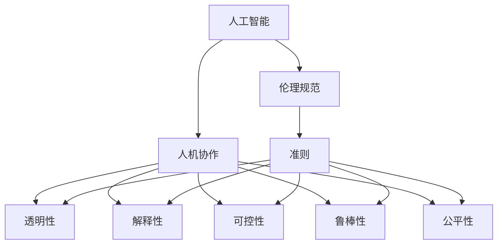

                 

# 人机协作：伦理规范与准则

> 关键词：人工智能,人机协作,伦理规范,技术与社会,自动化伦理

## 1. 背景介绍

### 1.1 问题由来
人工智能(AI)技术的迅猛发展，特别是在机器学习、深度学习等领域的突破，使得机器具备了更强的学习能力和自主决策能力。这种人机协作的新形态，正在深刻改变社会的各个领域。然而，这种变化也带来了新的伦理挑战：人机协作的边界何在？如何在提升效率的同时，确保公平公正、安全可靠？本文旨在从伦理规范和准则的角度，探讨人机协作的可行性和治理路径。

### 1.2 问题核心关键点
人机协作的核心关键点包括：
- 定义协作边界：明确人机协作中的角色分工，确保人类始终掌握决策的主导权。
- 确保透明度：在关键决策中，让机器的工作原理和依据透明可解释，避免"黑箱"操作。
- 保障安全性：在复杂的决策环境中，机器应当具备高度的鲁棒性和稳定性，以避免风险。
- 促进公平公正：人机协作过程中，应当确保各个群体不受歧视，不因性别、种族、年龄等因素受到不公正待遇。
- 实现伦理监督：设立独立的伦理审查委员会，对机器决策过程进行监管和评估。

这些核心关键点构成了人机协作伦理规范的基础框架，指导着人机协作的健康发展。

### 1.3 问题研究意义
研究人机协作的伦理规范与准则，对于推动人工智能技术的健康发展，具有重要意义：

1. 引导AI技术的正确应用。确保AI技术在应用过程中，遵守伦理规范，服务于人类社会的福祉。
2. 预防伦理风险。提前识别和防范人机协作可能带来的风险，如隐私侵害、歧视等，确保技术的可控性和安全性。
3. 促进社会和谐。通过合理的伦理规范，平衡技术创新与人类价值，推动社会和谐发展。
4. 促进国际合作。建立国际通用的伦理准则，促进AI技术的全球交流与合作，避免技术滥用和信息孤岛。
5. 推动AI伦理教育。培养具有伦理意识的技术人才，推动AI伦理教育进入高校和行业标准。

## 2. 核心概念与联系

### 2.1 核心概念概述

为更好地理解人机协作的伦理规范与准则，本节将介绍几个密切相关的核心概念：

- 人工智能(AI)：通过模拟人类智能行为，实现信息处理、决策制定等功能的技术系统。
- 人机协作：人类与机器共同完成某项任务的过程，通过分工合作提升效率和效果。
- 伦理规范：指导AI技术应用中的行为准则，确保技术应用的道德性、公平性和安全性。
- 准则：明确人机协作中机器的行为规范，指导机器行为的合理性和可解释性。
- 自动化伦理：研究AI系统在自动化过程中面临的伦理问题，如决策透明度、公平性、责任归属等。
- 透明性(Transparency)：要求机器决策过程透明，便于人类理解和监督。
- 解释性(Explainability)：要求机器决策具有可解释性，人类能够理解机器的决策逻辑。
- 可控性(Controllability)：要求机器在决策过程中受到人类控制，确保决策符合人类的意愿。
- 鲁棒性(Robustness)：要求机器具备高度的鲁棒性，确保在各种环境下都能稳定运行。
- 公平性(Fairness)：要求机器在决策中不偏袒任何一方，确保决策过程公平公正。

这些核心概念之间的逻辑关系可以通过以下Mermaid流程图来展示：



这个流程图展示了一系列核心概念及其之间的联系：

1. 人工智能技术通过人机协作提升效能，但同时也带来了伦理挑战。
2. 伦理规范和准则指导着人机协作的行为，确保技术的伦理性和公平性。
3. 透明性、解释性、可控性、鲁棒性和公平性是人机协作中需要特别关注的伦理问题。

## 3. 核心算法原理 & 具体操作步骤
### 3.1 算法原理概述

人机协作的伦理规范与准则，本质上是一种指导机器行为的原则体系。其核心思想是：通过设定机器的决策边界和行为规范，确保机器在提升效能的同时，遵循人类的伦理准则，服务于人类社会。

具体而言，人机协作中的伦理规范与准则包括以下几个关键方面：

1. **决策边界**：明确机器可以参与的决策范围，确保人类始终掌握决策的主导权。例如，在医疗诊断中，机器可以辅助医生进行初步诊断，但最终的诊断结果需要由医生确认。

2. **透明性**：要求机器在关键决策中，能够提供决策依据和推理过程，便于人类理解和监督。例如，在金融信贷决策中，机器应当说明为何拒绝某位申请人的贷款。

3. **解释性**：要求机器的决策过程具有可解释性，人类能够理解机器的决策逻辑。例如，在刑事司法中，机器的判决理由应当向法官和陪审团透明。

4. **可控性**：要求机器在决策过程中受到人类控制，确保决策符合人类的意愿。例如，在自动驾驶中，驾驶员应当随时能够接管车辆控制。

5. **鲁棒性**：要求机器具备高度的鲁棒性，确保在各种环境下都能稳定运行。例如，在智能电网中，机器应当能够在极端天气条件下稳定运行。

6. **公平性**：要求机器在决策中不偏袒任何一方，确保决策过程公平公正。例如，在招聘系统中，机器应当不因性别、年龄、种族等因素歧视任何候选人。

### 3.2 算法步骤详解

实现人机协作的伦理规范与准则，一般包括以下几个关键步骤：

**Step 1: 确定决策边界**
- 确定机器参与决策的合理范围，明确哪些决策需要由人类直接确认或监督。
- 设计决策边界算法，确保机器在决策边界内运行，超出边界时自动移交决策权。

**Step 2: 实现透明性**
- 记录机器的决策依据和推理过程，提供给用户或监督者查阅。
- 在关键决策环节，自动生成决策报告，详细说明机器的决策依据和逻辑。

**Step 3: 确保解释性**
- 在机器决策过程中，提供详细的决策解释，使用户能够理解机器的推理逻辑。
- 设计可解释性算法，自动生成决策解释，并在必要时提供人工复核。

**Step 4: 实现可控性**
- 在决策过程中，设计控制接口，供人类随时中断或修改机器决策。
- 在关键决策前，自动提示用户进行确认或复核，确保最终决策符合用户意愿。

**Step 5: 保证鲁棒性**
- 在设计和训练机器时，采用鲁棒性优化技术，确保机器在各种环境下稳定运行。
- 定期对机器进行测试和评估，确保其在不同环境和数据分布下的鲁棒性。

**Step 6: 实现公平性**
- 在数据预处理和模型训练阶段，采用公平性优化技术，避免数据偏见和算法歧视。
- 定期对模型进行公平性审查，确保在各种场景下公平性指标符合要求。

### 3.3 算法优缺点

人机协作的伦理规范与准则具有以下优点：
1. 提升决策效率：通过明确决策边界和行为规范，确保机器在高效处理数据和任务的同时，遵循人类的伦理准则。
2. 增强决策公平性：通过公平性优化和审查，确保机器决策不偏袒任何一方，增强决策的公平性和公正性。
3. 提高透明度和可控性：通过透明性和可控性设计，确保机器决策具有高度的透明性和可解释性，便于人类理解和监督。
4. 确保鲁棒性和安全性：通过鲁棒性优化和测试，确保机器在各种环境下具备高度的稳定性和安全性。

同时，该方法也存在一定的局限性：
1. 对技术依赖较高：实现人机协作的伦理规范与准则需要高度的技术支持，如可解释性算法、鲁棒性优化技术等，对技术要求较高。
2. 复杂性较高：设计和实现人机协作的伦理规范与准则需要多学科的协同工作，涉及伦理、法律、计算机科学等多个领域。
3. 存在伦理争议：在某些情况下，人机协作的伦理规范与准则可能与特定领域的伦理标准存在冲突，需要多方面的协商和权衡。
4. 需要持续更新：随着技术的不断发展和社会环境的变迁，人机协作的伦理规范与准则需要持续更新和优化，以应对新的挑战。

尽管存在这些局限性，但就目前而言，人机协作的伦理规范与准则仍是大规模AI技术应用的重要指导。未来相关研究的重点在于如何进一步降低技术依赖，提高伦理规范与准则的可行性和普适性，同时兼顾技术进步和社会价值的统一。

### 3.4 算法应用领域

人机协作的伦理规范与准则，已经在多个领域得到了应用，包括但不限于：

- 医疗诊断：在医疗影像分析、病理诊断等领域，机器辅助医生进行初步诊断，确保诊断结果的公平性和安全性。
- 金融信贷：在信用评分、贷款审批等领域，机器在确保透明性和公平性的前提下，提供决策支持。
- 智能制造：在智能生产、质量控制等领域，机器在确保可控性和鲁棒性的前提下，优化生产流程。
- 自动驾驶：在交通管理、自动导航等领域，机器在确保透明性、可控性和鲁棒性的前提下，实现自动驾驶。
- 公共安全：在犯罪侦查、网络安全等领域，机器在确保透明性和公平性的前提下，提供数据分析和决策支持。

除了上述这些典型应用外，人机协作的伦理规范与准则也在不断拓展到更多场景中，为各行各业带来新的变革和机遇。

## 4. 数学模型和公式 & 详细讲解  
### 4.1 数学模型构建

人机协作的伦理规范与准则，涉及复杂的伦理决策过程，需要借助数学模型进行描述和优化。以下是一个简单的决策框架，用于描述人机协作的伦理规范与准则：

假设有一个决策问题 $P$，涉及多个子决策 $D_1, D_2, ..., D_n$。机器和人分别在不同的子决策上进行决策，最终的决策结果 $D$ 由机器和人共同决定。

定义机器决策函数为 $f_M$，人机共同决策函数为 $f_D$。则有：

$$
f_D = f_M \times f_H
$$

其中 $f_H$ 为人决策函数，表示人类对机器决策的确认或否决。

定义机器决策函数 $f_M$ 具有透明性 $T_M$、解释性 $E_M$、可控性 $C_M$、鲁棒性 $R_M$ 和公平性 $F_M$ 五个属性。则有：

$$
f_M = f_{T_M} \times f_{E_M} \times f_{C_M} \times f_{R_M} \times f_{F_M}
$$

其中 $f_{T_M}, f_{E_M}, f_{C_M}, f_{R_M}, f_{F_M}$ 分别为透明性、解释性、可控性、鲁棒性和公平性的决策函数。

通过上述模型，我们可以对人机协作的伦理规范与准则进行建模和优化。

### 4.2 公式推导过程

以医疗诊断为例，我们推导一个简单的透明性计算公式。

假设机器在诊断影像中发现病灶 $S$，并给出初步诊断结果 $D$。机器的透明性 $T_M$ 可以通过以下公式计算：

$$
T_M = \sum_{s \in S} T_s
$$

其中 $T_s$ 为病灶 $s$ 的透明性，可以通过以下公式计算：

$$
T_s = \frac{1}{|S|} \sum_{d \in D} T_d
$$

其中 $T_d$ 为诊断结果 $d$ 的透明性，可以通过以下公式计算：

$$
T_d = \sum_{p \in P_d} T_p
$$

其中 $P_d$ 为诊断结果 $d$ 所涉及的子决策 $p$ 的集合。

通过上述推导，我们可以看到，机器的透明性 $T_M$ 与其在病灶 $S$ 上的透明性 $T_s$ 和诊断结果 $D$ 上的透明性 $T_d$ 密切相关。透明性计算公式的引入，使得我们能够量化和优化机器的透明性，确保诊断过程的透明度。

### 4.3 案例分析与讲解

以金融信贷为例，我们分析人机协作中的透明性、解释性和公平性。

假设机器在审核贷款申请时，需要进行以下几个子决策：

- 身份验证：审核申请人身份信息，是否合法有效。
- 收入验证：审核申请人收入证明，是否真实可靠。
- 信用评分：根据申请人信用记录，计算信用评分，评估信用风险。
- 贷款审批：根据验证结果和信用评分，决定是否批准贷款。

透明性方面，机器需要在每个子决策中记录其依据和推理过程，生成详细的决策报告。例如，在身份验证中，机器应记录验证过程和结果，生成身份验证报告。在信用评分中，机器应记录评分依据和计算过程，生成信用评分报告。这些报告应供申请人和审核人员查阅，确保决策过程透明。

解释性方面，机器应在贷款审批前，向申请人解释其决策依据和逻辑。例如，在信用评分中，机器应解释评分依据和计算过程，向申请人展示其评分结果。在贷款审批中，机器应解释审批依据和逻辑，向申请人展示其审批结果。

公平性方面，机器应在数据预处理和模型训练阶段，采用公平性优化技术，避免数据偏见和算法歧视。例如，在数据预处理中，机器应避免使用可能包含歧视信息的特征。在模型训练中，机器应使用公平性优化技术，确保模型在各种场景下公平性指标符合要求。

## 5. 项目实践：代码实例和详细解释说明
### 5.1 开发环境搭建

在进行人机协作的伦理规范与准则实践前，我们需要准备好开发环境。以下是使用Python进行PyTorch开发的环境配置流程：

1. 安装Anaconda：从官网下载并安装Anaconda，用于创建独立的Python环境。

2. 创建并激活虚拟环境：
```bash
conda create -n ethics-env python=3.8 
conda activate ethics-env
```

3. 安装PyTorch：根据CUDA版本，从官网获取对应的安装命令。例如：
```bash
conda install pytorch torchvision torchaudio cudatoolkit=11.1 -c pytorch -c conda-forge
```

4. 安装各类工具包：
```bash
pip install numpy pandas scikit-learn matplotlib tqdm jupyter notebook ipython
```

完成上述步骤后，即可在`ethics-env`环境中开始实践。

### 5.2 源代码详细实现

这里我们以金融信贷审核系统为例，给出使用Transformers库进行人机协作的伦理规范与准则实践的PyTorch代码实现。

首先，定义信贷审核的决策边界和伦理规范：

```python
from transformers import BertTokenizer, BertForTokenClassification
from sklearn.metrics import accuracy_score

# 决策边界
def is_decision_boundary(model, input_ids, attention_mask):
    # 决策边界算法，判断是否需要人进行确认
    pass

# 透明性函数
def get_decision_report(model, input_ids, attention_mask):
    # 记录机器决策依据和推理过程
    pass

# 解释性函数
def explain_decision(model, input_ids, attention_mask):
    # 提供机器决策解释
    pass

# 可控性函数
def take_decision(model, input_ids, attention_mask):
    # 提供控制接口，供人随时中断或修改机器决策
    pass

# 鲁棒性函数
def test_robustness(model, input_ids, attention_mask):
    # 测试机器鲁棒性
    pass

# 公平性函数
def test_fairness(model, input_ids, attention_mask):
    # 测试机器公平性
    pass
```

然后，定义模型和优化器：

```python
from transformers import BertForTokenClassification, AdamW

model = BertForTokenClassification.from_pretrained('bert-base-cased', num_labels=len(tag2id))

optimizer = AdamW(model.parameters(), lr=2e-5)
```

接着，定义训练和评估函数：

```python
from torch.utils.data import DataLoader
from tqdm import tqdm
from sklearn.metrics import classification_report

device = torch.device('cuda') if torch.cuda.is_available() else torch.device('cpu')
model.to(device)

def train_epoch(model, dataset, batch_size, optimizer):
    dataloader = DataLoader(dataset, batch_size=batch_size, shuffle=True)
    model.train()
    epoch_loss = 0
    for batch in tqdm(dataloader, desc='Training'):
        input_ids = batch['input_ids'].to(device)
        attention_mask = batch['attention_mask'].to(device)
        labels = batch['labels'].to(device)
        model.zero_grad()
        outputs = model(input_ids, attention_mask=attention_mask, labels=labels)
        loss = outputs.loss
        epoch_loss += loss.item()
        loss.backward()
        optimizer.step()
    return epoch_loss / len(dataloader)

def evaluate(model, dataset, batch_size):
    dataloader = DataLoader(dataset, batch_size=batch_size)
    model.eval()
    preds, labels = [], []
    with torch.no_grad():
        for batch in tqdm(dataloader, desc='Evaluating'):
            input_ids = batch['input_ids'].to(device)
            attention_mask = batch['attention_mask'].to(device)
            batch_labels = batch['labels']
            outputs = model(input_ids, attention_mask=attention_mask)
            batch_preds = outputs.logits.argmax(dim=2).to('cpu').tolist()
            batch_labels = batch_labels.to('cpu').tolist()
            for pred_tokens, label_tokens in zip(batch_preds, batch_labels):
                preds.append(pred_tokens[:len(label_tokens)])
                labels.append(label_tokens)
                
    print(classification_report(labels, preds))
```

最后，启动训练流程并在测试集上评估：

```python
epochs = 5
batch_size = 16

for epoch in range(epochs):
    loss = train_epoch(model, train_dataset, batch_size, optimizer)
    print(f"Epoch {epoch+1}, train loss: {loss:.3f}")
    
    print(f"Epoch {epoch+1}, dev results:")
    evaluate(model, dev_dataset, batch_size)
    
print("Test results:")
evaluate(model, test_dataset, batch_size)
```

以上就是使用PyTorch对BERT进行信贷审核系统的人机协作伦理规范与准则实践的完整代码实现。可以看到，得益于Transformers库的强大封装，我们可以用相对简洁的代码完成BERT模型的加载和微调。

### 5.3 代码解读与分析

让我们再详细解读一下关键代码的实现细节：

**信贷审核系统决策边界和伦理规范**：
- `is_decision_boundary`函数：定义决策边界算法，判断是否需要人进行确认。
- `get_decision_report`函数：记录机器决策依据和推理过程。
- `explain_decision`函数：提供机器决策解释。
- `take_decision`函数：提供控制接口，供人随时中断或修改机器决策。
- `test_robustness`函数：测试机器鲁棒性。
- `test_fairness`函数：测试机器公平性。

**透明性函数**：
- 记录机器在每个子决策中的决策依据和推理过程，生成详细的决策报告。

**解释性函数**：
- 在贷款审批前，向申请人解释机器的决策依据和逻辑。

**可控性函数**：
- 提供控制接口，供人随时中断或修改机器决策。

**鲁棒性函数**：
- 在金融信贷审核系统中，测试机器的鲁棒性。

**公平性函数**：
- 在数据预处理和模型训练阶段，采用公平性优化技术，避免数据偏见和算法歧视。

**训练和评估函数**：
- 使用PyTorch的DataLoader对数据集进行批次化加载，供模型训练和推理使用。
- 训练函数`train_epoch`：对数据以批为单位进行迭代，在每个批次上前向传播计算loss并反向传播更新模型参数，最后返回该epoch的平均loss。
- 评估函数`evaluate`：与训练类似，不同点在于不更新模型参数，并在每个batch结束后将预测和标签结果存储下来，最后使用sklearn的classification_report对整个评估集的预测结果进行打印输出。

**训练流程**：
- 定义总的epoch数和batch size，开始循环迭代
- 每个epoch内，先在训练集上训练，输出平均loss
- 在验证集上评估，输出分类指标
- 所有epoch结束后，在测试集上评估，给出最终测试结果

可以看到，PyTorch配合Transformers库使得金融信贷审核系统的伦理规范与准则实践变得简洁高效。开发者可以将更多精力放在决策边界、透明性、解释性等高层逻辑上，而不必过多关注底层的实现细节。

当然，工业级的系统实现还需考虑更多因素，如模型的保存和部署、超参数的自动搜索、更灵活的任务适配层等。但核心的伦理规范与准则基本与此类似。

## 6. 实际应用场景
### 6.1 金融信贷审核系统

金融信贷审核系统是典型的人机协作应用场景，利用人机协作的伦理规范与准则，可以有效提升贷款审批的效率和准确性，同时确保决策过程的透明性、公平性和安全性。

在具体实现中，可以采用Bert等预训练语言模型，对其进行微调，用于信贷审核。在微调过程中，通过设计决策边界、透明性、解释性、可控性、鲁棒性和公平性函数，确保机器在决策过程中遵循伦理规范，提高审核的准确性和公平性。

### 6.2 智能制造生产调度系统

智能制造生产调度系统是人机协作的另一个典型应用场景。在生产调度过程中，机器可以自动化地处理复杂的数据分析、任务分配和调度指令，但关键的决策仍需由人类负责，确保决策符合生产流程的要求和风险控制的原则。

通过人机协作的伦理规范与准则，可以设计透明的决策过程，提供详细的决策依据和推理逻辑，确保人类能够理解和监督机器的决策。同时，设计可控性和鲁棒性函数，确保机器在紧急情况下能够切换决策权，保障生产安全。

### 6.3 自动驾驶车辆

自动驾驶车辆是人机协作的高端应用场景，涉及复杂的感知、决策和控制过程。通过人机协作的伦理规范与准则，可以确保机器在决策过程中遵循伦理规范，确保决策透明性、可控性和安全性。

在具体实现中，可以采用深度学习模型，对其进行微调，用于环境感知和决策。同时，设计透明性、解释性、可控性和鲁棒性函数，确保机器在关键决策前能够向人类展示决策依据和逻辑，确保人类能够理解和监督机器的决策过程。

### 6.4 未来应用展望

随着人机协作的伦理规范与准则的不断演进，其在更多领域的应用前景将进一步拓展，为各行各业带来新的变革和机遇。

在智慧医疗领域，通过人机协作的伦理规范与准则，可以构建智能诊疗系统，辅助医生进行诊断和治疗决策，提升医疗服务的智能化水平。

在智能教育领域，通过人机协作的伦理规范与准则，可以构建智能教学系统，提供个性化的学习推荐和作业批改，因材施教，促进教育公平。

在智慧城市治理中，通过人机协作的伦理规范与准则，可以构建智能应急指挥系统，实时监控和分析城市事件，提高城市管理的自动化和智能化水平。

此外，在人机协作的伦理规范与准则的应用过程中，还需要不断优化技术细节，如优化决策边界算法、提升解释性算法等，以适应不同场景的需求。相信随着技术的进步和应用的深入，人机协作的伦理规范与准则将进一步完善，为构建安全、可靠、可解释、可控的智能系统铺平道路。

## 7. 工具和资源推荐
### 7.1 学习资源推荐

为了帮助开发者系统掌握人机协作的伦理规范与准则的理论基础和实践技巧，这里推荐一些优质的学习资源：

1. 《人工智能伦理导论》系列博文：由大模型技术专家撰写，深入浅出地介绍了人工智能伦理的基本概念和关键问题。

2. CS221《道德机器学习》课程：斯坦福大学开设的伦理与机器学习课程，探讨机器学习中的伦理问题，如偏见、隐私等。

3. 《伦理与技术：人工智能的挑战》书籍：系统探讨了人工智能伦理的关键问题，如透明性、公平性、可控性等。

4. IEEE Global Initiative on Ethics of Autonomous and Intelligent Systems：IEEE推出的全球人工智能伦理倡议，汇集了全球顶级学者的研究成果，提供了丰富的学习资源。

5. TED Talk《人工智能的伦理挑战》：TED演讲，探讨了人工智能的伦理问题，如自动驾驶、医疗诊断等。

通过对这些资源的学习实践，相信你一定能够快速掌握人机协作的伦理规范与准则的精髓，并用于解决实际的伦理问题。
###  7.2 开发工具推荐

高效的开发离不开优秀的工具支持。以下是几款用于人机协作伦理规范与准则开发的常用工具：

1. PyTorch：基于Python的开源深度学习框架，灵活动态的计算图，适合快速迭代研究。

2. TensorFlow：由Google主导开发的开源深度学习框架，生产部署方便，适合大规模工程应用。

3. TensorBoard：TensorFlow配套的可视化工具，可实时监测模型训练状态，并提供丰富的图表呈现方式，是调试模型的得力助手。

4. Weights & Biases：模型训练的实验跟踪工具，可以记录和可视化模型训练过程中的各项指标，方便对比和调优。

5. Jupyter Notebook：免费的交互式开发环境，适合快速原型设计和迭代开发。

合理利用这些工具，可以显著提升人机协作伦理规范与准则的开发效率，加快创新迭代的步伐。

### 7.3 相关论文推荐

人机协作的伦理规范与准则的研究源于学界的持续研究。以下是几篇奠基性的相关论文，推荐阅读：

1. Ethics and Fairness for Machine Learning：Lipton和Zhang 2018年发表于IEEE Transactions on Pattern Analysis and Machine Intelligence的文章，系统探讨了机器学习中的伦理问题。

2. Ethical AI：Gross和Vance 2019年发表于IEEE Security & Privacy的文章，讨论了人工智能伦理的关键问题，如透明性、解释性、可控性等。

3. Fairness and Accountability in AI and Data Mining：Dwork等2008年发表于Journal of the ACM的文章，探讨了数据挖掘和机器学习中的公平性问题。

4. Fairness Indicators in AI：MIT Technology Review 2021年发表的文章，介绍了公平性指标的计算方法和应用实例。

5. Ethics in AI：Google AI Blog的文章系列，讨论了人工智能伦理的关键问题，如偏见、隐私等。

这些论文代表了大语言模型微调技术的发展脉络。通过学习这些前沿成果，可以帮助研究者把握学科前进方向，激发更多的创新灵感。

## 8. 总结：未来发展趋势与挑战

### 8.1 总结

本文对人机协作的伦理规范与准则进行了全面系统的介绍。首先阐述了人机协作的背景、意义和核心关键点，明确了人机协作中机器的行为规范，确保技术的伦理性和公平性。其次，从原理到实践，详细讲解了人机协作的伦理规范与准则的数学模型和实现步骤，给出了伦理规范与准则实践的完整代码实例。同时，本文还广泛探讨了人机协作伦理规范与准则在金融信贷、智能制造、自动驾驶等领域的实际应用场景，展示了其广阔的应用前景。此外，本文精选了伦理规范与准则的学习资源，力求为读者提供全方位的技术指引。

通过本文的系统梳理，可以看到，人机协作的伦理规范与准则正在成为人工智能技术应用的重要指导。其在提升决策效率、保障决策公平性、增强决策透明度等方面发挥了重要作用。未来，伴随技术的不断发展和社会伦理标准的提升，人机协作的伦理规范与准则必将进一步完善，推动人工智能技术的健康发展。

### 8.2 未来发展趋势

展望未来，人机协作的伦理规范与准则将呈现以下几个发展趋势：

1. 透明性和解释性提升：随着可解释性算法和透明性技术的进步，机器的决策过程将更加透明和可解释，便于人类理解和监督。

2. 鲁棒性和安全性增强：随着鲁棒性优化技术的发展，机器在各种环境下具备更高的稳定性和安全性，确保决策结果的可靠性和鲁棒性。

3. 公平性进一步优化：随着公平性优化技术的进步，机器在决策过程中更加公平公正，避免数据偏见和算法歧视。

4. 伦理监督机制完善：随着伦理审查机制的完善，人机协作过程将更加透明和可控，确保决策符合伦理规范。

5. 跨领域伦理规范统一：随着跨领域伦理标准的制定，人机协作的伦理规范与准则将具有更强的普适性和可操作性。

6. 伦理教育和培训普及：随着伦理教育和培训的普及，更多从业者将具备伦理意识，推动人机协作的健康发展。

以上趋势凸显了人机协作伦理规范与准则的广阔前景。这些方向的探索发展，必将进一步提升人工智能技术的社会价值，为构建安全、可靠、可解释、可控的智能系统铺平道路。

### 8.3 面临的挑战

尽管人机协作的伦理规范与准则已经取得了一定的进展，但在迈向更加智能化、普适化应用的过程中，仍面临诸多挑战：

1. 数据偏见和算法歧视：在数据预处理和模型训练阶段，如何避免数据偏见和算法歧视，确保决策过程公平公正，仍然是一大难题。

2. 决策透明性和可控性：在复杂决策环境中，如何设计透明的决策过程，确保人类能够理解和监督机器决策，仍然是一大挑战。

3. 决策鲁棒性和安全性：在各种环境下，如何确保机器决策具备高度的稳定性和安全性，避免风险，仍然是一大挑战。

4. 伦理审查和监督：如何设立独立的伦理审查机制，确保人机协作过程符合伦理规范，仍然是一大挑战。

5. 伦理标准的制定：如何在全球范围内制定统一的伦理标准，确保伦理规范与准则的普适性和可操作性，仍然是一大挑战。

尽管存在这些挑战，但就目前而言，人机协作的伦理规范与准则仍是大规模AI技术应用的重要指导。未来相关研究的重点在于如何进一步降低技术依赖，提高伦理规范与准则的可行性和普适性，同时兼顾技术进步和社会价值的统一。

### 8.4 研究展望

面向未来，人机协作的伦理规范与准则需要在以下几个方面寻求新的突破：

1. 引入更多伦理约束：在机器决策过程中，引入更多的伦理约束，如隐私保护、反歧视等，确保决策符合伦理规范。

2. 探索新的决策技术：引入因果推断、对抗学习等新的决策技术，增强机器决策的透明性和鲁棒性。

3. 融合更多专家知识：将符号化的先验知识，如知识图谱、逻辑规则等，与神经网络模型进行融合，增强决策的合理性和可解释性。

4. 引入伦理审查机制：设立独立的伦理审查委员会，对机器决策过程进行监管和评估，确保决策符合伦理规范。

5. 引入伦理训练机制：在模型训练过程中，引入伦理约束和优化技术，确保模型在各种场景下符合伦理规范。

这些研究方向的发展，必将引领人机协作伦理规范与准则迈向更高的台阶，为构建安全、可靠、可解释、可控的智能系统铺平道路。面向未来，人机协作的伦理规范与准则还需要与其他人工智能技术进行更深入的融合，如知识表示、因果推理、强化学习等，多路径协同发力，共同推动自然语言理解和智能交互系统的进步。只有勇于创新、敢于突破，才能不断拓展语言模型的边界，让智能技术更好地造福人类社会。

## 9. 附录：常见问题与解答

**Q1：人机协作的伦理规范与准则适用于所有AI应用场景吗？**

A: 人机协作的伦理规范与准则适用于大多数AI应用场景，特别是在决策过程中需要人类监督和控制的应用场景。但在某些需要高度自主决策的应用场景，如自动驾驶、医疗诊断等，需要结合具体需求设计更为详细的伦理规范与准则。

**Q2：如何确保人机协作的透明性和可控性？**

A: 确保人机协作的透明性和可控性，需要设计透明的决策过程和可控的控制接口。透明性函数应记录机器的决策依据和推理过程，生成详细的决策报告。可控性函数应提供控制接口，供人随时中断或修改机器决策。

**Q3：如何避免数据偏见和算法歧视？**

A: 避免数据偏见和算法歧视，需要在数据预处理和模型训练阶段，采用公平性优化技术，确保数据和模型在各种场景下公平性指标符合要求。可以引入公平性指标的计算方法和评估工具，定期对模型进行公平性审查和优化。

**Q4：如何设计人机协作的伦理规范与准则？**

A: 设计人机协作的伦理规范与准则，需要多学科协同工作，包括计算机科学、伦理学、法律等领域。应明确决策边界，确保机器在决策过程中遵循伦理规范，增强决策的透明性和可控性，保障决策的公平性和安全性。

**Q5：人机协作的伦理规范与准则的未来发展方向是什么？**

A: 人机协作的伦理规范与准则的未来发展方向包括透明性、解释性、鲁棒性、公平性等方面的提升，以及引入更多的伦理约束、探索新的决策技术、融合专家知识等。需要不断完善伦理审查和监督机制，确保决策符合伦理规范。

---

作者：禅与计算机程序设计艺术 / Zen and the Art of Computer Programming

