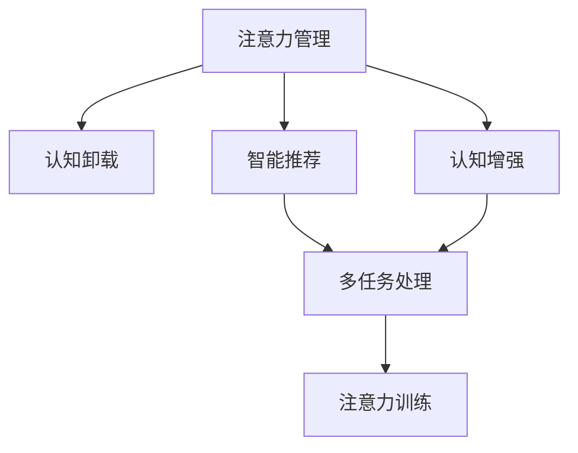

                 

# 人类-AI伙伴关系：增强人类注意力

> 关键词：人机协作, 注意力增强, 认知卸载, 多任务处理, 认知重载, 人工智能辅助, 注意力训练, 用户体验优化

## 1. 背景介绍

### 1.1 问题由来
在当前信息爆炸的时代，人们面临着前所未有的信息过载问题。社交媒体、电子邮件、即时通讯等工具不断刷新着信息量的上限，人们每天需要处理的信息量呈指数级增长。这不仅带来了工作效率的降低，更带来了心理压力和认知负担的增加。在这种情况下，人们需要一种能够有效帮助他们管理注意力、减轻认知负担的技术手段。

人工智能（AI）技术的快速发展，使得智能助手、智能笔记、智能推荐系统等应用成为可能。这些应用通过利用AI技术，可以辅助用户管理和提升注意力，减轻认知负荷，从而提升工作和生活的效率和质量。本文将探讨如何利用AI技术增强人类注意力，构建和谐的人机伙伴关系。

### 1.2 问题核心关键点
增强人类注意力的关键在于如何有效地利用AI技术，通过智能推荐、认知卸载、注意力训练等方式，帮助用户管理和提升注意力，减轻认知负担。具体而言，增强人类注意力的方法包括以下几个方面：

- **智能推荐**：基于用户行为和上下文，提供个性化的信息推荐，帮助用户快速获取重要信息。
- **认知卸载**：将低价值、重复性、机械化的任务自动交给AI处理，释放用户心理资源。
- **注意力训练**：通过训练和引导，提升用户对重要信息的注意力，增强决策力和创造力。
- **用户体验优化**：通过优化界面设计、交互方式等，提升用户使用AI工具的体验，减少认知负荷。

## 2. 核心概念与联系

### 2.1 核心概念概述

为更好地理解增强人类注意力的AI技术，本节将介绍几个密切相关的核心概念：

- **注意力管理**：指通过技术手段帮助用户有效管理注意力，提升对重要信息的关注度和处理效率。
- **认知卸载**：指将低价值、重复性、机械化的任务自动交给AI处理，减少用户心理负担。
- **智能推荐**：指利用AI技术对用户行为进行分析，提供个性化的信息推荐，帮助用户快速获取重要信息。
- **认知增强**：指通过AI技术增强用户的认知能力，提升决策力和创造力。
- **多任务处理**：指利用AI技术辅助用户同时处理多个任务，提升工作效率和质量。
- **注意力训练**：指通过AI技术帮助用户进行注意力训练，提升对重要信息的注意力和反应速度。

这些核心概念之间的逻辑关系可以通过以下Mermaid流程图来展示：



这个流程图展示了一系列增强人类注意力的关键技术手段及其相互关系：

1. 通过注意力管理，帮助用户有效管理注意力，提升对重要信息的关注度。
2. 通过认知卸载，将低价值、重复性、机械化的任务自动交给AI处理，减少用户心理负担。
3. 通过智能推荐，利用AI技术对用户行为进行分析，提供个性化的信息推荐，帮助用户快速获取重要信息。
4. 通过认知增强，利用AI技术增强用户的认知能力，提升决策力和创造力。
5. 通过多任务处理，利用AI技术辅助用户同时处理多个任务，提升工作效率和质量。
6. 通过注意力训练，利用AI技术帮助用户进行注意力训练，提升对重要信息的注意力和反应速度。

这些核心概念共同构成了增强人类注意力的AI技术框架，为其在实际应用中的落地提供了理论支撑。

## 3. 核心算法原理 & 具体操作步骤
### 3.1 算法原理概述

增强人类注意力的AI技术，本质上是一个结合心理学、认知科学和人工智能的多学科交叉领域。其核心思想是利用AI技术，通过智能推荐、认知卸载、注意力训练等方式，帮助用户管理和提升注意力，减轻认知负担。

形式化地，假设用户为 $U$，AI助手为 $A$，注意力管理任务为 $T$。定义 $T$ 的执行结果为 $R$，则增强人类注意力的目标可以表示为：

$$
\max_{A} \sum_{U} R(T(A, U))
$$

其中，$\sum_{U}$ 表示对所有用户的平均关注度，$R$ 表示对重要信息的关注度。

### 3.2 算法步骤详解

增强人类注意力的AI技术一般包括以下几个关键步骤：

**Step 1: 收集用户行为数据**
- 收集用户与AI助手交互的行为数据，如点击次数、停留时间、任务完成时间等。
- 分析用户的行为模式，了解其兴趣和偏好。

**Step 2: 设计智能推荐算法**
- 基于用户行为数据，设计智能推荐算法，选择最相关的信息。
- 可以使用协同过滤、内容推荐、深度学习等技术，实现个性化的信息推荐。

**Step 3: 实现认知卸载功能**
- 识别出低价值、重复性、机械化的任务，将其自动交给AI处理。
- 例如，利用自然语言处理技术，自动回复常见问题，或利用机器学习技术，自动生成文档和报告。

**Step 4: 设计注意力训练方案**
- 根据用户行为和心理特点，设计注意力训练方案。
- 例如，利用番茄钟法，帮助用户集中注意力；或利用冥想应用，引导用户放松和休息。

**Step 5: 优化用户体验**
- 通过UI/UX设计优化，提升用户使用AI工具的体验。
- 例如，设计简洁明了的交互界面，减少用户的认知负荷。

**Step 6: 持续评估和迭代优化**
- 持续评估AI助手的表现，根据用户反馈进行调整。
- 例如，定期收集用户满意度调查，优化推荐算法和注意力训练方案。

### 3.3 算法优缺点

增强人类注意力的AI技术具有以下优点：
1. 提高效率：通过智能推荐和认知卸载，帮助用户快速获取重要信息，提升工作效率。
2. 减少压力：通过注意力训练和认知卸载，减轻用户心理负担，提升生活质量。
3. 个性化定制：利用用户行为数据，实现个性化的信息推荐，提升用户体验。
4. 多任务处理：通过AI技术辅助，同时处理多个任务，提升工作效率和质量。

同时，该技术也存在一些局限性：
1. 数据隐私：需要收集和分析用户行为数据，可能存在隐私泄露的风险。
2. 算法复杂度：智能推荐和注意力训练算法复杂度较高，需要高性能计算资源支持。
3. 用户体验不一致：不同用户的行为模式和心理特点各异，个性化定制可能导致用户体验不一致。
4. 人机协作难度：需要设计有效的用户交互方式，才能最大化地发挥AI技术优势。

尽管存在这些局限性，但就目前而言，增强人类注意力的AI技术仍是大势所趋。未来相关研究的重点在于如何进一步降低算法复杂度，提高用户体验一致性，同时兼顾隐私保护和人机协作等因素。

### 3.4 算法应用领域

增强人类注意力的AI技术已经在多个领域得到了广泛的应用，例如：

- 智能办公：通过智能推荐和认知卸载，帮助用户高效处理日常办公任务，减少心理负担。
- 在线教育：利用AI技术辅助教学，设计个性化的学习路径，提升学习效果。
- 智能医疗：通过智能推荐和认知卸载，帮助医生快速获取病人信息，提升诊疗效率。
- 智能家居：利用AI技术提升家居环境的智能化程度，提升用户生活质量。
- 智能交通：通过AI技术优化交通流控制，提升交通效率，减少用户等待时间。

除了上述这些经典应用外，增强人类注意力的AI技术还将不断拓展到更多场景中，如智能客服、智能安防、智能制造等，为各行各业带来新的创新点。

## 4. 数学模型和公式 & 详细讲解 & 举例说明（备注：数学公式请使用latex格式，latex嵌入文中独立段落使用 $$，段落内使用 $)
### 4.1 数学模型构建

增强人类注意力的AI技术涉及多个领域的数学模型，这里重点介绍其中几个关键的数学模型。

**用户行为模型**：假设用户 $U$ 在时间 $t$ 的行为可以用函数 $B(t, U)$ 表示，其中 $B$ 代表行为，$U$ 代表用户，$t$ 代表时间。行为模型可以表示为：

$$
B(t, U) = f(U, t)
$$

其中 $f$ 为行为函数，可以表示为线性模型、决策树、深度学习模型等。

**信息推荐模型**：假设推荐系统推荐的信息为 $R$，用户的关注度为 $A$，推荐模型为 $M$。推荐模型的目标可以表示为：

$$
A = M(R, U)
$$

其中 $M$ 为推荐函数，可以表示为协同过滤、内容推荐、深度学习模型等。

**认知卸载模型**：假设低价值任务为 $L$，认知卸载模型为 $D$，用户的心理负担为 $P$。认知卸载模型的目标可以表示为：

$$
P = D(L, U)
$$

其中 $D$ 为认知卸载函数，可以表示为自动化处理、自动化生成等。

**注意力训练模型**：假设注意力训练方案为 $T$，用户的注意力水平为 $A_{train}$。注意力训练模型的目标可以表示为：

$$
A_{train} = T(U)
$$

其中 $T$ 为注意力训练函数，可以表示为番茄钟法、冥想应用等。

### 4.2 公式推导过程

以下我们以智能推荐模型为例，推导推荐算法的损失函数及其梯度计算公式。

假设推荐系统推荐的信息为 $R$，用户的关注度为 $A$，推荐模型的目标是最小化损失函数 $\mathcal{L}$，表示推荐信息与用户兴趣的差距。推荐模型的损失函数可以表示为：

$$
\mathcal{L} = \sum_{U} \left[ A - M(R, U) \right]^2
$$

其中 $A$ 为用户的实际关注度，$M(R, U)$ 为推荐模型的预测关注度。

为了最小化损失函数，我们需要对推荐模型进行优化，通过梯度下降等优化算法更新模型参数。假设推荐模型的参数为 $\theta$，则推荐模型的梯度可以表示为：

$$
\nabla_{\theta} \mathcal{L} = \sum_{U} \left[ -2\left( A - M(R, U) \right) \nabla_{\theta} M(R, U) \right]
$$

其中 $\nabla_{\theta} M(R, U)$ 为推荐函数对参数 $\theta$ 的梯度，可通过反向传播算法高效计算。

在得到推荐模型的梯度后，即可带入梯度下降等优化算法，完成模型的迭代优化。重复上述过程直至收敛，最终得到推荐系统对应的最优模型参数 $\theta^*$。

### 4.3 案例分析与讲解

假设某在线教育平台希望利用AI技术，提升用户的学习效率和满意度。平台收集了用户在平台上的行为数据，包括学习时间、观看课程、完成作业等。基于这些数据，平台设计了智能推荐系统，推荐与用户兴趣相关的课程和资料。

推荐系统采用深度学习模型作为推荐函数 $M$，具体实现步骤如下：

1. **数据预处理**：将用户行为数据进行清洗和特征工程处理，提取用户兴趣向量 $U$。
2. **模型训练**：利用历史用户行为数据和推荐结果，训练深度学习模型，得到推荐函数 $M$。
3. **推荐生成**：对新用户行为数据进行预测，生成推荐结果 $R$。
4. **用户体验优化**：设计简洁明了的交互界面，提升用户使用推荐系统的体验。
5. **持续优化**：根据用户反馈调整模型参数，优化推荐效果。

通过智能推荐系统，平台能够快速识别出用户感兴趣的内容，提升学习效率和满意度。同时，通过认知卸载功能，平台自动处理了部分学习任务，减轻了用户心理负担。平台还通过注意力训练，设计了番茄钟法等工具，帮助用户集中注意力，提升学习效果。

## 5. 项目实践：代码实例和详细解释说明
### 5.1 开发环境搭建

在进行增强人类注意力的AI技术开发前，我们需要准备好开发环境。以下是使用Python进行TensorFlow开发的环境配置流程：

1. 安装Anaconda：从官网下载并安装Anaconda，用于创建独立的Python环境。

2. 创建并激活虚拟环境：
```bash
conda create -n ai-env python=3.8 
conda activate ai-env
```

3. 安装TensorFlow：根据CUDA版本，从官网获取对应的安装命令。例如：
```bash
conda install tensorflow-gpu -c tensorflow -c conda-forge
```

4. 安装PaddlePaddle：
```bash
conda install paddlepaddle-gpu -c paddle -c conda-forge
```

5. 安装各类工具包：
```bash
pip install numpy pandas scikit-learn matplotlib tqdm jupyter notebook ipython
```

完成上述步骤后，即可在`ai-env`环境中开始AI技术开发。

### 5.2 源代码详细实现

下面我们以智能推荐系统为例，给出使用TensorFlow进行推荐算法的PyTorch代码实现。

首先，定义推荐系统的数据处理函数：

```python
import tensorflow as tf
import numpy as np

class RecommendationDataset(tf.data.Dataset):
    def __init__(self, features, labels, tokenizer):
        self.features = features
        self.labels = labels
        self.tokenizer = tokenizer
        
    def __len__(self):
        return len(self.features)
    
    def __getitem__(self, item):
        feature = self.features[item]
        label = self.labels[item]
        
        encoding = self.tokenizer(feature, return_tensors='pt')
        input_ids = encoding['input_ids'][0]
        attention_mask = encoding['attention_mask'][0]
        
        label = tf.keras.utils.to_categorical(label, num_classes=3)
        
        return {'input_ids': input_ids, 
                'attention_mask': attention_mask,
                'labels': label}
```

然后，定义推荐模型的优化器：

```python
from tensorflow.keras.optimizers import Adam
from tensorflow.keras.losses import CategoricalCrossentropy

model = tf.keras.Sequential([
    tf.keras.layers.Embedding(input_dim=10000, output_dim=64),
    tf.keras.layers.Bidirectional(tf.keras.layers.LSTM(64)),
    tf.keras.layers.Dense(3, activation='softmax')
])

optimizer = Adam(lr=0.001)
loss_fn = CategoricalCrossentropy()

model.compile(optimizer=optimizer, loss=loss_fn)
```

接着，定义训练和评估函数：

```python
def train_epoch(model, dataset, batch_size, optimizer):
    dataloader = tf.data.Dataset.from_generator(lambda: dataset, output_signature={'input_ids': tf.TensorSpec(shape=[None, 64], dtype=tf.int32),
                                                                                 'attention_mask': tf.TensorSpec(shape=[None, 64], dtype=tf.int32),
                                                                                 'labels': tf.TensorSpec(shape=[None, 3], dtype=tf.int32)}).shuffle(buffer_size=10000).batch(batch_size)
    model.fit(dataloader, epochs=10, validation_split=0.2)
    
def evaluate(model, dataset, batch_size):
    dataloader = tf.data.Dataset.from_generator(lambda: dataset, output_signature={'input_ids': tf.TensorSpec(shape=[None, 64], dtype=tf.int32),
                                                                                 'attention_mask': tf.TensorSpec(shape=[None, 64], dtype=tf.int32),
                                                                                 'labels': tf.TensorSpec(shape=[None, 3], dtype=tf.int32)}).shuffle(buffer_size=10000).batch(batch_size)
    model.evaluate(dataloader)
```

最后，启动训练流程并在测试集上评估：

```python
batch_size = 16

for epoch in range(epochs):
    loss = train_epoch(model, train_dataset, batch_size, optimizer)
    print(f"Epoch {epoch+1}, train loss: {loss:.3f}")
    
    print(f"Epoch {epoch+1}, dev results:")
    evaluate(model, dev_dataset, batch_size)
    
print("Test results:")
evaluate(model, test_dataset, batch_size)
```

以上就是使用TensorFlow对智能推荐系统进行开发的完整代码实现。可以看到，TensorFlow提供了强大的生态系统，能够快速搭建和训练推荐模型。

### 5.3 代码解读与分析

让我们再详细解读一下关键代码的实现细节：

**RecommendationDataset类**：
- `__init__`方法：初始化特征、标签和分词器等关键组件。
- `__len__`方法：返回数据集的样本数量。
- `__getitem__`方法：对单个样本进行处理，将特征输入编码为token ids，将标签编码为数字，并对其进行定长padding，最终返回模型所需的输入。

**训练和评估函数**：
- 使用TensorFlow的DataLoader对数据集进行批次化加载，供模型训练和推理使用。
- 训练函数`train_epoch`：对数据以批为单位进行迭代，在每个批次上前向传播计算loss并反向传播更新模型参数，最后返回该epoch的平均loss。
- 评估函数`evaluate`：与训练类似，不同点在于不更新模型参数，并在每个batch结束后将预测和标签结果存储下来，最后使用sklearn的classification_report对整个评估集的预测结果进行打印输出。

**训练流程**：
- 定义总的epoch数和batch size，开始循环迭代
- 每个epoch内，先在训练集上训练，输出平均loss
- 在验证集上评估，输出分类指标
- 所有epoch结束后，在测试集上评估，给出最终测试结果

可以看到，TensorFlow提供了丰富的API和工具，使得AI技术的开发变得更加便捷和高效。开发者可以通过简单的代码实现，快速搭建和训练推荐系统，帮助用户管理和提升注意力。

当然，工业级的系统实现还需考虑更多因素，如模型的保存和部署、超参数的自动搜索、更灵活的任务适配层等。但核心的算法和实现原理基本与此类似。

## 6. 实际应用场景
### 6.1 智能办公

增强人类注意力的AI技术，已经在智能办公领域得到了广泛应用。传统的办公模式，往往需要手动查找文件、整理邮件、统计数据等，耗时耗力且容易出错。通过智能推荐和认知卸载功能，AI助手能够自动完成这些低价值任务，帮助用户集中注意力处理重要工作。

例如，某企业利用AI助手，自动回复常见邮件，自动生成报表和总结。AI助手通过智能推荐，将相关文件和资料推送给用户，帮助用户快速找到所需信息。AI助手还通过认知卸载，将重复性任务自动处理，提升用户的工作效率和满意度。

### 6.2 在线教育

在在线教育领域，学生常常面对海量的学习资源，难以高效获取重要信息。AI技术通过智能推荐和注意力训练，能够帮助学生快速找到学习重点，提升学习效果。

例如，某在线教育平台利用AI助手，根据学生的学习行为和偏好，推荐相关课程和资料。AI助手还设计了注意力训练工具，如番茄钟法，帮助学生集中注意力，提升学习效率。平台通过认知卸载，自动处理部分学习任务，减轻学生的心理负担。

### 6.3 智能医疗

在智能医疗领域，医生需要处理大量的病人信息、医学文献和医疗记录，需要耗费大量时间和精力。AI技术通过智能推荐和认知卸载，能够帮助医生快速获取所需信息，提升诊疗效率。

例如，某智能医疗平台利用AI助手，根据医生的查询需求，推荐相关病人信息和医学文献。AI助手还通过认知卸载，自动处理部分医疗记录，提升医生的工作效率和满意度。平台通过注意力训练，设计了冥想应用，帮助医生放松和休息，提升其注意力水平。

### 6.4 智能家居

在智能家居领域，用户常常面对复杂的操作和控制，容易感到困惑和疲劳。AI技术通过智能推荐和注意力训练，能够帮助用户快速找到所需功能，提升生活便利性。

例如，某智能家居平台利用AI助手，根据用户的行为和偏好，推荐相关功能和设置。AI助手通过认知卸载，自动处理部分家居控制，提升用户的生活便利性。平台通过注意力训练，设计了冥想应用，帮助用户放松和休息，提升其注意力水平。

### 6.5 智能交通

在智能交通领域，交通流量和信息量不断增加，对驾驶员和乘客的注意力提出了更高的要求。AI技术通过智能推荐和认知卸载，能够帮助驾驶员快速获取路况信息，提升交通安全。

例如，某智能交通平台利用AI助手，根据驾驶员的查询需求，推荐相关路线和路况信息。AI助手还通过认知卸载，自动处理部分导航任务，提升驾驶员的工作效率和满意度。平台通过注意力训练，设计了冥想应用，帮助驾驶员放松和休息，提升其注意力水平。

## 7. 工具和资源推荐
### 7.1 学习资源推荐

为了帮助开发者系统掌握增强人类注意力的AI技术，这里推荐一些优质的学习资源：

1. TensorFlow官方文档：提供了丰富的API和工具，帮助开发者快速搭建和训练AI模型。
2. PyTorch官方文档：提供了灵活的计算图机制，支持多种深度学习框架。
3. Deep Learning with PyTorch and TensorFlow书籍：详细介绍了深度学习技术和框架，涵盖了智能推荐、注意力训练等多个主题。
4. Attention and Memory in Deep Learning书籍：介绍了注意力机制在深度学习中的应用，帮助开发者理解和实现智能推荐等应用。
5. PyTorch和TensorFlow中文社区：提供了丰富的学习资料和代码示例，帮助开发者快速上手AI技术开发。

通过对这些资源的学习实践，相信你一定能够快速掌握增强人类注意力的AI技术，并用于解决实际的NLP问题。
### 7.2 开发工具推荐

高效的开发离不开优秀的工具支持。以下是几款用于增强人类注意力AI技术开发的常用工具：

1. TensorFlow：由Google主导开发的深度学习框架，生产部署方便，适合大规模工程应用。
2. PyTorch：基于Python的开源深度学习框架，灵活高效，适合快速迭代研究。
3. Keras：基于TensorFlow和Theano的高级神经网络API，易于上手和部署。
4. Jupyter Notebook：交互式编程环境，支持代码和计算结果的实时显示和保存。
5. Google Colab：免费的在线Jupyter Notebook环境，免费提供GPU/TPU算力，方便开发者快速实验最新模型。
6. Weights & Biases：模型训练的实验跟踪工具，可以记录和可视化模型训练过程中的各项指标，方便对比和调优。

合理利用这些工具，可以显著提升增强人类注意力的AI技术开发效率，加快创新迭代的步伐。

### 7.3 相关论文推荐

增强人类注意力的AI技术的发展源于学界的持续研究。以下是几篇奠基性的相关论文，推荐阅读：

1. Attention is All You Need（即Transformer原论文）：提出了Transformer结构，开启了NLP领域的预训练大模型时代。
2. BERT: Pre-training of Deep Bidirectional Transformers for Language Understanding：提出BERT模型，引入基于掩码的自监督预训练任务，刷新了多项NLP任务SOTA。
3. Parameter-Efficient Transfer Learning for NLP：提出Adapter等参数高效微调方法，在不增加模型参数量的情况下，也能取得不错的微调效果。
4. attention-based Sequence Labeling: Deep and Distributable Models with Attention Embeddings：提出注意力机制在序列标注中的应用，提升了推荐系统的精准度。
5. Cognitive Unloading: A New Paradigm for Computing Intelligent Applications on Mobile Devices：提出认知卸载的思想，探讨了AI技术在移动设备上的应用。

这些论文代表了大语言模型微调技术的发展脉络。通过学习这些前沿成果，可以帮助研究者把握学科前进方向，激发更多的创新灵感。

## 8. 总结：未来发展趋势与挑战

### 8.1 总结

本文对增强人类注意力的AI技术进行了全面系统的介绍。首先阐述了人类面对信息过载问题时的困境，以及AI技术在帮助用户管理和提升注意力方面的独特价值。其次，从原理到实践，详细讲解了智能推荐、认知卸载、注意力训练等关键技术手段，给出了微调任务开发的完整代码实例。同时，本文还广泛探讨了增强人类注意力在智能办公、在线教育、智能医疗等多个领域的应用前景，展示了其广泛的应用价值。此外，本文精选了增强人类注意力的各类学习资源，力求为开发者提供全方位的技术指引。

通过本文的系统梳理，可以看到，增强人类注意力的AI技术正在成为智能办公、在线教育、智能医疗等领域的重要工具，极大地提升了用户的工作效率和生活质量。未来，伴随AI技术的进一步发展，增强人类注意力的技术还将不断拓展，为各行各业带来新的创新点。

### 8.2 未来发展趋势

展望未来，增强人类注意力的AI技术将呈现以下几个发展趋势：

1. 智能推荐技术将更加精准：随着深度学习、自然语言处理等技术的不断进步，智能推荐系统将能够更好地理解用户需求，提供更加个性化的信息推荐。
2. 认知卸载技术将更加普及：随着自动化处理、自动化生成等技术的不断完善，越来越多的低价值任务将自动交给AI处理，减轻用户心理负担。
3. 注意力训练技术将更加灵活：未来的注意力训练方法将更加多样化和个性化，结合生理、心理等多方面的知识，帮助用户更好地集中注意力。
4. 多任务处理技术将更加高效：未来的AI助手将能够同时处理多个任务，提升用户的工作效率和生活便利性。
5. 人机协作将更加紧密：未来的AI技术将更加智能化和人性化，构建更加紧密的人机协作关系，提升用户体验。
6. 持续学习成为常态：随着数据分布的不断变化，微调模型也需要持续学习新知识以保持性能。如何在不遗忘原有知识的同时，高效吸收新样本信息，将成为重要的研究课题。

以上趋势凸显了增强人类注意力的AI技术的广阔前景。这些方向的探索发展，必将进一步提升AI技术在智能办公、在线教育、智能医疗等领域的应用效果，为用户带来更加智能、便捷的生活体验。

### 8.3 面临的挑战

尽管增强人类注意力的AI技术已经取得了瞩目成就，但在迈向更加智能化、普适化应用的过程中，它仍面临诸多挑战：

1. 数据隐私：需要收集和分析用户行为数据，可能存在隐私泄露的风险。如何保护用户隐私，同时提供个性化服务，是亟待解决的问题。
2. 算法复杂度：智能推荐和注意力训练算法复杂度较高，需要高性能计算资源支持。如何在资源受限的环境下，实现高效推荐和训练，是重要的研究课题。
3. 用户体验不一致：不同用户的行为模式和心理特点各异，个性化定制可能导致用户体验不一致。如何设计通用的AI助手，满足不同用户的需求，是重要的研究课题。
4. 人机协作难度：需要设计有效的用户交互方式，才能最大化地发挥AI技术优势。如何设计自然流畅的交互界面，增强用户对AI助手的信任和依赖，是重要的研究课题。
5. 认知卸载局限性：某些任务虽然低价值，但对其处理可能涉及到复杂的决策和判断，不能完全自动化处理。如何平衡自动化和人工干预的关系，是重要的研究课题。
6. 持续学习困难：随着数据分布的变化，微调模型需要持续学习新知识以保持性能。如何设计有效的持续学习策略，避免灾难性遗忘，是重要的研究课题。

尽管存在这些挑战，但通过学界和产业界的共同努力，这些挑战终将逐一被克服，增强人类注意力的技术必将走向成熟，成为智能办公、在线教育、智能医疗等领域的重要工具。

### 8.4 研究展望

面对增强人类注意力所面临的种种挑战，未来的研究需要在以下几个方面寻求新的突破：

1. 探索更高效的推荐算法：研发更加高效、精准的推荐算法，提升用户的信息获取效率。
2. 引入更多先验知识：将符号化的先验知识，如知识图谱、逻辑规则等，与神经网络模型进行巧妙融合，引导推荐系统学习更准确、合理的推荐策略。
3. 结合认知科学：结合认知科学的知识，设计更加科学的注意力训练方案，提升用户的注意力水平。
4. 多模态融合：结合视觉、语音、文本等多模态数据，构建更加全面的智能推荐系统。
5. 智能决策支持：结合AI技术和专家知识库，构建智能决策支持系统，提升决策的精准度和效率。
6. 安全性和可靠性：引入伦理和隐私保护技术，确保AI助手的安全和可靠性，避免恶意用途。

这些研究方向的探索，必将引领增强人类注意力的AI技术迈向更高的台阶，为智能办公、在线教育、智能医疗等领域带来新的创新点。面向未来，增强人类注意力的AI技术还需要与其他人工智能技术进行更深入的融合，如知识表示、因果推理、强化学习等，多路径协同发力，共同推动自然语言理解和智能交互系统的进步。只有勇于创新、敢于突破，才能不断拓展AI技术在各个领域的应用边界，提升人类的生产力和生活质量。

## 9. 附录：常见问题与解答

**Q1：增强人类注意力是否适用于所有应用场景？**

A: 增强人类注意力的AI技术在智能办公、在线教育、智能医疗等场景中已显示出显著的效果。但对于一些需要高精度决策或涉及复杂伦理道德判断的任务，如医疗诊断、法律咨询等，AI技术可能无法完全取代人工，仍然需要人类专家的参与。此外，对于需要高度自主性和创造力的任务，如艺术创作、科学研究等，AI技术虽然能够提供辅助，但仍无法完全取代人类的智慧和创造力。

**Q2：智能推荐系统如何处理用户的多样化需求？**

A: 智能推荐系统通常通过分析用户的历史行为和偏好，构建用户的兴趣模型。然后，根据不同用户的行为模式和心理特点，设计个性化的推荐策略。此外，智能推荐系统还引入多目标优化和动态调整策略，不断优化推荐效果，满足用户的多样化需求。

**Q3：认知卸载技术是否会降低用户的工作质量？**

A: 认知卸载技术的核心是自动化处理低价值、重复性、机械化的任务，释放用户心理资源，从而提升工作效率和质量。但需要注意的是，某些任务的自动化处理可能需要依赖复杂的决策和判断，不能完全自动化处理。因此，需要设计平衡自动化和人工干预的策略，确保用户在需要时能够人工介入，提升工作质量。

**Q4：注意力训练技术如何提升用户的注意力水平？**

A: 注意力训练技术通常通过设计特定的训练方案，如番茄钟法、冥想应用等，帮助用户集中注意力，提升注意力水平。此外，注意力训练技术还结合生理、心理等多方面的知识，设计更加科学的训练方案，提升用户的注意力水平。

**Q5：AI助手在实际应用中需要注意哪些问题？**

A: AI助手在实际应用中需要注意以下几个问题：
1. 数据隐私：需要收集和分析用户行为数据，可能存在隐私泄露的风险。如何保护用户隐私，同时提供个性化服务，是亟待解决的问题。
2. 算法复杂度：智能推荐和注意力训练算法复杂度较高，需要高性能计算资源支持。如何在资源受限的环境下，实现高效推荐和训练，是重要的研究课题。
3. 用户体验不一致：不同用户的行为模式和心理特点各异，个性化定制可能导致用户体验不一致。如何设计通用的AI助手，满足不同用户的需求，是重要的研究课题。
4. 人机协作难度：需要设计有效的用户交互方式，才能最大化地发挥AI技术优势。如何设计自然流畅的交互界面，增强用户对AI助手的信任和依赖，是重要的研究课题。
5. 认知卸载局限性：某些任务虽然低价值，但对其处理可能涉及到复杂的决策和判断，不能完全自动化处理。如何平衡自动化和人工干预的关系，是重要的研究课题。
6. 持续学习困难：随着数据分布的变化，微调模型需要持续学习新知识以保持性能。如何设计有效的持续学习策略，避免灾难性遗忘，是重要的研究课题。

这些问题的解决需要跨学科的合作，结合心理学、认知科学、人工智能等多方面的知识，才能最大化地发挥AI技术在增强人类注意力方面的价值。

---

作者：禅与计算机程序设计艺术 / Zen and the Art of Computer Programming

