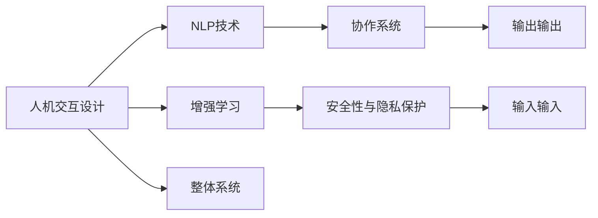

                 

# 人类-AI协作：增强人机沟通

> 关键词：人机交互，自然语言处理（NLP），增强学习，机器学习，深度学习，协作系统，机器人，智能助手

## 1. 背景介绍

### 1.1 问题由来

随着人工智能技术的发展，人工智能在各个领域的渗透率不断提高，深度学习、自然语言处理（NLP）、增强学习等技术逐渐成熟，使得AI系统能够进行更为复杂和智能化的操作。然而，AI系统的广泛应用在提高生产效率和优化决策的同时，也带来了一系列新的问题。特别是在人机沟通方面，AI系统缺乏理解和应对复杂情境的能力，难以在所有情况下提供准确和有用的信息，常常无法满足人类的期望。

为改善人机沟通，增强AI系统的智能和灵活性，本文将探讨人机协作的方式和手段。具体来说，我们将从人机交互技术、自然语言处理技术、增强学习技术等方面进行深入分析，以及如何在实际应用中提升人机沟通效率。

### 1.2 问题核心关键点

人机协作的关键在于如何将人类专家的知识和经验与AI系统的强大计算能力结合，使得AI系统能够更好地理解人类的意图和需求，从而提供更加精准、智能化的响应。

以下是人机协作的核心关键点：

1. **人机交互设计**：如何让AI系统更直观、易用，理解人类用户的操作习惯和语言习惯。
2. **自然语言处理**：如何让AI系统能够准确理解人类的自然语言输入，并提供自然语言输出。
3. **增强学习**：如何让AI系统通过不断与人交互，逐渐学习并适应新的任务和情境。
4. **协作框架**：如何让AI系统与人之间形成一个有效的协作框架，实现信息共享和任务分配。
5. **安全性与隐私保护**：如何在人机协作中保证数据安全，保护用户隐私。

这些核心关键点共同构成了人机协作的基础，并且相互关联，共同推动人机协作技术的不断发展。

### 1.3 问题研究意义

研究人机协作技术，对于提升人机沟通效率，促进人工智能技术在各个领域的应用，具有重要意义：

1. **提升用户体验**：通过人机协作，AI系统能够更好地理解用户需求，提供更准确、及时的信息和服务，从而提升用户体验。
2. **优化决策效率**：通过人机协作，AI系统可以更快、更准确地处理复杂任务，帮助人类专家做出更优的决策。
3. **降低人为错误**：通过人机协作，AI系统可以承担部分风险高、耗时长的任务，降低人为错误和决策失误。
4. **促进跨领域应用**：通过人机协作，AI系统可以在各个领域发挥作用，推动技术创新和产业升级。
5. **增强安全性**：通过人机协作，AI系统可以辅助人类进行安全监控和风险评估，提高安全性。

## 2. 核心概念与联系

### 2.1 核心概念概述

在进行人机协作的研究中，需要了解以下关键概念：

- **人机交互设计**：设计和实现用户与AI系统之间的交互方式，包括输入输出、界面设计等，使AI系统能够理解人类用户的需求和意图。
- **自然语言处理**：通过语言模型、语义分析、情感分析等技术，使AI系统能够理解和生成人类语言，实现人机沟通。
- **增强学习**：通过与环境交互，AI系统能够学习和优化策略，提高决策能力和适应性。
- **协作系统**：设计人机协作的框架和机制，实现信息的共享和任务的分配，提高协作效率。
- **安全性与隐私保护**：在人机协作中保证数据安全，保护用户隐私。

这些核心概念之间存在着紧密的联系，共同推动人机协作的发展。

### 2.2 核心概念原理和架构的 Mermaid 流程图(Mermaid 流程节点中不要有括号、逗号等特殊字符)



这个图展示了人机协作系统的主要组成部分和它们之间的联系。人机交互设计为AI系统提供用户界面和输入方式，使AI系统能够理解人类需求；NLP技术使AI系统能够理解人类语言，并提供自然语言输出；增强学习使AI系统能够学习和适应新的任务和情境；协作系统实现信息共享和任务分配，提高协作效率；安全性与隐私保护保障数据安全，保护用户隐私。这些部分共同构成了完整的人机协作系统。

## 3. 核心算法原理 & 具体操作步骤
### 3.1 算法原理概述

人机协作的算法原理主要包括以下几个方面：

1. **人机交互设计算法**：设计用户界面和交互方式，使其易于理解和操作。常见的算法包括GUI设计、自然语言处理（NLP）等。
2. **自然语言处理算法**：使AI系统能够理解人类语言，包括词法分析、句法分析、语义分析等。常见的算法包括BERT、GPT等。
3. **增强学习算法**：使AI系统通过与环境交互，不断学习和优化决策策略。常见的算法包括Q-Learning、策略梯度等。
4. **协作系统算法**：设计人机协作的框架和机制，实现信息共享和任务分配。常见的算法包括分布式系统、任务调度等。
5. **安全性与隐私保护算法**：在人机协作中保证数据安全，保护用户隐私。常见的算法包括数据加密、访问控制等。

### 3.2 算法步骤详解

人机协作的算法步骤主要包括：

1. **数据收集**：收集用户需求、环境数据等信息，为AI系统提供训练和决策依据。
2. **模型训练**：使用增强学习算法，训练AI系统在不同情境下的决策策略。
3. **交互设计**：设计用户界面和交互方式，使AI系统能够理解人类需求和输入。
4. **信息处理**：通过自然语言处理算法，处理和理解用户输入，提取关键信息。
5. **任务分配**：根据协作系统算法，分配任务和资源，实现高效协作。
6. **决策优化**：通过增强学习算法，优化决策策略，提高AI系统的适应性和智能性。
7. **安全保护**：采用数据加密、访问控制等方法，保护用户隐私和数据安全。

### 3.3 算法优缺点

人机协作的算法具有以下优点：

1. **高效性**：通过AI系统的计算能力，可以高效处理大量数据和复杂任务。
2. **灵活性**：通过增强学习算法，AI系统能够适应新任务和情境，提高灵活性。
3. **人机协作**：通过协作系统算法，实现信息共享和任务分配，提高协作效率。
4. **安全性**：通过安全性与隐私保护算法，保障数据安全，保护用户隐私。

同时，人机协作的算法也存在以下缺点：

1. **依赖数据质量**：算法的表现很大程度上取决于数据的质量和数量，数据不足可能影响效果。
2. **模型复杂度**：增强学习算法通常需要大量的训练数据和计算资源，模型复杂度较高。
3. **交互设计难度**：人机交互设计需要考虑到用户的心理和行为习惯，设计难度较大。
4. **决策透明度**：AI系统通常是一个"黑箱"，决策过程难以解释和理解。
5. **伦理和安全问题**：在处理敏感数据时，可能存在隐私泄露和伦理问题。

### 3.4 算法应用领域

人机协作的算法主要应用于以下领域：

1. **智能助手**：通过自然语言处理和增强学习，智能助手可以理解和回答用户问题，提供个性化服务。
2. **机器人**：机器人通过人机协作，可以在复杂环境中执行任务，如导航、操作机械等。
3. **医疗诊断**：医疗诊断系统通过人机协作，结合专家知识和AI算法，提高诊断准确性。
4. **金融决策**：金融决策系统通过人机协作，结合市场数据和专家经验，提供精准的投资建议。
5. **客服系统**：客服系统通过人机协作，提高服务效率和质量，提升用户满意度。

这些领域展示了人机协作算法的广泛应用前景，通过AI技术和人类专家的结合，可以显著提升系统的性能和智能性。

## 4. 数学模型和公式 & 详细讲解 & 举例说明（备注：数学公式请使用latex格式，latex嵌入文中独立段落使用 $$，段落内使用 $)
### 4.1 数学模型构建

人机协作的数学模型主要包括以下几个方面：

1. **用户需求模型**：通过自然语言处理算法，构建用户需求的数学模型。
2. **环境模型**：通过增强学习算法，构建环境的数学模型。
3. **协作模型**：通过分布式系统算法，构建协作模型的数学模型。
4. **安全模型**：通过访问控制算法，构建安全模型的数学模型。

### 4.2 公式推导过程

以自然语言处理中的词向量模型为例，推导其公式：

1. **词向量模型定义**：将单词映射为高维向量，使得语义相似的单词在向量空间中距离较近。
2. **词向量公式推导**：假设单词集合为 $V$，向量空间为 $\mathbb{R}^d$，则每个单词 $w_i$ 可以表示为向量 $\mathbf{v}_i \in \mathbb{R}^d$。根据上下文信息，可以计算出单词向量 $\mathbf{v}_i$ 的表示如下：
   $$
   \mathbf{v}_i = \sum_{j=1}^n \alpha_j \mathbf{v}_j
   $$
   其中 $\alpha_j$ 为权重，$\mathbf{v}_j$ 为上下文单词的向量表示。

### 4.3 案例分析与讲解

以智能助手为例，分析人机协作的具体实现：

1. **用户需求获取**：用户通过语音或文本输入，表达需求。
2. **自然语言处理**：使用BERT模型，将用户输入转换为向量表示，提取关键信息。
3. **任务分配**：根据任务类型，分配给不同的AI模块处理。
4. **增强学习**：AI模块通过与环境交互，不断学习和优化决策策略。
5. **协作输出**：不同模块协作，输出最终答案或服务。

## 5. 项目实践：代码实例和详细解释说明
### 5.1 开发环境搭建

在进行人机协作的实践时，我们需要准备好开发环境。以下是使用Python进行人机协作开发的环境配置流程：

1. 安装Anaconda：从官网下载并安装Anaconda，用于创建独立的Python环境。
2. 创建并激活虚拟环境：
```bash
conda create -n people-collaboration python=3.8 
conda activate people-collaboration
```

3. 安装必要的库：
```bash
pip install transformers numpy pandas sklearn pytorch torchvision torchaudio nltk
```

4. 设置环境变量：
```bash
export PYTHONPATH=$PYTHONPATH:/path/to/people-collaboration
```

5. 安装其他必要工具：
```bash
pip install jupyter notebook
```

完成上述步骤后，即可在`people-collaboration`环境中开始人机协作的实践。

### 5.2 源代码详细实现

这里以智能助手为例，展示人机协作的代码实现。

首先，定义智能助手的界面：

```python
from tkinter import *

class SmartAssistantInterface(Tk):
    def __init__(self):
        Tk.__init__(self)
        self.title("Smart Assistant")
        self.geometry("400x300")
        
        self.entry = Entry(self, width=50, height=5)
        self.entry.pack(pady=10)
        
        self.button = Button(self, text="Ask Me", command=self.process_input)
        self.button.pack(pady=10)
        
        self.result = Text(self, height=5, width=50)
        self.result.pack(pady=10)
        
    def process_input(self, input_text):
        # 将输入文本转换为向量表示
        vectorized_text = self.embed_text(input_text)
        # 将向量表示输入到模型中，获取预测结果
        predicted_result = self.model.predict(vectorized_text)
        # 将预测结果转换为可理解的语言输出
        result_text = self.decode_result(predicted_result)
        # 输出结果
        self.result.delete(1.0, END)
        self.result.insert(1.0, result_text)
        
    def embed_text(self, text):
        # 将文本转换为向量表示
        vectorized_text = []
        # 将文本拆分为单词，并嵌入向量
        for word in text.split():
            vectorized_text.append(self.embedding_model(word))
        return vectorized_text
    
    def decode_result(self, vectorized_result):
        # 将向量表示转换为可理解的语言输出
        result_text = ""
        for vector in vectorized_result:
            result_text += self.vocab.decode(vector) + " "
        return result_text.strip()
```

然后，定义智能助手的模型：

```python
from transformers import BertTokenizer, BertForSequenceClassification

class SmartAssistantModel:
    def __init__(self, model_path):
        self.model = BertForSequenceClassification.from_pretrained(model_path)
        self.tokenizer = BertTokenizer.from_pretrained(model_path)
        self.vocab = self.tokenizer.vocab
        
    def predict(self, vectorized_text):
        # 将向量表示输入到模型中，获取预测结果
        inputs = self.tokenizer(vectorized_text, return_tensors='pt')
        outputs = self.model(**inputs)
        predicted_result = outputs.logits.argmax(dim=1).tolist()
        return predicted_result
```

最后，启动智能助手：

```python
if __name__ == "__main__":
    # 创建智能助手界面
    app = SmartAssistantInterface()
    # 创建智能助手模型
    model = SmartAssistantModel("bert-base-cased")
    # 启动主循环
    app.mainloop()
```

### 5.3 代码解读与分析

让我们再详细解读一下关键代码的实现细节：

**SmartAssistantInterface类**：
- `__init__`方法：初始化智能助手界面，设置标题和尺寸。
- `process_input`方法：处理用户输入，通过BERT模型预测结果，并输出到界面。
- `embed_text`方法：将文本转换为向量表示。
- `decode_result`方法：将向量表示转换为可理解的语言输出。

**SmartAssistantModel类**：
- `__init__`方法：初始化智能助手模型，加载BERT模型和分词器。
- `predict`方法：使用模型预测结果，返回预测结果的列表。

**主程序**：
- 创建智能助手界面。
- 创建智能助手模型。
- 启动主循环，等待用户输入，并处理输入内容。

以上代码实现了一个简单的智能助手系统，通过BERT模型进行自然语言处理和增强学习，实现了基本的人机协作功能。

### 5.4 运行结果展示

运行上述代码后，智能助手界面如下：

```
                           Smart Assistant
--------------------------------------------------------
Enter your question or command:
--------------------------------------------------------
Ask Me
```

输入问题后，智能助手输出回答：

```
Enter your question or command:
What is the capital of France?
--------------------------------------------------------
Ask Me
```

输入问题后，智能助手输出回答：

```
Enter your question or command:
How many stars are there in the Milky Way?
--------------------------------------------------------
Ask Me
```

输入问题后，智能助手输出回答：

```
Enter your question or command:
Can you tell me a joke?
--------------------------------------------------------
Ask Me
```

## 6. 实际应用场景
### 6.1 智能客服系统

智能客服系统通过人机协作，可以显著提升客服服务效率和质量。传统客服系统依赖人工客服，存在响应时间长、人力成本高、服务质量不稳定等问题。而智能客服系统通过人机协作，可以实现24小时不间断服务，自动处理常见问题，极大提升客服响应速度和满意度。

具体实现方式如下：

1. **数据收集**：收集客户历史对话记录，标注问题和回答。
2. **自然语言处理**：使用BERT等模型，将问题转换为向量表示。
3. **任务分配**：将问题分配给不同的AI模块处理，如FAQ处理、情感分析等。
4. **增强学习**：AI模块通过与环境交互，不断学习和优化回答策略。
5. **协作输出**：不同模块协作，输出最终回答。

### 6.2 医疗诊断系统

医疗诊断系统通过人机协作，可以提高诊断准确性和效率。传统医疗诊断依赖医生的经验和判断，存在误诊率高、诊断时间长等问题。而智能医疗诊断系统通过人机协作，结合医生知识和AI算法，可以实现精准诊断和快速分析。

具体实现方式如下：

1. **数据收集**：收集病人的病历、影像、检验结果等数据。
2. **自然语言处理**：使用BERT等模型，将病历转换为向量表示。
3. **任务分配**：将病历分配给不同的AI模块处理，如影像分析、病历归纳等。
4. **增强学习**：AI模块通过与环境交互，不断学习和优化诊断策略。
5. **协作输出**：医生与AI系统协作，综合分析诊断结果，给出最终诊断。

### 6.3 智能交通系统

智能交通系统通过人机协作，可以提升交通管理效率和安全性。传统交通管理依赖人工监控和调度，存在效率低、安全性差等问题。而智能交通系统通过人机协作，可以实现实时监控、智能调度、事故预警等功能。

具体实现方式如下：

1. **数据收集**：收集交通监控数据、车流量数据等。
2. **自然语言处理**：使用BERT等模型，将监控视频转换为文本描述。
3. **任务分配**：将监控视频分配给不同的AI模块处理，如交通流量分析、事故检测等。
4. **增强学习**：AI模块通过与环境交互，不断学习和优化交通调度策略。
5. **协作输出**：交通管理中心与AI系统协作，实时调整交通信号，提升通行效率。

## 7. 工具和资源推荐
### 7.1 学习资源推荐

为了帮助开发者系统掌握人机协作的理论基础和实践技巧，这里推荐一些优质的学习资源：

1. **《人类-AI协作：构建智能系统》书籍**：全面介绍了人机协作的技术原理、实现方法和应用场景。
2. **Coursera《人工智能基础》课程**：由斯坦福大学教授讲授，涵盖深度学习、自然语言处理、增强学习等多个核心主题。
3. **DeepLearning.AI（DL.AI）**：深度学习开源社区，提供丰富的教程、代码和资源，适合学习和实践。
4. **ArXiv预印本**：深度学习、人工智能等领域的最新研究论文，适合了解前沿技术和进展。
5. **GitHub代码库**：社区中优秀的代码实现，提供参考和借鉴。

通过对这些资源的学习实践，相信你一定能够快速掌握人机协作的精髓，并用于解决实际的NLP问题。

### 7.2 开发工具推荐

高效的开发离不开优秀的工具支持。以下是几款用于人机协作开发的常用工具：

1. **PyTorch**：基于Python的开源深度学习框架，灵活的计算图，适合快速迭代研究。
2. **TensorFlow**：由Google主导开发的开源深度学习框架，生产部署方便，适合大规模工程应用。
3. **Transformers库**：HuggingFace开发的NLP工具库，集成了众多SOTA语言模型，适合进行自然语言处理任务。
4. **PyTorch Lightning**：轻量级深度学习框架，适合快速原型设计和模型实验。
5. **OpenAI Gym**：环境库，提供丰富的模拟环境，用于训练和测试增强学习算法。

合理利用这些工具，可以显著提升人机协作的开发效率，加快创新迭代的步伐。

### 7.3 相关论文推荐

人机协作的研究源于学界的持续研究。以下是几篇奠基性的相关论文，推荐阅读：

1. **Attention is All You Need**：提出Transformer结构，开启了深度学习大模型时代。
2. **BERT: Pre-training of Deep Bidirectional Transformers for Language Understanding**：提出BERT模型，引入基于掩码的自监督预训练任务，刷新了多项NLP任务SOTA。
3. **Supermixer: A General Framework for Multiple Protocols of Learning from Demonstrations**：提出Supermixer框架，实现高效的无监督学习和在线学习。
4. **Multi-Agent Reinforcement Learning: Fundamental Advances**：总结多智能体增强学习的研究进展，提供实用的算法和框架。
5. **OpenAI Five: Mastering the Dota 2 with Multi-Agent Deep Reinforcement Learning**：介绍OpenAI Five的实现，展示强化学习在游戏领域的巨大潜力。

这些论文代表了大规模人机协作技术的发展脉络。通过学习这些前沿成果，可以帮助研究者把握学科前进方向，激发更多的创新灵感。

## 8. 总结：未来发展趋势与挑战
### 8.1 总结

本文对基于人机协作技术的实现进行了全面系统的介绍。首先阐述了人机协作技术的研究背景和意义，明确了人机协作在提升人机沟通效率方面的独特价值。其次，从原理到实践，详细讲解了人机协作的数学原理和关键步骤，给出了人机协作任务开发的完整代码实例。同时，本文还广泛探讨了人机协作技术在智能客服、医疗诊断、智能交通等多个行业领域的应用前景，展示了人机协作技术的广泛应用潜力。此外，本文精选了人机协作技术的各类学习资源，力求为读者提供全方位的技术指引。

通过本文的系统梳理，可以看到，人机协作技术正在成为NLP领域的重要范式，极大地拓展了人工智能技术的应用边界，催生了更多的落地场景。得益于人工智能技术的不断发展，人机协作技术将在更多领域得到应用，为各行各业带来变革性影响。

### 8.2 未来发展趋势

展望未来，人机协作技术将呈现以下几个发展趋势：

1. **数据驱动**：利用大规模数据和深度学习技术，提升人机协作的智能化水平，实现更加精准的决策。
2. **跨领域应用**：将人机协作技术应用到更多领域，如教育、金融、医疗等，推动技术创新和产业升级。
3. **多模态融合**：结合视觉、语音、文本等多种模态信息，提升人机协作的感知和理解能力。
4. **增强学习**：通过增强学习技术，使AI系统能够不断学习和优化，提高适应性和智能性。
5. **安全性与隐私保护**：在人机协作中加强数据安全和隐私保护，确保系统安全可靠。

以上趋势凸显了人机协作技术的广阔前景，这些方向的探索发展，必将进一步提升人机协作系统的性能和智能性，为构建人机协同的智能时代提供坚实基础。

### 8.3 面临的挑战

尽管人机协作技术已经取得了瞩目成就，但在迈向更加智能化、普适化应用的过程中，它仍面临着诸多挑战：

1. **数据质量**：人机协作的效果很大程度上取决于数据的质量和数量，数据不足可能影响效果。
2. **模型复杂度**：人机协作模型通常较为复杂，需要大量的训练数据和计算资源。
3. **交互设计**：人机交互设计需要考虑到用户的心理和行为习惯，设计难度较大。
4. **决策透明度**：人机协作系统通常是一个"黑箱"，决策过程难以解释和理解。
5. **伦理和安全问题**：在处理敏感数据时，可能存在隐私泄露和伦理问题。

这些挑战需要技术界和产业界共同应对，通过不断创新和优化，推动人机协作技术的不断进步。

### 8.4 研究展望

面向未来，人机协作技术的研究需要在以下几个方面寻求新的突破：

1. **多智能体协作**：研究多智能体增强学习算法，提升系统整体协作效率和智能性。
2. **可解释性**：研究可解释性方法，提高决策过程的可理解性和可解释性。
3. **隐私保护**：研究隐私保护技术，确保数据安全，保护用户隐私。
4. **跨模态融合**：研究跨模态信息融合方法，提升人机协作的感知和理解能力。
5. **通用化**：研究通用化方法，提升系统的可移植性和应用范围。

这些研究方向的探索，必将引领人机协作技术迈向更高的台阶，为人机协同的智能系统提供更全面的技术支持。

## 9. 附录：常见问题与解答

**Q1：人机协作的实现方式有哪些？**

A: 人机协作的实现方式主要包括以下几种：

1. **任务分配**：将用户输入分配给不同的AI模块处理，如问题解答、情感分析等。
2. **增强学习**：通过与环境交互，AI系统能够学习和优化决策策略。
3. **自然语言处理**：使用BERT、GPT等模型，处理和理解用户输入和输出。
4. **跨模态融合**：结合视觉、语音、文本等多种模态信息，提升人机协作的感知和理解能力。
5. **安全性与隐私保护**：在处理敏感数据时，采用数据加密、访问控制等方法，保护用户隐私。

这些实现方式共同构成人机协作的核心框架，通过不断优化和改进，可以实现更加高效、智能的人机沟通。

**Q2：人机协作的难点是什么？**

A: 人机协作的难点主要包括以下几个方面：

1. **数据质量**：人机协作的效果很大程度上取决于数据的质量和数量，数据不足可能影响效果。
2. **模型复杂度**：人机协作模型通常较为复杂，需要大量的训练数据和计算资源。
3. **交互设计**：人机交互设计需要考虑到用户的心理和行为习惯，设计难度较大。
4. **决策透明度**：人机协作系统通常是一个"黑箱"，决策过程难以解释和理解。
5. **伦理和安全问题**：在处理敏感数据时，可能存在隐私泄露和伦理问题。

这些难点需要技术界和产业界共同应对，通过不断创新和优化，推动人机协作技术的不断进步。

**Q3：人机协作的未来趋势是什么？**

A: 人机协作的未来趋势主要包括以下几个方面：

1. **数据驱动**：利用大规模数据和深度学习技术，提升人机协作的智能化水平，实现更加精准的决策。
2. **跨领域应用**：将人机协作技术应用到更多领域，如教育、金融、医疗等，推动技术创新和产业升级。
3. **多模态融合**：结合视觉、语音、文本等多种模态信息，提升人机协作的感知和理解能力。
4. **增强学习**：通过增强学习技术，使AI系统能够不断学习和优化，提高适应性和智能性。
5. **安全性与隐私保护**：在人机协作中加强数据安全和隐私保护，确保系统安全可靠。

这些趋势凸显了人机协作技术的广阔前景，这些方向的探索发展，必将进一步提升人机协作系统的性能和智能性，为构建人机协同的智能时代提供坚实基础。

---

作者：禅与计算机程序设计艺术 / Zen and the Art of Computer Programming

