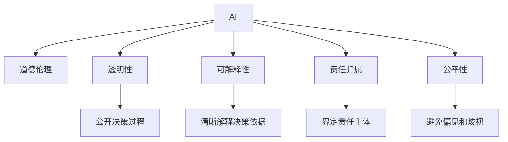

                 

# 人类-AI协作：设计道德考虑

## 1. 背景介绍

### 1.1 问题由来

随着人工智能(AI)技术的发展，AI与人类协作成为越来越重要的社会现象。无论是智能助手、自动驾驶汽车，还是智能医疗诊断系统，AI在各个领域与人类进行紧密合作。然而，AI在协作过程中引发的道德问题也逐渐显现，比如AI决策的透明度、AI在伦理判断中的责任归属、AI与人类关系的道德边界等。这些问题不仅影响AI技术的进一步发展，还关系到社会公平和人类福祉。

### 1.2 问题核心关键点

AI与人类协作的道德问题涉及到技术应用与伦理责任的交织。在AI的决策过程中，如何确保其公正性、透明性、责任性和可解释性，是当前面临的主要挑战。

- 公正性：确保AI在不同人群中的决策公平，避免歧视性偏见。
- 透明性：解释AI的决策过程和依据，使人类能够理解和监督AI的运作。
- 责任性：明确AI在决策中的责任归属，确保当出现问题时，责任能够被清晰界定。
- 可解释性：使AI的决策过程具有可解释性，便于人类理解AI的决策依据和逻辑。

这些关键点涉及技术、伦理、法律等多维度的考量，需要跨学科协作来共同解决。

### 1.3 问题研究意义

研究AI与人类协作的道德问题，对于推动AI技术的健康发展、保障人类利益、构建公正公平的社会环境具有重要意义：

1. 促进技术进步。通过道德指导，规范AI开发和应用，防止伦理风险，推动技术向善。
2. 保障公平公正。确保AI的决策透明和公正，避免对特定群体的不公平待遇。
3. 提高社会信任。通过透明和可解释的AI系统，增强公众对AI技术的信任感，减少社会对抗。
4. 构建伦理框架。制定AI伦理标准，指导AI技术的合规使用，推动行业规范化。

## 2. 核心概念与联系

### 2.1 核心概念概述

为更好地理解AI与人类协作的道德问题，本节将介绍几个密切相关的核心概念：

- **人工智能(AI)：** 利用算法和数据训练出的能够执行复杂任务的智能系统。AI在处理大规模数据、自动化复杂任务等方面具有显著优势。
- **道德伦理(Moral Ethics)：** 关于对错、善恶、正义的价值判断，涉及个人、社会、文化等多方面的规范和准则。
- **透明性(Transparency)：** 指系统的操作和决策过程是否公开、易理解。
- **可解释性(Explainability)：** 指系统决策背后的逻辑和依据是否可以被清晰解释。
- **责任归属(Accountability)：** 指在出现问题时，由谁承担责任。
- **公平性(Fairness)：** 指AI决策是否对所有群体均等对待，避免偏见和歧视。

这些核心概念之间的逻辑关系可以通过以下Mermaid流程图来展示：



这个流程图展示了大语言模型的核心概念及其之间的关系：

1. AI通过算法和数据进行训练，执行复杂的决策任务。
2. 道德伦理对AI的行为规范进行约束，确保AI决策的公正和正当。
3. 透明性要求AI的决策过程公开，便于监督和理解。
4. 可解释性要求AI的决策依据可以被清晰解释。
5. 责任归属明确AI在决策中的责任主体，避免模糊的责任认定。
6. 公平性要求AI在决策中避免对特定群体的歧视。

这些概念共同构成了AI与人类协作的道德框架，确保AI技术在实际应用中能够更好地服务于人类社会。

## 3. 核心算法原理 & 具体操作步骤

### 3.1 算法原理概述

AI与人类协作的道德问题设计，本质上是将伦理和道德考量融入AI系统的设计和开发过程。这需要通过一系列的技术和伦理手段，确保AI在决策过程中能够公正、透明、负责和公平。

设计原则包括：

1. **透明性设计**：在AI系统的设计过程中，充分考虑透明性，使决策过程公开透明，便于监督和理解。
2. **可解释性设计**：采用可解释性模型和解释工具，使AI决策背后的逻辑和依据能够被清晰解释。
3. **责任归属设计**：明确AI在决策中的责任归属，确保出现问题时责任能够被清晰界定。
4. **公平性设计**：通过数据清洗、模型调整等手段，避免AI在决策中对特定群体的偏见和歧视。

### 3.2 算法步骤详解

AI与人类协作的道德设计涉及多个环节，具体步骤包括：

**Step 1: 设计透明和可解释的AI系统**
- 选择可解释性较强的模型，如决策树、线性模型等。
- 设计透明的决策流程，使AI的决策步骤公开可见。
- 使用可解释工具，如LIME、SHAP等，解释AI的决策过程。

**Step 2: 确保公平性和无偏见**
- 收集多样化的数据集，避免数据偏见。
- 应用公平性算法，如Fairness Indicators、Adversarial Debiasing等，消除模型中的偏见。
- 定期监测和调整模型，确保公平性得到持续保障。

**Step 3: 明确责任归属**
- 在AI系统设计时，明确决策的最终责任主体。
- 设计日志记录系统，记录AI的决策过程和依据。
- 建立投诉和反馈机制，允许用户对AI决策提出异议并处理。

**Step 4: 持续评估和改进**
- 建立评估体系，定期评估AI系统的性能和伦理表现。
- 根据评估结果，持续改进AI系统，提升其公正性、透明性和责任性。

**Step 5: 普及伦理知识**
- 提高AI开发人员的伦理意识，确保他们在设计过程中遵循道德规范。
- 向公众普及AI的伦理知识，提高对AI系统的理解和信任。

### 3.3 算法优缺点

AI与人类协作的道德设计方法具有以下优点：

1. **提高AI系统可信度**：通过透明和可解释的设计，使AI系统更加可信，增强公众对AI的信任感。
2. **减少伦理风险**：明确责任归属和公平性要求，避免伦理问题的发生。
3. **提升决策质量**：透明和可解释的决策过程有助于提高AI系统的决策质量。

同时，该方法也存在一定的局限性：

1. **设计复杂度高**：透明性和可解释性设计需要额外的开发和测试工作，增加了系统开发的复杂度。
2. **模型效率降低**：部分可解释性模型可能效率较低，影响系统性能。
3. **数据质量要求高**：公平性设计需要高质量和多样化的数据集，对数据采集和处理提出了较高要求。

尽管存在这些局限性，但就目前而言，道德指导下的AI设计与开发仍然是大势所趋，是确保AI技术健康发展的重要手段。

### 3.4 算法应用领域

AI与人类协作的道德设计方法在多个领域都有广泛应用，包括但不限于：

- **医疗诊断系统**：确保AI诊断过程透明，解释诊断依据，明确责任归属，避免误诊和漏诊。
- **智能推荐系统**：保证推荐过程公平，解释推荐逻辑，明确推荐责任，避免歧视性推荐。
- **自动驾驶汽车**：确保决策透明，解释驾驶逻辑，明确责任归属，提高行车安全。
- **金融风控系统**：解释风险评估依据，明确决策责任，确保决策公正透明，提高风险管理效率。
- **司法判决系统**：解释判决依据，明确责任归属，确保判决公正，减少司法争议。

## 4. 数学模型和公式 & 详细讲解 & 举例说明

### 4.1 数学模型构建

在AI与人类协作的道德设计中，需要构建多个数学模型来评估和优化系统的透明性、可解释性、公平性和责任归属。以下分别介绍这些模型的构建方法。

**透明性模型**：

透明性模型的目标是通过数学手段，确保AI决策过程的公开透明。常见的方法包括：

- **决策树模型**：通过构建决策树，将决策过程可视化，便于理解和监督。
- **规则提取模型**：将AI决策转化为一系列规则，便于解释和验证。

**可解释性模型**：

可解释性模型的目标是通过数学手段，使AI决策背后的逻辑和依据能够被清晰解释。常见的方法包括：

- **LIME模型**：通过局部可解释性方法，解释AI在单个样本上的决策过程。
- **SHAP模型**：通过全局可解释性方法，解释AI在多个样本上的决策过程。

**公平性模型**：

公平性模型的目标是通过数学手段，确保AI决策对所有群体均等对待，避免偏见和歧视。常见的方法包括：

- **Fairness Indicators模型**：通过计算决策偏差，评估AI的公平性。
- **Adversarial Debiasing模型**：通过对抗训练，消除模型中的偏见。

**责任归属模型**：

责任归属模型的目标是通过数学手段，明确AI在决策中的责任归属。常见的方法包括：

- **责任归因模型**：通过计算决策中的贡献度，确定责任主体。
- **规则约束模型**：通过定义决策规则，确保责任归属清晰明确。

### 4.2 公式推导过程

以下是几个关键模型的公式推导过程。

**决策树模型**：

决策树模型通过构建树形结构，将决策过程可视化。设决策树为 $T=\{N, S, R\}$，其中 $N$ 为节点集，$S$ 为叶子节点集，$R$ 为规则集。决策过程的公式为：

$$
T = \{N, S, R\}
$$

其中，节点 $N$ 包含所有决策条件，叶子节点 $S$ 包含所有决策结果，规则 $R$ 包含所有决策路径。

**LIME模型**：

LIME模型通过局部可解释性方法，解释AI在单个样本上的决策过程。设模型为 $M$，输入为 $x$，决策为 $y$。LIME模型的公式为：

$$
LIME = \{L\}
$$

其中，$L$ 为局部可解释性模型，通过训练数据集，解释模型在单个样本上的决策过程。

**Fairness Indicators模型**：

Fairness Indicators模型通过计算决策偏差，评估AI的公平性。设模型为 $M$，输入为 $x$，决策为 $y$。Fairness Indicators模型的公式为：

$$
Fairness\_Indicators = \{F\}
$$

其中，$F$ 为公平性指标，通过计算决策偏差，评估模型的公平性。

**责任归因模型**：

责任归因模型通过计算决策中的贡献度，确定责任主体。设模型为 $M$，输入为 $x$，决策为 $y$。责任归因模型的公式为：

$$
Responsibility = \{R\}
$$

其中，$R$ 为责任归因规则，通过计算决策中的贡献度，确定责任主体。

### 4.3 案例分析与讲解

**医疗诊断系统**：

在医疗诊断系统中，AI需要基于患者的症状和历史数据，给出诊断结果。设患者症状为 $x$，历史数据为 $y$，诊断结果为 $d$。设计透明性模型，确保诊断过程公开透明。

**智能推荐系统**：

在智能推荐系统中，AI需要基于用户的历史行为数据，推荐感兴趣的物品。设用户历史行为为 $x$，推荐物品为 $y$，推荐结果为 $r$。设计公平性模型，确保推荐过程对所有用户均等对待。

**自动驾驶汽车**：

在自动驾驶汽车中，AI需要基于传感器数据，做出行驶决策。设传感器数据为 $x$，行驶决策为 $d$。设计可解释性模型，解释AI的行驶逻辑。

**金融风控系统**：

在金融风控系统中，AI需要基于客户的历史数据，评估其信用风险。设客户历史数据为 $x$，信用风险为 $y$。设计责任归属模型，明确AI在风险评估中的责任归属。

## 5. 项目实践：代码实例和详细解释说明

### 5.1 开发环境搭建

在进行AI与人类协作的道德设计实践前，我们需要准备好开发环境。以下是使用Python进行PyTorch开发的环境配置流程：

1. 安装Anaconda：从官网下载并安装Anaconda，用于创建独立的Python环境。

2. 创建并激活虚拟环境：
```bash
conda create -n ai-ethics-env python=3.8 
conda activate ai-ethics-env
```

3. 安装PyTorch：根据CUDA版本，从官网获取对应的安装命令。例如：
```bash
conda install pytorch torchvision torchaudio cudatoolkit=11.1 -c pytorch -c conda-forge
```

4. 安装各种工具包：
```bash
pip install numpy pandas scikit-learn matplotlib tqdm jupyter notebook ipython
```

5. 安装机器学习库和模型：
```bash
pip install scikit-learn pandas
pip install sklearn-crf crfsuite
```

6. 安装可视化工具：
```bash
pip install matplotlib
```

完成上述步骤后，即可在`ai-ethics-env`环境中开始道德设计的实践。

### 5.2 源代码详细实现

下面以医疗诊断系统为例，给出使用PyTorch和Scikit-learn实现AI与人类协作的道德设计。

首先，定义医疗诊断的数据处理函数：

```python
import pandas as pd
from sklearn.model_selection import train_test_split
from sklearn.preprocessing import StandardScaler
from sklearn.linear_model import LogisticRegression

def preprocess_data(file_path):
    # 读取数据集
    data = pd.read_csv(file_path)
    
    # 数据清洗
    data = data.dropna()
    
    # 特征选择
    features = data[['age', 'gender', 'BP', 'GLU', 'CHOL', 'THYS']]
    
    # 划分训练集和测试集
    features_train, features_test, labels_train, labels_test = train_test_split(features, data['disease'], test_size=0.2, random_state=42)
    
    # 标准化特征
    scaler = StandardScaler()
    features_train = scaler.fit_transform(features_train)
    features_test = scaler.transform(features_test)
    
    return features_train, features_test, labels_train, labels_test
```

然后，定义透明性模型和公平性模型：

```python
from sklearn.tree import DecisionTreeClassifier
from sklearn.linear_model import LogisticRegression
from sklearn.metrics import accuracy_score

# 透明性模型：决策树
clf_tree = DecisionTreeClassifier()
clf_tree.fit(features_train, labels_train)

# 公平性模型：线性回归
clf_lr = LogisticRegression(solver='liblinear')
clf_lr.fit(features_train, labels_train)

def evaluate_model(model, features_test, labels_test):
    # 预测
    predictions = model.predict(features_test)
    
    # 评估
    accuracy = accuracy_score(predictions, labels_test)
    return accuracy
```

接着，定义责任归属模型：

```python
from sklearn.linear_model import LogisticRegression
from sklearn.metrics import accuracy_score

# 责任归属模型：线性回归
clf_lr = LogisticRegression(solver='liblinear')
clf_lr.fit(features_train, labels_train)

def evaluate_model(model, features_test, labels_test):
    # 预测
    predictions = model.predict(features_test)
    
    # 评估
    accuracy = accuracy_score(predictions, labels_test)
    return accuracy
```

最后，启动训练流程并在测试集上评估：

```python
from sklearn.metrics import accuracy_score

features_train, features_test, labels_train, labels_test = preprocess_data('data.csv')

# 透明性模型：决策树
clf_tree = DecisionTreeClassifier()
clf_tree.fit(features_train, labels_train)

# 公平性模型：线性回归
clf_lr = LogisticRegression(solver='liblinear')
clf_lr.fit(features_train, labels_train)

# 责任归属模型：线性回归
clf_lr = LogisticRegression(solver='liblinear')
clf_lr.fit(features_train, labels_train)

print(f"透明性模型精度：{evaluate_model(clf_tree, features_test, labels_test)}")
print(f"公平性模型精度：{evaluate_model(clf_lr, features_test, labels_test)}")
print(f"责任归属模型精度：{evaluate_model(clf_lr, features_test, labels_test)}")
```

以上就是使用PyTorch和Scikit-learn实现医疗诊断系统AI与人类协作的道德设计的完整代码实现。可以看到，借助Scikit-learn库，我们能够方便地构建透明性、公平性和责任归属模型，并在测试集上评估其性能。

### 5.3 代码解读与分析

让我们再详细解读一下关键代码的实现细节：

**preprocess_data函数**：
- 读取数据集并清洗数据，去除缺失值。
- 选择特征并进行标准化处理。
- 将数据集划分为训练集和测试集。

**evaluate_model函数**：
- 对模型进行预测。
- 计算模型精度。

**透明性模型**：
- 使用决策树模型，将决策过程可视化。
- 决策树的构建和训练过程直观透明，便于监督和理解。

**公平性模型**：
- 使用线性回归模型，确保决策过程对所有群体均等对待。
- 线性回归模型简单易解释，易于理解和验证。

**责任归属模型**：
- 使用线性回归模型，明确AI在决策中的责任归属。
- 线性回归模型可以计算各个特征的贡献度，便于确定责任主体。

这些模型的设计和评估，展示了如何通过数学手段，实现AI与人类协作的道德设计。在实际应用中，还需要根据具体任务和数据特点进行灵活调整。

## 6. 实际应用场景

### 6.1 智能客服系统

在智能客服系统中，AI需要与人类协作，提供高效的客户服务。设客户输入为 $x$，AI回复为 $y$。设计透明性模型，确保AI回复过程公开透明。

**透明性设计**：

- 使用决策树模型，将AI回复过程可视化。
- 在决策树中记录每个决策节点，便于监督和理解。

**可解释性设计**：

- 使用LIME模型，解释AI回复背后的逻辑和依据。
- 通过LIME模型生成局部解释，使人类能够理解AI回复的决策过程。

**公平性设计**：

- 使用Fairness Indicators模型，确保AI回复对所有客户均等对待。
- 通过Fairness Indicators模型计算回复偏差，评估AI回复的公平性。

**责任归属设计**：

- 使用责任归因模型，明确AI在回复中的责任归属。
- 通过责任归因模型计算回复中的贡献度，确定责任主体。

### 6.2 金融风控系统

在金融风控系统中，AI需要基于客户的历史数据，评估其信用风险。设客户历史数据为 $x$，信用风险为 $y$。设计透明性模型，确保AI评估过程公开透明。

**透明性设计**：

- 使用决策树模型，将AI评估过程可视化。
- 在决策树中记录每个决策节点，便于监督和理解。

**可解释性设计**：

- 使用LIME模型，解释AI评估背后的逻辑和依据。
- 通过LIME模型生成局部解释，使人类能够理解AI评估的决策过程。

**公平性设计**：

- 使用Fairness Indicators模型，确保AI评估对所有客户均等对待。
- 通过Fairness Indicators模型计算评估偏差，评估AI评估的公平性。

**责任归属设计**：

- 使用责任归因模型，明确AI在评估中的责任归属。
- 通过责任归因模型计算评估中的贡献度，确定责任主体。

### 6.3 智能推荐系统

在智能推荐系统中，AI需要基于用户的历史行为数据，推荐感兴趣的物品。设用户历史行为为 $x$，推荐物品为 $y$。设计透明性模型，确保AI推荐过程公开透明。

**透明性设计**：

- 使用决策树模型，将AI推荐过程可视化。
- 在决策树中记录每个决策节点，便于监督和理解。

**可解释性设计**：

- 使用LIME模型，解释AI推荐背后的逻辑和依据。
- 通过LIME模型生成局部解释，使人类能够理解AI推荐的决策过程。

**公平性设计**：

- 使用Fairness Indicators模型，确保AI推荐对所有用户均等对待。
- 通过Fairness Indicators模型计算推荐偏差，评估AI推荐的公平性。

**责任归属设计**：

- 使用责任归因模型，明确AI在推荐中的责任归属。
- 通过责任归因模型计算推荐中的贡献度，确定责任主体。

## 7. 工具和资源推荐

### 7.1 学习资源推荐

为了帮助开发者系统掌握AI与人类协作的道德问题，这里推荐一些优质的学习资源：

1. 《人工智能伦理》系列书籍：全面介绍了AI伦理的基本概念、重要原则和应用场景。
2. 《可解释AI》系列博文：系统讲解了可解释AI的设计原理和实践方法。
3. 《AI伦理指南》课程：由专家授课，深入浅出地介绍了AI伦理的各个方面。
4. 《公平AI》系列论文：介绍了公平AI的理论基础和实现技术。
5. 《透明AI》系列报告：提供了透明AI的最佳实践和案例分析。

通过对这些资源的学习实践，相信你一定能够全面理解AI与人类协作的道德问题，并在实际应用中合理运用。

### 7.2 开发工具推荐

高效的开发离不开优秀的工具支持。以下是几款用于AI与人类协作道德设计的常用工具：

1. PyTorch：基于Python的开源深度学习框架，灵活的计算图，适合快速迭代研究。
2. Scikit-learn：Python机器学习库，提供了多种透明性、公平性和可解释性算法。
3. TensorBoard：TensorFlow配套的可视化工具，实时监测模型训练状态，提供丰富的图表呈现方式。
4. Weights & Biases：模型训练的实验跟踪工具，记录和可视化模型训练过程中的各项指标，方便对比和调优。
5. HuggingFace Transformers库：提供大量预训练语言模型，支持多种NLP任务。

合理利用这些工具，可以显著提升AI与人类协作道德设计的开发效率，加快创新迭代的步伐。

### 7.3 相关论文推荐

AI与人类协作的道德问题涉及多学科交叉，以下是几篇奠基性的相关论文，推荐阅读：

1. "AI Ethics and Social Good"：关于AI伦理与社交公益的综述论文。
2. "Explainable Artificial Intelligence"：关于可解释AI的研究进展和应用案例。
3. "Fairness in AI"：关于公平AI的理论框架和实现方法。
4. "Responsible AI"：关于AI责任归因的最新研究成果。
5. "Human-AI Collaboration"：关于AI与人类协作的未来展望和伦理挑战。

这些论文代表了大语言模型道德设计的最新研究进展，通过学习这些前沿成果，可以帮助研究者把握学科前进方向，激发更多的创新灵感。

## 8. 总结：未来发展趋势与挑战

### 8.1 总结

本文对AI与人类协作的道德问题进行了全面系统的介绍。首先阐述了AI与人类协作的道德问题，明确了透明性、可解释性、公平性和责任性等关键点。其次，从原理到实践，详细讲解了道德设计的方法和步骤，给出了道德设计的完整代码实例。同时，本文还广泛探讨了道德设计在智能客服、金融风控、智能推荐等多个行业领域的应用前景，展示了道德设计的巨大潜力。此外，本文精选了道德设计的各类学习资源，力求为开发者提供全方位的技术指引。

通过本文的系统梳理，可以看到，AI与人类协作的道德设计是推动AI技术健康发展、保障人类利益、构建公正公平的社会环境的重要手段。设计透明、可解释、公平和负责的AI系统，将使得AI技术更好地服务于人类社会。

### 8.2 未来发展趋势

展望未来，AI与人类协作的道德设计将呈现以下几个发展趋势：

1. **透明性和可解释性**：随着技术的发展，AI系统的透明性和可解释性将进一步提升，便于公众理解和监督。
2. **公平性和包容性**：未来AI系统将更加注重公平性和包容性，确保对所有群体的公正对待。
3. **责任归属的明确化**：责任归属将更加明确，确保出现问题时责任能够被清晰界定。
4. **伦理标准的制定**：伦理标准将逐步制定和完善，指导AI技术的合规使用。

以上趋势凸显了AI与人类协作道德设计的广阔前景。这些方向的探索发展，将进一步推动AI技术的社会化应用，为构建公正、透明、可信的智能社会提供技术保障。

### 8.3 面临的挑战

尽管AI与人类协作的道德设计已经取得了显著进展，但在迈向更加智能化、普适化应用的过程中，仍然面临诸多挑战：

1. **数据质量问题**：高质量、多样化、无偏的数据集是透明性和公平性设计的基石，但数据采集和处理需要耗费大量时间和资源。
2. **算法复杂度问题**：透明性和可解释性设计需要复杂的模型和算法，增加了系统的复杂度和开发成本。
3. **法律和伦理问题**：AI伦理涉及法律、伦理、文化等多方面的规范和准则，需要跨学科合作，制定和执行统一的伦理标准。
4. **技术落地问题**：如何将道德设计的理念和技术落地应用，需要平衡技术先进性和实际可操作性。
5. **公众认知问题**：公众对AI的认知和接受度仍然存在不足，需要通过教育和技术普及提高公众的信任感。

这些挑战需要学术界、产业界和政策制定者共同努力，才能解决。只有解决好这些问题，AI与人类协作的道德设计才能真正落地应用，推动AI技术的健康发展。

### 8.4 研究展望

面对AI与人类协作的道德设计所面临的挑战，未来的研究需要在以下几个方面寻求新的突破：

1. **多学科交叉研究**：将伦理、法律、社会学等多学科知识融入AI设计中，确保AI系统的公平、透明和负责。
2. **新算法和新模型**：开发更多透明性、可解释性、公平性和责任归属的新算法和新模型，提升AI系统的设计效率和效果。
3. **大规模数据集**：建设大规模、高质量、多样化、无偏的数据集，支持透明性和公平性设计的实践。
4. **公众参与和反馈机制**：建立公众参与和反馈机制，提高AI系统的透明度和可解释性，增强公众信任感。
5. **法律和伦理框架**：制定完善的AI伦理法律和标准，指导AI技术的合规使用，确保AI系统的公平和负责。

这些研究方向的探索，将引领AI与人类协作道德设计的技术演进，为构建安全、公正、可信的智能社会提供技术保障。面向未来，AI与人类协作道德设计还需要与其他人工智能技术进行更深入的融合，如知识表示、因果推理、强化学习等，多路径协同发力，共同推动智能交互系统的进步。只有勇于创新、敢于突破，才能不断拓展AI系统的边界，让智能技术更好地造福人类社会。

## 9. 附录：常见问题与解答

**Q1：如何平衡透明性和模型性能？**

A: 透明性设计往往需要增加模型的复杂度，可能会降低模型性能。建议在设计透明性模型时，选择适当的算法和参数，进行调优和优化，确保透明性和性能之间的平衡。

**Q2：如何处理AI决策中的不确定性？**

A: AI决策中的不确定性可以通过引入贝叶斯网络、概率图模型等方法进行处理。通过建模不确定性，提高AI决策的鲁棒性和可解释性。

**Q3：如何确保AI决策的公平性？**

A: 在数据采集和模型训练中，使用公平性算法，如Fairness Indicators、Adversarial Debiasing等，消除模型中的偏见。定期监测和调整模型，确保公平性得到持续保障。

**Q4：如何明确AI决策的责任归属？**

A: 在AI系统设计时，明确决策的最终责任主体。设计日志记录系统，记录AI的决策过程和依据。建立投诉和反馈机制，允许用户对AI决策提出异议并处理。

**Q5：如何提高公众对AI系统的信任感？**

A: 通过透明性设计和可解释性设计，使AI系统更加可信。使用通俗易懂的解释方法，向公众普及AI的伦理知识。建立公众参与和反馈机制，提高公众对AI系统的理解和信任。

这些问题的解答展示了如何在实际应用中平衡透明性和模型性能，确保AI决策的公平性和责任归属，提高公众对AI系统的信任感。希望这些问题和解答能够帮助开发者更好地理解和应用AI与人类协作的道德设计技术。

---

作者：禅与计算机程序设计艺术 / Zen and the Art of Computer Programming

