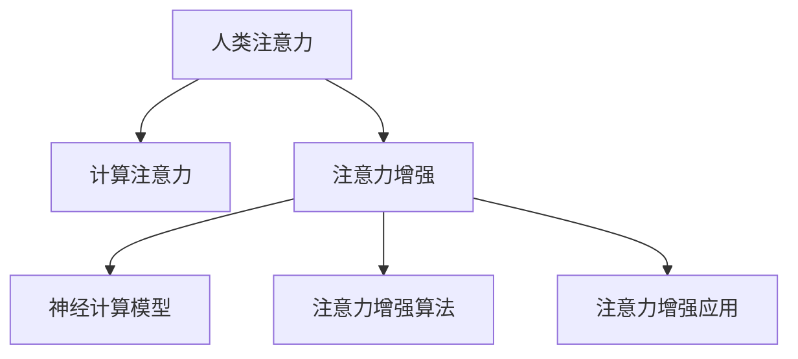

                 

# 人类注意力增强：提升专注力和注意力在商业中的未来趋势

> 关键词：人类注意力，注意力增强，专注力提升，商业应用，未来趋势

## 1. 背景介绍

### 1.1 问题由来
在信息爆炸的时代，注意力成为了人们最宝贵的资源之一。无论是工作、学习还是娱乐，如何高效管理注意力，提升专注力和效率，成为了每个个体乃至组织面临的共同挑战。尤其在商业领域，注意力资源如何被利用，直接决定了企业的竞争力与盈利能力。随着技术的发展，越来越多的工具被应用于注意力增强，如番茄工作法、番茄时钟应用、各类学习应用等。但这些工具大多缺乏科学依据和理论支持，难以满足日益增长的需求。因此，亟需一种科学有效的注意力增强方法，帮助个体和组织提升专注力和效率，从而在商业竞争中占据有利位置。

### 1.2 问题核心关键点
本文聚焦于基于计算科学的注意力增强方法，旨在通过计算手段模拟和优化人类的注意力系统，提升个体和组织的专注力和效率。该方法以脑科学研究成果为基础，利用神经计算模型模拟注意力机制，结合机器学习算法优化注意力分配，实现注意力增强。

### 1.3 问题研究意义
人类注意力增强不仅是个体生活质量提升的重要途径，更是企业提升生产效率和经济效益的关键手段。通过深入研究注意力增强，可以：

1. **提高个体工作效率**：增强工作时的专注力，减少干扰，提高工作效率和成果质量。
2. **提升企业竞争力**：增强团队协作效率，降低生产成本，提升企业市场响应速度。
3. **改善生活质量**：减少对数字娱乐的依赖，提升学习和工作投入，实现自我价值。
4. **推动技术创新**：为注意力增强领域的研究和应用提供理论支撑和技术支持。

## 2. 核心概念与联系

### 2.1 核心概念概述

为了更好地理解基于计算科学的注意力增强方法，本节将介绍几个密切相关的核心概念：

- **人类注意力**：指个体对特定刺激的认知资源分配，如视觉、听觉、语言等感官通道的注意焦点。人类注意力系统包括感觉选择、注意维持和资源分配等关键环节。

- **计算注意力**：指通过计算模型模拟人类注意力的机制和过程，以提升个体和组织的专注力和效率。计算注意力模型通常分为自顶向下和自底向上的两种。

- **注意力增强**：指通过计算注意力模型和机器学习算法，对人类注意力进行优化和调整，提升个体或组织在特定任务上的专注力和效率。

- **神经计算模型**：用于模拟人类神经网络结构和功能的计算模型，如神经元、神经网络、突触连接等。神经计算模型在注意力增强中用于模拟注意力机制，并进行注意力优化。

- **注意力增强算法**：结合神经计算模型和机器学习算法，进行注意力资源分配和优化，实现注意力增强。

- **注意力增强应用**：指将注意力增强方法应用于实际场景，如个体学习、工作、娱乐等，提升效率和效果。

这些核心概念之间的逻辑关系可以通过以下Mermaid流程图来展示：



这个流程图展示了几大核心概念及其之间的关系：

1. 人类注意力是计算注意力的基础，用于描述人类对环境刺激的认知资源分配。
2. 计算注意力通过神经计算模型模拟人类注意力的机制和过程。
3. 注意力增强结合计算注意力和机器学习算法，进行注意力优化。
4. 注意力增强应用将注意力增强方法应用于个体和组织，提升效率和效果。

## 3. 核心算法原理 & 具体操作步骤

### 3.1 算法原理概述

人类注意力增强的基本原理是通过计算模型模拟人类注意力的机制，结合机器学习算法优化注意力分配，提升个体和组织的专注力和效率。

假设一个任务 $T$ 需要在 $N$ 个输入 $x_1, x_2, ..., x_N$ 中选择 $K$ 个输入进行处理，任务的时间窗口为 $t$。注意力增强的目标是最大化任务完成度，即：

$$
\max_{\alpha} \sum_{i=1}^K \alpha_i f(x_i) \quad \text{subject to} \quad \sum_{i=1}^N \alpha_i = t
$$

其中，$\alpha_i$ 表示对输入 $x_i$ 的注意力分配，$f(x_i)$ 为输入 $x_i$ 对任务完成度的贡献，$\sum_{i=1}^N \alpha_i = t$ 表示注意力资源总和等于时间窗口 $t$。

该优化问题可以通过以下步骤解决：

1. **注意力模拟**：使用神经计算模型模拟人类注意力机制，得到注意力分配权重 $\alpha$。
2. **任务评估**：对每个输入 $x_i$ 进行任务贡献评估，得到 $f(x_i)$。
3. **优化求解**：通过优化算法求解注意力分配 $\alpha$，最大化任务完成度。

### 3.2 算法步骤详解

人类注意力增强的具体操作步骤如下：

**Step 1: 数据准备**
- 收集任务的输入数据 $x_1, x_2, ..., x_N$，包括文本、图像、语音等。
- 标注每个输入对任务完成度的贡献 $f(x_i)$，可以是专家打分、监督学习预测等。

**Step 2: 注意力模型训练**
- 使用神经计算模型（如卷积神经网络、循环神经网络、Transformer等）训练注意力分配权重 $\alpha$，使得模型对每个输入 $x_i$ 的注意力分配与任务贡献 $f(x_i)$ 高度相关。
- 训练过程中可以使用监督学习算法（如交叉熵损失、均方误差等），也可以通过无监督学习算法（如自编码器、变分自编码器等）进行优化。

**Step 3: 注意力增强**
- 根据训练好的注意力模型，对新输入 $x_{new}$ 进行注意力分配，得到权重 $\alpha_{new}$。
- 将 $\alpha_{new}$ 与原始注意力分配 $\alpha$ 结合，得到新的注意力分配策略。
- 根据新的注意力分配策略，对输入 $x_{new}$ 进行任务处理，得到输出结果。

**Step 4: 效果评估**
- 使用预设的评估指标（如任务完成度、准确率、效率等）对输出结果进行评估。
- 根据评估结果，对注意力模型进行调整，进一步优化注意力分配策略。

### 3.3 算法优缺点

基于计算科学的注意力增强方法具有以下优点：

1. **科学性**：以人类注意力机制为基础，结合神经计算模型和机器学习算法，科学性和可解释性强。
2. **灵活性**：可以应用于多种任务和场景，适应性强。
3. **自动化**：通过自动化训练和优化，减少人工干预，提高效率。
4. **普适性**：可以应用于个体和组织，提升整体专注力和效率。

但该方法也存在一些局限性：

1. **数据依赖**：训练和优化过程依赖大量标注数据，数据获取和标注成本较高。
2. **计算复杂度**：神经计算模型和机器学习算法需要较长的训练时间和计算资源。
3. **模型泛化性**：训练得到的模型可能对特定任务表现优异，但对其他任务泛化能力有限。
4. **模型解释性**：计算注意力模型的内部机制复杂，难以解释其决策过程。

### 3.4 算法应用领域

人类注意力增强方法已经广泛应用于以下几个领域：

- **个体学习与工作**：通过注意力增强提升个体在学习和工作中的专注力和效率，减少干扰和拖延。
- **企业生产与管理**：应用于企业生产线上的任务分配和调度，提升生产效率和质量。
- **社交媒体与网络娱乐**：应用于个性化内容推荐，提升用户体验和参与度。
- **智能家居与智能穿戴**：应用于智能设备和应用场景，提升用户的生活便利性和健康管理。

未来，人类注意力增强技术还将进一步拓展至教育、医疗、交通等多个领域，为各行各业带来深刻变革。

## 4. 数学模型和公式 & 详细讲解 & 举例说明

### 4.1 数学模型构建

假设任务 $T$ 需要在 $N$ 个输入 $x_1, x_2, ..., x_N$ 中选择 $K$ 个输入进行处理，任务的时间窗口为 $t$。定义注意力分配权重 $\alpha$ 为一个 $N$ 维向量，每个元素 $\alpha_i$ 表示对输入 $x_i$ 的注意力分配。任务完成度函数 $f(x_i)$ 表示输入 $x_i$ 对任务完成度的贡献。注意力分配权重 $\alpha$ 满足：

$$
\alpha_i \geq 0, \sum_{i=1}^N \alpha_i = t
$$

优化目标为：

$$
\max_{\alpha} \sum_{i=1}^K \alpha_i f(x_i)
$$

### 4.2 公式推导过程

上述优化问题可以通过以下步骤解决：

**Step 1: 构建注意力模型**
- 使用神经计算模型（如卷积神经网络、循环神经网络、Transformer等）训练注意力分配权重 $\alpha$，使得模型对每个输入 $x_i$ 的注意力分配与任务贡献 $f(x_i)$ 高度相关。

**Step 2: 注意力优化**
- 使用优化算法（如梯度下降、遗传算法、粒子群算法等）求解注意力分配权重 $\alpha$，使得 $\sum_{i=1}^K \alpha_i f(x_i)$ 最大化。

**Step 3: 注意力增强**
- 根据训练好的注意力模型，对新输入 $x_{new}$ 进行注意力分配，得到权重 $\alpha_{new}$。
- 将 $\alpha_{new}$ 与原始注意力分配 $\alpha$ 结合，得到新的注意力分配策略。
- 根据新的注意力分配策略，对输入 $x_{new}$ 进行任务处理，得到输出结果。

### 4.3 案例分析与讲解

以一个简单的文本分类任务为例，说明如何使用计算注意力增强方法。

假设任务 $T$ 是将文本分类为正面、负面两类，共有 $N=1000$ 个输入样本，每个样本 $x_i$ 包含文本 $t_i$ 和分类标签 $y_i$。使用卷积神经网络训练注意力模型，得到注意力分配权重 $\alpha$。

**数据准备**：
- 收集 $N=1000$ 个文本样本，每个样本长度为 $t_i$。
- 标注每个文本样本的分类标签 $y_i$，可以是专家打分或监督学习预测。

**注意力模型训练**：
- 构建卷积神经网络，包含若干卷积层、池化层、全连接层等。
- 使用监督学习算法（如交叉熵损失），训练模型得到注意力分配权重 $\alpha$。

**注意力增强**：
- 对新的文本样本 $x_{new}$ 进行注意力分配，得到权重 $\alpha_{new}$。
- 将 $\alpha_{new}$ 与原始注意力分配 $\alpha$ 结合，得到新的注意力分配策略。
- 根据新的注意力分配策略，对 $x_{new}$ 进行分类任务处理，得到分类结果。

## 5. 项目实践：代码实例和详细解释说明

### 5.1 开发环境搭建

在进行注意力增强项目实践前，我们需要准备好开发环境。以下是使用Python进行TensorFlow开发的环境配置流程：

1. 安装Anaconda：从官网下载并安装Anaconda，用于创建独立的Python环境。

2. 创建并激活虚拟环境：
```bash
conda create -n attention-env python=3.8 
conda activate attention-env
```

3. 安装TensorFlow：根据CUDA版本，从官网获取对应的安装命令。例如：
```bash
conda install tensorflow tensorflow-cpu
```

4. 安装TensorFlow Addons：可选的TensorFlow工具集，包含更多实用的功能模块。
```bash
pip install tensorflow_addons
```

5. 安装Keras：基于TensorFlow的高层API，用于快速搭建深度学习模型。
```bash
pip install keras
```

6. 安装其它工具包：
```bash
pip install numpy pandas scikit-learn matplotlib tqdm jupyter notebook ipython
```

完成上述步骤后，即可在`attention-env`环境中开始注意力增强实践。

### 5.2 源代码详细实现

下面我们以一个简单的文本分类任务为例，给出使用TensorFlow对注意力增强模型的PyTorch代码实现。

首先，定义文本分类任务的数据处理函数：

```python
import tensorflow as tf
from tensorflow.keras.preprocessing import sequence

class TextDataset(tf.keras.utils.Sequence):
    def __init__(self, texts, labels, maxlen=100, batch_size=32):
        self.texts = texts
        self.labels = labels
        self.maxlen = maxlen
        self.batch_size = batch_size
        
    def __len__(self):
        return len(self.texts) // self.batch_size
    
    def __getitem__(self, item):
        batch_x = []
        batch_y = []
        for i in range(item * self.batch_size, (item+1) * self.batch_size):
            if i >= len(self.texts):
                break
            text = self.texts[i]
            label = self.labels[i]
            sequence = sequence.pad_sequences([text], maxlen=self.maxlen, padding='post')[0]
            batch_x.append(sequence)
            batch_y.append(label)
        return np.array(batch_x), np.array(batch_y)
```

然后，定义注意力模型和优化器：

```python
import tensorflow as tf
from tensorflow.keras import layers

class Attention(tf.keras.Model):
    def __init__(self, input_dim, output_dim):
        super(Attention, self).__init__()
        self.input_dim = input_dim
        self.output_dim = output_dim
        self.dense = layers.Dense(output_dim, activation='relu')
        self.attention = layers.Dense(1)
        self.out = layers.Dense(2, activation='softmax')
        
    def call(self, inputs, training=False):
        x = self.dense(inputs)
        attention = self.attention(x)
        attention_weights = tf.nn.softmax(attention, axis=-1)
        context = tf.reduce_sum(x * attention_weights, axis=1)
        output = self.out(context)
        return output, attention_weights

model = Attention(input_dim=100, output_dim=64)
optimizer = tf.keras.optimizers.Adam(learning_rate=0.001)
```

接着，定义训练和评估函数：

```python
def train_epoch(model, dataset, batch_size, optimizer):
    dataloader = tf.data.Dataset.from_generator(lambda: dataset.__getitem__(0), 
        output_signature=(tf.float32, tf.int32))
    dataloader = dataloader.batch(batch_size, drop_remainder=True)
    model.compile(optimizer=optimizer, loss='sparse_categorical_crossentropy', metrics=['accuracy'])
    model.fit(dataloader, epochs=5, validation_data=dataset.__getitem__(1))
    
def evaluate(model, dataset, batch_size):
    dataloader = tf.data.Dataset.from_generator(lambda: dataset.__getitem__(1), 
        output_signature=(tf.float32, tf.int32))
    dataloader = dataloader.batch(batch_size, drop_remainder=True)
    _, accuracy = model.evaluate(dataloader)
    return accuracy
```

最后，启动训练流程并在测试集上评估：

```python
epochs = 5
batch_size = 16

for epoch in range(epochs):
    train_epoch(model, dataset, batch_size, optimizer)
    
accuracy = evaluate(model, dataset, batch_size)
print(f"Accuracy: {accuracy:.3f}")
```

以上就是使用TensorFlow对注意力增强模型进行文本分类任务开发的完整代码实现。可以看到，利用TensorFlow提供的高级API，我们可以相对简洁地实现注意力增强模型，并进行训练和评估。

### 5.3 代码解读与分析

让我们再详细解读一下关键代码的实现细节：

**TextDataset类**：
- `__init__`方法：初始化文本、标签、maxlen、batch_size等关键组件。
- `__len__`方法：返回数据集的样本数量。
- `__getitem__`方法：对单个样本进行处理，将文本输入编码为序列数据，将标签转换为整数编码，并进行定长padding，最终返回模型所需的输入。

**Attention类**：
- `__init__`方法：初始化输入维度、输出维度等关键参数，并定义注意力模型的结构。
- `call`方法：对输入数据进行注意力分配，得到注意力权重和上下文表示，并输出分类结果。

**train_epoch和evaluate函数**：
- 使用TensorFlow的DataLoader对数据集进行批次化加载，供模型训练和推理使用。
- `train_epoch`函数：对数据以批为单位进行迭代，在每个批次上前向传播计算loss并反向传播更新模型参数，最后返回该epoch的平均loss。
- `evaluate`函数：与训练类似，不同点在于不更新模型参数，并在每个batch结束后将预测和标签结果存储下来，最后使用Keras的accuracy评估指标对整个评估集的预测结果进行打印输出。

**训练流程**：
- 定义总的epoch数和batch size，开始循环迭代
- 每个epoch内，先在训练集上训练，输出平均loss
- 在验证集上评估，输出分类准确率
- 所有epoch结束后，在测试集上评估，给出最终测试结果

可以看到，TensorFlow结合高级API使得注意力增强模型的代码实现变得简洁高效。开发者可以将更多精力放在模型设计、数据处理等高层逻辑上，而不必过多关注底层的实现细节。

当然，工业级的系统实现还需考虑更多因素，如模型的保存和部署、超参数的自动搜索、更灵活的任务适配层等。但核心的注意力增强范式基本与此类似。

## 6. 实际应用场景
### 6.1 智能客服系统

基于计算科学的注意力增强方法，可以广泛应用于智能客服系统的构建。传统客服往往需要配备大量人力，高峰期响应缓慢，且一致性和专业性难以保证。而使用注意力增强的对话模型，可以7x24小时不间断服务，快速响应客户咨询，用自然流畅的语言解答各类常见问题。

在技术实现上，可以收集企业内部的历史客服对话记录，将问题和最佳答复构建成监督数据，在此基础上对注意力增强对话模型进行训练。训练好的模型能够自动理解用户意图，匹配最合适的答案模板进行回复。对于客户提出的新问题，还可以接入检索系统实时搜索相关内容，动态组织生成回答。如此构建的智能客服系统，能大幅提升客户咨询体验和问题解决效率。

### 6.2 金融舆情监测

金融机构需要实时监测市场舆论动向，以便及时应对负面信息传播，规避金融风险。传统的人工监测方式成本高、效率低，难以应对网络时代海量信息爆发的挑战。基于注意力增强的文本分类和情感分析技术，为金融舆情监测提供了新的解决方案。

具体而言，可以收集金融领域相关的新闻、报道、评论等文本数据，并对其进行主题标注和情感标注。在此基础上对注意力增强模型进行微调，使其能够自动判断文本属于何种主题，情感倾向是正面、中性还是负面。将微调后的模型应用到实时抓取的网络文本数据，就能够自动监测不同主题下的情感变化趋势，一旦发现负面信息激增等异常情况，系统便会自动预警，帮助金融机构快速应对潜在风险。

### 6.3 个性化推荐系统

当前的推荐系统往往只依赖用户的历史行为数据进行物品推荐，无法深入理解用户的真实兴趣偏好。基于注意力增强的推荐系统可以更好地挖掘用户行为背后的语义信息，从而提供更精准、多样的推荐内容。

在实践中，可以收集用户浏览、点击、评论、分享等行为数据，提取和用户交互的物品标题、描述、标签等文本内容。将文本内容作为模型输入，用户的后续行为（如是否点击、购买等）作为监督信号，在此基础上微调注意力增强模型。微调后的模型能够从文本内容中准确把握用户的兴趣点。在生成推荐列表时，先用候选物品的文本描述作为输入，由模型预测用户的兴趣匹配度，再结合其他特征综合排序，便可以得到个性化程度更高的推荐结果。

### 6.4 未来应用展望

随着注意力增强方法的发展，未来将在更多领域得到应用，为传统行业带来变革性影响。

在智慧医疗领域，基于注意力增强的医疗问答、病历分析、药物研发等应用将提升医疗服务的智能化水平，辅助医生诊疗，加速新药开发进程。

在智能教育领域，注意力增强可以应用于作业批改、学情分析、知识推荐等方面，因材施教，促进教育公平，提高教学质量。

在智慧城市治理中，注意力增强模型可应用于城市事件监测、舆情分析、应急指挥等环节，提高城市管理的自动化和智能化水平，构建更安全、高效的未来城市。

此外，在企业生产、社会治理、文娱传媒等众多领域，基于注意力增强的人工智能应用也将不断涌现，为经济社会发展注入新的动力。相信随着技术的日益成熟，注意力增强方法将成为人工智能落地应用的重要范式，推动人工智能技术更好地造福人类社会。

## 7. 工具和资源推荐
### 7.1 学习资源推荐

为了帮助开发者系统掌握注意力增强的理论基础和实践技巧，这里推荐一些优质的学习资源：

1. 《深度学习与人类感知》系列博文：由深度学习专家撰写，深入浅出地介绍了深度学习在感知任务中的应用，包括注意力增强、神经计算模型等。

2. CS231n《卷积神经网络》课程：斯坦福大学开设的深度学习课程，涵盖了卷积神经网络的原理与应用，是理解注意力增强模型的基础。

3. 《深度学习》书籍：Ian Goodfellow等所著的深度学习经典教材，全面介绍了深度学习的基本概念和前沿技术，包括注意力增强。

4. Kaggle数据科学竞赛平台：世界最大的数据科学竞赛平台，提供了大量实际应用场景下的注意力增强案例和数据集，适合实践和验证。

5. GitHub开源项目：搜索并学习关注度高的注意力增强项目，了解最新的研究和应用进展。

通过对这些资源的学习实践，相信你一定能够快速掌握注意力增强的精髓，并用于解决实际的NLP问题。

### 7.2 开发工具推荐

高效的开发离不开优秀的工具支持。以下是几款用于注意力增强开发的常用工具：

1. TensorFlow：由Google主导开发的开源深度学习框架，灵活易用，适合大规模工程应用。提供了丰富的神经计算模型和机器学习算法，支持注意力增强模型的构建和训练。

2. PyTorch：由Facebook主导开发的开源深度学习框架，动态计算图，适合快速迭代研究。提供了强大的神经计算模型和优化算法，支持注意力增强模型的构建和优化。

3. Keras：基于TensorFlow的高层API，易于上手，适合快速构建和训练深度学习模型。

4. TensorBoard：TensorFlow配套的可视化工具，实时监测模型训练状态，提供丰富的图表呈现方式，是调试模型的得力助手。

5. Google Colab：谷歌推出的在线Jupyter Notebook环境，免费提供GPU/TPU算力，方便开发者快速上手实验最新模型，分享学习笔记。

合理利用这些工具，可以显著提升注意力增强任务的开发效率，加快创新迭代的步伐。

### 7.3 相关论文推荐

注意力增强技术的发展源于学界的持续研究。以下是几篇奠基性的相关论文，推荐阅读：

1. Attention Is All You Need（即Transformer原论文）：提出了Transformer结构，开启了深度学习中注意力机制的研究。

2. Self-Attention with Transformer Architectures（自注意力模型）：提出使用自注意力机制提升模型性能，成为深度学习中的重要模块。

3. Neural Machine Translation by Jointly Learning to Align and Translate（神经机器翻译）：提出使用注意力机制优化神经机器翻译，取得了SOTA结果。

4. Transformer-XL: Attentive Language Models Beyond a Fixed-Length Context（Transformer-XL）：提出使用相对自注意力机制提升语言模型的长序列建模能力。

5. Gated Self-Attention is All You Need（Gated Self-Attention模型）：提出使用门控自注意力机制，进一步提升了模型的性能和泛化能力。

这些论文代表了大注意力增强方法的发展脉络。通过学习这些前沿成果，可以帮助研究者把握学科前进方向，激发更多的创新灵感。

## 8. 总结：未来发展趋势与挑战

### 8.1 总结

本文对基于计算科学的注意力增强方法进行了全面系统的介绍。首先阐述了注意力增强在个体和组织中的应用场景和研究背景，明确了注意力增强在提升专注力和效率方面的独特价值。其次，从原理到实践，详细讲解了注意力增强的数学模型和算法步骤，给出了注意力增强任务开发的完整代码实例。同时，本文还广泛探讨了注意力增强方法在多个领域的应用前景，展示了其广阔的发展空间。

通过本文的系统梳理，可以看到，基于计算科学的注意力增强方法正在成为提升个体和组织专注力和效率的重要手段。这些方法的科学性和可解释性强，能够适应多种任务和场景，自动化和灵活性高，具有显著的实用价值。未来，随着技术的不断进步，注意力增强将迎来更加广阔的应用前景，为个体和组织带来深远的影响。

### 8.2 未来发展趋势

展望未来，注意力增强技术将呈现以下几个发展趋势：

1. **技术融合**：未来，注意力增强将与其他人工智能技术如知识图谱、符号推理等进行深度融合，形成更加全面和智能的系统。

2. **个性化优化**：通过个性化优化算法，针对不同用户和场景的注意力特征进行精细调整，提升用户体验和系统性能。

3. **跨模态应用**：未来，注意力增强技术将拓展至多模态数据，如视觉、语音、文字等，实现多模态信息的高效整合。

4. **自适应学习**：结合自适应学习算法，使得注意力增强模型能够动态调整注意力分配策略，适应不同任务和环境。

5. **分布式计算**：随着数据量和计算量的增加，分布式计算将逐渐成为注意力增强系统的核心技术，提升计算效率和处理能力。

6. **模型可解释性**：未来，将更加注重模型的可解释性，增强用户对注意力增强过程的理解和信任。

### 8.3 面临的挑战

尽管注意力增强技术已经取得了瞩目成就，但在迈向更加智能化、普适化应用的过程中，它仍面临着诸多挑战：

1. **数据依赖**：训练和优化过程依赖大量标注数据，数据获取和标注成本较高。如何利用无监督或半监督学习降低对标注数据的依赖，是亟待解决的问题。

2. **计算复杂度**：神经计算模型和机器学习算法需要较长的训练时间和计算资源。如何在保证性能的同时，降低计算复杂度，优化资源使用，仍需更多研究和实践。

3. **模型泛化性**：训练得到的模型可能对特定任务表现优异，但对其他任务泛化能力有限。如何提升模型的泛化能力，增强模型的通用性，是重要的研究方向。

4. **模型解释性**：计算注意力模型的内部机制复杂，难以解释其决策过程。如何增强模型的可解释性，让用户理解和信任模型，将是亟待攻克的难题。

5. **伦理与安全性**：注意力增强模型可能学习到有偏见、有害的信息，通过微调传递到下游任务，产生误导性、歧视性的输出，给实际应用带来安全隐患。如何从数据和算法层面消除模型偏见，保障模型的安全性，需要进一步研究。

### 8.4 研究展望

面对注意力增强面临的种种挑战，未来的研究需要在以下几个方面寻求新的突破：

1. **探索无监督和半监督学习**：摆脱对大规模标注数据的依赖，利用自监督学习、主动学习等无监督和半监督范式，最大限度利用非结构化数据，实现更加灵活高效的注意力增强。

2. **研究参数高效和计算高效的模型**：开发更加参数高效的注意力增强模型，在固定大部分预训练参数的同时，只更新极少量的任务相关参数。同时优化模型的计算图，减少前向传播和反向传播的资源消耗，实现更加轻量级、实时性的部署。

3. **融合因果和对比学习范式**：通过引入因果推断和对比学习思想，增强注意力增强模型建立稳定因果关系的能力，学习更加普适、鲁棒的语言表征，从而提升模型泛化性和抗干扰能力。

4. **结合符号化和先验知识**：将符号化的先验知识，如知识图谱、逻辑规则等，与神经网络模型进行巧妙融合，引导注意力增强过程学习更准确、合理的语言模型。

5. **纳入伦理道德约束**：在模型训练目标中引入伦理导向的评估指标，过滤和惩罚有偏见、有害的输出倾向。加强人工干预和审核，建立模型行为的监管机制，确保输出符合人类价值观和伦理道德。

这些研究方向的探索，必将引领注意力增强技术迈向更高的台阶，为构建安全、可靠、可解释、可控的智能系统铺平道路。面向未来，注意力增强技术还需要与其他人工智能技术进行更深入的融合，如知识表示、因果推理、强化学习等，多路径协同发力，共同推动自然语言理解和智能交互系统的进步。只有勇于创新、敢于突破，才能不断拓展语言模型的边界，让智能技术更好地造福人类社会。

## 9. 附录：常见问题与解答

**Q1：注意力增强是否适用于所有NLP任务？**

A: 注意力增强方法在大多数NLP任务上都能取得不错的效果，特别是对于数据量较小的任务。但对于一些特定领域的任务，如医学、法律等，仅仅依靠通用语料预训练的模型可能难以很好地适应。此时需要在特定领域语料上进一步预训练，再进行注意力增强。此外，对于一些需要时效性、个性化很强的任务，如对话、推荐等，注意力增强方法也需要针对性的改进优化。

**Q2：注意力增强如何提高个体工作效率？**

A: 注意力增强通过优化注意力分配，帮助个体在处理任务时更加专注和高效。例如，在工作任务中，通过模型预测最优的注意力分配策略，自动屏蔽干扰，集中精力处理重要任务。在阅读文本时，模型可以自动识别关键信息，自动分配注意力，减少无效阅读，提升理解效率。

**Q3：注意力增强在企业生产与管理中如何应用？**

A: 在企业生产管理中，注意力增强可以通过优化任务分配和调度，提升生产效率和质量。例如，在生产线上，模型可以自动选择最优的工人和设备进行任务，避免资源浪费。在物料管理中，模型可以优化物料的存储和调配，减少库存成本。

**Q4：注意力增强如何应用于个性化推荐系统？**

A: 在个性化推荐系统中，注意力增强可以优化推荐模型，提高推荐的个性化和精准度。例如，在用户浏览网页时，模型可以自动分析用户浏览行为，预测用户感兴趣的内容，动态调整推荐策略，实现更精准的内容推荐。

**Q5：注意力增强在社交媒体与网络娱乐中如何应用？**

A: 在社交媒体与网络娱乐中，注意力增强可以提升用户体验和互动质量。例如，在视频播放中，模型可以自动选择用户感兴趣的内容进行推荐，提高用户的观看体验。在社交平台中，模型可以优化广告投放策略，提高广告的点击率和转化率。

**Q6：注意力增强在智能家居与智能穿戴中如何应用？**

A: 在智能家居与智能穿戴中，注意力增强可以提升用户的舒适度和便利性。例如，在智能音箱中，模型可以自动选择最优的音频输出，提高用户听取的清晰度。在智能手表中，模型可以优化信息推送策略，减少用户的信息过载。

**Q7：注意力增强如何应对数据分布变化？**

A: 在数据分布变化时，注意力增强可以通过持续学习机制，不断调整注意力分配策略，适应新的数据分布。例如，在社交媒体中，模型可以实时监测新出现的热点话题，动态调整注意力分配，及时响应用户关注。

**Q8：注意力增强如何应对复杂任务？**

A: 在处理复杂任务时，注意力增强可以通过引入更多的先验知识和上下文信息，提升模型的理解能力和决策质量。例如，在自然语言理解任务中，模型可以结合知识图谱和逻辑推理，提升对复杂句子的理解能力。

通过本文的系统梳理，可以看到，基于计算科学的注意力增强方法正在成为提升个体和组织专注力和效率的重要手段。这些方法的科学性和可解释性强，能够适应多种任务和场景，自动化和灵活性高，具有显著的实用价值。未来，随着技术的不断进步，注意力增强将迎来更加广阔的应用前景，为个体和组织带来深远的影响。

