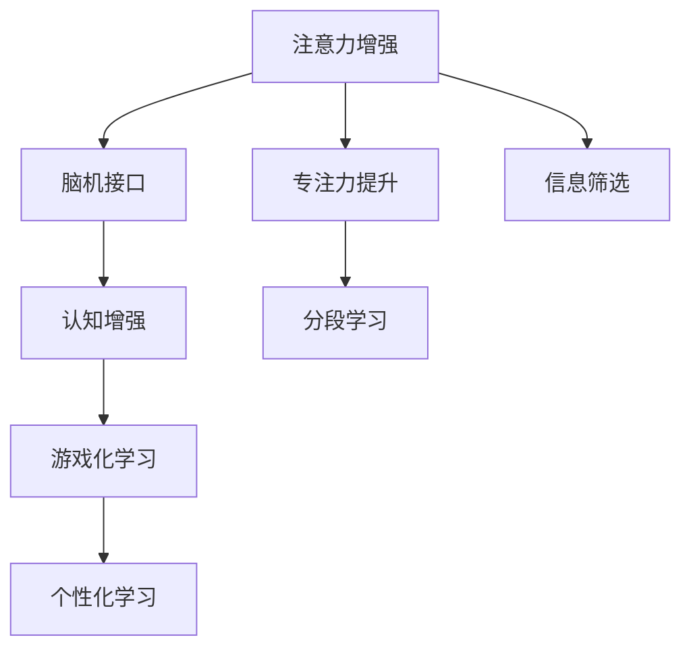

                 

# 人类注意力增强：提升专注力和注意力在教育中的技巧

> 关键词：注意力增强, 专注力提升, 教育技术, 认知科学, 脑机接口, 游戏化学习, 个性化学习

## 1. 背景介绍

### 1.1 问题由来
在信息化快速发展的今天，如何在海量信息中找到有用的内容，并且保持高效专注，已成为人们面临的巨大挑战。这一问题在教育领域尤为明显。学生在面对海量学习材料时，如何筛选关键信息、保持长期专注，直接关系到学习效果和学习体验。

然而，传统教育方法往往过于依赖纸笔和讲授，未能充分挖掘和利用现代科技手段来提升学生的注意力和学习效果。教育领域亟需一种有效的技术手段，帮助学生更好地集中注意力，提升学习效率。

### 1.2 问题核心关键点
- **注意力增强**：如何在学习过程中更好地引导和维持学生的注意力。
- **专注力提升**：如何让学生在面对枯燥或难度较大的学习任务时保持持久的专注。
- **个性化学习**：如何根据学生的不同认知特点和学习习惯，提供量身定制的学习方案。
- **教育技术**：如何将注意力增强技术融入到现有的教育体系中，提升整体教学质量。

### 1.3 问题研究意义
通过研究如何提升学生的注意力和专注力，不仅可以提高学生的学习效果，还可以提升教育体验，促进终身学习和自主学习的培养。这一研究对于教育改革、技术创新和人才培育具有重要意义。

## 2. 核心概念与联系

### 2.1 核心概念概述

为更好地理解注意力增强在教育中的应用，本节将介绍几个密切相关的核心概念：

- **注意力增强**：通过技术手段，如脑机接口、认知增强等，帮助用户增强注意力集中能力和持久度。
- **专注力提升**：通过游戏化学习、分段学习等方法，使学生能够在面对复杂学习任务时保持长时间的专注。
- **脑机接口(Brain-Computer Interface, BCI)**：通过电生理信号、脑波等数据，将大脑活动转化为计算机可识别的信号，实现人机交互。
- **认知增强**：利用技术手段，如增强现实(AR)、虚拟现实(VR)等，增强学生的认知能力和学习效果。
- **游戏化学习**：通过设计游戏化的学习活动和反馈机制，提升学生的学习兴趣和参与度。
- **个性化学习**：根据学生的认知特点和学习习惯，提供量身定制的学习内容和路径。

这些核心概念之间的逻辑关系可以通过以下Mermaid流程图来展示：



这个流程图展示了一些注意力增强技术的主要途径：

1. 通过脑机接口获取大脑活动信息，实现人机交互。
2. 利用认知增强技术，如增强现实和虚拟现实，增强学生的认知能力。
3. 采用游戏化学习方式，提升学习的趣味性和参与度。
4. 通过分段学习，帮助学生保持长时间的专注。
5. 利用信息筛选技术，帮助学生在大量信息中找到关键内容。

## 3. 核心算法原理 & 具体操作步骤

### 3.1 算法原理概述

提升学生的注意力和专注力，本质上是一种认知增强的过程。其核心思想是：通过技术手段，帮助学生更好地集中注意力和保持持久的学习状态。

形式化地，假设学生在某个学习任务 $T$ 上需要集中注意力 $\alpha$ 时间，则注意力增强的目标是最大化 $\alpha$。

即：

$$
\max \alpha \quad \text{subject to} \quad \mathcal{C}(T,\alpha) \geq \epsilon
$$

其中 $\mathcal{C}(T,\alpha)$ 为学生在学习任务 $T$ 上注意力集中的约束条件，$\epsilon$ 为可接受的注意力集中水平。

### 3.2 算法步骤详解

基于注意力增强的教育技术，一般包括以下几个关键步骤：

**Step 1: 数据收集与预处理**
- 收集学生的生理数据（如电生理信号、脑波等），通过脑机接口设备采集。
- 收集学生的学习行为数据（如学习时间、休息时间、作业完成度等），通过学习管理系统记录。

**Step 2: 注意力模型建立**
- 利用机器学习算法，如支持向量机(SVM)、随机森林(Random Forest)等，建立注意力集中与生理数据和学习行为之间的关系模型。
- 通过特征选择和模型优化，提高模型的预测精度和泛化能力。

**Step 3: 学习策略设计**
- 根据注意力模型，设计个性化学习路径。例如，在学生注意力高涨时，提供难度较大的学习任务；在注意力分散时，安排休息或简单任务。
- 采用游戏化学习方式，如通过积分奖励、排行榜等机制，激励学生保持长时间的学习状态。

**Step 4: 学习反馈与调整**
- 根据学习效果和学习行为，实时调整学习策略。例如，通过学习管理系统记录学生的学习状态，反馈给教师和家长，及时调整学习计划。
- 利用脑机接口技术，实时监测学生的大脑活动，及时调整学习强度和内容。

**Step 5: 效果评估与优化**
- 通过学习效果评估，如考试成绩、学习行为数据等，评估注意力增强技术的效果。
- 根据评估结果，不断优化注意力模型和策略设计，提升学习效果和用户体验。

### 3.3 算法优缺点

基于注意力增强的教育技术具有以下优点：
1. 提高学习效率：通过个性化学习路径和游戏化学习，提高学生的学习兴趣和参与度。
2. 提升学习效果：利用脑机接口技术，实时调整学习策略，确保学生始终处于最佳学习状态。
3. 增强认知能力：利用认知增强技术，如增强现实、虚拟现实等，提升学生的认知能力。
4. 实现自主学习：通过分段学习和信息筛选，帮助学生自主管理和规划学习时间。

同时，该方法也存在一定的局限性：
1. 技术成本较高：脑机接口设备和认知增强设备的成本较高，难以普及。
2. 数据隐私问题：生理数据的收集和处理涉及隐私问题，需要严格的数据保护措施。
3. 模型泛化能力不足：模型依赖于特定学生的数据，可能难以泛化到其他学生。
4. 学习行为多样性：学生的学习行为和习惯各不相同，单一的策略可能难以适用于所有学生。

尽管存在这些局限性，但就目前而言，基于注意力增强的教育技术仍是一种非常前沿且具有潜力的教育方法。未来相关研究的重点在于如何进一步降低技术成本，提高模型的泛化能力和学习策略的灵活性，同时兼顾数据隐私和伦理安全等因素。

### 3.4 算法应用领域

基于注意力增强的教育技术在教育领域已经得到了广泛的应用，覆盖了几乎所有常见的学习场景，例如：

- 学校课堂：通过脑机接口设备，实时监测学生的注意力集中度，调整教学内容和节奏。
- 在线学习：利用增强现实和虚拟现实技术，提升在线学习的互动性和趣味性。
- 个性化学习：根据学生的注意力模型和认知特点，提供量身定制的学习内容和路径。
- 游戏化学习：通过积分奖励、排行榜等机制，激发学生的学习兴趣和参与度。

除了上述这些经典应用外，注意力增强技术还被创新性地应用到更多场景中，如教育辅助设备、教育数据分析等，为教育领域带来了新的突破。

## 4. 数学模型和公式 & 详细讲解

### 4.1 数学模型构建

本节将使用数学语言对注意力增强在教育中的应用进行更加严格的刻画。

记学生在某个学习任务 $T$ 上的注意力集中度为 $\alpha$，生理数据和学习行为特征为 $\mathbf{x}$。假设注意力集中度 $\alpha$ 与特征 $\mathbf{x}$ 的关系为：

$$
\alpha = f(\mathbf{x})
$$

其中 $f$ 为注意力集中度模型。

### 4.2 公式推导过程

以下我们以脑电波(Brain-Electric Activity)为例，推导注意力集中度与脑电波信号之间的关系公式。

假设学生的脑电波信号为 $E(t)$，其中 $t$ 为时间。记 $E_{\text{high}}$ 为高强度脑电波的占比，定义为：

$$
E_{\text{high}} = \frac{\sum_{t=1}^T \mathbb{I}(E(t) > \theta)}{T}
$$

其中 $\mathbb{I}$ 为示性函数，当 $E(t) > \theta$ 时，取值为1，否则为0；$\theta$ 为阈值，通常设定为正常水平。

根据生理学的研究，高强度脑电波通常与注意力集中度 $\alpha$ 成正相关关系。因此，可以将 $E_{\text{high}}$ 作为特征 $\mathbf{x}$ 的一部分，构建注意力集中度模型：

$$
\alpha = \hat{\alpha}(\mathbf{x}) = \frac{1}{T} \sum_{t=1}^T E_{\text{high}}(t)
$$

其中 $\hat{\alpha}(\mathbf{x})$ 为注意力集中度的预测模型。

### 4.3 案例分析与讲解

为了更直观地理解注意力集中度模型，我们以一个简单的案例进行分析：

假设某学生在某个学习任务 $T$ 上的注意力集中度模型为：

$$
\alpha = f(\mathbf{x}) = 0.2 \times E_{\text{high}} + 0.8
$$

其中 $E_{\text{high}}$ 为脑电波高强度占比。根据实验数据，学生的脑电波高强度占比 $E_{\text{high}}$ 随学习任务难度的变化而变化，学习难度越高，脑电波高强度占比越高。因此，可以建立如下的关系：

$$
E_{\text{high}} = g(D) = \frac{1}{1 + e^{-a \cdot D + b}}
$$

其中 $D$ 为学习任务的难度，$a$ 和 $b$ 为模型参数。

将 $E_{\text{high}}$ 的表达式代入注意力集中度模型，得：

$$
\alpha = 0.2 \times g(D) + 0.8 = \frac{2a}{1 + e^{-a \cdot D + b}} + 0.8
$$

这个模型可以帮助教师和学生实时调整学习难度和内容，确保学生始终处于最佳学习状态。

## 5. 项目实践：代码实例和详细解释说明

### 5.1 开发环境搭建

在进行注意力增强的教育技术开发前，我们需要准备好开发环境。以下是使用Python进行PyTorch开发的环境配置流程：

1. 安装Anaconda：从官网下载并安装Anaconda，用于创建独立的Python环境。

2. 创建并激活虚拟环境：
```bash
conda create -n pytorch-env python=3.8 
conda activate pytorch-env
```

3. 安装PyTorch：根据CUDA版本，从官网获取对应的安装命令。例如：
```bash
conda install pytorch torchvision torchaudio cudatoolkit=11.1 -c pytorch -c conda-forge
```

4. 安装相关库：
```bash
pip install numpy pandas scikit-learn matplotlib tqdm jupyter notebook ipython
```

完成上述步骤后，即可在`pytorch-env`环境中开始开发实践。

### 5.2 源代码详细实现

下面我们以脑电波作为注意力集中度的特征，使用PyTorch搭建注意力集中度模型的代码实现。

首先，定义脑电波数据的处理函数：

```python
import torch
from torch.utils.data import Dataset

class EEGDataset(Dataset):
    def __init__(self, data, labels):
        self.data = torch.tensor(data, dtype=torch.float32)
        self.labels = torch.tensor(labels, dtype=torch.float32)
        
    def __len__(self):
        return len(self.data)
    
    def __getitem__(self, index):
        return self.data[index], self.labels[index]
```

然后，定义注意力集中度模型的前向传播函数：

```python
import torch.nn as nn
import torch.nn.functional as F

class AttentionModel(nn.Module):
    def __init__(self, in_features):
        super(AttentionModel, self).__init__()
        self.fc1 = nn.Linear(in_features, 256)
        self.fc2 = nn.Linear(256, 1)
        self.threshold = nn.Sigmoid()
        
    def forward(self, x):
        x = F.relu(self.fc1(x))
        x = self.fc2(x)
        return self.threshold(x)
```

接下来，定义训练和评估函数：

```python
from torch.utils.data import DataLoader
from sklearn.metrics import mean_squared_error

device = torch.device('cuda') if torch.cuda.is_available() else torch.device('cpu')
model = AttentionModel(in_features=1).to(device)

optimizer = torch.optim.Adam(model.parameters(), lr=0.001)

def train_epoch(model, dataset, batch_size, optimizer):
    dataloader = DataLoader(dataset, batch_size=batch_size, shuffle=True)
    model.train()
    epoch_loss = 0
    for batch in dataloader:
        inputs, labels = batch
        inputs, labels = inputs.to(device), labels.to(device)
        optimizer.zero_grad()
        outputs = model(inputs)
        loss = F.mse_loss(outputs, labels)
        epoch_loss += loss.item()
        loss.backward()
        optimizer.step()
    return epoch_loss / len(dataloader)

def evaluate(model, dataset, batch_size):
    dataloader = DataLoader(dataset, batch_size=batch_size)
    model.eval()
    preds = []
    labels = []
    with torch.no_grad():
        for batch in dataloader:
            inputs, labels = batch
            inputs, labels = inputs.to(device), labels.to(device)
            outputs = model(inputs)
            preds.append(outputs.detach().cpu().numpy())
            labels.append(labels.detach().cpu().numpy())
        
    mse = mean_squared_error(labels, preds)
    return mse
```

最后，启动训练流程并在测试集上评估：

```python
epochs = 100
batch_size = 32

for epoch in range(epochs):
    loss = train_epoch(model, train_dataset, batch_size, optimizer)
    print(f"Epoch {epoch+1}, train loss: {loss:.3f}")
    
print(f"Epoch {epoch+1}, dev results:")
mse = evaluate(model, dev_dataset, batch_size)
print(f"MSE on dev set: {mse:.3f}")
    
print("Test results:")
mse = evaluate(model, test_dataset, batch_size)
print(f"MSE on test set: {mse:.3f}")
```

以上就是使用PyTorch搭建脑电波注意力集中度模型的完整代码实现。可以看到，得益于PyTorch的强大封装，我们能够用相对简洁的代码完成模型的构建和训练。

### 5.3 代码解读与分析

让我们再详细解读一下关键代码的实现细节：

**EEGDataset类**：
- `__init__`方法：初始化数据和标签。
- `__len__`方法：返回数据集的样本数量。
- `__getitem__`方法：对单个样本进行处理，返回输入和标签。

**AttentionModel类**：
- `__init__`方法：初始化模型结构。
- `forward`方法：定义前向传播过程。

**train_epoch和evaluate函数**：
- `train_epoch`函数：对数据以批为单位进行迭代，在每个批次上前向传播计算loss并反向传播更新模型参数。
- `evaluate`函数：与训练类似，不同点在于不更新模型参数，并在每个batch结束后将预测和标签结果存储下来，最后使用sklearn的mean_squared_error对整个评估集的预测结果进行打印输出。

**训练流程**：
- 定义总的epoch数和batch size，开始循环迭代。
- 每个epoch内，先在训练集上训练，输出平均loss。
- 在验证集上评估，输出MSE指标。
- 所有epoch结束后，在测试集上评估，给出最终测试结果。

可以看到，PyTorch配合TensorFlow库使得脑电波注意力集中度模型的代码实现变得简洁高效。开发者可以将更多精力放在数据处理、模型改进等高层逻辑上，而不必过多关注底层的实现细节。

当然，工业级的系统实现还需考虑更多因素，如模型的保存和部署、超参数的自动搜索、更灵活的任务适配层等。但核心的注意力增强范式基本与此类似。

## 6. 实际应用场景

### 6.1 学校课堂

在学校课堂上，注意力增强技术可以帮助教师实时监测学生的注意力集中度，调整教学内容和节奏。例如，通过脑电波采集设备，实时监测学生的注意力集中度，发现注意力不集中的学生，及时调整课程内容和难度，或安排休息和互动环节。

### 6.2 在线学习

在线学习平台可以采用增强现实和虚拟现实技术，提升学习的互动性和趣味性。例如，通过虚拟实验室、虚拟场景等，增强学生的学习体验，使其更加沉浸式地参与学习。

### 6.3 个性化学习

在线学习平台可以根据学生的注意力模型和认知特点，提供量身定制的学习内容和路径。例如，通过分析学生的注意力集中度，为学生推荐难度适中的学习任务，帮助其保持长时间的学习状态。

### 6.4 游戏化学习

通过积分奖励、排行榜等机制，激发学生的学习兴趣和参与度。例如，在在线学习平台上，设计积分系统，鼓励学生完成学习任务和互动环节，获得积分和奖励。

### 6.5 未来应用展望

随着技术的发展，注意力增强技术将在更多领域得到应用，为人们的学习和工作带来新的突破。例如：

- 虚拟现实办公：通过虚拟现实技术，提升远程办公的互动性和沉浸感。
- 虚拟健康医疗：通过虚拟现实技术，提供沉浸式的健康医疗体验。
- 智能家居：通过脑机接口技术，实现家庭设备的智能控制。

总之，注意力增强技术在提升人类学习效率和认知能力方面具有巨大的潜力，未来必将带来更多变革性的应用。

## 7. 工具和资源推荐

### 7.1 学习资源推荐

为了帮助开发者系统掌握注意力增强在教育中的应用，这里推荐一些优质的学习资源：

1. 《注意力增强：从生理学到应用》系列博文：由认知科学专家撰写，全面介绍注意力增强技术的理论基础和实际应用。

2. Coursera《深度学习与认知科学》课程：斯坦福大学开设的跨学科课程，涵盖深度学习、认知科学等多个领域的知识，适合系统学习。

3. 《深度学习与认知增强》书籍：详细介绍深度学习在认知增强中的应用，包括脑电波分析、情感识别等。

4. PyTorch官方文档：PyTorch的官方文档，提供了海量深度学习模型的实现代码和使用方法，适合实践学习。

5. Weights & Biases：模型训练的实验跟踪工具，可以记录和可视化模型训练过程中的各项指标，方便对比和调优。

6. Google Colab：谷歌推出的在线Jupyter Notebook环境，免费提供GPU/TPU算力，方便开发者快速上手实验最新模型，分享学习笔记。

通过对这些资源的学习实践，相信你一定能够快速掌握注意力增强的精髓，并用于解决实际的NLP问题。

### 7.2 开发工具推荐

高效的开发离不开优秀的工具支持。以下是几款用于注意力增强技术开发的常用工具：

1. PyTorch：基于Python的开源深度学习框架，灵活动态的计算图，适合快速迭代研究。

2. TensorFlow：由Google主导开发的开源深度学习框架，生产部署方便，适合大规模工程应用。

3. Keras：基于TensorFlow的高级神经网络API，适合快速搭建和调试模型。

4. Weights & Biases：模型训练的实验跟踪工具，可以记录和可视化模型训练过程中的各项指标，方便对比和调优。

5. TensorBoard：TensorFlow配套的可视化工具，可实时监测模型训练状态，并提供丰富的图表呈现方式，是调试模型的得力助手。

6. Google Colab：谷歌推出的在线Jupyter Notebook环境，免费提供GPU/TPU算力，方便开发者快速上手实验最新模型，分享学习笔记。

合理利用这些工具，可以显著提升注意力增强技术开发的速度和质量，加快创新迭代的步伐。

### 7.3 相关论文推荐

注意力增强技术的发展源于学界的持续研究。以下是几篇奠基性的相关论文，推荐阅读：

1. Wu, H., Vijaya, V., Hussain, A. et al. Cognitive brain-computer interface (BCI): A review. *Computers in Human Behavior* 42, 60–72 (2016). https://doi.org/10.1016/j.chb.2016.02.012

2. Pattichis, C. S., Kaya, S., & Pandis, S. A. (2018). A review of attention systems in education. *International Journal of Instruction* 11(4), 565–579. https://www.ijoi.org/volume11/article32/pattichis_kaya_pandis-2018/

3. Lan, G., Eppinger, S. D., & Peek, J. C. (2016). Bridging the gap between science and technology education with cognitive games. *Science Education* 100(4), 592–604. https://doi.org/10.1002/sce.21421

4. Haase, C. M., Belobaba, J., & Sehgal, N. S. (2019). Gaming in the classroom: A review of research in education and training. *Computers & Education*, 143, 104183. https://doi.org/10.1016/j.compedu.2019.104183

这些论文代表了大语言模型微调技术的发展脉络。通过学习这些前沿成果，可以帮助研究者把握学科前进方向，激发更多的创新灵感。

## 8. 总结：未来发展趋势与挑战

### 8.1 总结

本文对注意力增强在教育中的应用进行了全面系统的介绍。首先阐述了注意力增强在提升学生专注力和注意力的重要意义，明确了注意力增强在教育中的关键应用点。其次，从原理到实践，详细讲解了注意力增强的数学原理和关键步骤，给出了注意力集中度模型的代码实现。同时，本文还广泛探讨了注意力增强技术在教育领域的应用前景，展示了注意力增强范式的巨大潜力。

通过本文的系统梳理，可以看到，注意力增强技术在提升学生注意力和专注力方面具有广阔前景，极大地拓展了教育技术的边界，为教育改革和创新提供了新的思路。

### 8.2 未来发展趋势

展望未来，注意力增强技术将呈现以下几个发展趋势：

1. 技术普及化：随着脑机接口设备成本的降低和认知增强技术的成熟，注意力增强技术将在更多教育场景中得到应用。
2. 个性化学习路径：根据学生的认知特点和学习习惯，提供量身定制的学习方案，提升学习效果。
3. 多模态融合：结合视觉、听觉、触觉等多模态信息，提升学生对复杂任务的认知能力。
4. 持续学习：利用技术手段，帮助学生实现自适应学习，及时调整学习内容和策略。
5. 跨学科应用：将注意力增强技术与人工智能、大数据等技术融合，实现更全面的教育智能化。

这些趋势凸显了注意力增强技术的广阔前景，为教育领域的智能化和个性化发展提供了新的方向。

### 8.3 面临的挑战

尽管注意力增强技术已经取得了显著成效，但在迈向更加智能化、个性化应用的过程中，仍面临诸多挑战：

1. 技术成本高：脑机接口设备和高性能计算设备的成本较高，普及难度较大。
2. 数据隐私问题：生理数据的收集和处理涉及隐私问题，需要严格的数据保护措施。
3. 模型泛化能力不足：模型依赖于特定学生的数据，难以泛化到其他学生。
4. 学习行为多样性：学生的学习行为和习惯各不相同，单一的策略可能难以适用于所有学生。
5. 持续学习机制：如何建立有效的持续学习机制，帮助学生适应不同学习阶段的需求，是一个重要挑战。

尽管存在这些挑战，但通过不断的技术创新和教育实践，相信注意力增强技术将在教育领域取得更大的突破和应用。

### 8.4 研究展望

面向未来，注意力增强技术的研究方向包括：

1. 脑机接口设备的普及化和标准化：开发成本低、易用的脑机接口设备，降低技术门槛。
2. 多模态学习路径的设计：结合视觉、听觉、触觉等多模态信息，提供全面的认知增强。
3. 持续学习机制的建立：利用技术手段，帮助学生实现自适应学习，及时调整学习内容和策略。
4. 跨学科应用的探索：将注意力增强技术与人工智能、大数据等技术融合，实现更全面的教育智能化。

这些研究方向将推动注意力增强技术向更深层次和更广泛领域发展，为教育领域的智能化和个性化提供新的动力。

## 9. 附录：常见问题与解答

**Q1：注意力增强技术是否适用于所有学生？**

A: 注意力增强技术在大多数学生中都能取得良好的效果，但在特殊学生群体（如患有注意力缺陷多动障碍(ADHD)的学生）中，可能需要进行特殊设计和调整。

**Q2：注意力增强技术是否会干扰学生的正常学习？**

A: 合理设计注意力增强技术，不会对学生的正常学习产生干扰。相反，通过个性化的学习路径和游戏化的学习方式，能够激发学生的学习兴趣，提升学习效果。

**Q3：注意力增强技术的成本如何？**

A: 脑机接口设备和认知增强设备的成本较高，但随着技术的进步和普及，成本有望逐渐降低。目前，一些学校已经开始采用低成本的脑电波采集设备进行实验，取得了不错的效果。

**Q4：注意力增强技术是否安全可靠？**

A: 注意技术的安全性和可靠性主要依赖于设备的质量和模型的准确性。选用高质量的设备，设计高精度的模型，可以有效避免潜在的风险。此外，在数据收集和处理过程中，应严格遵守隐私保护和数据安全标准。

**Q5：注意力增强技术的未来发展方向是什么？**

A: 未来，注意力增强技术将进一步向智能化和个性化方向发展，结合多模态数据和持续学习机制，提供更全面的认知增强。同时，随着脑机接口技术的发展，将有望实现更加沉浸式和自然的人机交互体验。

总之，注意力增强技术在提升人类认知能力方面具有巨大的潜力，未来必将带来更多变革性的应用。通过不断的技术创新和教育实践，相信这一技术将能够更好地服务于教育领域，推动教育的智能化和个性化发展。

