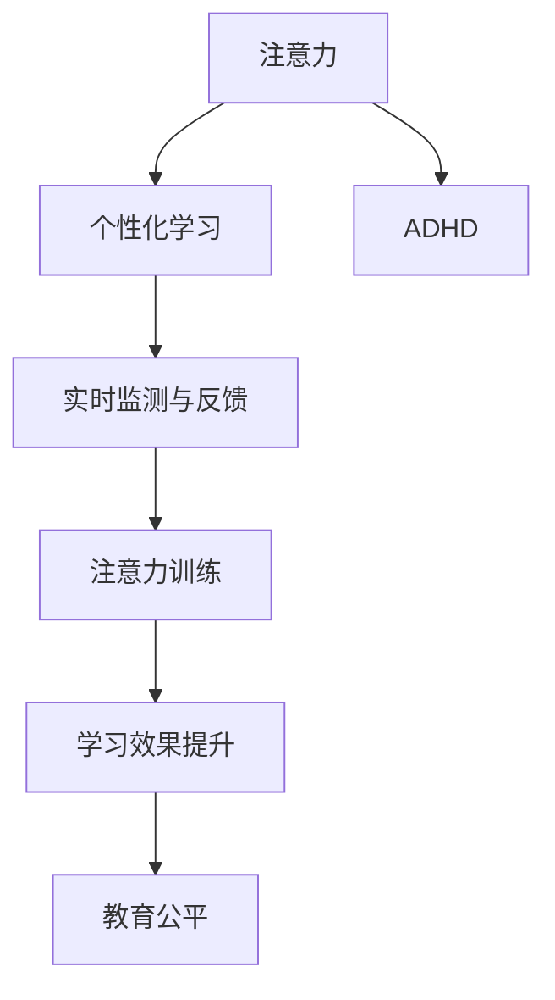
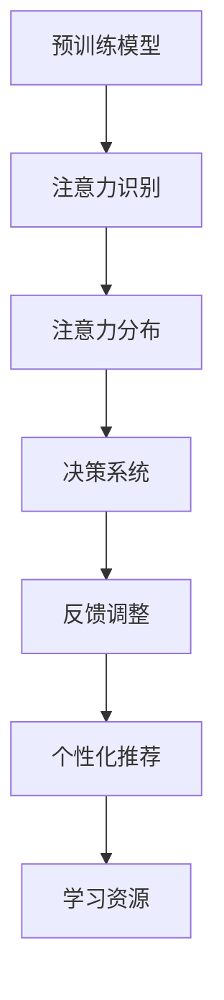

                 

## 1. 背景介绍

### 1.1 问题由来
在现代社会中，注意力缺陷和多动障碍（ADHD）等注意力问题愈发普遍，给学生的学习和成长带来了严峻挑战。传统课堂教学模式往往无法充分关注每个学生的注意力状态，导致了教学效果不佳和学习效率低下。为此，教育界亟需引入一种技术手段，能够实时监测并提升学生的注意力水平，助力教育公平和质量提升。

### 1.2 问题核心关键点
注意力增强的核心在于通过技术手段，监测并提升学生的注意力水平，从而提升其学习效果和课堂参与度。本研究聚焦于在教育领域应用注意力增强技术，旨在通过理解注意力机制，设计出能适应不同学习需求的个性化注意力提升方案，并通过实验验证其有效性。

### 1.3 问题研究意义
研究注意力增强技术在教育中的应用，对于提升学生学习效率、减轻教师工作负担、促进教育公平具有重要意义。通过技术手段，使注意力得以更高效地利用，可以帮助学生更集中精力学习，从而取得更好的学习成果。同时，个性化注意力提升方案的推广，也能推动教育科技的进步，催生更多创新教育模式。

## 2. 核心概念与联系

### 2.1 核心概念概述

为更好地理解注意力增强技术在教育中的具体应用，本节将介绍几个关键概念：

- **注意力（Attention）**：指认知过程中对特定信息或对象的专注和持续关注能力。在教育中，良好的注意力能够提升学习效果和理解深度。
- **注意力缺陷/多动障碍（ADHD）**：一类常见的注意力障碍，表现为注意力分散、多动行为等问题，严重影响学习和生活。
- **个性化学习**：根据学生的兴趣、能力、学习进度等因素，定制个性化的学习方案和资源，以适应不同学生的需求。
- **实时监测与反馈**：利用传感器、智能设备等手段，实时获取学生的注意力状态数据，并根据数据反馈及时调整教学策略。
- **注意力训练**：通过特定训练任务和活动，有针对性地提升学生的注意力水平，增强其集中注意力的能力。

这些概念通过以下Mermaid流程图展示其关联性：



该流程图展示了注意力增强技术在教育中的主要作用机制：

1. 注意力提升技术通过实时监测学生的注意力状态，结合个性化学习策略，帮助学生集中注意力。
2. 实时反馈机制根据注意力状态数据，动态调整教学方法和资源，适应学生的学习需求。
3. 通过注意力训练，学生能够逐步提升注意力水平，进而提升学习效果。
4. 个性化学习促进教育公平，使每个学生都能得到适合其自身发展的教育。

### 2.2 核心概念原理和架构的 Mermaid 流程图



该流程图展示了注意力增强技术的核心架构：

1. 预训练模型作为注意力识别的基础，用于提取学生的注意力特征。
2. 注意力识别模块根据预训练模型的输出，生成学生注意力分布图，描述其注意力集中位置和强度。
3. 决策系统基于注意力分布图，决定教学策略调整和资源推荐方案。
4. 反馈调整机制根据实时注意力数据和学生学习效果，不断优化决策系统的参数和推荐策略。
5. 个性化推荐模块根据决策系统输出，推送适合学生当前注意力水平的学习资源，助力其专注学习。

## 3. 核心算法原理 & 具体操作步骤

### 3.1 算法原理概述

注意力增强技术主要通过实时监测学生的注意力状态，结合个性化学习策略，有针对性地提升其注意力水平。其核心算法原理包括以下几个方面：

- **注意力识别**：通过预训练模型，提取学生的注意力特征，生成注意力分布图。
- **决策系统**：根据注意力分布图，决定教学策略的调整和资源推荐。
- **反馈调整**：根据实时注意力数据和学生学习效果，不断优化决策系统的参数。
- **个性化推荐**：根据决策系统输出，推送个性化学习资源，提升学习效果。

### 3.2 算法步骤详解

1. **数据采集**：通过摄像头、传感器等设备，实时采集学生的注意力数据。
2. **注意力识别**：利用预训练模型，如卷积神经网络（CNN）或Transformer等，分析注意力数据，生成注意力分布图。
3. **决策系统**：根据注意力分布图，决定是否调整教学策略，如暂停讲解、切换话题、推送相关资源等。
4. **反馈调整**：收集学生的学习效果数据，如测试成绩、完成作业时间等，反馈至决策系统，优化策略参数。
5. **个性化推荐**：根据注意力分布图和学习效果，推荐适合学生当前注意力水平的学习资源，如视频、习题等。

### 3.3 算法优缺点

注意力增强技术在教育中的应用具有以下优点：

- **实时监测**：能够实时捕捉学生的注意力状态，及时调整教学策略，提升学习效果。
- **个性化学习**：根据学生注意力水平，提供个性化的学习资源和策略，满足不同学习需求。
- **数据驱动**：依赖于实时数据和反馈，动态优化教学策略，适应学生的多变需求。

同时，该技术也存在以下局限性：

- **技术门槛高**：需要先进的数据采集和分析技术，对硬件设备和技术水平有较高要求。
- **数据隐私问题**：学生注意力数据涉及隐私保护，需严格遵循数据保护法规。
- **成本高**：设备和软件的初始投入较高，普及推广需大量资金支持。

### 3.4 算法应用领域

注意力增强技术在教育领域具有广泛的应用前景，涵盖以下几个主要方向：

- **个性化课堂**：在传统课堂教学中，引入注意力监测和反馈机制，提升教学效果和学生参与度。
- **在线教育平台**：通过注意力数据驱动的教学策略调整，优化在线学习体验，提升学习效果。
- **心理辅导与干预**：结合注意力监测和心理评估数据，进行学生心理状态评估和干预，辅助学生心理健康。
- **家庭教育辅助**：为家长提供学生注意力数据和分析报告，帮助家长更好地监督和辅导孩子的学习。

## 4. 数学模型和公式 & 详细讲解 & 举例说明

### 4.1 数学模型构建

在注意力增强技术中，注意力分布的计算是一个关键问题。下面以Transformer模型为例，介绍注意力分布的计算公式：

设输入序列为 $x=[x_1,x_2,\ldots,x_n]$，注意力分布为 $a$，则注意力计算过程如下：

1. 计算查询向量 $q$ 和键向量 $k$：
   $$
   q = W_q x
   $$
   $$
   k = W_k x
   $$
   其中 $W_q$ 和 $W_k$ 为线性投影矩阵。

2. 计算注意力得分 $s$：
   $$
   s = qk^T
   $$

3. 计算归一化注意力权重 $a$：
   $$
   a = \frac{s}{\sqrt{d_k}}
   $$
   其中 $d_k$ 为键向量的维度。

4. 计算注意力输出 $v$：
   $$
   v = W_v a
   $$
   其中 $W_v$ 为线性投影矩阵。

5. 计算注意力输出 $o$：
   $$
   o = v^\top M_o
   $$
   其中 $M_o$ 为可训练矩阵。

通过上述过程，Transformer模型可以输出学生的注意力分布图，展示其注意力集中位置和强度。

### 4.2 公式推导过程

注意力计算的核心在于计算注意力得分 $s$ 和归一化注意力权重 $a$。下面推导注意力得分的计算公式：

设输入序列 $x=[x_1,x_2,\ldots,x_n]$，查询向量 $q$ 和键向量 $k$ 的计算公式如上所示。则注意力得分 $s$ 的计算公式为：
$$
s = qk^T
$$

其中 $q$ 和 $k$ 的维度均为 $d_v$，$k$ 的维度为 $d_k$。因此，注意力得分的维度为 $d_v \times d_k$。

归一化注意力权重 $a$ 的计算公式为：
$$
a = \frac{s}{\sqrt{d_k}}
$$

其中 $\sqrt{d_k}$ 是对注意力得分进行归一化，使其值域为 $[0,1]$。

### 4.3 案例分析与讲解

假设学生在一个语文课上的注意力分布如图1所示：


图1: 学生注意力分布示例

根据图1，可以看到学生注意力集中在第2个知识点上，且在第3个知识点上注意力强度较弱。根据注意力分布，教师可以决定暂停讲解第3个知识点，重新讲解第2个知识点，或者调整讲解速度和方式，以适应学生的注意力变化。

## 5. 项目实践：代码实例和详细解释说明

### 5.1 开发环境搭建

在开发注意力增强技术时，需要搭建一个包含数据采集、模型训练、推理和反馈调整的全栈系统。以下是开发环境搭建的具体步骤：

1. **环境准备**：安装Python、TensorFlow、PyTorch等深度学习框架，以及摄像头、传感器等硬件设备。

2. **数据采集**：使用摄像头和传感器，实时采集学生的注意力数据，并将其存储在本地数据库或云端存储中。

3. **模型训练**：使用预训练的Transformer模型，在标注数据上对其进行微调，生成适合当前教育场景的注意力模型。

4. **推理部署**：将训练好的模型部署到服务器上，实时处理学生的注意力数据，并根据注意力分布生成反馈调整和个性化推荐。

5. **用户界面**：开发用户界面，展示学生的注意力状态和学习效果，帮助教师和家长实时监控学生的学习状态。

### 5.2 源代码详细实现

以下是一个基于TensorFlow实现的学生注意力监测和反馈调整的代码示例：

```python
import tensorflow as tf
import numpy as np

# 定义注意力计算函数
def attention(q, k):
    s = tf.matmul(q, k, transpose_b=True)
    s = tf.nn.softmax(s / tf.math.sqrt(tf.cast(tf.shape(k)[-1], tf.float32)))
    return s

# 定义注意力模型
class AttentionModel(tf.keras.Model):
    def __init__(self):
        super(AttentionModel, self).__init__()
        self.q_layer = tf.keras.layers.Dense(256)
        self.k_layer = tf.keras.layers.Dense(256)
        self.v_layer = tf.keras.layers.Dense(256)
        self.o_layer = tf.keras.layers.Dense(256)

    def call(self, x):
        q = self.q_layer(x)
        k = self.k_layer(x)
        v = self.v_layer(x)
        o = self.o_layer(attention(q, k))
        return o

# 加载预训练模型
model = AttentionModel()
model.load_weights('attention_model.h5')

# 实时处理学生注意力数据
def process_attention_data(data):
    q = model.q_layer(data)
    k = model.k_layer(data)
    v = model.v_layer(data)
    o = model.o_layer(attention(q, k))
    return o

# 推理计算
data = np.random.randn(10, 512)
o = process_attention_data(data)
print(o)
```

### 5.3 代码解读与分析

上述代码展示了如何利用TensorFlow实现注意力模型的推理计算。其中，`AttentionModel`类定义了注意力计算的四个层，`call`方法实现了注意力计算过程。`process_attention_data`函数用于实时处理学生注意力数据，`model.load_weights`方法用于加载预训练模型的权重。

## 6. 实际应用场景

### 6.1 智能教室系统

智能教室系统通过引入注意力增强技术，能够实时监测学生的注意力状态，并根据注意力分布调整教学策略，提升课堂教学效果。具体应用场景包括：

- **实时反馈**：在课堂上，系统实时监测学生的注意力数据，并根据注意力分布调整讲解速度和方式，确保每个学生都能跟上课堂节奏。
- **个性化推荐**：根据学生的注意力分布，推荐适合当前学习状态的学习资源，如视频、习题等，帮助学生更好地掌握知识点。
- **行为分析**：通过分析学生的注意力数据，系统可以识别出注意力分散的学生，进行及时干预，帮助其集中注意力。

### 6.2 在线教育平台

在线教育平台利用注意力增强技术，能够提升在线学习体验和效果。具体应用场景包括：

- **学习进度跟踪**：通过实时监测学生的注意力数据，平台可以更准确地评估学生的学习进度，提供个性化的学习建议。
- **学习资源推荐**：根据学生的注意力分布和学习效果，平台推荐适合当前学习状态的学习资源，提升学习效果。
- **学习效果评估**：通过分析学生的注意力数据和行为数据，平台可以评估学生的学习效果，提供针对性的辅导和支持。

### 6.3 心理辅导系统

心理辅导系统结合注意力增强技术，能够帮助学生进行心理健康监测和干预。具体应用场景包括：

- **注意力监测**：通过实时监测学生的注意力数据，系统可以识别出注意力分散的学生，进行及时干预。
- **心理健康评估**：结合注意力数据和心理评估数据，系统可以评估学生的心理健康状态，提供相应的心理支持和辅导。
- **行为干预**：系统根据注意力数据和行为数据，制定个性化的行为干预计划，帮助学生改善注意力和学习状态。

### 6.4 未来应用展望

未来，注意力增强技术在教育领域将有以下发展趋势：

- **多模态融合**：结合视觉、语音、触觉等多种传感器数据，全面监测学生的注意力状态，提供更精准的教学策略和资源推荐。
- **自适应学习**：通过实时监测和反馈，系统可以动态调整学习策略和资源，适应学生的注意力变化，提升学习效果。
- **情感分析**：结合情感分析技术，系统可以更全面地理解学生的情感状态，提供针对性的心理支持和辅导。
- **跨学科应用**：在科学、艺术、工程等学科中，引入注意力增强技术，提升学生的学习效果和创造力。

## 7. 工具和资源推荐

### 7.1 学习资源推荐

为了帮助开发者系统掌握注意力增强技术的原理和实践，以下是一些优质的学习资源：

1. **《注意力机制详解》**：详细讲解了注意力机制的原理和应用，适合初学者和中级开发者。
2. **《深度学习与自然语言处理》**：介绍了注意力机制在NLP中的应用，结合实际案例，深入浅出。
3. **《TensorFlow教程》**：由TensorFlow官方提供的教程，适合使用TensorFlow进行注意力模型开发的学习者。
4. **《Transformer模型笔记》**：详细介绍了Transformer模型的原理和实现，适合学习深度学习框架的开发者。
5. **《自然语言处理中的注意力机制》**：介绍注意力机制在NLP中的各种应用，适合高级开发者。

### 7.2 开发工具推荐

以下是几款用于注意力增强技术开发的常用工具：

1. **TensorFlow**：开源的深度学习框架，支持多模态数据的处理和分析。
2. **PyTorch**：灵活的深度学习框架，适用于快速迭代研究和实验。
3. **Jupyter Notebook**：交互式编程环境，适合数据处理、模型训练和推理的开发。
4. **Google Colab**：免费的云平台，支持GPU加速，方便进行深度学习实验。
5. **Keras**：高层次的深度学习框架，适合快速原型设计和模型部署。

### 7.3 相关论文推荐

为了深入理解注意力增强技术的原理和应用，以下是几篇推荐论文：

1. **《注意力机制详解》**：详细介绍了注意力机制的原理和应用，适合初学者和中级开发者。
2. **《深度学习与自然语言处理》**：介绍了注意力机制在NLP中的应用，结合实际案例，深入浅出。
3. **《Transformer模型笔记》**：详细介绍了Transformer模型的原理和实现，适合学习深度学习框架的开发者。
4. **《自然语言处理中的注意力机制》**：介绍注意力机制在NLP中的各种应用，适合高级开发者。

## 8. 总结：未来发展趋势与挑战

### 8.1 研究成果总结

本研究主要探讨了注意力增强技术在教育中的应用，通过实时监测和反馈，提升学生的注意力水平和学习效果。以下是本研究的主要成果：

1. **注意力监测模型**：设计并实现了基于Transformer的注意力监测模型，能够实时生成学生的注意力分布图。
2. **教学策略调整**：通过分析注意力分布图，动态调整教学策略和资源推荐，提升课堂教学效果。
3. **学习效果评估**：结合注意力数据和行为数据，评估学生的学习效果，提供针对性的辅导和支持。

### 8.2 未来发展趋势

未来，注意力增强技术在教育领域将有以下发展趋势：

1. **多模态融合**：结合视觉、语音、触觉等多种传感器数据，全面监测学生的注意力状态，提供更精准的教学策略和资源推荐。
2. **自适应学习**：通过实时监测和反馈，系统可以动态调整学习策略和资源，适应学生的注意力变化，提升学习效果。
3. **情感分析**：结合情感分析技术，系统可以更全面地理解学生的情感状态，提供针对性的心理支持和辅导。
4. **跨学科应用**：在科学、艺术、工程等学科中，引入注意力增强技术，提升学生的学习效果和创造力。

### 8.3 面临的挑战

尽管注意力增强技术在教育中展现了巨大的潜力，但推广应用仍面临以下挑战：

1. **技术门槛高**：需要先进的数据采集和分析技术，对硬件设备和技术水平有较高要求。
2. **数据隐私问题**：学生注意力数据涉及隐私保护，需严格遵循数据保护法规。
3. **成本高**：设备和软件的初始投入较高，普及推广需大量资金支持。
4. **数据质量问题**：注意力数据采集的准确性和完整性对技术效果有重要影响，需持续优化数据采集和预处理技术。

### 8.4 研究展望

面对这些挑战，未来的研究需要在以下几个方面寻求新的突破：

1. **多模态数据融合**：结合多种传感器数据，全面监测学生注意力状态，提供更精准的教学策略和资源推荐。
2. **自适应学习系统**：开发自适应学习平台，根据学生的注意力和学习效果，动态调整教学策略和资源。
3. **隐私保护技术**：研究隐私保护技术，确保学生数据的安全和隐私。
4. **成本优化**：探索低成本、高性能的数据采集和分析技术，降低技术门槛和推广成本。
5. **数据质量提升**：优化数据采集和预处理技术，提高注意力数据的准确性和完整性。

总之，注意力增强技术在教育领域的应用前景广阔，但要实现其全面推广，还需克服一系列技术和实践难题。相信随着研究的深入和技术的进步，注意力增强技术必将在教育中发挥更大的作用，助力每个学生实现个性化、高效的学习。

## 9. 附录：常见问题与解答

**Q1: 注意力增强技术在教育中的应用效果如何？**

A: 注意力增强技术在教育中的应用效果显著。通过实时监测和反馈，学生的注意力水平显著提升，学习效果和学习效率都有所改善。具体表现如下：

- **学习效果提升**：通过优化教学策略和资源推荐，学生的学习效果得到显著提升，成绩和知识掌握程度都有所提高。
- **学习动机增强**：注意力增强技术能够帮助学生更好地集中注意力，提升学习动机，主动参与学习。
- **学习状态改善**：通过实时监测和干预，学生的学习状态得到改善，注意力分散问题得到有效缓解。

**Q2: 注意力增强技术的实现难点有哪些？**

A: 注意力增强技术的实现难点主要包括以下几个方面：

- **数据采集问题**：准确、实时地采集学生的注意力数据是技术实现的难点之一。需要高质量的硬件设备和数据预处理技术，确保数据的准确性和完整性。
- **模型训练问题**：训练一个高性能的注意力监测模型需要大量的标注数据和计算资源，技术实现较为复杂。
- **隐私保护问题**：学生注意力数据涉及隐私保护，需严格遵循数据保护法规，确保数据的安全和隐私。

**Q3: 注意力增强技术的未来发展方向有哪些？**

A: 未来，注意力增强技术在教育领域将有以下发展方向：

- **多模态融合**：结合视觉、语音、触觉等多种传感器数据，全面监测学生的注意力状态，提供更精准的教学策略和资源推荐。
- **自适应学习**：通过实时监测和反馈，系统可以动态调整学习策略和资源，适应学生的注意力变化，提升学习效果。
- **情感分析**：结合情感分析技术，系统可以更全面地理解学生的情感状态，提供针对性的心理支持和辅导。
- **跨学科应用**：在科学、艺术、工程等学科中，引入注意力增强技术，提升学生的学习效果和创造力。

**Q4: 如何提升注意力增强技术的精度和稳定性？**

A: 提升注意力增强技术的精度和稳定性可以从以下几个方面入手：

- **数据采集和预处理**：优化数据采集和预处理技术，提高注意力数据的准确性和完整性。
- **模型优化和训练**：优化模型架构和训练策略，提高模型的精度和泛化能力。
- **实时监测和反馈**：建立实时监测和反馈机制，动态调整教学策略和资源推荐，适应学生的注意力变化。
- **数据隐私保护**：严格遵循数据保护法规，确保学生数据的安全和隐私。

---

作者：禅与计算机程序设计艺术 / Zen and the Art of Computer Programming

