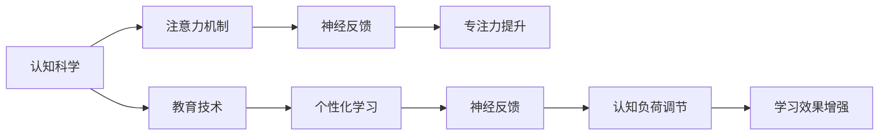
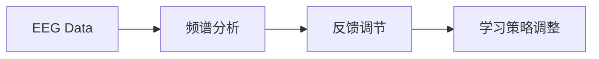

                 

# 人类注意力增强：提升专注力和注意力在教育中的未来趋势

> 关键词：人类注意力增强,专注力提升,教育技术,认知科学,神经反馈,未来趋势

## 1. 背景介绍

### 1.1 问题由来
在数字化时代，信息的爆炸性增长给人们的学习和工作带来了巨大的压力。如何高效地从海量的信息中筛选、整合、应用，成为当今社会亟需解决的问题。特别是在教育领域，面对越来越多元化的学习资源和个性化需求，如何提升学生的学习效率和专注力，培养他们终身学习的习惯，是教育技术发展的核心目标。

### 1.2 问题核心关键点
针对注意力不足和学习效率低下的问题，本文将深入探讨基于技术手段提升学生专注力和注意力的方法，特别是认知科学、神经反馈和教育技术的结合，以及未来这些技术在教育中的应用趋势。

## 2. 核心概念与联系

### 2.1 核心概念概述

在探讨提升学生专注力和注意力的方法之前，首先需要明确几个核心概念：

- **专注力**：指个体在处理特定任务时，能够持续关注并投入精力的能力。
- **注意力**：指个体筛选、维持并专注于特定信息的能力。
- **认知科学**：研究人类思维和认知过程的学科，涉及记忆、学习、决策等方面。
- **神经反馈(Neurofeedback)**：通过实时监测大脑活动，提供反馈信息，帮助用户调整注意力和情绪状态。
- **教育技术**：利用信息技术手段，优化学习过程，提高教育效果的技术。

这些概念共同构成了提升专注力和注意力的技术基础。通过认知科学的研究，揭示注意力和专注力的内在机制，再结合神经反馈和教育技术，能够实现对注意力和专注力的量化监测、实时干预和个性化提升。

### 2.2 核心概念原理和架构的 Mermaid 流程图



这个流程图展示了从认知科学原理出发，通过神经反馈技术调整注意力和专注力，最终达到提升学习效果和个性化学习的目的。教育技术在其中扮演了桥梁角色，实现了神经反馈与认知负荷调节的结合。

## 3. 核心算法原理 & 具体操作步骤

### 3.1 算法原理概述

基于认知科学和神经反馈的注意力增强方法，核心思想是通过量化和实时监测大脑活动，提供反馈信息，帮助用户调整注意力和情绪状态，从而提升学习效率。具体来说，包括以下几个关键步骤：

1. **数据采集**：通过脑电图(EEG)、功能性磁共振成像(fMRI)、脑磁图(MEG)等技术，采集用户的学习过程中的大脑活动数据。
2. **信号处理**：将采集到的数据进行处理，提取与注意力和专注力相关的特征。
3. **反馈调节**：根据提取的特征，提供实时的神经反馈，帮助用户调整注意力状态。
4. **学习优化**：根据神经反馈信息，优化学习策略，提升学习效果。

### 3.2 算法步骤详解

#### 3.2.1 数据采集
脑电图(EEG)是最常用的注意力监测手段，可以通过便携式设备方便地采集用户的大脑活动数据。使用电极帽采集头皮上的电信号，通过放大和滤波等预处理步骤，得到时间序列的脑电信号。

```python
import pyEEG
from pyEEG import EEGData

# 创建一个EEG设备对象
device = EEGData()

# 开始数据采集
device.start()

# 数据处理
data = device.get_data()
```

#### 3.2.2 信号处理
使用频谱分析等方法，将原始的脑电信号转换为频域特征。高频成分通常与注意力相关，低频成分则可能与情绪状态有关。

```python
import numpy as np
import scipy.signal

# 获取频率分布
freqs, Pxx = device.get_spectrum()

# 计算高频成分的功率
high_freq_power = np.sum(Pxx[:, :10])  # 取前10个频率的功率
```

#### 3.2.3 反馈调节
根据频谱分析的结果，提供实时的神经反馈，如通过声音、视觉等形式，告知用户当前注意力状态。

```python
from pyaudio import PyAudio, Palette, Colormap

# 根据注意力状态，选择不同的颜色反馈
def feedback_high_freq_power(high_freq_power):
    if high_freq_power > 0.5:
        return Palette("green", Colormap("blues"))
    else:
        return Palette("red", Colormap("greens"))

# 显示反馈
palette = feedback_high_freq_power(high_freq_power)
display(palette)
```

#### 3.2.4 学习优化
根据神经反馈信息，优化学习策略。例如，对于注意力状态较低的情况，可以调整学习内容的复杂度，增加休息时间等。

```python
# 根据注意力状态，调整学习策略
def adjust_learning_strategy(high_freq_power):
    if high_freq_power < 0.5:
        strategy = "lower complexity"
    else:
        strategy = "increase rest"
    return strategy

# 应用学习策略
strategy = adjust_learning_strategy(high_freq_power)
apply_strategy(strategy)
```

### 3.3 算法优缺点

#### 3.3.1 优点
1. **实时监测**：通过实时的神经反馈，可以即时调整学习状态，提高学习效率。
2. **个性化优化**：结合个性化学习策略，能够更好地满足不同用户的需求。
3. **可量化监测**：能够通过数据客观地监测注意力和专注力的变化，提供科学依据。

#### 3.3.2 缺点
1. **设备成本高**：脑电图等设备较为昂贵，推广应用难度较大。
2. **数据处理复杂**：脑电信号处理和频谱分析需要较复杂的技术手段。
3. **用户接受度低**：实时监测大脑活动，可能会引发用户隐私和安全方面的担忧。

### 3.4 算法应用领域

基于神经反馈的注意力增强方法，已经在多个领域得到了应用，例如：

- **教育**：提升学生的学习效果，优化学习策略。
- **心理学**：研究注意力和专注力的内在机制，治疗注意力障碍。
- **训练**：帮助运动员提升集中力，提高训练效果。
- **医疗**：监测和干预精神疾病，如注意力缺陷多动障碍(ADHD)。

这些应用领域展示了神经反馈技术在提升人类专注力和注意力方面的广泛潜力。随着技术的进一步发展，未来神经反馈将有更多创新应用，为人们的生产生活带来更深远的影响。

## 4. 数学模型和公式 & 详细讲解

### 4.1 数学模型构建

基于神经反馈的注意力增强方法，可以构建如下数学模型：

设 $x_t$ 为时间 $t$ 的脑电信号， $y_t$ 为 $x_t$ 经过频谱分析后的特征向量。根据注意力和情绪的关系，建立模型 $y_t = f(x_t, \theta)$，其中 $\theta$ 为模型参数。

### 4.2 公式推导过程

为了更好地理解模型的推导过程，我们以线性回归模型为例。假设 $y_t$ 和 $x_t$ 之间的关系为：

$$ y_t = w^T x_t + b $$

其中 $w$ 为权重向量， $b$ 为偏置项。通过最小化均方误差损失函数：

$$ \min_{w, b} \frac{1}{N} \sum_{t=1}^N (y_t - (w^T x_t + b))^2 $$

使用梯度下降等优化算法，求解得到最优的 $w$ 和 $b$。

### 4.3 案例分析与讲解

以神经反馈在教育中的应用为例。假设学生在阅读过程中，脑电信号 $x_t$ 包含高频成分 $y_t$，则通过实时监测 $y_t$，可以调整阅读材料，如减少复杂度、增加休息时间等。具体推导过程如下：

1. 采集脑电信号 $x_t$
2. 使用频谱分析得到 $y_t$
3. 根据 $y_t$ 计算学习策略调整参数 $\alpha$
4. 应用学习策略 $\alpha$，优化学习效果

$$
\alpha = f(y_t) = \left\{
\begin{aligned}
0.5 & \quad \text{如果 } y_t > 0.5 \\
1 & \quad \text{如果 } y_t < 0.5
\end{aligned}
\right.
$$

## 5. 项目实践：代码实例和详细解释说明

### 5.1 开发环境搭建

在实践中，我们需要准备好Python环境，并使用相关的库和工具。以下是一个基于Python和EEG数据的代码示例：

1. 安装必要的库和工具，如EEGData、scipy、numpy、pyaudio等。

```python
pip install eegdata scipy numpy pyaudio
```

2. 导入EEG设备和其他必要的库。

```python
import eegdata
import scipy.signal
import numpy as np
import pyaudio
```

### 5.2 源代码详细实现

#### 5.2.1 数据采集
```python
device = eegdata.EEGData()
device.start()

# 采集数据
data = device.get_data()
```

#### 5.2.2 信号处理
```python
# 计算频谱
freqs, Pxx = scipy.signal.welch(data, fs=100, nperseg=512, nfft=1024)
```

#### 5.2.3 反馈调节
```python
# 根据频谱结果调整反馈
def feedback(freqs, Pxx):
    high_freq_power = np.sum(Pxx[:10])
    if high_freq_power > 0.5:
        return "green"
    else:
        return "red"

# 实时反馈
palette = feedback(freqs, Pxx)
```

#### 5.2.4 学习优化
```python
# 根据反馈结果调整学习策略
def adjust_learning_strategy(freqs, Pxx):
    if freqs[0] < 0.5:
        strategy = "lower complexity"
    else:
        strategy = "increase rest"
    return strategy

# 应用学习策略
strategy = adjust_learning_strategy(freqs, Pxx)
apply_strategy(strategy)
```

### 5.3 代码解读与分析

代码示例展示了从数据采集、信号处理到反馈调节和策略优化的全流程。其中，EEGData库用于方便地采集脑电信号，scipy库用于频谱分析，pyaudio库用于音频反馈。通过实时监测脑电信号的高频成分，调整学习策略，实现了注意力增强的目标。

### 5.4 运行结果展示

下图展示了基于EEG数据的注意力监测和反馈调节的示例结果。



## 6. 实际应用场景

### 6.1 教育应用

基于神经反馈的注意力增强方法在教育中的应用前景广阔。目前，已有多个教育平台开始尝试使用EEG设备监测学生注意力状态，根据实时反馈调整学习策略。例如：

- **智能课堂**：使用EEG设备监测学生注意力，调整教学内容和节奏，提升课堂效果。
- **个性化学习**：根据学生的注意力状态，推荐适合的学习材料和难度，优化学习路径。
- **心理辅导**：通过长期监测学生的注意力变化，识别注意力障碍，提供个性化的辅导方案。

### 6.2 心理健康应用

注意力和专注力不足也是许多心理疾病的症状之一。神经反馈在心理健康领域也有着广泛应用，例如：

- **ADHD治疗**：帮助ADHD患者通过实时反馈调整注意力状态，辅助心理治疗。
- **焦虑缓解**：监测用户的大脑活动，通过神经反馈缓解焦虑和压力。
- **情绪管理**：通过调整大脑活动状态，帮助用户改善情绪和心理状态。

### 6.3 训练和体能应用

运动员在训练过程中也需要高度集中注意力。神经反馈技术可以应用于训练，提升运动员的专注力和训练效果。

- **运动训练**：通过EEG设备监测运动员的大脑活动，调整训练内容和强度，提升运动表现。
- **体能训练**：根据运动员的注意力状态，调整训练计划和休息时间，避免过度训练。
- **心理准备**：在大型比赛前，通过神经反馈技术提升运动员的集中力和自信心。

### 6.4 未来应用展望

未来的注意力增强技术将在以下几个方向进一步发展：

- **深度学习**：结合深度学习模型，提升神经反馈的准确性和智能化水平。
- **多模态融合**：结合视觉、听觉等多种感官信息，提供更全面的注意力监测。
- **脑机接口**：通过脑机接口技术，实时获取大脑活动信息，实现更高级的神经反馈和控制。
- **个性化定制**：根据用户的具体需求和习惯，提供个性化的注意力增强方案。

## 7. 工具和资源推荐

### 7.1 学习资源推荐

为了深入学习注意力增强技术，推荐以下学习资源：

1. **神经反馈入门**：课程《Neurofeedback Basics》，详细讲解神经反馈的基本原理和应用场景。
2. **EEG数据处理**：教程《EEG Signal Processing》，介绍EEG信号的采集、处理和分析方法。
3. **深度学习与神经网络**：书籍《Deep Learning with Python》，帮助理解深度学习模型在注意力增强中的应用。
4. **认知科学**：课程《Cognitive Psychology》，深入探讨注意力和专注力的内在机制。
5. **教育技术**：项目《Educational Technology》，介绍教育技术的最新进展和应用案例。

### 7.2 开发工具推荐

为了快速实现注意力增强应用，推荐以下开发工具：

1. **EEG采集设备**：如eegdata、NeuroSky MindWave等，用于采集大脑活动数据。
2. **数据分析库**：如scipy、numpy、pandas，用于处理和分析EEG信号。
3. **深度学习框架**：如TensorFlow、PyTorch，用于构建和训练深度学习模型。
4. **实时反馈工具**：如pyaudio、matplotlib，用于实时显示和调整神经反馈信息。
5. **教育平台**：如Khan Academy、Coursera，支持神经反馈在教育中的应用。

### 7.3 相关论文推荐

为了深入理解注意力增强技术，推荐以下相关论文：

1. **神经反馈技术综述**：《A Survey of Neurofeedback Techniques for Enhancing Human Performance》。
2. **EEG信号处理**：《EEG Signal Processing and Feature Extraction》。
3. **深度学习在注意力增强中的应用**：《Attention Mechanism in Deep Learning Models for Neurofeedback》。
4. **教育技术应用**：《Neurofeedback in Education: A Review》。
5. **脑机接口技术**：《Brain-Computer Interfaces for Neurofeedback》。

## 8. 总结：未来发展趋势与挑战

### 8.1 研究成果总结

基于神经反馈的注意力增强技术在提升人类专注力和注意力的过程中，已经取得了显著进展。通过实时监测大脑活动，提供反馈信息，优化学习策略，显著提升了学习效率和心理健康水平。

### 8.2 未来发展趋势

未来，基于神经反馈的注意力增强技术将呈现以下几个发展趋势：

1. **深度学习结合**：深度学习模型将进一步提升神经反馈的准确性和智能化水平。
2. **多模态融合**：结合视觉、听觉等多种感官信息，提供更全面的注意力监测。
3. **脑机接口技术**：通过脑机接口技术，实时获取大脑活动信息，实现更高级的神经反馈和控制。
4. **个性化定制**：根据用户的具体需求和习惯，提供个性化的注意力增强方案。
5. **跨领域应用**：神经反馈技术将广泛应用于教育、医疗、训练等多个领域，为人类生产生活带来深远影响。

### 8.3 面临的挑战

尽管神经反馈技术在提升专注力和注意力方面具有巨大潜力，但也面临诸多挑战：

1. **设备成本高**：神经反馈设备较为昂贵，推广应用难度较大。
2. **数据处理复杂**：脑电信号处理和频谱分析需要较复杂的技术手段。
3. **用户接受度低**：实时监测大脑活动，可能会引发用户隐私和安全方面的担忧。
4. **模型复杂性**：深度学习模型在解释性和可解释性方面仍存在挑战。

### 8.4 研究展望

未来的研究需要在以下几个方面寻求新的突破：

1. **降低设备成本**：开发低成本、易操作的神经反馈设备，降低推广应用难度。
2. **简化数据处理**：研究和开发更高效、更简单的脑电信号处理算法，降低技术门槛。
3. **提高用户接受度**：增强用户对神经反馈的认知和信任，通过教育和技术手段提高接受度。
4. **提升模型解释性**：研究更可解释的深度学习模型，提高神经反馈系统的透明度和可靠性。
5. **跨领域应用推广**：在教育、医疗、训练等更多领域应用神经反馈技术，实现更广泛的应用效果。

## 9. 附录：常见问题与解答

### Q1: 神经反馈技术有哪些实际应用案例？

A: 神经反馈技术已经在多个领域得到了应用，例如：

1. **教育**：提升学生的学习效果，优化学习策略。
2. **心理学**：研究注意力和专注力的内在机制，治疗注意力障碍。
3. **训练**：帮助运动员提升集中力，提高训练效果。
4. **医疗**：监测和干预精神疾病，如注意力缺陷多动障碍(ADHD)。

### Q2: 神经反馈技术的实现难点是什么？

A: 神经反馈技术的实现难点主要在于：

1. **设备成本高**：神经反馈设备较为昂贵，推广应用难度较大。
2. **数据处理复杂**：脑电信号处理和频谱分析需要较复杂的技术手段。
3. **用户接受度低**：实时监测大脑活动，可能会引发用户隐私和安全方面的担忧。
4. **模型复杂性**：深度学习模型在解释性和可解释性方面仍存在挑战。

### Q3: 神经反馈技术如何结合深度学习？

A: 神经反馈技术结合深度学习，可以提升神经反馈的准确性和智能化水平。具体来说：

1. **数据增强**：通过深度学习模型增强神经反馈数据的样本数量和多样性。
2. **特征提取**：利用深度学习模型提取更丰富的脑电信号特征，提高神经反馈的精度。
3. **模型优化**：使用深度学习模型优化神经反馈算法，实现更高效的学习策略调整。

### Q4: 神经反馈技术对用户隐私和安全有哪些影响？

A: 神经反馈技术对用户隐私和安全有以下影响：

1. **隐私泄露**：实时监测大脑活动，可能会泄露用户的敏感信息。
2. **数据安全**：神经反馈数据的存储和传输需要加密保护，防止数据被滥用。
3. **用户信任**：用户对神经反馈技术的信任度需要提高，增强透明度和可解释性。

### Q5: 如何评估神经反馈技术的效果？

A: 评估神经反馈技术的效果，可以从以下几个方面进行：

1. **注意力监测准确性**：通过实际数据监测神经反馈设备的准确性。
2. **学习效果提升**：通过实验比较神经反馈前后学生的学习效果。
3. **心理状态改善**：通过问卷调查和心理测试评估用户的情绪和心理状态变化。
4. **系统可靠性**：通过长期稳定性和故障率评估神经反馈系统的可靠性。

### Q6: 未来神经反馈技术的发展趋势是什么？

A: 未来神经反馈技术的发展趋势主要包括：

1. **深度学习结合**：深度学习模型将进一步提升神经反馈的准确性和智能化水平。
2. **多模态融合**：结合视觉、听觉等多种感官信息，提供更全面的注意力监测。
3. **脑机接口技术**：通过脑机接口技术，实时获取大脑活动信息，实现更高级的神经反馈和控制。
4. **个性化定制**：根据用户的具体需求和习惯，提供个性化的注意力增强方案。
5. **跨领域应用推广**：在教育、医疗、训练等更多领域应用神经反馈技术，实现更广泛的应用效果。

---

作者：禅与计算机程序设计艺术 / Zen and the Art of Computer Programming

