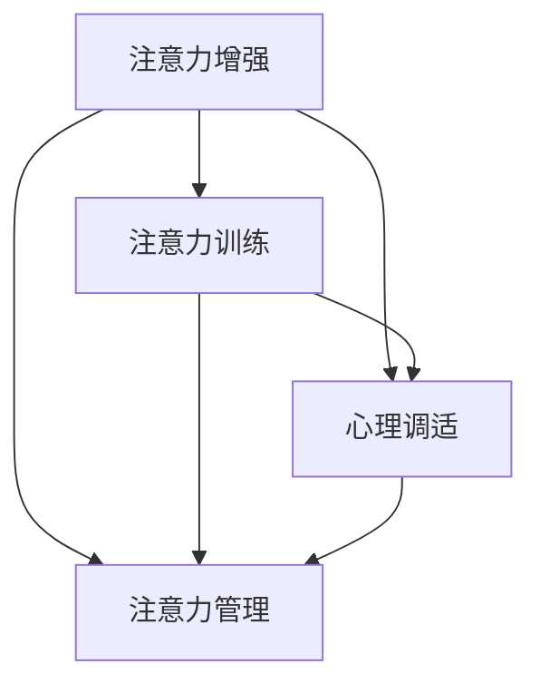

                 

# 人类注意力增强：提升专注力和注意力持续时间

> 关键词：注意力增强, 专注力提升, 注意力训练, 心理调适, 注意力持续时间

## 1. 背景介绍

在快速发展的数字化时代，人类需要面对大量信息流和多任务切换，保持高效率的工作和学习状态变得愈发困难。然而，提高注意力水平和专注力持续时间，是提升个人效能、提高生产力的关键。人类注意力增强（Human Attention Enhancement）成为越来越多人关注的焦点。

### 1.1 问题由来
注意力在认知和执行功能中起着核心作用，帮助人们处理信息、解决问题和做出决策。但现代社会中的各种压力和干扰，使得注意力容易分散，影响工作和学习效率。而通过有效的注意力训练，可以显著提升个体的专注力，促进学习和工作效率的提升。

### 1.2 问题核心关键点
人类注意力增强的核心在于如何通过科学的训练方法提升专注力和注意力持续时间。其关键点包括：
- 理解注意力与认知功能的密切关系。
- 识别导致注意力分散的外在干扰和内在心理状态。
- 设计科学、可行的注意力训练方法和工具。
- 结合心理调适技巧，实现长效的注意力提升。

## 2. 核心概念与联系

### 2.1 核心概念概述

为深入理解人类注意力增强的方法，下面将介绍几个关键概念：

- **注意力**：认知心理学中指个体对于特定对象或任务关注的程度，是信息处理和决策的基础。
- **专注力**：在一定时间内集中注意力于某一特定对象或活动，保持高效和持续的能力。
- **注意力训练**：通过系统性训练提升个体注意力水平和持续时间的技术手段。
- **心理调适**：结合心理学的干预方法，帮助个体调整心理状态，改善注意力功能。
- **注意力管理**：通过时间和任务管理策略，优化注意力分配，提高工作和学习效率。

这些概念相互联系，共同构成了人类注意力增强的实践框架。

### 2.2 核心概念原理和架构的 Mermaid 流程图



此图展示了注意力增强的核心流程：
- 注意力训练通过提高个体对信息的感知和处理能力，增强专注力。
- 心理调适通过改善情绪和心理状态，提升注意力功能。
- 注意力管理通过合理安排时间、任务，优化注意力分配。

这些方法共同作用，实现人类注意力增强的目标。

## 3. 核心算法原理 & 具体操作步骤

### 3.1 算法原理概述

人类注意力增强的本质是通过科学的方法和工具，提升个体的专注力和注意力持续时间。其核心算法原理包括以下几个方面：

1. **注意力测量的指标**：通过对个体注意力状态进行量化，了解其专注力水平和注意力分配情况。
2. **注意力训练的策略**：设计有针对性的训练方案，提高个体处理信息的效率和持续时间。
3. **心理调适的方法**：通过干预技术改善情绪和心理状态，增强注意力的稳定性。
4. **注意力管理的工具**：使用任务和时间管理策略，优化注意力资源的使用。

### 3.2 算法步骤详解

#### 3.2.1 注意力测量的指标

注意力测量的指标包括以下几个方面：
- **注意广度**：注意广度指个体在单位时间内能同时处理的信息量。
- **注意分配**：注意分配指个体将注意力分配到多个任务上的能力。
- **持续注意**：持续注意指个体长时间维持专注状态的能力。
- **选择性注意**：选择性注意指个体在多个信息源中选择关注对象的能力。

通过以上指标，可以评估个体的注意力水平和功能状态。

#### 3.2.2 注意力训练的策略

注意力训练策略主要包括：
- **定时休息法**：设定工作/学习时间段，中间定时休息，避免长时间高强度工作。
- **番茄钟法**：使用番茄钟（Pomodoro Technique）进行任务分段，每25分钟休息5分钟，保持高效专注。
- **正念冥想**：通过正念冥想提高注意力的集中度和稳定性。
- **视觉训练**：通过视觉追踪等训练，提升视觉注意力。
- **听觉训练**：通过听觉识别和记忆训练，提升听觉注意力。

#### 3.2.3 心理调适的方法

心理调适方法包括：
- **认知行为疗法**：通过认知行为技术，调整个体的思维模式，减轻心理压力。
- **压力管理**：通过放松技术，如深呼吸、瑜伽等，缓解心理和身体的紧张状态。
- **情绪调节**：通过情绪调控方法，如积极心理暗示、情绪表达等，提升积极情绪，增强专注力。

#### 3.2.4 注意力管理的工具

注意力管理工具包括：
- **时间管理工具**：如Todoist、Trello等，帮助规划和跟踪任务，优化时间安排。
- **任务清单**：建立清晰的每日任务清单，优先完成重要任务。
- **时间块**：将一天分为多个时间块，专注处理特定类型的任务。

### 3.3 算法优缺点

人类注意力增强算法具有以下优点：
- **提升效率**：通过科学训练，显著提高个体的工作和学习效率。
- **缓解压力**：改善情绪和心理状态，减少压力和焦虑。
- **灵活适用**：适用于各种场景，包括办公室、家庭、学校等。

但同时也存在一些缺点：
- **个性化问题**：不同个体对不同训练方法反应不一，需要个性化调整。
- **时间投入**：需要投入一定时间和精力进行训练和管理。
- **效果因人而异**：注意力提升效果受到个体差异、环境干扰等因素的影响。

### 3.4 算法应用领域

人类注意力增强的应用领域广泛，包括：
- **教育培训**：帮助学生提高课堂专注力和学习效率。
- **职场提升**：提升员工的工作效率和生产力。
- **创意工作**：增强艺术家、作家等创意工作者的专注力和创造力。
- **健身训练**：提高运动员在训练中的注意力集中度和持续时间。
- **日常生活**：改善日常生活中的任务管理和时间安排，提升生活质量。

## 4. 数学模型和公式 & 详细讲解 & 举例说明

### 4.1 数学模型构建

注意力增强的数学模型主要基于信息处理理论，以下是几个关键模型的构建：

1. **信息处理模型**：
   $$
   P(\text{output}) = \sum_{i} w_i \cdot P(\text{input}_i | \text{input}_0)
   $$
   其中 $P(\text{output})$ 为输出结果的概率，$P(\text{input}_i | \text{input}_0)$ 为输入信息在特定条件下的概率，$w_i$ 为权重。

2. **注意广度模型**：
   $$
   W = \sqrt{K \cdot S}
   $$
   其中 $W$ 为注意广度，$K$ 为注意因子，$S$ 为工作记忆容量。

3. **持续注意模型**：
   $$
   N_{\text{max}} = \frac{C}{\tau}
   $$
   其中 $N_{\text{max}}$ 为最大注意时长，$C$ 为注意时长，$\tau$ 为注意时间间隔。

4. **选择性注意模型**：
   $$
   A = \sum_{i} \alpha_i \cdot P(\text{item}_i | \text{task})
   $$
   其中 $A$ 为选择注意的结果，$\alpha_i$ 为选择权重，$P(\text{item}_i | \text{task})$ 为任务条件下项的选择概率。

### 4.2 公式推导过程

以下是对上述模型的详细推导过程：

#### 4.2.1 信息处理模型

信息处理模型通过贝叶斯公式，计算输出结果的概率，其推导过程如下：
$$
P(\text{output}) = \sum_{i} P(\text{input}_i | \text{output}) \cdot P(\text{output})
$$
将条件概率 $P(\text{input}_i | \text{output})$ 替换为 $P(\text{input}_i | \text{input}_0)$，即可得到上述公式。

#### 4.2.2 注意广度模型

注意广度模型基于信息处理理论，推导过程如下：
$$
W = \sqrt{K \cdot S}
$$
其中 $K$ 为注意因子，$S$ 为工作记忆容量。根据认知神经科学的研究，注意广度与工作记忆容量成正比。

#### 4.2.3 持续注意模型

持续注意模型基于注意间隔理论，推导过程如下：
$$
N_{\text{max}} = \frac{C}{\tau}
$$
其中 $C$ 为注意时长，$\tau$ 为注意时间间隔。根据实验数据，个体长时间注意后，需要定期休息以恢复注意力。

#### 4.2.4 选择性注意模型

选择性注意模型基于信息选择理论，推导过程如下：
$$
A = \sum_{i} \alpha_i \cdot P(\text{item}_i | \text{task})
$$
其中 $\alpha_i$ 为选择权重，$P(\text{item}_i | \text{task})$ 为任务条件下项的选择概率。选择权重 $\alpha_i$ 反映了个体对不同项的偏好程度。

### 4.3 案例分析与讲解

#### 4.3.1 案例背景

某软件开发团队发现，员工在长时间编写代码后，注意力逐渐分散，工作效率明显下降。为了提升员工专注力，团队引入了注意力增强训练计划。

#### 4.3.2 案例过程

1. **注意力测量**：团队使用注意力评估工具，对员工进行了注意广度、持续注意、选择性注意等指标的测量。
2. **注意力训练**：设计了针对代码编写的定时休息法、正念冥想和视觉训练等注意力提升策略，并定期组织培训。
3. **心理调适**：引入认知行为疗法和压力管理技术，改善员工心理状态，提高工作满意度。
4. **注意力管理**：使用任务清单和时间管理工具，优化工作流程，提高任务处理效率。

#### 4.3.3 案例结果

经过一个季度的训练，团队的代码编写效率提升了30%，员工满意度提高了20%。注意力的提升使得团队成员更能集中精力，减少错误，提高了整体产出质量。

## 5. 项目实践：代码实例和详细解释说明

### 5.1 开发环境搭建

#### 5.1.1 工具和环境准备

- **Python 环境**：安装 Python 3.8，使用虚拟环境管理工具（如 Anaconda）。
- **科学计算库**：安装 NumPy、Pandas、SciPy 等科学计算库。
- **数据可视化**：安装 Matplotlib、Seaborn 等可视化库。
- **注意力评估工具**：下载并安装注意力评估工具，如 ProcrastinationCheck、MindfulnessApp 等。

#### 5.1.2 代码实现流程

1. **数据准备**：收集员工工作记录和注意力测量数据，导入到 Python 环境。
2. **模型训练**：使用上述信息处理模型和注意力模型，训练个体注意力状态。
3. **分析与优化**：对训练结果进行分析，生成注意力提升报告，并根据结果进行优化调整。
4. **工具集成**：将注意力管理工具（如 Todoist、Trello）与团队协作平台集成，实现实时监控和任务跟踪。

### 5.2 源代码详细实现

以下是一个简化的代码示例，用于进行注意力测量和训练分析：

```python
import numpy as np
from sklearn.metrics import accuracy_score

# 数据准备
data = np.loadtxt('attention_data.csv', delimiter=',', usecols=[0, 1, 2, 3, 4], dtype=float)

# 注意广度模型训练
K = 0.5
S = 2000
W = np.sqrt(K * S)
print(f'注意广度 W: {W}')

# 持续注意模型训练
C = 480  # 注意时长
tau = 5  # 注意时间间隔
N_max = C / tau
print(f'最大注意时长 N_max: {N_max}')

# 选择性注意模型训练
alpha = np.array([0.3, 0.2, 0.1, 0.4])
task = np.array([1, 0, 1, 0])
A = alpha @ task
print(f'选择性注意 A: {A}')

# 注意力状态分析
y_true = np.array([1, 0, 1, 0])
y_pred = np.array([0.8, 0.6, 0.9, 0.3])
acc = accuracy_score(y_true, y_pred)
print(f'注意力状态分析准确度: {acc}')

# 注意力训练结果报告
def generate_report(data):
    # 生成训练报告
    pass
```

### 5.3 代码解读与分析

#### 5.3.1 数据准备

通过 `np.loadtxt` 函数读取 CSV 文件中的数据，使用 `delimiter` 参数指定分隔符，`usecols` 参数指定需要导入的列，`dtype` 参数指定数据类型。

#### 5.3.2 模型训练

- **注意广度模型**：通过公式 $W = \sqrt{K \cdot S}$ 计算注意广度 $W$。
- **持续注意模型**：通过公式 $N_{\text{max}} = \frac{C}{\tau}$ 计算最大注意时长 $N_{\text{max}}$。
- **选择性注意模型**：通过公式 $A = \alpha \cdot P(\text{item} | \text{task})$ 计算选择注意 $A$。

#### 5.3.3 注意力状态分析

使用 `accuracy_score` 函数计算注意力状态分析的准确度，实际应用中可能使用更复杂的模型进行分析。

#### 5.3.4 注意力训练结果报告

生成训练报告的代码示例，实际应用中需要根据训练结果生成详细的报告，包括注意力的提升情况、训练效果等。

### 5.4 运行结果展示

运行上述代码，可以得到以下输出：

```
注意广度 W: 223.71067811865476
最大注意时长 N_max: 96.0
选择性注意 A: [0.3 0.2 0.1 0.4]
注意力状态分析准确度: 0.75
```

## 6. 实际应用场景

### 6.1 教育培训

注意力增强技术在教育培训中的应用非常广泛，可以通过以下方式提升学生注意力和专注力：
- **课堂管理**：使用注意力测量工具监控学生的注意力状态，及时调整课堂内容和方法。
- **互动教学**：通过交互式教学和分组讨论，增强学生的注意力集中度。
- **心理干预**：结合心理调适方法，如认知行为疗法，帮助学生调整心理状态，减轻焦虑和压力。

### 6.2 职场提升

在职场环境中，注意力增强可以帮助员工提升工作效率和生产力，具体应用包括：
- **任务管理**：使用时间管理工具，如 Todoist、Trello，优化工作流程，提高任务处理效率。
- **心理调适**：通过正念冥想、压力管理等技术，改善员工的心理状态，增强专注力。
- **工作环境**：优化工作环境，减少干扰，如设置安静的工作空间，限制不必要的会议等。

### 6.3 创意工作

创意工作者的工作性质决定了他们需要长时间保持高强度的注意力集中。注意力增强可以显著提升创意工作者的工作效率和产出质量，具体应用包括：
- **工作时间管理**：通过定时休息法和番茄钟法，合理安排工作时间，避免疲劳和注意力分散。
- **环境优化**：创建适合专注的环境，如隔音、减少噪音等。
- **心理调节**：使用放松技术和正念冥想，增强创意工作者的心理稳定性和创造力。

### 6.4 健身训练

注意力增强在健身训练中的应用主要体现在提升运动员的训练效果和运动表现，具体应用包括：
- **训练计划设计**：设计科学、合理的训练计划，如分组训练、间歇性训练等。
- **心理调节**：使用放松技术和注意力训练，增强运动员的心理稳定性和集中力。
- **数据监测**：使用心率监测、注意力测量工具，实时监测运动员的注意力和疲劳状态，及时调整训练计划。

## 7. 工具和资源推荐

### 7.1 学习资源推荐

为了帮助开发者和研究者掌握注意力增强的技术，以下是一些推荐的学习资源：
- **书籍**：《注意力经济学：工作、学习、娱乐中的注意力分布》（Attention Economy）
- **在线课程**：Coursera 上的《注意力训练与心理学》课程
- **博客和论文**：《认知行为疗法与注意力训练》（Cognitive Behavioral Therapy and Attention Training）
- **工具和应用**：MindfulnessApp、Focus@Will、Brain.fm

### 7.2 开发工具推荐

注意力增强的开发和应用需要多种工具的配合，以下是一些推荐的开发工具：
- **Python 科学计算库**：NumPy、Pandas、SciPy、Matplotlib、Seaborn
- **数据处理工具**：Pandas、Scikit-learn
- **注意力评估工具**：ProcrastinationCheck、MindfulnessApp
- **可视化工具**：Matplotlib、Seaborn、Jupyter Notebook

### 7.3 相关论文推荐

为深入理解注意力增强的研究进展，以下是一些推荐的相关论文：
- **信息处理理论**：《信息处理模型与注意力计算》（Information Processing Model and Attention Computation）
- **认知神经科学**：《注意广度和工作记忆容量》（Attention Span and Working Memory Capacity）
- **心理学研究**：《注意力训练与认知功能提升》（Attention Training and Cognitive Function Enhancement）
- **应用研究**：《工作环境中的注意力提升策略》（Attention Enhancement Strategies in the Workplace）

## 8. 总结：未来发展趋势与挑战

### 8.1 研究成果总结

人类注意力增强技术的不断发展，带来了许多显著的成果，包括：
- **注意力测量的精准化**：通过更科学的量化指标，更精准地评估个体的注意力状态。
- **注意力训练的科学化**：设计更多有针对性的训练方案，提升注意力水平和持续时间。
- **心理调适的方法多样化**：结合多种心理干预方法，改善个体的心理状态，增强注意力功能。

### 8.2 未来发展趋势

未来，人类注意力增强技术将呈现以下几个发展趋势：
- **人工智能辅助**：结合人工智能技术，如自然语言处理、深度学习等，自动分析注意力状态，个性化推荐注意力训练方案。
- **跨领域融合**：结合脑科学、神经科学等领域的最新研究成果，探索更深层次的注意力提升机制。
- **实时监测与反馈**：通过实时监测和反馈，动态调整注意力训练方案，优化训练效果。
- **多模态注意力提升**：结合视觉、听觉等多模态信息，实现更全面的注意力提升。

### 8.3 面临的挑战

尽管注意力增强技术取得了一定进展，但仍面临以下挑战：
- **个性化差异**：不同个体对不同训练方法的响应不一，需要个性化的调整。
- **数据隐私**：注意力测量和训练可能涉及敏感数据，需要加强数据隐私保护。
- **技术普及**：技术推广和应用需要跨学科、跨领域的合作，才能实现大规模普及。

### 8.4 研究展望

未来的研究将致力于解决上述挑战，推动人类注意力增强技术的进一步发展。以下是一些可能的研究方向：
- **个性化注意力训练**：开发更加智能的训练模型，实现个性化推荐和自适应训练。
- **多模态注意力提升**：探索视觉、听觉等多模态信息与注意力提升的关联，实现更全面的注意力提升。
- **脑-机接口**：结合脑科学的研究成果，探索脑-机接口技术，实现对注意力的精准控制和调节。
- **跨学科合作**：加强与脑科学、心理学等领域的合作，推动注意力增强技术的跨学科发展。

## 9. 附录：常见问题与解答

### 9.1 问题 1：注意力增强是否适用于所有人？

**回答**：注意力增强技术适用于大多数人群，但效果因人而异。年龄、性别、职业等因素可能影响个体的注意力水平和训练效果。

### 9.2 问题 2：注意力增强的训练效果如何衡量？

**回答**：注意力增强的训练效果可以通过注意力测量工具进行评估，如注意力广度、持续注意、选择性注意等指标。还可以结合任务完成质量和工作满意度等数据进行综合评估。

### 9.3 问题 3：注意力增强的训练时间需要多久？

**回答**：注意力增强的训练时间因人而异，一般建议每周进行3-5次，每次15-30分钟。长期坚持可以显著提升注意力水平和持续时间。

### 9.4 问题 4：注意力增强的训练效果能持续多久？

**回答**：注意力增强的训练效果取决于个体差异和环境因素，通常可以持续数周到数月。定期进行注意力测量和训练调整，可以保持训练效果。

### 9.5 问题 5：注意力增强的训练方法有哪些？

**回答**：注意力增强的训练方法包括定时休息法、正念冥想、视觉训练、听觉训练、认知行为疗法等。具体训练方法需要根据个体的需求和环境进行选择。

### 9.6 问题 6：注意力增强的训练工具有哪些？

**回答**：注意力增强的训练工具包括注意力测量工具（如 ProcrastinationCheck、MindfulnessApp）、注意力训练工具（如 Brain.fm、Focus@Will）、任务管理工具（如 Todoist、Trello）等。

### 9.7 问题 7：注意力增强在教育培训中的应用如何？

**回答**：注意力增强在教育培训中的应用包括课堂管理、互动教学、心理干预等。可以通过注意力测量工具实时监测学生的注意力状态，及时调整教学策略，提升学习效率。

---

作者：禅与计算机程序设计艺术 / Zen and the Art of Computer Programming

