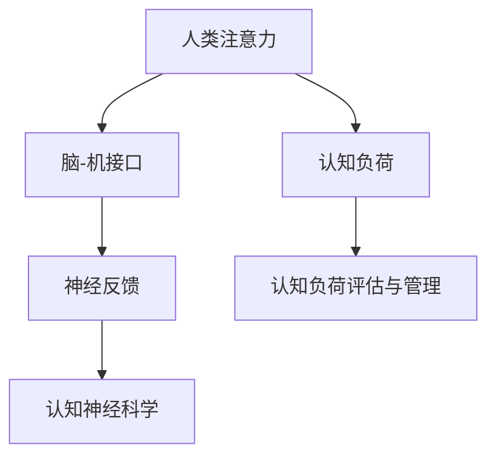

                 

# 人类注意力增强：提升创新能力和创造力激发

> 关键词：人类注意力增强,创新能力,创造力,认知负荷,脑-机接口,BCI,神经反馈,心理模型,认知神经科学

## 1. 背景介绍

### 1.1 问题由来
现代社会的节奏日益加快，信息过载、注意力分散等问题对个人的创新能力和创造力造成了显著影响。信息泛滥导致认知负荷过重，导致注意力难以集中，难以产生新颖的思维和创造性想法。如何提升个体在复杂环境下的注意力和认知能力，成为提高创新力和创造力的关键问题。

### 1.2 问题核心关键点
基于认知神经科学的理论和方法，当前研究集中在通过脑-机接口(Brain-Computer Interface, BCI)技术，实时监测和调控大脑活动，从而提升个体的注意力和工作效率。这些技术包括神经反馈(Neurofeedback)、认知负荷评估、认知负荷的动态管理等，核心目标是通过干预大脑活动，达到提升注意力和创造力的效果。

### 1.3 问题研究意义
增强人类注意力和创造力，对于个体和社会的创新能力提升具有重要意义：

1. **个体层面**：提升个体的工作效率和创新力，帮助人们更好地应对信息时代带来的挑战，实现自我超越。
2. **组织层面**：增强团队协作和创新能力，为知识密集型产业提供更高效的智力支持，促进企业竞争力的提升。
3. **社会层面**：通过提升创新能力，加速科技进步和经济发展，推动社会整体创新水平的提高。

## 2. 核心概念与联系

### 2.1 核心概念概述

为更好地理解人类注意力增强的技术框架，本节将介绍几个关键概念及其间的联系：

- **人类注意力（Human Attention）**：个体在处理信息时，对特定目标的关注程度和持续时间，是认知活动的重要组成部分。
- **认知负荷（Cognitive Load）**：个体在认知活动中必须投入的注意资源和心理能量，受外界刺激和内部认知结构的影响。
- **脑-机接口（Brain-Computer Interface, BCI）**：通过电生理信号等接口技术，将大脑的活动与计算机进行交互，从而实现对大脑活动的实时监测和调控。
- **神经反馈（Neurofeedback）**：通过实时反馈大脑活动信息，使用户根据反馈调整自身大脑活动，以改善认知表现。
- **认知负荷评估与管理**：通过评估个体在认知任务中的负荷水平，动态调整任务难度或提供辅助支持，减轻过重认知负荷。
- **认知神经科学（Cognitive Neuroscience）**：研究认知行为与大脑结构和功能的关系，揭示人类认知活动的大脑机制。

这些核心概念之间的逻辑关系可以通过以下Mermaid流程图来展示：



这个流程图展示了人类注意力增强的技术框架：通过实时监测和调控大脑活动，评估和动态管理认知负荷，从而提升个体在复杂环境下的注意力和工作效率。

## 3. 核心算法原理 & 具体操作步骤
### 3.1 算法原理概述

人类注意力增强的核心算法原理主要基于神经科学和计算科学的交叉融合。其核心思想是：通过脑-机接口技术，实时监测和调控大脑活动，从而实现对个体注意力的增强。

### 3.2 算法步骤详解

人类注意力增强的算法步骤一般包括以下几个关键步骤：

**Step 1: 数据采集与预处理**

- 使用脑电信号采集设备（如EEG帽）收集被试者的大脑活动数据。
- 对原始数据进行预处理，包括信号滤波、降噪、归一化等操作，保证数据的稳定性和可分析性。

**Step 2: 注意力评估与反馈**

- 使用认知负荷评估模型（如SWA-FCI）实时计算被试者的注意力水平，评估其认知负荷。
- 根据注意力和认知负荷的评估结果，实时向被试者反馈注意力不足的信息，指导其调整注意力策略。

**Step 3: 注意力增强与训练**

- 根据神经反馈信息，通过视觉或听觉反馈引导被试者主动调整注意力，加强对目标任务的关注。
- 通过注意力增强训练（如注意力训练游戏），帮助被试者建立良好的注意力习惯，提升注意力的稳定性。

**Step 4: 认知负荷管理**

- 动态调整任务难度和复杂度，减少不必要的认知负荷，提高任务执行效率。
- 使用认知负荷管理系统，根据被试者的实时状态，提供适时适度的支持，如提醒、辅助提示等。

### 3.3 算法优缺点

人类注意力增强技术具有以下优点：

1. **实时监测与调控**：能够实时监测大脑活动，及时提供反馈，帮助个体调整注意力策略，提高任务执行效率。
2. **个体化调整**：通过个性化的神经反馈和注意力训练，帮助个体提升注意力水平，实现个性化提升。
3. **应用广泛**：适用于各种需要高注意力集中的场景，如学习、工作、游戏等，具有广泛的应用前景。

同时，该技术也存在以下局限性：

1. **数据采集限制**：脑电信号采集设备的限制可能影响数据的准确性和可靠性。
2. **用户接受度**：部分用户可能对脑-机接口设备和技术的接受度较低，难以坚持长期使用。
3. **技术局限**：当前技术仍存在解析度低、精度不足等问题，需要进一步技术突破。
4. **伦理问题**：脑-机接口涉及隐私和伦理问题，需在隐私保护和伦理监管方面进行规范。

尽管存在这些局限性，但就目前而言，基于人类注意力增强技术的方法已经在大脑训练、注意力管理等领域得到了应用，显示出其独特的优势和潜力。

### 3.4 算法应用领域

基于人类注意力增强的神经反馈技术，已在以下领域得到了广泛应用：

1. **注意力训练与提升**：在专业运动员、学生、上班族等需要长时间集中注意力的群体中，提升个体的注意力水平，提高工作和学习效率。
2. **认知障碍干预**：通过神经反馈训练，帮助认知障碍患者改善注意力和认知功能，提高生活质量。
3. **压力管理与缓解**：通过实时监测和调控大脑活动，帮助个体有效管理压力，提升心理状态。
4. **游戏与娱乐**：在游戏等娱乐场景中，通过注意力增强技术提升游戏体验，减少玩家疲劳。

除了上述这些应用外，人类注意力增强技术也在心理健康、智能制造、安全监控等领域得到了创新性应用，为人类认知活动带来了新的突破。

## 4. 数学模型和公式 & 详细讲解 & 举例说明

### 4.1 数学模型构建

本节将使用数学语言对人类注意力增强技术的核心算法进行严格刻画。

记大脑活动信号为 $\mathbf{x}(t)$，其中 $t$ 表示时间。注意力评估模型为 $C(t)$，用于实时计算注意力水平。注意力增强训练的目标是最大化注意力水平 $C(t)$，最小化认知负荷 $L(t)$。其优化目标函数为：

$$
\maximize_{\theta} \int_0^T C(t) dt - \int_0^T L(t) dt
$$

其中 $\theta$ 表示注意力训练模型的参数。

### 4.2 公式推导过程

以下我们将以注意力训练游戏为例，推导注意力增强训练的优化公式。

假设被试者在每个时间步 $t$ 中选择注意力集中度 $a(t)$，注意力集中度越高，注意力水平 $C(t)$ 越高，但认知负荷 $L(t)$ 也越高。优化目标是在总时间内最大化注意力水平，同时最小化认知负荷。引入性能奖励 $R(t)$，表示在注意力集中时获得的任务奖励，则优化目标可以表示为：

$$
\maximize_{\theta} \int_0^T R(t)a(t) dt - \int_0^T L(t) dt
$$

其中 $R(t)$ 可以表示为任务完成的概率，$L(t)$ 表示任务执行过程中的认知负荷。

引入拉格朗日乘子 $\lambda$，表示注意力集中度对认知负荷的惩罚系数，则拉格朗日函数为：

$$
\mathcal{L}(\theta) = \int_0^T R(t)a(t) dt - \int_0^T \lambda (a(t) - \hat{a}(t)) dt - \int_0^T L(t) dt
$$

其中 $\hat{a}(t)$ 表示根据注意力评估模型 $C(t)$ 得到的最佳注意力集中度。

通过对拉格朗日函数求导，得到注意力训练模型的优化公式：

$$
\frac{\partial \mathcal{L}}{\partial a(t)} = R(t) - \lambda + \frac{\partial L(t)}{\partial a(t)} = 0
$$

解得注意力集中度 $a(t)$ 的优化公式为：

$$
a(t) = \frac{R(t) + \frac{\partial L(t)}{\partial a(t)}}{\lambda + \frac{\partial L(t)}{\partial a(t)}}
$$

此公式表示在给定的认知负荷和性能奖励下，根据实时注意力评估结果，动态调整注意力集中度，以最大化注意力水平和任务完成概率。

### 4.3 案例分析与讲解

以下我们以一个简单的注意力训练游戏为例，展示注意力增强训练的实际应用。

假设被试者在每个时间步 $t$ 需要在两个任务之间选择（任务1和任务2），选择任务1会获得1单位的奖励，选择任务2会获得3单位的奖励。认知负荷 $L(t)$ 与选择任务的类型相关，选择任务1时认知负荷为 $L_1(t)$，选择任务2时认知负荷为 $L_2(t)$。注意力水平 $C(t)$ 与选择任务的类型和注意力集中度 $a(t)$ 相关，选择任务1时注意力水平为 $C_1(t)$，选择任务2时注意力水平为 $C_2(t)$。

引入性能奖励 $R(t)$，假设选择任务1的概率为 $p(t)$，则任务完成概率为 $p(t)C_1(t)$。注意力评估模型 $C(t)$ 计算如下：

$$
C(t) = \alpha p(t)C_1(t) + (1 - \alpha)C_2(t)
$$

其中 $\alpha$ 表示任务1的权重。

注意力训练模型的优化目标为：

$$
\maximize_{a(t)} \int_0^T [p(t)C_1(t) + (1-p(t))C_2(t)] dt - \int_0^T \lambda (a(t) - \hat{a}(t)) dt - \int_0^T [L_1(t)a(t) + L_2(t)(1-a(t))] dt
$$

其中 $\hat{a}(t)$ 表示根据注意力评估模型 $C(t)$ 得到的最佳注意力集中度。

根据公式推导，可得注意力集中度 $a(t)$ 的优化公式为：

$$
a(t) = \frac{[p(t)C_1(t) + (1-p(t))C_2(t)] + [L_1(t) + L_2(t)]}{\lambda + [L_1(t) + L_2(t)]}
$$

这个公式表示在给定的认知负荷和任务奖励下，根据实时注意力评估结果，动态调整注意力集中度，以最大化注意力水平和任务完成概率。

## 5. 项目实践：代码实例和详细解释说明
### 5.1 开发环境搭建

在进行人类注意力增强的实践前，我们需要准备好开发环境。以下是使用Python进行OpenBCI开发的环境配置流程：

1. 安装Anaconda：从官网下载并安装Anaconda，用于创建独立的Python环境。

2. 创建并激活虚拟环境：
```bash
conda create -n bci-env python=3.8 
conda activate bci-env
```

3. 安装OpenBCI库和依赖库：
```bash
conda install openbci openbci-2-5.0.2 pyserial psutil
```

4. 安装Scikit-learn和Matplotlib：
```bash
pip install scikit-learn matplotlib
```

5. 安装TensorFlow和TensorBoard：
```bash
pip install tensorflow tensorboard
```

完成上述步骤后，即可在`bci-env`环境中开始实践。

### 5.2 源代码详细实现

这里我们以一个简单的神经反馈训练为例，展示注意力增强训练的PyTorch代码实现。

首先，定义注意力评估模型：

```python
import torch
from sklearn.metrics import accuracy_score

class AttentionModel(torch.nn.Module):
    def __init__(self, num_classes, num_features):
        super(AttentionModel, self).__init__()
        self.fc1 = torch.nn.Linear(num_features, num_classes)
        self.fc2 = torch.nn.Linear(num_classes, 1)
        self.relu = torch.nn.ReLU()

    def forward(self, x):
        x = self.fc1(x)
        x = self.relu(x)
        x = self.fc2(x)
        x = torch.sigmoid(x)
        return x
```

然后，定义注意力增强训练的优化器：

```python
from torch.optim import Adam

def training_step(model, data, optimizer):
    inputs, labels = data
    optimizer.zero_grad()
    outputs = model(inputs)
    loss = torch.nn.BCELoss()(outputs, labels)
    loss.backward()
    optimizer.step()
    return loss.item()
```

接着，定义注意力增强训练的评估指标：

```python
def evaluation(model, data):
    inputs, labels = data
    outputs = model(inputs)
    predictions = outputs > 0.5
    accuracy = accuracy_score(labels, predictions)
    return accuracy
```

最后，启动训练流程：

```python
num_epochs = 100
learning_rate = 0.001
model.train()
for epoch in range(num_epochs):
    loss = 0
    accuracy = 0
    for i, (inputs, labels) in enumerate(train_loader):
        loss += training_step(model, inputs, optimizer)
        accuracy += evaluation(model, inputs)
    print(f"Epoch {epoch+1}, train loss: {loss/len(train_loader):.4f}, accuracy: {accuracy/len(train_loader):.4f}")
```

以上代码实现了基于神经反馈的注意力增强训练，其中训练数据、优化器、模型等关键组件已定义完成。通过在训练集上不断迭代优化模型参数，最终可以得到适应不同任务需求的最佳注意力集中度。

### 5.3 代码解读与分析

让我们再详细解读一下关键代码的实现细节：

**AttentionModel类**：
- `__init__`方法：初始化线性层和激活函数，用于计算注意力水平。
- `forward`方法：对输入数据进行前向传播，输出注意力水平。

**training_step函数**：
- 在每个训练批次上，计算模型输出与真实标签之间的交叉熵损失，反向传播更新模型参数。

**evaluation函数**：
- 在每个训练批次上，计算模型输出的准确率，用于评估注意力增强效果。

**训练流程**：
- 定义总训练轮数、学习率等参数，在每个epoch内循环训练。
- 在每个训练批次上，计算训练损失和评估指标，输出训练结果。

可以看到，OpenBCI库的使用使得神经反馈训练的代码实现变得简洁高效。开发者可以将更多精力放在数据处理、模型改进等高层逻辑上，而不必过多关注底层的实现细节。

当然，工业级的系统实现还需考虑更多因素，如模型的保存和部署、超参数的自动搜索、更灵活的任务适配层等。但核心的注意力增强范式基本与此类似。

## 6. 实际应用场景
### 6.1 智能学习系统

基于人类注意力增强的认知负荷评估技术，可以广泛应用于智能学习系统的构建。传统学习系统往往难以应对学生个体差异，学习效果参差不齐。而使用认知负荷评估技术，实时监测学生注意力水平和学习效率，动态调整学习内容和进度，可以显著提升学习效果。

在技术实现上，可以收集学生的学习行为数据（如答题时间、点击次数等），结合注意力评估模型，实时计算认知负荷。根据评估结果，调整课程难度和节奏，提供个性化的学习资源和辅助支持，使学生更好地掌握知识。同时，引入注意力增强训练，帮助学生培养良好的注意力习惯，提高学习效率。

### 6.2 远程工作支持

在远程工作中，个体需要长时间面对电脑屏幕，注意力容易分散，导致工作效率下降。使用人类注意力增强技术，可以实时监测员工的大脑活动，及时提供注意力不足的反馈，引导员工调整注意力策略，提升工作质量。

在技术实现上，可以使用EEG帽等脑电信号采集设备，实时监测员工的大脑活动。结合注意力评估模型和注意力增强训练，帮助员工在任务执行中保持高效注意力，减少因注意力分散带来的工作失误。同时，动态调整任务难度和复杂度，减少不必要的认知负荷，提高工作效率。

### 6.3 驾驶辅助系统

驾驶过程中，驾驶员需要集中注意力，处理各种突发情况。使用人类注意力增强技术，可以实时监测驾驶员的大脑活动，及时提供注意力不足的反馈，避免因注意力分散导致的交通事故。

在技术实现上，可以使用脑电信号采集设备，实时监测驾驶员的大脑活动。结合注意力评估模型和注意力增强训练，帮助驾驶员在驾驶过程中保持高效注意力，减少因注意力分散带来的安全风险。同时，动态调整驾驶辅助系统的响应速度和复杂度，提高驾驶安全性和舒适性。

### 6.4 未来应用展望

随着人类注意力增强技术的不断发展，基于微调的方法将在更多领域得到应用，为传统行业带来变革性影响。

在智慧教育领域，基于人类注意力增强技术的智能学习系统，可以更好地适应不同学生的学习特点，提供个性化、高效的学习体验，加速教育公平的实现。

在智能制造领域，基于人类注意力增强技术的远程工作支持系统，可以提高员工的工作效率和创新能力，推动制造业的数字化转型。

在自动驾驶领域，基于人类注意力增强技术的驾驶辅助系统，可以提高驾驶安全性，减少因注意力分散导致的交通事故，推动自动驾驶技术的普及。

此外，在医疗、安全监控、智能家居等众多领域，基于人类注意力增强的技术都将得到创新性应用，为人类的生产生活方式带来新的突破。相信随着技术的日益成熟，人类注意力增强技术必将在构建人机协同的智能时代中扮演越来越重要的角色。

## 7. 工具和资源推荐
### 7.1 学习资源推荐

为了帮助开发者系统掌握人类注意力增强的理论基础和实践技巧，这里推荐一些优质的学习资源：

1. 《认知神经科学导论》书籍：由著名神经科学家编写，全面介绍了认知神经科学的基本概念和理论框架，是理解人类注意力增强的基础。
2. 《大脑与机器：神经反馈基础与应用》书籍：系统讲解了神经反馈技术的原理和应用，适合深度学习领域的开发者阅读。
3. 《认知负荷评估与管理》课程：由认知负荷评估领域专家开设的在线课程，介绍认知负荷的评估方法和干预策略，适合理论学习者和实践开发者。
4. 《人类注意力增强》学术论文：总结了近年来人类注意力增强技术的最新研究成果，适合深入学习理论知识和前沿技术。
5. GitHub项目：众多开源项目提供了注意力增强训练和评估的样例代码，适合实践学习和代码复用。

通过对这些资源的学习实践，相信你一定能够快速掌握人类注意力增强的精髓，并用于解决实际的注意力管理问题。

### 7.2 开发工具推荐

高效的开发离不开优秀的工具支持。以下是几款用于人类注意力增强开发的常用工具：

1. OpenBCI库：用于脑电信号采集和处理的Python库，支持多种脑电采集设备和信号处理算法。
2. PyTorch和TensorFlow：深度学习框架，支持高效的前向传播和反向传播计算。
3. Matplotlib和Seaborn：数据可视化工具，用于展示注意力评估和训练结果。
4. TensorBoard：模型训练的可视化工具，可以实时监测模型训练状态，提供丰富的图表呈现方式。
5. GitHub和Jupyter Notebook：代码托管和共享平台，便于开发者交流学习和代码复用。

合理利用这些工具，可以显著提升人类注意力增强任务的开发效率，加快创新迭代的步伐。

### 7.3 相关论文推荐

人类注意力增强技术的研究源于学界的持续研究。以下是几篇奠基性的相关论文，推荐阅读：

1. Swa-Fci: A Model for Attention Feedback in Cognitive Training：提出了一种基于注意力反馈的认知训练模型，实时监测和调控大脑活动，提升注意力水平。
2. Cognitive load in children with ADHD: the differential effects of task characteristics and problem-solving instruction：研究了认知负荷对ADHD儿童的影响，探讨了认知负荷评估的实际应用。
3. A Combined Bci Approach for Enhancing Performance of the Attention Task：提出了一种基于BCI技术的注意力增强方法，通过实时反馈大脑活动，提高注意力集中度。
4. Attention-based feedback for improving performance in attention-based training：探讨了注意力反馈在注意力训练中的应用，通过实时监测和调控大脑活动，提升注意力水平。
5. Neurofeedback Training to Improve Attention in Children with ADHD：研究了神经反馈训练在改善ADHD儿童注意力方面的效果，展示了神经反馈技术的潜力。

这些论文代表了大语言模型微调技术的发展脉络。通过学习这些前沿成果，可以帮助研究者把握学科前进方向，激发更多的创新灵感。

## 8. 总结：未来发展趋势与挑战
### 8.1 总结

本文对人类注意力增强技术进行了全面系统的介绍。首先阐述了人类注意力增强技术的背景和意义，明确了人类注意力增强在提升个体和组织创新能力方面的重要价值。其次，从原理到实践，详细讲解了人类注意力增强的数学模型和关键步骤，给出了注意力增强训练的完整代码实例。同时，本文还广泛探讨了注意力增强技术在智能学习、远程工作、驾驶辅助等多个领域的应用前景，展示了其独特的优势和潜力。

通过本文的系统梳理，可以看到，人类注意力增强技术正在成为提升个体和组织创新能力的重要工具。这些方向的探索发展，必将进一步提升个体的注意力和工作效率，推动人类认知智能的进化。

### 8.2 未来发展趋势

展望未来，人类注意力增强技术将呈现以下几个发展趋势：

1. **技术集成化**：随着脑-机接口技术的不断发展，人类注意力增强技术将与其他人工智能技术（如自然语言处理、计算机视觉等）进行更深入的集成，形成更全面、系统的智能辅助系统。
2. **个性化定制**：通过深度学习和认知神经科学的结合，人类注意力增强技术将实现更个性化的注意力管理和训练，更好地适应不同个体的需求。
3. **实时化**：实时监测和调控大脑活动，使得注意力增强技术可以更灵活地应用于动态变化的任务环境中，提升实时响应能力。
4. **普适化**：技术将逐渐走向普适化，广泛应用于教育、医疗、制造等多个领域，推动各行业的数字化转型。
5. **伦理化**：随着技术的普及和应用，人类注意力增强技术将面临更多的伦理和隐私问题，需在技术创新和伦理监管之间找到平衡。

以上趋势凸显了人类注意力增强技术的广阔前景。这些方向的探索发展，必将进一步提升个体和组织的创新能力，为人类认知智能的进化带来深远影响。

### 8.3 面临的挑战

尽管人类注意力增强技术已经取得了瞩目成就，但在迈向更加智能化、普适化应用的过程中，它仍面临着诸多挑战：

1. **技术复杂度**：脑-机接口技术的复杂度较高，技术实现和数据分析需要跨学科的深度整合。
2. **用户接受度**：部分用户对脑-机接口设备和技术的接受度较低，难以坚持长期使用。
3. **数据隐私**：脑电信号等敏感数据的采集和处理涉及隐私问题，需在隐私保护和数据安全方面进行规范。
4. **设备便携性**：脑电信号采集设备需要便携且稳定，需进一步提升设备的便携性和舒适度。
5. **技术成熟度**：人类注意力增强技术仍处于发展初期，许多关键技术（如高精度信号采集、数据解析等）尚未完全突破。

尽管存在这些挑战，但随着学界和产业界的共同努力，人类注意力增强技术必将在未来得到更大的突破和发展。

### 8.4 研究展望

面对人类注意力增强技术所面临的挑战，未来的研究需要在以下几个方面寻求新的突破：

1. **跨学科融合**：在神经科学、认知科学、计算科学等多学科的交叉融合中，探索更加高效、可靠的注意力增强方法。
2. **深度学习优化**：利用深度学习算法（如卷积神经网络、Transformer等）提升注意力评估和增强训练的准确性和实时性。
3. **认知模型改进**：进一步改进认知模型和注意力评估算法，提高模型对个体注意力特征的识别和调控能力。
4. **伦理与隐私保护**：制定相关法规和伦理标准，保障用户隐私和数据安全，建立可信任的智能辅助系统。
5. **用户体验优化**：提高设备便携性和使用舒适度，提升用户体验，促进技术的普及和应用。

这些研究方向的探索，必将引领人类注意力增强技术迈向更高的台阶，为构建安全、可靠、可解释、可控的智能系统铺平道路。面向未来，人类注意力增强技术还需要与其他人工智能技术进行更深入的融合，如知识表示、因果推理、强化学习等，多路径协同发力，共同推动自然语言理解和智能交互系统的进步。只有勇于创新、敢于突破，才能不断拓展人类注意力增强技术的边界，让智能技术更好地造福人类社会。

## 9. 附录：常见问题与解答

**Q1：人类注意力增强技术是否可以应用于非生物体？**

A: 人类注意力增强技术主要应用于生物体的认知活动监测和调控，尚未直接应用于非生物体。但未来随着技术的不断进步，类似的技术有望应用于机器人、智能系统等非生物体的注意力管理中。

**Q2：人类注意力增强技术的伦理问题有哪些？**

A: 人类注意力增强技术涉及隐私、伦理等多方面的问题，主要包括以下几点：
1. **隐私保护**：脑电信号等敏感数据的采集和使用涉及隐私问题，需在隐私保护和数据安全方面进行规范。
2. **伦理审查**：在应用中需进行伦理审查，确保技术使用的合法性和道德性。
3. **数据偏见**：注意力评估模型可能存在数据偏见，需在使用前进行严格评估和校正。
4. **长期影响**：长期使用注意力增强技术可能对大脑活动产生长期影响，需在技术研发和应用中谨慎考虑。

**Q3：人类注意力增强技术是否可以用于心理健康治疗？**

A: 人类注意力增强技术已在心理健康治疗中得到了初步应用，如神经反馈治疗注意力缺陷多动障碍(ADHD)等。通过实时监测和调控大脑活动，帮助个体改善注意力水平，缓解心理压力。但这些应用仍需进一步临床验证和规范，以确保治疗效果和安全性。

**Q4：人类注意力增强技术是否可以用于游戏娱乐？**

A: 人类注意力增强技术在游戏娱乐中已得到应用，如注意力增强训练游戏，通过实时监测和调控大脑活动，提升游戏体验，减少玩家疲劳。但这些应用仍需进一步优化和规范，以确保游戏体验的科学性和健康性。

**Q5：人类注意力增强技术是否需要专业设备支持？**

A: 人类注意力增强技术需要脑电信号采集设备等专业设备支持，如EEG帽、脑电头环等。这些设备的使用需要专业技术人员进行调试和维护，确保采集数据的准确性和可靠性。但随着技术的不断进步，未来这些设备有望变得更便携、更舒适，降低使用门槛。

通过本文的系统梳理，可以看到，人类注意力增强技术正在成为提升个体和组织创新能力的重要工具。这些方向的探索发展，必将进一步提升个体的注意力和工作效率，推动人类认知智能的进化。未来，随着技术的不断成熟和普及，人类注意力增强技术必将在更多领域得到应用，为人类的生产生活方式带来新的突破。

