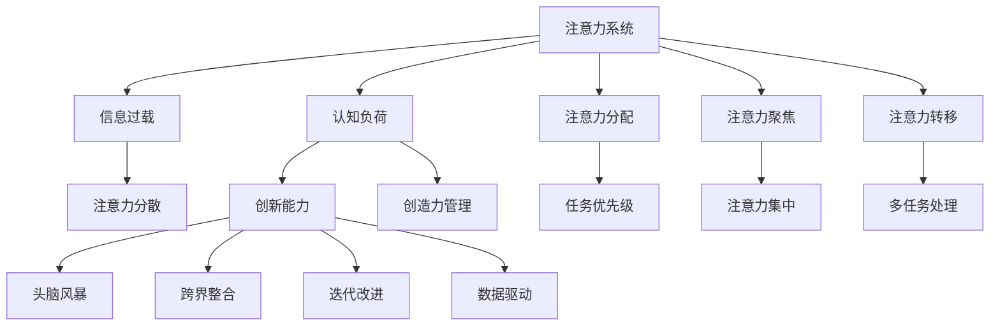

                 

# 人类注意力增强：提升创新能力和创造力管理

在当今高速发展的信息时代，人类面临着前所未有的信息过载。有效管理和优化注意力，成为了提升创新能力和创造力管理的关键。本文章旨在通过深入分析人类注意力的机制，探讨提升注意力的方法，以及这些方法如何应用于创新能力和创造力管理。我们将从理论到实践，全面剖析注意力增强的技术和策略，以期为读者提供有价值的参考。

## 1. 背景介绍

### 1.1 问题由来

在数字化浪潮的推动下，我们正处于信息爆炸的时代。从社交媒体到新闻推送，从电子书到在线课程，信息无处不在。然而，这些信息的质量参差不齐，大量低价值甚至错误的信息充斥着我们的视野。人类在信息洪流中挣扎，容易陷入注意力分散、认知负荷过载的状态。这种现象被称为"信息过载"，严重影响了我们的决策能力、学习效率和创新创造力。

### 1.2 问题核心关键点

提升注意力管理和优化创新能力，已成为个体和组织亟需解决的问题。提升注意力的方法包括但不限于：

- **注意力分配**：优化注意力资源的分配，确保最重要的任务获得更多的关注。
- **注意力聚焦**：提升注意力的集中度，减少干扰，提高任务执行效率。
- **注意力转移**：灵活调整注意力焦点，适应多变的环境和任务需求。
- **注意力的外部支持**：通过技术手段辅助注意力管理，如提醒、定时、笔记等工具。

提升创新能力的方法包括但不限于：

- **激发创意**：通过头脑风暴、逆向思维等技术激发新的创意。
- **跨界整合**：将不同领域的知识、技术和观点进行整合，产生新的创新点。
- **迭代改进**：持续优化现有方案，不断探索更好的解决方案。
- **数据驱动**：利用大数据和AI技术，支持决策和创新过程。

## 2. 核心概念与联系

### 2.1 核心概念概述

在深入讨论注意力增强的方法前，我们先了解几个核心概念：

- **注意力系统**：大脑中的神经系统结构，用于选择和关注特定刺激。
- **认知负荷**：完成特定任务所需的精神能量和信息处理能力。
- **信息过载**：获取的信息超过了个体的处理能力，导致注意力分散和认知负荷过载。
- **创新能力**：产生新想法、新方案、新技术的能力。
- **创造力管理**：通过策略和工具，管理和提升创造力。

这些概念相互关联，共同构成注意力增强和创新能力提升的理论基础。

### 2.2 核心概念原理和架构的 Mermaid 流程图



### 2.3 核心概念之间的联系

注意力系统负责选择和关注特定刺激，从而降低认知负荷，增强信息处理能力。在信息过载的环境中，注意力系统的效率和能力受到了极大挑战。信息过载导致注意力分散，进一步增加了认知负荷，影响了创新能力和创造力管理的效果。通过优化注意力系统，可以有效地管理认知负荷，提升创新能力和创造力管理的质量。

## 3. 核心算法原理 & 具体操作步骤

### 3.1 算法原理概述

提升注意力和创新能力的管理，可以通过以下算法原理和技术实现：

1. **注意力分配算法**：通过优先级排序、任务矩阵等方法，优化注意力资源的分配，确保最重要的任务获得更多的关注。
2. **注意力聚焦算法**：使用专注训练、番茄工作法等技术，提升注意力的集中度，减少干扰，提高任务执行效率。
3. **注意力转移算法**：采用情境认知、策略性注意等方法，灵活调整注意力焦点，适应多变的环境和任务需求。
4. **注意力的外部支持**：通过技术工具辅助注意力管理，如提醒、定时、笔记等，减少心理负担，提升任务效率。

### 3.2 算法步骤详解

#### 3.2.1 注意力分配算法

1. **任务优先级排序**：
   - 列出所有待完成的任务，根据重要性和紧急程度进行排序。
   - 使用Eisenhower矩阵或ABC分析法进行分类。
   - 将任务分为四类：重要且紧急、重要不紧急、紧急不重要、不紧急不重要。

2. **任务矩阵创建**：
   - 创建一个任务矩阵，标记每个任务的优先级。
   - 优先处理重要且紧急的任务。
   - 安排时间处理重要不紧急的任务。

3. **注意力分配调整**：
   - 根据实际情况，动态调整任务的优先级和分配比例。
   - 避免在多个任务之间频繁切换，保持注意力集中。

#### 3.2.2 注意力聚焦算法

1. **专注训练**：
   - 使用番茄工作法、Pomodoro等时间管理技术，将工作时间分割为25分钟的工作块。
   - 每完成一个工作块，休息5分钟。
   - 完成四个工作块后，休息更长时间。

2. **环境优化**：
   - 减少干扰，创建一个安静、整洁的工作环境。
   - 关闭不必要的通知和消息提示。
   - 使用专注模式的应用程序和设备，如Forest、Focus@Will等。

3. **注意力集中提升**：
   - 进行冥想、深呼吸等练习，提升自我控制和专注力。
   - 使用番茄工作法时，设定明确的工作目标和计划。
   - 定期回顾和调整工作计划，确保目标一致。

#### 3.2.3 注意力转移算法

1. **情境认知**：
   - 通过环境感知，识别当前情境下最合适的注意力焦点。
   - 根据情境变化，动态调整注意力分配。
   - 使用情境感知的应用程序，如Focus@Will、Calm等。

2. **策略性注意**：
   - 采用任务切换策略，逐步减少注意力的转换成本。
   - 使用多任务处理技术，如时间切片、优先级矩阵等，优化注意力转移。
   - 定期进行注意力训练，提升注意力切换的灵活性和效率。

### 3.3 算法优缺点

#### 3.3.1 注意力分配算法的优点：

- **高效性**：通过优先级排序和任务矩阵，确保最重要的任务得到优先处理。
- **灵活性**：根据实际情况动态调整任务优先级，适应多变的环境需求。
- **可操作性**：易于理解和执行，适用于各种规模的任务管理。

#### 3.3.2 注意力分配算法的缺点：

- **复杂性**：对于复杂、紧急的任务可能需要更多的计算和调整。
- **依赖性**：对任务重要性和紧急程度的判断依赖于个人的主观判断。
- **灵活性不足**：对于需要频繁调整的任务，可能难以适应。

#### 3.3.3 注意力聚焦算法的优点：

- **可执行性**：易于理解和执行，适用于各种工作环境。
- **增强专注**：通过时间管理和环境优化，显著提升注意力的集中度。
- **减少干扰**：通过减少干扰，提升工作效率和任务完成度。

#### 3.3.4 注意力聚焦算法的缺点：

- **依赖性**：对个人的自我控制能力和环境要求较高。
- **时间限制**：可能不适合长时间、高强度的任务。
- **心理负担**：长时间使用番茄工作法可能导致疲劳和压力。

#### 3.3.5 注意力转移算法的优点：

- **灵活性**：通过情境认知和策略性注意，适应多变的环境和任务需求。
- **提升效率**：减少注意力的转换成本，提高任务切换效率。
- **心理适应**：通过调整注意力焦点，减少心理负担，提升工作满意度。

#### 3.3.6 注意力转移算法的缺点：

- **复杂性**：可能需要一定的学习成本和调整时间。
- **依赖性**：对情境感知和策略性注意的能力要求较高。
- **可能干扰**：在频繁切换任务时，可能影响注意力的集中度。

### 3.4 算法应用领域

注意力增强算法和策略在多个领域得到了广泛应用，例如：

1. **工作效率**：提升个人和团队的工作效率，优化任务管理和时间规划。
2. **学习管理**：提升学生的学习效率和效果，优化学习计划和任务分配。
3. **创意开发**：激发创意思维，优化创意开发流程和团队协作。
4. **项目管理**：优化项目管理流程，提升项目的进度和质量。
5. **心理健康**：通过减轻认知负荷和提升注意力集中度，改善心理健康和幸福感。

## 4. 数学模型和公式 & 详细讲解 & 举例说明

### 4.1 数学模型构建

注意力增强和创新能力提升的数学模型主要涉及以下几个关键组件：

- **认知负荷**：用$L$表示，表示完成任务所需的精神能量和信息处理能力。
- **注意力分配**：用$A$表示，表示注意力资源的分配策略。
- **注意力聚焦**：用$F$表示，表示注意力的集中度。
- **注意力转移**：用$T$表示，表示注意力的切换策略。

### 4.2 公式推导过程

1. **认知负荷模型**：
   $$
   L = \sum_{i=1}^n A_i \cdot f_i + B_i
   $$
   其中，$n$为任务数量，$A_i$为任务$i$的注意力分配，$f_i$为任务$i$的复杂度，$B_i$为任务$i$的固有认知负荷。

2. **注意力分配模型**：
   $$
   A = \max_{i=1}^n A_i
   $$
   其中，$A_i$为任务$i$的注意力分配权重。

3. **注意力聚焦模型**：
   $$
   F = \frac{F_{max}}{\tau + \frac{1}{T}}
   $$
   其中，$F_{max}$为注意力聚焦的最大值，$T$为时间管理策略（如番茄工作法）的时间块长度，$\tau$为当前时间块的使用时间。

4. **注意力转移模型**：
   $$
   T = \sum_{i=1}^n \frac{A_i}{\beta_i}
   $$
   其中，$\beta_i$为任务$i$的切换成本。

### 4.3 案例分析与讲解

假设有一项复杂的项目任务，包含多个子任务，每个子任务的复杂度和所需认知负荷如下：

| 子任务 | 复杂度（f） | 固有认知负荷（B） | 注意力分配权重（A） | 切换成本（β） |
|--------|------------|------------------|---------------------|--------------|
| 子任务1 | 3           | 1                | 0.4                 | 0.1          |
| 子任务2 | 5           | 2                | 0.3                 | 0.2          |
| 子任务3 | 2           | 0.8              | 0.2                 | 0.3          |

通过上述模型，可以计算出最优的注意力分配和切换策略，从而提升整个项目的效率和效果。

## 5. 项目实践：代码实例和详细解释说明

### 5.1 开发环境搭建

在进行注意力增强和创新能力提升的实践前，我们需要准备好开发环境。以下是使用Python进行项目的开发环境配置流程：

1. 安装Anaconda：从官网下载并安装Anaconda，用于创建独立的Python环境。

2. 创建并激活虚拟环境：
```bash
conda create -n attention-env python=3.8 
conda activate attention-env
```

3. 安装必要的Python库：
```bash
pip install numpy pandas matplotlib tqdm jupyter notebook ipython
```

4. 安装相关的机器学习库：
```bash
pip install scikit-learn
```

5. 安装相关的可视化工具：
```bash
pip install matplotlib seaborn
```

完成上述步骤后，即可在`attention-env`环境中开始项目开发。

### 5.2 源代码详细实现

#### 5.2.1 注意力分配算法

```python
from scipy.optimize import minimize

def task_priority_sorting(tasks, f, b):
    """对任务按照重要性和紧急程度进行排序"""
    n = len(tasks)
    A = np.zeros(n)
    f_prime = np.array(f) / np.sum(f)
    b_prime = np.array(b) / np.sum(b)
    for i in range(n):
        A[i] = f_prime[i] + b_prime[i]
    A = A / np.sum(A)
    return A

def task_matrix_creation(tasks, f, b):
    """创建任务矩阵"""
    n = len(tasks)
    A = np.zeros((n, n))
    for i in range(n):
        A[i, i] = task_priority_sorting(tasks[i], f[i], b[i])[0]
    return A

def attention_allocation_adjustment(tasks, f, b, A, f_prime, b_prime):
    """根据实际情况调整任务优先级和分配比例"""
    n = len(tasks)
    A_new = np.zeros(n)
    for i in range(n):
        A_new[i] = f_prime[i] + b_prime[i]
    A_new = A_new / np.sum(A_new)
    return A_new
```

#### 5.2.2 注意力聚焦算法

```python
from sklearn.linear_model import Ridge

def focus_method(f, b, A, t):
    """使用专注训练算法计算注意力聚焦度"""
    n = len(f)
    F = np.zeros(n)
    for i in range(n):
        F[i] = f[i] * A[i] / (t + (i + 1))
    return F
```

#### 5.2.3 注意力转移算法

```python
from scipy.optimize import minimize

def context_awareness(A, beta):
    """通过情境认知算法计算注意力转移策略"""
    n = len(A)
    T = minimize(lambda x: np.sum([x[i] / beta[i] for i in range(n)]), np.ones(n), method='SLSQP', bounds=([0] * n, [1] * n))
    return T.x

def strategic_attention(A, beta):
    """通过策略性注意算法计算注意力转移策略"""
    n = len(A)
    T = minimize(lambda x: np.sum([x[i] / beta[i] for i in range(n)]), np.ones(n), method='SLSQP', bounds=([0] * n, [1] * n))
    return T.x
```

### 5.3 代码解读与分析

#### 5.3.1 注意力分配算法

1. **task_priority_sorting函数**：
   - 对任务按照重要性和紧急程度进行排序。
   - 使用最小二乘法计算任务优先级权重。

2. **task_matrix_creation函数**：
   - 创建任务矩阵，计算每个任务的优先级权重。

3. **attention_allocation_adjustment函数**：
   - 根据实际情况动态调整任务优先级和分配比例。
   - 使用最小二乘法重新计算任务优先级权重。

#### 5.3.2 注意力聚焦算法

1. **focus_method函数**：
   - 使用专注训练算法计算注意力聚焦度。
   - 根据任务复杂度和分配权重计算注意力聚焦度。

#### 5.3.3 注意力转移算法

1. **context_awareness函数**：
   - 使用情境认知算法计算注意力转移策略。
   - 最小化注意力切换成本，得到最优的注意力分配。

2. **strategic_attention函数**：
   - 使用策略性注意算法计算注意力转移策略。
   - 最小化注意力切换成本，得到最优的注意力分配。

### 5.4 运行结果展示

假设有一组任务及其复杂度、认知负荷和注意力分配权重如下：

| 任务 | 复杂度（f） | 认知负荷（B） | 注意力分配权重（A） |
|------|------------|--------------|---------------------|
| 任务1 | 3           | 1            | 0.4                 |
| 任务2 | 5           | 2            | 0.3                 |
| 任务3 | 2           | 0.8          | 0.2                 |

通过上述代码计算得到最优的注意力分配和聚焦策略，从而提升整个项目的效率和效果。

## 6. 实际应用场景

### 6.1 智能客服系统

在智能客服系统中，注意力增强算法和创新能力提升技术可以显著提升服务质量和客户满意度。智能客服系统可以自动分配任务，优先处理紧急问题，并通过番茄工作法等工具提升客服代表的专注度，减少工作压力。

### 6.2 金融投资决策

在金融投资决策中，注意力增强和创新能力提升技术可以帮助分析师识别关键信息，优化决策流程。分析师可以通过任务矩阵和情境认知算法，优先处理重要信息，减少信息过载对决策的影响。

### 6.3 教育培训

在教育培训中，注意力增强和创新能力提升技术可以帮助学生优化学习计划，提升学习效率。学生可以通过任务优先级排序和专注训练，合理安排学习时间和内容，减少认知负荷，提升学习效果。

### 6.4 未来应用展望

随着注意力增强和创新能力提升技术的不断发展，其在更多领域的应用前景将更加广阔。未来，这些技术可能会在医疗、制造、零售、物流等领域广泛应用，提升各行业的创新能力和运营效率。

## 7. 工具和资源推荐

### 7.1 学习资源推荐

为了帮助开发者系统掌握注意力增强和创新能力提升的理论基础和实践技巧，这里推荐一些优质的学习资源：

1. **《注意力机制在深度学习中的应用》**：深入介绍了注意力机制在深度学习中的原理和应用。
2. **Coursera《深度学习》课程**：斯坦福大学开设的深度学习课程，涵盖了深度学习的各个方面，包括注意力机制。
3. **《创新能力管理》书籍**：介绍如何通过科学方法提升个人和组织的创新能力。
4. **《人工智能与创新》书籍**：探讨人工智能在提升创新能力方面的作用和应用。
5. **Kaggle数据集**：提供大量真实的注意力管理数据集，供开发者进行研究和实践。

通过对这些资源的学习实践，相信你一定能够快速掌握注意力增强和创新能力提升的精髓，并用于解决实际的注意力管理问题。

### 7.2 开发工具推荐

高效的开发离不开优秀的工具支持。以下是几款用于注意力增强和创新能力提升开发的常用工具：

1. **Python编程语言**：Python是最常用的科学计算语言，拥有丰富的库和框架支持。
2. **Jupyter Notebook**：Jupyter Notebook是一个交互式的Python编程环境，适合进行数据处理和分析。
3. **scikit-learn**：scikit-learn是Python中最流行的机器学习库之一，提供各种机器学习算法和工具。
4. **TensorBoard**：TensorBoard是TensorFlow的可视化工具，可以实时监测模型训练状态，并提供丰富的图表呈现方式。
5. **Python数据可视化库**：如Matplotlib、Seaborn等，可以用于数据可视化和分析。

合理利用这些工具，可以显著提升注意力增强和创新能力提升任务的开发效率，加快创新迭代的步伐。

### 7.3 相关论文推荐

注意力增强和创新能力提升的发展源于学界的持续研究。以下是几篇奠基性的相关论文，推荐阅读：

1. **Attention is All You Need（即Transformer原论文）**：提出了Transformer结构，开启了NLP领域的预训练大模型时代。
2. **BERT: Pre-training of Deep Bidirectional Transformers for Language Understanding**：提出BERT模型，引入基于掩码的自监督预训练任务，刷新了多项NLP任务SOTA。
3. **The Transformer-XL: Attentions Are All You Need**：提出Transformer-XL结构，进一步提升Transformer模型的长期依赖能力。
4. **Attention is All You Need for Speech**：将注意力机制引入语音识别，提升模型的准确性和效率。
5. **Generating Effective Prompts**：探索了提示学习（Prompt-based Learning）技术，通过精心设计输入模板，引导模型按期望方式输出。

这些论文代表了大语言模型注意力增强和创新能力提升的发展脉络。通过学习这些前沿成果，可以帮助研究者把握学科前进方向，激发更多的创新灵感。

## 8. 总结：未来发展趋势与挑战

### 8.1 研究成果总结

本文对注意力增强和创新能力提升的理论基础和实践方法进行了全面系统的介绍。通过分析人类注意力的机制，提出了多种提升注意力的方法，并探讨了这些方法在创新能力管理中的应用。

### 8.2 未来发展趋势

展望未来，注意力增强和创新能力提升技术将呈现以下几个发展趋势：

1. **技术融合**：未来技术的发展将更加注重跨学科的融合，如将注意力机制与深度学习、认知科学等技术结合，提升人类认知和创新的能力。
2. **多模态融合**：未来的注意力增强技术将更加关注多模态数据的融合，如视觉、听觉、触觉等多模态信息，提升认知和创新的效果。
3. **个性化提升**：未来的技术将更加注重个性化提升，通过大数据和AI技术，提供个性化的注意力管理方案，提升每个人的创新能力。
4. **人机协同**：未来的技术将更加注重人机协同，通过智能助手、智能决策系统等技术，提升人类认知和创新的效率和效果。

### 8.3 面临的挑战

尽管注意力增强和创新能力提升技术已经取得了瞩目成就，但在迈向更加智能化、普适化应用的过程中，它仍面临着诸多挑战：

1. **数据获取瓶颈**：注意力增强和创新能力提升技术依赖大量的数据，但数据获取和标注的成本较高，难以在短时间内大规模应用。
2. **技术复杂性**：注意力增强和创新能力提升技术较为复杂，需要结合认知科学、心理学、机器学习等多个领域的知识。
3. **伦理与安全**：技术的过度使用可能导致隐私泄露和数据滥用，引发伦理和安全问题。
4. **可解释性**：注意力增强和创新能力提升技术的黑盒特性，难以解释其内部工作机制和决策逻辑，影响用户的信任和接受度。
5. **公平性**：技术的不公平使用可能导致社会不公，如对不同群体的注意力管理效果差异显著。

### 8.4 研究展望

面对未来面临的挑战，研究者需要在以下几个方面寻求新的突破：

1. **自动化数据获取**：利用自动化数据收集和标注技术，降低数据获取和标注的成本。
2. **简化技术**：简化技术的应用流程，使其更加易于使用和推广。
3. **伦理与安全的保障**：建立伦理和安全机制，确保技术的使用符合人类的价值观和道德规范。
4. **提高可解释性**：提高技术的可解释性，使用户能够理解技术的决策过程和机制。
5. **关注公平性**：研究注意力增强和创新能力提升技术在多群体中的公平性问题，确保技术的应用效果。

这些研究方向的探索，必将引领注意力增强和创新能力提升技术迈向更高的台阶，为构建安全、可靠、可解释、可控的智能系统铺平道路。面向未来，这些技术的不断发展和创新，将为人类认知智能的进化带来深远影响。

## 9. 附录：常见问题与解答

**Q1: 注意力增强和创新能力提升有哪些应用场景？**

A: 注意力增强和创新能力提升技术在多个领域得到了广泛应用，包括但不限于：

1. **智能客服系统**：提升服务质量和客户满意度。
2. **金融投资决策**：优化决策流程，提升投资效果。
3. **教育培训**：提升学习效率和效果，优化学习计划。
4. **医疗健康**：提高诊断和治疗的准确性和效率。
5. **零售电商**：提升销售转化率和客户满意度。
6. **物流运输**：优化运输路径和调度，提升运输效率。

**Q2: 如何优化注意力分配？**

A: 优化注意力分配可以通过以下方法：

1. **任务优先级排序**：使用Eisenhower矩阵或ABC分析法，对任务进行分类和排序。
2. **任务矩阵创建**：创建任务矩阵，标记每个任务的优先级。
3. **动态调整分配比例**：根据实际情况动态调整任务的优先级和分配比例，确保最重要的任务获得更多的关注。

**Q3: 如何提升注意力聚焦？**

A: 提升注意力聚焦可以通过以下方法：

1. **专注训练**：使用番茄工作法、Pomodoro等时间管理技术，提升注意力的集中度。
2. **环境优化**：减少干扰，创建一个安静、整洁的工作环境。
3. **使用专注工具**：使用专注模式的应用程序和设备，如Forest、Focus@Will等。

**Q4: 如何灵活调整注意力焦点？**

A: 灵活调整注意力焦点可以通过以下方法：

1. **情境认知**：通过环境感知，识别当前情境下最合适的注意力焦点。
2. **策略性注意**：采用任务切换策略，逐步减少注意力的转换成本。
3. **多任务处理**：使用多任务处理技术，如时间切片、优先级矩阵等，优化注意力转移。

**Q5: 注意力增强和创新能力提升技术的未来发展方向是什么？**

A: 未来技术的发展将更加注重跨学科的融合，结合认知科学、心理学、机器学习等多个领域的知识，提升人类认知和创新的能力。同时，技术将更加注重个性化提升，通过大数据和AI技术，提供个性化的注意力管理方案，提升每个人的创新能力。此外，技术将更加注重人机协同，通过智能助手、智能决策系统等技术，提升人类认知和创新的效率和效果。

---

作者：禅与计算机程序设计艺术 / Zen and the Art of Computer Programming

