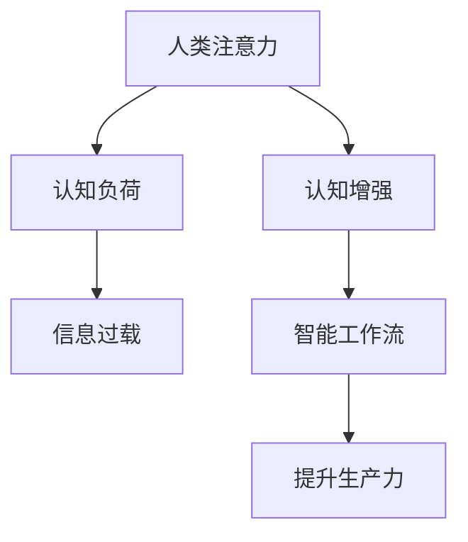

                 

# 人类注意力增强：提升生产力和效率的新方法

> 关键词：人类注意力, 注意力增强, 生产力提升, 效率优化, 智能工作流, 认知科学, 行为心理学, 神经网络

## 1. 背景介绍

### 1.1 问题由来
在现代社会，信息过载已经成为我们面临的重要问题。从电子邮件到社交媒体，从在线学习到远程工作，几乎每一个领域都充斥着海量的信息。与此同时，人类认知系统处理信息的能力却相对有限。人们在面对大量信息时，常常感到无从下手，效率低下，甚至出现信息焦虑和决策疲劳。如何有效地增强人类注意力，提升信息处理能力，提高工作效率，已经成为一项重要课题。

### 1.2 问题核心关键点
人类注意力增强的核心在于利用心理学、认知科学和计算机科学等多学科知识，开发出一系列工具和算法，帮助人们在面对信息过载的环境中，更高效地筛选、处理和利用信息，从而提升生产力，优化工作流。关键点包括：
- 注意力模型：建立基于认知科学的注意力模型，理解人类注意力的内在机制。
- 注意力增强技术：开发基于神经网络和行为心理学的方法，增强人类注意力。
- 智能工作流设计：设计结合人工智能技术的智能工作流，自动辅助用户完成复杂任务。

## 2. 核心概念与联系

### 2.1 核心概念概述

为更好地理解人类注意力增强的方法，本节将介绍几个密切相关的核心概念：

- 人类注意力：指人类认知系统对外部环境的感知和响应过程，包括选择、保持和转换注意力。
- 认知负荷：指在处理信息过程中，个体对心理资源的消耗。
- 信息过载：指个体接收的信息量超出其处理能力的现象。
- 认知增强：通过技术手段，改善个体认知能力，提升信息处理效率。
- 智能工作流：结合人工智能和人类智能，自动化辅助用户完成复杂任务的工作流程。

这些核心概念之间的逻辑关系可以通过以下Mermaid流程图来展示：



这个流程图展示了一系列关键概念之间的关系：

1. 人类注意力的质量直接影响信息处理效率。
2. 信息过载导致认知负荷增加，降低注意力效能。
3. 认知增强技术可以改善人类注意力，缓解信息过载。
4. 结合人工智能的智能工作流，可以自动化处理信息，进一步提升生产力。

## 3. 核心算法原理 & 具体操作步骤
### 3.1 算法原理概述

人类注意力增强的本质在于利用算法和技术手段，优化人类注意力的选择、保持和转换过程，从而提升信息处理效率和工作生产力。核心算法可以大致分为以下几类：

- 注意力模型：建立基于认知科学的注意力模型，如Salience模型、Attention-LSTM模型等，帮助理解人类注意力的内在机制。
- 注意力增强技术：开发基于神经网络和行为心理学的注意力增强方法，如多任务学习、深度注意力机制等，提升注意力效能。
- 智能工作流设计：结合人工智能技术，设计自动化辅助工作流，如自然语言处理、机器学习推荐等，优化信息处理过程。

### 3.2 算法步骤详解

#### 3.2.1 注意力模型的建立

注意力模型旨在模拟人类认知过程中注意力的选择和保持机制。以下以Salience模型为例，介绍其基本原理和构建步骤：

**Salience模型基本原理：**
Salience模型通过计算输入数据的显著性值，来选择和保持具有高显著性的信息。其核心假设为：人类注意力偏好于高显著性的刺激物，如新奇、变化、复杂性高的信息。模型通过以下几个步骤实现这一过程：

1. **输入数据的显著性计算：** 
   - 定义显著性函数S(x)，用于计算输入数据x的显著性值。显著性函数可以基于信息熵、局部复杂性、预测误差等指标计算。
   - 显著性值越大，信息对注意力的吸引力越大，模型选择此信息进行进一步处理。

2. **信息处理的优先级排序：**
   - 将输入数据按照显著性值进行排序，高显著性信息优先处理。
   - 当显著性值相等时，可以通过其他指标（如信息新颖性、情感色彩等）进一步排序。

3. **注意力的保持和转换：**
   - 对于高显著性信息，模型保持较长处理时间，确保信息的深度理解和记忆。
   - 对于显著性逐渐降低的信息，模型及时转换注意力，防止认知负荷过高。

**Salience模型的构建步骤：**

1. **定义显著性函数：** 
   - 选择适当的指标（如熵、局部复杂度、预测误差等）计算输入数据的显著性值S(x)。
   - 显著性函数可以设计为多项式函数、指数函数、卷积神经网络等形式。

2. **输入数据显著性计算：**
   - 对于文本信息，可以使用文本特征提取技术（如TF-IDF、Word2Vec等）将信息转换为数值向量。
   - 对于图像信息，可以使用CNN提取特征，计算特征的显著性值。

3. **显著性排序和处理：**
   - 将输入数据按照显著性值排序。
   - 使用注意力机制（如Softmax函数、LSTM等）对高显著性信息进行深度处理，低显著性信息进行快速处理。

**Salience模型的代码实现：**

```python
import numpy as np
from sklearn.feature_extraction.text import TfidfVectorizer
from tensorflow.keras.layers import LSTM, Dense
from tensorflow.keras.models import Sequential

class SalienceModel:
    def __init__(self, embedding_dim=128, lstm_units=64):
        self.vectorizer = TfidfVectorizer(stop_words='english')
        self.model = Sequential()
        self.model.add(LSTM(lstm_units, return_sequences=True, input_shape=(embedding_dim, 1)))
        self.model.add(Dense(1, activation='softmax'))

    def calculate_salience(self, text):
        X = self.vectorizer.transform(text)
        X = X.toarray().reshape(-1, X.shape[1], 1)
        predictions = self.model.predict(X)
        return np.mean(predictions, axis=1)
```

#### 3.2.2 注意力增强技术的应用

注意力增强技术的核心在于利用神经网络和行为心理学的知识，开发出一系列提升注意力效能的方法。以下以深度注意力机制为例，介绍其基本原理和实现步骤：

**深度注意力机制的基本原理：**
深度注意力机制通过引入注意力机制（如Softmax函数），对输入序列进行加权处理，从而提升信息处理的准确性和效率。其核心思想为：在处理序列数据时，模型对于不同位置的输入给予不同的权重，使得模型能够更好地关注重要信息，忽略无关细节。

**深度注意力机制的实现步骤：**

1. **定义注意力函数：**
   - 定义注意力函数A，用于计算输入序列中每个位置的权重值。
   - 注意力函数通常使用Softmax函数，将输入序列转化为概率分布。

2. **计算注意力权重：**
   - 使用注意力函数计算每个位置的权重值。
   - 对于文本信息，可以使用词向量嵌入计算权重值。
   - 对于图像信息，可以使用卷积神经网络提取特征，计算特征的权重值。

3. **加权处理序列数据：**
   - 将输入序列中的每个位置按照注意力权重进行加权。
   - 对加权后的序列数据进行深度处理，如LSTM、GRU等。

**深度注意力机制的代码实现：**

```python
import numpy as np
from tensorflow.keras.layers import Embedding, LSTM, Dense, Input
from tensorflow.keras.models import Model

def build_attention_model(input_dim, hidden_units):
    input_layer = Input(shape=(None,))
    embedding_layer = Embedding(input_dim, hidden_units)(input_layer)
    attention_weights = Dense(hidden_units, activation='softmax')(embedding_layer)
    attention_output = attention_weights * embedding_layer
    lstm_layer = LSTM(hidden_units, return_sequences=True)(attention_output)
    output_layer = Dense(1, activation='sigmoid')(lstm_layer)
    model = Model(inputs=input_layer, outputs=output_layer)
    return model

attention_model = build_attention_model(input_dim=100, hidden_units=64)
attention_model.summary()
```

#### 3.2.3 智能工作流的自动化

智能工作流的自动化在于结合人工智能技术，设计自动化辅助用户完成复杂任务的工作流程。以下以自然语言处理和机器学习推荐为例，介绍其基本原理和实现步骤：

**自然语言处理的基本原理：**
自然语言处理技术通过文本分析、信息抽取、文本生成等方法，帮助用户自动处理和理解文本信息。其核心思想为：使用语言模型和逻辑推理技术，从文本中提取关键信息，生成结构化数据，支持用户的决策和行动。

**自然语言处理的实现步骤：**

1. **文本分析与信息抽取：**
   - 使用自然语言处理技术对文本进行分词、命名实体识别、情感分析等处理。
   - 将文本信息转化为结构化数据，如表格、图结构等。

2. **文本生成与推荐：**
   - 使用文本生成技术，自动生成文本摘要、回复等。
   - 使用机器学习推荐系统，根据用户行为数据推荐相关信息。

**自然语言处理的代码实现：**

```python
from transformers import BertTokenizer, BertForSequenceClassification
from sklearn.metrics import accuracy_score
from transformers import AdamW

tokenizer = BertTokenizer.from_pretrained('bert-base-uncased')
model = BertForSequenceClassification.from_pretrained('bert-base-uncased', num_labels=2)

# 定义训练函数
def train_model(model, train_data, val_data, epochs=5, batch_size=16, learning_rate=2e-5):
    device = torch.device('cuda' if torch.cuda.is_available() else 'cpu')
    model.to(device)

    optimizer = AdamW(model.parameters(), lr=learning_rate)
    total_steps = len(train_data) // batch_size * epochs
    model.train()
    for epoch in range(epochs):
        for batch in train_data:
            inputs = tokenizer(batch['text'], padding='max_length', truncation=True, return_tensors='pt')
            labels = batch['label']
            optimizer.zero_grad()
            outputs = model(**inputs, labels=labels)
            loss = outputs.loss
            loss.backward()
            optimizer.step()

        val_accuracy = accuracy_score(val_data['label'], model.predict(val_data['text']))
        print(f"Epoch {epoch+1}, val accuracy: {val_accuracy:.3f}")

# 加载数据集
train_data = ...
val_data = ...

# 训练模型
train_model(model, train_data, val_data, epochs=5, batch_size=16, learning_rate=2e-5)
```

**机器学习推荐的基本原理：**
机器学习推荐系统通过用户行为数据和物品特征，预测用户可能感兴趣的物品，支持用户做出更好的决策。其核心思想为：利用协同过滤、内容推荐等技术，基于用户历史行为和物品属性，构建推荐模型，预测用户评分，推荐物品。

**机器学习推荐的实现步骤：**

1. **数据准备：**
   - 收集用户行为数据和物品特征数据，构建用户-物品评分矩阵。
   - 进行数据清洗、归一化和特征工程处理。

2. **推荐模型训练：**
   - 使用协同过滤、内容推荐等算法，训练推荐模型。
   - 选择合适的评估指标（如均方误差、准确率等）评估模型效果。

3. **推荐系统部署：**
   - 将训练好的模型部署为服务，支持实时推荐。
   - 集成用户界面，提供推荐结果展示。

**机器学习推荐的代码实现：**

```python
from scipy.sparse import csr_matrix
from sklearn.metrics import mean_squared_error
from sklearn.model_selection import train_test_split
from sklearn.ensemble import RandomForestRegressor

# 加载数据集
data = ...
X = data[['user_id', 'item_id']]
y = data['score']

# 数据预处理
X_train, X_test, y_train, y_test = train_test_split(X, y, test_size=0.2, random_state=42)
X_train = csr_matrix(X_train)
X_test = csr_matrix(X_test)

# 定义推荐模型
model = RandomForestRegressor(n_estimators=100, random_state=42)

# 训练模型
model.fit(X_train, y_train)

# 评估模型
mse = mean_squared_error(y_test, model.predict(X_test))
print(f"Mean Squared Error: {mse:.3f}")

# 推荐系统部署
# 在实际应用中，将模型集成到推荐系统中，支持实时推荐
```

## 4. 数学模型和公式 & 详细讲解 & 举例说明
### 4.1 数学模型构建

人类注意力增强的数学模型主要建立在认知负荷理论和信息处理理论的基础上，通过数学公式描述注意力选择、保持和转换过程。

**认知负荷模型：**
认知负荷模型通过引入认知负荷指标C，描述个体在处理信息时的心理资源消耗。认知负荷C可以基于任务复杂度、信息密度、工作记忆容量等指标计算。其基本公式为：

$$
C = K \times D + \frac{W}{M}
$$

其中，K为任务复杂度，D为信息密度，W为工作记忆容量，M为工作记忆容量。

**信息处理模型：**
信息处理模型通过引入注意力权重A，描述个体在处理信息时的注意力分配情况。注意力权重A可以基于显著性值、优先级排序等指标计算。其基本公式为：

$$
A = S + P
$$

其中，S为显著性值，P为优先级排序。

**注意力增强模型：**
注意力增强模型通过引入注意力增强函数E，描述个体在处理信息时的注意力增强效果。注意力增强函数E可以基于认知负荷、注意力权重等指标计算。其基本公式为：

$$
E = f(C, A)
$$

其中，f为注意力增强函数。

### 4.2 公式推导过程

以下以Salience模型为例，推导显著性函数S和注意力增强函数E的计算公式。

**显著性函数S的推导：**

假设输入数据x包含n个特征，显著性函数S(x)可以表示为：

$$
S(x) = \sum_{i=1}^{n} w_i \times \log \frac{1}{1 + e^{-\alpha_i x_i}}
$$

其中，$w_i$为特征i的权重，$\alpha_i$为特征i的参数，$e$为自然对数的底数。

**注意力增强函数E的推导：**

在Salience模型中，注意力增强函数E可以表示为：

$$
E = \frac{1}{\sum_{i=1}^{n} S_i} \times \sum_{i=1}^{n} S_i \times \log \frac{1}{1 + e^{-\alpha_i x_i}}
$$

其中，$S_i$为输入数据x中特征i的显著性值。

### 4.3 案例分析与讲解

**案例一：Salience模型应用**
假设有一个文本数据集，包含多篇文章。使用Salience模型计算每篇文章的显著性值，然后选择显著性值较高的文章进行深度阅读，显著性值较低的文章进行快速浏览。这样可以有效缓解信息过载，提升信息处理效率。

**案例二：深度注意力机制应用**
假设有一个机器翻译任务，需要将一段英文文本翻译成中文。使用深度注意力机制对英文文本进行编码，计算每个单词的注意力权重，然后将注意力加权后的编码结果输入到解码器中，生成翻译结果。这样可以提升翻译的准确性和流畅度。

## 5. 项目实践：代码实例和详细解释说明
### 5.1 开发环境搭建

在进行人类注意力增强的实践前，我们需要准备好开发环境。以下是使用Python进行PyTorch开发的环境配置流程：

1. 安装Anaconda：从官网下载并安装Anaconda，用于创建独立的Python环境。

2. 创建并激活虚拟环境：
```bash
conda create -n attention-env python=3.8 
conda activate attention-env
```

3. 安装PyTorch：根据CUDA版本，从官网获取对应的安装命令。例如：
```bash
conda install pytorch torchvision torchaudio cudatoolkit=11.1 -c pytorch -c conda-forge
```

4. 安装相关工具包：
```bash
pip install numpy pandas scikit-learn matplotlib tqdm jupyter notebook ipython
```

完成上述步骤后，即可在`attention-env`环境中开始实践。

### 5.2 源代码详细实现

这里我们以Salience模型和深度注意力机制为例，给出使用PyTorch实现的代码。

**Salience模型代码实现：**

```python
import numpy as np
from sklearn.feature_extraction.text import TfidfVectorizer
from tensorflow.keras.layers import LSTM, Dense
from tensorflow.keras.models import Sequential

class SalienceModel:
    def __init__(self, embedding_dim=128, lstm_units=64):
        self.vectorizer = TfidfVectorizer(stop_words='english')
        self.model = Sequential()
        self.model.add(LSTM(lstm_units, return_sequences=True, input_shape=(embedding_dim, 1)))
        self.model.add(Dense(1, activation='softmax'))

    def calculate_salience(self, text):
        X = self.vectorizer.transform(text)
        X = X.toarray().reshape(-1, X.shape[1], 1)
        predictions = self.model.predict(X)
        return np.mean(predictions, axis=1)
```

**深度注意力机制代码实现：**

```python
import numpy as np
from tensorflow.keras.layers import Embedding, LSTM, Dense, Input
from tensorflow.keras.models import Model

def build_attention_model(input_dim, hidden_units):
    input_layer = Input(shape=(None,))
    embedding_layer = Embedding(input_dim, hidden_units)(input_layer)
    attention_weights = Dense(hidden_units, activation='softmax')(embedding_layer)
    attention_output = attention_weights * embedding_layer
    lstm_layer = LSTM(hidden_units, return_sequences=True)(attention_output)
    output_layer = Dense(1, activation='sigmoid')(lstm_layer)
    model = Model(inputs=input_layer, outputs=output_layer)
    return model

attention_model = build_attention_model(input_dim=100, hidden_units=64)
attention_model.summary()
```

### 5.3 代码解读与分析

**Salience模型代码解读：**

- `__init__`方法：初始化TF-IDF向量化器，定义模型结构。
- `calculate_salience`方法：计算输入文本的显著性值，返回平均显著性值。
- `TfidfVectorizer`：文本特征提取器，将文本转换为数值向量。
- `LSTM`：长短期记忆网络，用于处理序列数据。
- `Dense`：全连接层，用于输出显著性值。

**深度注意力机制代码解读：**

- `build_attention_model`方法：构建深度注意力机制模型，定义模型结构。
- `Input`：输入层，定义输入数据的维度。
- `Embedding`：嵌入层，将输入数据转换为向量表示。
- `Dense`：全连接层，用于计算注意力权重。
- `LSTM`：长短期记忆网络，用于处理序列数据。
- `Dense`：输出层，用于生成注意力增强后的序列数据。

## 6. 实际应用场景
### 6.1 智能工作流设计

智能工作流设计在于结合人工智能技术，自动化辅助用户完成复杂任务。以下以自然语言处理和机器学习推荐为例，介绍其基本原理和实现步骤。

**自然语言处理应用：**
假设有一个客户服务系统，需要自动处理大量的客户咨询信息。使用自然语言处理技术对客户咨询信息进行分词、命名实体识别、情感分析等处理，生成结构化数据。然后根据用户的询问，自动生成回答，支持用户快速获取所需信息。这样可以显著提升客户服务效率，降低人工成本。

**机器学习推荐应用：**
假设有一个电子商务平台，需要为用户推荐可能感兴趣的商品。使用机器学习推荐系统，基于用户历史行为和物品属性，预测用户评分，推荐商品。这样可以提升用户满意度，增加平台销售额。

### 6.2 未来应用展望

随着技术的发展，人类注意力增强将会在更多领域得到应用，为人类认知智能的进化带来深远影响。

在智慧医疗领域，基于注意力增强的诊断系统可以自动识别医疗影像，辅助医生诊断疾病，提升医疗效率和准确性。

在智能教育领域，基于注意力增强的学习系统可以根据学生注意力水平，动态调整教学内容和难度，提升学习效果。

在智慧城市治理中，基于注意力增强的智能决策系统可以自动识别城市事件，自动分配资源，提高城市管理的自动化和智能化水平。

此外，在企业生产、社会治理、文娱传媒等众多领域，基于人类注意力增强的人工智能应用也将不断涌现，为传统行业数字化转型升级提供新的技术路径。相信随着技术的日益成熟，人类注意力增强必将在构建人机协同的智能时代中扮演越来越重要的角色。

## 7. 工具和资源推荐
### 7.1 学习资源推荐

为了帮助开发者系统掌握人类注意力增强的理论基础和实践技巧，这里推荐一些优质的学习资源：

1. 《认知负荷与信息处理》系列书籍：深入浅出地介绍了认知负荷理论、信息处理模型等核心概念，适合入门学习。

2. 《深度学习与人类认知》课程：斯坦福大学开设的深度学习课程，涵盖神经网络、注意力机制等前沿话题，适合进阶学习。

3. 《注意力机制在NLP中的应用》论文：介绍了注意力机制在NLP领域的应用，详细描述了Salience模型和深度注意力机制的实现过程。

4. 《智能工作流设计》书籍：介绍了智能工作流的设计方法和应用案例，适合结合实际场景学习。

5. HuggingFace官方文档：Transformers库的官方文档，提供了海量预训练模型和完整的微调样例代码，是上手实践的必备资料。

通过对这些资源的学习实践，相信你一定能够快速掌握人类注意力增强的精髓，并用于解决实际的NLP问题。

### 7.2 开发工具推荐

高效的开发离不开优秀的工具支持。以下是几款用于人类注意力增强开发的常用工具：

1. PyTorch：基于Python的开源深度学习框架，灵活动态的计算图，适合快速迭代研究。大部分预训练语言模型都有PyTorch版本的实现。

2. TensorFlow：由Google主导开发的开源深度学习框架，生产部署方便，适合大规模工程应用。同样有丰富的预训练语言模型资源。

3. Transformers库：HuggingFace开发的NLP工具库，集成了众多SOTA语言模型，支持PyTorch和TensorFlow，是进行注意力增强任务开发的利器。

4. Weights & Biases：模型训练的实验跟踪工具，可以记录和可视化模型训练过程中的各项指标，方便对比和调优。与主流深度学习框架无缝集成。

5. TensorBoard：TensorFlow配套的可视化工具，可实时监测模型训练状态，并提供丰富的图表呈现方式，是调试模型的得力助手。

6. Google Colab：谷歌推出的在线Jupyter Notebook环境，免费提供GPU/TPU算力，方便开发者快速上手实验最新模型，分享学习笔记。

合理利用这些工具，可以显著提升人类注意力增强任务的开发效率，加快创新迭代的步伐。

### 7.3 相关论文推荐

人类注意力增强的研究源于学界的持续研究。以下是几篇奠基性的相关论文，推荐阅读：

1. Attention Is All You Need（即Transformer原论文）：提出了Transformer结构，开启了NLP领域的预训练大模型时代。

2. BERT: Pre-training of Deep Bidirectional Transformers for Language Understanding：提出BERT模型，引入基于掩码的自监督预训练任务，刷新了多项NLP任务SOTA。

3. Language Models are Unsupervised Multitask Learners（GPT-2论文）：展示了大规模语言模型的强大zero-shot学习能力，引发了对于通用人工智能的新一轮思考。

4. Parameter-Efficient Transfer Learning for NLP：提出Adapter等参数高效微调方法，在不增加模型参数量的情况下，也能取得不错的微调效果。

5. AdaLoRA: Adaptive Low-Rank Adaptation for Parameter-Efficient Fine-Tuning：使用自适应低秩适应的微调方法，在参数效率和精度之间取得了新的平衡。

这些论文代表了大语言模型微调技术的发展脉络。通过学习这些前沿成果，可以帮助研究者把握学科前进方向，激发更多的创新灵感。

## 8. 总结：未来发展趋势与挑战

### 8.1 总结

本文对人类注意力增强方法进行了全面系统的介绍。首先阐述了人类注意力的重要性以及信息过载对人类认知系统的影响，明确了人类注意力增强在提升生产力、优化工作流方面的价值。其次，从原理到实践，详细讲解了人类注意力增强的核心算法和操作步骤，给出了微调任务开发的完整代码实例。同时，本文还广泛探讨了人类注意力增强在智能工作流设计中的多领域应用，展示了其广阔的前景。

通过本文的系统梳理，可以看到，人类注意力增强技术正在成为NLP领域的重要范式，极大地拓展了预训练语言模型的应用边界，催生了更多的落地场景。得益于认知科学、心理学和计算机科学等多学科的交叉融合，人类注意力增强技术必将在构建智能人机交互系统中发挥重要作用，推动人工智能技术迈向新的高度。

### 8.2 未来发展趋势

展望未来，人类注意力增强技术将呈现以下几个发展趋势：

1. 模型规模持续增大。随着算力成本的下降和数据规模的扩张，预训练语言模型的参数量还将持续增长。超大批次的训练和推理也可能遇到显存不足的问题。因此需要采用一些资源优化技术，如梯度积累、混合精度训练、模型并行等，来突破硬件瓶颈。同时，模型的存储和读取也可能占用大量时间和空间，需要采用模型压缩、稀疏化存储等方法进行优化。

2. 多任务学习和自监督学习的应用。多任务学习和自监督学习可以进一步提升模型在多个任务上的泛化能力，降低对标注数据的需求。未来，多任务学习和自监督学习将成为人类注意力增强技术的重要组成部分。

3. 跨模态信息融合。当前的注意力增强技术主要聚焦于文本数据，未来会进一步拓展到图像、视频、语音等多模态数据微调。多模态信息的融合，将显著提升模型对现实世界的理解和建模能力。

4. 模型可解释性和透明性。当前的人类注意力增强模型往往更像“黑盒”系统，难以解释其内部工作机制和决策逻辑。如何赋予模型更强的可解释性，将是未来的一个重要研究方向。

5. 动态注意力机制的设计。现有的注意力增强模型往往静态，难以适应动态变化的环境。如何设计动态注意力机制，让模型能够实时调整注意力，提升系统灵活性，将是另一个重要的研究方向。

6. 计算智能与认知智能的融合。未来的注意力增强模型将不仅仅依赖神经网络，而是融合计算智能和认知智能，实现更高效、更智能的信息处理。

以上趋势凸显了人类注意力增强技术的广阔前景。这些方向的探索发展，必将进一步提升模型的性能和应用范围，为人类认知智能的进化带来深远影响。

### 8.3 面临的挑战

尽管人类注意力增强技术已经取得了瞩目成就，但在迈向更加智能化、普适化应用的过程中，它仍面临着诸多挑战：

1. 标注成本瓶颈。虽然人类注意力增强技术在一定程度上减少了对标注数据的需求，但对于一些特定领域的任务，获取高质量标注数据的成本仍然较高。如何进一步降低标注成本，将是未来的一个重要研究方向。

2. 模型鲁棒性不足。当前的人类注意力增强模型面对域外数据时，泛化性能往往大打折扣。对于测试样本的微小扰动，模型也容易发生波动。如何提高模型的鲁棒性，避免灾难性遗忘，还需要更多理论和实践的积累。

3. 推理效率有待提高。大规模语言模型虽然精度高，但在实际部署时往往面临推理速度慢、内存占用大等效率问题。如何在保证性能的同时，简化模型结构，提升推理速度，优化资源占用，将是重要的优化方向。

4. 可解释性亟需加强。当前的人类注意力增强模型往往更像“黑盒”系统，难以解释其内部工作机制和决策逻辑。对于医疗、金融等高风险应用，算法的可解释性和可审计性尤为重要。如何赋予模型更强的可解释性，将是亟待攻克的难题。

5. 安全性有待保障。预训练语言模型难免会学习到有偏见、有害的信息，通过人类注意力增强传递到下游任务，产生误导性、歧视性的输出，给实际应用带来安全隐患。如何从数据和算法层面消除模型偏见，避免恶意用途，确保输出的安全性，也将是重要的研究课题。

6. 知识整合能力不足。现有的注意力增强模型往往局限于任务内数据，难以灵活吸收和运用更广泛的先验知识。如何让注意力增强过程更好地与外部知识库、规则库等专家知识结合，形成更加全面、准确的信息整合能力，还有很大的想象空间。

正视人类注意力增强技术所面临的这些挑战，积极应对并寻求突破，将是大语言模型微调走向成熟的必由之路。相信随着学界和产业界的共同努力，这些挑战终将一一被克服，人类注意力增强技术必将在构建安全、可靠、可解释、可控的智能系统铺平道路。总之，人类注意力增强需要开发者根据具体任务，不断迭代和优化模型、数据和算法，方能得到理想的效果。

### 8.4 研究展望

面对人类注意力增强技术所面临的种种挑战，未来的研究需要在以下几个方面寻求新的突破：

1. 探索无监督和半监督学习范式。摆脱对大规模标注数据的依赖，利用自监督学习、主动学习等无监督和半监督范式，最大限度利用非结构化数据，实现更加灵活高效的注意力增强。

2. 研究参数高效和计算高效的注意力增强方法。开发更加参数高效的注意力增强方法，在固定大部分预训练参数的情况下，只更新极少量的任务相关参数。同时优化模型计算图，减少前向传播和反向传播的资源消耗，实现更加轻量级、实时性的部署。

3. 融合因果和对比学习范式。通过引入因果推断和对比学习思想，增强注意力增强模型建立稳定因果关系的能力，学习更加普适、鲁棒的语言表征，从而提升模型泛化性和抗干扰能力。

4. 引入更多先验知识。将符号化的先验知识，如知识图谱、逻辑规则等，与神经网络模型进行巧妙融合，引导注意力增强过程学习更准确、合理的语言模型。同时加强不同模态数据的整合，实现视觉、语音等多模态信息与文本信息的协同建模。

5. 结合因果分析和博弈论工具。将因果分析方法引入注意力增强模型，识别出模型决策的关键特征，增强输出解释的因果性和逻辑性。借助博弈论工具刻画人机交互过程，主动探索并规避模型的脆弱点，提高系统稳定性。

6. 纳入伦理道德约束。在模型训练目标中引入伦理导向的评估指标，过滤和惩罚有偏见、有害的输出倾向。同时加强人工干预和审核，建立模型行为的监管机制，确保输出符合人类价值观和伦理道德。

这些研究方向的探索，必将引领人类注意力增强技术迈向更高的台阶，为构建安全、可靠、可解释、可控的智能系统铺平道路。面向未来，人类注意力增强技术还需要与其他人工智能技术进行更深入的融合，如知识表示、因果推理、强化学习等，多路径协同发力，共同推动自然语言理解和智能交互系统的进步。只有勇于创新、敢于突破，才能不断拓展语言模型的边界，让智能技术更好地造福人类社会。

## 9. 附录：常见问题与解答

**Q1：人类注意力增强是否适用于所有NLP任务？**

A: 人类注意力增强在大多数NLP任务上都能取得不错的效果，特别是对于数据量较小的任务。但对于一些特定领域的任务，如医学、法律等，仅仅依靠通用语料预训练的模型可能难以很好地适应。此时需要在特定领域语料上进一步预训练，再进行注意力增强，才能获得理想效果。此外，对于一些需要时效性、个性化很强的任务，如对话、推荐等，注意力增强方法也需要针对性的改进优化。

**Q2：如何选择合适的学习率？**

A: 人类注意力增强的学习率一般要比预训练时小1-2个数量级，如果使用过大的学习率，容易破坏预训练权重，导致过拟合。一般建议从1e-5开始调参，逐步减小学习率。也可以使用warmup策略，在开始阶段使用较小的学习率，再逐渐过渡到预设值。需要注意的是，不同的优化器(如AdamW、Adafactor等)以及不同的学习率调度策略，可能需要设置不同的学习率阈值。

**Q3：采用人类注意力增强时会面临哪些资源瓶颈？**

A: 目前主流的预训练大模型动辄以亿计的参数规模，对算力、内存、存储都提出了很高的要求。GPU/TPU等高性能设备是必不可少的，但即便如此，超大批次的训练和推理也可能遇到显存不足的问题。因此需要采用一些资源优化技术，如梯度积累、混合精度训练、模型并行等，来突破硬件瓶颈。同时，模型的存储和读取也可能占用大量时间和空间，需要采用模型压缩、稀疏化存储等方法进行优化。

**Q4：如何缓解注意力增强过程中的过拟合问题？**

A: 过拟合是注意力增强面临的主要挑战，尤其是在标注数据不足的情况下。常见的缓解策略包括：
1. 数据增强：通过回译、近义替换等方式扩充训练集
2. 正则化：使用L2正则、Dropout、Early Stopping等避免过拟合
3. 对抗训练：引入对抗样本，提高模型鲁棒性
4. 参数高效注意力增强：只调整少量参数(如Adapter、Prefix等)，减小过拟合风险
5. 多模型集成：训练多个注意力增强模型，取平均输出，抑制过拟合

这些策略往往需要根据具体任务和数据特点进行灵活组合。只有在数据、模型、训练、推理等各环节进行全面优化，才能最大限度地发挥注意力增强的威力。

**Q5：注意力增强模型在落地部署时需要注意哪些问题？**

A: 将注意力增强模型转化为实际应用，还需要考虑以下因素：
1. 模型裁剪：去除不必要的层和参数，减小模型尺寸，加快推理速度
2. 量化加速：将浮点模型转为定点模型，压缩存储空间，提高计算效率
3. 服务化封装：将模型封装为标准化服务接口，便于集成调用
4. 弹性伸缩：根据请求流量动态调整资源配置，平衡服务质量和成本
5. 监控告警：实时采集系统指标，设置异常告警阈值，确保服务稳定性
6. 安全防护：采用访问鉴权、数据脱敏等措施，保障数据和模型安全

注意力增强模型为NLP应用开启了广阔的想象空间，但如何将强大的性能转化为稳定、高效、安全的业务价值，还需要工程实践的不断打磨。唯有从数据、算法、工程、业务等多个维度协同发力，才能真正实现人工智能技术在垂直行业的规模化落地。总之，注意力增强需要开发者根据具体任务，不断迭代和优化模型、数据和算法，方能得到理想的效果。

---

作者：禅与计算机程序设计艺术 / Zen and the Art of Computer Programming

