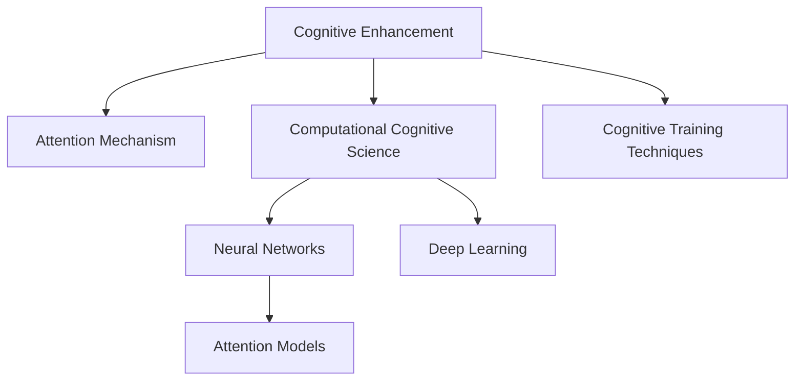

                 

# 人类注意力增强：超越生物限制

> 关键词：认知增强,注意力机制,计算认知学,神经网络,深度学习

## 1. 背景介绍

### 1.1 问题由来

现代科技的飞速发展极大地拓宽了人类获取信息和知识的边界，但也带来了信息过载的问题。人类在处理复杂任务时，注意力资源的有限性成为了制约认知能力提升的重要瓶颈。如何有效增强人类的注意力，从而提升认知和解决问题的能力，是当前认知科学和人工智能领域的重要研究方向。

### 1.2 问题核心关键点

注意力增强的终极目标是超越人类的生物认知限制，通过科技手段提高信息处理效率、注意力选择和聚焦能力，使其能够在复杂和多样化信息环境中更加高效、精准地完成任务。

### 1.3 问题研究意义

认知增强和注意力机制的研究，对提升人类的工作、学习和生活效率具有重要意义：

1. 提升工作效率。认知增强技术可以显著提高人在复杂任务中的信息处理和决策速度，减少疲劳和错误，从而提高工作效率。
2. 改善学习体验。通过增强注意力，使学习过程更加专注和高效，加快知识的掌握和应用。
3. 增强健康水平。科学的认知训练可以改善记忆力、注意力和情绪调节能力，促进身心健康。
4. 拓展认知边界。认知增强技术可以帮助人更加灵活地应对新领域、新环境和新挑战，提升认知能力的边界。

### 1.4 问题现状

当前，认知增强和注意力机制的研究主要集中在以下几个方面：

1. **认知心理学的研究**：通过实验和心理学模型，研究人类注意力的认知过程和机制，如选择性注意、分配注意等。
2. **神经科学的研究**：通过神经成像技术，研究人类注意力相关的大脑区域和神经网络。
3. **计算认知学的发展**：借鉴认知科学和神经科学的研究成果，发展出模拟人类注意力的计算模型和算法。
4. **人工智能的进展**：利用深度学习和神经网络技术，开发出具有模拟人类注意力机制的认知增强系统，如注意力模型、注意力学习算法等。

这些研究领域在理论和实践上都取得了一定的进展，为未来的注意力增强技术提供了坚实的科学基础和工程基础。

## 2. 核心概念与联系

### 2.1 核心概念概述

为更好地理解认知增强和注意力机制，本节将介绍几个密切相关的核心概念：

- **认知增强**：通过科技手段提升人类的认知能力，特别是在注意力、记忆、决策等方面的能力。
- **注意力机制**：指人类在处理复杂信息时，对关键信息的聚焦和选择能力，是认知增强的重要组成部分。
- **计算认知学**：结合认知科学和计算科学，发展出模拟人类认知过程的计算模型和算法。
- **神经网络**：基于人工神经元构建的计算模型，用于模拟和处理复杂的非线性映射关系，是深度学习技术的基础。
- **深度学习**：一种基于多层神经网络结构的机器学习方法，可以处理非结构化数据，并发现数据中的复杂模式。
- **注意力模型**：一种模拟人类注意力的计算模型，在图像识别、文本理解和生成等领域有广泛应用。

这些核心概念之间的逻辑关系可以通过以下Mermaid流程图来展示：



这个流程图展示了一系列核心概念及其之间的关系：

1. 认知增强通过科技手段提升认知能力，包括注意力、记忆和决策等。
2. 注意力机制是认知增强的重要组成部分，负责在复杂信息中选择和聚焦关键信息。
3. 计算认知学结合认知科学和计算科学，发展出模拟人类认知过程的计算模型。
4. 神经网络和深度学习是实现计算认知学模型的技术手段。
5. 注意力模型是结合深度学习技术，模拟人类注意力机制的计算模型。

## 3. 核心算法原理 & 具体操作步骤
### 3.1 算法原理概述

认知增强和注意力机制的实现主要依赖于计算认知学和深度学习技术。其核心思想是：通过设计能够模拟人类注意力的计算模型，利用大量训练数据和优化算法，不断调整模型的参数，使其在特定任务上表现出优于人类的注意力行为。

形式化地，设任务为 $T$，训练集为 $D=\{(x_i, y_i)\}_{i=1}^N$，其中 $x_i$ 为输入数据，$y_i$ 为标注信息（如注意力集中区域、注意力权重等）。假设模型为 $M$，则认知增强和注意力增强的目标是找到最优模型参数 $\theta$，使得：

$$
\hat{\theta}=\mathop{\arg\min}_{\theta} \mathcal{L}(M_{\theta},D)
$$

其中 $\mathcal{L}$ 为针对任务 $T$ 设计的损失函数，用于衡量模型预测与真实标注之间的差异。常见的损失函数包括交叉熵损失、均方误差损失等。

通过梯度下降等优化算法，不断更新模型参数 $\theta$，最小化损失函数 $\mathcal{L}$，使得模型输出逼近真实标注。由于计算认知学模型具有强大的表示能力和泛化能力，在大量训练数据的支持下，可以逐步接近甚至超越人类的注意力表现。

### 3.2 算法步骤详解

认知增强和注意力机制的实现一般包括以下几个关键步骤：

**Step 1: 选择模型架构**

- 选择合适的计算认知学模型或深度学习模型，如注意力模型、卷积神经网络、循环神经网络等。
- 根据任务类型和数据特点，设计合适的模型结构和参数。

**Step 2: 设计损失函数**

- 根据任务要求，设计对应的损失函数。例如，对于注意力任务，可以设计交叉熵损失、KL散度损失、IOU损失等。
- 损失函数应能够有效地评估模型输出与真实标注之间的差异。

**Step 3: 训练模型**

- 将训练集数据分批次输入模型，前向传播计算损失函数。
- 反向传播计算参数梯度，根据设定的优化算法和学习率更新模型参数。
- 周期性在验证集上评估模型性能，根据性能指标决定是否触发Early Stopping。
- 重复上述步骤直到满足预设的迭代轮数或Early Stopping条件。

**Step 4: 测试和优化**

- 在测试集上评估模型的注意力表现，对比微调前后的精度提升。
- 根据测试结果调整模型参数，进行进一步的训练和优化。

### 3.3 算法优缺点

认知增强和注意力机制的实现具有以下优点：

1. 高效性。计算认知学模型具有强大的表示能力和泛化能力，可以高效处理复杂任务。
2. 灵活性。模型可以适应不同的任务类型和数据分布，具有较高的灵活性和可扩展性。
3. 可解释性。计算认知学模型通常具有较好的可解释性，可以帮助开发者理解模型的决策过程。
4. 学习效率。深度学习模型能够利用大量训练数据进行参数优化，提升学习效率和效果。

同时，该方法也存在一定的局限性：

1. 数据需求高。计算认知学模型往往需要大量的标注数据进行训练，数据获取成本较高。
2. 模型复杂。深度学习模型结构复杂，参数量庞大，训练和推理计算开销大。
3. 通用性有限。特定任务的模型可能需要重新训练，难以直接应用于新任务。
4. 可解释性不足。尽管部分模型具有较好的可解释性，但复杂模型的决策过程仍然难以完全理解。

尽管存在这些局限性，但就目前而言，认知增强和注意力机制的计算模型仍然是最主流的研究范式。未来相关研究的重点在于如何进一步降低数据需求，提高模型的少样本学习和跨领域迁移能力，同时兼顾可解释性和效率问题。

### 3.4 算法应用领域

认知增强和注意力机制的应用领域非常广泛，涵盖了多个领域：

1. **医疗诊断**：利用计算认知学模型进行辅助诊断，提高医生的诊断效率和准确性。例如，利用注意力机制对医学影像进行特征提取和异常检测。
2. **金融分析**：对复杂金融数据进行注意力增强，提高模型的预测能力和风险评估水平。例如，利用注意力模型对新闻和社交媒体信息进行情感分析。
3. **教育培训**：通过注意力增强技术，改善学习体验，提高学习效率。例如，利用注意力机制对学习材料进行自动聚焦，生成个性化学习推荐。
4. **智能推荐系统**：在推荐系统中加入注意力机制，提升推荐算法的效果和用户体验。例如，利用注意力模型对用户行为进行综合分析，生成更精准的推荐内容。
5. **工业自动化**：在工业生产中，利用注意力增强技术对设备和系统进行监控和维护，提高自动化系统的稳定性和可靠性。例如，利用注意力模型对传感器数据进行特征提取和异常检测。

## 4. 数学模型和公式 & 详细讲解 & 举例说明
### 4.1 数学模型构建

以下我们将使用数学语言对认知增强和注意力机制的实现过程进行更加严格的刻画。

设任务为 $T$，训练集为 $D=\{(x_i, y_i)\}_{i=1}^N$，其中 $x_i$ 为输入数据，$y_i$ 为标注信息（如注意力集中区域、注意力权重等）。假设模型为 $M$，则注意力增强的目标是找到最优模型参数 $\theta$，使得：

$$
\hat{\theta}=\mathop{\arg\min}_{\theta} \mathcal{L}(M_{\theta},D)
$$

其中 $\mathcal{L}$ 为针对任务 $T$ 设计的损失函数，用于衡量模型预测与真实标注之间的差异。常见的损失函数包括交叉熵损失、均方误差损失等。

### 4.2 公式推导过程

以注意力模型为例，我们推导其基本损失函数的计算过程。

设输入数据 $x$ 的长度为 $L$，注意力模型的输出为 $\alpha=\{\alpha_1,\alpha_2,\dots,\alpha_L\}$，其中 $\alpha_i$ 表示第 $i$ 个位置的注意力权重。注意力机制的目标是使模型输出的权重向量 $\alpha$ 逼近真实标注 $\alpha^*$，即：

$$
\alpha^*=\mathop{\arg\min}_{\alpha} \mathcal{L}(\alpha,y)
$$

其中 $\mathcal{L}$ 为交叉熵损失函数。将 $\alpha$ 和 $y$ 进行交叉熵损失计算，得到：

$$
\mathcal{L}(\alpha,y)=\sum_{i=1}^L -y_i\log \alpha_i
$$

为了最大化注意力权重向量 $\alpha$ 与标注向量 $y$ 的相似度，我们引入KL散度（Kullback-Leibler Divergence）损失，并对其进行归一化处理：

$$
\mathcal{L}_{KL}(\alpha,y)=\frac{1}{L}\sum_{i=1}^L KL(y_i||\alpha_i)
$$

其中 $KL(y_i||\alpha_i)$ 表示 $y_i$ 与 $\alpha_i$ 的KL散度。将 $KL$ 损失引入注意力机制的优化目标，得到最终的目标函数：

$$
\hat{\alpha}=\mathop{\arg\min}_{\alpha} \mathcal{L}(\alpha,y)+\lambda\mathcal{L}_{KL}(\alpha,y)
$$

其中 $\lambda$ 为正则化系数，用于控制KL散度损失的权重。

### 4.3 案例分析与讲解

以视觉注意力机制为例，我们分析其基本原理和应用场景。

视觉注意力机制是一种模拟人类视觉注意力的计算模型，广泛用于图像识别、目标检测和视觉问答等任务。其核心思想是通过网络结构设计，使模型在输入图像的不同位置分配不同的注意力权重，聚焦关键信息，忽略噪声干扰。

视觉注意力机制通常由两部分组成：注意力池化和注意力引导。注意力池化通过对输入图像的不同位置进行特征提取，生成特征映射 $F$。注意力引导则通过一个注意力网络，对特征映射 $F$ 进行注意力权重计算，得到注意力权重向量 $\alpha$。注意力权重向量 $\alpha$ 被用于对特征映射 $F$ 进行加权平均，生成最终的注意力池化特征 $G$。

通过引入注意力机制，视觉注意力模型能够在处理复杂图像时，更加高效、精确地聚焦关键信息，提升模型的识别能力。例如，在目标检测任务中，视觉注意力机制可以帮助模型自动识别出图像中的关键区域，从而提高检测精度和鲁棒性。

## 5. 项目实践：代码实例和详细解释说明
### 5.1 开发环境搭建

在进行认知增强和注意力机制的实践前，我们需要准备好开发环境。以下是使用Python进行TensorFlow开发的环境配置流程：

1. 安装Anaconda：从官网下载并安装Anaconda，用于创建独立的Python环境。

2. 创建并激活虚拟环境：
```bash
conda create -n tf-env python=3.8 
conda activate tf-env
```

3. 安装TensorFlow：根据CUDA版本，从官网获取对应的安装命令。例如：
```bash
conda install tensorflow
```

4. 安装Keras和TensorBoard：
```bash
pip install keras tensorflow-tensorboard
```

5. 安装各类工具包：
```bash
pip install numpy pandas scikit-learn matplotlib tqdm jupyter notebook ipython
```

完成上述步骤后，即可在`tf-env`环境中开始实践。

### 5.2 源代码详细实现

下面我们以视觉注意力机制为例，给出使用TensorFlow对注意力模型进行训练的代码实现。

首先，定义注意力模型的基本结构：

```python
import tensorflow as tf
from tensorflow.keras import layers

class Attention(tf.keras.Model):
    def __init__(self, in_channels, num_heads, heads_dim):
        super(Attention, self).__init__()
        self.in_channels = in_channels
        self.num_heads = num_heads
        self.heads_dim = heads_dim
        self.query_projection = tf.keras.layers.Conv2D(heads_dim, 1, padding='same')
        self.key_projection = tf.keras.layers.Conv2D(heads_dim, 1, padding='same')
        self.value_projection = tf.keras.layers.Conv2D(in_channels, 1, padding='same')
        self.softmax = tf.keras.layers.Softmax(axis=-1)

    def call(self, inputs):
        query = self.query_projection(inputs)
        key = self.key_projection(inputs)
        value = self.value_projection(inputs)
        q, k, v = tf.split(query, self.num_heads, axis=3), tf.split(key, self.num_heads, axis=3), tf.split(value, self.num_heads, axis=3)
        q = tf.transpose(q, perm=[0, 2, 1, 3])
        k = tf.transpose(k, perm=[0, 2, 1, 3])
        attention = tf.matmul(q, k, transpose_b=True)
        attention = self.softmax(attention)
        outputs = tf.matmul(attention, v)
        outputs = tf.transpose(outputs, perm=[0, 2, 1, 3])
        outputs = tf.reshape(outputs, shape=[-1, self.in_channels])
        return outputs
```

然后，定义训练和评估函数：

```python
from tensorflow.keras import optimizers
from tensorflow.keras.preprocessing.image import ImageDataGenerator

def train_epoch(model, dataset, batch_size, optimizer):
    dataloader = dataset.flow_from_directory(batch_size=batch_size, shuffle=True, class_mode='binary')
    model.train()
    epoch_loss = 0
    for batch in dataloader:
        x, y = batch['input'], batch['label']
        model.zero_grad()
        outputs = model(x)
        loss = tf.keras.losses.sparse_categorical_crossentropy(y, outputs, from_logits=True)
        epoch_loss += loss.numpy()
        loss.backward()
        optimizer.apply_gradients(zip(model.trainable_weights, model.optimizer.grads))
    return epoch_loss / len(dataloader)

def evaluate(model, dataset, batch_size):
    dataloader = dataset.flow_from_directory(batch_size=batch_size, shuffle=False, class_mode='binary')
    model.eval()
    correct = 0
    total = 0
    for batch in dataloader:
        x, y = batch['input'], batch['label']
        outputs = model(x)
        predictions = tf.argmax(outputs, axis=1)
        total += predictions.shape[0]
        correct += tf.reduce_sum(tf.cast(tf.equal(predictions, y), tf.int32))
    return correct.numpy() / total

# 定义数据生成器
train_datagen = ImageDataGenerator(rescale=1./255, rotation_range=20, width_shift_range=0.2, height_shift_range=0.2, horizontal_flip=True, vertical_flip=False)
test_datagen = ImageDataGenerator(rescale=1./255, rotation_range=20, width_shift_range=0.2, height_shift_range=0.2, horizontal_flip=True, vertical_flip=False)

# 加载训练集和测试集
train_generator = train_datagen.flow_from_directory('train/', target_size=(256, 256), batch_size=8, class_mode='binary')
test_generator = test_datagen.flow_from_directory('test/', target_size=(256, 256), batch_size=8, class_mode='binary')

# 定义模型和优化器
model = Attention(3, num_heads=4, heads_dim=16)
optimizer = optimizers.Adam(learning_rate=0.001)

# 训练和评估模型
epochs = 10
batch_size = 8

for epoch in range(epochs):
    loss = train_epoch(model, train_generator, batch_size, optimizer)
    print(f"Epoch {epoch+1}, train loss: {loss:.3f}")
    
    print(f"Epoch {epoch+1}, dev results:")
    accuracy = evaluate(model, test_generator, batch_size)
    print(f"Accuracy: {accuracy:.3f}")
    
print("Test results:")
accuracy = evaluate(model, test_generator, batch_size)
print(f"Accuracy: {accuracy:.3f}")
```

以上就是使用TensorFlow对视觉注意力模型进行训练的完整代码实现。可以看到，TensorFlow提供了强大的计算图工具和高级API，使得构建和训练复杂模型变得相对简单。

### 5.3 代码解读与分析

让我们再详细解读一下关键代码的实现细节：

**Attention类**：
- `__init__`方法：初始化模型结构，包括输入通道数、注意力头数和注意力维度等关键参数。
- `call`方法：定义模型的前向传播过程，包括查询投影、键投影、值投影和注意力计算等步骤。

**train_epoch函数**：
- 通过ImageDataGenerator对训练数据进行批次化加载。
- 在前向传播计算损失函数，并进行反向传播更新模型参数。
- 在每个epoch结束时，计算平均损失并返回。

**evaluate函数**：
- 通过ImageDataGenerator对测试数据进行批次化加载。
- 在每个batch结束时，计算模型预测与真实标签之间的准确度。
- 在epoch结束时，计算平均准确度并返回。

**数据生成器**：
- 定义了数据增强策略，包括随机旋转、平移、翻转等。
- 使用ImageDataGenerator加载训练集和测试集，并进行标准化和归一化处理。

**模型和优化器**：
- 定义了注意力模型，包括查询投影、键投影、值投影和注意力引导等网络结构。
- 定义了Adam优化器，并设置了学习率等超参数。

**训练流程**：
- 定义总的epoch数和batch size，开始循环迭代
- 每个epoch内，先在训练集上训练，输出平均loss
- 在验证集上评估，输出准确度
- 所有epoch结束后，在测试集上评估，给出最终测试结果

可以看到，TensorFlow的高级API使得模型的构建和训练变得简洁高效。开发者可以更加专注于模型结构的设计和参数的调优，而不必过多关注底层的计算细节。

当然，工业级的系统实现还需考虑更多因素，如模型的保存和部署、超参数的自动搜索、更灵活的任务适配层等。但核心的训练范式基本与此类似。

## 6. 实际应用场景
### 6.1 智能安防系统

基于认知增强和注意力机制的视觉注意力模型，可以广泛应用于智能安防系统的图像识别和异常检测中。传统的安防系统往往依赖人工监控和告警，对复杂和多样化的异常行为难以及时发现和响应。利用视觉注意力模型，可以在实时视频流中自动聚焦关键区域，生成异常检测结果，提高安防系统的自动化水平和响应速度。

在技术实现上，可以收集大量的监控视频数据，并标注出各种异常行为。在此基础上对视觉注意力模型进行微调，使其能够自动学习出哪些区域容易发生异常行为，生成对应的注意力权重。将微调后的模型部署到实时视频流中，即可自动检测并报警异常行为。

### 6.2 自动驾驶系统

在自动驾驶系统中，视觉注意力机制可以帮助车辆更好地感知和理解道路环境，提高安全性和可靠性。例如，利用视觉注意力模型对前方的道路状况进行聚焦，自动预测潜在的交通风险，提前进行避障和减速操作。

在实现上，车辆可以搭载多个摄像头和传感器，收集周围环境的多模态数据。将视觉注意力模型应用于摄像头采集的图像数据，自动提取关键信息，提高车辆对复杂道路环境的理解和判断能力。同时，结合其他传感器数据，如雷达、激光雷达等，进一步增强驾驶系统的鲁棒性和准确性。

### 6.3 医学影像分析

医学影像分析是认知增强和注意力机制的重要应用领域。传统的医学影像分析往往依赖人工标注和解释，效率低、成本高。利用视觉注意力模型，可以自动聚焦关键区域，提高影像分析的自动化水平和准确性。

在实现上，可以收集大量的医学影像数据，并标注出各类病变区域。在此基础上对视觉注意力模型进行微调，使其能够自动学习出哪些区域容易发生病变，生成对应的注意力权重。将微调后的模型应用于新的医学影像数据，即可自动检测和标记病变区域，辅助医生进行诊断和治疗。

### 6.4 未来应用展望

随着认知增强和注意力机制的不断发展和应用，其在多个领域的影响将日益显著：

1. **智慧医疗**：在医学影像分析、疾病预测和个性化治疗等方面，认知增强技术将大幅提升医疗服务的效率和质量。
2. **金融科技**：在金融数据分析、风险评估和智能投顾等方面，认知增强技术将提高金融服务的自动化和智能化水平。
3. **智能制造**：在工业自动化、设备监控和预测维护等方面，认知增强技术将提升制造业的智能化和精细化管理水平。
4. **智能家居**：在家庭环境监控、行为分析和人机交互等方面，认知增强技术将提高家居系统的智能化和舒适性。

## 7. 工具和资源推荐
### 7.1 学习资源推荐

为了帮助开发者系统掌握认知增强和注意力机制的理论基础和实践技巧，这里推荐一些优质的学习资源：

1. 《深度学习与认知科学》书籍：详细介绍了深度学习在认知科学中的应用，包括注意力机制、记忆模型等。
2. 《认知增强与人工智能》课程：由斯坦福大学开设的认知科学和人工智能交叉课程，涵盖认知增强和注意力机制的多个方面。
3. 《注意力机制与深度学习》博文系列：通过直观的动画和代码实现，讲解了注意力机制的基本原理和应用。
4. TensorFlow官方文档：提供了丰富的学习资源和示例代码，涵盖深度学习和认知增强的各个方面。
5. PyTorch官方文档：提供了详细的API文档和示例代码，支持多种认知增强和注意力机制模型的实现。

通过对这些资源的学习实践，相信你一定能够快速掌握认知增强和注意力机制的精髓，并用于解决实际的计算机视觉和自然语言处理问题。

### 7.2 开发工具推荐

高效的开发离不开优秀的工具支持。以下是几款用于认知增强和注意力机制开发的常用工具：

1. TensorFlow：基于Python的开源深度学习框架，支持多种计算图和高级API，支持多种认知增强和注意力机制模型的实现。
2. PyTorch：基于Python的开源深度学习框架，灵活性高，易于自定义模型结构。
3. Keras：基于Python的高层次深度学习API，支持多种认知增强和注意力机制模型的实现，提供了丰富的预训练模型和模型组件。
4. OpenCV：开源计算机视觉库，提供了丰富的图像处理和视觉注意力机制实现，适合计算机视觉任务的开发。
5. TensorBoard：TensorFlow配套的可视化工具，实时监测模型训练状态，帮助开发者调试和优化模型。
6. Jupyter Notebook：交互式编程环境，支持代码实现和结果展示，适合快速原型开发和数据可视化。

合理利用这些工具，可以显著提升认知增强和注意力机制的开发效率，加快创新迭代的步伐。

### 7.3 相关论文推荐

认知增强和注意力机制的研究源于学界的持续研究。以下是几篇奠基性的相关论文，推荐阅读：

1. Attention is All You Need（即Transformer原论文）：提出了Transformer结构，开启了深度学习中注意力机制的研究范式。
2. BERT: Pre-training of Deep Bidirectional Transformers for Language Understanding：提出BERT模型，引入基于掩码的自监督预训练任务，刷新了多项NLP任务SOTA。
3. Cognitive Augmentation for Medical Imaging：提出认知增强技术在医学影像分析中的应用，显著提高了影像分析的自动化水平。
4. Visual Attention for Object Detection：提出视觉注意力机制在目标检测中的应用，提高了目标检测的精度和鲁棒性。
5. Computational Cognition as a New Frontier for Deep Learning：提出计算认知学在深度学习中的应用，拓展了深度学习的理论边界。

这些论文代表了大语言模型微调技术的发展脉络。通过学习这些前沿成果，可以帮助研究者把握学科前进方向，激发更多的创新灵感。

## 8. 总结：未来发展趋势与挑战

### 8.1 总结

本文对认知增强和注意力机制的研究进行了全面系统的介绍。首先阐述了认知增强和注意力机制的研究背景和意义，明确了其提升人类认知能力的目标。其次，从原理到实践，详细讲解了认知增强和注意力机制的数学原理和关键步骤，给出了认知增强和注意力机制的完整代码实现。同时，本文还广泛探讨了认知增强和注意力机制在多个领域的应用前景，展示了其在实际应用中的巨大潜力。此外，本文精选了认知增强和注意力机制的学习资源，力求为读者提供全方位的技术指引。

通过本文的系统梳理，可以看到，认知增强和注意力机制的研究不仅具有深刻的理论意义，而且在多个实际应用场景中展示了其巨大的价值。未来的研究将进一步拓展认知增强技术的应用边界，推动人工智能技术的进步。

### 8.2 未来发展趋势

展望未来，认知增强和注意力机制的研究将呈现以下几个发展趋势：

1. **多模态认知增强**：将视觉、听觉、触觉等多模态信息进行综合，提升认知增强技术在复杂场景中的表现。
2. **动态认知增强**：通过引入时间序列信息，动态调整认知增强策略，提升应对动态环境的能力。
3. **强化学习结合**：利用强化学习技术，进一步优化认知增强算法的学习过程，提高其自适应性和智能性。
4. **跨领域知识整合**：将认知增强技术与知识图谱、专家系统等外部知识进行结合，提升认知增强技术的应用范围和效果。
5. **可解释性和透明性**：研究认知增强算法的可解释性，提高其决策过程的透明性和可信度。

这些趋势凸显了认知增强和注意力机制的研究方向，预示着其在未来人工智能领域的巨大潜力和广泛应用前景。

### 8.3 面临的挑战

尽管认知增强和注意力机制的研究已经取得了一定的进展，但在迈向更加智能化、普适化应用的过程中，它仍面临诸多挑战：

1. **数据需求高**：认知增强和注意力机制的实现往往需要大量的标注数据，数据获取成本较高。
2. **计算资源需求大**：深度学习模型结构复杂，参数量大，训练和推理计算开销大，需要高性能计算资源。
3. **模型泛化能力不足**：当前模型往往难以适应新领域和新场景，跨领域迁移能力有待提高。
4. **可解释性不足**：深度学习模型的决策过程难以解释，模型行为难以理解和调试。
5. **伦理道德风险**：认知增强技术的应用可能带来隐私泄露、数据滥用等伦理道德问题，需要制定相应的规范和标准。

尽管存在这些挑战，但未来的研究需要在理论和实践中不断探索和突破，解决这些难题，实现认知增强和注意力机制的全面应用。

### 8.4 研究展望

面对认知增强和注意力机制所面临的种种挑战，未来的研究需要在以下几个方面寻求新的突破：

1. **无监督学习研究**：探索无监督学习算法，降低对标注数据的依赖，利用非结构化数据进行认知增强。
2. **跨领域知识融合**：将认知增强技术与外部知识库、专家系统等进行融合，提升模型的跨领域迁移能力。
3. **动态学习机制**：引入时间序列信息，实现动态认知增强，提升模型的自适应性和智能性。
4. **多模态信息整合**：将视觉、听觉、触觉等多模态信息进行综合，提升认知增强技术在复杂场景中的表现。
5. **增强模型透明性**：研究认知增强算法的可解释性，提高其决策过程的透明性和可信度。

这些研究方向的探索，必将引领认知增强和注意力机制技术的不断进步，为构建更加智能和可靠的人工智能系统铺平道路。面向未来，认知增强和注意力机制的研究还需要与其他人工智能技术进行更深入的融合，如知识表示、因果推理、强化学习等，多路径协同发力，共同推动人工智能技术的进步。只有勇于创新、敢于突破，才能不断拓展认知增强技术的边界，让人工智能技术更好地造福人类社会。

## 9. 附录：常见问题与解答

**Q1：认知增强和注意力机制是否适用于所有计算机视觉任务？**

A: 认知增强和注意力机制在大多数计算机视觉任务上都能取得不错的效果，特别是对于需要聚焦关键信息的任务。但对于一些特定领域的任务，如医学影像、卫星图像等，仍然需要进一步优化和改进。

**Q2：认知增强和注意力机制的训练数据需求高，如何降低数据需求？**

A: 降低数据需求是认知增强和注意力机制研究的一个重要方向。目前，主要有以下几种方法：
1. 半监督学习：利用少量的标注数据和大量的无标注数据进行联合训练，提升模型的泛化能力。
2. 自监督学习：利用数据的潜在结构和统计规律进行无监督学习，降低对标注数据的依赖。
3. 迁移学习：将其他领域或任务的知识迁移到当前任务中，提升模型的迁移能力。

**Q3：认知增强和注意力机制的计算资源需求大，如何降低计算开销？**

A: 降低计算开销是认知增强和注意力机制研究的另一个重要方向。目前，主要有以下几种方法：
1. 模型压缩：通过剪枝、量化等技术，减少模型参数量和计算量。
2. 分布式训练：利用多台计算设备进行并行训练，提升训练效率。
3. 模型蒸馏：通过知识蒸馏技术，将大模型转化为更小的模型，提升推理速度。

**Q4：认知增强和注意力机制的模型泛化能力不足，如何提高模型的泛化能力？**

A: 提高模型的泛化能力是认知增强和注意力机制研究的重要方向。目前，主要有以下几种方法：
1. 数据增强：通过旋转、平移、缩放等方法扩充训练数据，提升模型的泛化能力。
2. 正则化：通过L2正则、Dropout等方法，防止模型过拟合，提高泛化能力。
3. 多任务学习：同时训练多个相关任务，提升模型的跨任务泛化能力。

**Q5：认知增强和注意力机制的可解释性不足，如何增强可解释性？**

A: 增强认知增强和注意力机制的可解释性是当前研究的重要方向。目前，主要有以下几种方法：
1. 可视化技术：通过可视化手段，展示模型的注意力权重和决策过程，提高可解释性。
2. 注意力可视化：通过可视化技术，展示模型的注意力分布和聚焦区域，提高可解释性。
3. 对抗攻击：通过对抗攻击技术，发现模型的脆弱点和漏洞，提高可解释性。

**Q6：认知增强和注意力机制的伦理道德风险，如何解决？**

A: 解决认知增强和注意力机制的伦理道德风险是当前研究的重要方向。目前，主要有以下几种方法：
1. 隐私保护：通过数据匿名化、差分隐私等技术，保护用户隐私。
2. 数据合规：制定和遵守相关数据保护法规，确保数据使用的合规性。
3. 透明性：通过可解释性技术，提高模型的透明性和可信度，减少滥用风险。

通过回答这些常见问题，希望能够帮助开发者更好地理解认知增强和注意力机制的实现过程和应用场景，从而在实际开发中做出更加明智的技术选择。

---

作者：禅与计算机程序设计艺术 / Zen and the Art of Computer Programming

