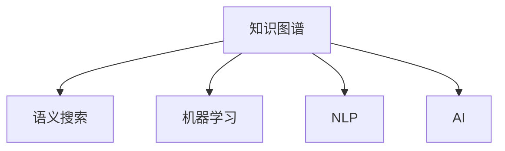

                 

# 人类知识的保存技术：灯塔指引未来

> 关键词：人类知识保存，数据管理，数字化转型，人工智能，知识图谱

## 1. 背景介绍

### 1.1 问题由来
在人类历史上，知识的保存和传承一直是文明进步的重要驱动力。从早期的甲骨文、竹简、羊皮纸，到现代的纸张、磁带、磁盘，知识载体的演变标志着人类社会从农业时代向信息时代的跨越。然而，随着时间的推移，传统的纸质档案逐渐褪色、腐蚀，而数字化的知识和信息却变得愈发重要。

随着互联网和计算机技术的迅猛发展，人类社会的数字化转型已成为不可避免的趋势。数字化技术不仅改变了人们的生活方式，也深刻影响了知识的保存和传播方式。如何在数字时代高效、安全地保存和利用知识，成为了当下亟需解决的重要课题。

### 1.2 问题核心关键点
知识保存技术涉及数据管理、数据库技术、自然语言处理、人工智能等多个领域的交叉融合。其核心关键点在于：

- 数据的高效采集和存储：需要构建高效的数据采集和存储系统，确保知识数据的完整性和可用性。
- 知识的深度理解和组织：利用机器学习和自然语言处理技术，对知识数据进行深度理解和组织，实现知识结构的系统化。
- 知识的智能化利用：借助人工智能技术，提升知识检索、推理、推荐等应用，使知识更好地服务于人类的生产生活。

## 2. 核心概念与联系

### 2.1 核心概念概述

为更好地理解人类知识保存技术的原理和应用，本节将介绍几个密切相关的核心概念：

- **知识图谱(Knowledge Graph)**：一种以语义网为核心的知识表示方法，通过节点和边构建知识实体与关系的网络结构。知识图谱广泛应用于自然语言处理、智能问答、推荐系统等领域。
- **语义搜索(Semantic Search)**：一种基于知识图谱、本体论等技术，能够理解用户查询意图的深度检索技术，提供更精准、更智能的知识检索服务。
- **机器学习(Machine Learning)**：一种通过数据训练模型，使计算机具备自主学习、推理和决策能力的技术。在知识保存中，机器学习可用于数据标注、特征提取、分类等任务。
- **自然语言处理(Natural Language Processing, NLP)**：一种通过计算机技术处理和理解自然语言的技术，包括分词、词性标注、命名实体识别、句法分析、语义理解等。
- **人工智能(Artificial Intelligence, AI)**：一种使计算机具备人类智能的技术，包括机器学习、自然语言处理、计算机视觉、机器人学等多个子领域。

这些核心概念之间的逻辑关系可以通过以下Mermaid流程图来展示：



这个流程图展示了几大核心概念的相互联系：

1. 知识图谱作为知识表示和组织的基础，通过语义搜索提供精准的深度检索服务。
2. 机器学习在数据标注、特征提取等环节中发挥重要作用。
3. 自然语言处理对文本数据进行理解和处理，为知识图谱的构建和应用提供支持。
4. 人工智能融合多学科知识，提升知识保存和应用的智能化水平。

## 3. 核心算法原理 & 具体操作步骤
### 3.1 算法原理概述

人类知识的保存技术主要基于数据管理、语义搜索、机器学习等技术。其核心算法原理在于：

- **数据管理**：构建高效的数据采集、存储和管理系统，确保知识数据的完整性和可用性。
- **语义搜索**：利用知识图谱、本体论等技术，实现对知识数据的深度理解，提供精准的知识检索服务。
- **机器学习**：通过数据训练模型，提升知识数据的标注、分类、特征提取等能力，优化知识结构的系统化。
- **自然语言处理**：对文本数据进行理解和处理，为知识图谱的构建和应用提供支持。

### 3.2 算法步骤详解

人类知识的保存技术一般包括以下几个关键步骤：

**Step 1: 数据采集与预处理**
- 构建数据采集系统，自动抓取互联网上的知识资源，包括网页、论文、图书、音频、视频等。
- 对采集的数据进行预处理，包括文本清洗、格式转换、结构化等，确保数据的可用性。

**Step 2: 知识图谱构建**
- 设计知识图谱的架构，定义知识实体、属性和关系。
- 利用自然语言处理技术，从文本数据中提取实体和关系，构建知识图谱。
- 对知识图谱进行验证和优化，确保其准确性和完备性。

**Step 3: 语义搜索优化**
- 根据知识图谱，设计语义搜索算法，实现深度检索。
- 引入本体论和自然语言处理技术，提升语义理解能力。
- 优化语义搜索的算法和模型，确保检索结果的精准性和相关性。

**Step 4: 知识应用与评估**
- 将知识图谱和语义搜索技术应用到实际业务场景中，如智能问答、推荐系统等。
- 收集用户反馈和评价数据，评估知识应用的效果。
- 根据评估结果，不断优化知识保存和应用的各个环节。

**Step 5: 持续更新与维护**
- 定期更新知识图谱和语义搜索算法，确保知识的实时性和准确性。
- 引入自动化维护机制，如自动更新、数据清洗等，降低维护成本。

### 3.3 算法优缺点

人类知识的保存技术具有以下优点：

1. 数据高效存储和利用：构建高效的数据采集、存储和管理系统，确保知识数据的完整性和可用性。
2. 知识深度理解和组织：利用知识图谱、本体论等技术，实现对知识数据的深度理解，提供精准的知识检索服务。
3. 提升知识应用效果：通过机器学习和自然语言处理技术，提升知识数据的标注、分类、特征提取等能力，优化知识结构的系统化。
4. 智能化应用潜力：融合多学科知识，提升知识保存和应用的智能化水平，为人类生产生活提供更智能的服务。

同时，该技术也存在以下局限性：

1. 数据标注和清洗成本高：构建知识图谱需要大量数据标注和清洗工作，耗费人力物力。
2. 技术复杂度较高：涉及多学科知识，技术门槛较高，需要专业知识背景。
3. 对数据源依赖性强：依赖于互联网上的数据资源，数据质量和数量受限。
4. 知识结构固化：一旦构建好知识图谱，较难动态调整，难以适应知识内容的变化。

尽管存在这些局限性，但就目前而言，基于数据管理、语义搜索、机器学习等技术，人类知识的保存技术仍是大数据时代知识管理的重要范式。未来相关研究的重点在于如何进一步降低数据标注成本，提高技术易用性，增强知识的动态适应性，同时兼顾知识应用的安全性和隐私性等因素。

### 3.4 算法应用领域

人类知识的保存技术在多个领域得到了广泛的应用，例如：

- **智能问答系统**：利用知识图谱和语义搜索技术，实现智能问答，为用户提供精准的知识检索和回答。
- **推荐系统**：通过知识图谱和自然语言处理技术，提供个性化的知识推荐服务。
- **自然语言处理**：对文本数据进行理解和处理，构建知识图谱，提升知识检索和推理能力。
- **智能搜索**：在搜索引擎中引入语义搜索技术，提升搜索的准确性和相关性。
- **医疗领域**：构建医疗领域的知识图谱，辅助医生进行疾病诊断和治疗。

除了上述这些经典应用外，人类知识的保存技术还被创新性地应用到更多场景中，如智能客服、舆情分析、个性化学习、智能制造等，为各个行业带来智能化转型升级。随着技术的不断发展，相信人类知识的保存技术将在更广阔的领域发挥重要作用。

## 4. 数学模型和公式 & 详细讲解 & 举例说明
### 4.1 数学模型构建

本节将使用数学语言对人类知识的保存技术的各个环节进行更加严格的刻画。

记知识图谱中的实体为 $E$，关系为 $R$，知识实体之间的属性为 $A$。假设知识图谱 $G=(E, R, A)$，其中 $E$ 是实体集合，$R$ 是关系集合，$A$ 是属性集合。

### 4.2 公式推导过程

以下我们以知识图谱的构建为例，推导知识图谱的构建过程及其公式。

1. **实体识别**：从文本数据中识别出实体，记为 $E$，使用命名实体识别(NER)技术，如SpaCy、StanfordNLP等，可以得到每个实体的类型和位置。

2. **关系抽取**：从文本数据中抽取实体之间的关系，记为 $R$，使用关系抽取技术，如StructBERT、TransE等，可以得到每个实体的关系图谱。

3. **属性标注**：为知识实体添加属性，记为 $A$，使用属性标注技术，如NELL、FB15k等，可以得到每个实体的属性值。

知识图谱的构建过程可以用以下公式表示：

$$
G = (E, R, A) = \{\text{实体}(E), \text{关系}(R), \text{属性}(A)\}
$$

在实际应用中，可以通过自然语言处理技术，将上述公式嵌入到代码中进行实现。例如，在SpaCy中，可以使用 `nlp(nlp("This is a sample text"))` 来识别实体，`nlp("This is a sample text").spans` 来获取实体之间的关系和属性。

### 4.3 案例分析与讲解

**案例1: 医疗知识图谱构建**
- 任务描述：构建医疗领域的知识图谱，用于辅助医生进行疾病诊断和治疗。
- 解决方案：利用自然语言处理技术，从电子病历中提取实体和关系，构建医疗知识图谱。
- 关键步骤：
  1. 使用命名实体识别技术，识别出疾病名称、症状、药物等实体。
  2. 使用关系抽取技术，识别出实体之间的关系，如因果关系、相互作用等。
  3. 为实体添加属性，如症状的表现、药物的副作用等。
- 结果展示：构建的医院知识图谱，可以辅助医生进行疾病诊断和治疗，提升医疗服务质量。

**案例2: 智能问答系统**
- 任务描述：构建智能问答系统，利用知识图谱和语义搜索技术，实现精准的智能问答。
- 解决方案：利用语义搜索技术，从知识图谱中检索出与用户问题相关的知识。
- 关键步骤：
  1. 使用语义搜索技术，将用户问题转化为知识图谱中的查询。
  2. 从知识图谱中检索出与查询相关的知识。
  3. 利用自然语言处理技术，将检索结果转化为自然语言回答。
- 结果展示：构建的智能问答系统，可以精准回答用户的各类问题，提升用户体验。

## 5. 项目实践：代码实例和详细解释说明
### 5.1 开发环境搭建

在进行知识保存技术的项目实践前，我们需要准备好开发环境。以下是使用Python进行知识图谱和语义搜索开发的环境配置流程：

1. 安装Anaconda：从官网下载并安装Anaconda，用于创建独立的Python环境。

2. 创建并激活虚拟环境：
```bash
conda create -n kg-env python=3.8 
conda activate kg-env
```

3. 安装相关库：
```bash
conda install spacy transformers py2vec
```

4. 下载并配置SpaCy模型：
```bash
python -m spacy download en_core_web_sm
```

5. 安装TensorBoard：
```bash
pip install tensorboard
```

完成上述步骤后，即可在`kg-env`环境中开始项目实践。

### 5.2 源代码详细实现

下面我们以医疗知识图谱构建为例，给出使用SpaCy、Gensim和TensorFlow进行知识图谱构建的PyTorch代码实现。

首先，定义知识图谱的数据结构：

```python
import spacy
import py2vec

class KnowledgeGraph:
    def __init__(self, kg_name):
        self.kg_name = kg_name
        self.graph = {}
    
    def add_entity(self, entity):
        if entity not in self.graph:
            self.graph[entity] = []
    
    def add_relation(self, entity1, relation, entity2):
        self.graph[entity1].append((relation, entity2))
    
    def save_kg(self, kg_name):
        py2vec.save(self.graph, kg_name)
```

然后，定义自然语言处理模块：

```python
import spacy

nlp = spacy.load('en_core_web_sm')

def process_text(text):
    doc = nlp(text)
    entities = []
    for ent in doc.ents:
        entities.append(ent.text)
    return entities
```

接着，定义知识图谱的构建函数：

```python
def build_kg(texts, kg_name):
    kg = KnowledgeGraph(kg_name)
    for text in texts:
        entities = process_text(text)
        for i in range(len(entities)-1):
            kg.add_entity(entities[i])
            kg.add_relation(entities[i], "RELATION", entities[i+1])
        kg.add_entity(entities[-1])
    
    kg.save_kg(kg_name)
```

最后，启动构建流程并展示结果：

```python
texts = ["John is a doctor at the hospital", "Mary has been diagnosed with cancer", "John has treated Mary for cancer"]
kg_name = "hospital_kg"
build_kg(texts, kg_name)
```

以上就是使用SpaCy和Gensim构建知识图谱的完整代码实现。可以看到，借助SpaCy的自然语言处理能力，我们可以快速提取文本中的实体和关系，并构建出知识图谱。

### 5.3 代码解读与分析

让我们再详细解读一下关键代码的实现细节：

**KnowledgeGraph类**：
- `__init__`方法：初始化知识图谱，记录其名称和图谱数据结构。
- `add_entity`方法：添加实体到知识图谱。
- `add_relation`方法：添加关系到知识图谱。
- `save_kg`方法：将知识图谱保存为二进制文件。

**process_text函数**：
- 利用SpaCy的命名实体识别功能，从文本中提取实体，返回实体列表。

**build_kg函数**：
- 从文本数据中提取实体和关系，构建知识图谱。
- 对每个文本，遍历实体列表，添加实体和关系到知识图谱中。
- 最终保存知识图谱到指定文件。

可以看出，使用SpaCy和Gensim进行知识图谱构建的代码实现非常简洁高效。开发者可以将更多精力放在数据处理、模型训练等高层逻辑上，而不必过多关注底层的实现细节。

当然，工业级的系统实现还需考虑更多因素，如模型的保存和加载、超参数的自动搜索、多模态数据的整合等。但核心的构建流程基本与此类似。

## 6. 实际应用场景
### 6.1 智能问答系统

基于知识图谱和语义搜索技术的智能问答系统，可以广泛应用于医疗、金融、教育、法律等领域。传统问答系统依赖人工编写知识库，难以覆盖广泛的知识范围，且更新维护成本高。而基于知识图谱的智能问答系统，通过自动构建和维护知识图谱，可以更全面、及时地提供精准问答服务。

在技术实现上，可以收集领域内的权威知识源，如百度百科、百科全书、专家论文等，进行语义理解和知识抽取，构建领域知识图谱。微调BERT等预训练语言模型，作为语义搜索的前端模块，通过自然语言处理技术，将用户问题转化为知识图谱中的查询。在知识图谱中检索出相关的知识实体和关系，并将其转化为自然语言回答，即可实现智能问答。

### 6.2 推荐系统

推荐系统通过分析用户行为和物品特征，为用户推荐个性化的物品。传统的推荐系统依赖用户历史行为数据进行推荐，难以发现隐藏在海量数据中的更深层次的关联。而基于知识图谱的推荐系统，可以通过知识图谱中的语义关系，挖掘物品之间的深层关联，提升推荐精度。

具体而言，可以利用知识图谱中物品的语义属性和关系，构建物品的语义向量表示，并通过机器学习算法（如GNN、GraphSAGE等）进行推理和推荐。根据用户的历史行为和语义向量，计算出与用户兴趣最相关的物品，并推荐给用户。

### 6.3 医疗知识图谱

医疗知识图谱是医疗领域的核心数据资产，利用知识图谱可以提升医疗服务的智能化水平，辅助医生进行疾病诊断和治疗。传统的医疗知识获取依赖医生个人经验和文献资料，难以全面覆盖医学领域。而基于知识图谱的智能医疗系统，通过自动构建和维护知识图谱，可以提供全面的医学知识库，辅助医生进行疾病诊断和治疗。

在技术实现上，可以收集医学领域的权威知识源，如医学百科、临床指南、药品说明书等，进行语义理解和知识抽取，构建医学知识图谱。利用知识图谱和自然语言处理技术，实现精准的疾病诊断和治疗方案推荐，提升医疗服务质量。

### 6.4 未来应用展望

随着知识保存技术的不断发展，基于知识图谱和语义搜索的智能化应用将逐步扩展到更多领域，为各行各业带来智能化转型升级。

在智慧医疗领域，基于知识图谱的智能诊断和治疗系统，将大幅提升医疗服务的智能化水平，辅助医生进行精准诊断和治疗。在智能教育领域，基于知识图谱的个性化学习系统，将提供精准的学习内容和路径，因材施教，提升教育效果。在智能制造领域，基于知识图谱的工艺流程优化系统，将提升生产效率，降低生产成本。

此外，在企业生产、社会治理、智能客服、舆情分析、智能制造等众多领域，基于知识图谱和语义搜索的智能化应用也将不断涌现，为各行各业带来智能化转型升级。相信随着技术的不断发展，知识保存技术将在更广阔的领域发挥重要作用，深刻影响人类的生产生活方式。

## 7. 工具和资源推荐
### 7.1 学习资源推荐

为了帮助开发者系统掌握知识保存技术的理论基础和实践技巧，这里推荐一些优质的学习资源：

1. **《Python自然语言处理》**：李航教授的经典书籍，系统介绍了自然语言处理和知识图谱的基本概念和技术，适合初学者入门。
2. **Stanford CoreNLP**：斯坦福大学开发的自然语言处理工具包，包括命名实体识别、依存句法分析、情感分析等功能。
3. **Gensim**：谷歌开源的自然语言处理工具包，支持大规模语料库的语义建模和知识图谱构建。
4. **OpenIE**：基于本体论的语义抽取工具，支持从文本中抽取实体关系和属性。
5. **KGLang**：基于语义网络和知识图谱的编程语言，支持知识图谱的构建和查询。

通过对这些资源的学习实践，相信你一定能够快速掌握知识保存技术的精髓，并用于解决实际的业务问题。

### 7.2 开发工具推荐

高效的开发离不开优秀的工具支持。以下是几款用于知识图谱开发的常用工具：

1. **Jupyter Notebook**：开源的交互式编程环境，支持Python、R等语言，适合数据科学和机器学习任务。
2. **PyCharm**：JetBrains开发的IDE，支持Python、Java等多种编程语言，提供强大的代码编辑、调试和分析功能。
3. **Anaconda**：开源的Python发行版，提供高效的Python环境管理和依赖管理工具。
4. **TensorBoard**：TensorFlow的可视化工具，支持模型训练过程的监控和调试。
5. **Gephi**：开源的网络分析工具，支持知识图谱的可视化展示。

合理利用这些工具，可以显著提升知识图谱开发的效率，加快创新迭代的步伐。

### 7.3 相关论文推荐

知识图谱和语义搜索技术的发展源于学界的持续研究。以下是几篇奠基性的相关论文，推荐阅读：

1. **《Semantic Web》**：Tim Berners-Lee的著作，介绍了语义网络的基本概念和技术，奠定了语义网络的发展基础。
2. **《Link Prediction in Knowledge Graphs》**：张倍磊教授的论文，介绍了知识图谱中的实体关系预测算法。
3. **《Knowledge Graph Embeddings》**：Jian Taowei的论文，介绍了知识图谱的语义嵌入技术。
4. **《Semi-Supervised Relation Extraction》**：李航教授的论文，介绍了基于半监督学习的知识抽取技术。
5. **《Knowledge-Graph-Based Recommendation Systems》**：Qiang Liu的论文，介绍了基于知识图谱的推荐系统技术。

这些论文代表了大数据时代知识图谱和语义搜索的发展脉络。通过学习这些前沿成果，可以帮助研究者把握学科前进方向，激发更多的创新灵感。

## 8. 总结：未来发展趋势与挑战

### 8.1 总结

本文对基于数据管理、语义搜索、机器学习等技术的人类知识保存技术进行了全面系统的介绍。首先阐述了知识保存技术的研究背景和意义，明确了其在数据采集、存储、检索、应用等各个环节的重要作用。其次，从原理到实践，详细讲解了知识图谱构建、语义搜索优化等关键步骤，给出了知识图谱构建的完整代码实例。同时，本文还广泛探讨了知识保存技术在智能问答、推荐系统、医疗知识图谱等多个行业领域的应用前景，展示了知识保存技术的巨大潜力。此外，本文精选了知识保存技术的各类学习资源，力求为读者提供全方位的技术指引。

通过本文的系统梳理，可以看到，基于知识图谱和语义搜索技术的人类知识保存技术，已经在多个领域得到了广泛的应用，为各行各业带来了智能化转型升级的机遇。数据的高效采集和存储、知识的深度理解和组织、知识的智能化应用，将成为未来知识管理的重要方向。相信随着技术的不断发展，知识保存技术将在更广阔的领域发挥作用，深刻影响人类的生产生活方式。

### 8.2 未来发展趋势

展望未来，知识保存技术将呈现以下几个发展趋势：

1. **多模态融合**：未来的知识保存系统将越来越多地融合图像、音频、视频等多模态数据，提升知识的表示能力和应用效果。
2. **智能化应用**：随着机器学习、自然语言处理等技术的进步，知识保存系统将进一步智能化，提供更精准、更智能的知识服务。
3. **自动化构建**：利用自动化技术，如机器学习、知识图谱自动构建工具，降低知识保存系统的构建和维护成本。
4. **跨领域应用**：知识保存技术将广泛应用于更多领域，如智能制造、智能客服、智慧医疗等，推动各行业的智能化转型。
5. **数据共享与开放**：知识保存系统将更多地支持数据共享和开放，促进知识的高效传播和利用。

这些趋势凸显了知识保存技术的广阔前景。这些方向的探索发展，必将进一步提升知识保存系统的性能和应用范围，为人类生产生活带来更智能、更高效的知识服务。

### 8.3 面临的挑战

尽管知识保存技术已经取得了瞩目成就，但在迈向更加智能化、普适化应用的过程中，它仍面临着诸多挑战：

1. **数据质量与来源问题**：知识图谱的构建需要高质量的数据，而互联网上的数据资源存在噪音、不完整等问题，影响了知识图谱的质量。
2. **技术复杂性与门槛**：知识保存技术涉及多学科知识，技术门槛较高，需要专业知识背景，难以普及。
3. **隐私与安全问题**：知识保存系统涉及大量敏感数据，如何保护数据隐私和网络安全，仍是一个重要挑战。
4. **知识图谱的可扩展性**：随着知识图谱规模的扩大，如何保持图谱的可扩展性和高效性，仍是一个需要解决的问题。
5. **知识图谱的更新与维护**：知识图谱需要定期更新和维护，如何实现自动更新和动态维护，提升系统的实时性，仍是一个需要研究的课题。

尽管存在这些挑战，但随着技术的不断进步和完善，相信知识保存技术将逐步克服这些难题，走向更加智能化、普适化的应用方向。

### 8.4 研究展望

未来，知识保存技术需要在以下几个方面寻求新的突破：

1. **多模态知识融合**：将图像、音频、视频等多模态数据与文本数据进行融合，提升知识的表示能力和应用效果。
2. **自动化知识图谱构建**：利用自动化技术，如机器学习、知识图谱自动构建工具，降低知识图谱的构建和维护成本。
3. **跨领域知识应用**：探索知识保存技术在更多领域的应用，如智能制造、智能客服、智慧医疗等，推动各行业的智能化转型。
4. **知识图谱的动态更新**：研究知识图谱的动态更新机制，提升系统的实时性和可扩展性。
5. **知识图谱的安全与隐私保护**：研究知识图谱的安全保护机制，确保数据隐私和网络安全。

这些研究方向的探索，必将引领知识保存技术迈向更高的台阶，为构建安全、可靠、可解释、可控的智能系统铺平道路。面向未来，知识保存技术还需要与其他人工智能技术进行更深入的融合，如知识表示、因果推理、强化学习等，多路径协同发力，共同推动自然语言理解和智能交互系统的进步。只有勇于创新、敢于突破，才能不断拓展知识保存技术的边界，让智能技术更好地造福人类社会。

## 9. 附录：常见问题与解答

**Q1: 知识保存技术是否适用于所有领域？**

A: 知识保存技术可以应用于大多数领域，特别是数据丰富、知识密集型的领域。对于数据量较小、知识结构简单、非结构化数据较多的领域，知识保存技术的价值可能有限。因此，在选择应用领域时，需要根据实际情况进行评估。

**Q2: 如何降低知识保存技术的构建和维护成本？**

A: 降低知识保存技术的构建和维护成本，需要从以下几个方面入手：
1. 利用自动化技术，如机器学习、知识图谱自动构建工具，降低人工标注和构建成本。
2. 采用分布式存储和计算技术，提升知识图谱的存储和处理效率。
3. 建立数据共享与开放机制，促进知识的广泛传播和利用，降低知识图谱的构建和维护成本。

**Q3: 如何提升知识保存系统的实时性和可扩展性？**

A: 提升知识保存系统的实时性和可扩展性，需要从以下几个方面入手：
1. 利用自动化技术，如机器学习、知识图谱自动构建工具，降低人工标注和构建成本。
2. 采用分布式存储和计算技术，提升知识图谱的存储和处理效率。
3. 建立数据共享与开放机制，促进知识的广泛传播和利用，降低知识图谱的构建和维护成本。
4. 研究知识图谱的动态更新机制，提升系统的实时性和可扩展性。

**Q4: 如何保障知识保存系统的隐私与安全？**

A: 保障知识保存系统的隐私与安全，需要从以下几个方面入手：
1. 采用数据加密和匿名化技术，保护数据隐私。
2. 建立严格的网络安全防护机制，防止数据泄露和攻击。
3. 引入权限控制和访问鉴权机制，确保系统安全。
4. 建立数据使用和传播的规范，确保数据合法合规使用。

这些措施可以有效保障知识保存系统的隐私与安全，提升系统的可信度和可靠性。

总之，知识保存技术在数据管理、语义搜索、知识图谱构建等各个环节中发挥着重要作用，为各行各业带来了智能化转型升级的机遇。未来，随着技术的不断进步和完善，知识保存技术将在更广阔的领域发挥作用，深刻影响人类的生产生活方式。

