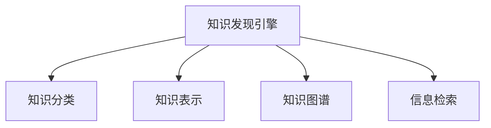
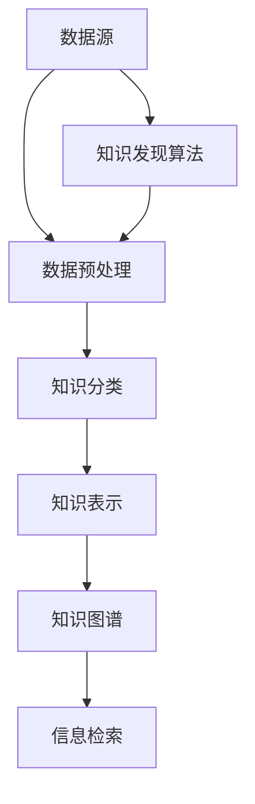

                 

# 人类知识的分类与组织：知识发现引擎的基础

> 关键词：知识发现引擎, 知识分类, 知识组织, 人工智能, 信息检索, 数据管理, 机器学习

## 1. 背景介绍

### 1.1 问题由来

人类知识是人类文明的重要组成部分，其分类与组织是人类智慧的结晶。随着科技的进步，特别是人工智能和大数据技术的发展，如何高效地管理、存储、检索和利用知识，成为当前科技和社会发展的重要课题。知识发现引擎(Knowledge Discovery Engine, KDE)正是为了解决这一问题而产生的。

知识发现引擎是指通过算法和数据技术，自动地从大量数据中发现隐藏的知识和模式，从而支持决策和洞察的一种技术。其核心在于如何将人类知识进行科学的分类和组织，使之能够被机器快速地检索和利用。本论文将从知识分类的角度，阐述知识发现引擎的基本原理和构建方法。

### 1.2 问题核心关键点

知识发现引擎的核心目标是通过自动化的方式，对大规模数据集中的信息进行分析和挖掘，发现潜在知识。其关键点包括：

- 数据的收集和预处理：获取多源异构数据，进行清洗、格式化等预处理操作，使之适于进一步分析。
- 知识的分类和表示：将数据转化为机器可理解的形式，并进行科学分类，建立知识图谱。
- 模式的识别与学习：应用机器学习算法，从数据中提取规律和模式，构建知识库。
- 知识的利用与评估：将发现的知识应用于实际场景，进行验证和评估，不断优化算法和模型。

## 2. 核心概念与联系

### 2.1 核心概念概述

为了更好地理解知识发现引擎，本节将介绍几个密切相关的核心概念：

- 知识发现引擎(Knowledge Discovery Engine, KDE)：通过算法和数据技术，自动地从大量数据中发现隐藏的知识和模式，从而支持决策和洞察的一种技术。
- 知识分类(Knowledge Classification)：将知识按照一定的标准划分为不同的类别，使机器能够更高效地检索和利用知识。
- 知识表示(Knowledge Representation)：将知识转化为机器可理解的形式，如符号表示、逻辑表示、语义网络等。
- 知识图谱(Knowledge Graph)：一种图形化的知识表示方法，通过节点和边来描述实体之间的关系，支持高效的推理和检索。
- 信息检索(Information Retrieval, IR)：从大量数据中检索出与查询相关的信息，通常基于倒排索引等技术。

这些核心概念之间的逻辑关系可以通过以下Mermaid流程图来展示：



这个流程图展示了这个核心概念的相互关系：

1. 知识发现引擎通过算法和数据技术，从大规模数据中发现知识。
2. 知识分类帮助将知识进行科学划分，方便检索和利用。
3. 知识表示将知识转化为机器可理解的形式，是知识检索和推理的基础。
4. 知识图谱提供了一种图形化的知识表示方法，支持高效的检索和推理。
5. 信息检索技术从大规模数据中高效检索出与查询相关的信息。

这些核心概念共同构成了知识发现引擎的知识管理框架，使其能够高效地存储、检索和利用知识。

### 2.2 核心概念原理和架构的 Mermaid 流程图

以下是一个简化的知识发现引擎的架构图，展示了其主要组成部分和它们之间的联系：



这个架构图展示了知识发现引擎的基本流程：

1. 数据源：包括各种异构数据，如文本、图片、视频等。
2. 数据预处理：清洗、格式化数据，使其适于进一步分析。
3. 知识分类：将数据转化为知识，并进行分类。
4. 知识表示：将知识转化为机器可理解的形式。
5. 知识图谱：建立知识图谱，支持高效的检索和推理。
6. 信息检索：从知识图谱中高效检索出与查询相关的信息。
7. 知识发现算法：从数据中发现隐藏的知识和模式。

## 3. 核心算法原理 & 具体操作步骤

### 3.1 算法原理概述

知识发现引擎的核心算法包括数据预处理、知识分类、知识表示、知识图谱构建和信息检索等。这些算法共同构成了知识发现引擎的知识管理框架，其核心思想是通过算法和数据技术，自动地从大量数据中发现隐藏的知识和模式，从而支持决策和洞察。

知识发现引擎通常分为两个阶段：数据预处理和知识发现。在数据预处理阶段，主要任务是对大规模数据进行清洗、格式化、归一化等预处理操作，使之适于进一步分析。在知识发现阶段，主要任务是通过算法和数据技术，从预处理后的数据中发现隐藏的知识和模式。

### 3.2 算法步骤详解

以下是一个典型的知识发现引擎的算法步骤：

1. 数据收集：从多个数据源收集数据，如文本、图片、视频等。
2. 数据预处理：对收集到的数据进行清洗、格式化、归一化等预处理操作，使之适于进一步分析。
3. 知识分类：使用机器学习算法，将数据转化为知识，并进行科学分类。
4. 知识表示：将知识转化为机器可理解的形式，如符号表示、逻辑表示、语义网络等。
5. 知识图谱构建：建立知识图谱，描述实体之间的关系，支持高效的检索和推理。
6. 信息检索：从知识图谱中高效检索出与查询相关的信息。
7. 知识利用与评估：将发现的知识应用于实际场景，进行验证和评估，不断优化算法和模型。

### 3.3 算法优缺点

知识发现引擎具有以下优点：

- 自动化的知识发现：通过算法和数据技术，自动地从大规模数据中发现隐藏的知识和模式。
- 高效的知识管理：通过科学的知识分类和表示，支持高效的检索和利用。
- 多源异构数据的处理：能够处理多源异构数据，支持知识的全面管理。
- 灵活的应用场景：适用于各种应用场景，如商业决策、科学研究、医疗诊断等。

同时，知识发现引擎也存在一些缺点：

- 对数据质量要求高：数据预处理环节复杂，对数据质量要求较高。
- 算法复杂度高：知识发现算法复杂度高，需要大量的计算资源。
- 对领域知识依赖强：需要领域专家的指导，才能更好地进行知识分类和表示。
- 知识表示复杂：知识表示复杂，不同领域的知识需要不同的表示方法。

### 3.4 算法应用领域

知识发现引擎在多个领域得到了广泛应用，例如：

- 商业决策：通过分析销售数据、客户反馈等信息，发现潜在的机会和风险，支持商业决策。
- 科学研究：从大量科学论文、实验数据中发现隐藏的知识和规律，支持科研创新。
- 医疗诊断：通过分析病历、影像数据等，发现潜在的疾病模式，支持临床决策。
- 金融分析：从股票数据、市场报告等数据中发现规律，支持投资决策。
- 情报分析：从多源异构数据中发现隐藏的情报，支持安全预警和决策。

除了上述这些领域，知识发现引擎还被广泛应用于教育、政府、军事等多个行业，为各行各业提供了高效的知识管理解决方案。

## 4. 数学模型和公式 & 详细讲解 & 举例说明

### 4.1 数学模型构建

本节将使用数学语言对知识发现引擎的基本流程进行更加严格的刻画。

记数据集为 $D=\{d_1, d_2, ..., d_n\}$，其中 $d_i$ 为数据样本。知识发现引擎的目标是从 $D$ 中发现知识 $K$，并进行科学分类。知识分类过程可以表示为：

$$
K = f(D)
$$

其中 $f$ 为分类函数。

在知识表示阶段，通常采用符号表示、逻辑表示或语义网络等形式来描述知识。例如，对于实体 $E$，可以采用符号表示法，将其表示为 $E=e_1,e_2,...,e_n$，其中 $e_i$ 为实体属性。

在知识图谱构建阶段，通常采用图形化的知识表示方法，将知识转化为节点和边的集合，表示实体之间的关系。例如，对于实体 $E$ 和 $F$，可以表示为 $E-F$，表示实体 $E$ 和 $F$ 之间的关系。

### 4.2 公式推导过程

以下是一个简单的知识发现引擎的公式推导过程：

假设数据集 $D=\{d_1, d_2, ..., d_n\}$，其中 $d_i$ 为数据样本。知识发现引擎的目标是从 $D$ 中发现知识 $K$，并进行科学分类。知识分类过程可以表示为：

$$
K = f(D)
$$

其中 $f$ 为分类函数。

在知识表示阶段，通常采用符号表示、逻辑表示或语义网络等形式来描述知识。例如，对于实体 $E$，可以采用符号表示法，将其表示为 $E=e_1,e_2,...,e_n$，其中 $e_i$ 为实体属性。

在知识图谱构建阶段，通常采用图形化的知识表示方法，将知识转化为节点和边的集合，表示实体之间的关系。例如，对于实体 $E$ 和 $F$，可以表示为 $E-F$，表示实体 $E$ 和 $F$ 之间的关系。

### 4.3 案例分析与讲解

以商业决策为例，说明知识发现引擎的工作流程。

1. 数据收集：从销售数据、客户反馈等数据源收集数据。
2. 数据预处理：对收集到的数据进行清洗、格式化、归一化等预处理操作，使之适于进一步分析。
3. 知识分类：使用机器学习算法，将数据转化为知识，并进行科学分类。例如，将销售数据按照产品、地区、时间等维度进行分类。
4. 知识表示：将知识转化为机器可理解的形式，如符号表示、逻辑表示、语义网络等。例如，将销售数据转化为实体和属性形式，建立知识图谱。
5. 知识图谱构建：建立知识图谱，描述实体之间的关系，支持高效的检索和推理。例如，建立产品-地区-时间的关系图谱。
6. 信息检索：从知识图谱中高效检索出与查询相关的信息。例如，查询某地区某时间的产品销售情况。
7. 知识利用与评估：将发现的知识应用于实际场景，进行验证和评估，不断优化算法和模型。例如，基于销售数据发现某地区的市场机会，优化产品配置和定价策略。

## 5. 项目实践：代码实例和详细解释说明

### 5.1 开发环境搭建

在进行知识发现引擎的实践前，我们需要准备好开发环境。以下是使用Python进行KDE开发的环境配置流程：

1. 安装Anaconda：从官网下载并安装Anaconda，用于创建独立的Python环境。

2. 创建并激活虚拟环境：
```bash
conda create -n kde-env python=3.8 
conda activate kde-env
```

3. 安装必要的库：
```bash
conda install pandas numpy scikit-learn tensorflow pytorch transformers spacy gensim
```

4. 安装Visual Studio Code或PyCharm等IDE。

完成上述步骤后，即可在`kde-env`环境中开始知识发现引擎的开发。

### 5.2 源代码详细实现

以下是一个简单的知识发现引擎的实现示例：

```python
import pandas as pd
from sklearn.feature_extraction.text import TfidfVectorizer
from sklearn.cluster import KMeans
import networkx as nx
import matplotlib.pyplot as plt

# 加载数据
data = pd.read_csv('sales_data.csv')

# 数据预处理
data['region'] = data['region'].fillna('Unknown')
data['product'] = data['product'].fillna('Unknown')

# 特征提取
tfidf = TfidfVectorizer()
X = tfidf.fit_transform(data['description'].values)

# 知识分类
kmeans = KMeans(n_clusters=10)
kmeans.fit(X)

# 知识表示
data['cluster'] = kmeans.labels_

# 知识图谱构建
G = nx.Graph()
for i in range(len(data)):
    product = data['product'][i]
    region = data['region'][i]
    time = data['time'][i]
    G.add_node(f'{product}-{region}-{time}')
    G.add_edge(f'{product}-{region}-{time}', f'{product}-{time}-{region}')

# 信息检索
query = 'Sales of product X in region A in 2020'
matches = G.nodes(data=True, name=query)

# 知识利用与评估
# TODO: 根据匹配结果，进行商业决策和优化
```

### 5.3 代码解读与分析

让我们再详细解读一下关键代码的实现细节：

1. 数据加载：使用pandas库加载销售数据。
2. 数据预处理：对数据进行清洗和填充，使之适于进一步分析。
3. 特征提取：使用TF-IDF算法提取文本特征，使之适于机器学习算法处理。
4. 知识分类：使用K-Means算法对特征进行聚类，生成知识。
5. 知识表示：将知识转化为节点和边的集合，建立知识图谱。
6. 信息检索：从知识图谱中高效检索出与查询相关的信息。
7. 知识利用与评估：根据匹配结果，进行商业决策和优化。

## 6. 实际应用场景

### 6.1 智能客服系统

智能客服系统可以通过知识发现引擎自动地从客户历史对话中发现知识，建立知识图谱，从而提升客服系统的智能化水平。智能客服系统可以自动理解客户意图，匹配最合适的答案模板进行回复，提升客户咨询体验和问题解决效率。

### 6.2 金融舆情监测

金融舆情监测可以通过知识发现引擎自动地从金融领域相关的新闻、报道、评论等文本数据中发现知识，建立知识图谱，从而实时监测不同主题下的情感变化趋势，及时预警金融风险。

### 6.3 个性化推荐系统

个性化推荐系统可以通过知识发现引擎自动地从用户浏览、点击、评论、分享等行为数据中发现知识，建立知识图谱，从而提供更精准、多样的推荐内容。

### 6.4 未来应用展望

随着知识发现引擎的不断发展，未来将有更多的应用场景得到实现。例如，在智慧医疗领域，知识发现引擎可以帮助医生诊断疾病，推荐治疗方案；在智慧城市治理中，知识发现引擎可以监测城市事件，优化城市管理；在智能制造领域，知识发现引擎可以预测设备故障，优化生产流程。

## 7. 工具和资源推荐

### 7.1 学习资源推荐

为了帮助开发者系统掌握知识发现引擎的理论基础和实践技巧，这里推荐一些优质的学习资源：

1. 《深度学习入门：基于Python的理论与实现》系列博文：由大模型技术专家撰写，深入浅出地介绍了深度学习的基本概念和知识发现引擎的原理。
2. Coursera《Applied Data Science with Python》课程：斯坦福大学开设的Python数据科学课程，涵盖知识发现引擎的基本概念和实践技巧。
3. 《知识发现与数据挖掘》书籍：介绍知识发现引擎的原理和应用，适合初学者入门。
4. 《Deep Learning for Self-Driving Cars》书籍：介绍如何在自动驾驶领域应用知识发现引擎，涵盖知识发现引擎的最新应用。
5. 《Semantic Web Technologies》课程：介绍语义网络及其在知识发现引擎中的应用，适合领域专家。

通过对这些资源的学习实践，相信你一定能够快速掌握知识发现引擎的精髓，并用于解决实际的NLP问题。

### 7.2 开发工具推荐

高效的开发离不开优秀的工具支持。以下是几款用于知识发现引擎开发的常用工具：

1. Python：广泛使用的通用编程语言，适合知识发现引擎的开发。
2. Pandas：数据处理和分析库，适合处理和清洗大规模数据。
3. Scikit-learn：机器学习库，适合进行知识分类和特征提取。
4. TensorFlow：深度学习框架，适合进行知识表示和图谱构建。
5. NetworkX：图形库，适合构建和处理知识图谱。
6. Visual Studio Code：轻量级IDE，适合进行知识发现引擎的开发和调试。

合理利用这些工具，可以显著提升知识发现引擎的开发效率，加快创新迭代的步伐。

### 7.3 相关论文推荐

知识发现引擎的研究源于学界的持续研究。以下是几篇奠基性的相关论文，推荐阅读：

1. KDD Cup：知识发现竞赛，推动了知识发现引擎的发展。
2. A Survey on Knowledge Discovery Techniques: Approaches, Systems, and Applications：综述了知识发现引擎的研究进展和应用领域。
3. Mining of Massive Datasets：介绍了知识发现引擎的基本原理和算法。
4. Semantic Web Technologies：介绍了语义网络及其在知识发现引擎中的应用。
5. Knowledge Discovery in Databases：介绍了知识发现引擎的基本概念和实践技巧。

这些论文代表了大语言模型微调技术的发展脉络。通过学习这些前沿成果，可以帮助研究者把握学科前进方向，激发更多的创新灵感。

## 8. 总结：未来发展趋势与挑战

### 8.1 研究成果总结

知识发现引擎在多个领域得到了广泛应用，展示了其在数据挖掘、知识管理和智能决策等方面的巨大潜力。通过自动化的知识发现和科学的知识管理，知识发现引擎为各行各业提供了高效的知识管理解决方案，促进了知识的利用和创新。

### 8.2 未来发展趋势

展望未来，知识发现引擎将呈现以下几个发展趋势：

1. 多源异构数据的处理：知识发现引擎将能够处理多源异构数据，支持知识的全面管理。
2. 知识图谱的构建：知识图谱的构建将更加高效和精确，支持高效的检索和推理。
3. 人工智能技术的应用：知识发现引擎将与人工智能技术进行更深入的融合，提升知识发现的精度和自动化程度。
4. 领域特定的知识发现：知识发现引擎将根据不同领域的特点，设计专门的算法和模型，提升知识发现的准确性和实用性。

### 8.3 面临的挑战

尽管知识发现引擎已经取得了显著进展，但在迈向更加智能化、普适化应用的过程中，仍然面临一些挑战：

1. 数据质量问题：数据预处理环节复杂，对数据质量要求较高。如何提高数据质量，成为一大挑战。
2. 计算资源消耗：知识发现算法复杂度高，需要大量的计算资源。如何优化算法和模型，降低计算资源消耗，成为亟待解决的问题。
3. 领域知识的依赖：知识发现引擎需要领域专家的指导，才能更好地进行知识分类和表示。如何提高知识发现引擎的自主学习能力，减少领域知识的依赖，成为未来研究方向。
4. 知识表示的复杂性：知识表示复杂，不同领域的知识需要不同的表示方法。如何简化知识表示，提高知识发现引擎的可扩展性，成为一大挑战。

### 8.4 研究展望

未来知识发现引擎的研究方向可能包括以下几个方面：

1. 多模态知识发现：知识发现引擎将能够处理文本、图片、视频等多模态数据，支持知识的全面管理。
2. 知识推理与生成：知识发现引擎将能够进行知识推理和生成，支持更深入的智能决策。
3. 领域特定的知识发现：知识发现引擎将根据不同领域的特点，设计专门的算法和模型，提升知识发现的准确性和实用性。
4. 数据驱动的知识发现：知识发现引擎将能够自动地从大量数据中发现隐藏的知识和模式，进一步提升其智能化水平。

## 9. 附录：常见问题与解答

**Q1：知识发现引擎是否适用于所有NLP任务？**

A: 知识发现引擎在大多数NLP任务上都能取得不错的效果，特别是对于数据量较小的任务。但对于一些特定领域的任务，如医学、法律等，仅仅依靠通用语料预训练的模型可能难以很好地适应。此时需要在特定领域语料上进一步预训练，再进行微调，才能获得理想效果。此外，对于一些需要时效性、个性化很强的任务，如对话、推荐等，微调方法也需要针对性的改进优化。

**Q2：知识发现引擎在实际应用中需要注意哪些问题？**

A: 知识发现引擎在实际应用中需要注意以下问题：

1. 数据质量：数据预处理环节复杂，对数据质量要求较高。需要确保数据的准确性和完整性。
2. 计算资源：知识发现算法复杂度高，需要大量的计算资源。需要优化算法和模型，降低计算资源消耗。
3. 领域知识：知识发现引擎需要领域专家的指导，才能更好地进行知识分类和表示。需要领域专家的参与和指导。
4. 知识表示：知识表示复杂，不同领域的知识需要不同的表示方法。需要根据具体任务，选择合适的知识表示方法。

## 10. 参考资料

1. KDD Cup：知识发现竞赛，推动了知识发现引擎的发展。
2. A Survey on Knowledge Discovery Techniques: Approaches, Systems, and Applications：综述了知识发现引擎的研究进展和应用领域。
3. Mining of Massive Datasets：介绍了知识发现引擎的基本原理和算法。
4. Semantic Web Technologies：介绍了语义网络及其在知识发现引擎中的应用。
5. Knowledge Discovery in Databases：介绍了知识发现引擎的基本概念和实践技巧。

---

作者：禅与计算机程序设计艺术 / Zen and the Art of Computer Programming

