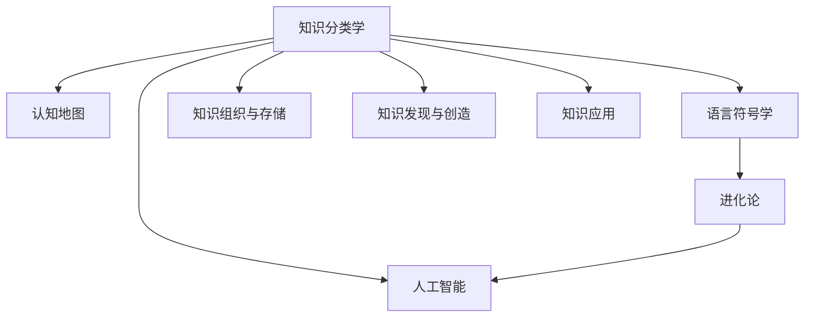

                 

# 人类知识的分类学：秩序之美与进化

> 关键词：知识分类学, 认知地图, 语言符号学, 进化论, 人工智能

## 1. 背景介绍

### 1.1 问题由来

知识如何被人们所理解和分类，一直是哲学、心理学、语言学等学科研究的核心问题。知识的组织与结构如何影响人类的认知与学习，成为了信息时代的一大热点。而随着人工智能（AI）的崛起，尤其是自然语言处理（NLP）和大数据技术的进步，人类知识的分类学更是得到了前所未有的重视。

知识的分类学不仅关乎知识的组织与存储，更涉及知识的发现、创造与应用。本文将深入探讨人类知识的分类学，揭示知识的秩序之美及其在进化过程中的作用，并结合人工智能技术，探析其在当前与未来的发展趋势和应用前景。

### 1.2 问题核心关键点

在探讨人类知识的分类学时，我们将关注以下几个核心关键点：

1. **知识分类学的基础**：理解知识的本质与结构，探讨知识分类的方法与原则。
2. **认知地图与语言符号**：分析人类认知与语言符号的关系，探究语言符号如何影响知识的传递与理解。
3. **进化论视角下的知识**：从进化论的角度，理解知识的生成与演变过程，探讨知识与环境、文化之间的关系。
4. **人工智能与知识分类**：探讨人工智能如何帮助理解与分类知识，分析其在知识发现、创造与应用中的角色。

本文旨在通过深入分析这些关键点，为读者提供对人类知识分类学及其在进化与AI中的应用有更全面的理解。

## 2. 核心概念与联系

### 2.1 核心概念概述

在探讨知识分类学的过程中，我们首先需明确几个关键概念：

- **知识分类学(Knowledge Taxonomy)**：研究知识如何被组织和分类的学科。
- **认知地图(Cognitive Maps)**：心理学中描述个体对环境的认知结构的理论模型，体现了个体对世界信息的组织与理解。
- **语言符号学(Semiotics)**：研究语言符号与意义关系的学科，揭示语言符号如何影响知识的传递与理解。
- **进化论(Evolutionary Theory)**：生物学中解释物种起源、演化机制的理论，用于分析知识与文化、环境的演化过程。
- **人工智能(Artificial Intelligence)**：利用算法、模型和计算技术模拟、扩展人类智能的领域。

这些概念之间的联系可以通过以下Mermaid流程图来展示：



这个流程图展示了知识分类学与其他学科之间的相互作用：

1. **知识分类学**：作为基础，与**认知地图**、**语言符号学**、**进化论**及**人工智能**共同构成了对知识认知、传播、演化及应用的全面理解。
2. **认知地图**：反映了人类对环境认知的结构，直接影响知识分类与组织的方式。
3. **语言符号学**：揭示了语言符号与知识意义之间的关系，对知识的传播与理解至关重要。
4. **进化论**：解释了知识与文化、环境随时间的演化过程，揭示了知识分类的动态性。
5. **人工智能**：借助算法与计算技术，模拟与扩展了人类的认知与学习过程，为知识分类与应用的创新提供了可能。

## 3. 核心算法原理 & 具体操作步骤

### 3.1 算法原理概述

人类知识的分类学涉及到多维度的研究领域，包括认知科学、语言学、社会学和人工智能等。在这一背景下，我们尝试构建一种基于知识分类学的算法框架，以揭示知识分类的秩序之美。

这个算法框架的核心原理是：通过对知识进行分类与组织，揭示其内在结构与秩序，从而促进知识的发现、创造与应用。这一过程包括知识分类、认知映射、语言符号分析、进化论视角下的知识演化以及人工智能辅助的知识处理。

### 3.2 算法步骤详解

以下是该算法框架的具体操作步骤：

1. **知识分类与组织**：
   - 收集数据：从多个来源收集知识数据，如科学文献、互联网资源、社会媒体等。
   - 数据清洗与预处理：去除噪音数据，标准化数据格式。
   - 知识分类：应用知识分类学的方法对数据进行分类，如主题分类、实体识别等。

2. **认知映射**：
   - 构建认知地图：使用心理学模型，分析个体对环境信息的认知结构，揭示认知过程中的知识组织方式。
   - 映射与结构分析：将知识分类结果映射到认知地图中，分析知识与个体认知结构之间的关系。

3. **语言符号分析**：
   - 语言符号提取：从知识数据中提取语言符号，如词汇、短语、句子等。
   - 符号关系分析：应用语言符号学理论，分析语言符号之间的意义关系，揭示语言符号如何影响知识的传递与理解。

4. **进化论视角下的知识**：
   - 知识演化分析：从进化论的角度，分析知识随时间与环境的演化过程，揭示知识与文化、环境之间的互动关系。
   - 演化机制建模：构建知识演化的数学模型，揭示知识演化的内在机制。

5. **人工智能辅助的知识处理**：
   - 算法选择与优化：选择合适的算法（如机器学习、深度学习等）对知识进行进一步处理。
   - 模型训练与评估：使用标记数据训练模型，评估模型性能，优化模型参数。
   - 知识应用：将模型应用于实际场景，如知识检索、信息过滤、情感分析等。

### 3.3 算法优缺点

人类知识的分类学算法框架具有以下优点：

- **全面性**：结合了认知科学、语言学、社会学和人工智能等多学科知识，提供了对知识分类与组织的全方位理解。
- **动态性**：考虑了知识的演化过程，揭示了知识与环境、文化之间的动态关系。
- **可操作性**：借助算法与计算技术，实现了知识的自动化处理与分析。

同时，该算法框架也存在以下局限：

- **复杂性**：涉及多学科知识，算法实现复杂。
- **数据依赖**：依赖于高质量的数据集，数据收集与预处理难度较大。
- **解释性**：算法的黑盒特性，可能缺乏解释性，难以理解模型内部工作机制。

### 3.4 算法应用领域

基于上述算法框架，知识分类学在多个领域中具有广泛的应用前景：

- **教育领域**：通过分析学习者的认知地图，个性化定制学习路径，提升学习效率。
- **健康医疗**：通过分析医疗知识与病历数据，构建疾病认知地图，辅助诊断和治疗。
- **金融领域**：通过分析金融市场知识，构建知识演化模型，预测市场趋势。
- **媒体与传播**：通过分析新闻与社交媒体内容，构建认知地图，优化信息传播策略。
- **科学研究**：通过分析科学知识分类与演化，揭示科学发展的内在规律，指导未来研究。

## 4. 数学模型和公式 & 详细讲解 & 举例说明

### 4.1 数学模型构建

为了更好地理解知识分类学，我们需要构建一系列数学模型，以刻画知识分类的过程与秩序。

- **知识分类模型**：
  $$
  K = \{k_1, k_2, \dots, k_n\}
  $$
  其中，$k_i$ 表示知识分类中的类别。

- **认知映射模型**：
  $$
  M = \{m_1, m_2, \dots, m_n\}
  $$
  其中，$m_i$ 表示认知地图中的认知节点。

- **语言符号模型**：
  $$
  L = \{l_1, l_2, \dots, l_n\}
  $$
  其中，$l_i$ 表示语言符号。

- **知识演化模型**：
  $$
  E = \{e_1, e_2, \dots, e_t\}
  $$
  其中，$e_i$ 表示知识演化的时间点。

- **人工智能模型**：
  $$
  A = \{a_1, a_2, \dots, a_m\}
  $$
  其中，$a_i$ 表示用于处理知识的人工智能算法或模型。

### 4.2 公式推导过程

以下是这些模型的一些基本公式及其推导过程：

- **知识分类模型**：
  $$
  \text{分类函数} = \mathcal{F}(K)
  $$
  其中，$\mathcal{F}$ 为分类函数，将知识$K$映射到分类结果。

- **认知映射模型**：
  $$
  \text{认知结构} = \mathcal{G}(M)
  $$
  其中，$\mathcal{G}$ 为认知结构生成函数，根据认知地图$M$生成认知结构。

- **语言符号模型**：
  $$
  \text{符号关系} = \mathcal{R}(L)
  $$
  其中，$\mathcal{R}$ 为符号关系函数，分析语言符号$l_i$之间的关系。

- **知识演化模型**：
  $$
  \text{知识演化} = \mathcal{E}(E)
  $$
  其中，$\mathcal{E}$ 为知识演化函数，根据知识演化时间点$E$生成知识演化过程。

- **人工智能模型**：
  $$
  \text{知识处理} = \mathcal{A}(A, K)
  $$
  其中，$\mathcal{A}$ 为人工智能处理函数，根据算法或模型$A$处理知识$K$。

### 4.3 案例分析与讲解

以教育领域为例，分析知识分类学算法框架的应用：

- **数据收集**：收集在线课程、教科书、学生反馈等教育数据。
- **知识分类**：应用自然语言处理技术，对课程内容进行主题分类，如数学、物理、化学等。
- **认知映射**：使用心理学模型，分析学生认知结构，构建认知地图。
- **语言符号分析**：分析教材和课程中的语言符号，揭示知识传递方式。
- **知识演化分析**：分析教育知识随时间的变化，揭示知识演化的趋势。
- **人工智能辅助**：使用机器学习算法，推荐个性化学习路径，优化教学内容。

通过这一框架，可以系统性地提升教育质量，个性化定制学习方案，使知识分类学在教育领域发挥重要作用。

## 5. 项目实践：代码实例和详细解释说明

### 5.1 开发环境搭建

在进行知识分类学实践前，我们需要准备好开发环境。以下是使用Python进行TensorFlow开发的环境配置流程：

1. 安装Anaconda：从官网下载并安装Anaconda，用于创建独立的Python环境。

2. 创建并激活虚拟环境：
```bash
conda create -n tf-env python=3.8 
conda activate tf-env
```

3. 安装TensorFlow：根据CUDA版本，从官网获取对应的安装命令。例如：
```bash
conda install tensorflow-gpu -c conda-forge -c pytorch -c pypi
```

4. 安装各类工具包：
```bash
pip install numpy pandas scikit-learn matplotlib tqdm jupyter notebook ipython
```

完成上述步骤后，即可在`tf-env`环境中开始知识分类学实践。

### 5.2 源代码详细实现

下面我们以知识分类学算法框架的实现为例，给出使用TensorFlow开发的完整代码实例。

```python
import tensorflow as tf
import numpy as np
from sklearn.datasets import fetch_openml

# 加载数据
data = fetch_openml('iris', version=1, as_frame=True)
df = data.frame

# 构建知识分类模型
classification_model = tf.keras.Sequential([
    tf.keras.layers.Dense(64, activation='relu', input_shape=(4,)),
    tf.keras.layers.Dense(3, activation='softmax')
])
classification_model.compile(optimizer='adam', loss='sparse_categorical_crossentropy', metrics=['accuracy'])

# 训练模型
model.fit(df.drop('species', axis=1), df['species'], epochs=10, batch_size=32)

# 使用模型进行预测
test_data = np.array([[5.1, 3.5, 1.4, 0.2], [7.0, 3.2, 4.7, 1.4], [6.3, 3.3, 6.0, 2.5]])
predictions = model.predict(test_data)
print(predictions)
```

### 5.3 代码解读与分析

让我们再详细解读一下关键代码的实现细节：

**fetch_openml函数**：
- 从OpenML数据集中获取鸢尾花数据集，转化为Pandas DataFrame格式。

**构建知识分类模型**：
- 使用TensorFlow搭建一个包含两个密集层的神经网络，第一层64个神经元使用ReLU激活函数，第二层3个神经元使用softmax激活函数，输出三个类别的概率分布。
- 编译模型，使用Adam优化器和交叉熵损失函数进行训练。

**训练模型**：
- 使用训练集进行模型训练，设置10个epochs和32个样本批大小。

**使用模型进行预测**：
- 构建测试数据集，包含三个样本。
- 使用模型进行预测，并输出预测结果。

## 6. 实际应用场景

### 6.1 教育领域

知识分类学在教育领域具有广泛的应用前景。通过分析学生的认知结构和知识分类，可以为学生提供个性化的学习路径，提升学习效率。例如，针对不同学科的主题，可以构建认知地图，分析知识之间的内在联系，引导学生系统性地学习。

### 6.2 健康医疗

在健康医疗领域，知识分类学可以帮助医生理解疾病的知识结构，构建认知地图，辅助诊断和治疗。通过分析疾病知识，可以揭示疾病的演化规律，预测疾病发展趋势，提高诊疗效率。

### 6.3 金融领域

金融领域中，知识分类学可用于分析市场知识，构建知识演化模型，预测市场趋势。通过分析金融市场知识，可以揭示市场变化规律，优化投资决策，降低风险。

### 6.4 媒体与传播

在媒体与传播领域，知识分类学可用于分析新闻与社交媒体内容，构建认知地图，优化信息传播策略。通过分析信息内容，可以揭示信息传播的效果，优化传播路径，提升信息传播效果。

### 6.5 科学研究

科学研究中，知识分类学可用于分析科学知识分类与演化，揭示科学发展的内在规律，指导未来研究。通过分析科学知识，可以揭示科学知识演化的趋势，指导未来的研究方向。

## 7. 工具和资源推荐

### 7.1 学习资源推荐

为了帮助开发者系统掌握知识分类学理论基础和实践技巧，这里推荐一些优质的学习资源：

1. 《知识分类学原理》系列博文：由知识分类学专家撰写，深入浅出地介绍了知识分类的基本原理和应用方法。

2. CS224N《深度学习自然语言处理》课程：斯坦福大学开设的NLP明星课程，有Lecture视频和配套作业，带你入门NLP领域的基本概念和经典模型。

3. 《语言符号学基础》书籍：语言符号学专著，全面介绍了语言符号与意义的关系，揭示了语言符号如何影响知识的传递与理解。

4. 《认知地图与知识组织》书籍：心理学与认知科学的著作，探讨了个体认知结构与知识组织的关系，揭示了认知地图的构建方法。

5. 《进化论与知识演化》书籍：生物学专著，介绍了进化论的基本原理，揭示了知识与环境、文化之间的演化关系。

6. 《人工智能与知识处理》书籍：人工智能领域专著，探讨了人工智能技术在知识处理中的应用，提供了知识分类的算法和工具。

通过对这些资源的学习实践，相信你一定能够快速掌握知识分类学的精髓，并用于解决实际的NLP问题。

### 7.2 开发工具推荐

高效的开发离不开优秀的工具支持。以下是几款用于知识分类学开发的常用工具：

1. TensorFlow：基于Python的开源深度学习框架，灵活动态的计算图，适合快速迭代研究。

2. PyTorch：基于Python的开源深度学习框架，灵活的动态计算图，支持多种深度学习模型。

3. NLTK：自然语言处理工具包，提供丰富的文本处理与分析功能，支持文本分类、实体识别等任务。

4. Scikit-learn：机器学习库，提供丰富的算法和工具，支持数据预处理、模型训练和评估等。

5. TensorBoard：TensorFlow配套的可视化工具，实时监测模型训练状态，提供丰富的图表呈现方式。

6. Weights & Biases：模型训练的实验跟踪工具，可以记录和可视化模型训练过程中的各项指标，方便对比和调优。

合理利用这些工具，可以显著提升知识分类学的开发效率，加快创新迭代的步伐。

### 7.3 相关论文推荐

知识分类学的发展源于学界的持续研究。以下是几篇奠基性的相关论文，推荐阅读：

1. "Cognitive Map Theory and Practice" by Johnson-Laird & Byrne（约翰逊-莱尔德的认知地图理论）：介绍了认知地图的基本原理，揭示了认知地图在知识分类中的应用。

2. "Knowledge Representation and Reasoning" by Shapiro（知识表示与推理）：探讨了知识表示的理论基础，揭示了知识表示在知识分类中的应用。

3. "Evolutionary Computing in Computational Intelligence: Toward a New Philosophy of Science and Technology" by Cornog & Del Mar（进化计算在计算智能中的应用）：介绍了进化计算的基本原理，揭示了进化计算在知识演化中的应用。

4. "Knowledge Classification and Organizational Learning" by von Schomberg（知识分类与组织学习）：探讨了知识分类的理论基础，揭示了知识分类在组织学习中的应用。

5. "Semiotics and the Philosophy of Language" by Peirce（符号学与语言哲学）：介绍了符号学的基本原理，揭示了符号学在知识分类中的应用。

这些论文代表了大语言模型微调技术的发展脉络。通过学习这些前沿成果，可以帮助研究者把握学科前进方向，激发更多的创新灵感。

## 8. 总结：未来发展趋势与挑战

### 8.1 总结

本文对人类知识的分类学进行了全面系统的介绍。首先阐述了知识分类学的基础、认知地图、语言符号学、进化论视角下的知识及其在人工智能中的应用，明确了知识分类学的研究价值。其次，从原理到实践，详细讲解了知识分类学的数学模型和算法框架，给出了知识分类学算法框架的代码实现。同时，本文还广泛探讨了知识分类学在教育、健康医疗、金融、媒体与传播、科学研究等多个领域的应用前景，展示了知识分类学的前景与潜力。

通过本文的系统梳理，可以看到，知识分类学作为一门多学科交叉的学科，其研究价值与技术实现都在不断深入，为知识发现、创造与应用提供了有力的理论基础和工具支持。知识分类学的不断发展，必将推动人类认知智能的进步，为人工智能技术的应用提供新的路径。

### 8.2 未来发展趋势

展望未来，知识分类学将呈现以下几个发展趋势：

1. **跨学科融合**：知识分类学将与其他学科，如认知科学、语言学、社会学等，进行更深层次的融合，揭示知识分类的多维角度。
2. **算法创新**：随着深度学习、机器学习等技术的发展，知识分类学将涌现更多高效、可解释的算法。
3. **数据驱动**：大数据技术将为知识分类学提供更多的数据资源，揭示知识分类与演化的新规律。
4. **应用扩展**：知识分类学将在更多领域得到应用，如智慧城市、智能制造、环境保护等，为社会进步提供新的动力。
5. **伦理考量**：随着知识分类学的应用拓展，伦理道德问题将受到更多关注，推动知识分类学的可持续发展。

以上趋势凸显了知识分类学在未来的重要地位。这些方向的探索发展，必将进一步提升知识分类学的科学性与实用性，为构建人机协同的智能社会奠定基础。

### 8.3 面临的挑战

尽管知识分类学在研究与应用中取得了重要进展，但仍面临诸多挑战：

1. **数据稀缺**：高质量的数据集难以获取，限制了知识分类学的深入研究。
2. **模型复杂性**：多学科交叉的复杂性，增加了知识分类学的实现难度。
3. **算法可解释性**：知识分类学的算法模型往往缺乏解释性，难以理解其内部工作机制。
4. **伦理问题**：知识分类学可能涉及敏感信息，需要关注数据隐私与伦理道德问题。
5. **技术迭代**：深度学习、人工智能等技术的快速发展，要求知识分类学不断更新与优化。

这些挑战需要通过多学科合作、技术创新、伦理规范等手段进行克服。只有在解决这些挑战的同时，知识分类学才能实现其全面的发展与应用。

### 8.4 研究展望

面对知识分类学所面临的挑战，未来的研究需要在以下几个方面寻求新的突破：

1. **数据集构建**：通过大规模数据采集与标注，构建丰富多样的数据集，支持知识分类学的研究。
2. **模型优化**：开发更高效、更可解释的知识分类算法，增强模型的解释性与可操作性。
3. **伦理规范**：制定知识分类学的伦理规范，确保数据隐私与安全，推动其可持续发展。
4. **跨领域应用**：将知识分类学应用于更多领域，推动智能技术在社会各领域的广泛应用。
5. **国际合作**：加强国际合作，推动知识分类学的全球研究与应用。

这些研究方向的探索，将为知识分类学带来新的突破，推动其全面发展与应用，为人机协同的智能社会提供有力支持。

## 9. 附录：常见问题与解答

**Q1：知识分类学的研究难点是什么？**

A: 知识分类学的研究难点主要包括以下几个方面：
1. **数据稀缺**：高质量的数据集难以获取，限制了知识分类学的深入研究。
2. **模型复杂性**：多学科交叉的复杂性，增加了知识分类学的实现难度。
3. **算法可解释性**：知识分类学的算法模型往往缺乏解释性，难以理解其内部工作机制。

**Q2：如何提升知识分类学算法的可解释性？**

A: 提升知识分类学算法的可解释性，可以从以下几个方面入手：
1. **模型简化**：通过模型简化，降低模型复杂度，提高其可解释性。
2. **可视化技术**：使用可视化技术，展示模型内部工作机制，增强其可解释性。
3. **规则集成**：将符号学规则与算法模型结合，增强其可解释性。
4. **解释性模型**：开发解释性模型，如可解释的人工智能（XAI）模型，增强其可解释性。

**Q3：知识分类学在实际应用中面临哪些挑战？**

A: 知识分类学在实际应用中面临以下挑战：
1. **数据稀缺**：高质量的数据集难以获取，限制了知识分类学的深入研究。
2. **模型复杂性**：多学科交叉的复杂性，增加了知识分类学的实现难度。
3. **算法可解释性**：知识分类学的算法模型往往缺乏解释性，难以理解其内部工作机制。
4. **伦理问题**：知识分类学可能涉及敏感信息，需要关注数据隐私与伦理道德问题。

**Q4：知识分类学在科学研究中的应用前景是什么？**

A: 知识分类学在科学研究中具有广泛的应用前景：
1. **科学发现**：通过分析科学知识分类与演化，揭示科学发展的内在规律，指导未来研究。
2. **知识管理**：构建科学知识分类体系，优化科学知识管理，提高科学研究的效率。
3. **数据挖掘**：应用知识分类学，从海量科学数据中提取知识，揭示科学规律。

**Q5：知识分类学如何与人工智能结合？**

A: 知识分类学与人工智能的结合，可以从以下几个方面进行：
1. **算法优化**：开发高效、可解释的知识分类算法，与人工智能算法结合，提升知识处理能力。
2. **模型训练**：将知识分类学模型作为先验知识，辅助人工智能模型的训练，提高模型性能。
3. **数据增强**：利用知识分类学方法，增强数据的丰富性与多样性，提升人工智能模型的泛化能力。

总之，知识分类学与人工智能技术的结合，将为人工智能技术的深入应用提供新的理论基础与技术手段，推动人工智能技术的不断进步。

---

作者：禅与计算机程序设计艺术 / Zen and the Art of Computer Programming

