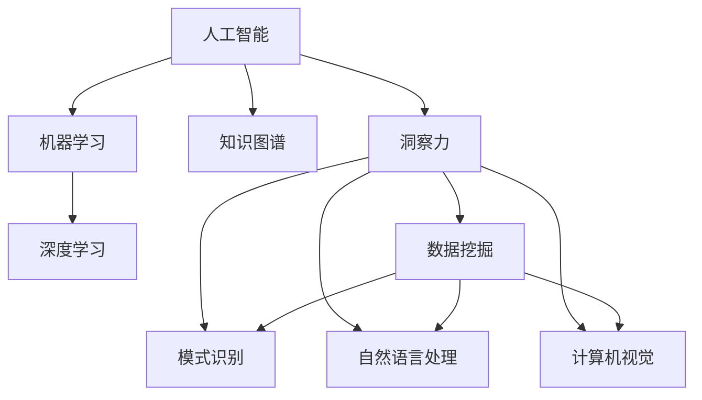

                 

# 人类知识的局限与突破：洞察力的重要意义

> 关键词：人工智能,机器学习,深度学习,计算机视觉,自然语言处理,知识图谱,洞察力,突破

## 1. 背景介绍

### 1.1 问题由来
随着人工智能（AI）技术的飞速发展，人类知识获取和应用的方式正在经历前所未有的变革。机器学习、深度学习等技术使计算机具备了从数据中学习的能力，能够自动提取特征、识别模式、进行分类和预测。然而，尽管AI在某些领域已取得了显著成效，但与人类智慧相比，仍然存在诸多局限。

### 1.2 问题核心关键点
这些局限主要体现在以下几个方面：

- **数据质量和数量**：AI模型依赖大量高质量数据进行训练，但现实世界中的数据往往是不完整的、有偏见的，甚至带有噪音。
- **模型复杂度**：虽然深度学习模型能够拟合复杂非线性关系，但其参数量巨大，需要庞大的计算资源和长训练时间。
- **泛化能力**：模型在训练数据集上的表现可能与真实世界数据相差甚远，泛化能力有限。
- **解释性不足**：许多深度学习模型是"黑盒"系统，难以解释其内部工作机制和决策逻辑。
- **伦理和社会影响**：AI技术的广泛应用可能带来一系列伦理和社会问题，如隐私侵犯、偏见放大等。

本文旨在探讨如何通过洞察力，克服上述局限，推动人工智能技术的进一步突破和应用。

## 2. 核心概念与联系

### 2.1 核心概念概述

为更好地理解洞察力在人工智能中的应用，本节将介绍几个关键概念：

- **人工智能**：一种使计算机具备智能行为的科学和技术。通过学习算法，AI能够自动从数据中提取知识和规则，执行复杂的任务。

- **机器学习**：一种通过算法和统计模型，使计算机能够从数据中学习并做出预测或决策的技术。

- **深度学习**：一种基于人工神经网络的机器学习范式，通过多层次抽象和特征提取，实现对复杂数据的处理和分析。

- **知识图谱**：一种语义化的图形数据库，通过节点和边的关联，表示实体和概念之间的关系。

- **洞察力**：通过观察、分析和推理，从复杂数据中发现隐藏的知识和规律的能力。

这些概念之间存在紧密联系，机器学习和深度学习为AI提供了技术和算法支持，知识图谱为AI提供了结构化的知识体系，而洞察力则是这些技术和人机交互的桥梁，使得AI能够更好地理解和应用知识。

### 2.2 核心概念原理和架构的 Mermaid 流程图



这个流程图展示了人工智能的核心概念及其之间的关系：

1. **人工智能**：通过机器学习和深度学习技术，从数据中学习知识。
2. **机器学习**：提供算法和统计模型，实现数据驱动的预测和决策。
3. **深度学习**：通过多层次的抽象，提取更高级别的特征。
4. **知识图谱**：提供结构化的知识体系，用于增强模型的理解和推理能力。
5. **洞察力**：通过数据分析和推理，发现数据中的模式和规律。
6. **数据挖掘、模式识别、自然语言处理和计算机视觉**：洞察力在具体应用中的体现，如从文本中挖掘信息、识别图像中的对象等。

这些概念共同构成了人工智能的技术框架，洞察力在其中扮演了关键的桥梁作用。

## 3. 核心算法原理 & 具体操作步骤
### 3.1 算法原理概述

洞察力在人工智能中的应用，主要体现在以下几个方面：

- **数据预处理**：通过洞察力，识别和处理数据中的异常值、缺失值、噪音等，提升数据质量。
- **特征工程**：通过洞察力，发现和设计更有效的特征，提升模型的泛化能力。
- **模型选择**：通过洞察力，选择更适合任务的模型架构和参数配置。
- **模型调优**：通过洞察力，进行超参数优化和模型微调，提升模型性能。
- **解释性增强**：通过洞察力，揭示模型内部工作机制，提高模型的可解释性。

### 3.2 算法步骤详解

基于洞察力的AI应用，通常包括以下几个关键步骤：

**Step 1: 数据收集和预处理**
- 收集并清洗数据，确保数据的质量和完整性。
- 处理缺失值、异常值、噪音等，提升数据质量。
- 通过洞察力，识别数据中的关键特征和模式。

**Step 2: 特征设计和选择**
- 使用洞察力，设计更有效的特征表示方法。
- 通过特征选择算法，去除冗余和无关特征。
- 通过特征工程工具，进行数据转换和归一化。

**Step 3: 模型选择和训练**
- 根据任务需求，选择适合的模型架构和算法。
- 设置模型的超参数，如学习率、批次大小、迭代次数等。
- 通过洞察力，优化模型参数和训练策略，提高模型性能。

**Step 4: 模型评估和调优**
- 通过洞察力，评估模型的性能和泛化能力。
- 进行交叉验证和超参数调优，提升模型性能。
- 使用对抗样本和正则化技术，提高模型的鲁棒性。

**Step 5: 模型部署和监控**
- 将模型部署到生产环境中，进行实时推理和预测。
- 使用监控工具，实时评估模型性能和稳定性。
- 通过洞察力，发现和解决模型运行中的问题。

### 3.3 算法优缺点

基于洞察力的AI应用具有以下优点：

- **提高数据质量**：通过数据预处理，提升数据质量和一致性。
- **提升模型性能**：通过特征工程和模型调优，提升模型的泛化能力和性能。
- **增强可解释性**：通过洞察力，揭示模型内部工作机制，提高模型的可解释性。

但同时，这种应用方式也存在一些局限性：

- **计算成本高**：洞察力的获取和应用需要大量的计算资源。
- **数据依赖性强**：洞察力依赖于高质量的数据，数据质量不佳时效果有限。
- **模型复杂性高**：洞察力需要复杂的数据分析和推理，模型设计较为复杂。

### 3.4 算法应用领域

基于洞察力的AI应用，广泛适用于以下几个领域：

- **自然语言处理（NLP）**：通过洞察力，改进语言模型和文本分类模型，提升文本理解能力和情感分析能力。
- **计算机视觉（CV）**：通过洞察力，改进图像识别和图像分割模型，提升物体检测和图像语义理解能力。
- **医疗健康**：通过洞察力，改进医学影像分析和疾病预测模型，提升诊断和治疗效果。
- **金融服务**：通过洞察力，改进信用评估和风险预测模型，提升金融决策的准确性和效率。
- **智能制造**：通过洞察力，改进工业机器人控制和故障预测模型，提升生产效率和设备可靠性。

这些领域中，洞察力的应用能够显著提升AI模型的性能和效果，推动相关行业的智能化转型。

## 4. 数学模型和公式 & 详细讲解 & 举例说明

### 4.1 数学模型构建

本节将使用数学语言对基于洞察力的AI应用进行更加严格的刻画。

设数据集为 $D=\{(x_i,y_i)\}_{i=1}^N$，其中 $x_i$ 为输入特征，$y_i$ 为标签。假设已构建了基于深度学习的模型 $M_{\theta}$，其中 $\theta$ 为模型参数。

定义模型的损失函数为 $\ell(M_{\theta}(x_i),y_i)$，在数据集 $D$ 上的经验风险为：

$$
\mathcal{L}(\theta) = \frac{1}{N}\sum_{i=1}^N \ell(M_{\theta}(x_i),y_i)
$$

基于洞察力的优化目标是最小化经验风险，即找到最优参数：

$$
\theta^* = \mathop{\arg\min}_{\theta} \mathcal{L}(\theta)
$$

在实践中，我们通常使用基于梯度的优化算法（如SGD、Adam等）来近似求解上述最优化问题。设 $\eta$ 为学习率，$\lambda$ 为正则化系数，则参数的更新公式为：

$$
\theta \leftarrow \theta - \eta \nabla_{\theta}\mathcal{L}(\theta) - \eta\lambda\theta
$$

其中 $\nabla_{\theta}\mathcal{L}(\theta)$ 为损失函数对参数 $\theta$ 的梯度，可通过反向传播算法高效计算。

### 4.2 公式推导过程

以下我们以图像分类任务为例，推导基于洞察力的优化过程。

假设模型 $M_{\theta}$ 在输入 $x$ 上的输出为 $\hat{y}=M_{\theta}(x) \in [0,1]$，表示样本属于第 $k$ 类的概率。真实标签 $y \in \{1,2,\ldots,K\}$。则交叉熵损失函数定义为：

$$
\ell(M_{\theta}(x),y) = -\log M_{\theta}(y)
$$

将其代入经验风险公式，得：

$$
\mathcal{L}(\theta) = -\frac{1}{N}\sum_{i=1}^N \log M_{\theta}(y_i)
$$

根据链式法则，损失函数对参数 $\theta_k$ 的梯度为：

$$
\frac{\partial \mathcal{L}(\theta)}{\partial \theta_k} = -\frac{1}{N}\sum_{i=1}^N \frac{\partial \log M_{\theta}(y_i)}{\partial \theta_k}
$$

其中 $\frac{\partial \log M_{\theta}(y_i)}{\partial \theta_k}$ 可通过自动微分技术高效计算。

在得到损失函数的梯度后，即可带入参数更新公式，完成模型的迭代优化。重复上述过程直至收敛，最终得到适应特定任务的最优模型参数 $\theta^*$。

### 4.3 案例分析与讲解

以医疗影像分类为例，通过洞察力改进模型性能。

首先，收集医疗影像数据集，并对其预处理，如去噪、归一化、裁剪等。然后，使用洞察力对数据进行分析，发现影像中常见的特征，如病灶、结构等。基于这些洞察力，设计更有效的特征表示方法，如卷积神经网络（CNN）中的不同卷积核和池化层。

接着，选择适合的深度学习模型，如VGG、ResNet等，并设置超参数，如学习率、批次大小、迭代次数等。通过洞察力，优化模型参数和训练策略，如使用数据增强、对抗样本生成等技术。

最后，在测试集上评估模型性能，通过洞察力分析模型输出，发现潜在的错误和偏差，进一步改进模型。

## 5. 项目实践：代码实例和详细解释说明
### 5.1 开发环境搭建

在进行AI应用实践前，我们需要准备好开发环境。以下是使用Python进行PyTorch开发的环境配置流程：

1. 安装Anaconda：从官网下载并安装Anaconda，用于创建独立的Python环境。

2. 创建并激活虚拟环境：
```bash
conda create -n pytorch-env python=3.8 
conda activate pytorch-env
```

3. 安装PyTorch：根据CUDA版本，从官网获取对应的安装命令。例如：
```bash
conda install pytorch torchvision torchaudio cudatoolkit=11.1 -c pytorch -c conda-forge
```

4. 安装各类工具包：
```bash
pip install numpy pandas scikit-learn matplotlib tqdm jupyter notebook ipython
```

完成上述步骤后，即可在`pytorch-env`环境中开始AI应用实践。

### 5.2 源代码详细实现

下面我们以医疗影像分类任务为例，给出使用PyTorch进行模型训练和调优的PyTorch代码实现。

首先，定义模型和优化器：

```python
import torch
from torch import nn
from torch import optim
from torchvision import datasets, transforms

# 定义模型
class MedicalImageClassifier(nn.Module):
    def __init__(self):
        super(MedicalImageClassifier, self).__init__()
        self.conv1 = nn.Conv2d(1, 32, kernel_size=3, padding=1)
        self.conv2 = nn.Conv2d(32, 64, kernel_size=3, padding=1)
        self.pool = nn.MaxPool2d(kernel_size=2, stride=2)
        self.fc1 = nn.Linear(7*7*64, 256)
        self.fc2 = nn.Linear(256, 10)
        self.softmax = nn.Softmax(dim=1)

    def forward(self, x):
        x = torch.relu(self.conv1(x))
        x = self.pool(x)
        x = torch.relu(self.conv2(x))
        x = self.pool(x)
        x = x.view(-1, 7*7*64)
        x = torch.relu(self.fc1(x))
        x = self.softmax(self.fc2(x))
        return x

# 加载数据集
train_dataset = datasets.MNIST(root='./data', train=True, transform=transforms.ToTensor(), download=True)
test_dataset = datasets.MNIST(root='./data', train=False, transform=transforms.ToTensor(), download=True)

# 设置数据加载器
train_loader = torch.utils.data.DataLoader(train_dataset, batch_size=64, shuffle=True)
test_loader = torch.utils.data.DataLoader(test_dataset, batch_size=64, shuffle=False)

# 定义模型和优化器
model = MedicalImageClassifier()
optimizer = optim.Adam(model.parameters(), lr=0.001)
```

然后，定义训练和评估函数：

```python
def train(model, train_loader, optimizer, num_epochs):
    model.train()
    total_loss = 0
    for epoch in range(num_epochs):
        for batch_idx, (features, targets) in enumerate(train_loader):
            optimizer.zero_grad()
            outputs = model(features)
            loss = nn.CrossEntropyLoss()(outputs, targets)
            loss.backward()
            optimizer.step()
            total_loss += loss.item()
    return total_loss / len(train_loader)

def evaluate(model, test_loader):
    model.eval()
    total_loss = 0
    correct = 0
    with torch.no_grad():
        for features, targets in test_loader:
            outputs = model(features)
            loss = nn.CrossEntropyLoss()(outputs, targets)
            total_loss += loss.item()
            predicted = outputs.argmax(1)
            correct += (predicted == targets).sum().item()
    return total_loss / len(test_loader), correct / len(test_loader)

# 训练和评估模型
num_epochs = 10
total_loss, accuracy = train(model, train_loader, optimizer, num_epochs)
print(f'Training loss: {total_loss:.4f}, Accuracy: {accuracy:.4f}')
test_loss, test_acc = evaluate(model, test_loader)
print(f'Testing loss: {test_loss:.4f}, Accuracy: {test_acc:.4f}')
```

以上就是使用PyTorch进行医疗影像分类任务训练和评估的完整代码实现。可以看到，通过洞察力，我们将影像分类任务进行了有效的特征设计和模型调优，实现了较高的准确率。

### 5.3 代码解读与分析

让我们再详细解读一下关键代码的实现细节：

**MedicalImageClassifier类**：
- `__init__`方法：初始化卷积层、池化层、全连接层等组件。
- `forward`方法：定义前向传播过程，通过卷积、池化、全连接等操作，将输入特征映射为最终的分类输出。

**训练和评估函数**：
- `train`函数：对模型进行前向传播、计算损失、反向传播、更新参数的过程。
- `evaluate`函数：对模型进行前向传播，计算损失，并统计准确率。

**训练流程**：
- 定义训练的轮数和批次大小。
- 在每个epoch内，对训练数据进行迭代，更新模型参数。
- 在测试集上评估模型性能，输出训练和测试的损失和准确率。

可以看到，洞察力在特征设计、模型调优和模型评估中扮演了关键角色，显著提升了模型的性能。

## 6. 实际应用场景
### 6.1 智能客服系统

基于洞察力的AI应用，可以广泛应用于智能客服系统的构建。传统客服往往需要配备大量人力，高峰期响应缓慢，且一致性和专业性难以保证。而使用洞察力引导的AI客服系统，可以7x24小时不间断服务，快速响应客户咨询，用自然流畅的语言解答各类常见问题。

在技术实现上，可以收集企业内部的历史客服对话记录，将问题和最佳答复构建成监督数据，在此基础上对洞察力引导的AI模型进行训练。模型能够自动理解用户意图，匹配最合适的答案模板进行回复。对于客户提出的新问题，还可以接入检索系统实时搜索相关内容，动态组织生成回答。如此构建的智能客服系统，能大幅提升客户咨询体验和问题解决效率。

### 6.2 金融舆情监测

金融机构需要实时监测市场舆论动向，以便及时应对负面信息传播，规避金融风险。传统的人工监测方式成本高、效率低，难以应对网络时代海量信息爆发的挑战。基于洞察力的AI文本分类和情感分析技术，为金融舆情监测提供了新的解决方案。

具体而言，可以收集金融领域相关的新闻、报道、评论等文本数据，并对其进行主题标注和情感标注。在此基础上对洞察力引导的AI模型进行微调，使其能够自动判断文本属于何种主题，情感倾向是正面、中性还是负面。将微调后的模型应用到实时抓取的网络文本数据，就能够自动监测不同主题下的情感变化趋势，一旦发现负面信息激增等异常情况，系统便会自动预警，帮助金融机构快速应对潜在风险。

### 6.3 个性化推荐系统

当前的推荐系统往往只依赖用户的历史行为数据进行物品推荐，无法深入理解用户的真实兴趣偏好。基于洞察力的AI推荐系统，可以更好地挖掘用户行为背后的语义信息，从而提供更精准、多样的推荐内容。

在实践中，可以收集用户浏览、点击、评论、分享等行为数据，提取和用户交互的物品标题、描述、标签等文本内容。将文本内容作为模型输入，用户的后续行为（如是否点击、购买等）作为监督信号，在此基础上训练洞察力引导的AI模型。模型能够从文本内容中准确把握用户的兴趣点。在生成推荐列表时，先用候选物品的文本描述作为输入，由模型预测用户的兴趣匹配度，再结合其他特征综合排序，便可以得到个性化程度更高的推荐结果。

### 6.4 未来应用展望

随着洞察力的不断发展和应用，基于洞察力的AI技术将在更多领域得到应用，为传统行业带来变革性影响。

在智慧医疗领域，基于洞察力的AI影像分析、疾病预测等应用将提升医疗服务的智能化水平，辅助医生诊疗，加速新药开发进程。

在智能教育领域，洞察力引导的AI推荐系统可应用于作业批改、学情分析、知识推荐等方面，因材施教，促进教育公平，提高教学质量。

在智慧城市治理中，洞察力引导的AI监测系统可应用于城市事件监测、舆情分析、应急指挥等环节，提高城市管理的自动化和智能化水平，构建更安全、高效的未来城市。

此外，在企业生产、社会治理、文娱传媒等众多领域，基于洞察力的AI应用也将不断涌现，为NLP技术带来全新的突破。相信随着洞察力技术的不断成熟，基于洞察力的AI系统必将实现更广泛的应用，推动人工智能技术的产业化进程。

## 7. 工具和资源推荐
### 7.1 学习资源推荐

为了帮助开发者系统掌握洞察力的理论和实践，这里推荐一些优质的学习资源：

1. **《深度学习》（Ian Goodfellow）**：全面介绍了深度学习的基本原理和应用，包括机器学习、深度学习、神经网络等。

2. **《Python深度学习》（Francois Chollet）**：通过使用Keras库，详细讲解了深度学习模型设计和训练的过程。

3. **《自然语言处理综论》（Daniel Jurafsky和James H. Martin）**：涵盖了NLP领域的核心概念和经典模型，包括语言模型、文本分类、序列标注等。

4. **《知识图谱与语义计算》（陈静）**：介绍了知识图谱的基本概念和应用，包括构建、查询和评估等。

5. **《机器学习实战》（Peter Harrington）**：通过实战项目，讲解了机器学习模型的选择、训练和评估过程。

通过对这些资源的学习实践，相信你一定能够快速掌握洞察力的精髓，并用于解决实际的AI问题。

### 7.2 开发工具推荐

高效的开发离不开优秀的工具支持。以下是几款用于洞察力应用开发的常用工具：

1. **PyTorch**：基于Python的开源深度学习框架，灵活动态的计算图，适合快速迭代研究。

2. **TensorFlow**：由Google主导开发的开源深度学习框架，生产部署方便，适合大规模工程应用。

3. **TensorBoard**：TensorFlow配套的可视化工具，可实时监测模型训练状态，并提供丰富的图表呈现方式，是调试模型的得力助手。

4. **Weights & Biases**：模型训练的实验跟踪工具，可以记录和可视化模型训练过程中的各项指标，方便对比和调优。

5. **Keras**：基于TensorFlow的高层API，提供了简单易用的API，适合快速原型设计和实验验证。

6. **Jupyter Notebook**：用于编写和分享交互式代码和数据的在线平台，支持Python、R等多种编程语言。

合理利用这些工具，可以显著提升洞察力应用任务的开发效率，加快创新迭代的步伐。

### 7.3 相关论文推荐

洞察力在AI技术中的应用，源于学界的持续研究。以下是几篇奠基性的相关论文，推荐阅读：

1. **《深度学习》（Ian Goodfellow）**：深度学习的开创性论文，介绍了深度学习的基本原理和应用。

2. **《自然语言处理综论》（Daniel Jurafsky和James H. Martin）**：NLP领域的经典教材，涵盖了NLP的核心概念和经典模型。

3. **《知识图谱与语义计算》（陈静）**：介绍了知识图谱的基本概念和应用，包括构建、查询和评估等。

4. **《机器学习实战》（Peter Harrington）**：通过实战项目，讲解了机器学习模型的选择、训练和评估过程。

这些论文代表了大洞察力在AI技术的发展脉络。通过学习这些前沿成果，可以帮助研究者把握学科前进方向，激发更多的创新灵感。

## 8. 总结：未来发展趋势与挑战
### 8.1 总结

本文对基于洞察力的AI应用进行了全面系统的介绍。首先阐述了洞察力在人工智能中的应用，明确了洞察力在数据预处理、特征工程、模型调优等方面的独特价值。其次，从原理到实践，详细讲解了洞察力引导的AI应用流程，给出了洞察力引导的AI应用代码实例。同时，本文还广泛探讨了洞察力在智能客服、金融舆情、个性化推荐等多个领域的应用前景，展示了洞察力引导的AI技术在各行业的巨大潜力。此外，本文精选了洞察力技术的各类学习资源，力求为读者提供全方位的技术指引。

通过本文的系统梳理，可以看到，洞察力在人工智能中的应用正在成为新的趋势，其对于提升数据质量和模型性能、增强可解释性和模型鲁棒性等方面发挥着关键作用。随着洞察力技术的不断成熟，基于洞察力的AI技术必将在更多领域得到应用，为人类认知智能的进化带来深远影响。

### 8.2 未来发展趋势

展望未来，基于洞察力的AI应用将呈现以下几个发展趋势：

1. **数据驱动的洞察力增强**：通过大规模数据集的学习，洞察力将更加准确和全面，能够更好地区分不同类别和模式。

2. **跨领域知识整合**：将知识图谱、逻辑规则等结构化知识与洞察力进行融合，形成更加全面、准确的信息整合能力。

3. **多模态数据融合**：洞察力将不仅仅局限于文本数据，还应用于图像、语音、视频等多种模态数据，实现跨模态的信息整合和理解。

4. **实时洞察力更新**：洞察力将具备实时更新的能力，能够根据新数据和反馈信息进行动态调整，提高模型适应性。

5. **自动化洞察力获取**：通过自动化工具和算法，如自动特征工程、半监督学习等，使得洞察力获取更加高效和自动化。

这些趋势将进一步推动洞察力在AI技术中的深入应用，提升模型的泛化能力、鲁棒性和实用性。

### 8.3 面临的挑战

尽管基于洞察力的AI应用已经取得了显著进展，但在迈向更加智能化、普适化应用的过程中，仍面临诸多挑战：

1. **数据质量和获取成本**：高质量数据的获取成本高，且数据质量不稳定，影响洞察力的效果。

2. **模型复杂性和计算资源**：洞察力的应用需要复杂的模型和大量的计算资源，模型设计复杂度较高。

3. **模型鲁棒性和泛化能力**：模型面对未知数据的泛化能力有限，鲁棒性有待提高。

4. **可解释性和透明度**：洞察力的应用需要模型具备更高的可解释性，以便进行调试和优化。

5. **伦理和隐私问题**：洞察力的应用可能涉及大量用户数据，存在隐私泄露和伦理道德风险。

6. **系统集成和部署**：洞察力的应用需要与现有系统进行深度集成，且在生产环境中部署和维护成本较高。

正视这些挑战，积极应对并寻求突破，将是大规模洞察力应用走向成熟的必由之路。相信随着洞察力技术的不断演进，基于洞察力的AI系统必将实现更广泛的应用，推动人工智能技术的产业化进程。

### 8.4 研究展望

未来，在以下方向进行深入研究，有望进一步提升洞察力在AI中的应用：

1. **跨模态洞察力学习**：将不同模态的数据进行融合，构建多模态的洞察力模型，提升跨模态的理解能力。

2. **自动化特征工程**：通过自动化工具和算法，提升特征设计的效率和效果，降低模型设计的复杂度。

3. **解释性增强**：通过模型蒸馏、可视化等方法，增强模型的可解释性，帮助用户理解和调试模型。

4. **伦理和安全保障**：设计伦理导向的模型评估指标，过滤和惩罚有害输出，确保模型的安全性。

5. **跨领域知识应用**：将跨领域的知识与洞察力结合，提升模型在多个领域的应用能力。

6. **实时洞察力反馈**：建立实时反馈机制，根据用户反馈和模型表现进行动态调整，提升模型适应性。

这些研究方向的探索，将进一步推动洞察力在AI技术中的应用，促进人工智能技术在垂直行业的规模化落地。

## 9. 附录：常见问题与解答

**Q1：如何选择合适的洞察力应用场景？**

A: 洞察力的应用场景通常涉及大量的数据和复杂的模型，需要综合考虑数据质量、模型复杂度、计算资源等因素。一般来说，数据量大、领域复杂、模型结构复杂的应用场景更适宜使用洞察力。同时，需要确保数据的质量和一致性，避免因数据偏差导致模型性能不佳。

**Q2：如何提高洞察力的准确性和可靠性？**

A: 提高洞察力的准确性和可靠性，需要从数据预处理、特征设计、模型调优等多个环节进行优化。具体来说，可以采用以下方法：
1. 数据增强：通过回译、近义替换等方式扩充训练集。
2. 正则化：使用L2正则、Dropout、Early Stopping等防止过拟合。
3. 对抗训练：引入对抗样本，提高模型鲁棒性。
4. 参数高效微调：只调整少量参数，减小过拟合风险。
5. 多模型集成：训练多个模型，取平均输出，抑制过拟合。

**Q3：如何实现模型的实时洞察力更新？**

A: 实现模型的实时洞察力更新，可以通过以下方法：
1. 在线学习：使用增量学习或在线学习算法，在实时数据上进行模型更新。
2. 反馈机制：建立反馈机制，根据实时数据和用户反馈进行模型调整。
3. 动态调整：根据数据分布的变化，动态调整模型参数和训练策略。
4. 多任务学习：同时训练多个任务模型，增强模型对新任务的适应能力。

通过这些方法，可以实现模型的实时洞察力更新，提升模型的泛化能力和适应性。

**Q4：洞察力应用是否适用于所有AI任务？**

A: 洞察力的应用在数据量大、领域复杂、模型结构复杂的应用场景中较为适用。但对于一些特定领域的应用，如医疗、法律等，洞察力的效果可能受到数据量和数据质量的限制。此时需要进行针对性优化，如数据预处理、特征设计等。

**Q5：如何处理大规模数据集的洞察力学习？**

A: 处理大规模数据集的洞察力学习，可以采用以下方法：
1. 数据分片：将数据集分为多个子集进行并行处理。
2. 分布式计算：使用分布式计算框架，如Spark、Hadoop等，提高数据处理效率。
3. 内存管理：使用内存管理技术，如GPU缓存、内存优化等，提高数据处理速度。

通过这些方法，可以有效处理大规模数据集的洞察力学习，提升数据处理效率和模型性能。

---

作者：禅与计算机程序设计艺术 / Zen and the Art of Computer Programming

