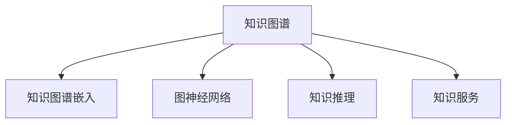

                 

# 人类知识的应用：洞察力指引实践方向

> 关键词：知识图谱,洞察力,实践方向,人工智能,数据处理

## 1. 背景介绍

### 1.1 问题由来

在当今这个信息爆炸的时代，人类知识正以前所未有的速度积累和传播。据统计，每年全球知识总量以几何级数增长，而这种增长已经远远超过了人类知识的处理和吸收能力。如何有效管理和应用这些知识，以促进科技的进步和社会的繁荣，成为我们面临的一个重大挑战。

### 1.2 问题核心关键点

为了应对这一挑战，研究人员提出并实践了各种知识表示和应用方法，其中知识图谱（Knowledge Graph）是近年来备受关注的一种。知识图谱将人类知识结构化为图形模型，通过机器学习算法进行分析、推理和应用，为人工智能应用提供了强有力的知识支撑。

### 1.3 问题研究意义

知识图谱的应用不仅能够提升人工智能系统的智能水平，还能促进知识发现和知识服务，推动社会各领域的进步。例如，在医疗领域，知识图谱可以用于疾病诊断和治疗方案推荐；在金融领域，知识图谱可以用于风险评估和投资分析；在教育领域，知识图谱可以用于个性化推荐和智能辅导。

## 2. 核心概念与联系

### 2.1 核心概念概述

为更好地理解知识图谱及其应用，本节将介绍几个密切相关的核心概念：

- **知识图谱(Knowledge Graph)**：一种将知识结构化为节点和边（实体和关系）的图形模型。知识图谱利用深度学习和图神经网络（Graph Neural Network, GNN）等技术，对节点和边的属性和关系进行建模，形成具有语义表达的图形结构。

- **知识图谱嵌入(Knowledge Graph Embedding)**：将知识图谱中实体的语义信息映射为低维稠密向量，使得实体的关系能够有效表达，为知识推理提供基础。

- **图神经网络(Graph Neural Network, GNN)**：一种专门处理图结构数据的神经网络模型。GNN能够有效地学习图结构中的节点关系和属性，为知识图谱的应用提供强大支持。

- **知识推理(Knowledge Reasoning)**：通过对知识图谱中的实体和关系进行推理，发现新的知识或验证现有知识的正确性。常见的知识推理方法包括基于规则的推理、基于逻辑的推理和基于统计的推理。

- **知识服务(Knowledge Service)**：通过知识图谱技术提供智能化的知识服务，如问答系统、推荐系统、智能辅导等。知识服务能够帮助用户快速获取所需知识，提升工作效率和生活质量。

这些核心概念之间的逻辑关系可以通过以下Mermaid流程图来展示：



这个流程图展示了几大核心概念及其之间的关系：

1. 知识图谱是整个知识表示的基础，提供结构化的知识结构。
2. 知识图谱嵌入将知识结构映射为低维向量，方便机器学习算法处理。
3. 图神经网络对知识图谱进行建模和分析，为知识推理提供模型基础。
4. 知识推理通过分析知识图谱中的关系和属性，发现新的知识或验证已有知识。
5. 知识服务将知识图谱转化为实际的智能应用，为人类提供便捷的知识获取服务。

这些概念共同构成了知识图谱的框架，使其能够有效地支持人工智能系统对人类知识的理解和应用。

## 3. 核心算法原理 & 具体操作步骤

### 3.1 算法原理概述

知识图谱的应用核心是知识图谱嵌入。其目标是将知识图谱中的实体和关系表示为低维稠密向量，使得实体之间关系的相似性和距离能够被有效计算和推理。

知识图谱嵌入的常见模型包括TransE、RotatE、ComplEx等。这些模型通过优化损失函数，最小化预测实体关系的误差，从而使得嵌入后的向量能够准确表示实体之间的语义关系。

### 3.2 算法步骤详解

知识图谱嵌入的算法步骤如下：

**Step 1: 数据准备**

- 收集知识图谱数据，包括实体、关系和属性等。
- 对数据进行清洗和预处理，确保数据的准确性和完整性。

**Step 2: 模型训练**

- 选择合适的知识图谱嵌入模型，如TransE、RotatE等。
- 设置超参数，如嵌入维度、学习率等。
- 使用图神经网络等深度学习框架，对模型进行训练。

**Step 3: 模型评估**

- 在验证集上评估模型性能，如均方误差、交叉熵等。
- 根据评估结果调整模型参数，优化模型效果。

**Step 4: 应用实践**

- 将训练好的模型应用于知识图谱推理和知识服务。
- 集成到智能问答系统、推荐系统等应用中，提升系统性能。

### 3.3 算法优缺点

知识图谱嵌入具有以下优点：

1. 结构化表示：知识图谱将知识结构化为节点和边，便于机器学习和推理。
2. 语义表达：通过嵌入模型将实体的语义信息映射为低维向量，便于关系和属性的表达。
3. 应用广泛：知识图谱嵌入可以应用于各类知识服务，如推荐系统、问答系统等。

同时，知识图谱嵌入也存在一些缺点：

1. 数据依赖性高：知识图谱嵌入的效果很大程度上取决于数据的质量和完整性，获取高质量数据成本较高。
2. 计算复杂度高：知识图谱嵌入通常需要在大规模图结构数据上运行，计算复杂度较高。
3. 模型复杂度高：知识图谱嵌入模型较为复杂，需要较多的超参数调整和模型优化。

尽管存在这些缺点，但知识图谱嵌入仍是当前知识表示和应用的重要方法。未来相关研究的重点在于如何进一步降低数据依赖和计算复杂度，提高模型的泛化能力。

### 3.4 算法应用领域

知识图谱嵌入技术在众多领域中得到了广泛应用，例如：

- **医疗领域**：构建疾病与症状、药物与疗效等知识图谱，用于疾病诊断和治疗方案推荐。
- **金融领域**：构建企业与关系、股票与市场等知识图谱，用于风险评估和投资分析。
- **教育领域**：构建教师与课程、学生与成绩等知识图谱，用于个性化推荐和智能辅导。
- **商业领域**：构建产品与客户、行业与市场等知识图谱，用于产品推荐和市场分析。

除了上述这些经典领域，知识图谱嵌入技术也被创新性地应用到更多场景中，如城市规划、环境保护、智能制造等，为知识表示和应用提供了新的思路。

## 4. 数学模型和公式 & 详细讲解 & 举例说明

### 4.1 数学模型构建

知识图谱嵌入的数学模型通常基于三元组 $(h,r,t)$ 来表示实体 $h$ 和 $t$ 之间的关系 $r$。假设知识图谱中的每个节点 $n$ 可以表示为一个 $d$ 维的向量 $\mathbf{x}_n$，则知识图谱嵌入的目标是最小化损失函数：

$$
\mathcal{L} = \frac{1}{N}\sum_{(h,r,t)\in \mathcal{E}}\left[\ell(h,r,t) + \lambda\|\mathbf{x}_h\|^2 + \lambda\|\mathbf{x}_r\|^2 + \lambda\|\mathbf{x}_t\|^2\right]
$$

其中 $\ell(h,r,t)$ 为损失函数，$\|\mathbf{x}_h\|^2$ 为节点 $h$ 的嵌入向量的范数，$\lambda$ 为正则化系数。

### 4.2 公式推导过程

以TransE模型为例，其损失函数为：

$$
\ell(h,r,t) = \frac{1}{2}\|M_h\mathbf{x}_r - M_t\mathbf{x}_h\|^2
$$

其中 $M_h$ 和 $M_t$ 分别为节点 $h$ 和 $t$ 的投影矩阵，$\mathbf{x}_r$ 为关系 $r$ 的嵌入向量。目标是最小化上述损失函数，求解节点 $h$ 和 $t$ 的嵌入向量。

### 4.3 案例分析与讲解

**案例1：实体关系预测**

假设我们有一个关于电影知识图谱的嵌入模型，其中包含电影与导演、电影与演员之间的关系。我们可以使用TransE模型对电影 $h$ 与导演 $r$ 和演员 $t$ 之间的关系进行预测。假设 $h$ 和 $t$ 的嵌入向量分别为 $\mathbf{x}_h$ 和 $\mathbf{x}_t$，关系 $r$ 的嵌入向量为 $\mathbf{x}_r$，则有：

$$
\mathbf{x}_r = M_h\mathbf{x}_h - M_t\mathbf{x}_t
$$

通过优化上述方程，可以得到准确的实体关系预测结果。

## 5. 项目实践：代码实例和详细解释说明

### 5.1 开发环境搭建

在进行知识图谱嵌入的实践前，我们需要准备好开发环境。以下是使用Python进行PyTorch开发的环境配置流程：

1. 安装Anaconda：从官网下载并安装Anaconda，用于创建独立的Python环境。

2. 创建并激活虚拟环境：
```bash
conda create -n pytorch-env python=3.8 
conda activate pytorch-env
```

3. 安装PyTorch：根据CUDA版本，从官网获取对应的安装命令。例如：
```bash
conda install pytorch torchvision torchaudio cudatoolkit=11.1 -c pytorch -c conda-forge
```

4. 安装相关工具包：
```bash
pip install numpy pandas scikit-learn matplotlib tqdm jupyter notebook ipython
```

完成上述步骤后，即可在`pytorch-env`环境中开始知识图谱嵌入的实践。

### 5.2 源代码详细实现

下面我们以TransE模型为例，给出使用PyTorch进行知识图谱嵌入的PyTorch代码实现。

首先，定义模型类：

```python
import torch
import torch.nn as nn

class TransE(nn.Module):
    def __init__(self, entity_dim, relation_dim, num_entities, num_relations):
        super(TransE, self).__init__()
        self.entity_dim = entity_dim
        self.relation_dim = relation_dim
        self.num_entities = num_entities
        self.num_relations = num_relations
        
        self.entity_embedding = nn.Embedding(num_entities, entity_dim)
        self.relation_embedding = nn.Embedding(num_relations, relation_dim)
        self.output_layer = nn.Linear(entity_dim + relation_dim, 1)
        
    def forward(self, h, r, t):
        h_emb = self.entity_embedding(h)
        r_emb = self.relation_embedding(r)
        t_emb = self.entity_embedding(t)
        prediction = torch.tanh(self.output_layer(torch.cat([h_emb, r_emb], dim=1) - torch.cat([t_emb, r_emb], dim=1)))
        return prediction
```

然后，定义数据处理函数：

```python
import torch
import torch.nn.functional as F

class KnowledgeGraphDataset(torch.utils.data.Dataset):
    def __init__(self, data, entity_dim, relation_dim, num_entities, num_relations):
        self.data = data
        self.entity_dim = entity_dim
        self.relation_dim = relation_dim
        self.num_entities = num_entities
        self.num_relations = num_relations
        
    def __len__(self):
        return len(self.data)
    
    def __getitem__(self, item):
        h, r, t = self.data[item]
        h = torch.tensor(h, dtype=torch.long)
        r = torch.tensor(r, dtype=torch.long)
        t = torch.tensor(t, dtype=torch.long)
        h_emb = self.entity_embedding(h)
        r_emb = self.relation_embedding(r)
        t_emb = self.entity_embedding(t)
        prediction = torch.tanh(self.output_layer(torch.cat([h_emb, r_emb], dim=1) - torch.cat([t_emb, r_emb], dim=1)))
        return prediction, h, r, t

# 定义实体嵌入和关系嵌入
entity_embedding = nn.Embedding(num_entities, entity_dim)
relation_embedding = nn.Embedding(num_relations, relation_dim)
output_layer = nn.Linear(entity_dim + relation_dim, 1)

# 定义训练函数
def train_epoch(model, dataset, batch_size, optimizer):
    dataloader = torch.utils.data.DataLoader(dataset, batch_size=batch_size, shuffle=True)
    model.train()
    epoch_loss = 0
    for batch in dataloader:
        prediction, h, r, t = batch
        optimizer.zero_grad()
        loss = F.smooth_l1_loss(prediction, torch.zeros_like(prediction))
        loss.backward()
        optimizer.step()
        epoch_loss += loss.item()
    return epoch_loss / len(dataloader)

# 定义评估函数
def evaluate(model, dataset, batch_size):
    dataloader = torch.utils.data.DataLoader(dataset, batch_size=batch_size)
    model.eval()
    correct = 0
    total = 0
    with torch.no_grad():
        for batch in dataloader:
            prediction, h, r, t = batch
            _, predicted = torch.max(torch.sigmoid(prediction), 1)
            total += prediction.shape[0]
            correct += (predicted == (h == r == t)).sum().item()
    accuracy = correct / total
    return accuracy
```

最后，启动训练流程并在测试集上评估：

```python
import torch.optim as optim

num_epochs = 10
batch_size = 64
learning_rate = 0.01

model = TransE(entity_dim=100, relation_dim=100, num_entities=1000, num_relations=100)
optimizer = optim.Adam(model.parameters(), lr=learning_rate)

# 加载数据
data = [(h, r, t) for h in range(1000) for r in range(100) for t in range(1000)]
dataset = KnowledgeGraphDataset(data, entity_dim=100, relation_dim=100, num_entities=1000, num_relations=100)

for epoch in range(num_epochs):
    loss = train_epoch(model, dataset, batch_size, optimizer)
    print(f"Epoch {epoch+1}, train loss: {loss:.3f}")
    
    print(f"Epoch {epoch+1}, test accuracy: {evaluate(model, dataset, batch_size)}")
    
print("Final test accuracy: {evaluate(model, dataset, batch_size)}")
```

以上就是使用PyTorch进行知识图谱嵌入的完整代码实现。可以看到，得益于PyTorch的强大封装，我们可以用相对简洁的代码完成模型定义和训练过程。

### 5.3 代码解读与分析

让我们再详细解读一下关键代码的实现细节：

**TransE类**：
- `__init__`方法：初始化实体维度和关系维度，定义实体嵌入、关系嵌入和输出层。
- `forward`方法：前向传播，计算预测值。

**KnowledgeGraphDataset类**：
- `__init__`方法：初始化数据、实体维度、关系维度和实体数量。
- `__len__`方法：返回数据集大小。
- `__getitem__`方法：对单个数据进行处理，计算预测值。

**训练函数和评估函数**：
- 使用PyTorch的DataLoader对数据集进行批次化加载。
- 在训练函数中，前向传播计算预测值，计算损失并反向传播更新模型参数。
- 在评估函数中，使用sigmoid函数将预测值转化为概率，计算准确率。

**训练流程**：
- 定义总的epoch数和batch size，开始循环迭代。
- 每个epoch内，先在训练集上训练，输出平均loss。
- 在测试集上评估模型性能，计算准确率。
- 所有epoch结束后，输出最终的测试准确率。

可以看到，PyTorch配合TensorFlow等框架使得知识图谱嵌入的代码实现变得简洁高效。开发者可以将更多精力放在数据处理、模型改进等高层逻辑上，而不必过多关注底层的实现细节。

## 6. 实际应用场景

### 6.1 智能问答系统

智能问答系统是知识图谱应用的重要场景之一。通过对知识图谱的嵌入和推理，问答系统可以准确理解和回答用户的问题。例如，可以将用户的问题转化为节点和边的组合，通过推理得到最相关的答案。

在技术实现上，可以构建包含实体和关系的知识图谱，利用深度学习模型训练问答系统。微调后的问答模型可以在新的知识图谱上进行推理，输出合理的答案。对于用户的新问题，系统可以通过搜索引擎实时获取新的实体和关系，动态构建知识图谱，快速提供答案。

### 6.2 个性化推荐系统

推荐系统是知识图谱应用的另一个重要场景。通过对知识图谱的嵌入和推理，推荐系统可以发现用户和物品之间的关系，提供个性化推荐。例如，可以构建用户、物品和属性的知识图谱，利用深度学习模型训练推荐系统。

在技术实现上，可以构建包含用户、物品和属性的知识图谱，利用图神经网络等模型训练推荐系统。微调后的推荐系统可以在新的知识图谱上进行推理，推荐符合用户兴趣的物品。对于用户的新行为数据，系统可以实时更新知识图谱，优化推荐结果。

### 6.3 医疗诊断系统

医疗诊断系统是知识图谱应用的重要领域之一。通过对知识图谱的嵌入和推理，医疗诊断系统可以发现疾病的症状和治疗方法之间的关系，辅助医生进行诊断和治疗。例如，可以构建包含疾病、症状和治疗方法的知识图谱，利用深度学习模型训练医疗诊断系统。

在技术实现上，可以构建包含疾病、症状和治疗方法的知识图谱，利用深度学习模型训练医疗诊断系统。微调后的医疗诊断系统可以在新的知识图谱上进行推理，辅助医生进行诊断和治疗。对于新的病历数据，系统可以实时更新知识图谱，优化诊断结果。

## 7. 工具和资源推荐

### 7.1 学习资源推荐

为了帮助开发者系统掌握知识图谱嵌入的理论基础和实践技巧，这里推荐一些优质的学习资源：

1. 《Knowledge Graphs: Representation and Reasoning》书籍：系统介绍了知识图谱的表示和推理方法，适合深入学习。
2. Stanford CS224N《Deep Learning for Natural Language Processing》课程：斯坦福大学开设的NLP明星课程，包含知识图谱相关的教学内容。
3. KG2Vec论文：提出KG2Vec模型，一种基于知识图谱嵌入的推荐系统，适合了解最新的知识图谱应用。
4. PyTorch Geometric库：专门用于图结构数据的深度学习库，适合开发知识图谱应用。
5. Google Scholar和arXiv：包含大量的知识图谱相关论文，适合跟踪最新研究进展。

通过对这些资源的学习实践，相信你一定能够快速掌握知识图谱嵌入的精髓，并用于解决实际的NLP问题。

### 7.2 开发工具推荐

高效的开发离不开优秀的工具支持。以下是几款用于知识图谱嵌入开发的常用工具：

1. PyTorch：基于Python的开源深度学习框架，灵活性高，适合快速迭代研究。
2. TensorFlow：由Google主导开发的开源深度学习框架，适合大规模工程应用。
3. PyTorch Geometric：专门用于图结构数据的深度学习库，适合开发知识图谱应用。
4. Jupyter Notebook：交互式编程环境，适合数据探索和模型调试。
5. Google Colab：谷歌提供的免费Jupyter Notebook服务，适合在线实验。

合理利用这些工具，可以显著提升知识图谱嵌入的开发效率，加快创新迭代的步伐。

### 7.3 相关论文推荐

知识图谱嵌入技术的发展源于学界的持续研究。以下是几篇奠基性的相关论文，推荐阅读：

1. TransE: Learning Entity Embeddings in Knowledge Graphs：提出TransE模型，一种基于距离的知识图谱嵌入方法。
2. RotatE: Rotational Embeddings of Knowledge Graph Structures：提出RotatE模型，一种基于旋转的知识图谱嵌入方法。
3. CompE: Complex Embeddings for Multi-Relational Knowledge Graphs：提出ComplEx模型，一种基于复数的知识图谱嵌入方法。
4. HAN: Hierarchical Attention Networks for Knowledge Graph Embedding：提出HAN模型，一种基于注意力机制的知识图谱嵌入方法。
5. RGCN: Relational Graph Convolutional Networks：提出RGCN模型，一种基于图神经网络的知识图谱嵌入方法。

这些论文代表了大语言模型微调技术的发展脉络。通过学习这些前沿成果，可以帮助研究者把握学科前进方向，激发更多的创新灵感。

## 8. 总结：未来发展趋势与挑战

### 8.1 总结

本文对知识图谱嵌入的应用进行了全面系统的介绍。首先阐述了知识图谱嵌入的研究背景和意义，明确了知识图谱嵌入在知识表示和应用中的独特价值。其次，从原理到实践，详细讲解了知识图谱嵌入的数学原理和关键步骤，给出了知识图谱嵌入任务开发的完整代码实例。同时，本文还广泛探讨了知识图谱嵌入在智能问答、个性化推荐、医疗诊断等多个行业领域的应用前景，展示了知识图谱嵌入技术在知识服务中的巨大潜力。此外，本文精选了知识图谱嵌入技术的各类学习资源，力求为读者提供全方位的技术指引。

通过本文的系统梳理，可以看到，知识图谱嵌入技术正在成为知识表示和应用的重要方法，极大地提升了人工智能系统的智能水平。未来的知识图谱嵌入技术将在更多的领域中得到应用，为社会各领域的进步提供强有力的知识支撑。

### 8.2 未来发展趋势

展望未来，知识图谱嵌入技术将呈现以下几个发展趋势：

1. 规模化应用：知识图谱嵌入将应用于更多垂直行业，如城市管理、环境保护、智能制造等，成为知识表示和应用的标准工具。
2. 自动化构建：通过知识自动发现和知识图谱自动构建技术，减少人工标注的工作量，提升知识图谱构建效率。
3. 多模态融合：结合视觉、语音、文本等多模态数据，构建更全面、准确的知识图谱，提升知识推理的准确性。
4. 实时推理：开发实时推理算法，实现动态构建知识图谱，支持即时知识发现和应用。
5. 深度学习融合：结合深度学习技术，提升知识图谱嵌入的表达能力和推理性能，增强系统的智能水平。

这些趋势展示了知识图谱嵌入技术的发展方向，相信未来在各领域的知识服务中，知识图谱嵌入将发挥越来越重要的作用。

### 8.3 面临的挑战

尽管知识图谱嵌入技术已经取得了瞩目成就，但在迈向更加智能化、普适化应用的过程中，它仍面临诸多挑战：

1. 数据质量问题：知识图谱嵌入的效果很大程度上取决于数据的质量和完整性，获取高质量数据成本较高。
2. 计算资源消耗：知识图谱嵌入通常需要在大规模图结构数据上运行，计算复杂度较高。
3. 模型泛化能力：知识图谱嵌入模型在新的数据集上的泛化能力有限，需要不断优化模型。
4. 多语言支持：现有知识图谱嵌入模型主要针对单一语言，支持多语言的知识图谱嵌入技术还需进一步研究。
5. 知识图谱构建复杂性：知识图谱构建和维护工作量大，需要人工介入。

这些挑战需要从数据、算法、工程等多个维度协同解决，才能推动知识图谱嵌入技术的进一步发展。

### 8.4 研究展望

面对知识图谱嵌入技术所面临的挑战，未来的研究需要在以下几个方面寻求新的突破：

1. 探索无监督和半监督知识图谱嵌入方法：摆脱对大规模标注数据的依赖，利用自监督学习、主动学习等无监督和半监督范式，最大限度利用非结构化数据，实现更加灵活高效的嵌入。
2. 研究参数高效和计算高效的知识图谱嵌入方法：开发更加参数高效的嵌入方法，在固定大部分预训练参数的同时，只更新极少量的任务相关参数。同时优化嵌入模型的计算图，减少前向传播和反向传播的资源消耗，实现更加轻量级、实时性的部署。
3. 引入更多先验知识：将符号化的先验知识，如知识图谱、逻辑规则等，与神经网络模型进行巧妙融合，引导嵌入过程学习更准确、合理的知识图谱。同时加强不同模态数据的整合，实现视觉、语音等多模态信息与文本信息的协同建模。
4. 结合因果分析和博弈论工具：将因果分析方法引入知识图谱嵌入，识别出知识图谱构建和推理的关键特征，增强输出解释的因果性和逻辑性。借助博弈论工具刻画人机交互过程，主动探索并规避知识图谱构建和推理的脆弱点，提高系统稳定性。
5. 纳入伦理道德约束：在知识图谱构建和推理目标中引入伦理导向的评估指标，过滤和惩罚有偏见、有害的输出倾向。同时加强人工干预和审核，建立知识图谱构建和推理的监管机制，确保知识图谱的应用符合人类价值观和伦理道德。

这些研究方向将推动知识图谱嵌入技术迈向更高的台阶，为构建安全、可靠、可解释、可控的智能系统铺平道路。

## 9. 附录：常见问题与解答

**Q1：什么是知识图谱嵌入？**

A: 知识图谱嵌入是一种将知识图谱中的实体和关系表示为低维稠密向量的技术。其目标是最小化预测实体关系的误差，使得嵌入后的向量能够准确表示实体之间的语义关系。

**Q2：知识图谱嵌入有哪些优点和缺点？**

A: 优点包括：结构化表示、语义表达、应用广泛。缺点包括：数据依赖性高、计算复杂度高、模型复杂度高。

**Q3：知识图谱嵌入如何应用于实际场景？**

A: 知识图谱嵌入可以应用于智能问答系统、个性化推荐系统、医疗诊断系统等。例如，通过构建包含实体和关系的知识图谱，利用深度学习模型训练问答系统或推荐系统，提升系统的智能水平和应用效果。

**Q4：如何进行知识图谱嵌入的训练和推理？**

A: 知识图谱嵌入的训练和推理通常需要以下步骤：
1. 数据准备：收集知识图谱数据，进行清洗和预处理。
2. 模型训练：选择合适的知识图谱嵌入模型，如TransE、RotatE等，设置超参数，使用图神经网络等深度学习框架进行训练。
3. 模型评估：在验证集上评估模型性能，调整模型参数，优化模型效果。
4. 应用实践：将训练好的模型应用于知识图谱推理和知识服务，集成到实际应用系统中。

**Q5：知识图谱嵌入的未来发展方向有哪些？**

A: 未来知识图谱嵌入的发展方向包括规模化应用、自动化构建、多模态融合、实时推理和深度学习融合等。这些方向将推动知识图谱嵌入技术在更多领域中得到应用，提升知识图谱的智能水平和应用效果。

---

作者：禅与计算机程序设计艺术 / Zen and the Art of Computer Programming

