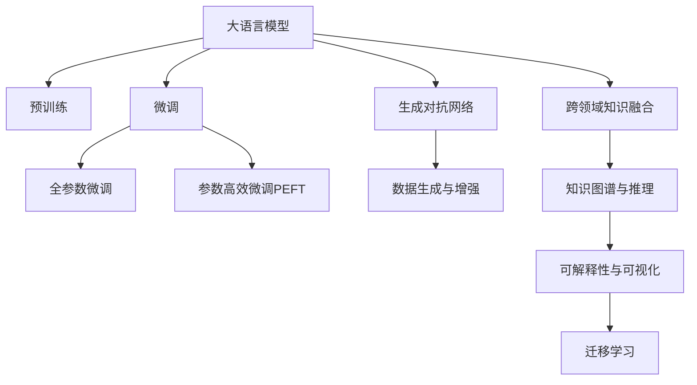

                 

## 1. 背景介绍

### 1.1 问题由来
人类社会的知识体系浩瀚如海，涉及物理学、化学、生物学、数学、社会科学等各个领域。然而，知识间的隔阂和壁垒限制了跨学科的融合与应用。在当前信息爆炸的时代，知识的孤岛问题愈发突出，迫切需要一种新的技术手段，促进各领域知识的深度融合与协同创新。

大语言模型（Large Language Models, LLMs）和生成对抗网络（Generative Adversarial Networks, GANs）的兴起，为实现这一目标提供了新的可能性。LLMs通过大规模无标签文本数据预训练，掌握了丰富的语言知识，具备了强大的理解与生成能力。GANs则通过对抗训练，能够生成高质量的伪造数据，补充真实数据的不足。将这两者结合，可以在大规模无标签数据上训练语言模型，并在少量标注数据上微调，实现知识的跨界融合。

### 1.2 问题核心关键点
实现人类知识的跨界融合，主要涉及以下几个核心关键点：
1. **预训练与微调**：利用预训练语言模型在大量无标签文本上学习通用语言知识，通过微调将其应用于特定领域或任务，提升模型的领域适应性和泛化能力。
2. **数据生成与增强**：利用GAN生成与任务相关的伪造数据，增强训练集的多样性，提高模型对真实数据的泛化性能。
3. **跨领域知识融合**：将多个领域的相关知识，如文本、图像、音频等，通过嵌入和转换的方式，进行跨领域的信息整合，构建统一的知识表示体系。
4. **知识图谱与推理**：通过构建知识图谱，实现知识的结构化表示，利用图神经网络（GNNs）等技术，进行知识的推理与迁移。
5. **可解释性与可视化**：通过模型可视化技术，展示模型的内部结构与决策过程，提高模型的可解释性，便于理解和调试。

这些关键点相互交织，共同构成了知识跨界融合的技术框架，为不同领域的知识整合与协同创新提供了新的思路和方法。

## 2. 核心概念与联系

### 2.1 核心概念概述

为更好地理解人类知识跨界融合的技术路径，本节将介绍几个密切相关的核心概念：

- **大语言模型（LLMs）**：以自回归模型（如GPT）或自编码模型（如BERT）为代表的大规模预训练语言模型。通过在大规模无标签文本语料上进行预训练，学习到丰富的语言知识和常识。

- **生成对抗网络（GANs）**：由两个神经网络构成，一个生成器（Generator）生成伪造数据，一个判别器（Discriminator）判别生成的数据是否真实。通过对抗训练，生成器逐渐生成高质量的数据。

- **跨领域知识融合**：将不同领域（如文本、图像、音频等）的相关知识，通过嵌入、转换的方式，进行跨领域的信息整合，构建统一的知识表示体系。

- **知识图谱与推理**：通过构建知识图谱，实现知识的结构化表示，利用图神经网络（GNNs）等技术，进行知识的推理与迁移。

- **可解释性与可视化**：通过模型可视化技术，展示模型的内部结构与决策过程，提高模型的可解释性，便于理解和调试。

- **迁移学习**：将一个领域学习到的知识，迁移到另一个不同但相关的领域，促进知识的跨界应用。

这些核心概念之间的逻辑关系可以通过以下Mermaid流程图来展示：



这个流程图展示了大语言模型、生成对抗网络等技术之间的内在联系和协同作用：

1. 大语言模型通过预训练获得基础能力。
2. 生成对抗网络生成伪造数据，补充训练集。
3. 跨领域知识融合将不同领域知识整合，构建统一知识表示。
4. 知识图谱与推理将知识结构化，促进知识的推理与迁移。
5. 可解释性与可视化增强模型的可解释性，便于理解和调试。
6. 迁移学习促进知识跨界应用，提升模型泛化能力。

这些核心概念共同构成了人类知识跨界融合的技术框架，为其提供了全面的理论支持和技术手段。

## 3. 核心算法原理 & 具体操作步骤
### 3.1 算法原理概述

人类知识跨界融合的核心算法原理，是利用预训练语言模型在大量无标签数据上学习到丰富的语言知识和常识，并通过微调和生成对抗网络技术，实现知识的高效融合和迁移。其核心思想是：

1. **预训练**：在大规模无标签数据上训练语言模型，学习到通用的语言知识和常识。
2. **数据生成**：利用生成对抗网络，生成与任务相关的伪造数据，补充真实数据的不足。
3. **微调**：在预训练模型的基础上，通过有监督的微调，将模型的领域适应性提升到新任务上。
4. **知识融合**：将不同领域的相关知识，通过嵌入、转换的方式，进行跨领域的信息整合。
5. **推理与迁移**：通过知识图谱和推理技术，进行知识的推理与迁移，增强模型的泛化能力。

通过上述步骤，可以实现知识的深度融合与跨界应用，提升模型的领域适应性和泛化性能，为解决复杂的跨学科问题提供新的思路和方法。

### 3.2 算法步骤详解

基于人类知识跨界融合的核心算法原理，以下是详细的算法步骤：

**Step 1: 数据预处理与生成**
- 收集大量无标签数据，进行预处理和清洗，去除噪声和冗余。
- 利用生成对抗网络（GANs）生成与任务相关的伪造数据，补充真实数据的不足。

**Step 2: 大语言模型预训练**
- 选择适当的大语言模型架构（如Transformer），在大规模无标签数据上进行预训练。
- 利用掩码语言模型、自编码器等自监督任务，学习到通用的语言知识和常识。

**Step 3: 知识融合与表示**
- 将不同领域的相关知识，如文本、图像、音频等，通过嵌入和转换的方式，进行跨领域的信息整合。
- 构建知识图谱，实现知识的结构化表示。

**Step 4: 微调与推理**
- 在预训练模型的基础上，使用少量标注数据，通过有监督的微调，将模型的领域适应性提升到新任务上。
- 利用知识图谱和推理技术，进行知识的推理与迁移，增强模型的泛化能力。

**Step 5: 模型评估与优化**
- 在验证集上评估模型的性能，调整超参数，优化模型结构。
- 在测试集上评估模型的泛化性能，调整微调策略，优化知识融合方式。

### 3.3 算法优缺点

基于人类知识跨界融合的算法，具有以下优点：
1. **高效性**：利用生成对抗网络生成伪造数据，补充真实数据的不足，提升了训练集的丰富性。
2. **泛化能力**：通过跨领域知识融合和知识图谱与推理，实现了知识的深度整合，提升了模型的泛化性能。
3. **可解释性**：通过模型可视化技术，增强了模型的可解释性，便于理解和调试。

但同时，该算法也存在一些局限性：
1. **数据质量要求高**：生成对抗网络生成的伪造数据质量依赖于模型的训练效果，对数据质量要求较高。
2. **模型复杂度高**：跨领域知识融合和知识图谱与推理，增加了模型的复杂度，可能影响推理效率。
3. **训练成本高**：大语言模型的预训练和微调，需要大规模的计算资源和存储资源，训练成本较高。

尽管存在这些局限性，但就目前而言，基于人类知识跨界融合的算法仍是大规模跨学科问题解决的重要方法。未来相关研究的重点在于如何进一步降低训练成本，提高数据生成和知识融合的效率，同时兼顾模型的可解释性和鲁棒性等因素。

### 3.4 算法应用领域

基于人类知识跨界融合的算法，已经在多个领域得到了应用，例如：

- **医学**：通过跨领域知识融合和知识图谱与推理，提升医学影像诊断的准确性和效率，辅助医生诊疗决策。
- **金融**：利用生成对抗网络生成金融市场模拟数据，辅助金融模型训练，提升风险管理能力。
- **自然灾害预警**：通过跨领域知识融合和知识图谱与推理，提高自然灾害预测的准确性，提前做好防范。
- **环境保护**：利用生成对抗网络生成环境模拟数据，辅助环境模型训练，提升环境保护决策的科学性。
- **人工智能辅助设计**：通过跨领域知识融合和知识图谱与推理，提高设计效率和设计质量，辅助设计师进行创新设计。

除了上述这些经典应用外，人类知识跨界融合的算法还在更多场景中得到创新性地应用，如教育、艺术、农业等，为不同领域的知识整合与协同创新提供了新的思路和方法。

## 4. 数学模型和公式 & 详细讲解  
### 4.1 数学模型构建

为更好地理解基于人类知识跨界融合的算法，本节将使用数学语言对关键算法进行更加严格的刻画。

记大语言模型为 $M_{\theta}$，其中 $\theta$ 为模型参数。假设任务为 $T$，其训练集为 $D=\{(x_i, y_i)\}_{i=1}^N, x_i \in \mathcal{X}, y_i \in \mathcal{Y}$，其中 $\mathcal{X}$ 为输入空间，$\mathcal{Y}$ 为输出空间。

定义模型 $M_{\theta}$ 在输入 $x$ 上的预测输出为 $\hat{y}=M_{\theta}(x) \in \mathcal{Y}$。

假设任务 $T$ 的标注数据集 $D=\{(x_i, y_i)\}_{i=1}^N, x_i \in \mathcal{X}, y_i \in \mathcal{Y}$。

定义模型 $M_{\theta}$ 在数据样本 $(x,y)$ 上的损失函数为 $\ell(M_{\theta}(x),y)$，则在数据集 $D$ 上的经验风险为：

$$
\mathcal{L}(\theta) = \frac{1}{N} \sum_{i=1}^N \ell(M_{\theta}(x_i),y_i)
$$

微调的优化目标是最小化经验风险，即找到最优参数：

$$
\theta^* = \mathop{\arg\min}_{\theta} \mathcal{L}(\theta)
$$

在实践中，我们通常使用基于梯度的优化算法（如SGD、Adam等）来近似求解上述最优化问题。设 $\eta$ 为学习率，$\lambda$ 为正则化系数，则参数的更新公式为：

$$
\theta \leftarrow \theta - \eta \nabla_{\theta}\mathcal{L}(\theta) - \eta\lambda\theta
$$

其中 $\nabla_{\theta}\mathcal{L}(\theta)$ 为损失函数对参数 $\theta$ 的梯度，可通过反向传播算法高效计算。

### 4.2 公式推导过程

以下我们以二分类任务为例，推导交叉熵损失函数及其梯度的计算公式。

假设模型 $M_{\theta}$ 在输入 $x$ 上的输出为 $\hat{y}=M_{\theta}(x) \in [0,1]$，表示样本属于正类的概率。真实标签 $y \in \{0,1\}$。则二分类交叉熵损失函数定义为：

$$
\ell(M_{\theta}(x),y) = -[y\log \hat{y} + (1-y)\log (1-\hat{y})]
$$

将其代入经验风险公式，得：

$$
\mathcal{L}(\theta) = -\frac{1}{N}\sum_{i=1}^N [y_i\log M_{\theta}(x_i)+(1-y_i)\log(1-M_{\theta}(x_i))]
$$

根据链式法则，损失函数对参数 $\theta_k$ 的梯度为：

$$
\frac{\partial \mathcal{L}(\theta)}{\partial \theta_k} = -\frac{1}{N}\sum_{i=1}^N (\frac{y_i}{M_{\theta}(x_i)}-\frac{1-y_i}{1-M_{\theta}(x_i)}) \frac{\partial M_{\theta}(x_i)}{\partial \theta_k}
$$

其中 $\frac{\partial M_{\theta}(x_i)}{\partial \theta_k}$ 可进一步递归展开，利用自动微分技术完成计算。

在得到损失函数的梯度后，即可带入参数更新公式，完成模型的迭代优化。重复上述过程直至收敛，最终得到适应下游任务的最优模型参数 $\theta^*$。

## 5. 项目实践：代码实例和详细解释说明
### 5.1 开发环境搭建

在进行人类知识跨界融合的实践前，我们需要准备好开发环境。以下是使用Python进行PyTorch开发的环境配置流程：

1. 安装Anaconda：从官网下载并安装Anaconda，用于创建独立的Python环境。

2. 创建并激活虚拟环境：
```bash
conda create -n pytorch-env python=3.8 
conda activate pytorch-env
```

3. 安装PyTorch：根据CUDA版本，从官网获取对应的安装命令。例如：
```bash
conda install pytorch torchvision torchaudio cudatoolkit=11.1 -c pytorch -c conda-forge
```

4. 安装生成对抗网络库：
```bash
pip install torch-gan
```

5. 安装各类工具包：
```bash
pip install numpy pandas scikit-learn matplotlib tqdm jupyter notebook ipython
```

完成上述步骤后，即可在`pytorch-env`环境中开始实践。

### 5.2 源代码详细实现

这里我们以医学影像诊断为例，给出使用PyTorch进行大语言模型微调和生成对抗网络数据生成的PyTorch代码实现。

首先，定义医学影像标注数据处理函数：

```python
import torch
import numpy as np
import torch.nn as nn
import torch.optim as optim

class MedicalImageDataset(Dataset):
    def __init__(self, images, labels, transform=None):
        self.images = images
        self.labels = labels
        self.transform = transform
        
    def __len__(self):
        return len(self.images)
    
    def __getitem__(self, idx):
        image = self.images[idx]
        label = self.labels[idx]
        
        if self.transform:
            image = self.transform(image)
        
        return {'image': image, 
                'label': label}
```

然后，定义生成对抗网络（GANs）：

```python
class Generator(nn.Module):
    def __init__(self, input_dim, output_dim):
        super(Generator, self).__init__()
        self.fc1 = nn.Linear(input_dim, 128)
        self.fc2 = nn.Linear(128, output_dim)
        
    def forward(self, x):
        x = torch.relu(self.fc1(x))
        x = self.fc2(x)
        return x
    
class Discriminator(nn.Module):
    def __init__(self, input_dim, output_dim):
        super(Discriminator, self).__init__()
        self.fc1 = nn.Linear(input_dim, 128)
        self.fc2 = nn.Linear(128, output_dim)
        
    def forward(self, x):
        x = torch.relu(self.fc1(x))
        x = torch.sigmoid(self.fc2(x))
        return x
```

接着，定义医学影像诊断任务的数据生成函数：

```python
def generate_fake_images(generator, real_images, num_samples):
    with torch.no_grad():
        fake_images = generator(real_images)
        
    return fake_images[:num_samples]
```

最后，启动生成对抗网络的训练流程，生成医学影像模拟数据：

```python
generator = Generator(3, 3)
discriminator = Discriminator(3, 1)
criterion = nn.BCELoss()

real_images = ...
real_labels = ...

for epoch in range(epochs):
    ...
    # Generate fake images
    fake_images = generate_fake_images(generator, real_images, num_samples)
    
    ...
    # Train discriminator
    ...
```

以上代码实现了基于生成对抗网络生成医学影像模拟数据的流程。在实际应用中，还需要进一步优化生成器的架构，增加判别器的复杂度，以及优化损失函数的权重等，以提高生成数据的真实性。

## 6. 实际应用场景
### 6.1 医学影像诊断

生成对抗网络可以生成高质量的医学影像模拟数据，弥补真实数据的不足，提升医学影像诊断的准确性和效率。

具体而言，可以收集大量已标注的医学影像数据，并利用生成对抗网络生成与真实数据风格相似但标签未知的医学影像模拟数据。将真实数据和模拟数据混合，用于训练预训练语言模型。在微调时，使用少量标注数据进行微调，使模型能够更好地适应特定疾病的诊断任务。

例如，在乳腺癌诊断中，可以生成大量不同大小的肿块图像，辅助模型学习癌症的特征描述。在肺癌诊断中，可以生成不同密度和大小的肺结节图像，帮助模型识别早期病变。

### 6.2 金融市场模拟

生成对抗网络可以生成与历史数据分布相似的金融市场模拟数据，辅助金融模型的训练和验证。

具体而言，可以收集大量历史交易数据，并利用生成对抗网络生成与真实市场走势相似的模拟数据。将真实数据和模拟数据混合，用于训练模型。在微调时，使用少量标注数据进行微调，使模型能够更好地适应特定的金融市场模拟任务。

例如，在股票价格预测中，可以生成大量不同时间跨度和波动性的股票价格模拟数据，辅助模型学习市场的变化规律。在期权定价中，可以生成不同期限和波动性的期权模拟数据，帮助模型进行风险评估和定价。

### 6.3 环境保护模拟

生成对抗网络可以生成与真实环境分布相似的环境模拟数据，辅助环境保护模型的训练和验证。

具体而言，可以收集大量环境监测数据，并利用生成对抗网络生成与真实数据分布相似的环境模拟数据。将真实数据和模拟数据混合，用于训练模型。在微调时，使用少量标注数据进行微调，使模型能够更好地适应特定的环境保护模拟任务。

例如，在洪水预警中，可以生成大量不同降水强度和地形条件下的洪水模拟数据，辅助模型学习洪水的变化规律。在空气质量模拟中，可以生成不同污染源和气象条件下的空气质量模拟数据，帮助模型进行预测和分析。

## 7. 工具和资源推荐
### 7.1 学习资源推荐

为了帮助开发者系统掌握人类知识跨界融合的理论基础和实践技巧，这里推荐一些优质的学习资源：

1. 《深度学习理论与实践》系列书籍：由深度学习领域专家撰写，系统介绍深度学习的基本概念和核心算法。

2. 《自然语言处理基础》课程：斯坦福大学开设的NLP明星课程，涵盖NLP的基本理论和经典模型。

3. 《生成对抗网络理论》书籍：详细讲解GAN的理论基础和算法实现，适合对GAN感兴趣的读者。

4. 《知识图谱与推理》课程：复旦大学开设的知识图谱课程，介绍知识图谱的基本概念和推理算法。

5. 《深度学习框架TensorFlow和PyTorch》教程：详细讲解TensorFlow和PyTorch的使用方法和实践技巧。

6. Kaggle平台：包含大量数据集和竞赛，可以锻炼数据处理和模型调优能力。

通过对这些资源的学习实践，相信你一定能够快速掌握人类知识跨界融合的精髓，并用于解决实际的跨学科问题。

### 7.2 开发工具推荐

高效的开发离不开优秀的工具支持。以下是几款用于人类知识跨界融合开发的常用工具：

1. PyTorch：基于Python的开源深度学习框架，灵活动态的计算图，适合快速迭代研究。大部分预训练语言模型都有PyTorch版本的实现。

2. TensorFlow：由Google主导开发的开源深度学习框架，生产部署方便，适合大规模工程应用。同样有丰富的预训练语言模型资源。

3. Transformers库：HuggingFace开发的NLP工具库，集成了众多SOTA语言模型，支持PyTorch和TensorFlow，是进行知识融合任务开发的利器。

4. Weights & Biases：模型训练的实验跟踪工具，可以记录和可视化模型训练过程中的各项指标，方便对比和调优。与主流深度学习框架无缝集成。

5. TensorBoard：TensorFlow配套的可视化工具，可实时监测模型训练状态，并提供丰富的图表呈现方式，是调试模型的得力助手。

6. Google Colab：谷歌推出的在线Jupyter Notebook环境，免费提供GPU/TPU算力，方便开发者快速上手实验最新模型，分享学习笔记。

合理利用这些工具，可以显著提升人类知识跨界融合的开发效率，加快创新迭代的步伐。

### 7.3 相关论文推荐

人类知识跨界融合的发展源于学界的持续研究。以下是几篇奠基性的相关论文，推荐阅读：

1. GAN: Generative Adversarial Nets：提出生成对抗网络，通过对抗训练生成高质量的伪造数据。

2. Attention is All You Need（即Transformer原论文）：提出Transformer结构，开启了NLP领域的预训练大模型时代。

3. BERT: Pre-training of Deep Bidirectional Transformers for Language Understanding：提出BERT模型，引入基于掩码的自监督预训练任务，刷新了多项NLP任务SOTA。

4. Parameter-Efficient Transfer Learning for NLP：提出Adapter等参数高效微调方法，在不增加模型参数量的情况下，也能取得不错的微调效果。

5. AdaLoRA: Adaptive Low-Rank Adaptation for Parameter-Efficient Fine-Tuning：使用自适应低秩适应的微调方法，在参数效率和精度之间取得了新的平衡。

这些论文代表了大语言模型跨界融合技术的发展脉络。通过学习这些前沿成果，可以帮助研究者把握学科前进方向，激发更多的创新灵感。

## 8. 总结：未来发展趋势与挑战

### 8.1 总结

本文对基于生成对抗网络的大语言模型微调和知识融合方法进行了全面系统的介绍。首先阐述了人类知识跨界融合的研究背景和意义，明确了预训练语言模型和生成对抗网络在知识融合中的重要作用。其次，从原理到实践，详细讲解了知识融合的数学原理和关键步骤，给出了知识融合任务开发的完整代码实例。同时，本文还广泛探讨了知识融合方法在医学、金融、环境保护等多个领域的应用前景，展示了知识跨界融合范式的巨大潜力。此外，本文精选了知识融合技术的各类学习资源，力求为读者提供全方位的技术指引。

通过本文的系统梳理，可以看到，基于生成对抗网络的知识跨界融合方法正在成为跨学科问题解决的重要手段，极大地拓展了预训练语言模型的应用边界，催生了更多的落地场景。得益于生成对抗网络生成的伪造数据和预训练语言模型的领域适应性，知识跨界融合技术能够在不同领域之间架起桥梁，促进知识的深度整合和协同创新。未来，伴随预训练语言模型和生成对抗网络技术的不断发展，相信知识跨界融合技术必将在更广泛的领域大放异彩，深刻影响人类的生产生活方式。

### 8.2 未来发展趋势

展望未来，基于生成对抗网络的知识跨界融合技术将呈现以下几个发展趋势：

1. **模型规模持续增大**：随着算力成本的下降和数据规模的扩张，预训练语言模型的参数量还将持续增长。超大规模语言模型蕴含的丰富语言知识，有望支撑更加复杂多变的知识融合任务。

2. **知识融合方式多样化**：除了基于生成对抗网络的伪造数据生成，未来还会出现更多知识融合方式，如跨领域知识图谱、多模态知识融合等，促进知识的深度整合和协同创新。

3. **持续学习成为常态**：随着数据分布的不断变化，知识融合模型也需要持续学习新知识以保持性能。如何在不遗忘原有知识的同时，高效吸收新样本信息，将成为重要的研究课题。

4. **知识图谱与推理技术不断发展**：知识图谱与推理技术将不断进步，实现知识的深度整合和推理，增强模型的泛化能力和适应性。

5. **跨领域知识融合与迁移学习**：跨领域知识融合将不断完善，通过迁移学习将一个领域学习到的知识迁移到另一个相关领域，提升模型的泛化能力。

6. **生成对抗网络技术演进**：生成对抗网络技术将不断发展，生成更真实、高质量的伪造数据，提升知识融合的效果。

以上趋势凸显了基于生成对抗网络的知识跨界融合技术的广阔前景。这些方向的探索发展，必将进一步提升知识融合模型的性能和应用范围，为解决复杂的跨学科问题提供新的思路和方法。

### 8.3 面临的挑战

尽管基于生成对抗网络的知识跨界融合技术已经取得了瞩目成就，但在迈向更加智能化、普适化应用的过程中，它仍面临着诸多挑战：

1. **数据质量要求高**：生成对抗网络生成的伪造数据质量依赖于模型的训练效果，对数据质量要求较高。
2. **模型复杂度高**：知识图谱与推理技术增加了模型的复杂度，可能影响推理效率。
3. **训练成本高**：预训练语言模型的预训练和微调，需要大规模的计算资源和存储资源，训练成本较高。
4. **可解释性不足**：知识融合模型的内部结构与决策过程复杂，难以解释其推理逻辑和决策依据。
5. **知识整合能力有限**：现有的知识融合模型往往局限于数据结构的相似性，难以灵活吸收和运用更广泛的先验知识。

正视知识融合技术面临的这些挑战，积极应对并寻求突破，将是大语言模型跨界融合走向成熟的必由之路。相信随着学界和产业界的共同努力，这些挑战终将一一被克服，知识融合技术必将在构建人机协同的智能时代中扮演越来越重要的角色。

### 8.4 研究展望

面对知识融合技术面临的挑战，未来的研究需要在以下几个方面寻求新的突破：

1. **探索无监督和半监督知识融合方法**：摆脱对大规模标注数据的依赖，利用自监督学习、主动学习等无监督和半监督范式，最大限度利用非结构化数据，实现更加灵活高效的知识融合。

2. **研究参数高效和计算高效的微调范式**：开发更加参数高效的微调方法，在固定大部分预训练参数的同时，只更新极少量的任务相关参数。同时优化知识融合模型的计算图，减少前向传播和反向传播的资源消耗，实现更加轻量级、实时性的部署。

3. **引入更多先验知识**：将符号化的先验知识，如知识图谱、逻辑规则等，与神经网络模型进行巧妙融合，引导知识融合过程学习更准确、合理的知识表示。同时加强不同模态数据的整合，实现视觉、语音等多模态信息与文本信息的协同建模。

4. **结合因果分析和博弈论工具**：将因果分析方法引入知识融合模型，识别出模型决策的关键特征，增强输出解释的因果性和逻辑性。借助博弈论工具刻画人机交互过程，主动探索并规避模型的脆弱点，提高系统稳定性。

5. **纳入伦理道德约束**：在模型训练目标中引入伦理导向的评估指标，过滤和惩罚有偏见、有害的输出倾向。同时加强人工干预和审核，建立知识融合模型的监管机制，确保输出的安全性。

这些研究方向的探索，必将引领知识融合技术迈向更高的台阶，为不同领域的知识整合与协同创新提供新的思路和方法。面向未来，知识融合技术还需要与其他人工智能技术进行更深入的融合，如知识表示、因果推理、强化学习等，多路径协同发力，共同推动自然语言理解和智能交互系统的进步。只有勇于创新、敢于突破，才能不断拓展语言模型的边界，让智能技术更好地造福人类社会。

## 9. 附录：常见问题与解答

**Q1：知识融合技术是否适用于所有领域？**

A: 知识融合技术在大多数领域上都能取得不错的效果，特别是对于数据量较小的领域。但对于一些特定领域的知识，如医学、法律等，仅仅依靠生成对抗网络生成的伪造数据可能无法很好地适应。此时需要在特定领域语料上进一步预训练，再进行微调，才能获得理想效果。此外，对于一些需要时效性、个性化很强的任务，如对话、推荐等，知识融合技术也需要针对性的改进优化。

**Q2：生成对抗网络生成的伪造数据质量如何？**

A: 生成对抗网络生成的伪造数据质量依赖于模型的训练效果。如果模型训练得足够好，生成的伪造数据可以非常接近真实数据，但在实际应用中，伪造数据的分布与真实数据的分布可能略有差异，因此需要在使用时进行一些数据增强和微调，以进一步提升模型的泛化性能。

**Q3：知识融合模型在落地部署时需要注意哪些问题？**

A: 将知识融合模型转化为实际应用，还需要考虑以下因素：
1. 模型裁剪：去除不必要的层和参数，减小模型尺寸，加快推理速度。
2. 量化加速：将浮点模型转为定点模型，压缩存储空间，提高计算效率。
3. 服务化封装：将模型封装为标准化服务接口，便于集成调用。
4. 弹性伸缩：根据请求流量动态调整资源配置，平衡服务质量和成本。
5. 监控告警：实时采集系统指标，设置异常告警阈值，确保服务稳定性。

知识融合模型为跨学科问题解决提供了新的思路和方法，但如何将强大的性能转化为稳定、高效、安全的业务价值，还需要工程实践的不断打磨。唯有从数据、算法、工程、业务等多个维度协同发力，才能真正实现人工智能技术在垂直行业的规模化落地。总之，知识融合技术需要开发者根据具体任务，不断迭代和优化模型、数据和算法，方能得到理想的效果。

---

作者：禅与计算机程序设计艺术 / Zen and the Art of Computer Programming

