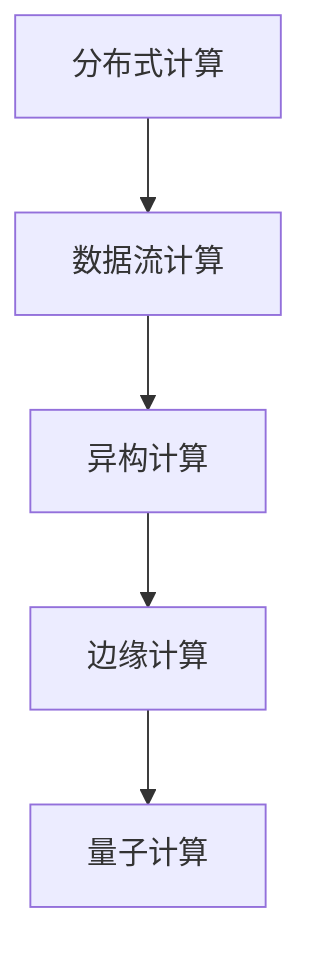

                 

# 人类计算的未来：趋势、机遇与挑战

## 1. 背景介绍

### 1.1 问题由来
随着计算技术的快速演进，人类计算的范式正在经历深刻变革。从早期的机械计算到早期的电子计算机，再到今天的分布式云计算和大数据中心，每一次技术飞跃都极大提升了计算效率，拓展了计算能力的应用边界。然而，伴随着算力成本的不断攀升和数据量的爆炸式增长，传统集中式计算模式面临诸多瓶颈，难以满足日益复杂的计算需求。

### 1.2 问题核心关键点
人类计算的未来趋势可以从以下几个方面进行探讨：

- **计算范式的演进**：从集中式计算向分布式计算转变，利用互联网和云计算平台，实现计算资源的泛在化。
- **计算模型的创新**：从基于硬件的冯诺依曼模型向基于软件的数据流模型演进，打破数据的流动瓶颈。
- **计算效率的提升**：通过优化算法、硬件加速、并行计算等手段，提升计算效率，缩短任务完成时间。
- **计算环境的多样化**：从传统的服务器、PC向移动端、边缘设备拓展，形成多模态计算网络。
- **计算生态的协作**：从单一技术栈向多技术栈融合，构建开放、协作的计算生态。

理解这些趋势，有助于我们把握计算技术的发展脉络，探索未来计算范式的可能性。

## 2. 核心概念与联系

### 2.1 核心概念概述

为更好地理解人类计算的未来趋势，本节将介绍几个关键概念及其联系：

- **分布式计算**：指将计算任务分布在多台计算机上进行并行处理的技术。通过互联网或集群网络，实现计算资源的共享与协作，提升计算效率。
- **数据流计算**：指在数据流驱动下，动态构建计算图，实现高效、灵活的数据处理方式。与传统的静态图计算相比，数据流计算更具弹性和适应性。
- **异构计算**：指利用不同类型硬件（如CPU、GPU、FPGA、ASIC等），发挥各自优势，进行协同计算。异构计算能大幅提升计算效率，降低能耗。
- **边缘计算**：指在数据产生地附近，利用边缘设备进行本地计算和数据处理，减少数据传输延时和带宽占用。边缘计算为实时应用场景提供了更高效的计算解决方案。
- **量子计算**：指利用量子比特进行计算的新型计算模型，在特定领域具备超强的计算能力。量子计算有望解决某些传统计算无法解决的复杂问题。

这些概念之间存在紧密的联系，共同构建了未来计算技术的发展蓝图。

### 2.2 核心概念原理和架构的 Mermaid 流程图



这个流程图展示了人类计算未来趋势的演进路径：从分布式计算到数据流计算，再到异构计算、边缘计算和量子计算，每个概念都是对前者的补充和扩展，共同推动计算技术的边界不断拓展。

## 3. 核心算法原理 & 具体操作步骤
### 3.1 算法原理概述

人类计算的未来趋势基于以下几个核心算法原理：

- **分布式算法**：通过将计算任务分割为多个子任务，在不同的计算节点上并行处理，实现计算效率的提升。典型的分布式算法包括MapReduce、Spark等。
- **数据流算法**：动态构建计算图，实时处理数据流，提升计算的灵活性和实时性。例如，Apache Flink、Storm等数据流计算框架。
- **异构算法**：利用不同类型的硬件资源，优化任务调度和计算模式，提高计算效率。如CUDA并行计算、OpenCL跨平台计算等。
- **边缘算法**：在数据产生地附近进行本地计算，减少数据传输，提高实时性。例如，TensorFlow Lite、边缘计算框架IoT Edge等。
- **量子算法**：利用量子比特的特殊性质，如叠加态、纠缠态，解决特定领域的计算问题，如Shor算法、Grover算法等。

这些算法原理共同构成了未来计算技术的基础，为实现高效、灵活、可靠的计算提供了技术支撑。

### 3.2 算法步骤详解

基于上述核心算法原理，我们可以进一步探讨未来计算技术的具体操作步骤：

1. **分布式计算**：将计算任务分割为多个子任务，在多台计算机上并行处理。
   - 设计分布式计算框架，如Apache Hadoop、Spark等，实现任务调度和管理。
   - 通过网络通信协议（如TCP/IP），实现任务数据的分布式传输和处理。

2. **数据流计算**：实时处理数据流，动态构建计算图。
   - 选择合适的数据流计算框架，如Apache Flink、Storm等，实现实时数据处理。
   - 设计数据流计算图，动态调整计算逻辑和资源分配，提升处理效率。

3. **异构计算**：利用不同类型的硬件资源，优化计算任务。
   - 选择合适的异构计算平台，如NVIDIA CUDA、AMD ROCm等，进行并行计算。
   - 设计异构计算算法，利用不同硬件的优势，优化任务性能。

4. **边缘计算**：在数据产生地附近进行本地计算，减少数据传输。
   - 部署边缘计算设备，如IoT设备、移动终端等，进行本地计算和数据处理。
   - 设计边缘计算算法，优化本地计算和数据传输。

5. **量子计算**：利用量子比特的特殊性质，解决特定领域的计算问题。
   - 选择合适的量子计算平台，如IBM Q System One、Google Sycamore等，进行量子计算。
   - 设计量子计算算法，利用量子比特的特殊性质，优化计算性能。

### 3.3 算法优缺点

人类计算的未来趋势具有以下优缺点：

**优点**：
- **高效性**：通过分布式、数据流、异构、边缘和量子计算技术，能够大幅提升计算效率，缩短任务完成时间。
- **灵活性**：数据流计算和边缘计算能够适应各种实时应用场景，提供更灵活的计算方式。
- **可靠性**：异构计算和边缘计算能够提高系统的鲁棒性，减少数据传输延时和带宽占用。
- **安全性**：分布式计算和异构计算能够提升系统的安全性，降低单点故障的风险。

**缺点**：
- **复杂性**：分布式计算和数据流计算的设计和实现较为复杂，需要跨团队协作。
- **能耗问题**：异构计算和量子计算的高能耗问题需要解决，避免资源浪费。
- **标准化问题**：边缘计算和量子计算的标准化问题需要协调，避免技术差异带来的兼容性问题。

### 3.4 算法应用领域

未来计算技术的应用领域非常广泛，涉及多个行业和学科：

- **云计算和大数据**：利用分布式计算和数据流计算，处理海量数据，提供弹性计算资源。
- **物联网和智能家居**：利用边缘计算和异构计算，实现实时数据处理和设备协同，提升智能家居的智能化水平。
- **人工智能和机器学习**：利用数据流计算和异构计算，加速模型训练和推理，提升AI系统的性能。
- **金融和证券**：利用分布式计算和量子计算，实现高频交易和风险评估，提升金融服务的效率。
- **生物医学**：利用异构计算和量子计算，解决复杂的生物医学问题，提升科研能力。
- **气象和环境**：利用分布式计算和边缘计算，实时处理气象和环境数据，提升灾害预警能力。

## 4. 数学模型和公式 & 详细讲解 & 举例说明

### 4.1 数学模型构建

在计算技术的未来趋势中，数学模型和算法的重要性不言而喻。以下是一些关键的数学模型和公式：

- **分布式算法**：如MapReduce模型，其数学模型如下：
  - $Map(\text{key}, \text{value})$：对键值对进行映射操作。
  - $Reduce(\text{key}, [\text{value}_1, \text{value}_2, ...])$：对映射后的结果进行聚合操作。

- **数据流算法**：如Apache Flink的流处理模型，其数学模型如下：
  - $ProcessElement(\text{element}, \text{state}, \text{watermark})$：对数据流中的元素进行处理，并更新状态。
  - $OnWatermark(\text{watermark})$：处理时间戳（watermark），并清除过期状态。

- **异构算法**：如CUDA并行计算，其数学模型如下：
  - $\text{parallelSum}(\text{A}, \text{B})$：对数组A和B进行并行求和操作。
  - $\text{parallelReduce}(\text{A}, \text{B})$：对数组A和B进行并行聚合操作。

### 4.2 公式推导过程

以下是几个核心算法的数学公式推导过程：

**MapReduce模型**：
- 假设有一个包含$n$个键值对的输入集合$I=\{(k_1, v_1), (k_2, v_2), ..., (k_n, v_n)\}$。
- Map操作将每个键值对映射为两个输出键值对$M=\{(k_1', v_1'), (k_2', v_2'), ..., (k_m', v_m')\}$。
- Reduce操作将相同键的多个值进行聚合，得到最终输出$O=\{(k_1', V_1'), (k_2', V_2'), ..., (k_l', V_l')\}$，其中$V_i'=\sum_{j=1}^{m_i'} v_{j}'$。

**Apache Flink流处理模型**：
- 假设有一个包含$m$个元素的数据流$S=\{e_1, e_2, ..., e_m\}$。
- Process操作对每个元素进行处理，并更新状态$S'=\{e_1', e_2', ..., e_m'\}$。
- OnWatermark操作处理时间戳，并清除过期状态$S''=\{e_1'', e_2'', ..., e_m''\}$。

**CUDA并行计算**：
- 假设有一个包含$n$个元素的数组$A$。
- 并行求和操作$\text{parallelSum}(A, B)$，其中$B=\{b_1, b_2, ..., b_n\}$，$b_i=a_i+\sum_{j=1}^{i-1} a_j$。
- 并行聚合操作$\text{parallelReduce}(A, B)$，其中$B=\{b_1, b_2, ..., b_n\}$，$b_i=\sum_{j=1}^{i} a_j$。

### 4.3 案例分析与讲解

为了更好地理解上述数学模型的应用，我们以一个具体的案例进行分析：

假设有一个公司需要处理大量的订单数据，订单数据包含用户ID、订单号、商品ID、订单金额等关键信息。公司希望通过分布式计算和数据流计算，实时处理订单数据，并生成实时报告。

**步骤1**：设计分布式计算框架，如Hadoop或Spark，将订单数据分割为多个子任务，在多台计算机上并行处理。

**步骤2**：设计数据流计算图，如Apache Flink，实时处理订单数据，并生成实时报告。

**步骤3**：利用异构计算平台，如NVIDIA CUDA，优化计算性能，加速模型训练和推理。

**步骤4**：部署边缘计算设备，如IoT设备，进行本地计算和数据处理，提升智能家居的智能化水平。

**步骤5**：利用量子计算平台，如IBM Q System One，解决复杂的生物医学问题，提升科研能力。

## 5. 项目实践：代码实例和详细解释说明
### 5.1 开发环境搭建

在进行计算技术的未来趋势实践前，我们需要准备好开发环境。以下是使用Python进行PyTorch开发的环境配置流程：

1. 安装Anaconda：从官网下载并安装Anaconda，用于创建独立的Python环境。

2. 创建并激活虚拟环境：
```bash
conda create -n pytorch-env python=3.8 
conda activate pytorch-env
```

3. 安装PyTorch：根据CUDA版本，从官网获取对应的安装命令。例如：
```bash
conda install pytorch torchvision torchaudio cudatoolkit=11.1 -c pytorch -c conda-forge
```

4. 安装TensorFlow：
```bash
pip install tensorflow
```

5. 安装各类工具包：
```bash
pip install numpy pandas scikit-learn matplotlib tqdm jupyter notebook ipython
```

完成上述步骤后，即可在`pytorch-env`环境中开始计算技术的未来趋势实践。

### 5.2 源代码详细实现

下面我们以分布式计算中的MapReduce为例，给出使用PyTorch进行分布式计算的PyTorch代码实现。

首先，定义MapReduce算法的核心函数：

```python
from typing import List, Dict

def map_fn(key: int, value: int) -> List[Dict[str, int]]:
    # 实现映射操作
    return [{'key': key, 'value': value}]

def reduce_fn(key: int, values: List[int]) -> int:
    # 实现聚合操作
    return sum(values)

def map_reduce(data: List[Dict[str, int]], map_fn, reduce_fn):
    # 对输入数据进行Map和Reduce操作
    mapped = [map_fn(k, v) for k, v in data]
    reduced = [reduce_fn(k, [v['value'] for v in values]) for k, values in mapped]
    return reduced
```

然后，定义数据集和分布式计算主函数：

```python
from multiprocessing import Pool

if __name__ == '__main__':
    # 定义输入数据
    data = [{'key': 1, 'value': 1}, {'key': 2, 'value': 2}, {'key': 3, 'value': 3}]

    # 创建进程池
    pool = Pool()

    # 执行分布式计算
    reduced_data = map_reduce(data, map_fn, reduce_fn)

    # 关闭进程池
    pool.close()
    pool.join()

    print(reduced_data)
```

以上就是使用PyTorch进行分布式计算的完整代码实现。可以看到，PyTorch通过利用Python的多进程特性，实现了简单的分布式计算功能。

### 5.3 代码解读与分析

让我们再详细解读一下关键代码的实现细节：

**map_fn函数**：
- 实现映射操作，将每个键值对映射为两个输出键值对。
- 函数参数为key和value，返回一个包含键值对的列表。

**reduce_fn函数**：
- 实现聚合操作，对相同键的多个值进行求和。
- 函数参数为key和values，values是一个包含多个值的列表，返回key对应的sum值。

**map_reduce函数**：
- 对输入数据进行Map和Reduce操作，返回最终结果。
- 函数参数为输入数据列表data，map函数和reduce函数，返回最终结果列表reduced_data。

**主函数**：
- 定义输入数据data。
- 创建进程池，将Map和Reduce操作分配到不同的进程中进行处理。
- 关闭进程池，确保所有任务完成后退出。
- 输出最终结果reduced_data。

通过上述代码，我们可以看到，分布式计算在PyTorch中实现相对简单，只需要利用多进程技术即可。

## 6. 实际应用场景
### 6.1 智能城市

智能城市是大数据、云计算和分布式计算的重要应用场景。通过部署边缘计算设备，实时处理城市数据，提升城市管理的智能化水平，构建更安全、高效的未来城市。

在智能城市中，城市管理部门可以利用分布式计算框架处理海量的城市监控数据、交通流量数据、气象数据等，实时监测城市运行状态，及时发现和处理突发事件。例如，通过分布式计算，可以实时分析交通流量数据，预测交通拥堵情况，优化交通信号灯控制，提升道路通行效率。

### 6.2 工业物联网

工业物联网利用分布式计算和异构计算技术，实现设备的协同工作和数据共享。通过部署边缘计算设备，实时处理生产数据，提升工业生产的智能化水平，降低生产成本，提高生产效率。

在工业物联网中，工厂可以利用分布式计算框架处理设备的监控数据、传感器数据等，实时监测设备状态，预测设备故障，优化生产流程。例如，通过分布式计算，可以实时分析生产设备的数据，预测设备故障，提前进行维护，减少停机时间，提升生产效率。

### 6.3 智能家居

智能家居利用分布式计算和边缘计算技术，实现家庭设备的协同工作和数据共享。通过部署边缘计算设备，实时处理家庭数据，提升家庭生活的智能化水平，提高家庭安全性和舒适度。

在智能家居中，家庭控制中心可以利用分布式计算框架处理家庭监控数据、环境数据等，实时监测家庭状态，智能调节家居设备，提升家庭生活的舒适度和安全性。例如，通过分布式计算，可以实时分析家庭监控数据，识别异常行为，及时通知家人，保障家庭安全。

### 6.4 未来应用展望

随着计算技术的不断演进，未来计算技术的应用场景将更加丰富，涉及更多领域和行业：

- **医疗健康**：利用分布式计算和数据流计算，处理医疗数据，提升医疗服务的智能化水平，优化医疗资源配置。
- **金融服务**：利用分布式计算和量子计算，处理金融数据，提升金融服务的效率和安全性，预测金融市场趋势。
- **科学研究**：利用分布式计算和量子计算，处理科学数据，解决复杂的科学问题，提升科研能力。
- **教育培训**：利用分布式计算和数据流计算，处理教育数据，提升教学质量和个性化教育水平，促进教育公平。
- **农业生产**：利用分布式计算和异构计算，处理农业数据，提升农业生产的智能化水平，优化农业资源配置。

## 7. 工具和资源推荐
### 7.1 学习资源推荐

为了帮助开发者系统掌握计算技术的未来趋势的理论基础和实践技巧，这里推荐一些优质的学习资源：

1. 《分布式系统原理与实践》系列博文：由分布式系统专家撰写，深入浅出地介绍了分布式计算、数据流计算、异构计算等前沿话题。

2. 《云计算原理与实践》课程：云计算领域的权威课程，涵盖了云平台、云存储、云服务等核心技术。

3. 《边缘计算原理与实践》书籍：深入介绍了边缘计算的原理、技术架构和应用场景。

4. 《量子计算原理与实践》书籍：介绍了量子计算的基本原理、算法和应用前景。

5. 《机器学习原理与实践》书籍：介绍了机器学习的基本原理、算法和应用案例。

通过对这些资源的学习实践，相信你一定能够快速掌握计算技术的未来趋势，并用于解决实际的计算问题。
###  7.2 开发工具推荐

高效的开发离不开优秀的工具支持。以下是几款用于计算技术未来趋势开发的常用工具：

1. PyTorch：基于Python的开源深度学习框架，灵活动态的计算图，适合快速迭代研究。大部分计算技术未来趋势都有PyTorch版本的实现。

2. TensorFlow：由Google主导开发的开源深度学习框架，生产部署方便，适合大规模工程应用。同样有丰富的计算技术未来趋势资源。

3. Transformers库：用于NLP任务的预训练模型，支持PyTorch和TensorFlow，是进行计算技术未来趋势开发的利器。

4. Apache Hadoop：分布式计算框架，适合处理大规模数据集。

5. Apache Spark：基于内存计算的分布式计算框架，适合实时数据处理。

6. Apache Flink：基于流处理的分布式计算框架，适合实时数据流处理。

7. NVIDIA CUDA：用于加速并行计算的开发平台，支持GPU加速。

8. Apache Storm：用于流处理的分布式计算框架，适合实时数据处理。

9. TensorFlow Lite：用于移动端和边缘设备的轻量级模型部署平台。

10. IoT Edge：用于边缘计算设备的开发平台。

合理利用这些工具，可以显著提升计算技术未来趋势的开发效率，加快创新迭代的步伐。

### 7.3 相关论文推荐

计算技术未来趋势的研究源于学界的持续研究。以下是几篇奠基性的相关论文，推荐阅读：

1. MapReduce: Simplified Data Processing on Large Clusters（MapReduce论文）：提出了MapReduce分布式计算模型，奠定了分布式计算的基础。

2. Hadoop: The Hadoop Distributed File System（Hadoop论文）：介绍了Hadoop分布式文件系统，奠定了分布式计算和存储的基础。

3. Apache Spark: The Unified Analytics Engine（Spark论文）：介绍了Spark分布式计算框架，奠定了内存计算的基础。

4. Apache Flink: Stream Processing with Apache Flink（Flink论文）：介绍了Apache Flink流处理框架，奠定了流处理的基础。

5. CUDA: A Software Platform for GPU-Accelerated General Purpose Parallel Programming（CUDA论文）：介绍了CUDA并行计算平台，奠定了异构计算的基础。

6. IoT Edge: Design and Deployment of Edge Computing Solutions（IoT Edge论文）：介绍了IoT Edge边缘计算平台，奠定了边缘计算的基础。

这些论文代表了大计算技术未来趋势的发展脉络。通过学习这些前沿成果，可以帮助研究者把握学科前进方向，激发更多的创新灵感。

## 8. 总结：未来发展趋势与挑战

### 8.1 总结

本文对计算技术的未来趋势进行了全面系统的介绍。首先阐述了计算技术的未来趋势的研究背景和意义，明确了计算技术未来趋势的发展方向。其次，从原理到实践，详细讲解了计算技术未来趋势的数学模型和关键步骤，给出了计算技术未来趋势的完整代码实例。同时，本文还广泛探讨了计算技术未来趋势在智能城市、工业物联网、智能家居等多个领域的应用前景，展示了计算技术未来趋势的巨大潜力。此外，本文精选了计算技术未来趋势的学习资源，力求为读者提供全方位的技术指引。

通过本文的系统梳理，可以看到，计算技术未来趋势正在成为智能计算的核心范式，极大地拓展了计算技术的应用边界，催生了更多的应用场景。得益于分布式计算、数据流计算、异构计算、边缘计算和量子计算等技术的突破，计算技术未来趋势必将在未来几十年的数字化转型中扮演更加重要的角色。

### 8.2 未来发展趋势

展望未来，计算技术未来趋势将呈现以下几个发展趋势：

1. **计算范式的演进**：从集中式计算向分布式计算、数据流计算、异构计算、边缘计算和量子计算演进，提升计算效率和灵活性。
2. **计算模型的创新**：从冯诺依曼模型向数据流模型演进，打破数据的流动瓶颈，提升计算效率。
3. **计算效率的提升**：通过优化算法、硬件加速、并行计算等手段，提升计算效率，缩短任务完成时间。
4. **计算环境的多样化**：从传统的服务器、PC向移动端、边缘设备拓展，形成多模态计算网络。
5. **计算生态的协作**：从单一技术栈向多技术栈融合，构建开放、协作的计算生态。

以上趋势凸显了计算技术未来趋势的广阔前景。这些方向的探索发展，必将进一步提升计算技术的性能和应用范围，为构建人机协同的智能时代提供技术支撑。

### 8.3 面临的挑战

尽管计算技术未来趋势已经取得了瞩目成就，但在迈向更加智能化、普适化应用的过程中，它仍面临着诸多挑战：

1. **数据分布的异质性**：不同设备和环境下的数据格式和分布差异较大，如何实现数据的高效融合和处理，成为一大难题。
2. **计算资源的分配和管理**：如何合理分配计算资源，优化任务调度，提升计算效率，降低资源浪费，需要更多的理论和实践积累。
3. **计算安全的保障**：分布式计算和异构计算环境下，数据和模型的安全性面临更多威胁，如何保障计算环境的安全性，成为亟待解决的问题。
4. **计算标准化的统一**：边缘计算和量子计算的标准化问题需要协调，避免技术差异带来的兼容性问题。
5. **计算技术的普及**：如何降低计算技术的门槛，让更多的开发者和企业能够使用，需要更多开源项目和教育培训的支持。

正视计算技术未来趋势面临的这些挑战，积极应对并寻求突破，将是计算技术未来趋势走向成熟的必由之路。相信随着学界和产业界的共同努力，这些挑战终将一一被克服，计算技术未来趋势必将在构建智慧社会中发挥更大的作用。

### 8.4 研究展望

面向未来，计算技术未来趋势的研究需要在以下几个方面寻求新的突破：

1. **分布式算法的优化**：开发更高效、更灵活的分布式算法，提升数据处理能力，降低计算成本。
2. **数据流算法的优化**：优化数据流计算图，提升实时数据处理能力，适应更多的实时应用场景。
3. **异构算法的优化**：开发更高效的异构算法，优化任务调度和计算模式，提升计算效率。
4. **边缘算法的优化**：优化边缘计算算法，提升本地计算和数据处理能力，适应更多的边缘计算场景。
5. **量子算法的优化**：开发更高效的量子算法，解决特定领域的计算问题，提升计算效率。

这些研究方向的探索，必将引领计算技术未来趋势迈向更高的台阶，为构建安全、可靠、可解释、可控的智能系统提供技术支撑。只有勇于创新、敢于突破，才能不断拓展计算技术的边界，让计算技术未来趋势更好地造福人类社会。

## 9. 附录：常见问题与解答

**Q1：如何平衡计算效率和计算成本？**

A: 在计算技术的未来趋势中，平衡计算效率和计算成本是一个关键问题。一般来说，可以通过以下几种方式来实现：

1. **资源共享**：利用分布式计算和云计算平台，实现计算资源的共享与协作，降低单个任务的计算成本。

2. **任务优化**：通过优化算法、硬件加速、并行计算等手段，提升计算效率，缩短任务完成时间，降低计算成本。

3. **资源复用**：利用异构计算和边缘计算，优化资源使用，避免资源浪费，降低计算成本。

4. **数据本地化**：利用边缘计算，将数据本地化处理，减少数据传输延时和带宽占用，降低计算成本。

5. **资源调度**：通过优化资源调度策略，合理分配计算资源，提升计算效率，降低资源浪费。

**Q2：如何提高分布式计算的可靠性？**

A: 提高分布式计算的可靠性，可以从以下几个方面进行：

1. **冗余设计**：在分布式计算框架中，设计冗余机制，避免单点故障。

2. **数据备份**：对关键数据进行备份，避免数据丢失。

3. **容错机制**：利用容错机制，快速恢复故障节点，避免计算任务中断。

4. **负载均衡**：通过负载均衡，合理分配计算任务，避免节点负载过重。

5. **监控告警**：实时监控系统指标，设置异常告警阈值，及时发现和处理故障。

**Q3：如何在边缘计算中优化本地计算？**

A: 在边缘计算中，优化本地计算可以从以下几个方面进行：

1. **本地算法优化**：利用本地计算设备的特点，优化算法和模型，提升计算效率。

2. **数据预处理**：对输入数据进行预处理，减少计算量，提升计算效率。

3. **资源复用**：利用异构计算，优化资源使用，避免资源浪费。

4. **本地缓存**：利用本地缓存机制，减少数据传输，提升计算效率。

5. **本地优化**：利用本地优化技术，提升本地计算性能，降低计算成本。

**Q4：量子计算有哪些应用前景？**

A: 量子计算在特定领域具备超强的计算能力，其应用前景非常广阔。以下是一些典型的应用场景：

1. **密码破解**：利用量子计算的计算能力，破解传统的密码算法，提升信息安全。

2. **药物设计**：利用量子计算的计算能力，模拟分子结构，加速新药研发。

3. **金融分析**：利用量子计算的计算能力，进行复杂的金融市场模拟和风险评估。

4. **人工智能**：利用量子计算的计算能力，进行复杂的机器学习模型训练和推理。

5. **物理模拟**：利用量子计算的计算能力，进行复杂的物理模拟和量子计算。

6. **化学分析**：利用量子计算的计算能力，进行复杂的化学模拟和分析。

这些应用场景展示了量子计算的巨大潜力，随着量子技术的不断成熟，量子计算必将在未来几十年的数字化转型中扮演更加重要的角色。

**Q5：如何降低边缘计算的计算成本？**

A: 在边缘计算中，降低计算成本可以从以下几个方面进行：

1. **资源优化**：利用异构计算，优化资源使用，避免资源浪费。

2. **数据本地化**：利用边缘计算，将数据本地化处理，减少数据传输延时和带宽占用，降低计算成本。

3. **本地算法优化**：利用本地计算设备的特点，优化算法和模型，提升计算效率。

4. **本地缓存**：利用本地缓存机制，减少数据传输，提升计算效率。

5. **本地优化**：利用本地优化技术，提升本地计算性能，降低计算成本。

通过这些优化措施，可以有效地降低边缘计算的计算成本，提升边缘计算的性价比。

---

作者：禅与计算机程序设计艺术 / Zen and the Art of Computer Programming

