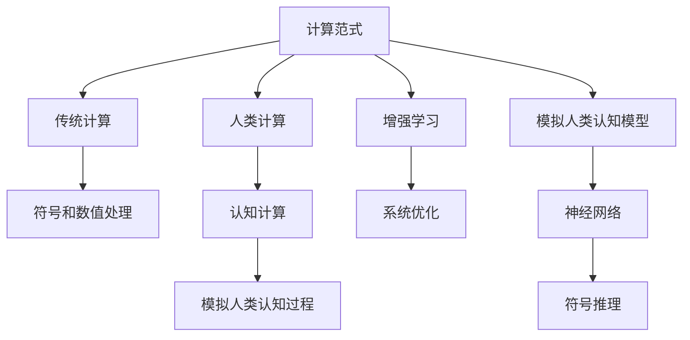

                 

# 人类计算的未来：趋势、机遇与挑战并存

## 1. 背景介绍

### 1.1 问题由来
随着数字技术的高速发展，人类社会正在经历前所未有的计算范式变革。在传统计算领域，从早期基于摩尔定律的硬件加速，到近年来的深度学习、量子计算等前沿技术，计算能力不断提升，计算方式日益多样。而在人类计算领域，人工智能（AI）、机器学习（ML）、大数据等技术的涌现，正在重塑计算与信息处理的方式。

然而，尽管技术不断进步，人类的计算需求和能力仍存在较大差距。传统计算范式无法充分满足用户需求，尤其在面向复杂逻辑、智能交互、决策支持等领域，人类计算能力的局限性愈发凸显。人类计算的未来趋势、机遇与挑战并存，亟需探索新的计算范式和技术路径，以实现计算能力与人类认知能力的协同进化。

### 1.2 问题核心关键点
本文将围绕以下几个关键点展开探讨：

- **计算范式的转变**：从传统计算到人类计算的范式转变，包括认知计算、模拟人类认知过程、以及与人类协同工作的计算模式。
- **计算与信息处理的新方法**：如认知计算、增强学习、模拟人类认知模型等，如何提升计算效率和精度。
- **计算工具与平台的发展**：支持人类计算的新型计算工具和平台，如神经网络、知识图谱、认知计算框架等。
- **实际应用场景**：如医疗诊断、金融分析、教育辅助、智能客服等领域，如何利用计算技术提升人类认知能力。

## 2. 核心概念与联系

### 2.1 核心概念概述

为更好地理解人类计算的演变趋势，我们首先介绍几个核心概念：

- **计算范式**：指计算方法的基础架构和基本原则。传统计算基于符号和数值处理，而人类计算强调通过模拟人类认知过程实现计算。
- **认知计算**：通过模拟人类认知过程（如感知、学习、推理）来处理信息。其目标是实现计算过程与人类认知过程的协同。
- **增强学习**：通过试错的方式，使系统在环境中不断学习优化，以实现目标。常用于训练机器人、智能系统等。
- **模拟人类认知模型**：如神经网络、符号推理等模型，模拟人脑处理信息的方式，提升计算效率和效果。

这些概念之间的关系可以通过以下Mermaid流程图来展示：



这个流程图展示了计算范式从传统计算向人类计算的演变，以及人类计算中关键的计算方法和模型。

## 3. 核心算法原理 & 具体操作步骤

### 3.1 算法原理概述

人类计算的核心在于模拟人类认知过程，通过认知计算、增强学习等方法提升计算效率和效果。其基本算法原理如下：

1. **认知计算**：通过认知模型（如神经网络）模拟人类感知、学习、推理等认知过程，实现信息处理。
2. **增强学习**：通过试错训练，使系统在环境中不断优化，以实现目标。
3. **模拟人类认知模型**：如神经网络、符号推理等模型，模拟人脑处理信息的方式，提升计算效率和效果。

### 3.2 算法步骤详解

人类计算的具体操作步骤通常包括以下几个关键步骤：

1. **问题建模**：将实际问题转化为计算问题，建立数学或逻辑模型。
2. **认知模型训练**：使用认知计算模型（如神经网络）对问题进行建模，并进行训练。
3. **增强学习优化**：通过增强学习算法，在实际环境中不断调整模型参数，优化计算效果。
4. **结果验证**：对计算结果进行验证，确保其符合实际问题要求。
5. **知识提取与应用**：从计算结果中提取知识，应用于实际决策和优化过程中。

### 3.3 算法优缺点

人类计算的优点包括：

- **协同进化**：通过模拟人类认知过程，实现计算与人类认知的协同进化。
- **自适应**：在实际环境中通过增强学习不断优化，提高计算模型的适应性。
- **高效性**：通过模拟人类认知模型，提高计算效率。

缺点包括：

- **复杂性**：人类计算模型的复杂度较高，需要大量数据和计算资源。
- **可解释性**：人类计算结果往往缺乏明确的解释，难以理解其工作机制。
- **数据依赖**：人类计算的效果依赖于高质量的数据和环境，数据缺失或不准确会影响结果。

### 3.4 算法应用领域

人类计算技术已经在多个领域得到了应用，如医疗诊断、金融分析、教育辅助、智能客服等。

- **医疗诊断**：利用认知计算模型和增强学习算法，从医学影像、病历等数据中提取知识，辅助医生诊断。
- **金融分析**：通过模拟人类认知模型，对金融市场进行预测和分析，提供决策支持。
- **教育辅助**：利用认知计算和增强学习，提供个性化的学习路径和智能辅助教学。
- **智能客服**：通过模拟人类认知过程，构建智能客服系统，提供自然语言处理和智能对话服务。

## 4. 数学模型和公式 & 详细讲解 & 举例说明

### 4.1 数学模型构建

人类计算的数学模型构建通常包括以下几个步骤：

1. **问题抽象**：将实际问题转化为数学表达式，建立计算模型。
2. **模型选择**：根据问题特点，选择合适的认知计算模型（如神经网络）。
3. **模型训练**：使用训练数据对模型进行训练，调整模型参数。
4. **结果验证**：使用测试数据对模型进行验证，确保其有效性。

### 4.2 公式推导过程

以神经网络为例，其基本结构如图：

```
input -> Activation Function -> Weight Matrix -> Activation Function -> Output
```

其中，输入层接收数据，激活函数用于非线性变换，权重矩阵用于调整模型参数，输出层产生最终结果。

神经网络的前向传播公式为：

$$
y = f(\sum_{i=1}^{n} w_i x_i + b)
$$

其中，$w$为权重，$x$为输入，$b$为偏置，$f$为激活函数。

神经网络的反向传播公式为：

$$
\Delta w_i = \frac{\partial L}{\partial w_i}
$$

其中，$L$为损失函数，$\Delta w$为权重梯度。

### 4.3 案例分析与讲解

以医疗影像诊断为例，如图：

```
Input: 医学影像
Model: 神经网络
Output: 诊断结果

步骤：
1. 数据预处理：对医学影像进行预处理，提取特征。
2. 模型训练：使用训练数据对神经网络进行训练，调整参数。
3. 结果验证：使用测试数据对模型进行验证，确保其准确性。
4. 知识提取：从模型中提取特征和诊断规则，用于辅助医生诊断。
```

## 5. 项目实践：代码实例和详细解释说明

### 5.1 开发环境搭建

在进行人类计算实践前，我们需要准备好开发环境。以下是使用Python进行TensorFlow开发的环境配置流程：

1. 安装Anaconda：从官网下载并安装Anaconda，用于创建独立的Python环境。

2. 创建并激活虚拟环境：
```bash
conda create -n tf-env python=3.8 
conda activate tf-env
```

3. 安装TensorFlow：根据CUDA版本，从官网获取对应的安装命令。例如：
```bash
conda install tensorflow==2.6 -c conda-forge
```

4. 安装TensorBoard：
```bash
pip install tensorboard
```

5. 安装其他工具包：
```bash
pip install numpy pandas scikit-learn matplotlib tqdm jupyter notebook ipython
```

完成上述步骤后，即可在`tf-env`环境中开始人类计算实践。

### 5.2 源代码详细实现

这里我们以图像识别为例，给出使用TensorFlow进行神经网络模型训练的代码实现。

首先，定义数据集和标签：

```python
import tensorflow as tf

# 定义数据集和标签
train_images = ...
train_labels = ...
test_images = ...
test_labels = ...
```

接着，定义神经网络模型：

```python
model = tf.keras.Sequential([
    tf.keras.layers.Conv2D(32, (3,3), activation='relu', input_shape=(32, 32, 3)),
    tf.keras.layers.MaxPooling2D((2,2)),
    tf.keras.layers.Flatten(),
    tf.keras.layers.Dense(10, activation='softmax')
])
```

然后，定义训练过程：

```python
# 定义优化器、损失函数和评估指标
optimizer = tf.keras.optimizers.Adam()
loss = tf.keras.losses.SparseCategoricalCrossentropy(from_logits=True)
metrics = [tf.keras.metrics.SparseCategoricalAccuracy('accuracy')]

# 定义训练过程
@tf.function
def train_step(images, labels):
    with tf.GradientTape() as tape:
        predictions = model(images, training=True)
        loss_value = loss(labels, predictions)
    gradients = tape.gradient(loss_value, model.trainable_variables)
    optimizer.apply_gradients(zip(gradients, model.trainable_variables))
    return loss_value

# 定义训练循环
EPOCHS = 10
for epoch in range(EPOCHS):
    for (images, labels) in train_dataset:
        loss_value = train_step(images, labels)
    print(f'Epoch {epoch+1}, Loss: {loss_value:.4f}')
```

最后，进行模型评估和测试：

```python
# 定义评估过程
@tf.function
def test_step(images, labels):
    predictions = model(images, training=False)
    loss_value = loss(labels, predictions)
    accuracy = metrics[0](labels, predictions)
    return loss_value, accuracy

# 定义评估循环
test_loss, test_accuracy = 0, 0
for (images, labels) in test_dataset:
    loss_value, accuracy = test_step(images, labels)
    test_loss += loss_value.numpy()
    test_accuracy += accuracy.numpy()

print(f'Test Loss: {test_loss/EPOCHS:.4f}, Test Accuracy: {test_accuracy/EPOCHS:.4f}')
```

以上就是使用TensorFlow进行神经网络图像识别训练的完整代码实现。可以看到，TensorFlow提供了丰富的API，使得模型的构建和训练过程变得简洁高效。

### 5.3 代码解读与分析

让我们再详细解读一下关键代码的实现细节：

**训练过程**：
- `train_step`函数：使用反向传播算法计算梯度，并应用到可训练参数上，更新模型。
- `train_loop`：对训练数据进行迭代，每轮训练使用`train_step`函数更新模型。
- `tf.GradientTape`：用于自动记录梯度，以便优化算法使用。

**测试过程**：
- `test_step`函数：计算模型在测试数据上的损失和准确率。
- `test_loop`：对测试数据进行迭代，每轮测试使用`test_step`函数计算结果。

**优化器**：
- `tf.keras.optimizers.Adam`：自适应学习率优化器，可以自适应调整学习率。

**损失函数**：
- `tf.keras.losses.SparseCategoricalCrossentropy`：适用于多分类问题的损失函数。

这些代码展示了使用TensorFlow进行神经网络模型训练的完整流程，从数据准备、模型构建、训练到评估，体现了人类计算的工程实践。

## 6. 实际应用场景

### 6.1 医疗影像诊断

利用人类计算技术，可以对医疗影像数据进行快速、准确的诊断。如图：

```
Input: 医学影像
Model: 卷积神经网络
Output: 疾病诊断结果

步骤：
1. 数据预处理：对医学影像进行预处理，提取特征。
2. 模型训练：使用训练数据对神经网络进行训练，调整参数。
3. 结果验证：使用测试数据对模型进行验证，确保其准确性。
4. 知识提取：从模型中提取特征和诊断规则，用于辅助医生诊断。
```

### 6.2 金融市场预测

利用增强学习和认知计算，可以对金融市场进行预测和分析，提供决策支持。如图：

```
Input: 金融市场数据
Model: 时间序列模型
Output: 市场预测结果

步骤：
1. 数据预处理：对金融数据进行预处理，提取特征。
2. 模型训练：使用训练数据对时间序列模型进行训练，调整参数。
3. 结果验证：使用测试数据对模型进行验证，确保其准确性。
4. 知识提取：从模型中提取特征和预测规则，用于市场分析。
```

### 6.3 教育辅助系统

利用增强学习，可以构建个性化的教育辅助系统，提供智能教学和辅导。如图：

```
Input: 学生学习数据
Model: 推荐系统
Output: 学习路径和辅助资源

步骤：
1. 数据预处理：对学生学习数据进行预处理，提取特征。
2. 模型训练：使用训练数据对推荐系统进行训练，调整参数。
3. 结果验证：使用测试数据对模型进行验证，确保其有效性。
4. 知识提取：从模型中提取特征和推荐规则，用于个性化学习路径设计。
```

### 6.4 未来应用展望

人类计算技术将会在更多领域得到应用，为人类社会的各个方面带来变革性影响。

- **智能家居**：利用认知计算和增强学习，实现智能家居设备之间的协同工作和智能化决策。
- **智慧城市**：通过模拟人类认知过程，实现智能交通、环境监测等功能的优化。
- **自动驾驶**：结合认知计算和增强学习，提高自动驾驶系统的决策能力和安全性。

随着技术的不断进步，人类计算将会带来更加广泛的应用场景，为人类的生活和工作提供更高效、更智能的计算支持。

## 7. 工具和资源推荐

### 7.1 学习资源推荐

为了帮助开发者系统掌握人类计算的理论基础和实践技巧，这里推荐一些优质的学习资源：

1. 《深度学习》系列书籍：Ian Goodfellow、Yoshua Bengio和Aaron Courville合著，全面介绍了深度学习的基础和前沿技术。
2. 《人工智能：一种现代方法》系列书籍：Stuart Russell和Peter Norvig合著，详细介绍了AI的理论基础和应用案例。
3. Coursera《深度学习专项课程》：由DeepMind、斯坦福大学等机构提供，涵盖深度学习的基础、应用和实践。
4. arXiv论文库：包含大量前沿研究的论文，可以跟踪最新进展。
5. GitHub项目：开源项目提供了丰富的实践案例，可以学习他人的经验。

通过对这些资源的学习实践，相信你一定能够快速掌握人类计算的精髓，并用于解决实际的计算问题。

### 7.2 开发工具推荐

高效的开发离不开优秀的工具支持。以下是几款用于人类计算开发的常用工具：

1. TensorFlow：由Google主导开发的开源深度学习框架，生产部署方便，适合大规模工程应用。
2. PyTorch：基于Python的开源深度学习框架，灵活动态的计算图，适合快速迭代研究。
3. Keras：高层次API，可以快速搭建深度学习模型，适合初学者和快速开发。
4. TensorBoard：TensorFlow配套的可视化工具，可实时监测模型训练状态，并提供丰富的图表呈现方式。
5. Weights & Biases：模型训练的实验跟踪工具，可以记录和可视化模型训练过程中的各项指标。

合理利用这些工具，可以显著提升人类计算任务的开发效率，加快创新迭代的步伐。

### 7.3 相关论文推荐

人类计算领域的研究涉及多个学科，以下是几篇奠基性的相关论文，推荐阅读：

1. 《认知计算：概念、挑战与机遇》：探讨认知计算的概念、挑战和机遇，展望其发展方向。
2. 《增强学习：模型、算法和应用》：详细介绍了增强学习的理论基础、算法实现和实际应用。
3. 《神经网络与深度学习》：Yoshua Bengio的介绍性书籍，涵盖神经网络和深度学习的原理与应用。
4. 《人机协同计算》：探讨人机协同计算的概念、方法和应用，强调人机协同的重要性和可行性。

这些论文代表了大计算技术的发展脉络。通过学习这些前沿成果，可以帮助研究者把握学科前进方向，激发更多的创新灵感。

## 8. 总结：未来发展趋势与挑战

### 8.1 总结

本文对人类计算的演变趋势、应用实践和未来发展进行了全面系统的介绍。首先阐述了人类计算的概念和意义，明确了人类计算与传统计算的区别。其次，从原理到实践，详细讲解了人类计算的数学模型和关键操作步骤，给出了具体实现代码实例。同时，本文还广泛探讨了人类计算在医疗、金融、教育等领域的应用前景，展示了其广泛的应用价值。

通过本文的系统梳理，可以看到，人类计算技术正在成为计算领域的重要范式，极大地提升了计算效率和效果，为各个行业带来了新的机遇。未来，伴随认知计算、增强学习等技术的发展，人类计算必将在更多的领域发挥重要作用。

### 8.2 未来发展趋势

展望未来，人类计算技术将呈现以下几个发展趋势：

1. **认知计算的普及**：随着计算能力的提升，认知计算将逐步普及到各个行业，成为解决复杂问题的重要工具。
2. **增强学习的深化**：增强学习将更加深入，结合模拟人类认知模型，实现更加智能和高效的决策系统。
3. **跨领域融合**：人类计算将与其他技术（如量子计算、认知神经科学等）深度融合，实现多模态协同计算。
4. **人机协同**：实现人机协同计算，使得计算过程更加自然和智能，提升用户体验。
5. **伦理与安全**：随着人类计算技术的应用，将更加注重伦理和安全性问题，确保其应用场景的公平性和可控性。

以上趋势凸显了人类计算技术的广阔前景。这些方向的探索发展，必将进一步提升人类计算的效率和效果，为各行各业带来更高效、更智能的计算支持。

### 8.3 面临的挑战

尽管人类计算技术已经取得了瞩目成就，但在迈向更加智能化、普适化应用的过程中，它仍面临诸多挑战：

1. **计算资源瓶颈**：大规模认知计算和增强学习需要大量的计算资源，硬件成本较高。如何降低资源消耗，提升计算效率，是未来需要解决的重要问题。
2. **模型可解释性**：人类计算模型往往缺乏明确的解释，难以理解其工作机制。如何提高模型的可解释性和可理解性，是未来研究的重要方向。
3. **数据依赖性**：人类计算的效果依赖于高质量的数据和环境，数据缺失或不准确会影响结果。如何获取高质量的数据，确保模型的鲁棒性，是未来需要解决的问题。
4. **伦理和安全问题**：人类计算模型可能存在偏见和歧视，如何确保其公平性和安全性，是未来需要解决的重要课题。

这些挑战需要通过技术创新和政策支持，逐步克服。唯有如此，人类计算技术才能真正落地应用，为人类社会带来实际价值。

### 8.4 研究展望

面向未来，人类计算领域的研究需要在以下几个方面寻求新的突破：

1. **模型优化**：研究新的认知计算模型和算法，提高计算效率和效果。
2. **跨学科融合**：结合其他学科的理论与方法，提升人类计算模型的通用性和普适性。
3. **数据获取与处理**：开发高效的数据获取和处理技术，提升数据的丰富性和多样性。
4. **伦理与法律**：研究伦理和法律问题，确保人类计算技术的安全和公平应用。

这些研究方向的探索，将引领人类计算技术迈向更高的台阶，为构建安全、可靠、可解释、可控的智能系统铺平道路。面向未来，人类计算技术还需要与其他人工智能技术进行更深入的融合，如知识表示、因果推理、强化学习等，多路径协同发力，共同推动人类计算的进步。只有勇于创新、敢于突破，才能不断拓展计算能力的边界，让智能技术更好地造福人类社会。

## 9. 附录：常见问题与解答

**Q1：人类计算是否适用于所有计算任务？**

A: 人类计算技术主要适用于需要模拟人类认知过程的计算任务，如决策、推理、学习等。对于符号计算、数值计算等任务，传统计算范式仍然更加高效。

**Q2：人类计算的计算效率和效果如何？**

A: 人类计算在处理复杂问题时，通常需要大量的计算资源和时间，效率相对较低。但通过模拟人类认知过程，人类计算可以在某些特定场景下取得优于传统计算的效果。

**Q3：人类计算的实现难点有哪些？**

A: 人类计算的实现难点主要在于：
1. 数据获取与处理：需要高质量的数据，才能训练出有效的认知计算模型。
2. 模型复杂度：人类计算模型通常较为复杂，需要大量的参数和计算资源。
3. 伦理与安全性：如何确保计算模型的公平性和安全性，是一个重要问题。

**Q4：未来人类计算的发展方向是什么？**

A: 未来人类计算的发展方向包括：
1. 认知计算的普及：随着计算能力的提升，认知计算将逐步普及到各个行业，成为解决复杂问题的重要工具。
2. 增强学习的深化：增强学习将更加深入，结合模拟人类认知模型，实现更加智能和高效的决策系统。
3. 跨领域融合：人类计算将与其他技术（如量子计算、认知神经科学等）深度融合，实现多模态协同计算。
4. 人机协同：实现人机协同计算，使得计算过程更加自然和智能，提升用户体验。
5. 伦理与安全：研究伦理和法律问题，确保人类计算技术的安全和公平应用。

这些方向将推动人类计算技术不断进步，为各行各业带来更高效、更智能的计算支持。

---

作者：禅与计算机程序设计艺术 / Zen and the Art of Computer Programming

