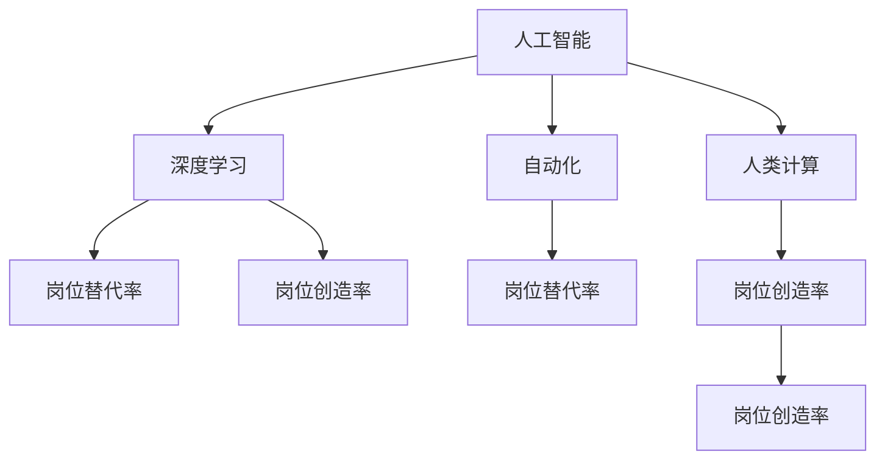

                 

# 人类计算：AI时代的未来就业前景预测

## 1. 背景介绍

### 1.1 问题由来
随着人工智能(AI)技术的迅猛发展，特别是深度学习和大数据技术的普及，AI时代已经到来。在这个时代，机器取代了大量传统行业的劳动，同时也带来了新的就业机会。本文将探讨AI时代下，人类计算在就业市场中的前景，分析其对现有就业结构的影响，并为从业者提供职业发展的策略和建议。

### 1.2 问题核心关键点
AI时代的到来，对就业市场的影响深远而复杂。一方面，机器自动化取代了大量重复性、基础性工作，如制造业流水线、客服中心等。另一方面，AI技术的发展也催生了许多新的就业机会，如AI工程师、数据科学家、机器人维护工程师等。

### 1.3 问题研究意义
研究AI时代下人类计算的就业前景，对于理解就业市场的变迁、预测未来职业需求、制定职业发展策略具有重要意义。通过深入分析，可以帮助从业者把握行业发展趋势，提升技能，抓住新的就业机会。

## 2. 核心概念与联系

### 2.1 核心概念概述

为更好地理解AI时代下人类计算的就业前景，本节将介绍几个密切相关的核心概念：

- 人工智能(AI)：利用算法、模型、数据等技术手段，使机器具备一定的智能，能够执行复杂任务的技术领域。
- 深度学习(Deep Learning)：一种基于神经网络的人工智能技术，通过多层网络结构处理大规模数据，从中学习复杂模式。
- 自动化(Automation)：利用机器和算法自动执行某些人类工作任务，提高效率和准确性。
- 人类计算(Human Computation)：指人类通过其智能、创新能力和创造性思维，在AI系统无法或效率较低的地方发挥作用。
- 岗位替代率(Job Displacement Rate)：指由于自动化和技术进步导致失业率上升的比例。
- 岗位创造率(Job Creation Rate)：指由于技术创新和新兴产业的发展，新岗位出现的比例。

这些核心概念之间的逻辑关系可以通过以下Mermaid流程图来展示：



这个流程图展示了几大技术趋势之间的关系：

1. 人工智能技术通过深度学习不断提升自动化水平。
2. 自动化技术导致部分岗位的替代，但也催生新的岗位需求。
3. 人类计算在机器无法处理的复杂任务上仍具有不可替代性。
4. 岗位创造率与岗位替代率相互作用，影响整体就业市场。

## 3. 核心算法原理 & 具体操作步骤

### 3.1 算法原理概述

AI时代下人类计算的就业前景，可以从算法原理和操作步骤两个层面进行分析。

算法原理上，AI技术通过自动化和深度学习，在许多任务上取代了人类劳动，但同时也提出了新的岗位需求。具体来说，AI技术在处理重复性、结构化任务时表现出色，但在需要创造性、战略性思维的任务上，人类计算仍具有不可替代性。

操作步骤上，AI时代下人类计算的就业发展可以分为以下几个关键步骤：

1. **技能升级**：从业者需要不断提升自己的技术技能，以适应AI时代的新要求。
2. **岗位转型**：从业者需要从低价值、重复性任务中转型，向更高价值、创新性岗位转移。
3. **跨界融合**：从业者需要跨界融合多种技术，如人工智能、大数据、物联网等，提升跨领域综合能力。
4. **创业创新**：从业者可以借助AI技术进行创业创新，开发新的应用场景和服务模式。

### 3.2 算法步骤详解

以下是AI时代下人类计算就业前景的操作步骤详解：

**Step 1: 技能升级**
- **学习新技能**：从业者需要不断学习新的技术，如深度学习、自然语言处理、计算机视觉等。
- **参加培训课程**：通过在线课程、培训中心等方式系统学习新技能。
- **参与项目实践**：通过实际项目积累经验，提升解决复杂问题的能力。

**Step 2: 岗位转型**
- **识别岗位替代风险**：识别出自身岗位中可被自动化替代的部分。
- **探索新岗位机会**：寻找与原岗位相关的，且需要人类计算技能的新岗位。
- **适应新岗位要求**：通过培训和实践，逐步适应新岗位的工作内容和环境。

**Step 3: 跨界融合**
- **跨领域合作**：与不同领域的专家合作，解决复杂问题。
- **跨学科学习**：学习多种学科的知识，如数据科学、经济学、心理学等。
- **技术集成应用**：将多种技术集成到实际应用中，提升整体效能。

**Step 4: 创业创新**
- **识别市场机会**：观察市场趋势，发现新的应用场景。
- **开发新产品**：利用AI技术，开发有市场需求的新产品或服务。
- **构建商业模式**：设计合理的商业模式，实现可持续盈利。

### 3.3 算法优缺点

AI时代下人类计算的就业前景具有以下优点：
1. **提高效率**：AI技术自动化处理重复性任务，释放人类劳动力，提高整体效率。
2. **创造新岗位**：AI技术的广泛应用催生新的岗位需求，如AI工程师、数据科学家等。
3. **促进创新**：AI技术促进跨界融合，催生更多创新的应用和服务。

同时，也存在一些局限性：
1. **岗位替代风险**：部分低技能、重复性岗位将被自动化取代，导致失业风险。
2. **技能转换难度**：高技能岗位需要新的知识和技能，转换难度较大。
3. **市场竞争激烈**：AI时代下，竞争激烈，从业者需不断提升自身竞争力。

### 3.4 算法应用领域

AI时代下人类计算的就业前景广泛应用在以下几个领域：

- **金融科技**：AI技术在金融领域的应用，如风险管理、量化交易、智能投顾等。
- **医疗健康**：AI技术在医疗领域的应用，如智能诊断、个性化治疗、医疗机器人等。
- **智能制造**：AI技术在制造业中的应用，如智能生产、质量检测、供应链管理等。
- **智慧城市**：AI技术在城市管理中的应用，如交通管理、环境监测、公共安全等。
- **教育培训**：AI技术在教育领域的应用，如智能教学、个性化推荐、学习分析等。
- **内容创作**：AI技术在内容创作中的应用，如自动生成文章、视频剪辑、音乐创作等。

## 4. 数学模型和公式 & 详细讲解 & 举例说明

### 4.1 数学模型构建

AI时代下人类计算就业前景的预测，可以通过构建数学模型来分析。

假设岗位替代率、岗位创造率分别为 $r_1, r_2$，初始岗位数为 $N_0$，岗位创造率与岗位替代率之比为 $k$。则AI时代下人类计算的就业人数 $N$ 可以通过以下数学模型表示：

$$
N = N_0(1-k)r_2 + N_0(1-k)r_1
$$

这个模型描述了AI时代下岗位创造和岗位替代的动态关系，其中 $k$ 反映了岗位创造与岗位替代之间的平衡点。

### 4.2 公式推导过程

通过上述数学模型，可以推导出岗位创造率、岗位替代率对就业人数的影响。

设岗位创造率 $r_2$ 与岗位替代率 $r_1$ 之比为 $k$，则岗位创造率对就业人数的贡献为 $N_0(1-k)r_2$，岗位替代率对就业人数的贡献为 $N_0(1-k)r_1$。当 $k$ 值增大时，岗位创造率对就业人数的贡献占比增大，岗位替代率对就业人数的贡献占比减小。

具体推导过程如下：

- 岗位创造率对就业人数的贡献：
$$
N_0(1-k)r_2 = N_0 - N_0k(1-k)r_2
$$

- 岗位替代率对就业人数的贡献：
$$
N_0(1-k)r_1 = N_0 - N_0k(1-k)r_1
$$

将两式相加，得到：
$$
N = N_0(1-k)(r_2 + r_1)
$$

### 4.3 案例分析与讲解

以智能制造为例，分析AI技术对岗位的影响。

假设初始岗位数为 $N_0 = 100,000$，岗位创造率 $r_2 = 0.1$，岗位替代率 $r_1 = 0.05$，岗位创造率与岗位替代率之比 $k = 0.5$。则AI时代下人类计算的就业人数 $N$ 可以通过数学模型计算得出：

$$
N = 100,000(1-0.5)(0.1 + 0.05) = 87,500
$$

这意味着AI技术的应用将导致岗位数量减少 $12,500$，但总体就业人数仍能保持相对稳定。

## 5. 项目实践：代码实例和详细解释说明

### 5.1 开发环境搭建

在进行项目实践前，我们需要准备好开发环境。以下是使用Python进行数据分析和可视化的环境配置流程：

1. 安装Anaconda：从官网下载并安装Anaconda，用于创建独立的Python环境。

2. 创建并激活虚拟环境：
```bash
conda create -n python-env python=3.8 
conda activate python-env
```

3. 安装NumPy、Pandas、Matplotlib等常用库：
```bash
conda install numpy pandas matplotlib
```

4. 安装Seaborn、Scikit-learn等高级库：
```bash
conda install seaborn scikit-learn
```

5. 安装Jupyter Notebook：
```bash
conda install jupyter notebook
```

完成上述步骤后，即可在`python-env`环境中开始项目实践。

### 5.2 源代码详细实现

下面以Python语言为例，给出分析AI时代下人类计算就业前景的代码实现。

首先，定义岗位创造率、岗位替代率等关键变量：

```python
import numpy as np

N_0 = 100000  # 初始岗位数
r_2 = 0.1     # 岗位创造率
r_1 = 0.05    # 岗位替代率
k = 0.5       # 岗位创造率与岗位替代率之比
```

然后，计算AI时代下人类计算的就业人数：

```python
N = N_0 * (1 - k) * (r_2 + r_1)
print("AI时代下人类计算的就业人数：", N)
```

最后，进行岗位创造率与岗位替代率的灵敏度分析：

```python
r_2_cases = np.linspace(0, 1, 10)  # 岗位创造率变化范围
r_1_cases = np.linspace(0, 1, 10)  # 岗位替代率变化范围

N_employment_cases = np.zeros((len(r_2_cases), len(r_1_cases)))

for i, r_2 in enumerate(r_2_cases):
    for j, r_1 in enumerate(r_1_cases):
        N_employment_cases[i, j] = N_0 * (1 - k) * (r_2 + r_1)

print("岗位创造率与岗位替代率灵敏度分析结果：")
for i, r_2 in enumerate(r_2_cases):
    for j, r_1 in enumerate(r_1_cases):
        print("岗位创造率：", r_2, "岗位替代率：", r_1, "就业人数：", N_employment_cases[i, j])
```

### 5.3 代码解读与分析

让我们再详细解读一下关键代码的实现细节：

**岗位创造率与岗位替代率定义**：
- `N_0`：初始岗位数。
- `r_2`：岗位创造率。
- `r_1`：岗位替代率。
- `k`：岗位创造率与岗位替代率之比。

**就业人数计算**：
- 通过数学模型计算AI时代下人类计算的就业人数。

**灵敏度分析**：
- 通过遍历岗位创造率和岗位替代率的变化范围，分析其对就业人数的影响。

**输出结果**：
- 打印出不同岗位创造率和岗位替代率组合下的就业人数。

可以看到，通过Python代码实现，我们可以系统地分析AI时代下岗位创造率、岗位替代率对就业人数的影响。这为政策制定者、企业决策者、从业者提供了重要的参考数据。

## 6. 实际应用场景

### 6.1 智能制造

AI技术在智能制造中的应用，带来了生产效率的大幅提升。传统制造业中，许多重复性、基础性的工作如质检、装配等可以被机器自动化取代。但同时，AI技术也催生了许多新的岗位，如智能制造系统维护工程师、生产流程优化工程师等。

在技术实现上，可以利用AI技术进行质量检测、故障诊断、生产调度等，提升生产效率和产品质量。同时，需要从业者不断提升自身技能，适应新岗位要求。

### 6.2 金融科技

AI技术在金融领域的应用，如智能投顾、量化交易、风险管理等，极大地提升了金融服务效率。同时，AI技术也带来了许多新岗位，如数据分析师、AI产品经理、算法工程师等。

在实际应用中，可以通过AI技术进行数据分析、模型构建、策略优化等，提升金融服务的智能化水平。同时，需要从业者具备数据处理、算法设计等技术能力。

### 6.3 医疗健康

AI技术在医疗领域的应用，如智能诊断、个性化治疗、医疗机器人等，大大提升了医疗服务质量。同时，AI技术也带来了许多新岗位，如数据标注师、医学AI工程师、医疗数据分析师等。

在实际应用中，可以利用AI技术进行疾病预测、病理分析、治疗方案优化等，提升医疗服务的精准度和效率。同时，需要从业者具备医疗知识、数据处理等综合能力。

### 6.4 未来应用展望

随着AI技术的不断进步，人类计算的就业前景将呈现以下几个发展趋势：

1. **新兴岗位增加**：AI技术的广泛应用将催生更多新兴岗位，如AI伦理师、算法工程师、数据科学家等。
2. **跨界融合加速**：AI技术促进跨界融合，从业者需要具备多领域知识和技能。
3. **技术迭代快**：AI技术迭代速度快，从业者需不断学习新技能，适应技术变革。
4. **岗位需求多样化**：AI技术应用场景多样化，岗位需求也将更加多样化。
5. **全球化趋势**：AI技术应用全球化，从业者需具备国际化视野。

## 7. 工具和资源推荐

### 7.1 学习资源推荐

为了帮助从业者全面掌握AI时代下人类计算的就业前景，这里推荐一些优质的学习资源：

1. Coursera《人工智能导论》课程：由斯坦福大学开设，系统介绍AI技术的原理和应用。
2. edX《机器学习基础》课程：由哈佛大学开设，涵盖机器学习的基本概念和算法。
3. Udacity《深度学习纳米学位》：通过实际项目，系统学习深度学习技术。
4. Kaggle数据科学竞赛平台：通过参与实际竞赛，提升数据处理、模型构建等实践能力。
5. GitHub《AI就业前景》项目：汇集AI领域最新研究和应用案例，供从业者参考。

通过对这些资源的学习实践，相信你一定能够全面掌握AI时代下人类计算的就业前景，并为其未来发展提供坚实的基础。

### 7.2 开发工具推荐

高效的开发离不开优秀的工具支持。以下是几款用于数据分析和可视化开发的常用工具：

1. Jupyter Notebook：免费、开源的交互式编程环境，适合做数据处理、模型构建、结果展示等。
2. Python：数据处理、算法实现、模型训练的首选语言，拥有丰富的第三方库。
3. R：数据处理和统计分析的强项，拥有强大的数据可视化工具。
4. Matplotlib：Python的数据可视化库，适合做图表展示。
5. Seaborn：基于Matplotlib的高级数据可视化库，适合做复杂图表展示。
6. Pandas：Python的数据处理库，适合做数据清洗、整理等。

合理利用这些工具，可以显著提升数据分析和可视化的效率，加速AI技术的应用实践。

### 7.3 相关论文推荐

AI时代下人类计算的就业前景，涉及多学科交叉，以下几篇相关论文推荐阅读：

1. "The Future of Employment: How Susceptible are Jobs to Computerisation?" by Carl Frey and Michael Osborne。
2. "AI and Automation: A New Economic Order" by John Brynjolfsson and Erik Brynjolfsson。
3. "The Economic Impacts of Automation and Artificial Intelligence" by Chaminade and Pérez-Arriaga。
4. "Human-Machine Collaboration and Artificial Intelligence: Making It Work" by Potočnik et al。

这些论文代表了大规模自动化和AI技术对就业市场的影响研究，有助于从业者全面理解就业市场的变迁，把握未来的发展趋势。

## 8. 总结：未来发展趋势与挑战

### 8.1 总结

本文对AI时代下人类计算的就业前景进行了全面系统的介绍。首先，阐述了AI技术对就业市场的影响，明确了AI时代就业市场的变迁趋势。其次，从算法原理和操作步骤两个层面，详细讲解了AI技术对就业市场的影响。最后，分析了AI时代下人类计算就业前景的优点和局限性，并提出了未来发展的建议。

通过本文的系统梳理，可以看到，AI技术对就业市场的影响深远而复杂。从业者需要不断提升自身技能，适应技术变革，才能在AI时代中抓住新的就业机会。

### 8.2 未来发展趋势

展望未来，AI时代下人类计算的就业前景将呈现以下几个发展趋势：

1. **岗位多样化**：AI技术的应用将催生更多新岗位，如AI伦理师、数据标注师等。
2. **跨界融合加速**：AI技术促进跨界融合，从业者需要具备多领域知识和技能。
3. **技术迭代快**：AI技术迭代速度快，从业者需不断学习新技能，适应技术变革。
4. **全球化趋势**：AI技术应用全球化，从业者需具备国际化视野。
5. **伦理道德问题**：AI技术的应用需要遵循伦理道德，从业者需具备相应的职业道德素养。

### 8.3 面临的挑战

尽管AI技术带来了许多就业机会，但也面临着诸多挑战：

1. **岗位替代风险**：部分低技能、重复性岗位将被自动化取代，导致失业风险。
2. **技能转换难度**：高技能岗位需要新的知识和技能，转换难度较大。
3. **市场竞争激烈**：AI时代下，竞争激烈，从业者需不断提升自身竞争力。
4. **伦理道德问题**：AI技术的应用需要遵循伦理道德，从业者需具备相应的职业道德素养。
5. **技术壁垒高**：AI技术涉及多种复杂算法，从业者需具备较高的技术门槛。

### 8.4 研究展望

面向未来，AI时代下人类计算就业前景的研究需要在以下几个方面寻求新的突破：

1. **跨界融合研究**：如何实现跨界融合，提升从业者的综合能力。
2. **技能升级策略**：如何通过教育和培训，提升从业者的技术技能。
3. **伦理道德研究**：如何确保AI技术的伦理道德应用。
4. **就业市场分析**：如何通过数据和模型，分析就业市场的动态变化。
5. **政策建议**：如何通过政策引导，促进AI技术的健康发展。

## 9. 附录：常见问题与解答

**Q1：AI时代下岗位替代率上升的主要原因是什么？**

A: AI时代下岗位替代率上升的主要原因有以下几点：
1. **自动化技术的发展**：机器人和自动化设备逐步取代了基础性和重复性任务。
2. **深度学习算法的应用**：深度学习算法能够处理大规模数据，提高了任务处理效率。
3. **数据驱动的决策**：AI系统通过数据驱动决策，减少了人为错误和失误。
4. **技能要求的变化**：AI技术对岗位要求的技能发生了变化，如编程、数据分析等技能的重要性提升。

**Q2：AI时代下，如何提升从业者的就业竞争力？**

A: AI时代下提升从业者的就业竞争力可以从以下几个方面入手：
1. **学习新技能**：不断学习新的技术，如深度学习、自然语言处理、计算机视觉等。
2. **参加培训课程**：通过在线课程、培训中心等方式系统学习新技能。
3. **参与项目实践**：通过实际项目积累经验，提升解决复杂问题的能力。
4. **跨界融合能力**：学习多种学科的知识，提升跨领域综合能力。
5. **技术创新能力**：鼓励创新思维，提升自主研发能力。

**Q3：AI时代下，就业市场的变化趋势是什么？**

A: AI时代下就业市场的变化趋势主要有以下几个方面：
1. **岗位多样化**：AI技术的应用将催生更多新岗位，如AI工程师、数据科学家等。
2. **岗位需求多样化**：AI技术应用场景多样化，岗位需求也将更加多样化。
3. **跨界融合加速**：AI技术促进跨界融合，从业者需要具备多领域知识和技能。
4. **技术迭代快**：AI技术迭代速度快，从业者需不断学习新技能，适应技术变革。
5. **全球化趋势**：AI技术应用全球化，从业者需具备国际化视野。

通过以上分析，可以看出，AI时代下就业市场的变化趋势将更加复杂和多样，从业者需要不断提升自身技能，适应技术变革。

**Q4：AI技术对就业市场的负面影响有哪些？**

A: AI技术对就业市场的负面影响主要体现在以下几个方面：
1. **岗位替代风险**：部分低技能、重复性岗位将被自动化取代，导致失业风险。
2. **技能转换难度**：高技能岗位需要新的知识和技能，转换难度较大。
3. **市场竞争激烈**：AI时代下，竞争激烈，从业者需不断提升自身竞争力。
4. **伦理道德问题**：AI技术的应用需要遵循伦理道德，从业者需具备相应的职业道德素养。

需要强调的是，AI技术对就业市场的负面影响可以通过政策引导、教育培训等措施进行缓解。从业者也需积极应对，不断提升自身技能，以适应AI技术的发展趋势。

---

作者：禅与计算机程序设计艺术 / Zen and the Art of Computer Programming

