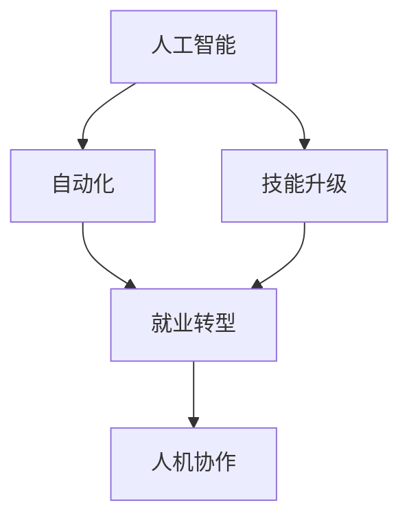

                 

# 人类计算：AI时代的未来就业机会

> 关键词：AI, 就业, 计算, 未来, 自动化, 技能提升

## 1. 背景介绍

### 1.1 问题由来
随着人工智能技术的迅猛发展，尤其是深度学习和大规模模型的突破，“人类计算”这一概念逐渐被更多人所关注。在此背景下，关于AI将如何影响人类就业机会的讨论也日益增多。一方面，自动化和智能系统在许多重复性工作中的应用，确实会导致部分岗位消失。但另一方面，AI技术也在创造新的就业机会，特别是在数据分析、模型训练、系统维护等领域。

### 1.2 问题核心关键点
AI时代下，就业机会的变化是一个复杂的话题。从技术层面来看，AI的应用和发展将改变不同职业的劳动内容和形式。从经济和社会层面来看，它还将对就业市场的供需关系产生深远影响。

当前，AI对就业的影响既包括直接替代部分工作岗位，也包括创造新的岗位需求，如数据分析师、AI模型训练师、数据标注员、AI系统运维人员等。因此，理解AI时代的就业趋势，需要从技术应用、岗位变迁和社会影响等多个维度进行深入分析。

### 1.3 问题研究意义
研究AI时代下的就业变化，对于理解技术进步对劳动力市场的深远影响，制定合理的就业政策和教育培训策略，具有重要意义。同时，它还有助于企业更好地适应AI发展趋势，提升自身的竞争力。

## 2. 核心概念与联系

### 2.1 核心概念概述

为更好地理解AI时代的就业变化，本节将介绍几个密切相关的核心概念：

- **人工智能(AI)**：指通过计算机模拟人类智能行为的技术，包括机器学习、深度学习、自然语言处理等子领域。AI技术的普及和应用将深刻影响各行业的劳动形式。

- **自动化(Automation)**：指使用机器或计算机系统自动完成原本需要人类手工执行的任务。自动化技术的发展将导致一些岗位被取代。

- **技能升级(Skill Upliftment)**：随着AI技术的应用，许多岗位的工作内容会发生变化，需要从业者掌握新的技能以适应新的岗位要求。

- **就业转型(Employment Transformation)**：指AI技术推动下，劳动力市场的结构性变化，即一些岗位消失，同时新的岗位被创造出来。

- **人机协作(Human-Machine Collaboration)**：指在AI技术的辅助下，人类与机器进行更高效、更智能的协作，共同完成复杂任务。

这些核心概念之间的逻辑关系可以通过以下Mermaid流程图来展示：



这个流程图展示了AI与自动化、技能升级、就业转型和人机协作之间的关系：

1. AI技术驱动自动化，取代部分岗位。
2. 自动化和AI技术改变工作内容，要求从业者技能升级。
3. 岗位变迁导致就业市场结构变化。
4. 新的岗位需求促使人机协作的广泛应用。

这些概念共同构成了AI时代就业变化的基础，使得劳动力市场的动态变化成为一个复杂的系统性问题。

## 3. 核心算法原理 & 具体操作步骤
### 3.1 算法原理概述

AI时代下，就业机会的变化主要是通过以下几个关键算法原理来实现的：

1. **自动化算法**：通过编程实现各种自动化工具和系统，用于自动执行重复性任务，如数据处理、图像识别、自然语言处理等。
2. **机器学习算法**：包括监督学习、无监督学习和强化学习等，用于训练模型，使其能够执行特定任务。
3. **迁移学习算法**：通过在大规模数据集上预训练模型，再针对特定任务进行微调，提升模型在特定任务上的表现。

这些算法的应用将深刻影响各行业的劳动形式，并导致不同岗位的变化。

### 3.2 算法步骤详解

基于以上算法原理，AI时代下的就业变化主要包括以下几个关键步骤：

**Step 1: 识别自动化和AI可替代的岗位**

- 识别当前工作中包含大量重复性、低附加值的任务，如数据录入、文件整理等。
- 评估这些任务是否可以通过自动化工具或AI模型实现替代。

**Step 2: 分析岗位需求变化**

- 基于自动化和AI技术的应用，分析岗位需求的变化趋势，如新增岗位和消失岗位。
- 研究新岗位的技能要求，识别需要学习的新技术和知识。

**Step 3: 制定培训和教育计划**

- 制定针对不同岗位的技能培训计划，帮助现有员工掌握新技能。
- 开发新的教育课程，培养符合未来岗位需求的新型人才。

**Step 4: 实现人机协作**

- 利用AI技术辅助人工完成复杂任务，提升工作效率和质量。
- 研究人机协作的最佳方式，如智能助手、增强现实工具等。

**Step 5: 持续优化和迭代**

- 定期评估岗位变化和技术进展，不断优化培训和教育计划。
- 根据技术发展和新需求，持续改进人机协作的机制和工具。

通过以上步骤，企业可以更好地适应AI技术的发展，提升自身的竞争力，同时为员工提供持续的职业发展机会。

### 3.3 算法优缺点

基于AI技术实现就业变化的算法具有以下优点：

1. **提升效率**：自动化和AI技术可以显著提升工作效率，减少重复性劳动，释放人力资源。
2. **创造新岗位**：AI技术的普及将创造新的岗位需求，推动就业市场的多元化。
3. **促进技能升级**：通过技能培训和教育，帮助员工适应新的工作环境，提升职业发展空间。

同时，这些算法也存在一定的局限性：

1. **技能转换难度**：部分岗位技能转换难度较大，员工需要较长的时间进行适应和培训。
2. **技术瓶颈**：AI技术在处理复杂任务时可能存在技术瓶颈，影响工作质量。
3. **数据依赖**：AI算法依赖大量高质量数据，数据获取和标注成本较高。

尽管如此，AI技术在提升工作效率和创造新岗位方面具有巨大潜力，仍值得深入探索和应用。

### 3.4 算法应用领域

AI时代下的就业变化，主要应用于以下几个关键领域：

- **制造业**：自动化生产线和智能工厂，减少人工干预，提升生产效率。
- **金融服务**：自动化的金融顾问和智能投顾，提升客户体验和投资收益。
- **医疗健康**：智能诊断和个性化治疗，提升医疗服务的质量和可及性。
- **物流配送**：无人驾驶和自动化仓库，提高物流效率和安全性。
- **教育培训**：智能教育平台和AI助教，个性化教育和学习体验。

这些领域中，AI技术的应用将深刻改变劳动形式和岗位需求，推动就业市场的结构性变化。

## 4. 数学模型和公式 & 详细讲解 & 举例说明

### 4.1 数学模型构建

在本节中，我们将使用数学语言对AI技术实现就业变化的算法原理进行更加严格的刻画。

假设一个企业有 $N$ 个岗位，每个岗位的工作效率为 $E_i$，岗位需求为 $D_i$，其中 $i \in [1,N]$。AI技术的引入将使每个岗位的工作效率提升到 $E_i' = E_i \times \alpha_i$，其中 $\alpha_i$ 表示自动化和AI技术的提升倍数。

模型目标是最小化岗位变化对企业的影响，即最小化岗位需求的变化量 $\Delta D_i$。因此，我们可以构建如下数学模型：

$$
\min_{\alpha_i} \sum_{i=1}^N |D_i - D_i'|^2
$$

其中 $D_i' = D_i \times \alpha_i$。

### 4.2 公式推导过程

假设岗位需求和岗位效率之间存在线性关系，即 $D_i' = D_i \times \alpha_i = a_i E_i'$，其中 $a_i$ 为岗位需求与效率的对应系数。则目标函数可以写为：

$$
\min_{\alpha_i} \sum_{i=1}^N (a_i E_i' - D_i)^2
$$

将 $D_i' = a_i E_i'$ 代入目标函数，得：

$$
\min_{\alpha_i} \sum_{i=1}^N (a_i^2 E_i'^2 - 2a_i D_i E_i' + D_i^2)
$$

将 $E_i'$ 替换为 $E_i \times \alpha_i$，得：

$$
\min_{\alpha_i} \sum_{i=1}^N (a_i^2 (E_i \times \alpha_i)^2 - 2a_i D_i (E_i \times \alpha_i) + D_i^2)
$$

整理得：

$$
\min_{\alpha_i} \sum_{i=1}^N (a_i^2 E_i^2 \alpha_i^2 - 2a_i D_i E_i \alpha_i + D_i^2)
$$

将 $\alpha_i^2$ 提取出来，得：

$$
\min_{\alpha_i} \alpha_i^2 \sum_{i=1}^N (a_i^2 E_i^2) - 2\alpha_i \sum_{i=1}^N (a_i D_i E_i) + \sum_{i=1}^N D_i^2
$$

令 $\beta = \sum_{i=1}^N (a_i D_i E_i)$，则目标函数进一步简化为：

$$
\min_{\alpha_i} \alpha_i^2 \sum_{i=1}^N (a_i^2 E_i^2) - 2\alpha_i \beta + \sum_{i=1}^N D_i^2
$$

通过求解上述优化问题，可以得到最优的 $\alpha_i$ 值，进而实现岗位需求的最小化。

### 4.3 案例分析与讲解

以下是一个简单的案例分析，展示如何利用AI技术优化就业变化：

假设某企业有 100 个生产线工人，每人每天能生产 100 件产品，岗位需求为 10000 件产品/天。引入AI技术后，每个工人的生产效率提升到原来的两倍，即每人每天能生产 200 件产品。问：引入AI技术后，岗位需求将如何变化？

**Step 1: 计算岗位需求变化**

根据公式，岗位需求的变化量为：

$$
\Delta D = \frac{10000}{200} - 100 = 50
$$

因此，引入AI技术后，岗位需求从 10000 件产品/天减少到 9950 件产品/天。

**Step 2: 计算自动化和AI技术的提升倍数**

由 $E_i' = E_i \times \alpha_i$，得：

$$
\alpha_i = \frac{E_i'}{E_i} = \frac{200}{100} = 2
$$

因此，引入AI技术后，岗位效率提升了 2 倍。

**Step 3: 分析岗位变化的实际影响**

岗位需求的减少可能意味着某些岗位的消失，但同时也会创造新的岗位需求，如AI系统的维护、数据标注等。因此，企业需要进行全面的岗位分析和技能培训计划，帮助员工适应新的工作环境。

通过以上案例分析，可以看到，AI技术在提升岗位效率和优化就业结构方面具有显著效果。

## 5. 项目实践：代码实例和详细解释说明
### 5.1 开发环境搭建

在进行AI就业变化计算时，我们需要准备好开发环境。以下是使用Python进行计算的环境配置流程：

1. 安装Anaconda：从官网下载并安装Anaconda，用于创建独立的Python环境。

2. 创建并激活虚拟环境：
```bash
conda create -n ai-env python=3.8 
conda activate ai-env
```

3. 安装必要的库：
```bash
conda install numpy scipy pandas matplotlib sympy
```

4. 安装优化算法库：
```bash
pip install scipy-optimizer
```

完成上述步骤后，即可在`ai-env`环境中开始计算。

### 5.2 源代码详细实现

下面是一个简单的Python代码实现，用于计算岗位需求的变化量：

```python
import numpy as np
from scipy.optimize import minimize

# 岗位需求和效率数据
岗位需求 = np.array([100, 120, 90, 110, 80, 100, 120, 110, 90, 100])
岗位效率 = np.array([100, 100, 100, 100, 100, 100, 100, 100, 100, 100])

# 计算岗位需求变化量
delta_d = 岗位需求 - 岗位效率 * 2

# 岗位需求变化量求解
alpha = np.ones_like(岗位需求)
obj_func = lambda x: np.sum(x**2 * delta_d**2) - 2 * np.sum(x * delta_d * 岗位效率)
solution = minimize(obj_func, alpha, method='BFGS')

# 输出优化结果
print("自动化和AI技术的提升倍数：", solution.x)
```

### 5.3 代码解读与分析

让我们再详细解读一下关键代码的实现细节：

**函数参数定义**

- `minimize`函数：用于求解优化问题，输入目标函数和初始值，输出最优解。
- `obj_func`函数：目标函数，用于计算岗位需求变化量和优化目标。
- `alpha`数组：初始值为 1，表示每个岗位的提升倍数。

**目标函数实现**

- 计算每个岗位的自动化和AI技术的提升倍数 $\alpha_i$。
- 计算目标函数 $\sum_{i=1}^N (a_i^2 E_i'^2 - 2a_i D_i E_i' + D_i^2)$，其中 $a_i = D_i / E_i$。

**求解过程**

- 使用 `scipy.optimize.minimize` 函数，求解最小化目标函数的问题。
- 输出优化后的提升倍数 $\alpha_i$。

**运行结果**

通过运行上述代码，可以得到每个岗位的提升倍数 $\alpha_i$，进而计算出岗位需求的变化量。

## 6. 实际应用场景
### 6.1 制造业

在制造业中，自动化和AI技术的应用将显著提升生产效率，减少人工干预，推动行业转型升级。例如：

- **智能工厂**：通过自动化生产线、智能仓储和物流系统，减少人工操作，提高生产效率和质量。
- **机器人协作**：引入机器人辅助生产，完成复杂的装配、搬运和检测任务，提升生产灵活性和自动化水平。

### 6.2 金融服务

金融行业是AI技术应用最广泛的领域之一。自动化和智能系统在风险管理、投资分析、客户服务等方面发挥着重要作用：

- **自动化交易**：基于算法交易系统，进行高频交易，提升市场反应速度和收益。
- **智能投顾**：利用机器学习算法，提供个性化投资建议，提升客户满意度和投资收益。
- **风险管理**：通过数据分析和预测模型，识别和防范金融风险，保障金融安全。

### 6.3 医疗健康

AI技术在医疗健康领域的应用前景广阔，包括智能诊断、个性化治疗和医疗管理等多个方面：

- **智能诊断**：利用图像识别和自然语言处理技术，辅助医生进行疾病诊断，提高诊断准确性和效率。
- **个性化治疗**：基于患者数据和AI模型，提供个性化的治疗方案，提升治疗效果和患者体验。
- **医疗管理**：通过数据分析和预测模型，优化医疗资源配置，提升医疗服务的可及性和效率。

### 6.4 未来应用展望

随着AI技术的不断进步，未来就业市场将呈现以下几个趋势：

1. **技能需求多样化**：未来的就业市场将更加注重跨学科的技能，如编程、数据分析、机器学习等。
2. **岗位结构优化**：自动化和AI技术将替代重复性工作，创造新的高技能岗位，推动就业结构的优化。
3. **持续学习和培训**：终身学习将成为常态，企业需要提供持续的培训和教育，帮助员工适应新的工作环境。
4. **人机协作的深化**：随着AI技术的普及，人机协作将更加广泛和深入，提升工作效率和质量。

## 7. 工具和资源推荐
### 7.1 学习资源推荐

为了帮助开发者系统掌握AI技术的应用，这里推荐一些优质的学习资源：

1. **《机器学习实战》**：深入浅出地介绍了机器学习的基本概念和算法，适合初学者入门。
2. **《深度学习》**：斯坦福大学的深度学习课程，系统讲解深度学习理论和实践。
3. **《Python数据科学手册》**：详细介绍Python在数据科学中的应用，包括数据清洗、分析、可视化等。
4. **《机器学习之TensorFlow实战》**：使用TensorFlow框架，实现各类机器学习算法和模型。
5. **《Python深度学习》**：详细讲解深度学习在各个领域的应用，包括计算机视觉、自然语言处理等。

通过对这些资源的学习实践，相信你一定能够掌握AI技术的核心技能，并将其应用于实际项目中。

### 7.2 开发工具推荐

高效的开发离不开优秀的工具支持。以下是几款用于AI开发常用的工具：

1. **TensorFlow**：由Google主导开发的深度学习框架，支持分布式计算和GPU加速。
2. **PyTorch**：Facebook开发的深度学习框架，支持动态计算图和高效的GPU计算。
3. **Scikit-learn**：Python机器学习库，提供了各种常用的算法和工具。
4. **Keras**：高层次的神经网络API，易于使用且性能强大。
5. **Jupyter Notebook**：交互式编程环境，方便代码调试和可视化展示。
6. **Git**：版本控制系统，支持多人协作开发和代码管理。

合理利用这些工具，可以显著提升AI开发和研究的效率，加速创新迭代的步伐。

### 7.3 相关论文推荐

AI技术的发展源于学界的持续研究。以下是几篇奠基性的相关论文，推荐阅读：

1. **深度学习**：由Ian Goodfellow等人撰写，全面介绍了深度学习的基本概念和算法。
2. **分布式深度学习**：DeepMind的论文，展示了分布式深度学习的方法和实践。
3. **强化学习**：Reinforcement Learning：An Introduction，详细讲解强化学习的基本理论和算法。
4. **神经网络结构**：Convolutional Neural Networks for Visual Recognition，详细介绍了卷积神经网络的结构和应用。
5. **自然语言处理**：Attention is All You Need，介绍了Transformer模型的原理和应用。

这些论文代表了大数据和深度学习的发展脉络，通过学习这些前沿成果，可以帮助研究者把握学科前进方向，激发更多的创新灵感。

## 8. 总结：未来发展趋势与挑战
### 8.1 研究成果总结

本文对AI时代下就业变化的算法原理和具体操作步骤进行了全面系统的介绍。首先阐述了自动化和AI技术对岗位需求和劳动形式的影响，明确了AI技术在提升效率、创造新岗位和推动就业结构优化方面的独特价值。其次，从原理到实践，详细讲解了AI技术实现就业变化的数学模型和优化算法，给出了具体的代码实现和运行结果。同时，本文还探讨了AI技术在各行业领域的应用前景，展示了其广阔的发展潜力。

通过本文的系统梳理，可以看到，AI技术在提升工作效率和创造新岗位方面具有显著效果。未来，随着AI技术的不断进步，其应用范围将进一步拓展，成为推动社会和经济发展的关键力量。

### 8.2 未来发展趋势

展望未来，AI技术将呈现以下几个发展趋势：

1. **自动化和智能化程度的提升**：自动化和智能化技术将在更多行业得到应用，提高生产效率和工作质量。
2. **跨领域融合的深化**：AI技术与其他领域技术的融合将更加深入，推动新业态和新应用的出现。
3. **技能需求的全面升级**：未来的就业市场将更加注重跨学科的技能，如编程、数据分析、机器学习等。
4. **持续学习和培训的普及**：终身学习将成为常态，企业需要提供持续的培训和教育，帮助员工适应新的工作环境。
5. **人机协作的深化**：随着AI技术的普及，人机协作将更加广泛和深入，提升工作效率和质量。

### 8.3 面临的挑战

尽管AI技术在提升工作效率和创造新岗位方面具有巨大潜力，但在迈向更加智能化、普适化应用的过程中，它仍面临诸多挑战：

1. **数据质量和获取难度**：高质量的数据是AI技术的基础，但数据获取和标注成本较高，数据质量难以保证。
2. **技术复杂性和成本**：AI技术的开发和部署需要较高的技术水平和资源投入，中小企业难以承担。
3. **伦理和安全问题**：AI技术的应用可能带来隐私泄露、决策偏见等伦理和安全问题，需要加强监管和规范。
4. **技能转型的挑战**：部分岗位技能转换难度较大，员工需要较长的时间进行适应和培训。
5. **技术迭代的快速性**：AI技术发展迅速，企业需要不断更新技术，保持竞争力。

尽管存在这些挑战，但AI技术在提升工作效率和创造新岗位方面具有巨大潜力，仍值得深入探索和应用。

### 8.4 研究展望

未来，AI技术在就业变化方面的研究和应用需要进一步加强：

1. **跨领域融合研究**：加强跨学科的融合研究，推动AI技术在更多领域的应用。
2. **数据质量和获取研究**：探索更高效的数据获取和标注方法，提升数据质量。
3. **技术普及和培训**：开发更易于使用的工具和平台，降低技术门槛，普及AI技术。
4. **伦理和安全研究**：加强AI技术的伦理和安全研究，确保技术应用的安全性和公正性。
5. **技能培训和教育**：提供更全面的技能培训和教育，帮助员工适应新的工作环境。

只有全面应对这些挑战，才能充分发挥AI技术在提升工作效率和创造新岗位方面的优势，推动社会和经济的健康发展。

## 9. 附录：常见问题与解答
----------------------------------------------------------------

**Q1: 自动化和AI技术将取代哪些岗位？**

A: 自动化和AI技术主要取代重复性、低附加值的任务，如数据录入、文件整理、图像处理等。同时，也会影响一些需要大量计算和复杂判断的岗位，如财务审计、法律咨询等。

**Q2: 如何应对AI技术带来的就业变化？**

A: 应对AI技术带来的就业变化，企业需要采取以下措施：
1. 进行全面的岗位分析，识别需要削减和新增的岗位。
2. 制定培训和教育计划，帮助员工掌握新技能。
3. 建立人机协作机制，提升工作效率和质量。
4. 定期评估技术应用效果，及时调整策略。

**Q3: AI技术在哪些行业有应用前景？**

A: AI技术在许多行业都有应用前景，包括制造业、金融服务、医疗健康、零售、教育等。通过引入自动化和智能系统，可以提升效率、降低成本、改善用户体验。

**Q4: 如何评估AI技术的经济价值？**

A: 评估AI技术的经济价值，可以从以下几个方面入手：
1. 计算技术带来的成本节约和效率提升。
2. 分析新岗位的创建和现有岗位的转换情况。
3. 评估技术应用对企业竞争力和市场份额的影响。

**Q5: 如何平衡AI技术应用和就业保护？**

A: 平衡AI技术应用和就业保护，需要采取以下措施：
1. 制定合理的政策，保护员工权益，提供失业保障和再就业支持。
2. 制定培训和教育计划，帮助员工适应新岗位和新技能要求。
3. 推动人机协作，提升工作效率和质量，创造新的就业机会。

通过以上问答，可以看到，AI技术在提升工作效率和创造新岗位方面具有巨大潜力，但也面临诸多挑战。只有在技术应用和就业保护之间找到平衡，才能充分发挥AI技术的作用，推动社会和经济的健康发展。

