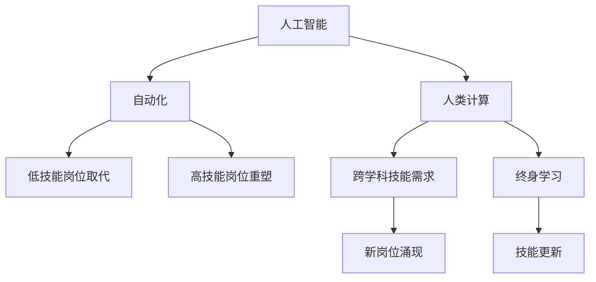

                 

# 人类计算：AI时代的未来就业趋势和技能需求

> 关键词：人工智能,自动化,人类计算,未来就业,技能需求

## 1. 背景介绍

### 1.1 问题由来
随着人工智能（AI）技术的迅速发展，自动化和智能化已经在许多行业中逐步取代了大量传统的人力工作。从简单的重复性劳动到复杂的决策制定，AI系统都展现出了强大的能力和效率。然而，这一趋势也引发了广泛的担忧：AI的崛起是否会导致大量人类岗位被机器替代？未来的就业市场将面临哪些新的挑战和机遇？本文将围绕这些问题，探讨AI时代人类计算的趋势和技能需求。

### 1.2 问题核心关键点
未来的就业市场将受到AI技术的深远影响，主要体现在以下几个关键点：
- AI自动化取代低技能工作。重复性、规则化程度高的任务（如数据录入、客户服务等）更容易被AI系统取代。
- 高技能工作面临重塑。复杂决策、创意工作（如数据分析、研发设计等）虽难以完全自动化，但AI工具将极大提升效率。
- 跨学科技能需求增加。AI时代对整合知识、跨界创新能力提出了更高要求。
- 终身学习成为常态。快速发展的AI技术要求员工不断更新知识技能，以保持竞争力。

### 1.3 问题研究意义
理解AI时代的就业趋势和技能需求，对于个人职业规划、企业人才战略乃至社会政策制定都具有重要意义：

1. 个人层面：及时调整职业发展路径，提升关键技能，确保在AI浪潮中保持竞争力。
2. 企业层面：准确评估人才需求，优化人力资源配置，提高整体生产效率。
3. 社会层面：制定适应AI发展的人才培养政策，平衡技术进步与就业稳定，实现可持续发展。

## 2. 核心概念与联系

### 2.1 核心概念概述

为更好地理解AI时代就业趋势和技能需求，我们首先概述一些核心概念：

- **人工智能**：利用算法、统计模型和计算技术使机器能够执行需要人类智能的任务，包括但不限于语音识别、图像处理、自然语言处理等。
- **自动化**：使用技术手段代替人工完成工作流程，特别是重复性、标准化程度高的任务。
- **人类计算**：指人类在计算和认知层面上与机器协同工作，发挥其在创造性、情感理解和复杂决策中的优势。
- **未来就业**：指AI时代各种工作形态的发展趋势，包括新岗位的涌现和旧岗位的消失。
- **技能需求**：指在AI时代，各行业所需的核心技能和能力，如数据分析、算法设计、跨领域沟通等。

这些概念之间的逻辑关系可以通过以下Mermaid流程图来展示：



这个流程图展示了人工智能、自动化、人类计算、未来就业和技能需求之间的逻辑关系：

1. 人工智能推动自动化。AI技术使机器能够在特定任务上模拟或超越人类能力，逐步替代低技能岗位。
2. 自动化重塑工作形态。自动化技术在各行各业中的应用，使得高技能工作岗位的任务内容和形式发生改变。
3. 人类计算与机器协同。人类在计算和认知上与机器协作，发挥各自优势，提升整体效率。
4. 未来就业趋势。AI时代新旧岗位交替，对人才需求产生深刻变化。
5. 技能需求更新。为适应就业市场的变化，各类关键技能的需求将不断演进。

## 3. 核心算法原理 & 具体操作步骤
### 3.1 算法原理概述

AI技术在就业市场中的应用主要体现在两个方面：自动化和人类计算。二者的核心算法原理分别如下：

#### 3.1.1 自动化算法原理
自动化主要依赖于以下算法和模型：
- **规则基础自动化**：通过明确的操作规则和逻辑，实现简单的任务自动化。
- **机器学习**：利用历史数据训练模型，预测未来事件或优化任务流程。
- **深度学习**：通过大量数据训练深度神经网络，处理复杂、非结构化数据。

#### 3.1.2 人类计算算法原理
人类计算的核心在于整合多领域知识，与机器协同工作。算法原理包括：
- **跨学科知识整合**：将不同领域的知识和技术整合应用，解决复杂问题。
- **人机交互设计**：设计用户界面和交互流程，增强系统的易用性和用户体验。
- **数据驱动决策**：利用数据分析和可视化技术辅助人类进行决策。

### 3.2 算法步骤详解

#### 3.2.1 自动化步骤详解
自动化算法步骤主要包括以下几个环节：
1. **需求分析**：识别需要自动化的任务和流程，确定自动化目标。
2. **算法选择**：根据任务特点选择适合的自动化算法（如决策树、神经网络等）。
3. **数据准备**：收集和清洗相关数据，作为模型训练的基础。
4. **模型训练**：利用历史数据训练模型，优化算法参数。
5. **部署应用**：将训练好的模型部署到生产环境中，实现任务自动化。

#### 3.2.2 人类计算步骤详解
人类计算的步骤主要包括：
1. **任务定义**：明确计算任务的目标和要求。
2. **模型选择**：选择最适合的机器学习和深度学习模型。
3. **数据处理**：对数据进行预处理和特征提取。
4. **协同工作**：将人类计算和机器自动化有机结合，发挥各自优势。
5. **结果验证**：对计算结果进行验证和优化，确保准确性和可靠性。

### 3.3 算法优缺点

#### 3.3.1 自动化算法优点
- **效率提升**：自动化可以显著提高生产效率，降低人力成本。
- **一致性高**：机器执行任务具有高度的一致性，减少人为错误。
- **可扩展性强**：自动化系统可以轻松扩展，满足不同规模需求。

#### 3.3.2 自动化算法缺点
- **适应性差**：难以处理复杂多变的情况，需要不断更新算法。
- **成本高**：初期开发和部署成本较高，需要技术和管理投入。
- **就业冲击大**：自动化可能造成大规模失业，需要社会政策来缓解影响。

#### 3.3.3 人类计算算法优点
- **灵活性高**：人类在处理复杂和创造性任务上具有优势。
- **情感智能**：人类在情感理解和处理上优于机器。
- **跨界整合**：能够整合不同领域的知识，实现创新应用。

#### 3.3.4 人类计算算法缺点
- **效率较低**：相对机器自动化，人类计算效率较低。
- **错误率较高**：人类计算在执行过程中容易受到情绪和认知偏差的影响。
- **学习曲线陡**：新技术和新方法的学习曲线较陡，需要较长时间掌握。

### 3.4 算法应用领域

#### 3.4.1 自动化应用领域
- **制造业**：自动化生产线，实现机械臂操作、质量检测、物流配送等任务。
- **金融业**：自动化交易、风险评估、客户服务等，提高操作效率和决策速度。
- **医疗业**：自动化诊断、手术辅助、病人护理等，减少人为操作失误。
- **物流业**：自动化仓储、分拣、配送等，提升物流效率和减少错误。

#### 3.4.2 人类计算应用领域
- **研发设计**：整合多领域知识，辅助创意和创新。
- **教育培训**：利用数据分析和个性化推荐技术，提高教育效果。
- **文化艺术**：辅助创作、管理和欣赏，提升艺术作品的质量和价值。
- **社会治理**：跨学科整合资源，优化公共服务和社会管理。

## 4. 数学模型和公式 & 详细讲解 & 举例说明

### 4.1 数学模型构建

AI技术在自动化和人类计算中的应用，通常通过数学模型来描述和优化。以下是一些常见的数学模型：

#### 4.1.1 自动化模型
- **决策树模型**：一种基于树形结构的分类模型，通过不断分割特征空间来优化分类结果。
- **神经网络模型**：一种复杂的非线性模型，通过多层神经元模拟人类大脑的计算过程。
- **支持向量机模型**：一种二分类模型，通过寻找最优超平面实现分类。

#### 4.1.2 人类计算模型
- **知识图谱模型**：一种表示知识结构的图模型，通过节点和边的关系表示实体和属性。
- **跨领域协同模型**：一种整合多领域知识的协同模型，通过多模态融合提升计算能力。
- **情感分析模型**：一种基于情感词典和机器学习算法的文本分析模型，用于情感识别和情绪处理。

### 4.2 公式推导过程

#### 4.2.1 决策树模型
决策树模型通过特征选择和分类规则实现任务自动化。公式推导如下：

$$
\begin{aligned}
T &= \text{Tree}(D, S, \alpha) \\
&= \text{Node}(D, S) + \alpha \cdot \text{Child}(T, S) \\
&= \text{Node}(D, S) + \alpha \cdot \text{Node}(D_{\text{left}}, S_{\text{left}}) + (1-\alpha) \cdot \text{Node}(D_{\text{right}}, S_{\text{right}})
\end{aligned}
$$

其中，$T$ 为决策树，$D$ 为训练数据集，$S$ 为当前节点，$\alpha$ 为节点权重，$D_{\text{left}}$ 和 $D_{\text{right}}$ 分别为左、右子节点数据集。

#### 4.2.2 神经网络模型
神经网络模型通过反向传播算法进行参数优化，公式如下：

$$
\begin{aligned}
\mathcal{L} &= \sum_i \text{Loss}(y_i, \hat{y}_i) \\
&= \sum_i \text{Loss}(y_i, M_{\theta}(x_i)) \\
&= \sum_i \text{Loss}(y_i, \sum_j W_j \cdot f_j(z_i))
\end{aligned}
$$

其中，$\mathcal{L}$ 为损失函数，$y_i$ 为真实标签，$\hat{y}_i$ 为模型预测，$M_{\theta}(x_i)$ 为模型输出，$f_j$ 为激活函数，$z_i$ 为输入特征。

### 4.3 案例分析与讲解

#### 4.3.1 决策树模型案例
一个用于客户分类的决策树模型，通过特征选择和规则划分，实现客户分类自动化。

1. **数据准备**：收集客户历史交易记录，包括购买频率、消费金额、年龄、性别等信息。
2. **模型训练**：利用决策树算法训练模型，根据消费金额和购买频率等特征进行客户分类。
3. **结果验证**：在测试数据集上验证模型效果，计算准确率和召回率等指标。

#### 4.3.2 神经网络模型案例
一个用于情感分析的神经网络模型，通过文本特征提取和情感分类，实现情感分析自动化。

1. **数据准备**：收集社交媒体上的用户评论数据，包括文本内容和情感标签。
2. **模型训练**：利用神经网络模型训练情感分类器，根据文本特征和情感词典进行情感分析。
3. **结果验证**：在验证集上评估模型效果，计算准确率和F1分数等指标。

## 5. 项目实践：代码实例和详细解释说明

### 5.1 开发环境搭建

要进行AI技术的应用实践，首先需要准备好开发环境。以下是使用Python进行PyTorch开发的流程：

1. 安装Anaconda：从官网下载并安装Anaconda，用于创建独立的Python环境。

2. 创建并激活虚拟环境：
```bash
conda create -n pytorch-env python=3.8 
conda activate pytorch-env
```

3. 安装PyTorch：根据CUDA版本，从官网获取对应的安装命令。例如：
```bash
conda install pytorch torchvision torchaudio cudatoolkit=11.1 -c pytorch -c conda-forge
```

4. 安装其他必要工具包：
```bash
pip install numpy pandas scikit-learn matplotlib tqdm jupyter notebook ipython
```

完成上述步骤后，即可在`pytorch-env`环境中进行AI技术的实践开发。

### 5.2 源代码详细实现

以下是一个简单的基于决策树模型的客户分类项目实现，展示了从数据准备到模型训练和评估的全流程。

```python
import pandas as pd
from sklearn.tree import DecisionTreeClassifier
from sklearn.metrics import accuracy_score
from sklearn.model_selection import train_test_split

# 读取数据
data = pd.read_csv('customer_data.csv')

# 数据预处理
# 假设特征包含购买频率、消费金额等，标签为是否流失
X = data[['purchase_freq', 'consumption_amount']]
y = data['churn']

# 划分训练集和测试集
X_train, X_test, y_train, y_test = train_test_split(X, y, test_size=0.2, random_state=42)

# 创建决策树模型
model = DecisionTreeClassifier()

# 训练模型
model.fit(X_train, y_train)

# 评估模型
y_pred = model.predict(X_test)
accuracy = accuracy_score(y_test, y_pred)
print(f'模型准确率为: {accuracy:.2f}')
```

### 5.3 代码解读与分析

让我们再详细解读一下关键代码的实现细节：

**数据处理**：
- 读取数据集：使用`pandas`库读取CSV格式的数据文件，`customer_data.csv`为示例数据集。
- 数据预处理：假设特征包括购买频率`purchase_freq`、消费金额`consumption_amount`等，标签为是否流失`churn`。
- 划分数据集：利用`train_test_split`函数将数据划分为训练集和测试集，测试集占20%。

**模型训练**：
- 创建模型：使用`DecisionTreeClassifier`创建决策树模型。
- 训练模型：使用训练集数据`X_train`和标签`y_train`，调用`fit`函数进行模型训练。

**模型评估**：
- 预测标签：使用训练好的模型`model`，对测试集数据`X_test`进行预测，得到预测标签`y_pred`。
- 计算准确率：利用`accuracy_score`函数计算模型在测试集上的准确率，输出结果。

## 6. 实际应用场景

### 6.1 制造业

在制造业中，自动化技术已经开始大规模应用。例如，机器人自动化生产线可以实现机械臂操作、质检、物流配送等任务，显著提高生产效率。同时，基于AI的人类计算，如智能调度系统，可以优化生产流程，提升资源利用率。

### 6.2 金融业

金融业是AI应用的重要领域。自动化交易系统可以实时处理大量交易数据，自动执行交易指令。同时，基于人类计算的智能投顾系统，可以提供个性化的投资建议，提升客户满意度。

### 6.3 医疗业

医疗领域也正在迎来AI技术的变革。自动化诊断系统可以辅助医生进行初步筛查和诊断，提高诊断准确率。人类计算方面，智能医疗助手可以整合多领域知识，提供精准的疾病预测和治疗方案，改善患者体验。

### 6.4 未来应用展望

未来，AI技术将在更多领域得到广泛应用，带来深远的影响：

- **智慧城市**：智能交通、智能安防、智能能源等，提升城市管理效率和居民生活质量。
- **教育培训**：个性化学习系统、智能辅导机器人等，提升教育质量和覆盖面。
- **文化艺术**：智能创作工具、艺术品管理等，推动文化艺术产业创新发展。
- **社会治理**：智能公共服务、智能政策制定等，提升社会治理能力。

## 7. 工具和资源推荐

### 7.1 学习资源推荐

为了帮助开发者掌握AI技术，以下是一些优质的学习资源：

1. **Coursera《深度学习专项课程》**：由斯坦福大学Andrew Ng教授主讲，深入讲解深度学习的基本原理和应用。
2. **edX《Python数据科学微专业》**：涵盖数据清洗、机器学习、深度学习等内容，适合初学者入门。
3. **Kaggle竞赛平台**：通过实际数据集进行机器学习竞赛，提升实战能力。
4. **Github开源项目**：查找和参与开源项目，积累实践经验。

### 7.2 开发工具推荐

为了提升开发效率和实践效果，以下是一些推荐的开发工具：

1. **PyTorch**：开源深度学习框架，灵活高效，适合研究和实验。
2. **TensorFlow**：Google开发的深度学习框架，功能强大，适合生产部署。
3. **Scikit-learn**：Python数据科学库，提供简单易用的机器学习算法。
4. **Jupyter Notebook**：交互式编程环境，便于实验和分享。

### 7.3 相关论文推荐

以下是几篇重要的相关论文，推荐阅读：

1. **《深度学习》书籍**：Ian Goodfellow等著，深入介绍深度学习原理和应用。
2. **《机器学习实战》书籍**：Peter Harrington著，通过实际案例讲解机器学习算法。
3. **《NeurIPS2021》会议论文**：涵盖深度学习、机器学习等领域的最新研究成果。

## 8. 总结：未来发展趋势与挑战

### 8.1 研究成果总结

本文介绍了AI技术在自动化和人类计算中的应用，展示了未来就业市场面临的变化和机遇。主要研究成果如下：

1. AI技术推动自动化和人类计算，提升生产效率和工作质量。
2. 未来就业市场将出现新旧岗位交替，高技能工作面临重塑。
3. 跨学科技能和终身学习将成为新的就业趋势。

### 8.2 未来发展趋势

展望未来，AI技术的发展将带来以下趋势：

1. **自动化技术持续进化**：自动化系统将更加智能化和灵活，适用于更多复杂任务。
2. **人类计算能力提升**：通过跨学科整合和情感智能技术，提升人类在计算中的价值。
3. **跨领域协作增强**：跨领域协同工作将更加普遍，提升整体创新能力。
4. **智能系统普及**：智能系统将广泛应用于各个领域，提升社会生产力和生活质量。

### 8.3 面临的挑战

尽管AI技术带来了诸多优势，但也面临以下挑战：

1. **就业冲击显著**：自动化技术可能导致大规模失业，需要社会政策来缓解影响。
2. **技术普及难度**：技术复杂度高，普及难度大，需要更多教育资源和政策支持。
3. **数据隐私风险**：AI系统需要大量数据，数据隐私和安全问题不容忽视。

### 8.4 研究展望

为应对这些挑战，未来研究需要从以下几个方向展开：

1. **就业保护政策**：制定适应AI发展的就业保护政策，减少技术变革带来的负面影响。
2. **技术普及教育**：加强技术普及和教育培训，提升全社会对AI技术的理解和应用能力。
3. **数据隐私保护**：研究数据隐私保护技术，保障数据安全和用户隐私。

## 9. 附录：常见问题与解答

**Q1: AI技术对就业市场的影响是什么？**

A: AI技术对就业市场的影响主要体现在两方面：一方面，自动化技术可以替代低技能工作，提升生产效率。另一方面，高技能工作面临重塑，需要更多跨学科知识和创新能力。总体而言，AI技术将推动就业市场向高技能、高附加值方向发展。

**Q2: 如何应对AI技术带来的就业冲击？**

A: 应对AI技术带来的就业冲击，主要需要从以下几个方面入手：
1. 政府应制定就业保护政策，通过再培训和职业转型等措施，帮助受影响的员工适应新岗位。
2. 企业应提供更多的终身学习机会，帮助员工不断提升技能，保持竞争力。
3. 社会应加强跨学科教育和培训，提升全社会对AI技术的理解和应用能力。

**Q3: 如何提升人类在AI系统中的价值？**

A: 提升人类在AI系统中的价值，主要需要从以下几个方面入手：
1. 跨学科整合：将不同领域的知识和技能整合，提升系统的整体能力。
2. 情感智能：提升AI系统的情感理解和处理能力，增强系统的智能水平。
3. 用户体验设计：设计用户友好的界面和交互流程，提升系统的易用性和用户满意度。

通过本文的探讨，我们可以看到AI技术对未来就业市场的影响和机遇，理解了人类计算在AI时代的重要作用，同时也认识到面临的挑战和应对策略。未来，只有积极适应技术变革，不断提升自身技能和创新能力，才能在AI浪潮中保持竞争力，实现个人和社会的可持续发展。

