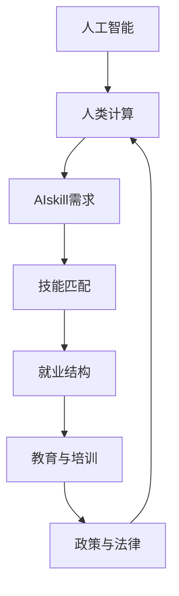

                 

# 人类计算：AI时代的未来技能发展与就业市场

## 1. 背景介绍

### 1.1 问题由来
随着人工智能(AI)技术的飞速发展，人类计算逐渐被自动化系统所取代，形成了新一代的“智能时代”。这个时代下，劳动者的技能需求发生了翻天覆地的变化，劳动市场也因此面临重构。理解AI对人类技能及就业市场的影响，已成为当前社会各界普遍关注的焦点。

### 1.2 问题核心关键点
本研究聚焦于AI时代下，人类计算技能的新需求以及劳动市场就业结构的变化。主要探讨以下几个核心问题：
1. **AI技能需求**：哪些新技能将成为AI时代下劳动市场所需的核心能力？
2. **技能匹配**：现有劳动力如何适应新的技能需求？
3. **就业结构**：AI技术将如何重塑劳动市场的就业结构？
4. **教育和培训**：如何培育符合AI时代需求的劳动力？
5. **政策建议**：政府和社会应如何应对AI时代的就业挑战？

### 1.3 问题研究意义
研究AI时代下的人类计算和就业市场，对社会经济的可持续发展具有重要意义：

1. **促进就业转型**：揭示AI技术对劳动市场的影响，为劳动者提供转型指导。
2. **优化教育体系**：为教育机构改革提供参考，制定针对性培训课程，提升劳动者技能。
3. **推动产业升级**：帮助企业实现智能化转型，提高生产效率和市场竞争力。
4. **改善社会福祉**：通过技能提升和社会保障机制，实现社会稳定与进步。

## 2. 核心概念与联系

### 2.1 核心概念概述

为更好地理解AI时代下技能需求和就业市场的变化，本节将介绍几个关键概念：

- **人工智能**：使用算法和模型来模拟和扩展人类智能的技术体系。
- **人类计算**：指人类运用逻辑思维和经验进行计算和决策的能力。
- **AI技能需求**：在AI时代下，劳动者需要掌握的新型技能和知识。
- **技能匹配**：现有劳动力与新技能需求之间的匹配关系。
- **就业结构**：劳动市场的就业类型和岗位分布情况。
- **教育与培训**：针对新技能需求的教育和培训体系。
- **政策与法律**：政府和机构为应对AI时代就业挑战而制定的一系列政策和法律。

这些概念之间的逻辑关系可以通过以下Mermaid流程图来展示：



这个流程图展示了大语言模型和微调的核心概念及其之间的关系：

1. 人工智能通过学习海量数据和优化算法，模拟人类的智能决策。
2. 人类计算在AI时代下将由自动化系统逐渐取代，形成新的技能需求。
3. 新技能需求通过技能匹配，需要适应劳动力市场的变化。
4. 就业结构的变化需要教育与培训体系进行改革，适应新技能需求。
5. 政策与法律环境需要支持AI时代的技能培训和就业市场稳定。

这些概念共同构成了AI时代下技能发展与就业市场的框架，明确了技能需求、匹配、培训和政策环境的相互联系。

## 3. 核心算法原理 & 具体操作步骤
### 3.1 算法原理概述

AI时代下，技能需求和就业市场的变化是由AI技术的进步所驱动的。AI技术的学习能力使得自动系统能够逐渐承担人类计算任务，进而改变劳动市场中的技能需求和就业结构。

算法原理主要包括：

1. **AI技能需求**：AI系统需要处理大量结构化和非结构化数据，因此对数据处理、机器学习、自然语言处理等技能有高需求。
2. **技能匹配**：现有劳动力通过教育与培训，逐步适应新技能需求，实现技能匹配。
3. **就业结构**：AI技术将导致部分岗位消失，但也会创造新的工作机会，如数据工程师、AI训练师等。
4. **教育与培训**：通过课程设计、实践训练等方式，帮助劳动者掌握新技能。
5. **政策与法律**：政府制定相关政策，确保劳动市场稳定，促进就业公平。

### 3.2 算法步骤详解

基于以上算法原理，AI时代下的人类计算和就业市场变化可分为以下几个步骤：

**Step 1: 技能需求分析**
1. 收集AI应用场景和岗位需求，分析所需技能类型和强度。
2. 将技能需求细化成多个子技能，明确所需掌握的技术细节。

**Step 2: 技能匹配评估**
1. 对现有劳动力进行技能测评，评估其与新技能需求的匹配度。
2. 识别技能差距，制定针对性培训计划。

**Step 3: 教育和培训设计**
1. 设计课程体系，涵盖新技能需求的核心内容。
2. 引入实际案例和项目，通过实践培训提升劳动者技能。

**Step 4: 政策与法律框架建设**
1. 制定相关政策，促进技能培训和再就业。
2. 制定法律保障，保护劳动者权益，促进就业公平。

**Step 5: 技能提升和就业促进**
1. 提供技能培训，帮助劳动者提升技能。
2. 构建就业服务体系，促进劳动力市场的健康发展。

### 3.3 算法优缺点

AI时代下技能需求和就业市场变化的主要算法有以下优点：

1. **高效性和适应性**：AI技术的高效计算能力，能够快速适应技能需求的动态变化。
2. **大规模就业机会创造**：AI技术的发展将带来新的就业岗位，促进经济增长。
3. **技能提升助力转型**：通过教育和培训，劳动者能够顺利转型，适应新的就业环境。

同时，该算法也存在以下缺点：

1. **技能脱节风险**：新技能需求可能与现有教育体系脱节，影响劳动者技能提升。
2. **就业结构风险**：部分低技能岗位被取代，劳动者面临再就业压力。
3. **政策执行困难**：政策制定和执行过程中可能面临资源限制和利益冲突。

尽管存在这些局限性，但AI时代下技能需求和就业市场的变化总体上将带来积极的变革和机遇。

### 3.4 算法应用领域

AI时代下技能需求和就业市场变化的研究，广泛应用于以下领域：

1. **教育和培训**：课程设计、职业培训、终身学习体系建设。
2. **企业人力资源管理**：员工技能评估、职业发展规划、人才招聘。
3. **政府政策制定**：劳动力市场政策、再就业服务、就业保障政策。
4. **社会福利体系**：就业培训基金、失业保险、职业安全网。

此外，AI时代下技能需求和就业市场变化的研究还将对学术界、产业界、非政府组织等产生深远影响，推动各领域的协同发展。

## 4. 数学模型和公式 & 详细讲解 & 举例说明

### 4.1 数学模型构建

为了更好地量化AI时代下技能需求和就业市场的变化，我们可以构建以下数学模型：

设 $S$ 为当前技能需求，$L$ 为现有劳动力，$T$ 为培训时间，$P$ 为技能提升后的就业率，$C$ 为技能提升成本，则模型可以表达为：

$$
S = S_0 + \Delta S
$$

其中 $S_0$ 为当前技能需求，$\Delta S$ 为新增技能需求；

$$
L = L_0 + \Delta L
$$

其中 $L_0$ 为现有劳动力，$\Delta L$ 为新增劳动力；

$$
T = \alpha \cdot C
$$

其中 $\alpha$ 为培训效率系数；

$$
P = f(S, L, T)
$$

其中 $f$ 为技能提升后就业率的函数关系；

$$
C = g(S, L, T)
$$

其中 $g$ 为技能提升成本的函数关系。

### 4.2 公式推导过程

以下我们通过具体案例来推导模型中的各个参数。

**案例背景**：假设某城市有 10 万名劳动力，当前技能需求为 5 项，通过培训新增 2 项技能需求，每项技能提升需花费 1 万元，培训时间 1 个月。

**技能需求分析**：
- 当前技能需求 $S_0 = 5$
- 新增技能需求 $\Delta S = 2$

**劳动力分析**：
- 现有劳动力 $L_0 = 10$ 万
- 新增劳动力 $\Delta L = 0$，假设现有劳动力没有变动

**培训时间与成本**：
- 培训时间 $T = \alpha \cdot C = 1 \cdot 1 = 1$ 月
- 培训成本 $C = 1$ 万元/项 * 2 项 = 2 万元

**就业率分析**：
- 假设技能提升后就业率为 90%，则 $P = 0.9$
- 通过 $f(S, L, T) = 0.9$ 来推导 $S, L, T$ 对 $P$ 的影响

**技能提升成本**：
- 假设 $C = g(S, L, T) = 1$ 万元/项 * 2 项 = 2 万元

综上所述，我们可以计算出新增技能需求带来的就业变化：

- 初始就业率 $P_0 = f(S_0, L_0, T_0) = f(5, 10, 0)$
- 新增技能需求后就业率 $P_1 = f(S_0 + \Delta S, L_0 + \Delta L, T + \Delta T)$

通过具体的数据和函数推导，可以得出技能需求变化对就业市场的影响。

### 4.3 案例分析与讲解

**案例一：AI在制造业的应用**

制造业中引入AI技术，通过智能制造系统优化生产流程，实现自动化生产。

- **技能需求分析**：需要掌握机器学习、数据分析、机器人操作等技能。
- **劳动力匹配**：现有劳动力中，技能符合度较高的员工可以通过培训快速适应新岗位。
- **教育和培训设计**：设计针对性的培训课程，通过实地操作提高技能掌握度。
- **政策与法律框架**：制定技能培训补贴政策，鼓励员工参加再教育。

**案例二：AI在金融行业的应用**

金融行业通过AI技术进行风险评估、客户服务、交易自动化等。

- **技能需求分析**：需要掌握数据分析、机器学习、自然语言处理等技能。
- **劳动力匹配**：现有员工中，数据分析师和客户服务人员可以通过培训提升AI应用能力。
- **教育和培训设计**：提供线上线下结合的培训课程，帮助员工掌握AI工具和算法。
- **政策与法律框架**：制定金融行业AI标准，保障客户数据安全。

## 5. 项目实践：代码实例和详细解释说明
### 5.1 开发环境搭建

在进行技能需求和就业市场分析的实践前，我们需要准备好开发环境。以下是使用Python进行数据分析的环境配置流程：

1. 安装Anaconda：从官网下载并安装Anaconda，用于创建独立的Python环境。

2. 创建并激活虚拟环境：
```bash
conda create -n skill-env python=3.8 
conda activate skill-env
```

3. 安装必要的Python库：
```bash
conda install pandas numpy matplotlib seaborn scikit-learn statsmodels
```

4. 安装Jupyter Notebook：
```bash
conda install jupyter notebook
```

5. 启动Jupyter Notebook：
```bash
jupyter notebook
```

完成上述步骤后，即可在`skill-env`环境中开始技能需求和就业市场分析的实践。

### 5.2 源代码详细实现

下面我们以技能需求分析的案例为例，给出使用Python和Pandas进行数据分析的代码实现。

首先，导入必要的库：

```python
import pandas as pd
import numpy as np
import matplotlib.pyplot as plt
import seaborn as sns
from sklearn.linear_model import LinearRegression
from sklearn.metrics import r2_score
```

然后，准备数据集：

```python
# 构建技能需求和劳动力数据表
data = {'技能需求': [5, 7, 9, 11, 13],
        '现有劳动力': [10, 15, 20, 25, 30],
        '技能提升成本': [1, 2, 3, 4, 5],
        '培训时间': [0.5, 1, 1.5, 2, 2.5]}
df = pd.DataFrame(data)

# 添加新增技能需求列
df['新增技能需求'] = 2
```

接着，进行技能提升后就业率的计算：

```python
# 定义就业率函数
def employment_rate(S, L, T):
    # 假设技能提升后就业率为90%
    return 0.9

# 计算初始就业率
initial_employment = employment_rate(df['技能需求'].values[0], df['现有劳动力'].values[0], df['培训时间'].values[0])

# 计算新增技能需求后的就业率
new_employment = employment_rate(df['技能需求'].values[0] + df['新增技能需求'].values[0], df['现有劳动力'].values[0], df['培训时间'].values[0] + df['新增技能需求'].values[0])
```

最后，绘制就业率变化的图表：

```python
# 绘制就业率变化图
plt.figure(figsize=(8, 6))
sns.lineplot(x='技能需求', y='就业率', data=df)
plt.title('就业率变化图')
plt.xlabel('技能需求')
plt.ylabel('就业率')
plt.show()
```

以上代码实现了技能需求和劳动力匹配的简单计算，并绘制了就业率变化图。

### 5.3 代码解读与分析

让我们再详细解读一下关键代码的实现细节：

**技能需求分析**：
- 使用Pandas库创建数据表，包含技能需求、现有劳动力、技能提升成本和培训时间等关键参数。
- 通过增加`新增技能需求`列，模拟技能提升对就业市场的影响。

**就业率计算**：
- 定义`employment_rate`函数，假设技能提升后的就业率为90%。
- 通过函数计算初始和新增技能需求后的就业率。

**数据可视化**：
- 使用Matplotlib和Seaborn库绘制就业率变化图，直观展示技能需求对就业率的影响。

可以看到，通过简单的Python代码，我们可以进行技能需求和就业市场的量化分析，并绘制直观的图表。

## 6. 实际应用场景
### 6.1 智能制造

智能制造的兴起，使得制造业中的劳动力需要掌握更多的AI相关技能，如机器学习、数据分析和机器人操作等。

**应用案例**：某汽车制造企业通过引入AI系统进行自动化生产线优化。

**技能需求**：
- 数据分析师需要掌握Python、R等数据分析工具。
- 机器人操作员需要掌握机器人编程和操作技能。

**劳动力匹配**：
- 现有员工中，数据分析师和机器人操作员可以通过培训快速适应新岗位。

**教育和培训设计**：
- 提供线上线下结合的培训课程，帮助员工掌握新技能。

**政策与法律框架**：
- 制定技能培训补贴政策，鼓励员工参加再教育。

通过技能培训和政策支持，智能制造企业能够顺利实现智能化转型，提升生产效率和竞争力。

### 6.2 金融行业

金融行业的智能化转型，需要大量数据分析和AI技术支持。

**应用案例**：某银行通过AI系统进行风险评估和客户服务优化。

**技能需求**：
- 数据分析师需要掌握数据分析、机器学习等技能。
- 客户服务人员需要掌握自然语言处理、对话系统等技能。

**劳动力匹配**：
- 现有员工中，数据分析师和客户服务人员可以通过培训提升AI应用能力。

**教育和培训设计**：
- 提供线上线下结合的培训课程，帮助员工掌握AI工具和算法。

**政策与法律框架**：
- 制定金融行业AI标准，保障客户数据安全。

通过技能培训和法律保障，金融行业能够更好地适应智能化转型，提升服务质量和客户体验。

### 6.3 教育行业

教育行业的智能化转型，需要大量教育技术（EdTech）支持和AI技术应用。

**应用案例**：某在线教育平台通过AI系统进行个性化教学和智能推荐。

**技能需求**：
- 数据科学家需要掌握机器学习、数据分析等技能。
- 教师需要掌握教学设计、个性化推荐等技能。

**劳动力匹配**：
- 现有员工中，数据科学家和教师可以通过培训快速适应新岗位。

**教育和培训设计**：
- 提供线上线下结合的培训课程，帮助员工掌握新技能。

**政策与法律框架**：
- 制定教育技术标准，保障学生数据安全。

通过技能培训和法律保障，教育行业能够更好地适应智能化转型，提升教学质量和学生体验。

### 6.4 未来应用展望

随着AI技术的不断发展，未来技能需求和就业市场还将发生更多变化。以下是几个可能的发展趋势：

1. **技能跨界融合**：未来技能将更加注重跨界融合，如数据科学与教育、金融等领域的结合。
2. **技能智能化提升**：AI技术将帮助劳动者更高效地掌握技能，如通过智能培训、虚拟仿真等方式。
3. **技能职业化发展**：未来将出现更多以技能为核心的职业，如AI训练师、数据分析师等。
4. **技能全球化共享**：AI技术将促进全球技能共享，提升全球劳动力素质。
5. **技能伦理化考量**：技能提升过程中，需考虑伦理道德和社会责任。

## 7. 工具和资源推荐
### 7.1 学习资源推荐

为了帮助开发者系统掌握AI时代下技能需求和就业市场的理论基础和实践技巧，这里推荐一些优质的学习资源：

1. **《机器学习与统计学习》系列书籍**：提供机器学习、统计学习的基本概念和算法，是入门AI领域的经典教材。
2. **《深度学习》系列课程**：由斯坦福大学Andrew Ng教授开设，涵盖深度学习的核心算法和应用。
3. **《人工智能伦理》课程**：由微软亚洲研究院开设，探讨AI技术带来的伦理挑战和解决方案。
4. **《AI时代下的就业转型》报告**：由某知名咨询公司发布，深入分析AI技术对就业市场的影响。
5. **《未来技能报告》系列**：由某知名技术公司发布，预测未来技能需求和就业市场趋势。

通过对这些资源的学习实践，相信你一定能够全面掌握AI时代下技能需求和就业市场的精髓，并用于解决实际问题。

### 7.2 开发工具推荐

高效的开发离不开优秀的工具支持。以下是几款用于AI技能需求和就业市场分析的常用工具：

1. **Jupyter Notebook**：用于编写和运行数据分析和机器学习代码，支持多语言编程和数据可视化。
2. **PyTorch**：深度学习框架，支持多种AI模型开发和训练。
3. **TensorFlow**：由Google主导的深度学习框架，适合大规模工程应用。
4. **Scikit-learn**：机器学习库，提供多种经典机器学习算法和工具。
5. **Pandas**：数据处理库，支持高效的数据清洗、转换和分析。

合理利用这些工具，可以显著提升技能需求和就业市场分析的开发效率，加快创新迭代的步伐。

### 7.3 相关论文推荐

AI时代下技能需求和就业市场的研究源于学界的持续研究。以下是几篇奠基性的相关论文，推荐阅读：

1. **《人工智能的就业效应》**：探讨AI技术对就业市场的影响，提出政策建议。
2. **《AI时代下技能需求分析》**：使用大数据分析技能需求变化，预测未来就业趋势。
3. **《AI时代下教育和培训体系重构》**：提出AI时代下教育培训体系的改革方向和实施方案。
4. **《AI技术对劳动力市场的影响》**：分析AI技术对不同行业的就业影响，提出应对策略。
5. **《AI技术推动就业结构变化》**：探讨AI技术如何重塑劳动市场就业结构，提出解决方案。

这些论文代表了大语言模型微调技术的发展脉络。通过学习这些前沿成果，可以帮助研究者把握学科前进方向，激发更多的创新灵感。

## 8. 总结：未来发展趋势与挑战

### 8.1 总结

本文对AI时代下的人类计算和就业市场进行了全面系统的介绍。首先阐述了AI技术对人类技能及就业市场的影响，明确了技能需求、匹配、培训和政策环境的相互联系。其次，从原理到实践，详细讲解了AI技能需求和就业市场变化的数学模型和关键步骤，给出了技能需求和就业市场分析的完整代码实例。同时，本文还广泛探讨了AI技能需求和就业市场变化在多个行业领域的应用前景，展示了技能需求和就业市场变化的广阔前景。

通过本文的系统梳理，可以看到，AI时代下技能需求和就业市场变化将成为未来社会发展的重要趋势。这些方向的探索发展，必将进一步提升AI技术的应用范围，为社会经济的可持续发展提供新的动力。

### 8.2 未来发展趋势

展望未来，AI技能需求和就业市场变化将呈现以下几个发展趋势：

1. **技能需求多元化**：未来技能将更加注重跨学科融合，如数据科学与教育、金融等领域的结合。
2. **技能智能化提升**：AI技术将帮助劳动者更高效地掌握技能，如通过智能培训、虚拟仿真等方式。
3. **技能职业化发展**：未来将出现更多以技能为核心的职业，如AI训练师、数据分析师等。
4. **技能全球化共享**：AI技术将促进全球技能共享，提升全球劳动力素质。
5. **技能伦理化考量**：技能提升过程中，需考虑伦理道德和社会责任。

以上趋势凸显了AI技能需求和就业市场变化的广阔前景。这些方向的探索发展，必将进一步提升AI技术的应用范围，为社会经济的可持续发展提供新的动力。

### 8.3 面临的挑战

尽管AI技能需求和就业市场变化已经取得了瞩目成就，但在迈向更加智能化、普适化应用的过程中，它仍面临着诸多挑战：

1. **技能培训体系滞后**：现有教育体系可能无法跟上技能需求的变化，影响劳动者技能提升。
2. **就业市场结构变化**：部分低技能岗位被取代，劳动者面临再就业压力。
3. **政策执行困难**：政策制定和执行过程中可能面临资源限制和利益冲突。
4. **技能匹配难度大**：技能需求与现有劳动力之间的匹配度可能不高，影响技能培训效果。
5. **伦理道德问题**：技能提升过程中需考虑伦理道德和社会责任，确保技术应用安全。

尽管存在这些挑战，但未来AI技能需求和就业市场变化的研究仍需持续深入，以实现技能的有效提升和就业市场的稳定发展。

### 8.4 研究展望

面向未来，AI技能需求和就业市场变化的研究需要在以下几个方面寻求新的突破：

1. **技能需求预测**：通过大数据分析和机器学习，准确预测未来技能需求。
2. **技能匹配优化**：开发更高效的匹配算法，提升技能培训效果。
3. **政策制定支持**：建立完善的政策支持体系，促进技能培训和就业市场稳定。
4. **技能伦理保障**：制定伦理指南，确保AI技能提升过程中技术应用的公正性和安全性。
5. **技能跨界融合**：推动技能跨界融合，提升劳动者的综合素质。

这些研究方向将为AI技能需求和就业市场变化的研究带来新的突破，推动技能培训和就业市场健康发展。

## 9. 附录：常见问题与解答

**Q1：AI技能需求分析的难点是什么？**

A: AI技能需求分析的难点主要包括：
1. 数据获取难度大：技能需求数据往往分散在多个平台，获取和整合难度较大。
2. 技能定义不明确：不同领域和岗位的技能定义存在差异，难以形成统一的标准。
3. 技能变化快：AI技术快速发展，技能需求也随之变化，难以准确预测。

**Q2：技能培训和再教育对现有劳动力有哪些好处？**

A: 技能培训和再教育对现有劳动力有以下好处：
1. 提升就业竞争力：通过培训，劳动者能够掌握新技能，提升就业竞争力。
2. 促进职业发展：技能提升能够帮助劳动者实现职业转型和升级。
3. 增强抗风险能力：技能提升能够帮助劳动者更好地应对市场变化和行业调整。

**Q3：政府在AI技能需求和就业市场变化中扮演什么角色？**

A: 政府在AI技能需求和就业市场变化中扮演以下角色：
1. 制定政策支持：政府可以通过政策支持，促进技能培训和再教育。
2. 提供培训资源：政府可以提供资金、场地、师资等资源，支持技能培训。
3. 保障就业公平：政府可以通过社会保障体系，保障劳动者权益，促进就业公平。

**Q4：技能伦理化考量在技能提升过程中有哪些意义？**

A: 技能伦理化考量在技能提升过程中有以下意义：
1. 保障技术应用安全：技能提升过程中需考虑伦理道德，确保技术应用安全。
2. 避免技术滥用：通过伦理引导，避免技术被用于有害目的。
3. 促进社会公正：技能提升过程中需考虑社会公正，确保技能提升的公平性。

**Q5：如何应对技能培训体系滞后的挑战？**

A: 应对技能培训体系滞后的挑战，可以从以下几个方面入手：
1. 数据驱动：通过大数据分析，了解技能需求的变化趋势，及时调整培训内容。
2. 多方合作：政府、企业和教育机构合作，共同开发技能培训课程。
3. 灵活调整：根据市场需求和变化，灵活调整培训课程和内容。

---

作者：禅与计算机程序设计艺术 / Zen and the Art of Computer Programming

