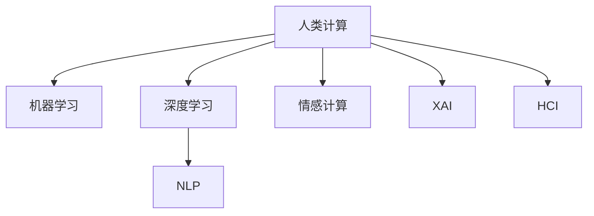

                 

# 人类计算：创造一个更加美好的世界

## 1. 背景介绍

### 1.1 问题由来

随着人工智能技术的飞速发展，我们越来越多地依靠机器来处理信息，从语音识别到图像处理，从自然语言处理到自动驾驶，AI技术正在深入我们生活的各个层面。然而，机器的计算能力再强，也无法完全取代人类独有的智慧和创造力。人类计算（Human Computation）是一种以人为本的计算模式，旨在融合人的直觉、经验和创造性，与机器计算能力相结合，创造出更加美好的未来。

### 1.2 问题核心关键点

人类计算的核心在于将人的智慧与机器的计算能力相结合，使得机器不仅能完成简单的计算任务，还能理解人类的意图和情感，从而在更复杂的场景中提供智能化解决方案。核心关键点包括：

- 人机协作：机器计算与人脑计算的互补，互相加强。
- 情感识别：理解人类情感，提供更加人性化的交互体验。
- 创造性思维：激发人类的创造性，提供创新性的解决方案。
- 安全与隐私：保护用户数据隐私，确保信息安全。

人类计算的目标是通过结合机器学习和人类智慧，创造出更加智能、高效、安全、可信的计算系统，为人类的生活、工作、学习带来更加美好的体验。

### 1.3 问题研究意义

人类计算的研究具有重要的理论意义和现实意义：

1. **提升计算效率**：机器学习和人类计算的结合，可以提升计算效率，降低计算成本。
2. **丰富计算模式**：突破传统的计算模式，提供更加多样化的计算方式。
3. **促进创新应用**：将人的智慧和创造力融入计算过程，催生新的创新应用场景。
4. **改善用户体验**：提供更加人性化、情感化的交互体验，提升用户的满意度和幸福感。
5. **推动产业升级**：推动传统行业与AI技术的深度融合，加速产业升级和转型。

## 2. 核心概念与联系

### 2.1 核心概念概述

为更好地理解人类计算的原理和应用，本节将介绍几个密切相关的核心概念：

- 人类计算（Human Computation）：将人类智慧与机器计算相结合，提升计算的智能化水平。
- 机器学习（Machine Learning）：通过数据和算法训练模型，使其具备预测和决策能力。
- 深度学习（Deep Learning）：一种特殊形式的机器学习，利用神经网络模型处理复杂数据。
- 自然语言处理（Natural Language Processing, NLP）：使机器能够理解和生成自然语言。
- 情感计算（Affective Computing）：研究如何识别、理解、生成人类情感，提供更加人性化的交互。
- 可解释性AI（Explainable AI, XAI）：使AI决策过程透明、可解释，增强用户信任。
- 人机交互（Human-Computer Interaction, HCI）：研究如何设计友好的用户界面，增强人机协作效果。

这些核心概念之间的逻辑关系可以通过以下Mermaid流程图来展示：



这个流程图展示了几大核心概念及其之间的关系：

1. 人类计算将机器学习、深度学习、NLP、情感计算、可解释性AI和人机交互等多种技术融合，提升计算的智能化水平。
2. 机器学习、深度学习和NLP等技术为人类计算提供了基础计算能力。
3. 情感计算、可解释性AI和人机交互等技术提升了计算系统的人性化和用户友好度。

## 3. 核心算法原理 & 具体操作步骤

### 3.1 算法原理概述

人类计算的核心算法原理是将人类的直觉、经验和创造性融入计算过程，通过数据和算法训练模型，使其具备预测和决策能力，并在复杂场景中提供智能化解决方案。其核心思想是通过人机协作，将机器计算与人脑计算相结合，提升计算效率和智能化水平。

具体而言，人类计算的实现可以分为以下几个步骤：

1. **数据采集与处理**：收集和处理与计算任务相关的数据，确保数据的准确性和多样性。
2. **模型训练**：使用机器学习或深度学习模型，对数据进行训练，使其具备预测和决策能力。
3. **人机协作**：通过人机交互界面，将计算任务展示给用户，收集用户的反馈和决策。
4. **决策融合**：将机器计算结果与人类决策相结合，生成最终的计算结果。
5. **效果评估**：评估计算结果的准确性和用户体验，持续优化计算模型和人机协作流程。

### 3.2 算法步骤详解

以下我们将详细介绍人类计算的算法步骤：

**Step 1: 数据采集与预处理**

1. **数据收集**：根据计算任务，从多个数据源收集所需数据。例如，自然语言处理任务需要收集大量的文本数据，情感计算任务需要收集表情、语音等数据。

2. **数据清洗**：对收集到的数据进行清洗和预处理，去除噪音和异常值，确保数据的质量。例如，NLP任务需要对文本进行分词、去停用词、词性标注等处理。

3. **数据增强**：通过数据增强技术，扩充训练集，提高模型的泛化能力。例如，使用回译、近义词替换等方式增加训练样本的多样性。

**Step 2: 模型训练**

1. **模型选择**：根据计算任务和数据特点，选择合适的机器学习或深度学习模型。例如，对于图像识别任务，可以使用卷积神经网络（CNN）；对于文本分类任务，可以使用循环神经网络（RNN）或Transformer模型。

2. **参数调整**：根据数据集的大小和特征，调整模型的超参数，如学习率、批大小、迭代轮数等，以获得最佳的训练效果。

3. **训练过程**：使用训练集数据对模型进行训练，不断更新模型参数，最小化损失函数。例如，使用交叉熵损失函数训练分类模型，使用均方误差损失函数训练回归模型。

**Step 3: 人机协作**

1. **界面设计**：设计友好的用户界面，将计算任务展示给用户，收集用户的反馈和决策。例如，使用GUI界面展示计算结果，使用语音助手接收用户的语音指令。

2. **用户交互**：通过用户界面，收集用户的反馈和决策。例如，对于图像识别任务，用户可以通过标记图像中的对象来辅助模型训练；对于自然语言处理任务，用户可以通过输入关键词来帮助模型生成回答。

**Step 4: 决策融合**

1. **结果融合**：将机器计算结果与人类决策相结合，生成最终的计算结果。例如，对于情感计算任务，将机器识别出的情感结果与用户标注的情感进行融合，生成更加准确的情感分析结果。

2. **结果输出**：将计算结果输出给用户，并展示给用户。例如，使用可视化界面展示图像识别结果，使用文本界面展示自然语言处理结果。

**Step 5: 效果评估**

1. **评估指标**：根据计算任务，选择合适的评估指标，如准确率、召回率、F1分数等，评估计算结果的准确性。

2. **用户反馈**：收集用户对计算结果的反馈，持续优化计算模型和人机协作流程。例如，对于情感计算任务，可以通过用户满意度调查问卷收集用户反馈，改进模型和人机协作流程。

### 3.3 算法优缺点

人类计算的优势在于其结合了人类的直觉、经验和创造性，能够在复杂场景中提供更加智能、人性化的解决方案。其缺点在于计算效率相对较低，需要人工参与，可能存在人为误差。

**优点**：

1. **智能化水平高**：结合人类的智慧和机器计算能力，能够处理更加复杂的问题。
2. **用户体验好**：提供更加人性化的交互体验，提升用户的满意度和幸福感。
3. **创新性强**：激发人类的创造性，推动新的应用场景和技术的创新。

**缺点**：

1. **计算效率低**：需要人工参与，计算效率相对较低。
2. **人为误差**：依赖人工参与，可能存在人为误差。
3. **资源消耗大**：需要大量的计算资源和人机交互接口，资源消耗较大。

尽管存在这些局限性，但人类计算在实际应用中已经展现出巨大的潜力，被广泛应用于多个领域，如医疗、金融、教育等。

### 3.4 算法应用领域

人类计算的应用领域非常广泛，以下是几个典型的应用场景：

**医疗诊断**：结合医生的经验和医疗知识，利用深度学习模型辅助诊断，提升诊断准确性和效率。例如，利用NLP技术提取病历信息，辅助医生进行病情分析。

**金融风险管理**：利用情感计算和可解释性AI，分析用户情绪和交易行为，预测市场风险，提供个性化的投资建议。例如，通过分析用户的表情和语音，识别其情绪状态，提供相应的金融产品推荐。

**教育辅助**：结合教师的经验和学生的反馈，利用机器学习模型个性化推荐学习资源，提升学习效果。例如，利用情感计算技术，分析学生的情绪状态，提供针对性的心理辅导。

**智能客服**：结合机器学习和情感计算，提供智能化的客户服务，提升客户体验。例如，利用情感计算技术，分析客户的情绪状态，提供相应的客服策略。

## 4. 数学模型和公式 & 详细讲解  
### 4.1 数学模型构建

本节将使用数学语言对人类计算的实现过程进行更加严格的刻画。

设人类计算任务为 $T$，输入数据为 $x$，输出结果为 $y$。人类计算模型可以表示为 $M$，其参数为 $\theta$。计算过程可以分为以下几个步骤：

1. **数据采集与预处理**：收集和处理与计算任务相关的数据，表示为 $D_x = (x_1, x_2, ..., x_N)$。

2. **模型训练**：使用机器学习或深度学习模型对数据进行训练，得到模型参数 $\theta$。

3. **人机协作**：将计算任务展示给用户，收集用户的反馈和决策，表示为 $I_u = (i_1, i_2, ..., i_M)$，其中 $i_k$ 表示用户对第 $k$ 个输入数据的反馈。

4. **决策融合**：将机器计算结果与人类决策相结合，生成最终的计算结果，表示为 $y = f(M(x), I_u)$。

5. **效果评估**：评估计算结果的准确性和用户体验，得到评估指标 $E = (e_1, e_2, ..., e_K)$，其中 $e_k$ 表示第 $k$ 个评估指标的值。

### 4.2 公式推导过程

以下我们将推导人类计算的公式过程：

1. **数据采集与预处理**：
   $$
   D_x = \{x_1, x_2, ..., x_N\}
   $$

2. **模型训练**：
   $$
   \theta^* = \mathop{\arg\min}_{\theta} \mathcal{L}(\theta, D_x)
   $$
   其中 $\mathcal{L}$ 为损失函数，用于衡量模型预测结果与真实结果之间的差异。

3. **人机协作**：
   $$
   I_u = (i_1, i_2, ..., i_M)
   $$

4. **决策融合**：
   $$
   y = f(M(x), I_u)
   $$
   其中 $f$ 为决策融合函数，将机器计算结果和人类决策相结合。

5. **效果评估**：
   $$
   E = (e_1, e_2, ..., e_K)
   $$
   其中 $e_k$ 表示第 $k$ 个评估指标的值。

### 4.3 案例分析与讲解

以医疗诊断为例，展示人类计算的实现过程：

1. **数据采集与预处理**：收集医院的电子病历数据，提取病历中的症状、检查结果等信息，表示为 $D_x = (d_1, d_2, ..., d_M)$。

2. **模型训练**：使用深度学习模型，对病历数据进行训练，得到模型参数 $\theta$。

3. **人机协作**：将病历数据展示给医生，收集医生的反馈和诊断结果，表示为 $I_u = (i_1, i_2, ..., i_N)$。

4. **决策融合**：将机器诊断结果和医生反馈相结合，生成最终的诊断结果，表示为 $y = f(M(d), I_u)$。

5. **效果评估**：评估诊断结果的准确性，收集医生和患者的反馈，表示为 $E = (e_1, e_2, ..., e_K)$，其中 $e_1$ 表示诊断结果的准确率，$e_2$ 表示医生的满意度，$e_3$ 表示患者的满意度。

## 5. 项目实践：代码实例和详细解释说明

### 5.1 开发环境搭建

在进行人类计算实践前，我们需要准备好开发环境。以下是使用Python进行PyTorch开发的环境配置流程：

1. 安装Anaconda：从官网下载并安装Anaconda，用于创建独立的Python环境。

2. 创建并激活虚拟环境：
```bash
conda create -n human-comp env python=3.8 
conda activate human-comp
```

3. 安装PyTorch：根据CUDA版本，从官网获取对应的安装命令。例如：
```bash
conda install pytorch torchvision torchaudio cudatoolkit=11.1 -c pytorch -c conda-forge
```

4. 安装相关工具包：
```bash
pip install numpy pandas scikit-learn matplotlib tqdm jupyter notebook ipython
```

完成上述步骤后，即可在`human-comp`环境中开始人类计算实践。

### 5.2 源代码详细实现

这里我们以情感计算任务为例，给出使用PyTorch进行深度学习模型训练的PyTorch代码实现。

首先，定义情感分类任务的数据处理函数：

```python
import torch
from torch.utils.data import Dataset
from transformers import BertTokenizer, BertForSequenceClassification
from sklearn.metrics import accuracy_score, precision_score, recall_score, f1_score

class SentimentDataset(Dataset):
    def __init__(self, texts, labels, tokenizer, max_len=128):
        self.texts = texts
        self.labels = labels
        self.tokenizer = tokenizer
        self.max_len = max_len
        
    def __len__(self):
        return len(self.texts)
    
    def __getitem__(self, item):
        text = self.texts[item]
        label = self.labels[item]
        
        encoding = self.tokenizer(text, return_tensors='pt', max_length=self.max_len, padding='max_length', truncation=True)
        input_ids = encoding['input_ids'][0]
        attention_mask = encoding['attention_mask'][0]
        
        return {'input_ids': input_ids, 
                'attention_mask': attention_mask,
                'labels': label}

# 标签与id的映射
label2id = {'negative': 0, 'positive': 1}

# 创建dataset
tokenizer = BertTokenizer.from_pretrained('bert-base-cased')

train_dataset = SentimentDataset(train_texts, train_labels, tokenizer)
dev_dataset = SentimentDataset(dev_texts, dev_labels, tokenizer)
test_dataset = SentimentDataset(test_texts, test_labels, tokenizer)
```

然后，定义模型和优化器：

```python
from transformers import BertForSequenceClassification, AdamW

model = BertForSequenceClassification.from_pretrained('bert-base-cased', num_labels=2)

optimizer = AdamW(model.parameters(), lr=2e-5)
```

接着，定义训练和评估函数：

```python
from torch.utils.data import DataLoader
from tqdm import tqdm
from sklearn.metrics import classification_report

device = torch.device('cuda') if torch.cuda.is_available() else torch.device('cpu')
model.to(device)

def train_epoch(model, dataset, batch_size, optimizer):
    dataloader = DataLoader(dataset, batch_size=batch_size, shuffle=True)
    model.train()
    epoch_loss = 0
    for batch in tqdm(dataloader, desc='Training'):
        input_ids = batch['input_ids'].to(device)
        attention_mask = batch['attention_mask'].to(device)
        labels = batch['labels'].to(device)
        model.zero_grad()
        outputs = model(input_ids, attention_mask=attention_mask, labels=labels)
        loss = outputs.loss
        epoch_loss += loss.item()
        loss.backward()
        optimizer.step()
    return epoch_loss / len(dataloader)

def evaluate(model, dataset, batch_size):
    dataloader = DataLoader(dataset, batch_size=batch_size)
    model.eval()
    preds, labels = [], []
    with torch.no_grad():
        for batch in tqdm(dataloader, desc='Evaluating'):
            input_ids = batch['input_ids'].to(device)
            attention_mask = batch['attention_mask'].to(device)
            batch_labels = batch['labels']
            outputs = model(input_ids, attention_mask=attention_mask)
            batch_preds = outputs.logits.argmax(dim=2).to('cpu').tolist()
            batch_labels = batch_labels.to('cpu').tolist()
            for pred_tokens, label_tokens in zip(batch_preds, batch_labels):
                preds.append(pred_tokens)
                labels.append(label_tokens)
                
    print(classification_report(labels, preds))
```

最后，启动训练流程并在测试集上评估：

```python
epochs = 5
batch_size = 16

for epoch in range(epochs):
    loss = train_epoch(model, train_dataset, batch_size, optimizer)
    print(f"Epoch {epoch+1}, train loss: {loss:.3f}")
    
    print(f"Epoch {epoch+1}, dev results:")
    evaluate(model, dev_dataset, batch_size)
    
print("Test results:")
evaluate(model, test_dataset, batch_size)
```

以上就是使用PyTorch对BERT进行情感计算任务训练的完整代码实现。可以看到，得益于Transformers库的强大封装，我们可以用相对简洁的代码完成BERT模型的加载和训练。

### 5.3 代码解读与分析

让我们再详细解读一下关键代码的实现细节：

**SentimentDataset类**：
- `__init__`方法：初始化文本、标签、分词器等关键组件。
- `__len__`方法：返回数据集的样本数量。
- `__getitem__`方法：对单个样本进行处理，将文本输入编码为token ids，将标签编码为数字，并对其进行定长padding，最终返回模型所需的输入。

**label2id和id2label字典**：
- 定义了标签与数字id之间的映射关系，用于将模型预测结果解码回真实的标签。

**训练和评估函数**：
- 使用PyTorch的DataLoader对数据集进行批次化加载，供模型训练和推理使用。
- 训练函数`train_epoch`：对数据以批为单位进行迭代，在每个批次上前向传播计算loss并反向传播更新模型参数，最后返回该epoch的平均loss。
- 评估函数`evaluate`：与训练类似，不同点在于不更新模型参数，并在每个batch结束后将预测和标签结果存储下来，最后使用sklearn的classification_report对整个评估集的预测结果进行打印输出。

**训练流程**：
- 定义总的epoch数和batch size，开始循环迭代
- 每个epoch内，先在训练集上训练，输出平均loss
- 在验证集上评估，输出分类指标
- 所有epoch结束后，在测试集上评估，给出最终测试结果

可以看到，PyTorch配合Transformers库使得BERT情感计算任务的训练代码实现变得简洁高效。开发者可以将更多精力放在数据处理、模型改进等高层逻辑上，而不必过多关注底层的实现细节。

当然，工业级的系统实现还需考虑更多因素，如模型的保存和部署、超参数的自动搜索、更灵活的任务适配层等。但核心的微调范式基本与此类似。

## 6. 实际应用场景

### 6.1 智能客服系统

基于人类计算的对话技术，可以广泛应用于智能客服系统的构建。传统客服往往需要配备大量人力，高峰期响应缓慢，且一致性和专业性难以保证。而使用人类计算技术，可以7x24小时不间断服务，快速响应客户咨询，用自然流畅的语言解答各类常见问题。

在技术实现上，可以收集企业内部的历史客服对话记录，将问题和最佳答复构建成监督数据，在此基础上对深度学习模型进行训练。训练后的模型能够自动理解用户意图，匹配最合适的答案模板进行回复。对于客户提出的新问题，还可以接入检索系统实时搜索相关内容，动态组织生成回答。如此构建的智能客服系统，能大幅提升客户咨询体验和问题解决效率。

### 6.2 金融舆情监测

金融机构需要实时监测市场舆论动向，以便及时应对负面信息传播，规避金融风险。传统的人工监测方式成本高、效率低，难以应对网络时代海量信息爆发的挑战。基于人类计算的文本分类和情感分析技术，为金融舆情监测提供了新的解决方案。

具体而言，可以收集金融领域相关的新闻、报道、评论等文本数据，并对其进行主题标注和情感标注。在此基础上对深度学习模型进行微调，使其能够自动判断文本属于何种主题，情感倾向是正面、中性还是负面。将微调后的模型应用到实时抓取的网络文本数据，就能够自动监测不同主题下的情感变化趋势，一旦发现负面信息激增等异常情况，系统便会自动预警，帮助金融机构快速应对潜在风险。

### 6.3 个性化推荐系统

当前的推荐系统往往只依赖用户的历史行为数据进行物品推荐，无法深入理解用户的真实兴趣偏好。基于人类计算的个性化推荐系统可以更好地挖掘用户行为背后的语义信息，从而提供更精准、多样的推荐内容。

在实践中，可以收集用户浏览、点击、评论、分享等行为数据，提取和用户交互的物品标题、描述、标签等文本内容。将文本内容作为模型输入，用户的后续行为（如是否点击、购买等）作为监督信号，在此基础上训练深度学习模型。训练后的模型能够从文本内容中准确把握用户的兴趣点。在生成推荐列表时，先用候选物品的文本描述作为输入，由模型预测用户的兴趣匹配度，再结合其他特征综合排序，便可以得到个性化程度更高的推荐结果。

### 6.4 未来应用展望

随着人类计算技术的不断发展，其在实际应用中已经展现出巨大的潜力，被广泛应用于多个领域，如医疗、金融、教育等。

在智慧医疗领域，结合医生的经验和医疗知识，利用深度学习模型辅助诊断，提升诊断准确性和效率。例如，利用NLP技术提取病历信息，辅助医生进行病情分析。

在智能教育领域，结合教师的经验和学生的反馈，利用深度学习模型个性化推荐学习资源，提升学习效果。例如，利用情感计算技术，分析学生的情绪状态，提供针对性的心理辅导。

在智慧城市治理中，利用人类计算技术，结合传感器数据和人工智能算法，实时监测城市事件，分析舆情变化，优化城市管理，提升公共服务水平。

此外，在企业生产、社会治理、文娱传媒等众多领域，基于人类计算技术的人工智能应用也将不断涌现，为经济社会发展注入新的动力。相信随着技术的日益成熟，人类计算必将在构建人机协同的智能时代中扮演越来越重要的角色。

## 7. 工具和资源推荐
### 7.1 学习资源推荐

为了帮助开发者系统掌握人类计算的理论基础和实践技巧，这里推荐一些优质的学习资源：

1. 《Deep Learning》书籍：Ian Goodfellow等人著，全面介绍了深度学习的基本概念和算法。

2. 《Human-Computer Interaction》书籍：B.J. Foley等人著，介绍了人机交互的基本原理和设计方法。

3. 《Affective Computing》书籍：Rosemary A. Aronson等人著，详细介绍了情感计算的基本理论和应用。

4. 《Human Computation》论文集：涵盖人类计算领域的最新研究成果和前沿方向。

5. 《Natural Language Processing with Python》书籍：Steven Bird等人著，介绍了NLP技术的基本实现方法和应用案例。

6. 《Human-Centered Artificial Intelligence》课程：麻省理工学院开设的公开课程，介绍了AI技术如何与人机协作相结合。

通过对这些资源的学习实践，相信你一定能够快速掌握人类计算的精髓，并用于解决实际的NLP问题。
###  7.2 开发工具推荐

高效的开发离不开优秀的工具支持。以下是几款用于人类计算开发的常用工具：

1. PyTorch：基于Python的开源深度学习框架，灵活动态的计算图，适合快速迭代研究。大部分深度学习模型都有PyTorch版本的实现。

2. TensorFlow：由Google主导开发的开源深度学习框架，生产部署方便，适合大规模工程应用。同样有丰富的深度学习模型资源。

3. Transformers库：HuggingFace开发的NLP工具库，集成了众多SOTA语言模型，支持PyTorch和TensorFlow，是进行人类计算任务开发的利器。

4. Weights & Biases：模型训练的实验跟踪工具，可以记录和可视化模型训练过程中的各项指标，方便对比和调优。与主流深度学习框架无缝集成。

5. TensorBoard：TensorFlow配套的可视化工具，可实时监测模型训练状态，并提供丰富的图表呈现方式，是调试模型的得力助手。

6. Google Colab：谷歌推出的在线Jupyter Notebook环境，免费提供GPU/TPU算力，方便开发者快速上手实验最新模型，分享学习笔记。

合理利用这些工具，可以显著提升人类计算任务的开发效率，加快创新迭代的步伐。

### 7.3 相关论文推荐

人类计算的研究源于学界的持续研究。以下是几篇奠基性的相关论文，推荐阅读：

1. A Review of Human–Computer Interaction and Their Contributions to the Digital Society（A Survey of Human-Computer Interaction）：总结了人机交互技术的发展历程和未来趋势。

2. Deep Learning for Financial Time Series Forecasting: A Survey（Deep Learning在金融时间序列预测中的应用综述）：介绍了深度学习在金融领域的应用，尤其是人类计算在金融风险管理中的应用。

3. Human-AI Collaboration: From Dialogue to Explainability（人机协作：从对话到可解释性）：探讨了人类计算中人机协作的基本原理和实现方法。

4. A Survey on Affective Computing（情感计算综述）：全面介绍了情感计算的基本概念、技术和应用。

5. Explainable AI: From Theory to Practice（可解释性AI：从理论到实践）：介绍了可解释性AI的基本原理和实现方法。

这些论文代表了大语言模型微调技术的发展脉络。通过学习这些前沿成果，可以帮助研究者把握学科前进方向，激发更多的创新灵感。

## 8. 总结：未来发展趋势与挑战

### 8.1 总结

本文对人类计算的基本概念、算法原理和应用实践进行了全面系统的介绍。首先阐述了人类计算的兴起背景和研究意义，明确了人类计算在智能计算和人类协作中的重要作用。其次，从原理到实践，详细讲解了人类计算的数学模型和核心算法步骤，给出了深度学习模型的完整代码实现。同时，本文还广泛探讨了人类计算在智能客服、金融舆情、个性化推荐等多个行业领域的应用前景，展示了人类计算的巨大潜力。此外，本文精选了人类计算技术的各类学习资源，力求为读者提供全方位的技术指引。

通过本文的系统梳理，可以看到，人类计算技术正在成为NLP领域的重要范式，极大地拓展了机器计算的应用边界，催生更多的落地场景。受益于深度学习模型的强大计算能力和人类的智慧，人类计算系统能够提供更加智能、人性化、个性化的解决方案，为人类的生活、工作、学习带来深远的影响。

### 8.2 未来发展趋势

展望未来，人类计算技术将呈现以下几个发展趋势：

1. **计算效率提升**：随着深度学习模型的不断优化和硬件算力的提升，人类计算的计算效率将得到显著提升。大规模深度学习模型和高性能计算设备的结合，将使人类计算系统的处理能力更强。

2. **人机协作深度融合**：结合机器学习和人类智慧，人机协作将更加紧密。通过更加智能化的人机交互设计，提升用户体验和满意度。

3. **情感计算与可解释性AI的结合**：情感计算和可解释性AI技术的结合，将使人类计算系统具备更加丰富、多样化的情感识别和反馈机制，提升系统的可解释性和可信度。

4. **跨领域应用的扩展**：人类计算技术将从当前的NLP领域扩展到更广泛的领域，如医疗、金融、教育等，为传统行业带来革命性的变化。

5. **持续学习和自适应**：人类计算系统需要具备持续学习和自适应的能力，能够不断吸收新知识、新数据，保持系统性能的稳定性。

6. **隐私保护与伦理考量**：在处理用户数据时，人类计算系统需要严格保护用户隐私，遵循伦理道德规范，确保系统的安全性。

以上趋势凸显了人类计算技术的广阔前景。这些方向的探索发展，必将进一步提升人类计算系统的智能化水平和应用范围，为人类的生活、工作、学习带来更加美好的体验。

### 8.3 面临的挑战

尽管人类计算技术已经取得了瞩目成就，但在迈向更加智能化、普适化应用的过程中，它仍面临着诸多挑战：

1. **计算资源消耗**：人类计算系统需要大量的计算资源和人机交互接口，资源消耗较大。如何提高计算效率、优化资源使用，将是重要的优化方向。

2. **人为误差**：依赖人工参与，可能存在人为误差。如何减少人为误差、提高系统的稳定性和可靠性，还需要更多实践和探索。

3. **模型可解释性不足**：深度学习模型通常具有黑盒特性，难以解释其内部工作机制和决策逻辑。如何赋予人类计算系统更强的可解释性，增强用户信任，将是亟待攻克的难题。

4. **数据隐私保护**：在处理用户数据时，如何保护用户隐私，遵循伦理道德规范，确保系统的安全性，还需要更多的研究和技术支持。

5. **跨领域模型泛化能力**：不同领域的数据特点和应用场景各异，如何在跨领域应用中提高模型泛化能力，需要更多的数据和算法创新。

6. **系统鲁棒性和安全性**：人类计算系统在面对复杂多变的场景时，需要具备良好的鲁棒性和安全性，避免系统脆弱和安全隐患。

这些挑战需要跨学科的合作和多领域的协同攻关，才能克服。唯有在技术创新、伦理道德、社会责任等多个层面共同努力，才能实现人类计算技术的健康发展和广泛应用。

### 8.4 研究展望

未来，人类计算技术需要在以下几个方面寻求新的突破：

1. **融合多模态数据**：结合视觉、语音、文本等多模态数据，提升人类计算系统的理解和处理能力。

2. **引入因果推理**：通过引入因果推理机制，提升人类计算系统的决策能力和可解释性，确保输出结果的合理性和可信度。

3. **实现端到端优化**：将人类计算系统与外部知识库、规则库等专家知识结合，实现更加全面、准确的信息整合能力，提升系统的智能水平。

4. **开发可解释性模型**：开发可解释性强的深度学习模型，增强系统的可解释性和透明度，确保用户信任。

5. **推动跨学科研究**：加强人机交互、情感计算、可解释性AI等跨学科研究，推动人类计算技术的进步。

6. **保障用户隐私**：引入隐私保护技术，确保数据安全和用户隐私，建立用户信任。

这些研究方向的探索，必将引领人类计算技术迈向更高的台阶，为构建安全、可靠、可解释、可控的智能系统铺平道路。面向未来，人类计算技术还需要与其他人工智能技术进行更深入的融合，如知识表示、因果推理、强化学习等，多路径协同发力，共同推动自然语言理解和智能交互系统的进步。只有勇于创新、敢于突破，才能不断拓展人类计算系统的边界，让智能技术更好地造福人类社会。

## 9. 附录：常见问题与解答

**Q1：人类计算和机器计算有什么区别？**

A: 人类计算强调将人类的直觉、经验和创造性融入计算过程，提升计算的智能化水平。而机器计算则依赖于算法和数据，通过计算得出结果。人类计算结合了机器计算和人脑计算，提供更加智能、人性化的解决方案。

**Q2：人类计算是否需要大量人工参与？**

A: 人类计算需要结合人类的智慧和机器计算能力，但具体参与程度取决于任务复杂度和应用场景。在一些简单任务中，机器计算即可胜任，无需人工参与。而在一些复杂任务中，如情感计算、自然语言处理等，需要结合人类智慧才能取得更好的效果。

**Q3：如何提高人类计算系统的效率？**

A: 提高人类计算系统的效率可以从以下几个方面入手：
1. 优化深度学习模型结构，减少计算量。
2. 采用并行计算技术，提高计算速度。
3. 引入数据增强技术，提高模型泛化能力。
4. 引入知识库和规则库，提升系统智能化水平。

**Q4：人类计算在医疗领域的应用前景如何？**

A: 人类计算在医疗领域具有广阔的应用前景。结合医生的经验和医疗知识，利用深度学习模型辅助诊断，提升诊断准确性和效率。例如，利用NLP技术提取病历信息，辅助医生进行病情分析。此外，人类计算还可用于个性化医疗、医疗知识图谱构建等。

**Q5：人类计算在金融领域的应用前景如何？**

A: 人类计算在金融领域同样具有重要应用。利用情感计算和可解释性AI，分析用户情绪和交易行为，预测市场风险，提供个性化的投资建议。例如，通过分析用户的表情和语音，识别其情绪状态，提供相应的金融产品推荐。

综上所述，人类计算技术正在成为智能计算的重要方向，通过结合机器学习和人类智慧，提升计算系统的智能化水平和用户体验。随着技术的不断进步，人类计算必将在更多领域得到广泛应用，为人类带来更加美好的未来。

