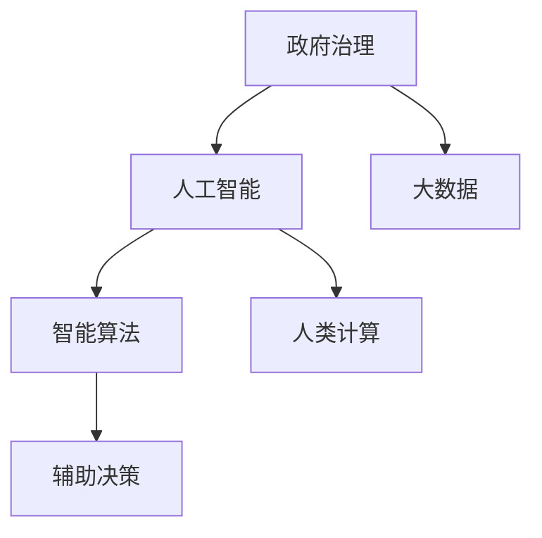

                 

# 人类计算：在AI时代增强政府

> 关键词：政府治理,人工智能,人类计算,公共服务,大数据,智能算法,决策支持

## 1. 背景介绍

### 1.1 问题由来
随着全球信息化的迅猛发展，政府机构面临越来越多的数据和任务挑战。传统人工处理方式效率低下、错误率高，难以满足日益复杂的信息需求。人工智能（AI）技术的引入，为政府治理带来了新的变革机遇。然而，AI技术的发展，并不意味着将彻底取代人类的工作，而是通过“增强”的方式，帮助人类更加高效地完成任务，提升决策质量。

### 1.2 问题核心关键点
人工智能的“增强”作用，主要体现在三个方面：自动化、智能化和辅助决策。其中，自动化是指将重复性、机械性的任务交给AI处理，释放人力资源；智能化是指通过大数据和机器学习算法，提升信息的处理和分析能力；辅助决策则是指利用AI提供的数据支持和智能算法，帮助决策者做出更科学、更优化的决策。

AI的这些优势，为政府治理带来了极大的便利，但也带来了新的挑战：如何确保AI技术的安全、合规、透明，以及如何最大化AI的“增强”作用，避免其成为决策的“黑箱”。

### 1.3 问题研究意义
AI技术的引入，将极大地提升政府治理的效率和质量，降低人力成本，增强决策的科学性和透明度。然而，AI在政府治理中的应用，不仅仅是技术层面的问题，更是一个复杂的社会、法律、伦理问题。如何科学地引入AI技术，确保其在政府治理中的健康发展，是当前亟待解决的重要课题。

## 2. 核心概念与联系

### 2.1 核心概念概述

为更好地理解AI在政府治理中的应用，本节将介绍几个密切相关的核心概念：

- 政府治理（Government Governance）：政府机构通过制定政策、法规，提供公共服务，管理社会事务，确保公共资源的有效配置和使用，实现公共利益最大化的过程。
- 人工智能（Artificial Intelligence）：模拟人类智能行为，使计算机具备学习能力、感知能力、逻辑推理能力等，从而实现对复杂问题的自动处理。
- 大数据（Big Data）：指海量的、多样化的数据资源，包括结构化数据、半结构化数据和非结构化数据，用于揭示数据背后的规律和趋势。
- 智能算法（Intelligent Algorithm）：基于AI技术设计的算法，如机器学习、深度学习、强化学习等，能够自动地从数据中学习规律，进行数据处理和决策支持。
- 辅助决策（Decision Support）：利用AI提供的辅助信息和决策建议，帮助决策者做出更科学、更优化的决策，避免决策偏差和失误。
- 人类计算（Human-Calculations）：在AI处理大量数据和复杂任务的同时，人类通过设计算法和监督AI的运行，参与到整个决策过程中，确保AI技术的可靠性和透明性。

这些核心概念之间的逻辑关系可以通过以下Mermaid流程图来展示：



这个流程图展示了大语言模型的核心概念及其之间的关系：

1. 政府治理通过引入AI和大数据，实现了智能化的决策支持。
2. 智能算法是大数据处理和分析的核心工具。
3. 人类计算通过设计算法和监督AI运行，确保AI的可靠性和透明性。
4. 辅助决策是AI技术在政府治理中的主要应用方向。

这些概念共同构成了AI在政府治理中的应用框架，使其能够在公共服务、社会治理、城市管理等多个场景下发挥强大的智能作用。

## 3. 核心算法原理 & 具体操作步骤
### 3.1 算法原理概述

在AI辅助政府治理的过程中，核心算法主要包括以下几类：

- 自然语言处理（NLP）：用于理解和处理文本数据，如智能客服、舆情分析等。
- 机器学习与深度学习：用于从数据中学习规律，进行分类、回归、聚类等任务，如医疗数据预测、交通流量预测等。
- 强化学习：用于通过与环境互动，优化决策过程，如智能交通信号控制、智慧城市管理等。
- 计算机视觉：用于图像和视频数据的处理和分析，如智能监控、城市规划等。
- 语音识别与合成：用于语音数据的处理和生成，如智能语音助手、电话客服等。

这些算法相互结合，能够实现对各类政府数据的高效处理和分析，从而提升决策的科学性和透明度。

### 3.2 算法步骤详解

AI辅助政府治理的过程，通常包括以下几个关键步骤：

**Step 1: 数据收集与预处理**
- 收集政府业务所需的各种数据，包括公共服务数据、行政数据、地理空间数据等。
- 对数据进行清洗、去重、标注等预处理，确保数据质量和一致性。

**Step 2: 模型训练与优化**
- 选择合适的算法和模型，对数据进行训练。
- 使用交叉验证、调参等方法，优化模型性能，确保模型的泛化能力和稳定性。

**Step 3: 模型部署与应用**
- 将训练好的模型部署到生产环境中，提供服务。
- 结合政府业务场景，进行模型应用优化和调整，确保模型在实际场景中的效果。

**Step 4: 效果评估与反馈**
- 在实际应用中，对模型的效果进行评估和监测。
- 根据反馈结果，不断优化模型和算法，确保模型持续改进。

### 3.3 算法优缺点

AI辅助政府治理的算法，具有以下优点：

1. 高效处理海量数据。AI能够高效处理和分析海量数据，提升决策的科学性和透明度。
2. 自动生成报表和可视化。AI可以自动生成各种报表和可视化图表，帮助决策者更直观地理解数据。
3. 提升决策的精准度。AI能够从数据中学习规律，提供更加精准的决策建议。
4. 实时处理动态变化。AI能够实时处理动态变化的政府数据，确保决策的及时性和准确性。

然而，这些算法也存在一些缺点：

1. 依赖高质量数据。AI的效果很大程度上取决于数据的质量和完整性，数据不足或数据偏差可能导致模型性能下降。
2. 模型可解释性不足。一些复杂算法如深度学习，其决策过程缺乏可解释性，难以理解和调试。
3. 可能存在偏见和歧视。AI模型可能会学习到数据中的偏见，导致决策中的歧视和不公平。
4. 需要大量计算资源。一些复杂算法需要大量的计算资源，增加了政府信息化的成本。

尽管存在这些局限性，但就目前而言，AI在政府治理中的应用，已经成为不可逆转的趋势。未来相关研究的方向在于如何进一步提高AI算法的透明性、公平性和效率，确保其在政府治理中的健康发展。

### 3.4 算法应用领域

AI在政府治理中的应用，已经广泛涉及多个领域：

- **公共服务**：如智能客服、在线申请、电子政务等，通过AI技术提升服务效率和质量。
- **社会治理**：如舆情分析、犯罪预测、反恐预警等，通过AI技术提升社会治理能力。
- **城市管理**：如智能交通、智慧环保、智慧医疗等，通过AI技术提升城市管理水平。
- **应急响应**：如自然灾害预警、公共安全监控、疫情监测等，通过AI技术提升应急响应能力。
- **数据治理**：如数据清洗、数据挖掘、数据可视化等，通过AI技术提升数据治理能力。

除了这些传统领域，AI在政府治理中的应用，还将拓展到更多新的场景，如智慧教育、智慧农业、智慧旅游等，为政府治理带来更多创新。

## 4. 数学模型和公式 & 详细讲解 & 举例说明
### 4.1 数学模型构建

本节将使用数学语言对AI辅助政府治理的算法进行更加严格的刻画。

记政府数据集为 $D=\{x_1, x_2, \ldots, x_N\}$，其中 $x_i$ 表示第 $i$ 条数据，可以是文本、图像、音频等多种形式。目标是对这些数据进行处理和分析，输出决策支持信息。

定义处理函数为 $f(x)$，其映射关系为 $f(x) \rightarrow y$，其中 $y$ 表示输出结果。假设 $f(x)$ 是一个基于神经网络的模型，其参数为 $\theta$，则模型的目标函数可以表示为：

$$
\mathcal{L}(\theta) = \frac{1}{N} \sum_{i=1}^N \ell(f(x_i), y_i)
$$

其中 $\ell$ 为损失函数，用于衡量模型输出与真实标签之间的差异。常见的损失函数包括交叉熵损失、均方误差损失等。

### 4.2 公式推导过程

以智能客服系统为例，展示如何通过神经网络模型进行文本分类和生成：

**Step 1: 数据预处理**
- 将客户咨询文本输入到模型中，进行分词、去停用词等预处理操作。
- 将处理后的文本转化为模型需要的特征向量，如TF-IDF、Word2Vec等。

**Step 2: 模型训练**
- 使用神经网络模型（如LSTM、BERT等）对文本进行分类或生成。
- 通过反向传播算法计算梯度，并更新模型参数 $\theta$，最小化损失函数 $\mathcal{L}(\theta)$。

**Step 3: 模型评估**
- 在测试集上评估模型效果，如准确率、召回率、F1值等。
- 根据评估结果，对模型进行优化调整。

**Step 4: 模型应用**
- 将训练好的模型部署到生产环境中，提供服务。
- 根据实际使用情况，对模型进行实时监控和调优。

### 4.3 案例分析与讲解

以智能交通系统为例，展示如何通过强化学习进行交通信号控制：

**Step 1: 数据收集**
- 收集交通路口的实时数据，如车流量、行人流量、红绿灯状态等。

**Step 2: 模型设计**
- 设计强化学习模型，如Q-Learning、SARSA等，定义状态和动作空间。
- 定义奖励函数，根据交通流量、延迟时间等指标计算奖励。

**Step 3: 模型训练**
- 在模拟环境下进行模型训练，调整模型参数，优化奖励函数。
- 在实际环境中进行模型测试，根据测试结果进行调整优化。

**Step 4: 模型部署**
- 将训练好的模型部署到交通信号控制系统中，进行实时控制。
- 结合实时反馈数据，对模型进行持续优化，提升交通控制效果。

## 5. 项目实践：代码实例和详细解释说明
### 5.1 开发环境搭建

在进行AI辅助政府治理的项目实践前，我们需要准备好开发环境。以下是使用Python进行TensorFlow开发的环境配置流程：

1. 安装Anaconda：从官网下载并安装Anaconda，用于创建独立的Python环境。

2. 创建并激活虚拟环境：
```bash
conda create -n tf-env python=3.8 
conda activate tf-env
```

3. 安装TensorFlow：根据CUDA版本，从官网获取对应的安装命令。例如：
```bash
conda install tensorflow -c pytorch -c conda-forge
```

4. 安装各类工具包：
```bash
pip install numpy pandas scikit-learn matplotlib tqdm jupyter notebook ipython
```

完成上述步骤后，即可在`tf-env`环境中开始项目实践。

### 5.2 源代码详细实现

这里我们以智能交通信号控制为例，给出使用TensorFlow实现模型训练和部署的代码实现。

首先，定义交通信号控制的数据处理函数：

```python
import tensorflow as tf
from tensorflow.keras import layers
import numpy as np

class TrafficSignalController:
    def __init__(self, state_size, action_size):
        self.state_size = state_size
        self.action_size = action_size
        self.model = self.build_model()

    def build_model(self):
        model = tf.keras.Sequential([
            layers.Dense(64, input_dim=self.state_size, activation='relu'),
            layers.Dense(64, activation='relu'),
            layers.Dense(self.action_size, activation='linear')
        ])
        return model

    def act(self, state):
        return self.model.predict(state)[0]
```

然后，定义模型和优化器：

```python
state_size = 6
action_size = 4

controller = TrafficSignalController(state_size, action_size)

optimizer = tf.keras.optimizers.Adam(learning_rate=0.001)
```

接着，定义训练和评估函数：

```python
import tensorflow as tf
from tensorflow.keras import layers

def train_model(model, data, optimizer):
    for epoch in range(100):
        for state, action in data:
            with tf.GradientTape() as tape:
                predicted_action = model.predict(state)
                loss = tf.keras.losses.mse(predicted_action, action)
            gradients = tape.gradient(loss, model.trainable_variables)
            optimizer.apply_gradients(zip(gradients, model.trainable_variables))

def evaluate_model(model, data):
    correct_predictions = 0
    for state, action in data:
        predicted_action = model.predict(state)
        if np.argmax(predicted_action) == np.argmax(action):
            correct_predictions += 1
    return correct_predictions / len(data)
```

最后，启动训练流程并在测试集上评估：

```python
def get_initial_state():
    return np.zeros((1, state_size))

def get_initial_action():
    return np.random.randint(0, action_size)

state = get_initial_state()
action = get_initial_action()

data = []
for i in range(10000):
    new_state = get_initial_state()
    new_action = get_initial_action()
    for j in range(100):
        new_state = new_state[:-1] + new_state[1:]
        new_state[-1] = action
        predicted_action = controller.act(new_state)
        data.append((new_state, predicted_action))
    action = new_action

train_model(controller.model, data, optimizer)

correct_predictions = evaluate_model(controller.model, data)
print(f"Accuracy: {correct_predictions}")
```

以上就是使用TensorFlow实现智能交通信号控制的完整代码实现。可以看到，借助TensorFlow，开发者可以轻松实现模型的训练和部署，并进行效果评估。

### 5.3 代码解读与分析

让我们再详细解读一下关键代码的实现细节：

**TrafficSignalController类**：
- `__init__`方法：初始化状态大小和动作大小，并构建模型。
- `build_model`方法：定义神经网络模型结构。
- `act`方法：接收状态，输出动作预测。

**模型训练函数**：
- 遍历数据集，对每个样本进行前向传播和反向传播，计算损失并更新模型参数。

**模型评估函数**：
- 对数据集进行遍历，计算模型预测动作与真实动作的准确率。

**训练流程**：
- 随机初始化状态和动作。
- 在100个epoch内，循环遍历数据集，更新模型参数。
- 使用测试集评估模型准确率。

可以看到，TensorFlow提供了方便的API和工具，可以轻松实现AI算法的开发和部署。同时，TensorFlow的动态计算图机制，使得开发者可以在训练过程中灵活调整算法和模型，提升效果。

当然，工业级的系统实现还需考虑更多因素，如模型的保存和部署、超参数的自动搜索、更灵活的任务适配层等。但核心的AI算法基本与此类似。

## 6. 实际应用场景
### 6.1 智能客服系统

智能客服系统通过AI技术，可以实现自动分流、自动回复、语音识别和合成等功能。这些功能可以极大地提升客服效率和客户满意度。

**智能分流**：
- 将客户咨询按主题进行分类，分配给不同的客服人员或机器人。
- 通过NLP技术理解客户意图，自动匹配最合适的客服人员。

**自动回复**：
- 使用预训练的语言模型（如GPT-3），对客户问题进行理解和回复。
- 在回复时，通过调用其他API获取相关信息，提高回复的准确性。

**语音识别和合成**：
- 通过语音识别技术，将客户语音转化为文字。
- 使用语音合成技术，将回复转换为语音。

### 6.2 社会治理

AI技术在社会治理中，可以实现舆情监测、犯罪预测、反恐预警等功能。这些功能可以提升政府的社会治理能力和公共安全水平。

**舆情监测**：
- 收集社交媒体上的舆情数据，使用NLP技术进行情感分析和主题分类。
- 实时监测舆情变化，及时处理突发事件。

**犯罪预测**：
- 收集犯罪数据，使用机器学习模型进行预测。
- 根据预测结果，提前部署警力，预防犯罪行为。

**反恐预警**：
- 收集恐怖活动数据，使用机器学习模型进行预测。
- 根据预测结果，及时采取防范措施，防止恐怖袭击。

### 6.3 城市管理

AI技术在城市管理中，可以实现智能交通、智慧环保、智慧医疗等功能。这些功能可以提升城市的管理效率和公共服务质量。

**智能交通**：
- 使用交通信号控制算法，优化交通流量。
- 通过图像识别技术，检测交通违法行为。

**智慧环保**：
- 收集环境数据，使用机器学习模型进行预测。
- 根据预测结果，及时采取环保措施，防止污染事件。

**智慧医疗**：
- 收集医疗数据，使用机器学习模型进行预测。
- 根据预测结果，提供个性化的健康建议。

### 6.4 未来应用展望

随着AI技术的不断进步，未来AI在政府治理中的应用将更加广泛和深入。以下是几个可能的方向：

1. **智慧城市**：通过AI技术，实现城市的智能管理和智能化服务。
2. **智慧农业**：通过AI技术，实现农业的精准管理和智能化决策。
3. **智慧教育**：通过AI技术，实现教育的个性化和智能化。
4. **智慧健康**：通过AI技术，实现健康数据的智能分析和个性化医疗。
5. **智慧交通**：通过AI技术，实现交通的智能化管理和高效调度。
6. **智慧旅游**：通过AI技术，实现旅游资源的智能推荐和智能化服务。

这些方向将为政府治理带来更多的创新和突破，为社会带来更多的便利和福祉。

## 7. 工具和资源推荐
### 7.1 学习资源推荐

为了帮助开发者系统掌握AI辅助政府治理的理论基础和实践技巧，这里推荐一些优质的学习资源：

1. **深度学习入门教程**：由深度学习权威专家Andrew Ng教授主讲的《Deep Learning Specialization》系列课程，涵盖深度学习的基本概念和实践方法。
2. **TensorFlow官方文档**：TensorFlow的官方文档，详细介绍了TensorFlow的使用方法、API接口和最佳实践。
3. **TensorFlow实战指南**：由TensorFlow团队成员编写的实战指南，涵盖TensorFlow的各个应用场景和技术细节。
4. **智能算法论文集**：由IEEE、ACM等权威期刊发布的智能算法论文集，涵盖最新的研究进展和应用案例。
5. **政府信息化白皮书**：由政府信息化权威机构发布的政策文件和技术白皮书，涵盖政府信息化的整体框架和技术路线。

通过对这些资源的学习实践，相信你一定能够快速掌握AI辅助政府治理的精髓，并用于解决实际的政府治理问题。

### 7.2 开发工具推荐

高效的开发离不开优秀的工具支持。以下是几款用于AI辅助政府治理开发的常用工具：

1. **TensorFlow**：由Google主导开发的开源深度学习框架，生产部署方便，适合大规模工程应用。
2. **PyTorch**：由Facebook主导开发的开源深度学习框架，灵活易用，适合快速迭代研究。
3. **Jupyter Notebook**：用于数据科学和机器学习的交互式编程环境，支持Python、R等多种语言。
4. **Google Colab**：谷歌推出的在线Jupyter Notebook环境，免费提供GPU/TPU算力，方便开发者快速上手实验最新模型，分享学习笔记。
5. **Weights & Biases**：模型训练的实验跟踪工具，可以记录和可视化模型训练过程中的各项指标，方便对比和调优。

合理利用这些工具，可以显著提升AI辅助政府治理的开发效率，加快创新迭代的步伐。

### 7.3 相关论文推荐

AI辅助政府治理的研究源于学界的持续研究。以下是几篇奠基性的相关论文，推荐阅读：

1. **深度学习在智能交通中的应用**：介绍深度学习在智能交通信号控制中的应用，提出基于神经网络的交通信号控制算法。
2. **基于机器学习的犯罪预测模型**：提出基于机器学习模型的犯罪预测模型，利用历史犯罪数据进行预测和预警。
3. **AI辅助政府决策模型**：提出基于强化学习的政府决策模型，通过实时反馈优化决策过程。
4. **智能客服系统设计与实现**：介绍智能客服系统的设计与实现方法，涵盖自然语言处理、语音识别和合成等技术。
5. **智慧城市中的AI应用**：介绍智慧城市中的AI应用，涵盖智能交通、智慧环保和智慧医疗等方向。

这些论文代表了大语言模型微调技术的发展脉络。通过学习这些前沿成果，可以帮助研究者把握学科前进方向，激发更多的创新灵感。

## 8. 总结：未来发展趋势与挑战

### 8.1 总结

本文对AI辅助政府治理的算法进行全面系统的介绍。首先阐述了AI技术在政府治理中的应用背景和意义，明确了AI技术的“增强”作用。其次，从原理到实践，详细讲解了AI算法的数学原理和关键步骤，给出了AI项目开发的完整代码实例。同时，本文还广泛探讨了AI技术在政府治理中的广泛应用，展示了AI技术的巨大潜力。

通过本文的系统梳理，可以看到，AI辅助政府治理已经成为一个重要的发展趋势，极大地提升了政府治理的效率和质量。未来，伴随AI技术的不断演进，AI在政府治理中的应用将更加广泛和深入，为政府治理带来更多的创新和突破。

### 8.2 未来发展趋势

展望未来，AI辅助政府治理将呈现以下几个发展趋势：

1. **智能化决策**：AI技术将更加深入地应用于决策支持系统，帮助政府做出更加科学、精准的决策。
2. **实时化处理**：AI技术将实现实时化处理，提升政府治理的及时性和响应速度。
3. **自适应调整**：AI技术将具备自适应调整能力，根据数据变化和政策调整，自动优化模型和算法。
4. **多模态融合**：AI技术将实现多模态融合，结合文本、图像、音频等多种数据形式，提升决策的全面性和准确性。
5. **数据安全保障**：AI技术将加强数据安全保障，确保政府数据的安全性和隐私性。
6. **伦理道德约束**：AI技术将引入伦理道德约束，确保算法的公平性和透明性。

这些趋势将进一步提升AI在政府治理中的作用，推动政府治理向更加智能、高效、透明的方向发展。

### 8.3 面临的挑战

尽管AI辅助政府治理已经取得了一定的成就，但在迈向更加智能化、普适化应用的过程中，仍面临诸多挑战：

1. **数据隐私问题**：政府数据涉及大量个人隐私，如何在数据采集、存储和处理过程中保障隐私，是一个亟待解决的问题。
2. **算法偏见问题**：AI算法可能会学习到数据中的偏见，导致决策中的歧视和不公平。如何消除算法偏见，确保公平性，是一个重要课题。
3. **模型透明性问题**：AI模型的决策过程缺乏可解释性，难以理解和调试。如何提高模型的透明性，确保决策的可解释性和可信度，是一个重要研究方向。
4. **资源限制问题**：AI模型需要大量的计算资源和存储空间，如何在资源有限的情况下，最大化利用资源，是一个重要问题。
5. **技术落地问题**：如何将AI技术高效落地应用，提升政府治理的效果，是一个重要课题。

这些挑战需要政府、企业和学术界共同努力，共同推进AI辅助政府治理的健康发展。

### 8.4 研究展望

面对AI辅助政府治理所面临的挑战，未来的研究需要在以下几个方面寻求新的突破：

1. **数据隐私保护**：研究隐私保护技术，确保政府数据的安全性和隐私性。
2. **算法公平性**：研究算法公平性方法，消除算法中的偏见和歧视，确保决策的公平性。
3. **模型透明性**：研究模型透明性技术，提高模型的可解释性和可信度。
4. **资源优化**：研究资源优化技术，最大化利用计算资源和存储空间，提高AI算法的效率。
5. **技术落地**：研究技术落地方法，提升AI技术在政府治理中的实际应用效果。

这些研究方向将引领AI辅助政府治理技术的不断进步，为政府治理带来更多的创新和突破。相信随着学界和产业界的共同努力，AI辅助政府治理必将实现更加智能化、普适化，为构建智慧政府铺平道路。

## 9. 附录：常见问题与解答

**Q1：AI辅助政府治理是否会取代人工？**

A: AI辅助政府治理的目的是“增强”而不是“取代”。AI技术在处理海量数据和复杂任务时具有优势，但在需要判断、决策和人际沟通的场景下，仍需要人工的参与。AI技术与人工的协同合作，将使政府治理更加高效、透明和公正。

**Q2：AI辅助政府治理的挑战有哪些？**

A: AI辅助政府治理的挑战主要包括数据隐私保护、算法公平性、模型透明性、资源限制和技术落地等。需要政府、企业和学术界共同努力，通过技术创新和管理手段，确保AI技术的健康发展。

**Q3：如何提升AI模型的透明性？**

A: 提升AI模型的透明性，可以通过以下方法实现：
1. 使用可解释性强的模型，如决策树、线性回归等。
2. 设计可解释性强的算法，如LIME、SHAP等。
3. 引入可视化工具，如TensorBoard、ModelScope等，展示模型决策过程。
4. 进行模型调试和优化，确保决策过程可解释、可追溯。

**Q4：AI辅助政府治理的应用场景有哪些？**

A: AI辅助政府治理的应用场景包括智能客服、舆情监测、犯罪预测、交通控制、智慧环保等。通过AI技术，可以实现政府治理的智能化、高效化和透明化。

通过本文的系统梳理，可以看到，AI辅助政府治理已经成为不可逆转的趋势，将在政府治理中发挥越来越重要的作用。相信在政府、企业和学术界的共同努力下，AI辅助政府治理必将实现更加智能化、普适化，为构建智慧政府铺平道路。

