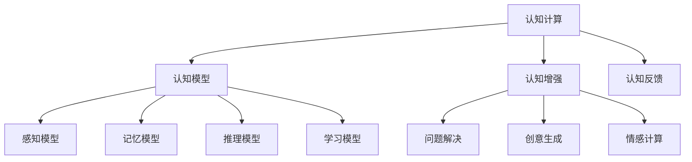

                 

# 人类计算：探索人类认知的新领域

## 1. 背景介绍

### 1.1 问题由来

在数字革命的浪潮中，人类计算已经经历了深刻变革。从算盘和机械计算器到现代电子计算机，计算工具的进步推动了社会的现代化进程。然而，这些计算机虽然在处理数字信息方面展现了强大的能力，但对于复杂的认知任务，如问题解决、创意生成、情感理解和语言交流等，仍显得力不从心。这些问题解决能力对于构建未来的智能系统至关重要，但机器的计算范式难以捕捉人类认知的独特性和多样性。

因此，探索新的计算范式，模拟和扩展人类认知的复杂性，成为当前计算机科学和人工智能领域的热点话题。人类计算的提出，旨在构建一种新的计算范式，能够更好地理解、模拟和扩展人类认知的多样性和复杂性，为解决这些复杂认知问题提供新的视角和方法。

### 1.2 问题核心关键点

人类计算的核心在于探索和模拟人类认知的复杂性和多样性。这涉及到以下关键点：

- **认知建模**：将人类认知过程抽象为计算模型，并探索其结构与机制。
- **认知计算**：设计能够模拟人类认知过程的算法和系统，包括感知、记忆、推理、学习等。
- **认知增强**：利用计算工具辅助提升人类认知能力，如问题解决、创意生成、情感理解等。
- **认知反馈**：构建计算系统与人类之间的双向反馈机制，不断优化和改进认知模型。

这些关键点共同构成了人类计算的理论基础和实践目标。通过理解和模拟人类认知的多样性和复杂性，人类计算有望在智能系统设计和人类认知增强方面实现突破。

## 2. 核心概念与联系

### 2.1 核心概念概述

为了更好地理解人类计算，本节将介绍几个关键概念及其联系：

- **认知计算**：一种计算范式，旨在模拟人类认知过程，如感知、记忆、推理、学习等。与传统的数字计算相比，认知计算更加关注认知过程和模型的内在结构和机制。
- **认知模型**：用于表示和模拟人类认知过程的数学或计算模型。包括感知模型、记忆模型、推理模型、学习模型等。
- **认知增强**：利用计算工具辅助提升人类认知能力。如通过问题解决算法帮助人类快速找到解决方案，通过情感计算技术理解和管理人类情感。
- **认知反馈**：构建计算系统与人类之间的双向反馈机制，优化和改进认知模型。认知反馈机制可以是显性的（如用户界面）或隐性的（如学习算法）。

这些概念之间的逻辑关系可以通过以下Mermaid流程图来展示：



这个流程图展示了几项关键概念及其关系：

1. 认知计算通过构建认知模型，来模拟和理解人类认知过程。
2. 认知模型包括感知、记忆、推理和学习等多个子模型，每个模型用于模拟人类认知的不同方面。
3. 认知增强旨在利用计算工具辅助提升人类认知能力，包括问题解决、创意生成、情感理解等。
4. 认知反馈通过双向通信机制，优化和改进认知模型，使其更贴近人类认知的实际行为。

## 3. 核心算法原理 & 具体操作步骤

### 3.1 算法原理概述

人类计算的算法原理主要围绕认知模型的构建和优化。具体而言，人类计算算法包括以下几个关键步骤：

1. **认知模型构建**：使用数学模型或计算模型，如神经网络、符号推理系统等，构建认知模型的基础框架。
2. **认知模型训练**：利用数据和反馈机制，训练认知模型，使其能够更准确地模拟人类认知过程。
3. **认知模型评估**：通过实验和用户反馈，评估认知模型的性能，识别模型的不足并进行改进。
4. **认知模型应用**：将训练好的认知模型应用到实际问题解决、创意生成、情感理解等任务中，辅助人类进行认知增强。

### 3.2 算法步骤详解

人类计算的核心算法步骤如下：

**Step 1: 认知模型构建**
- 选择或设计合适的认知模型，如神经网络、符号推理系统等。
- 确定模型的结构和参数，包括感知层、记忆层、推理层和学习层等。

**Step 2: 认知模型训练**
- 收集数据，包括任务描述、输入样本、期望输出等。
- 将数据输入模型，进行前向传播和损失计算。
- 反向传播更新模型参数，最小化损失函数。
- 通过验证集评估模型性能，防止过拟合。
- 调整模型参数，优化模型性能。

**Step 3: 认知模型评估**
- 在测试集上评估模型的性能，如准确率、召回率、F1分数等。
- 收集用户反馈，进行主观评估。
- 进行可解释性分析，理解模型的决策过程。
- 识别模型的局限性，确定改进方向。

**Step 4: 认知模型应用**
- 将训练好的模型应用到实际问题解决、创意生成、情感理解等任务中。
- 提供辅助决策建议、生成创意内容、理解人类情感等。
- 通过认知反馈机制，不断优化和改进认知模型。

### 3.3 算法优缺点

人类计算算法具有以下优点：
1. 能够模拟人类认知过程的复杂性和多样性，适用于复杂认知任务。
2. 可以通过认知反馈机制不断优化模型，提高模型性能和可解释性。
3. 有助于理解人类认知的多样性和复杂性，推动认知科学的进步。

同时，该算法也存在一定的局限性：
1. 模型的复杂度较高，训练和优化过程耗时较长。
2. 数据需求量大，难以获取高质量的标注数据。
3. 模型的可解释性不足，难以理解其内部工作机制。
4. 模型的泛化能力有限，对于新问题的适应性较差。

尽管存在这些局限性，但就目前而言，人类计算算法仍是最前沿的认知模拟技术。未来相关研究的重点在于如何进一步降低计算复杂度，提高模型的可解释性和泛化能力，同时兼顾训练效率和数据质量等因素。

### 3.4 算法应用领域

人类计算算法已经在多个领域得到了应用，包括但不限于：

- **问题解决**：构建基于神经网络和符号推理的问题解决系统，辅助人类快速找到解决方案。
- **创意生成**：使用生成模型和符号推理系统，模拟人类创意生成过程，如文学创作、艺术创作等。
- **情感理解**：利用情感计算技术，理解和管理人类情感，如情感分析、情感生成等。
- **语言理解**：构建语言理解模型，辅助人类进行语言交流和信息处理。
- **决策支持**：利用认知计算模型，辅助人类进行复杂决策，如商业决策、医学诊断等。

## 4. 数学模型和公式 & 详细讲解  
### 4.1 数学模型构建

人类计算的核心数学模型包括神经网络模型、符号推理模型、生成模型等。以神经网络为例，其基本结构包括感知层、记忆层、推理层和学习层等。

**神经网络模型**：
- 感知层：接收输入数据，通过激活函数进行特征提取。
- 记忆层：存储提取的特征，通过记忆单元（如神经元）进行信息存储和处理。
- 推理层：对存储的信息进行推理和计算，输出推理结果。
- 学习层：通过反向传播算法更新模型参数，最小化损失函数。

### 4.2 公式推导过程

以一个简单的感知器为例，其数学模型推导如下：

设输入数据 $x=(x_1,x_2,\cdots,x_n)$，权重向量 $w=(w_1,w_2,\cdots,w_n)$，偏置项 $b$，激活函数 $\sigma$。感知器的输出 $y$ 可以表示为：

$$
y = \sigma(w \cdot x + b)
$$

其中，$\sigma$ 为激活函数，常用的激活函数包括 sigmoid、ReLU、tanh 等。感知器的损失函数通常采用均方误差损失函数：

$$
L(y,\hat{y}) = \frac{1}{2} \sum_{i=1}^n (y_i - \hat{y}_i)^2
$$

其中，$y_i$ 为实际输出，$\hat{y}_i$ 为期望输出。

感知器的目标是最小化损失函数 $L(y,\hat{y})$，使用梯度下降算法更新模型参数：

$$
w \leftarrow w - \eta \nabla_w L(y,\hat{y}), \quad b \leftarrow b - \eta \nabla_b L(y,\hat{y})
$$

其中，$\eta$ 为学习率。

### 4.3 案例分析与讲解

以一个简单的分类问题为例，展示人类计算中神经网络模型的应用。

假设我们有一个二分类任务，输入数据 $x=(x_1,x_2)$，输出 $y \in \{0,1\}$。我们构建一个简单的感知器模型，使用 sigmoid 作为激活函数。模型的输入为：

$$
x = \begin{bmatrix} x_1 \\ x_2 \end{bmatrix}
$$

模型的权重向量为 $w = \begin{bmatrix} w_1 \\ w_2 \end{bmatrix}$，偏置项为 $b$。感知器的输出为：

$$
y = \sigma(w \cdot x + b) = \sigma(w_1 x_1 + w_2 x_2 + b)
$$

假设我们有一批训练数据 $(x_1,y_1),(x_2,y_2),\cdots,(x_n,y_n)$，其中 $y_i \in \{0,1\}$。我们的目标是找到一个最优的权重向量 $w^*$ 和偏置项 $b^*$，使得感知器输出 $y$ 尽可能接近真实标签 $y$。

我们将问题转化为求解最小化损失函数：

$$
L(y,\hat{y}) = \frac{1}{2} \sum_{i=1}^n (y_i - \hat{y}_i)^2
$$

通过梯度下降算法，更新模型参数，使得损失函数最小化。最终，我们得到的感知器模型为：

$$
y = \sigma(w^* \cdot x + b^*)
$$

这就是一个简单的二分类感知器模型。在实际应用中，通过不断扩展感知器的结构和参数，可以构建更复杂、更强大的认知模型。

## 5. 项目实践：代码实例和详细解释说明
### 5.1 开发环境搭建

在进行人类计算的实践前，我们需要准备好开发环境。以下是使用Python进行PyTorch开发的环境配置流程：

1. 安装Anaconda：从官网下载并安装Anaconda，用于创建独立的Python环境。

2. 创建并激活虚拟环境：
```bash
conda create -n pytorch-env python=3.8 
conda activate pytorch-env
```

3. 安装PyTorch：根据CUDA版本，从官网获取对应的安装命令。例如：
```bash
conda install pytorch torchvision torchaudio cudatoolkit=11.1 -c pytorch -c conda-forge
```

4. 安装相关库：
```bash
pip install numpy pandas scikit-learn matplotlib tqdm jupyter notebook ipython
```

完成上述步骤后，即可在`pytorch-env`环境中开始实践。

### 5.2 源代码详细实现

这里我们以一个简单的感知器模型为例，展示如何使用PyTorch进行认知计算的实践。

```python
import torch
import torch.nn as nn
import torch.optim as optim

# 定义感知器模型
class Perceptron(nn.Module):
    def __init__(self, input_dim, output_dim):
        super(Perceptron, self).__init__()
        self.linear = nn.Linear(input_dim, output_dim)
        self.sigmoid = nn.Sigmoid()

    def forward(self, x):
        return self.sigmoid(self.linear(x))

# 定义训练函数
def train(model, train_loader, epochs, learning_rate):
    criterion = nn.BCELoss()
    optimizer = optim.SGD(model.parameters(), lr=learning_rate)

    for epoch in range(epochs):
        model.train()
        for batch_idx, (inputs, targets) in enumerate(train_loader):
            optimizer.zero_grad()
            outputs = model(inputs)
            loss = criterion(outputs, targets)
            loss.backward()
            optimizer.step()

# 定义测试函数
def test(model, test_loader):
    model.eval()
    correct = 0
    total = 0

    with torch.no_grad():
        for inputs, targets in test_loader:
            outputs = model(inputs)
            _, predicted = torch.max(outputs.data, 1)
            total += targets.size(0)
            correct += (predicted == targets).sum().item()

    return correct / total
```

在这个例子中，我们首先定义了一个简单的感知器模型 `Perceptron`，包含一个线性层和一个 sigmoid 激活函数。然后，定义了 `train` 和 `test` 函数，用于训练和测试模型。

### 5.3 代码解读与分析

让我们再详细解读一下关键代码的实现细节：

**Perceptron类**：
- `__init__`方法：初始化模型的权重和偏置项，使用 `nn.Linear` 定义线性层，使用 `nn.Sigmoid` 定义激活函数。
- `forward`方法：定义前向传播计算过程，将输入数据通过线性层和激活函数，输出模型预测结果。

**train函数**：
- `criterion`：定义交叉熵损失函数。
- `optimizer`：定义随机梯度下降优化器。
- 在每个epoch内，对训练集进行迭代，更新模型参数。

**test函数**：
- 使用测试集对模型进行评估，计算准确率。

**训练流程**：
- 定义总的epoch数和learning rate，开始循环迭代。
- 每个epoch内，在训练集上进行迭代，更新模型参数。
- 在测试集上评估模型性能，输出准确率。

可以看到，PyTorch提供了强大的工具和API，使得神经网络的实现和训练变得简单易行。开发者只需关注模型构建和算法设计，即可快速搭建和训练认知计算模型。

## 6. 实际应用场景
### 6.1 智能客服系统

基于人类计算的智能客服系统，能够模拟人类客服的认知过程，提供更加自然、智能的客服体验。系统可以理解用户的问题，并根据上下文生成合适的回答。

在技术实现上，可以构建一个基于认知计算的问答系统，使用感知器模型对用户问题进行分类，通过记忆层存储常见问题和答案，利用推理层生成符合上下文的回答。通过不断收集和更新训练数据，系统能够不断提升其问题理解和回答能力。

### 6.2 医疗辅助诊断

人类计算在医疗辅助诊断中具有广泛应用前景。利用认知计算模型，可以辅助医生进行复杂病例的诊断和治疗方案的制定。

具体而言，可以构建一个基于认知计算的诊断系统，使用感知器模型对患者症状进行分类，通过记忆层存储疾病的症状、诊断结果和治疗方法，利用推理层生成诊断报告和治疗建议。系统可以不断学习和更新，提升诊断的准确性和可解释性。

### 6.3 智能创作平台

在内容创作领域，智能创作平台可以利用认知计算技术，辅助人类进行创意生成和作品编辑。系统可以模拟人类创意过程，生成创意文本、图像和视频等。

具体而言，可以使用生成模型和符号推理系统，构建一个基于认知计算的智能创作平台。系统可以分析用户输入的文本、图片等信息，生成符合用户需求的创意作品。通过不断的训练和优化，系统能够不断提升其创意生成能力，满足用户的多样化需求。

## 7. 工具和资源推荐
### 7.1 学习资源推荐

为了帮助开发者系统掌握人类计算的理论基础和实践技巧，这里推荐一些优质的学习资源：

1. 《认知计算基础》系列博文：由认知计算领域的专家撰写，深入浅出地介绍了认知计算的基本概念和前沿研究。

2. 斯坦福大学《认知科学导论》课程：斯坦福大学开设的认知科学入门课程，涵盖认知科学的基本概念和研究方法。

3. 《认知计算与神经网络》书籍：全面介绍了认知计算和神经网络的基本原理和应用。

4. Cognitive Computing Consortium：认知计算领域的权威机构，提供大量的认知计算资源和研究报告。

5. IBM Watson Research：IBM在认知计算领域的最新研究进展，涵盖认知计算在医疗、教育、金融等领域的最新应用。

通过对这些资源的学习实践，相信你一定能够快速掌握认知计算的精髓，并用于解决实际的认知问题。
###  7.2 开发工具推荐

高效的开发离不开优秀的工具支持。以下是几款用于人类计算开发的常用工具：

1. PyTorch：基于Python的开源深度学习框架，灵活动态的计算图，适合快速迭代研究。大部分认知计算模型都有PyTorch版本的实现。

2. TensorFlow：由Google主导开发的开源深度学习框架，生产部署方便，适合大规模工程应用。同样有丰富的认知计算资源。

3. Cognitive Toolkit：IBM开发的认知计算框架，提供了多种认知模型和算法，支持多种编程语言。

4. IBM Watson Studio：IBM提供的认知计算开发平台，集成了多种认知计算工具和资源，便于快速构建和部署认知计算应用。

5. IBM Watson Data Studio：IBM提供的认知数据分析平台，支持大规模数据的处理和分析，提供多种数据可视化工具。

合理利用这些工具，可以显著提升人类计算任务的开发效率，加快创新迭代的步伐。

### 7.3 相关论文推荐

人类计算的发展源于学界的持续研究。以下是几篇奠基性的相关论文，推荐阅读：

1. "Human-Computer Interaction" by B. Shneiderman：介绍了人机交互的基本原理和方法，为人类计算提供了理论基础。

2. "The Era of Machine Learning is Over, The Era of Interpretability is Here" by Y. Bengio：提出了认知计算和可解释性研究的重要性，为人类计算指明了发展方向。

3. "Cognitive Computing in Neurodegenerative Disorders" by M. López-Gil：探讨了认知计算在神经退行性疾病中的应用，展示了认知计算的广泛应用前景。

4. "Towards the Fusion of Cognitive Computing and Cyber-Physical Systems" by H. D. Kai：讨论了认知计算和物理系统的融合，为人类计算在智能系统中的应用提供了新的思路。

这些论文代表了大计算的发展脉络。通过学习这些前沿成果，可以帮助研究者把握学科前进方向，激发更多的创新灵感。

## 8. 总结：未来发展趋势与挑战

### 8.1 总结

本文对人类计算的数学模型、算法原理和实践进行了全面系统的介绍。首先阐述了人类计算的研究背景和意义，明确了认知计算在解决复杂认知任务方面的独特价值。其次，从原理到实践，详细讲解了认知计算的数学模型和算法步骤，给出了认知计算任务开发的完整代码实例。同时，本文还广泛探讨了认知计算在智能客服、医疗辅助、智能创作等多个行业领域的应用前景，展示了认知计算的巨大潜力。此外，本文精选了认知计算技术的各类学习资源，力求为读者提供全方位的技术指引。

通过本文的系统梳理，可以看到，人类计算通过模拟和扩展人类认知的复杂性，有望在智能系统设计和人类认知增强方面实现突破。未来，伴随认知计算技术的发展，认知增强的智能系统将在更多领域大放异彩，深刻影响人类的生产生活方式。

### 8.2 未来发展趋势

展望未来，人类计算技术将呈现以下几个发展趋势：

1. **认知计算的普适化**：认知计算技术将不断拓展到更多领域，如医疗、教育、金融、安全等，成为各行业的通用技术。

2. **认知计算的可解释性**：认知计算模型的可解释性将进一步提升，使得系统决策过程透明、可理解，符合伦理道德要求。

3. **认知计算的多模态融合**：认知计算将更多地融合视觉、听觉、触觉等多模态信息，提升系统的感知和理解能力。

4. **认知计算的泛化能力**：认知计算模型将具备更强的泛化能力，能够适应更多未知和新情境下的认知任务。

5. **认知计算的交互优化**：认知计算系统将更注重人机交互优化，提供更加自然、智能的用户界面，提升用户体验。

6. **认知计算的伦理考量**：认知计算系统将更多地考虑伦理道德问题，确保技术应用符合人类价值观和社会规范。

以上趋势凸显了人类计算技术的广阔前景。这些方向的探索发展，必将进一步提升认知计算系统的性能和应用范围，为构建安全、可靠、可解释、可控的智能系统铺平道路。

### 8.3 面临的挑战

尽管人类计算技术已经取得了瞩目成就，但在迈向更加智能化、普适化应用的过程中，它仍面临着诸多挑战：

1. **认知模型的复杂性**：认知计算模型的复杂度较高，训练和优化过程耗时较长。如何在保证模型性能的同时，降低计算复杂度，是一个重要研究方向。

2. **数据需求的巨大**：认知计算模型需要大量的标注数据进行训练，难以获取高质量的标注数据。如何降低数据需求，提升模型的泛化能力，将是未来的研究重点。

3. **模型的可解释性不足**：认知计算模型的可解释性不足，难以理解其内部工作机制。如何提升模型的可解释性，使得系统决策过程透明、可理解，是一个重要的研究方向。

4. **认知系统的鲁棒性**：认知计算系统在面对复杂和多变的环境时，鲁棒性不足。如何提高系统的鲁棒性，确保系统在各种环境下都能稳定运行，是一个重要的研究方向。

5. **伦理道德问题**：认知计算系统在处理个人数据时，涉及隐私、伦理等问题。如何保护用户隐私，确保技术应用的道德性和合法性，是一个重要的研究方向。

6. **跨领域应用难度**：认知计算系统在跨领域应用时，面临知识整合和转换的困难。如何构建跨领域的认知计算模型，是一个重要的研究方向。

面对这些挑战，未来的研究需要在多个方面进行协同创新，如优化模型结构、改进训练算法、提高数据质量、提升模型可解释性等，才能不断提升人类计算技术的应用效果。

### 8.4 研究展望

面对人类计算所面临的种种挑战，未来的研究需要在以下几个方面寻求新的突破：

1. **认知计算与人工智能的融合**：将认知计算与人工智能技术进行深度融合，提升认知计算系统的智能水平。如将认知计算与深度学习、强化学习等技术结合，构建更强大的认知计算模型。

2. **认知计算与物联网的融合**：将认知计算与物联网技术结合，构建基于物联网的认知计算系统，提升系统的感知和理解能力。

3. **认知计算与生物技术的融合**：将认知计算与生物技术结合，构建基于神经网络的认知计算系统，提升系统的感知和理解能力。

4. **认知计算与社交网络的融合**：将认知计算与社交网络技术结合，构建基于社交网络的认知计算系统，提升系统的交互能力和用户参与度。

5. **认知计算与多模态数据的融合**：将认知计算与多模态数据结合，构建多模态认知计算系统，提升系统的感知和理解能力。

6. **认知计算与伦理道德的融合**：将认知计算与伦理道德问题结合，构建具有伦理道德约束的认知计算系统，确保技术应用符合人类价值观和社会规范。

这些研究方向的探索，必将引领人类计算技术迈向更高的台阶，为构建安全、可靠、可解释、可控的智能系统铺平道路。面向未来，人类计算技术还需要与其他人工智能技术进行更深入的融合，协同发力，共同推动认知科学的进步。

## 9. 附录：常见问题与解答

**Q1：人类计算是否适用于所有认知任务？**

A: 人类计算在大多数认知任务上都能取得不错的效果，特别是对于复杂认知任务。但对于一些特定领域的任务，如医学、法律等，仅仅依靠通用语料预训练的模型可能难以很好地适应。此时需要在特定领域语料上进一步预训练，再进行微调，才能获得理想效果。此外，对于一些需要时效性、个性化很强的任务，如对话、推荐等，人类计算方法也需要针对性的改进优化。

**Q2：人类计算过程中如何选择合适的训练数据？**

A: 人类计算过程中，训练数据的选择至关重要。一般而言，训练数据需要满足以下几个条件：

- **质量高**：训练数据应尽可能准确、完整，避免噪声和偏差。
- **多样性**：训练数据应覆盖认知任务的不同情境和变体，避免模型对特定情境的过拟合。
- **数量足**：训练数据应足够丰富，以确保模型的泛化能力。

选择合适的训练数据，可以帮助人类计算模型更好地学习认知过程，提升模型的性能和泛化能力。

**Q3：人类计算中的多模态融合有哪些难点？**

A: 人类计算中的多模态融合面临以下难点：

- **数据格式不一致**：不同模态的数据格式和特征空间不一致，难以进行统一处理。
- **模态间的信息转换**：不同模态的信息需要相互转换，转换过程中可能会丢失重要信息。
- **多模态融合的算法设计**：多模态融合的算法设计复杂，需要考虑如何有效整合不同模态的信息。

解决这些难点，需要采用多种技术和方法，如特征对齐、信息融合、多模态深度学习等。只有解决好这些问题，才能充分发挥多模态数据的潜力，提升认知计算系统的感知和理解能力。

**Q4：人类计算中的可解释性有哪些重要意义？**

A: 人类计算中的可解释性具有以下重要意义：

- **透明性**：可解释性使得认知计算系统的工作过程透明，便于用户理解和使用。
- **可信性**：可解释性提高了认知计算系统的可信度，确保系统决策过程符合用户期望和伦理规范。
- **可控性**：可解释性使得用户能够掌控认知计算系统，确保系统的行为符合用户价值观和需求。
- **公平性**：可解释性提高了认知计算系统的公平性，避免偏见和歧视，确保系统决策的公正性。

通过提升系统的可解释性，可以有效解决认知计算系统面临的信任和公平性问题，提高系统的可靠性和用户满意度。

**Q5：人类计算中如何优化训练过程？**

A: 人类计算中的训练过程可以通过以下几种方式进行优化：

- **学习率调整**：使用自适应学习率算法（如AdaGrad、Adam等），根据模型性能动态调整学习率。
- **数据增强**：通过数据增强技术（如回译、回音技术等），扩充训练数据集，提高模型的泛化能力。
- **正则化技术**：使用L2正则、Dropout等正则化技术，防止模型过拟合。
- **模型压缩**：通过模型压缩技术（如剪枝、量化等），减小模型规模，提高推理速度。
- **多任务学习**：同时训练多个相关任务，共享模型参数，提高模型泛化能力和效率。

通过优化训练过程，可以有效提高认知计算系统的性能和泛化能力，提升系统的应用效果。

---

作者：禅与计算机程序设计艺术 / Zen and the Art of Computer Programming

