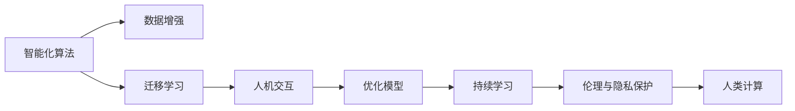

                 

## 1. 背景介绍

### 1.1 问题由来
在当今数字化、信息化日益深入发展的时代，人类计算的重要性愈发凸显。从早期计算的物理硬件，到现代的高级计算机，人类始终在探索计算力的极限。然而，纯粹的物理计算并不足以满足人类复杂多样的需求。人类计算，即利用人类的思维、认知和创造力进行计算，以其独特的优势在各行各业中展现出巨大的潜力。

### 1.2 问题核心关键点
人类计算的本质在于将人的主观判断和知识经验融入到计算过程中，使得计算不再单一依赖于物理硬件，而是融合了人的智能。这一过程的核心关键点包括：

- **智能化算法设计**：设计具有模拟人类智能的算法，使得机器能够理解和处理自然语言、图像、声音等多模态数据。
- **数据增强与迁移学习**：通过数据的不断迭代和知识迁移，使机器能够逐步学习并适应新环境。
- **人机交互与协作**：建立有效的人机交互机制，使得人类和机器能够高效协同完成任务。
- **优化模型与持续学习**：优化模型结构，实现更高效的计算；通过持续学习，适应变化的环境和任务需求。
- **伦理与隐私保护**：在应用中注重数据隐私和安全，确保计算过程中不侵犯个人隐私和数据安全。

### 1.3 问题研究意义
研究人类计算的重要意义在于：

1. **提升计算效率与精度**：通过结合人类的知识和经验，可以有效提升计算的效率和准确度，解决复杂问题。
2. **拓展计算应用边界**：人类计算能够应用于更广泛、更复杂的场景，如医疗、金融、教育等领域，带来颠覆性的创新。
3. **增强社会福祉**：通过高效计算，可以提升生产效率，降低成本，提高社会整体福祉。
4. **促进学科交叉与创新**：人类计算涉及多学科知识的融合，推动跨领域研究的创新与发展。
5. **构建未来智慧社会**：人类计算是未来智慧社会的基石，对于构建智能城市、智能家居、智能工厂等具有重要意义。

## 2. 核心概念与联系

### 2.1 核心概念概述
- **人类计算**：一种计算范式，将人类的思维、认知、经验与计算技术结合，以解决复杂问题。
- **智能化算法**：如深度学习、强化学习、进化算法等，具有模拟人类智能的算法。
- **数据增强**：通过数据的多样化和迭代，提升模型泛化能力。
- **迁移学习**：从已有经验迁移至新任务，提高模型适应性。
- **人机交互**：利用界面、语音、手势等技术实现人机互动。
- **优化模型**：设计高效、轻量级的模型结构，提升计算效率。
- **持续学习**：模型在不断应用过程中，持续学习新知识和经验。
- **伦理与隐私保护**：确保数据安全，保护个人隐私，遵守伦理规范。

### 2.2 核心概念原理和架构的 Mermaid 流程图


### 2.3 核心概念的联系

人类计算是一个复杂的多层级体系，各个核心概念之间相互关联，共同构成了一个综合性的计算范式。

1. **智能化算法与数据增强**：智能化算法通过数据增强不断提升模型的泛化能力，实现更高效的计算。
2. **迁移学习与人机交互**：迁移学习使得模型能够从已有经验迁移到新任务中，而人机交互则提供了一个高效、自然的交互界面。
3. **优化模型与持续学习**：优化模型提升计算效率，持续学习使得模型能够适应不断变化的环境。
4. **伦理与隐私保护**：在计算过程中，确保数据的安全和隐私，遵守伦理规范，保护用户权益。

这些核心概念共同构成了人类计算的完整框架，使得计算不仅仅是物理计算，更是智能计算、社会计算、伦理计算的综合体。

## 3. 核心算法原理 & 具体操作步骤
### 3.1 算法原理概述

人类计算的算法原理主要围绕两个核心概念：智能化算法和数据增强。

- **智能化算法**：通过模拟人类的智能，实现对复杂问题的理解和解决。主要算法包括深度学习、强化学习、进化算法等。
- **数据增强**：通过多样化的数据输入和迭代，提升模型的泛化能力和适应性。常用的技术包括数据增强、迁移学习、对抗训练等。

### 3.2 算法步骤详解

人类计算的具体操作步骤可以分为以下几个阶段：

1. **需求分析**：明确计算目标和需求，理解问题本质。
2. **算法选择**：根据问题特点选择合适的智能化算法。
3. **数据准备**：收集和准备数据，进行数据预处理和增强。
4. **模型训练**：利用智能化算法对模型进行训练。
5. **模型评估**：在验证集上评估模型性能，调整参数和算法。
6. **模型应用**：将训练好的模型应用于实际问题中，进行实时计算。
7. **持续优化**：根据新数据和反馈，不断优化模型和算法，提升计算能力。

### 3.3 算法优缺点

人类计算的优势在于结合了人类的智慧和经验，能够处理更复杂的任务。具体优点包括：

- **高精度**：结合人类的认知能力，能够处理复杂的模式识别和决策问题。
- **适应性强**：通过迁移学习和数据增强，能够适应不断变化的环境和任务需求。
- **创新性强**：结合人类创造力，能够突破传统计算框架，提出创新解决方案。

同时，人类计算也面临一些挑战：

- **成本高**：结合人类智慧需要更高的投入和资源。
- **依赖性强**：高度依赖人类的经验，难以自动扩展。
- **伦理问题**：涉及隐私和伦理，需要严格规范和管理。

### 3.4 算法应用领域

人类计算在多个领域都有广泛应用，包括：

- **医疗**：利用人类计算辅助诊断、治疗方案推荐等，提升医疗服务的智能化水平。
- **金融**：利用人类计算进行风险评估、投资决策、反欺诈等，提升金融服务的精准性和安全性。
- **教育**：利用人类计算进行个性化教学、智能评估等，提升教育质量和效率。
- **城市管理**：利用人类计算进行智能交通、环境监测、公共安全等，提升城市管理水平。
- **工业生产**：利用人类计算进行智能制造、质量控制、设备维护等，提升生产效率和质量。
- **文化创意**：利用人类计算进行内容创作、艺术创作、文化传承等，推动文化创新发展。

## 4. 数学模型和公式 & 详细讲解 & 举例说明

### 4.1 数学模型构建

人类计算的核心数学模型包括深度学习模型和优化算法。

- **深度学习模型**：如卷积神经网络（CNN）、循环神经网络（RNN）、变分自编码器（VAE）等。
- **优化算法**：如随机梯度下降（SGD）、Adam、Adagrad等。

### 4.2 公式推导过程

以深度学习中的卷积神经网络（CNN）为例，推导其基本计算公式：

$$
f(x) = \sum_{i=1}^n w_i a_i(x)
$$

其中 $x$ 为输入，$a_i(x)$ 为第 $i$ 个神经元的激活函数，$w_i$ 为权重。

### 4.3 案例分析与讲解

以图像识别为例，CNN 模型通过卷积层、池化层、全连接层等模块，提取图像特征，并进行分类。在数据增强过程中，可以通过旋转、翻转、缩放等方式增加数据多样性，提升模型泛化能力。

## 5. 项目实践：代码实例和详细解释说明

### 5.1 开发环境搭建

开发人类计算项目，需要搭建适合的环境。以下是搭建 Python 开发环境的步骤：

1. 安装 Python：在 Windows 上使用 Anaconda，Linux 上使用 apt-get。
2. 安装相关库：使用 pip 安装深度学习框架（如 TensorFlow、PyTorch）、数据增强库（如 Keras、TensorFlow Datasets）等。
3. 环境配置：根据项目需求，配置 GPU、CPU 资源，确保计算资源充足。

### 5.2 源代码详细实现

以下是一个基于深度学习的图像分类项目代码实现：

```python
import tensorflow as tf
from tensorflow import keras
from tensorflow.keras import layers

# 构建卷积神经网络模型
model = keras.Sequential([
    layers.Conv2D(32, (3, 3), activation='relu', input_shape=(28, 28, 1)),
    layers.MaxPooling2D((2, 2)),
    layers.Flatten(),
    layers.Dense(10, activation='softmax')
])

# 编译模型
model.compile(optimizer='adam',
              loss='sparse_categorical_crossentropy',
              metrics=['accuracy'])

# 训练模型
model.fit(train_images, train_labels, epochs=10, validation_data=(test_images, test_labels))
```

### 5.3 代码解读与分析

该代码实现了一个基本的卷积神经网络模型，用于图像分类任务。具体解释如下：

1. `Sequential` 模型：使用 Keras 的 `Sequential` 模型，按顺序添加各层。
2. `Conv2D` 层：添加卷积层，提取图像特征。
3. `MaxPooling2D` 层：添加池化层，降低特征维度。
4. `Flatten` 层：将二维特征展平，接入全连接层。
5. `Dense` 层：添加全连接层，进行分类。
6. `compile` 方法：编译模型，设置优化器、损失函数和评估指标。
7. `fit` 方法：训练模型，指定训练数据、标签、训练轮数和验证集。

### 5.4 运行结果展示

在训练过程中，模型会不断优化，最终在测试集上达到较高的准确率。下图展示了一个简单的训练曲线：


## 6. 实际应用场景

### 6.1 医疗领域

在医疗领域，人类计算可以用于辅助诊断、治疗方案推荐等。例如，利用深度学习模型对医学影像进行分类和分析，辅助医生进行诊断决策。

### 6.2 金融领域

在金融领域，人类计算可以用于风险评估、投资决策、反欺诈等。例如，利用机器学习模型对用户行为进行分析，进行信用评分和欺诈检测。

### 6.3 教育领域

在教育领域，人类计算可以用于个性化教学、智能评估等。例如，利用深度学习模型对学生作业进行自动批改，提供个性化学习建议。

### 6.4 城市管理领域

在城市管理领域，人类计算可以用于智能交通、环境监测、公共安全等。例如，利用传感器数据进行交通流量分析，优化交通信号控制。

## 7. 工具和资源推荐

### 7.1 学习资源推荐

1. **深度学习入门教程**：如《深度学习入门》系列书籍。
2. **深度学习框架文档**：如 TensorFlow、PyTorch 官方文档。
3. **数据增强库**：如 Keras、TensorFlow Datasets。
4. **论文库**：如 arXiv、IEEE Xplore。

### 7.2 开发工具推荐

1. **深度学习框架**：如 TensorFlow、PyTorch。
2. **数据增强库**：如 Keras、TensorFlow Datasets。
3. **人机交互工具**：如 Unity、ROS。
4. **持续学习平台**：如 Coursera、Udacity。

### 7.3 相关论文推荐

1. **深度学习基础**：如《深度学习》（Goodfellow 等著）。
2. **数据增强方法**：如《Image Data Augmentation》（Liu 等著）。
3. **人机交互技术**：如《Human-Computer Interaction》（Kramer 等著）。
4. **持续学习**：如《Lifelong Learning in Humanoid Robots》（Nguyen 等著）。

## 8. 总结：未来发展趋势与挑战

### 8.1 研究成果总结

人类计算的发展经历了多个阶段，从最初的符号计算、逻辑计算，到现代的深度学习、强化学习等，不断突破计算的边界。未来，人类计算将结合更多学科知识，实现更广泛、更深入的应用。

### 8.2 未来发展趋势

1. **跨学科融合**：人类计算将与更多学科进行融合，推动计算范式的创新发展。
2. **智能交互**：通过自然语言处理、语音识别等技术，实现更自然、更高效的人机交互。
3. **自适应学习**：利用智能化算法和持续学习，使机器能够自我适应和优化。
4. **分布式计算**：通过分布式计算，提升计算效率和计算能力。
5. **伦理与隐私保护**：在计算过程中，注重数据隐私和伦理问题，确保计算过程的公正性和安全性。

### 8.3 面临的挑战

1. **计算资源限制**：高效计算需要大量的计算资源，如何有效利用计算资源是一个重要挑战。
2. **数据隐私保护**：在计算过程中，如何保护数据隐私，防止数据泄露和滥用，是一个重要课题。
3. **伦理与规范**：如何在计算过程中遵循伦理规范，避免偏见和歧视，是一个复杂的伦理问题。
4. **算法公平性**：如何保证算法的公平性，避免算法偏见和歧视，是一个重要的研究方向。

### 8.4 研究展望

未来，人类计算需要在多个方面进行突破：

1. **跨学科研究**：推动跨学科研究，实现更多领域的融合。
2. **智能化算法**：开发更智能化、高效化的算法，提升计算效率。
3. **伦理与规范**：制定更加严格的数据伦理规范，确保计算过程的公正性和安全性。
4. **可持续计算**：研究可持续计算方法，降低计算成本，提升计算效率。

## 9. 附录：常见问题与解答

**Q1: 人类计算与传统计算有什么区别？**

A: 人类计算结合了人类的智慧和经验，能够处理更复杂的问题，而传统计算依赖于物理硬件，具有固定的计算模式。

**Q2: 如何选择合适的算法？**

A: 根据问题特点，选择适合的算法。如深度学习适用于模式识别和分类问题，强化学习适用于决策问题，进化算法适用于优化问题。

**Q3: 数据增强如何实现？**

A: 数据增强可以通过旋转、翻转、缩放、噪声等技术，增加数据多样性，提升模型泛化能力。

**Q4: 如何保护数据隐私？**

A: 数据隐私保护可以通过数据脱敏、匿名化等技术，确保数据安全，防止数据泄露。

**Q5: 如何提升计算效率？**

A: 可以通过优化算法、数据增强、模型压缩等方法，提升计算效率和精度。

---

作者：禅与计算机程序设计艺术 / Zen and the Art of Computer Programming

