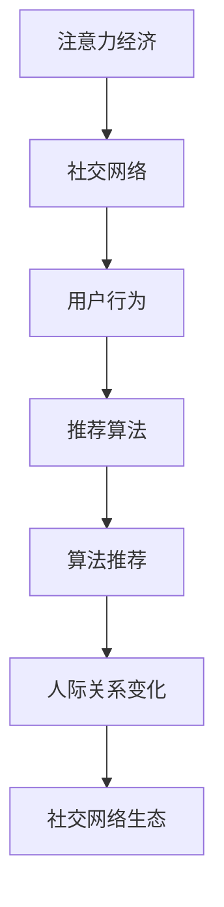

                 

# 人际关系在注意力经济中的变化

> 关键词：注意力经济, 社交网络, 人际关系, 用户行为, 数字时代, 算法推荐

## 1. 背景介绍

### 1.1 问题由来

在数字时代，人类社会进入了一个全新的时代——注意力经济时代。与物质经济的供需关系不同，注意力经济的核心在于争夺用户的注意力，将其转化为商业价值。这一转变不仅体现在商业领域，更深刻影响了人们的社交行为和人际关系。

### 1.2 问题核心关键点

在注意力经济中，人际关系发生了显著变化。社交网络平台成为了人们获取信息和建立关系的重要工具。然而，社交网络的推荐算法也在潜移默化地改变着人们的社交习惯和人际关系。

1. **信息获取方式的变化**：用户更倾向于通过算法推荐获取信息，而不是主动搜索。这导致信息孤岛和回声室效应，人们越来越多地接触到与自己观点相似的信息，削弱了对多元观点的理解。
2. **社交关系的多样化**：社交网络让人们能够轻易连接世界各地的朋友，但同时也导致关系维度的稀释。人们维系深度关系的能力被削弱，广度关系的数量却激增。
3. **隐私与信任的挑战**：为了提供个性化的信息推荐，社交平台收集了大量用户数据。这些数据可能被用于算法训练，导致隐私泄露和信任危机。
4. **社交压力的增加**：算法推荐的“社交泡沫”让人们陷入自我肯定的假象，忽略了真实世界的多样性和复杂性，增加了社交压力。

### 1.3 问题研究意义

研究注意力经济中的人际关系变化，有助于理解社交网络对人类社会的深远影响，并为改进社交网络算法提供理论指导。同时，通过改进算法，可以增强人际关系的深度和质量，构建更加健康和谐的社交网络生态。

## 2. 核心概念与联系

### 2.1 核心概念概述

在注意力经济中，人际关系的变化涉及多个关键概念：

- **注意力经济（Attention Economy）**：指在信息过载的社会中，用户注意力成为稀缺资源，企业通过争夺用户的注意力来创造价值。
- **社交网络（Social Network）**：人们通过在线平台建立连接和交流，构建虚拟社交圈。
- **用户行为（User Behavior）**：用户在社交网络上的行为习惯，如信息获取、互动交流等。
- **推荐算法（Recommendation Algorithms）**：社交平台基于用户行为数据，通过算法推荐个性化的内容和关系。
- **算法推荐（Algorithm Recommendation）**：利用机器学习技术，根据用户历史行为和兴趣，自动推荐相关信息和关系。

### 2.2 核心概念原理和架构的 Mermaid 流程图



该图展示了注意力经济、社交网络、用户行为、推荐算法和人际关系变化之间的逻辑联系。其中，社交网络是信息流动和人际关系建立的媒介；用户行为数据是推荐算法的基础；算法推荐则通过个性化信息推荐影响人际关系的变化；最终，人际关系的变化进一步影响社交网络的生态。

## 3. 核心算法原理 & 具体操作步骤

### 3.1 算法原理概述

社交网络平台的推荐算法主要基于用户行为数据，通过协同过滤、内容推荐、关系推荐等方式，为用户推荐个性化的信息和朋友。这些算法通常由以下步骤构成：

1. **数据采集与预处理**：收集用户的历史行为数据，如浏览记录、点赞、评论等，并对数据进行清洗和预处理。
2. **特征提取**：将用户行为数据转化为算法可处理的特征向量，如用户的兴趣标签、互动时间等。
3. **模型训练与优化**：使用机器学习模型（如协同过滤、矩阵分解等）训练推荐算法，并使用交叉验证、A/B测试等方法优化模型。
4. **信息推荐**：根据训练好的模型，向用户推荐个性化的信息和朋友，不断更新推荐列表。

### 3.2 算法步骤详解

以下以协同过滤算法为例，详细讲解其步骤：

**Step 1: 数据采集与预处理**

收集用户的历史行为数据，如用户对不同内容的浏览记录、点赞、评论等。数据预处理包括去除噪音、填补缺失值、标准化等操作。

**Step 2: 特征提取**

将用户行为数据转化为特征向量。例如，将用户的浏览记录转化为兴趣标签，将互动时间转化为互动频率等。

**Step 3: 模型训练与优化**

使用协同过滤算法（如基于矩阵分解的算法）对用户特征和物品特征进行建模，得到用户兴趣和物品相似度的矩阵。使用交叉验证、A/B测试等方法不断优化模型，提升推荐效果。

**Step 4: 信息推荐**

根据训练好的协同过滤模型，预测用户对每个物品的兴趣程度，按兴趣度排序推荐信息列表。同时，根据用户的互动行为，推荐潜在的社交对象。

### 3.3 算法优缺点

社交网络平台的推荐算法具有以下优点：

1. **个性化推荐**：能够根据用户行为和兴趣，提供个性化的信息推荐，提升用户体验。
2. **高效性**：算法可以快速处理大量数据，实现实时推荐。
3. **数据驱动**：推荐算法依赖用户行为数据，能够持续改进和优化推荐结果。

但同时，这些算法也存在一些缺点：

1. **冷启动问题**：对于新用户，算法无法获取足够的数据进行推荐，导致初期体验较差。
2. **信息孤岛**：由于推荐算法倾向于推荐用户已有兴趣的内容，容易导致信息孤岛效应。
3. **算法偏见**：算法可能受到数据偏差的影响，存在一定的歧视性，对某些群体不公正。
4. **隐私风险**：收集大量用户数据进行推荐，可能带来隐私泄露和数据滥用风险。

### 3.4 算法应用领域

社交网络平台的推荐算法广泛应用于信息获取、社交关系建立和商业营销等多个领域，具体包括：

1. **新闻阅读**：根据用户兴趣推荐新闻内容，提升新闻阅读体验。
2. **商品推荐**：根据用户浏览和购买行为推荐商品，提高电商平台的转化率。
3. **社交推荐**：根据用户互动行为推荐朋友，增强社交网络平台的用户粘性。
4. **视频推荐**：根据用户观看行为推荐视频内容，提高视频平台的观看量。
5. **音乐推荐**：根据用户听歌行为推荐音乐内容，提升音乐平台的活跃度。

## 4. 数学模型和公式 & 详细讲解 & 举例说明

### 4.1 数学模型构建

社交网络平台的推荐算法通常基于协同过滤模型，其数学模型如下：

设用户集合为 $U$，物品集合为 $I$，用户-物品的评分矩阵为 $R \in \mathbb{R}^{m \times n}$，其中 $m$ 为用户数，$n$ 为物品数。推荐算法的目标是最小化损失函数 $L(R')$，其中 $R'$ 为推荐模型预测的评分矩阵。

### 4.2 公式推导过程

协同过滤算法常见的有两种：基于矩阵分解的算法和基于模型的算法。这里以基于矩阵分解的算法为例进行推导。

设用户-物品评分矩阵 $R$ 的奇异值分解为 $R=U\Sigma V^T$，其中 $U \in \mathbb{R}^{m \times r}$ 为用户特征矩阵，$V \in \mathbb{R}^{n \times r}$ 为物品特征矩阵，$\Sigma \in \mathbb{R}^{r \times r}$ 为奇异值矩阵。推荐模型 $R'$ 的预测评分 $R'_{ij} = \sum_{k=1}^r U_{ik} \Sigma_{kk} V_{kj}$。

推荐模型的损失函数 $L(R')$ 通常采用均方误差（MSE）或平均绝对误差（MAE）。设用户 $i$ 的评分向量为 $\hat{R}_i = U_i \Sigma$，物品 $j$ 的评分向量为 $\hat{R}_j = V_j \Sigma$，则推荐模型预测的评分矩阵 $R'$ 为 $R' = \hat{R}_i \hat{R}_j^T$。

### 4.3 案例分析与讲解

假设有一个新闻推荐系统，收集了用户对不同新闻的浏览记录和评分数据。使用基于矩阵分解的协同过滤算法对用户和新闻进行建模，得到用户特征矩阵 $U$ 和新闻特征矩阵 $V$，并通过奇异值分解得到奇异值矩阵 $\Sigma$。用户 $i$ 对新闻 $j$ 的预测评分 $R'_{ij}$ 可通过公式 $R'_{ij} = \sum_{k=1}^r U_{ik} \Sigma_{kk} V_{kj}$ 计算得到。

推荐算法在用户 $i$ 的推荐列表中，选择评分最高的 $k$ 个新闻进行推荐。实际应用中，还可能引入正则化项、激活函数等优化策略。

## 5. 项目实践：代码实例和详细解释说明

### 5.1 开发环境搭建

在开发社交网络平台推荐算法时，需要准备以下开发环境：

1. **Python**：作为主要开发语言，支持Python 3.x版本。
2. **Scikit-learn**：用于数据预处理、特征提取和模型训练。
3. **Numpy**：用于高效数学计算。
4. **Pandas**：用于数据处理和分析。
5. **Jupyter Notebook**：支持交互式开发和结果展示。

以下是在Jupyter Notebook中搭建开发环境的步骤：

```bash
!pip install scikit-learn numpy pandas jupyter
```

### 5.2 源代码详细实现

以下是一个基于协同过滤算法的推荐系统示例代码：

```python
import numpy as np
from sklearn.decomposition import TruncatedSVD
from sklearn.metrics import mean_squared_error

# 生成随机用户-物品评分矩阵
R = np.random.randn(100, 20)

# 使用TruncatedSVD进行矩阵分解
svd = TruncatedSVD(n_components=10)
R_pred = svd.fit_transform(R)

# 计算预测评分与真实评分的误差
mse = mean_squared_error(R, R_pred)

# 输出误差结果
print(f"Mean Squared Error: {mse}")
```

### 5.3 代码解读与分析

**TruncatedSVD类**：用于矩阵分解的sklearn工具包，可以自动选择奇异值分解的维度，并返回分解后的用户特征矩阵和物品特征矩阵。

**mean_squared_error函数**：计算预测评分与真实评分的均方误差。

**代码解释**：首先生成一个随机用户-物品评分矩阵 $R$，然后使用TruncatedSVD对矩阵进行分解，得到用户特征矩阵和物品特征矩阵。最后计算预测评分与真实评分的均方误差，并输出结果。

## 6. 实际应用场景

### 6.1 智能推荐系统

社交网络平台的推荐算法被广泛应用于智能推荐系统中，如电商、视频、音乐等。这些系统通过收集用户的历史行为数据，提供个性化的商品、视频和音乐推荐，提升用户体验和平台活跃度。

### 6.2 社交网络

社交网络平台通过推荐算法，帮助用户发现新朋友和有趣的内容。例如，Facebook、Twitter、微信等社交平台通过推荐朋友和内容，增强用户粘性，提升平台价值。

### 6.3 内容分发平台

内容分发平台如YouTube、Netflix等，通过推荐算法为用户推荐高质量的视频内容，提高平台的留存率和用户满意度。

### 6.4 未来应用展望

未来，社交网络平台的推荐算法将继续深化与人工智能技术的融合，提升推荐精度和个性化程度。同时，随着隐私保护意识的增强，推荐算法将更加注重数据隐私和安全。

## 7. 工具和资源推荐

### 7.1 学习资源推荐

为了深入理解社交网络平台的推荐算法，推荐以下学习资源：

1. **《推荐系统实战》**：详细介绍了推荐系统的原理和实践，包括协同过滤、内容推荐等经典算法。
2. **Coursera《机器学习》**：由斯坦福大学Andrew Ng教授主讲，讲解了机器学习的基本原理和推荐算法。
3. **Kaggle竞赛**：参与Kaggle上的推荐系统竞赛，实战练习推荐算法，提升技能。
4. **GitHub开源项目**：如RecSys、recommender-lib等，提供推荐算法的代码实现和示例。

### 7.2 开发工具推荐

在开发推荐算法时，推荐以下工具：

1. **PyTorch**：灵活的深度学习框架，支持动态图和静态图计算，适合推荐算法的模型训练。
2. **TensorFlow**：强大的深度学习框架，支持大规模分布式训练，适合推荐算法的模型优化。
3. **Scikit-learn**：简单易用的机器学习库，适合推荐算法的特征提取和模型训练。
4. **Numpy**：高效的数值计算库，适合推荐算法的数学计算。
5. **Pandas**：强大的数据处理库，适合推荐算法的数据预处理。

### 7.3 相关论文推荐

社交网络平台的推荐算法是一个活跃的研究领域，以下几篇经典论文推荐阅读：

1. **《The BellKor 2011 PPC Challenge》**：介绍了协同过滤算法的原理和实现，并展示了其在推荐系统中的应用效果。
2. **《Collaborative Filtering for Implicit Feedback Datasets》**：讨论了协同过滤算法在处理稀疏数据时的优化方法。
3. **《Recommender Systems for Large Scale Platforms》**：介绍了大规模推荐系统的架构和实现技术。
4. **《Next It: A Multi-Context Model for Sequential Recommendations》**：提出了多上下文推荐算法，提升推荐精度和用户满意度。

## 8. 总结：未来发展趋势与挑战

### 8.1 研究成果总结

社交网络平台的推荐算法已经在信息获取、社交关系建立和商业营销等多个领域取得了显著效果。然而，随着技术的发展和应用的深入，推荐算法也面临着诸多挑战和问题，需要不断改进和优化。

### 8.2 未来发展趋势

未来的推荐算法将朝着更加个性化、高效化、安全化的方向发展：

1. **个性化推荐**：利用更丰富的用户行为数据和更复杂的模型，提供更加精准的个性化推荐。
2. **高效化推荐**：采用分布式计算、深度学习等技术，实现大规模数据的高效处理和推荐。
3. **安全化推荐**：加强数据隐私保护和算法透明度，构建安全可靠的推荐系统。

### 8.3 面临的挑战

尽管推荐算法取得了巨大进展，但仍面临诸多挑战：

1. **数据稀疏性**：推荐算法对数据稀疏性的处理仍需改进。
2. **模型复杂度**：大规模推荐系统需要处理海量数据，模型复杂度控制是一个重要问题。
3. **算法公平性**：推荐算法需要避免数据偏差，保证推荐结果的公平性。
4. **隐私保护**：推荐算法需要加强数据隐私保护，避免数据滥用。

### 8.4 研究展望

未来的推荐算法研究需要在以下方面进行突破：

1. **深度学习与推荐算法结合**：利用深度学习技术，提升推荐算法的精度和效率。
2. **跨领域推荐**：将推荐算法扩展到多模态数据，如图片、视频等，提升推荐效果。
3. **实时推荐**：实现实时推荐系统，提升用户体验。
4. **推荐算法透明化**：提升推荐算法的透明度和可解释性，增强用户信任。

## 9. 附录：常见问题与解答

**Q1：社交网络平台的推荐算法是否适用于所有类型的推荐场景？**

A: 社交网络平台的推荐算法适用于信息推荐、商品推荐、内容分发等多个场景。然而，对于某些特殊场景，如新闻、图书等，推荐算法需要根据具体需求进行调整。

**Q2：社交网络平台的推荐算法是否具有普遍适用性？**

A: 社交网络平台的推荐算法具有一定程度的普遍适用性，但也需要根据不同平台的特点进行调整。例如，电商平台的推荐算法更注重用户购买行为，而视频平台的推荐算法更注重用户观看行为。

**Q3：推荐算法在推荐过程中是否存在冷启动问题？**

A: 推荐算法在冷启动阶段可能会面临数据不足的问题，导致推荐效果不佳。为了解决冷启动问题，可以采用用户画像、新物品推荐等策略。

**Q4：推荐算法是否会对社交网络平台的生态造成不良影响？**

A: 推荐算法在提升用户体验的同时，也可能带来信息孤岛、算法偏见等不良影响。因此，需要结合内容审核、用户反馈等机制，确保推荐算法的健康发展。

**Q5：推荐算法是否会带来隐私风险？**

A: 推荐算法在数据收集和处理过程中存在隐私风险。为保护用户隐私，推荐算法需要加强数据匿名化和加密技术，确保数据安全。

---

作者：禅与计算机程序设计艺术 / Zen and the Art of Computer Programming

