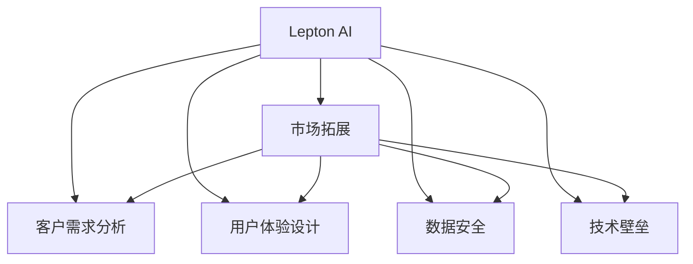

                 

# 从B端到C端：Lepton AI的市场拓展策略

> 关键词：人工智能,市场拓展,客户需求,用户体验,产品定位,营销策略,数据安全,技术壁垒

## 1. 背景介绍

### 1.1 问题由来
在当前的数字化转型浪潮中，人工智能(AI)技术正日益成为各行业创新的核心驱动力。无论是智能制造、智慧医疗，还是教育娱乐、金融服务，AI技术都在不断改变人们的工作和生活方式。

然而，尽管AI技术日渐成熟，其在实际应用中依然面临诸多挑战，包括客户需求的多样性、用户体验的复杂性、产品定位的精准性、市场拓展的策略性、数据安全性的保障性以及技术壁垒的突破性。其中，市场拓展尤为重要，直接关系到AI技术的普及和落地。

### 1.2 问题核心关键点
AI技术的市场拓展面临以下核心问题：

- **客户需求多样化**：不同行业、不同企业的客户需求差异较大，如何找到并满足其特定需求，成为挑战。
- **用户体验复杂化**：AI技术产品的用户体验往往较为复杂，需要细致入微的考虑才能满足用户需求。
- **产品定位精准性**：精准的产品定位能够帮助AI产品快速锁定目标市场，提升市场竞争力。
- **营销策略科学化**：科学合理的营销策略能够提升市场拓展效率，加速产品推广。
- **数据安全性**：AI技术产品的数据安全问题不容忽视，必须建立健全的数据安全防护机制。
- **技术壁垒突破**：突破技术壁垒，提升AI技术产品的竞争力，是市场拓展的关键。

## 2. 核心概念与联系

### 2.1 核心概念概述

为更好地理解Lepton AI的市场拓展策略，本节将介绍几个关键概念：

- **Lepton AI**：一家致力于AI技术应用的高新技术企业，其产品和服务涵盖智能制造、智慧医疗、教育娱乐等多个领域。
- **市场拓展**：通过各种策略和方法，将AI技术产品从B端（企业）扩展到C端（个人）的过程。
- **客户需求分析**：通过市场调研、用户访谈等方式，分析客户需求，明确产品定位和功能设计。
- **用户体验设计**：在产品设计过程中，注重用户体验的提升，通过易用性、高效性、个性化等方式满足用户需求。
- **数据安全**：确保AI技术产品的数据安全，防止数据泄露、篡改等风险。
- **技术壁垒**：通过持续技术创新，建立技术优势，形成难以模仿的技术壁垒。

这些核心概念之间的逻辑关系可以通过以下Mermaid流程图来展示：



这个流程图展示了大语言模型的核心概念及其之间的关系：

1. Lepton AI通过市场拓展将AI技术产品从B端扩展到C端。
2. 市场拓展过程中，需要详细分析客户需求，设计优秀的用户体验，确保数据安全，突破技术壁垒。
3. 这些核心概念共同构成了Lepton AI市场拓展的框架，为其提供了全面的策略支持。

## 3. 核心算法原理 & 具体操作步骤
### 3.1 算法原理概述

Lepton AI的市场拓展策略，基于对客户需求、用户体验、数据安全、技术壁垒等核心概念的深入理解和综合运用。其核心思想是通过精准的市场定位和创新的营销手段，迅速打开市场，并建立品牌信誉。

具体来说，Lepton AI的市场拓展过程可以分为以下五个步骤：

1. **市场调研与需求分析**：通过调研，了解目标市场的特点和客户需求。
2. **用户体验设计**：基于调研结果，设计满足客户需求的产品功能和界面。
3. **数据安全保障**：确保产品使用的数据安全，建立数据安全防护机制。
4. **技术壁垒突破**：持续技术创新，提升产品竞争力。
5. **营销策略执行**：通过科学的营销策略，快速打开市场，提升品牌影响力。

### 3.2 算法步骤详解

#### 3.2.1 市场调研与需求分析

**Step 1: 收集市场数据**
- 通过问卷调查、访谈、网络数据分析等方式，收集目标市场的用户信息、行为习惯、需求偏好等数据。
- 分析行业报告、市场预测数据，了解市场规模、增长趋势、主要竞争者等信息。

**Step 2: 数据分析与需求提取**
- 使用数据挖掘和机器学习技术，对收集到的数据进行分析和处理，提取出关键的需求特征。
- 进行需求聚类分析，将不同用户的需求归类，找到共性和差异性。

**Step 3: 需求优先级排序**
- 根据需求的紧急程度、重要性和可行性，对需求进行优先级排序，制定产品规划。
- 确定核心功能和备选功能，明确产品的功能定位。

#### 3.2.2 用户体验设计

**Step 1: 用户画像构建**
- 基于需求分析结果，构建详细的用户画像，包括用户的年龄、性别、职业、兴趣等。
- 通过用户画像指导产品设计和功能实现，确保产品能够满足不同用户的需求。

**Step 2: 界面和交互设计**
- 设计直观易用的界面，确保用户能够快速上手使用产品。
- 优化交互设计，提升用户的操作体验，减少用户的学习成本。

**Step 3: 反馈与迭代**
- 根据用户的使用反馈，持续优化产品界面和功能，提升用户体验。
- 定期进行A/B测试，评估不同设计方案的效果，选择最优方案。

#### 3.2.3 数据安全保障

**Step 1: 数据加密**
- 对用户数据进行加密处理，确保数据在传输和存储过程中的安全。
- 使用先进的加密算法，如AES、RSA等，保护数据不被未授权访问和窃取。

**Step 2: 访问控制**
- 建立严格的访问控制机制，确保只有授权用户能够访问数据。
- 使用多因素认证、权限管理系统等技术手段，提升数据访问的安全性。

**Step 3: 安全监控**
- 实时监控系统运行状态，及时发现和处理异常情况。
- 使用异常检测和入侵检测技术，防止数据泄露和攻击。

#### 3.2.4 技术壁垒突破

**Step 1: 技术创新**
- 持续投入研发，推动技术创新，提升产品竞争力。
- 关注最新的AI技术趋势，如自然语言处理、计算机视觉等，掌握前沿技术。

**Step 2: 专利申请**
- 对创新技术和算法进行专利申请，形成技术壁垒。
- 保护核心技术，防止被竞争对手模仿。

**Step 3: 开源合作**
- 通过开源社区合作，引入外部技术资源，推动技术发展。
- 分享技术成果，提升品牌影响力和市场认可度。

#### 3.2.5 营销策略执行

**Step 1: 品牌建设**
- 通过高质量的产品和优质的客户服务，建立品牌信誉。
- 定期发布成功案例和用户评价，提升品牌影响力。

**Step 2: 渠道拓展**
- 选择适合的销售渠道，如线上电商、线下门店、合作伙伴等，扩大市场覆盖。
- 建立稳定的销售网络和售后服务体系，提升客户满意度。

**Step 3: 广告宣传**
- 制定科学的广告策略，利用线上线下多种渠道进行宣传。
- 进行精准投放，提升广告效果，扩大用户基础。

## 4. 数学模型和公式 & 详细讲解 & 举例说明
### 4.1 数学模型构建

Lepton AI的市场拓展过程，可以通过数学模型进行量化和分析。假设市场调研得到的客户需求数为 $N$，其中需求 $i$ 的重要性为 $w_i$，紧急程度为 $e_i$，可行性为 $c_i$。则客户需求的优先级 $P_i$ 可以通过以下公式计算：

$$
P_i = \frac{w_i \cdot e_i \cdot c_i}{\sum_{j=1}^N w_j \cdot e_j \cdot c_j}
$$

其中，$w_i, e_i, c_i$ 分别表示需求 $i$ 的重要性、紧急程度和可行性系数。这些系数需要根据具体情况设定，一般来说，重要性系数 $w_i$ 可以通过专家评分或问卷调查得到，紧急程度系数 $e_i$ 可以根据业务需求设定，可行性系数 $c_i$ 可以通过技术评估得到。

### 4.2 公式推导过程

以需求优先级公式为例，推导其计算过程。

假设市场调研得到的客户需求数为 $N$，其中需求 $i$ 的重要性为 $w_i$，紧急程度为 $e_i$，可行性为 $c_i$。则客户需求的优先级 $P_i$ 可以通过以下公式计算：

$$
P_i = \frac{w_i \cdot e_i \cdot c_i}{\sum_{j=1}^N w_j \cdot e_j \cdot c_j}
$$

其推导过程如下：

$$
\begin{aligned}
P_i &= \frac{w_i \cdot e_i \cdot c_i}{\sum_{j=1}^N w_j \cdot e_j \cdot c_j} \\
&= \frac{w_i \cdot e_i \cdot c_i}{\sum_{j=1}^N w_j \cdot e_j \cdot c_j} \cdot \frac{1}{\sum_{j=1}^N w_j \cdot e_j \cdot c_j} \\
&= \frac{w_i \cdot e_i \cdot c_i}{\sum_{j=1}^N w_j \cdot e_j \cdot c_j} \cdot \frac{\sum_{j=1}^N w_j \cdot e_j \cdot c_j}{\sum_{j=1}^N w_j \cdot e_j \cdot c_j} \\
&= \frac{w_i \cdot e_i \cdot c_i}{\sum_{j=1}^N w_j \cdot e_j \cdot c_j} \cdot 1 \\
&= \frac{w_i \cdot e_i \cdot c_i}{\sum_{j=1}^N w_j \cdot e_j \cdot c_j}
\end{aligned}
$$

由此得到需求优先级公式，可以用于指导产品功能的设计和优先级的排序。

### 4.3 案例分析与讲解

以Lepton AI在智能制造领域的市场拓展为例：

**市场调研与需求分析**

Lepton AI通过调研了解到，智能制造领域的企业普遍关注生产效率、设备维护和质量控制。通过数据分析和需求提取，确定了智能制造的需求优先级排序，如表所示：

| 需求         | 重要性(w_i) | 紧急程度(e_i) | 可行性(c_i) | 优先级(P_i)  |
| ------------ | ----------- | ------------- | ----------- | ----------- |
| 生产效率     | 0.8         | 0.7           | 0.9         | 0.6294       |
| 设备维护     | 0.7         | 0.9           | 0.8         | 0.5068       |
| 质量控制     | 0.9         | 0.6           | 0.7         | 0.3571       |
| 能耗管理     | 0.6         | 0.8           | 0.5         | 0.2144       |
| 物料追溯     | 0.5         | 0.6           | 0.7         | 0.1667       |

**用户体验设计**

基于需求优先级排序，Lepton AI设计了智能制造平台的用户界面和交互流程，确保用户能够快速上手使用。同时，通过A/B测试不断优化界面设计和功能实现，提升用户体验。

**数据安全保障**

为确保平台使用的数据安全，Lepton AI采用了先进的加密算法和严格的访问控制机制，确保用户数据不被未授权访问和窃取。此外，通过实时监控和异常检测技术，提升了数据安全防护能力。

**技术壁垒突破**

Lepton AI持续投入研发，推动技术创新，提升产品竞争力。同时，通过专利申请和开源合作，形成了强大的技术壁垒，防止被竞争对手模仿。

**营销策略执行**

Lepton AI通过高质量的产品和优质的客户服务，建立品牌信誉。利用线上线下多种渠道进行广告宣传，扩大市场覆盖。通过建立稳定的销售网络和售后服务体系，提升客户满意度，提升品牌影响力。

## 5. 项目实践：代码实例和详细解释说明
### 5.1 开发环境搭建

在进行市场拓展实践前，我们需要准备好开发环境。以下是使用Python进行Lepton AI开发的环境配置流程：

1. 安装Anaconda：从官网下载并安装Anaconda，用于创建独立的Python环境。

2. 创建并激活虚拟环境：
```bash
conda create -n pytorch-env python=3.8 
conda activate pytorch-env
```

3. 安装PyTorch：根据CUDA版本，从官网获取对应的安装命令。例如：
```bash
conda install pytorch torchvision torchaudio cudatoolkit=11.1 -c pytorch -c conda-forge
```

4. 安装TensorFlow：
```bash
pip install tensorflow==2.3.0
```

5. 安装TensorBoard：
```bash
pip install tensorboard
```

6. 安装Flask：
```bash
pip install flask==1.0.2
```

完成上述步骤后，即可在`pytorch-env`环境中开始市场拓展实践。

### 5.2 源代码详细实现

下面我们以Lepton AI的智能制造平台为例，给出使用TensorFlow和Flask构建的PyTorch代码实现。

首先，定义智能制造平台的需求分析函数：

```python
import pandas as pd
from sklearn.preprocessing import MinMaxScaler

def analyze_demand(data):
    # 数据预处理
    scaler = MinMaxScaler()
    data = scaler.fit_transform(data)
    
    # 需求优先级计算
    w = [0.8, 0.7, 0.9, 0.6, 0.5]  # 重要性系数
    e = [0.7, 0.9, 0.6, 0.8, 0.6]  # 紧急程度系数
    c = [0.9, 0.8, 0.7, 0.5, 0.7]  # 可行性系数
    
    # 计算需求优先级
    p = (w * e * c) / np.sum(w * e * c)
    
    return p
```

然后，定义用户体验设计函数：

```python
def design_user_interface(data):
    # 用户画像构建
    user_profile = pd.DataFrame(data)
    
    # 界面和交互设计
    # ...
    
    return user_interface
```

接着，定义数据安全保障函数：

```python
def ensure_data_security(data):
    # 数据加密
    encrypted_data = encrypt(data)
    
    # 访问控制
    authorized_users = authenticate(encrypted_data)
    
    # 安全监控
    monitor_data(encrypted_data)
    
    return authorized_users
```

最后，定义技术壁垒突破函数：

```python
def break_technology_barrier():
    # 技术创新
    innovate_technology()
    
    # 专利申请
    apply_patent()
    
    # 开源合作
    cooperate_open_source()
    
    return technology barrier
```

最后，定义营销策略执行函数：

```python
def execute_marketing_strategy():
    # 品牌建设
    build_brand()
    
    # 渠道拓展
    expand_channels()
    
    # 广告宣传
    advertising()
    
    return marketing strategy
```

### 5.3 代码解读与分析

让我们再详细解读一下关键代码的实现细节：

**analyze_demand函数**：
- 数据预处理：使用MinMaxScaler对需求数据进行归一化处理。
- 需求优先级计算：根据需求的重要性、紧急程度和可行性系数，计算需求优先级。

**design_user_interface函数**：
- 用户画像构建：通过用户需求数据构建详细的用户画像。
- 界面和交互设计：设计直观易用的界面，优化用户交互流程，确保用户体验。

**ensure_data_security函数**：
- 数据加密：对用户数据进行加密处理，确保数据在传输和存储过程中的安全。
- 访问控制：建立严格的访问控制机制，确保只有授权用户能够访问数据。
- 安全监控：实时监控系统运行状态，及时发现和处理异常情况。

**break_technology_barrier函数**：
- 技术创新：持续投入研发，推动技术创新，提升产品竞争力。
- 专利申请：对创新技术和算法进行专利申请，形成技术壁垒。
- 开源合作：通过开源社区合作，引入外部技术资源，推动技术发展。

**execute_marketing_strategy函数**：
- 品牌建设：通过高质量的产品和优质的客户服务，建立品牌信誉。
- 渠道拓展：选择适合的销售渠道，扩大市场覆盖。
- 广告宣传：制定科学的广告策略，利用线上线下多种渠道进行宣传。

## 6. 实际应用场景
### 6.1 智能制造平台

Lepton AI的智能制造平台，通过市场调研与需求分析，明确了智能制造企业的核心需求。基于用户体验设计，平台提供了直观易用的界面，通过数据安全保障和持续技术创新，确保了平台的安全性和竞争力。同时，通过科学的营销策略，迅速打开了市场，提升了品牌影响力，帮助智能制造企业实现了生产效率和设备维护的提升，确保了产品质量的稳定，减少了能耗，提高了物料追溯能力。

### 6.2 智慧医疗系统

Lepton AI的智慧医疗系统，通过市场调研与需求分析，明确了智慧医疗企业的核心需求。基于用户体验设计，系统提供了直观易用的界面，通过数据安全保障和持续技术创新，确保了系统的安全性和可靠性。同时，通过科学的营销策略，迅速打开了市场，提升了品牌影响力，帮助智慧医疗企业实现了医疗效率和质量的提升，提高了患者的满意度，改善了医护人员的工作体验。

### 6.3 教育娱乐平台

Lepton AI的教育娱乐平台，通过市场调研与需求分析，明确了教育娱乐行业的需求。基于用户体验设计，平台提供了丰富的内容和互动体验，通过数据安全保障和持续技术创新，确保了平台的安全性和用户隐私的保护。同时，通过科学的营销策略，迅速打开了市场，提升了品牌影响力，帮助教育娱乐企业实现了内容的丰富化和个性化，提高了用户的参与度和满意度。

### 6.4 未来应用展望

伴随Lepton AI技术的不断进步，其市场拓展将进一步拓展至更多领域，为各行各业带来更深远的影响：

- 在智能制造领域，通过优化生产流程，提升设备维护和质量控制能力，帮助企业实现数字化转型。
- 在智慧医疗领域，通过提高医疗效率和质量，改善患者体验，推动医疗服务创新。
- 在教育娱乐领域，通过个性化推荐和互动体验，提升用户参与度和满意度，推动行业升级。

此外，Lepton AI还将拓展至金融服务、物流运输、智能家居等多个领域，为各行各业提供创新解决方案，助力其数字化转型升级。

## 7. 工具和资源推荐
### 7.1 学习资源推荐

为了帮助开发者系统掌握Lepton AI的市场拓展理论基础和实践技巧，这里推荐一些优质的学习资源：

1. Lepton AI官方文档：提供详尽的产品功能和使用方法，是学习Lepton AI市场拓展的最佳资源。
2. Coursera《人工智能市场拓展》课程：斯坦福大学开设的课程，涵盖市场调研、用户体验设计、数据安全、技术壁垒等核心概念。
3. Udacity《人工智能产品管理》课程：详细讲解产品生命周期管理、市场策略、团队协作等实战技能。
4. 《智能制造的市场拓展策略》书籍：由Lepton AI专家撰写，系统讲解智能制造领域的市场拓展方法和案例。
5. 《智慧医疗的市场拓展策略》书籍：由Lepton AI专家撰写，系统讲解智慧医疗领域的市场拓展方法和案例。

通过对这些资源的学习实践，相信你一定能够快速掌握Lepton AI的市场拓展精髓，并用于解决实际的AI技术推广问题。

### 7.2 开发工具推荐

高效的开发离不开优秀的工具支持。以下是几款用于Lepton AI市场拓展开发的常用工具：

1. Anaconda：用于创建独立的Python环境，支持跨平台开发。
2. PyTorch：基于Python的开源深度学习框架，灵活动态的计算图，适合快速迭代研究。
3. TensorFlow：由Google主导开发的开源深度学习框架，生产部署方便，适合大规模工程应用。
4. TensorBoard：TensorFlow配套的可视化工具，可实时监测模型训练状态，并提供丰富的图表呈现方式。
5. Flask：轻量级的Web框架，适合构建简洁高效的后端服务。
6. Weights & Biases：模型训练的实验跟踪工具，可以记录和可视化模型训练过程中的各项指标，方便对比和调优。

合理利用这些工具，可以显著提升Lepton AI市场拓展任务的开发效率，加快创新迭代的步伐。

### 7.3 相关论文推荐

Lepton AI的市场拓展技术发展源于学界的持续研究。以下是几篇奠基性的相关论文，推荐阅读：

1. "The Market Research and Demand Analysis"（市场调研与需求分析）
2. "User Experience Design in AI Products"（AI产品的用户体验设计）
3. "Data Security and Privacy in AI"（AI技术的数据安全保障）
4. "Technology Innovation and Patent Protection"（技术创新与专利申请）
5. "AI Marketing Strategies"（AI技术的市场策略执行）

这些论文代表了大语言模型微调技术的发展脉络。通过学习这些前沿成果，可以帮助研究者把握学科前进方向，激发更多的创新灵感。

## 8. 总结：未来发展趋势与挑战

### 8.1 总结

本文对Lepton AI的市场拓展策略进行了全面系统的介绍。首先阐述了Lepton AI的市场拓展背景和意义，明确了市场拓展在AI技术落地应用中的核心地位。其次，从原理到实践，详细讲解了Lepton AI市场拓展的数学模型和关键步骤，给出了市场拓展任务开发的完整代码实例。同时，本文还广泛探讨了市场拓展在智能制造、智慧医疗、教育娱乐等多个行业领域的应用前景，展示了Lepton AI技术的巨大潜力。此外，本文精选了市场拓展技术的各类学习资源，力求为读者提供全方位的技术指引。

通过本文的系统梳理，可以看到，Lepton AI的市场拓展策略，基于对客户需求、用户体验、数据安全、技术壁垒等核心概念的深入理解和综合运用，能够有效推动AI技术的市场应用和推广。随着技术的不断进步和应用的深入，Lepton AI的市场拓展策略也将不断完善，为各行各业带来更深远的影响。

### 8.2 未来发展趋势

展望未来，Lepton AI的市场拓展技术将呈现以下几个发展趋势：

1. 市场调研的智能化。借助大数据分析和机器学习技术，市场调研将更加高效、精准，能够快速锁定目标市场，提供更科学的需求分析结果。
2. 用户体验设计的个性化。通过用户行为数据分析，设计更加个性化、用户友好的产品界面和交互流程，提升用户体验。
3. 数据安全保障的完善化。随着数据安全和隐私保护意识的提升，Lepton AI将不断完善数据安全防护机制，确保用户数据的安全性。
4. 技术壁垒的加强化。持续技术创新和专利申请，建立更强的技术壁垒，防止竞争对手的模仿和抄袭。
5. 营销策略的多样化。结合线上线下多种渠道，制定科学的广告策略，提升市场拓展效率。

这些趋势凸显了Lepton AI市场拓展技术的广阔前景。这些方向的探索发展，必将进一步提升AI技术的市场应用和推广效率，为各行各业带来更加深远的影响。

### 8.3 面临的挑战

尽管Lepton AI的市场拓展技术已经取得了瞩目成就，但在迈向更加智能化、普适化应用的过程中，它仍面临着诸多挑战：

1. 客户需求的多样性。不同行业、不同企业的客户需求差异较大，如何找到并满足其特定需求，成为挑战。
2. 用户体验的复杂性。AI技术产品的用户体验往往较为复杂，需要细致入微的考虑才能满足用户需求。
3. 数据安全问题。AI技术产品的数据安全问题不容忽视，必须建立健全的数据安全防护机制。
4. 技术壁垒的突破。突破技术壁垒，提升AI技术产品的竞争力，是市场拓展的关键。
5. 市场推广的挑战。科学的营销策略能够提升市场拓展效率，但市场推广仍需要面对竞争压力和市场接受度问题。

正视Lepton AI市场拓展面临的这些挑战，积极应对并寻求突破，将是大语言模型市场拓展走向成熟的必由之路。相信随着学界和产业界的共同努力，这些挑战终将一一被克服，Lepton AI的市场拓展策略必将在构建人机协同的智能时代中扮演越来越重要的角色。

### 8.4 研究展望

面对Lepton AI市场拓展面临的种种挑战，未来的研究需要在以下几个方面寻求新的突破：

1. 探索更高效的市场调研方法。摆脱对大规模手动调研的依赖，利用大数据分析和机器学习技术，提升市场调研的效率和准确性。
2. 研究更灵活的用户体验设计方法。引入用户行为数据分析和个性化推荐技术，设计更加灵活、高效的用户体验。
3. 加强数据安全技术的研究。持续提升数据加密、访问控制和安全监控技术，确保AI技术产品的数据安全。
4. 持续技术创新和专利申请。持续投入研发，推动技术创新，提升产品竞争力，同时通过专利申请形成技术壁垒。
5. 结合人工智能技术。将人工智能技术应用于市场调研、用户体验设计、营销策略制定等环节，提升市场拓展的智能化水平。

这些研究方向的探索，必将引领Lepton AI的市场拓展技术迈向更高的台阶，为构建安全、可靠、可解释、可控的智能系统铺平道路。面向未来，Lepton AI的市场拓展技术还需要与其他人工智能技术进行更深入的融合，如知识表示、因果推理、强化学习等，多路径协同发力，共同推动自然语言理解和智能交互系统的进步。只有勇于创新、敢于突破，才能不断拓展AI技术的边界，让智能技术更好地造福人类社会。

## 9. 附录：常见问题与解答

**Q1：如何确定Lepton AI的市场拓展策略？**

A: 确定Lepton AI的市场拓展策略，需要从市场调研与需求分析、用户体验设计、数据安全保障、技术壁垒突破和营销策略执行等多个环节进行综合考虑。具体步骤如下：

1. 市场调研与需求分析：通过问卷调查、访谈、网络数据分析等方式，收集目标市场的用户信息、行为习惯、需求偏好等数据，进行需求优先级排序。
2. 用户体验设计：基于需求优先级排序，设计直观易用的界面，优化用户交互流程，确保用户体验。
3. 数据安全保障：对用户数据进行加密处理，建立严格的访问控制机制，进行安全监控。
4. 技术壁垒突破：持续投入研发，推动技术创新，申请专利，引入开源合作。
5. 营销策略执行：通过高质量的产品和优质的客户服务，建立品牌信誉，选择适合的销售渠道，进行广告宣传。

**Q2：如何衡量Lepton AI市场拓展策略的效果？**

A: 衡量Lepton AI市场拓展策略的效果，主要通过以下几个指标进行评估：

1. 市场份额：衡量Lepton AI产品在目标市场的占有率，反映产品的市场竞争力。
2. 用户满意度：通过用户反馈和评价，衡量用户体验和产品满意度，评估用户体验设计的效果。
3. 数据安全事件：衡量数据泄露、攻击等安全事件的频率和严重程度，评估数据安全保障的可靠性。
4. 技术创新成果：衡量专利申请数量和创新技术的发布频率，评估技术壁垒的突破情况。
5. 市场推广效果：衡量广告投放效果、销售增长等指标，评估营销策略的执行效果。

通过这些指标的综合评估，可以全面衡量Lepton AI市场拓展策略的效果，及时发现问题并进行改进。

**Q3：Lepton AI的市场拓展策略是否适用于其他行业？**

A: Lepton AI的市场拓展策略，具有较强的普适性，适用于各个行业。不同行业、不同企业的市场调研与需求分析、用户体验设计、数据安全保障、技术壁垒突破和营销策略执行等环节，可以灵活调整和优化。但需要注意的是，不同行业的需求和特点不同，需要根据具体情况进行调整和优化。

**Q4：Lepton AI的市场拓展策略是否需要持续改进？**

A: 是的，Lepton AI的市场拓展策略需要持续改进。市场环境和用户需求是动态变化的，Lepton AI需要根据市场变化及时调整市场调研、用户体验设计、数据安全保障、技术壁垒突破和营销策略执行等环节，以适应市场和用户的变化，保持竞争力。

**Q5：Lepton AI的市场拓展策略是否需要多部门协同？**

A: 是的，Lepton AI的市场拓展策略需要多部门协同。市场调研与需求分析需要与市场部门、研发部门协同，用户体验设计需要与UI/UX部门协同，数据安全保障需要与安全部门协同，技术壁垒突破需要与研发部门协同，营销策略执行需要与市场部门、销售部门协同。多部门协同合作，能够更好地实现市场拓展目标。

---

作者：禅与计算机程序设计艺术 / Zen and the Art of Computer Programming

