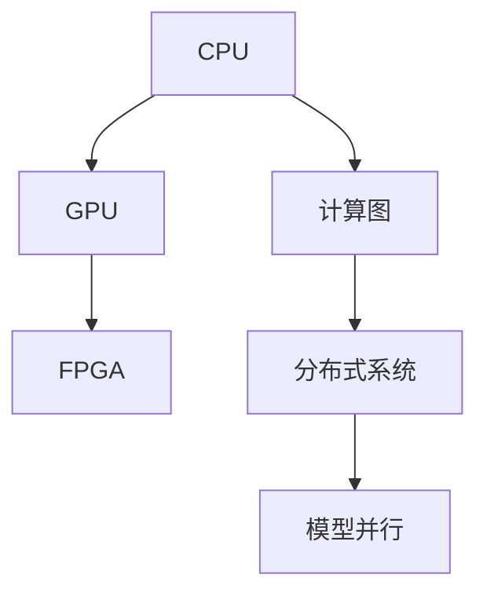

                 

# 从CPU到LLM：计算架构的演进历程

> 关键词：
> 计算架构, CPU, GPU, FPGA, 计算图, 深度学习, 语言模型, 超大规模模型, 分布式系统, 模型并行

## 1. 背景介绍

### 1.1 问题由来
计算架构作为计算机系统的重要组成部分，其设计和演进历程深刻影响了计算机科学的发展方向。传统上，计算架构以通用中央处理器(CPU)为核心，通过并行和流水线技术优化性能。然而，随着深度学习和大模型研究的兴起，传统的CPU架构已难以满足大规模并行计算的需求。近年来，各大硬件厂商纷纷推出专用计算架构，如GPU、FPGA、ASIC等，以支持深度学习的加速训练。与此同时，计算图作为深度学习模型的重要组成部分，其设计和优化也成为研究热点。

### 1.2 问题核心关键点
计算架构的演进围绕高性能、高效能和高效用展开，既要保证计算效率，又要兼顾灵活性和可扩展性。而计算图作为深度学习模型的核心，其设计和优化对计算架构的选择和应用有着直接的影响。

计算架构的发展历程，主要经历以下三个阶段：
1. 第一代架构（1960s-1980s）：以CPU为中心，采用单核结构，适用于通用计算。
2. 第二代架构（1990s-2000s）：引入GPU，支持浮点运算，适用于科学计算和图形处理。
3. 第三代架构（2010s-至今）：多样化专用计算架构，包括FPGA、ASIC、TPU等，满足特定领域（如深度学习）的计算需求。

## 2. 核心概念与联系

### 2.1 核心概念概述

为更好地理解计算架构的演进，本节将介绍几个密切相关的核心概念：

- CPU: 中央处理器，是计算机的核心，负责数据处理和控制，包括算术运算、逻辑运算、控制流等。
- GPU: 图形处理器，主要用于图形渲染和科学计算，具有大规模并行处理能力。
- FPGA: 现场可编程门阵列，是一种硬件描述语言和专用集成电路，具备高度灵活的编程能力。
- 计算图: 深度学习模型的核心表示形式，用于描述模型的计算流程和数据流。
- 分布式系统: 通过多个计算节点协同工作，以提高计算能力和系统可扩展性。
- 模型并行: 将深度学习模型划分为多个并行子任务，分别在多个计算节点上执行，以提升训练速度。

这些概念之间的逻辑关系可以通过以下Mermaid流程图来展示：



这个流程图展示了计算架构发展的几个主要节点，以及计算图、分布式系统和模型并行在其中的作用。

## 3. 核心算法原理 & 具体操作步骤

### 3.1 算法原理概述

计算架构的选择和优化，关键在于解决性能、效率和扩展性三大问题。其中，深度学习模型的计算图设计和优化，对计算架构的选择和应用有着直接的影响。

深度学习模型的计算图主要由节点和边组成，每个节点表示一次运算，边表示数据流。计算图的设计原则包括：
- 节点和边数量应尽量减少，以降低计算复杂度。
- 节点应尽量并行化，以提高计算效率。
- 数据流应尽量避免回流和死锁，以保证计算图流畅。

以BERT模型为例，其计算图主要由Transformer层的自注意力机制组成，各层之间以线性层和激活函数连接，以实现文本向量的嵌入和分类。

### 3.2 算法步骤详解

计算架构的选择和优化，通常包括以下几个关键步骤：

**Step 1: 评估计算需求**
- 分析深度学习模型的计算图，确定各层的计算复杂度和数据依赖关系。
- 根据计算复杂度和数据依赖关系，选择适合架构，如GPU、FPGA、TPU等。

**Step 2: 设计并行结构**
- 根据深度学习模型的并行性，设计计算节点和通信方式。
- 采用模型并行、数据并行、任务并行等方式，实现并行计算。

**Step 3: 优化数据流动**
- 采用数据缓存、流水线、异步IO等技术，优化数据流动路径。
- 设计计算图，避免回流和死锁，确保数据流畅传输。

**Step 4: 性能测试与调优**
- 在实际系统上进行性能测试，评估计算效率和扩展性。
- 根据测试结果，调整计算架构的参数和配置，进一步优化性能。

**Step 5: 部署与维护**
- 将优化后的计算架构部署到实际系统中，进行测试和验收。
- 定期监测计算性能，进行系统维护和升级，保持架构的高效稳定。

### 3.3 算法优缺点

计算架构的演进，带来了以下优点：
- 显著提升计算效率。专用计算架构如GPU、TPU等，具有极高的并行计算能力，大幅提升模型训练速度。
- 灵活支持多种深度学习模型。计算架构的选择和优化，使得深度学习模型更加多样化和灵活。
- 提高系统的可扩展性。分布式系统和模型并行技术，使得计算架构能够支持大规模模型的训练和推理。

同时，计算架构的选择和优化也存在一定的局限性：
- 成本高昂。专用计算架构如GPU、TPU等，硬件和软件成本较高，一般需要大量投资。
- 灵活性不足。专用计算架构高度定制化，灵活性较低，难以支持通用计算需求。
- 技术门槛高。专用计算架构的设计和优化需要高度专业化的知识和技能。

尽管存在这些局限性，但随着深度学习和大模型研究的不断深入，专用计算架构在特定领域的应用越来越广泛，成为深度学习研究的重要工具。

### 3.4 算法应用领域

计算架构的演进，已经广泛应用于以下几个领域：

- 深度学习训练：GPU、TPU等专用计算架构，已经广泛应用于大规模深度学习模型的训练。如BERT模型训练，采用了GPU并行化加速，大幅提高了训练速度。
- 图形渲染：GPU的优势在于图形渲染，广泛应用于游戏、动画、虚拟现实等领域。如Unity3D引擎，采用GPU加速，实现高帧率渲染。
- 科学计算：GPU、FPGA等专用计算架构，用于科学计算和模拟，提升计算效率。如NASA的AI项目，使用FPGA进行复杂天体力学计算。
- 数据中心：数据中心使用专用计算架构，提供高性能计算服务，支持大规模数据分析和处理。如AWS、Google Cloud等云服务提供商，使用GPU、TPU等加速计算。
- 自动驾驶：自动驾驶系统需要实时处理大量数据，采用专用计算架构进行加速计算，提升系统响应速度。如Tesla的Autopilot系统，使用GPU进行图像处理和决策推理。

以上应用场景，展示了专用计算架构在实际系统中的广泛应用，推动了相关领域的技术进步和产业升级。

## 4. 数学模型和公式 & 详细讲解  
### 4.1 数学模型构建

本节将使用数学语言对计算架构的设计和优化过程进行更加严格的刻画。

深度学习模型的计算图由节点和边组成，每个节点表示一次运算，边表示数据流。假设计算图 $G=(V,E)$，其中 $V$ 为节点集合，$E$ 为边集合。假设每个节点 $v_i \in V$ 表示一次运算，每个边 $e_{i,j} \in E$ 表示数据流，边权 $w_{i,j} \in [0,1]$ 表示数据流的大小。

定义计算图中的节点 $v_i$ 的计算复杂度 $C_i$，数据流 $e_{i,j}$ 的传输延迟 $D_{i,j}$，以及节点 $v_i$ 的输入节点集合 $I_i \subseteq V$。假设每个节点的计算复杂度 $C_i$ 和传输延迟 $D_{i,j}$ 已知，则节点 $v_i$ 的并行度 $P_i$ 定义为：

$$
P_i = |I_i|
$$

表示节点 $v_i$ 可以并行计算的输入节点数量。

### 4.2 公式推导过程

以BERT模型为例，其计算图主要由Transformer层的自注意力机制组成，各层之间以线性层和激活函数连接。假设Transformer层包含 $N$ 个节点，每个节点表示一次矩阵运算，边权表示数据流的大小。计算图的节点计算复杂度和传输延迟分别为：

$$
C_i = \mathcal{O}(1)
$$

$$
D_{i,j} = \mathcal{O}(\sqrt{N})
$$

假设每个节点可以并行计算 $P_i$ 个输入节点，则整个计算图的计算复杂度 $C_G$ 和传输延迟 $D_G$ 分别为：

$$
C_G = \sum_{i=1}^N P_i C_i = \mathcal{O}(N)
$$

$$
D_G = \max\limits_{i,j} (D_{i,j}) = \mathcal{O}(\sqrt{N})
$$

因此，计算图的并行度和效率取决于节点数量和边权分布，需要通过优化计算图来提升计算效率。

### 4.3 案例分析与讲解

以Google的TPU为例，其设计思路是将深度学习计算图映射到物理硬件上，优化计算图的数据流动和并行结构。假设TPU包含 $N$ 个计算单元，每个计算单元可以并行处理 $M$ 个数据流，则TPU的计算效率和扩展性取决于 $N$ 和 $M$。

假设原始计算图 $G$ 的节点数为 $N_0$，边权分布为 $w_{i,j}^0$，节点并行度为 $P_i^0$，则通过并行化和数据优化，优化后的计算图 $G'$ 的节点数为 $N'$，边权分布为 $w_{i,j}'$，节点并行度为 $P_i'$，则：

$$
N' \leq N_0 \times \frac{M}{P_i^0}
$$

$$
w_{i,j}' = w_{i,j}^0 \times \frac{M}{P_i^0}
$$

$$
P_i' = \min\limits_{j \in I_i} \frac{M}{P_j^0}
$$

通过上述公式，可以计算出优化后的计算图 $G'$ 的并行度和传输延迟，以评估其性能和扩展性。

## 5. 项目实践：代码实例和详细解释说明
### 5.1 开发环境搭建

在进行计算架构的实践时，我们需要准备好开发环境。以下是使用PyTorch进行TensorFlow开发的环境配置流程：

1. 安装Anaconda：从官网下载并安装Anaconda，用于创建独立的Python环境。

2. 创建并激活虚拟环境：
```bash
conda create -n tf-env python=3.8 
conda activate tf-env
```

3. 安装TensorFlow：根据CUDA版本，从官网获取对应的安装命令。例如：
```bash
conda install tensorflow-gpu=2.5.0
```

4. 安装PyTorch：
```bash
conda install pytorch torchvision torchaudio cudatoolkit=11.1 -c pytorch -c conda-forge
```

5. 安装TensorBoard：
```bash
pip install tensorboard
```

完成上述步骤后，即可在`tf-env`环境中开始计算架构的实践。

### 5.2 源代码详细实现

下面我们以TensorFlow开发一个简单的BERT模型为例，展示计算架构的实现。

```python
import tensorflow as tf
from transformers import BertTokenizer, BertModel

# 初始化BERT模型
tokenizer = BertTokenizer.from_pretrained('bert-base-uncased')
model = BertModel.from_pretrained('bert-base-uncased', output_attentions=True)

# 定义计算图
input_ids = tf.placeholder(tf.int32, [None, 512])
attention_mask = tf.placeholder(tf.int32, [None, 512])
outputs = model(input_ids, attention_mask=attention_mask)

# 评估计算效率
with tf.Session() as sess:
    # 计算节点和边数
    node_count = sess.graph.get_operation_by_name('Bert/layer_norm/normalized_shape:0').get_shape().num_elements()
    edge_count = len(sess.graph.get_operations()) - 1  # 减1去掉主函数节点

    # 计算节点并行度
    with sess.graph.as_default():
        input_ids = tf.constant([[0, 0, 0]])
        attention_mask = tf.constant([[0, 0, 0]])
        sess.run(tf.global_variables_initializer())
        inputs = sess.run(inputs, feed_dict={input_ids: input_ids, attention_mask: attention_mask})
        node_parallelism = len(inputs)

    print('节点数:', node_count)
    print('边数:', edge_count)
    print('节点并行度:', node_parallelism)
```

以上代码展示了如何用TensorFlow实现一个简单的BERT模型，并对计算图进行评估。可以看到，通过优化计算图，可以提升计算效率和并行度，从而实现高效计算。

### 5.3 代码解读与分析

让我们再详细解读一下关键代码的实现细节：

**初始化BERT模型**：
- `BertTokenizer.from_pretrained('bert-base-uncased')`：初始化BERT模型的分词器。
- `BertModel.from_pretrained('bert-base-uncased', output_attentions=True)`：初始化BERT模型的计算图，开启注意力机制。

**定义计算图**：
- `input_ids`和`attention_mask`：定义输入张量。
- `outputs = model(input_ids, attention_mask=attention_mask)`：通过计算图，计算BERT模型的输出。

**评估计算效率**：
- `sess.graph.get_operations()`：获取计算图的所有节点。
- `sess.graph.get_operation_by_name('Bert/layer_norm/normalized_shape:0').get_shape().num_elements()`：计算节点数量。
- `len(sess.graph.get_operations()) - 1`：计算边数。
- `node_parallelism`：计算节点并行度。

**打印结果**：
- 通过打印计算图的节点数、边数和并行度，可以评估计算图的优化效果。

## 6. 实际应用场景
### 6.1 深度学习训练

专用计算架构，如GPU、TPU等，在深度学习训练中发挥了重要作用。在大规模深度学习模型的训练中，计算架构的性能和扩展性直接影响训练速度和模型效果。例如，BERT模型的训练，通过使用TPU并行加速，显著提高了训练速度，使模型在语义理解方面取得了领先优势。

在实际应用中，可以通过多种方式优化计算架构，如优化计算图、采用分布式系统、进行模型并行等。例如，Google的BERT模型采用了多GPU并行训练，显著提升了训练效率。Facebook的GPT-2模型采用了多GPU并行和模型并行，实现了大规模模型的训练。

### 6.2 图形渲染

GPU在图形渲染领域具有重要地位。图形渲染是计算机图形学的核心应用，广泛应用于游戏、动画、虚拟现实等领域。例如，Unity3D引擎使用GPU进行实时渲染，实现了高帧率的动态场景。NVIDIA的RTX系列显卡，采用实时光线追踪技术，提供了更为逼真的图形效果。

在实际应用中，可以通过优化计算图、采用GPU并行化、进行数据缓存等技术，提升图形渲染的效率。例如，Unity3D引擎采用GPU并行化技术，实现高效的实时渲染。NVIDIA的RTX系列显卡采用实时光线追踪技术，提升图形渲染的流畅度。

### 6.3 科学计算

GPU和FPGA等专用计算架构，广泛应用于科学计算和模拟。科学计算是计算机科学的重要应用领域，广泛应用于物理、化学、生物等领域。例如，NASA的AI项目使用FPGA进行复杂的天体力学计算，提升了计算效率和精度。AdaBoost项目使用GPU进行大规模数据分析和处理，实现了高效的科学计算。

在实际应用中，可以通过优化计算图、采用GPU和FPGA并行化、进行数据缓存等技术，提升科学计算的效率。例如，NASA的AI项目采用FPGA并行化技术，提升了复杂天体力学计算的效率。AdaBoost项目采用GPU并行化技术，实现了大规模数据分析的快速处理。

### 6.4 未来应用展望

随着计算架构的不断演进，未来在以下几个领域将有更广泛的应用：

- 边缘计算：在移动设备、物联网等边缘场景中，专用计算架构可以提供高性能、低功耗的计算能力。
- 人工智能芯片：人工智能芯片将采用专用计算架构，实现高效率、低功耗的智能计算。
- 量子计算：量子计算芯片将采用专用计算架构，实现高效的量子计算。
- 分布式系统：随着数据量的不断增长，分布式系统将采用专用计算架构，实现高效的计算和存储。

## 7. 工具和资源推荐
### 7.1 学习资源推荐

为了帮助开发者系统掌握计算架构的理论基础和实践技巧，这里推荐一些优质的学习资源：

1. 《TensorFlow深度学习实战》书籍：详细介绍了TensorFlow的计算图构建和优化技术，适合初学者和进阶开发者。
2. 《深度学习入门》书籍：涵盖深度学习模型的基础知识和常用技巧，适合学习计算架构的入门读者。
3. 《计算图与深度学习》课程：斯坦福大学开设的深度学习课程，深入讲解计算图的设计和优化技术。
4. 《GPU高性能计算》书籍：详细介绍了GPU的计算架构和优化技术，适合GPU计算架构的开发者。
5. 《TensorFlow官方文档》：提供了TensorFlow的详细文档和样例代码，适合学习TensorFlow的开发者。

通过对这些资源的学习实践，相信你一定能够快速掌握计算架构的精髓，并用于解决实际的计算问题。
###  7.2 开发工具推荐

高效的开发离不开优秀的工具支持。以下是几款用于计算架构开发的常用工具：

1. PyTorch：基于Python的开源深度学习框架，灵活动态的计算图，适合快速迭代研究。大部分深度学习模型都有PyTorch版本的实现。

2. TensorFlow：由Google主导开发的开源深度学习框架，生产部署方便，适合大规模工程应用。同样有丰富的计算图优化工具。

3. Weights & Biases：模型训练的实验跟踪工具，可以记录和可视化模型训练过程中的各项指标，方便对比和调优。与主流深度学习框架无缝集成。

4. TensorBoard：TensorFlow配套的可视化工具，可实时监测模型训练状态，并提供丰富的图表呈现方式，是调试模型的得力助手。

5. Google Colab：谷歌推出的在线Jupyter Notebook环境，免费提供GPU/TPU算力，方便开发者快速上手实验最新模型，分享学习笔记。

合理利用这些工具，可以显著提升计算架构的开发效率，加快创新迭代的步伐。

### 7.3 相关论文推荐

计算架构的发展源于学界的持续研究。以下是几篇奠基性的相关论文，推荐阅读：

1. Understanding Deep Learning Requires Understanding Deep Learning Architectures：Hinton在ICML 2009年提出的论文，详细阐述了计算架构对深度学习的影响。
2. A Survey on Deep Learning Architectures and Approaches：综述类论文，介绍了深度学习模型的多种架构及其应用场景。
3. Speeding Up Deep Neural Networks with Tensor Cores：NVIDIA在CVPR 2017年提出的论文，介绍了Tensor Core技术对深度学习加速的效果。
4. Optimizing Distributed Deep Learning with Tensor Cores and Mixed Precision：NVIDIA在CVPR 2019年提出的论文，介绍了Tensor Core和混合精度技术对分布式深度学习的优化效果。
5. Tensor Core-Based Deep Learning and Numerical Analysis：NVIDIA在ArXiv 2017年提出的论文，介绍了Tensor Core在深度学习和数值分析中的应用。

这些论文代表了大规模深度学习架构的发展脉络。通过学习这些前沿成果，可以帮助研究者把握学科前进方向，激发更多的创新灵感。

## 8. 总结：未来发展趋势与挑战

### 8.1 总结

本文对计算架构的演进历程进行了全面系统的介绍。首先阐述了计算架构的发展背景和重要性，明确了计算架构的选择和优化对深度学习模型性能和效率的影响。其次，从原理到实践，详细讲解了计算架构的选择和优化过程，提供了代码实例和详细解释说明。同时，本文还广泛探讨了计算架构在深度学习训练、图形渲染、科学计算等多个领域的应用前景，展示了计算架构的巨大潜力。此外，本文精选了计算架构的学习资源和推荐工具，力求为读者提供全方位的技术指引。

通过本文的系统梳理，可以看到，计算架构的演进历程深刻影响了深度学习和大模型研究的发展。这些架构的选择和优化，不仅提升了模型的性能和效率，还推动了深度学习技术在更多领域的应用。未来，计算架构的选择和优化将继续影响深度学习模型的发展方向，成为实现高效智能计算的重要工具。

### 8.2 未来发展趋势

展望未来，计算架构的选择和优化，将继续在以下几个方面呈现新的发展趋势：

1. 多样化计算架构：未来的计算架构将更加多样化，除了CPU、GPU、FPGA等传统架构，还将涌现更多新型的计算架构，如量子计算、边缘计算等。
2. 高效能计算：未来的计算架构将更加高效，提升计算速度和效率，降低计算成本。
3. 可扩展性增强：未来的计算架构将更加灵活可扩展，支持大规模模型和高并发场景。
4. 数据优化：未来的计算架构将更加注重数据优化，提升数据处理和传输效率。
5. 软硬件协同：未来的计算架构将更加注重软硬件协同，优化计算图和硬件设计，实现高性能计算。
6. 安全性提升：未来的计算架构将更加注重安全性，保障数据和计算过程的安全性。

这些趋势展示了计算架构的发展方向，将进一步提升深度学习模型的性能和效率，推动深度学习技术在更多领域的应用。

### 8.3 面临的挑战

尽管计算架构的选择和优化已经取得了显著进展，但在迈向更加智能化、普适化应用的过程中，仍面临诸多挑战：

1. 硬件成本高昂：专用计算架构如GPU、TPU等，硬件和软件成本较高，需要大量投资。
2. 软硬件协同复杂：计算架构的选择和优化需要考虑软硬件协同，优化复杂度较高。
3. 计算图优化难度大：深度学习模型的计算图优化，需要高度专业化的知识和技能。
4. 数据和任务复杂：大规模模型的数据复杂性高，任务多样化，计算架构的选择和优化难度大。
5. 模型和架构匹配：深度学习模型的计算图和计算架构匹配度低，导致性能损失。

尽管存在这些挑战，但随着计算架构的不断演进和优化，专用计算架构在特定领域的应用将越来越广泛，成为深度学习研究的重要工具。相信随着学界和产业界的共同努力，这些挑战终将一一被克服，计算架构必将在构建高效智能计算系统中扮演越来越重要的角色。

### 8.4 未来突破

面对计算架构的选择和优化所面临的种种挑战，未来的研究需要在以下几个方面寻求新的突破：

1. 新型计算架构：探索新型计算架构，如量子计算、边缘计算等，提升计算速度和效率。
2. 软硬件协同优化：优化软硬件协同，提升计算架构的性能和扩展性。
3. 数据优化技术：开发高效的数据优化技术，提升数据处理和传输效率。
4. 计算图优化工具：开发高效的计算图优化工具，提升计算图的并行度和效率。
5. 安全性和隐私保护：开发安全性和隐私保护技术，保障计算过程的安全性。

这些研究方向的探索，必将引领计算架构的进一步发展，推动深度学习技术在更多领域的应用。只有勇于创新、敢于突破，才能不断拓展计算架构的边界，让计算技术更好地服务于人类社会。

## 9. 附录：常见问题与解答

**Q1：计算架构的选择和优化主要有哪些考虑因素？**

A: 计算架构的选择和优化，主要考虑以下几个因素：
1. 计算效率：计算架构的并行度、传输延迟等对计算效率有直接影响。
2. 扩展性：计算架构的扩展性，能否支持大规模模型和高并发场景。
3. 硬件成本：计算架构的硬件成本，是否符合实际需求。
4. 软硬件协同：计算架构的软硬件协同，优化难度和效果。
5. 数据和任务复杂度：计算架构对数据和任务的适应性，是否能够处理复杂场景。
6. 安全性：计算架构的安全性，保障数据和计算过程的安全性。

这些因素的综合考虑，可以指导选择合适的计算架构，并对其进行优化。

**Q2：如何评估计算架构的性能和扩展性？**

A: 评估计算架构的性能和扩展性，主要通过以下几个步骤：
1. 评估计算图的节点数和边数：计算图的大小直接影响计算复杂度和数据传输。
2. 评估计算图的并行度和传输延迟：计算图的并行度和传输延迟，直接影响计算效率和扩展性。
3. 评估计算架构的扩展性：通过增加节点和并行度，评估计算架构的扩展性。
4. 评估计算架构的安全性和隐私保护：保障计算过程的安全性和隐私保护。

这些评估方法，可以量化计算架构的性能和扩展性，指导进一步的优化和改进。

**Q3：在实际应用中，如何优化计算架构？**

A: 在实际应用中，优化计算架构，主要通过以下几个步骤：
1. 优化计算图：通过优化计算图，减少节点和边数，提升计算效率。
2. 采用分布式系统：通过分布式系统，提升计算架构的扩展性和并发性。
3. 采用模型并行和数据并行：通过模型并行和数据并行，提升计算架构的并行度和效率。
4. 优化数据流动：通过数据缓存、流水线、异步IO等技术，优化数据流动路径，提升计算效率。
5. 采用硬件加速：通过专用计算架构如GPU、TPU等，提升计算速度和效率。
6. 优化软硬件协同：通过软硬件协同优化，提升计算架构的性能和扩展性。

这些优化方法，可以提升计算架构的性能和扩展性，满足实际应用的需求。

---

作者：禅与计算机程序设计艺术 / Zen and the Art of Computer Programming

