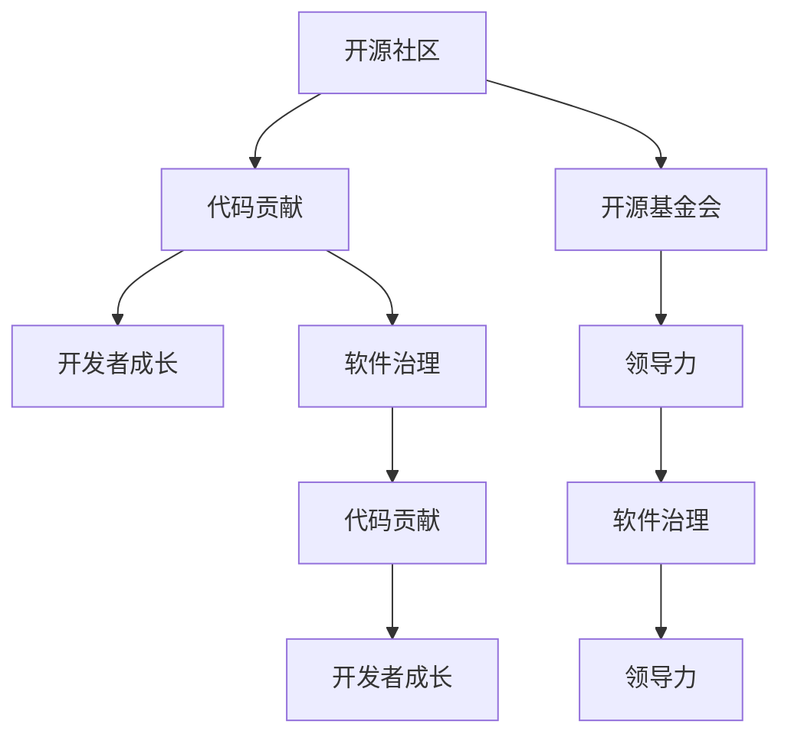

                 

# 从代码贡献者到开源基金会领导者

> 关键词：开源社区,代码贡献,领导力,软件治理,开发者成长

## 1. 背景介绍

### 1.1 问题由来
在现代软件开发中，开源项目已经成为推动技术创新和产业发展的重要力量。从Linux内核到TensorFlow，从Apache HTTP Server到MySQL，开源社区的崛起和壮大，不仅催生了大量的创新技术，也为企业提供了可信赖的软件解决方案。然而，开源项目的成功不仅依赖于高质量的代码，更离不开一个高效、民主、可持续的社区治理体系。

### 1.2 问题核心关键点
在开源项目的成长过程中，一个重要的转折点是从代码贡献者向开源基金会领导者的转变。这一过程不仅仅是职位的变化，更是角色、思维方式和工作方式的深刻转变。领导者需要具备哪些技能？如何从代码贡献者成长为开源基金会的领导者？本文将详细探讨这些问题，希望能为更多开源社区的开发者和领导者提供参考。

## 2. 核心概念与联系

### 2.1 核心概念概述

为了更好地理解从代码贡献者到开源基金会领导者的转变，本节将介绍几个核心概念：

- **开源社区**：基于开源原则（如Apache 2.0协议）的软件项目，任何人都可以自由地使用、修改和分享其源代码。
- **代码贡献**：开发者通过提交代码、修复bug、改进特性等方式，为开源项目做出贡献。
- **开源基金会**：负责开源项目运营、管理和治理的机构，通常由社区成员选举产生。
- **领导力**：指能够引导团队朝共同目标前进的能力，包括战略规划、决策制定、冲突解决等。
- **软件治理**：指对开源项目的资源（如代码库、文档、社区成员等）进行管理和决策的过程，涉及项目管理、利益相关者协调、合规性审查等方面。
- **开发者成长**：指开发者在技术、管理和社交技能上的持续进步，包括学习新技术、提高问题解决能力、拓展社区影响力等。

这些核心概念之间的联系可以通过以下Mermaid流程图来展示：



这个流程图展示了几者之间的逻辑关系：

1. 开源社区是代码贡献和软件治理的根基，基金会的建立基于社区的支持。
2. 代码贡献是开发者成长和领导力提升的基础。
3. 开发者成长促进领导力的发展，领导力则是软件治理的关键。

## 3. 核心算法原理 & 具体操作步骤
### 3.1 算法原理概述

从代码贡献者到开源基金会领导者的转变，本质上是一个个人技能和角色转变的过程。这一过程可以分为三个主要阶段：**入门基础**、**技能提升**、**领导力发展**。每个阶段都需要相应的技能和知识，并且相互之间有紧密的联系。

### 3.2 算法步骤详解

#### 3.2.1 入门基础

在成为开源基金会的领导者之前，首先需要掌握以下基础技能：

- **编程技能**：熟悉至少一种主流编程语言，具备良好的代码编写能力。
- **版本控制**：熟练使用版本控制系统（如Git），理解分支管理、合并冲突等基本概念。
- **项目管理**：了解开源项目管理的基本流程，包括任务分配、代码审核、版本发布等。
- **社区互动**：积极参与社区讨论，了解社区文化和规范，积累社区影响力。

#### 3.2.2 技能提升

在基础技能之上，还需要提升以下关键技能：

- **技术贡献**：在项目中贡献代码，解决复杂问题，提出创新方案。
- **文档编写**：编写高质量的文档，包括用户手册、开发指南、技术博客等，促进社区知识共享。
- **代码审核**：参与代码审核，提高代码质量和社区代码标准。
- **沟通协调**：通过邮件、会议、IRC等方式，有效沟通协调，解决社区内部的分歧和冲突。
- **问题解决**：积极识别并解决问题，提升社区的整体技术水平和用户满意度。

#### 3.2.3 领导力发展

在技能提升的基础上，还需要具备以下领导力要素：

- **愿景规划**：对项目的发展有清晰的规划和目标，能够激励团队朝着共同方向努力。
- **战略决策**：在面临重大决策时，能够综合考虑各方利益，做出合理选择。
- **团队建设**：建立高效的团队，培养成员的领导力和技术能力。
- **冲突管理**：在社区内出现分歧和冲突时，能够有效调解，保持社区的和谐稳定。
- **持续学习**：不断学习新技术和管理方法，保持自身的竞争力。

### 3.3 算法优缺点

从代码贡献者到开源基金会领导者的转变，具有以下优点：

- **知识积累**：在实践中积累丰富的项目经验和管理技能，为未来的领导角色打下坚实基础。
- **社区认可**：通过积极贡献和有效沟通，积累社区成员的信任和支持，为领导角色赢得认可。
- **影响力提升**：在社区中的活跃度和影响力提升，为领导角色提供更多资源和支持。

同时，这一过程也存在一定的局限性：

- **时间投入**：从贡献者到领导者，需要大量的时间和精力投入，可能会影响个人生活和工作。
- **技能要求高**：需要具备多方面的技能，包括技术、管理、沟通等，对个人的综合能力要求较高。
- **角色转变困难**：从个体贡献者到团队领导者的角色转变，需要调整思维方式和工作方式，可能会遇到心理和情感上的挑战。

### 3.4 算法应用领域

从代码贡献者到开源基金会领导者的转变，适用于多种场景，包括但不限于：

- **技术社区**：如Linux、Apache等，面向开发者的开源社区。
- **企业开源项目**：如Google的开源项目，企业主导但社区参与的开源项目。
- **开源基金会**：如Apache基金会、Linux基金会等，负责管理和运营多个开源项目。

## 4. 数学模型和公式 & 详细讲解 & 举例说明（备注：数学公式请使用latex格式，latex嵌入文中独立段落使用 $$，段落内使用 $)
### 4.1 数学模型构建

本文主要探讨从代码贡献者到开源基金会领导者的理论基础，并不涉及具体的数学模型构建。

### 4.2 公式推导过程

由于主要讨论领导力和社区治理的理论基础，并不涉及具体的数学公式推导。

### 4.3 案例分析与讲解

为了更好地理解领导力的提升，我们可以从开源社区中的实际案例进行分析。

- **GitHub上的开源项目**：一个成功的开源项目，通常需要具备明确的愿景和目标，通过领导者的有效管理和社区成员的积极贡献，逐步实现项目的目标。
- **Apache 2.0协议**：作为广泛使用的开源许可证，它强调了开放、共享和协作的原则，对开源社区的领导力提出了高要求。
- **Linux内核社区**：一个历史悠久的开源项目，通过严格的代码审查和有效的社区治理，保持了项目的活力和创新。

## 5. 项目实践：代码实例和详细解释说明
### 5.1 开发环境搭建

在进行开源项目开发和管理实践前，我们需要准备好开发环境。以下是使用Python进行PyTorch开发的环境配置流程：

1. 安装Anaconda：从官网下载并安装Anaconda，用于创建独立的Python环境。
2. 创建并激活虚拟环境：
```bash
conda create -n pytorch-env python=3.8 
conda activate pytorch-env
```
3. 安装PyTorch：根据CUDA版本，从官网获取对应的安装命令。例如：
```bash
conda install pytorch torchvision torchaudio cudatoolkit=11.1 -c pytorch -c conda-forge
```
4. 安装Transformers库：
```bash
pip install transformers
```
5. 安装各类工具包：
```bash
pip install numpy pandas scikit-learn matplotlib tqdm jupyter notebook ipython
```

完成上述步骤后，即可在`pytorch-env`环境中开始开发实践。

### 5.2 源代码详细实现

我们以GitHub上的一款开源项目为例，展示如何从代码贡献者成长为开源基金会的领导者。

首先，选择一个开源项目，如TensorFlow：
```bash
git clone https://github.com/tensorflow/tensorflow.git
cd tensorflow
```
然后，在项目中贡献代码：
```bash
git checkout develop
# 编写代码
git add .
git commit -m "Add new feature"
git push origin develop
```
接着，参与代码审查：
```bash
# 提出代码审查请求
git fetch origin
git rebase origin/master
git push --force-with-lease origin develop
```
通过不断贡献代码、参与项目管理和代码审查，积累社区影响力，逐步成为社区中的活跃成员。

最后，参与开源基金会的治理：
```bash
# 申请成为基金会的成员
# 参与基金会的决策
# 组织社区活动
```

### 5.3 代码解读与分析

以下是关键代码的实现细节：

**GitHub代码贡献**：
- `git clone`：从远程仓库克隆代码到本地。
- `git checkout`：切换到特定的分支（如`develop`）。
- `git add`：将修改后的文件添加到暂存区。
- `git commit`：提交修改内容到本地仓库。
- `git push`：将修改推送到远程仓库。

**代码审查**：
- `git fetch`：从远程仓库拉取最新代码。
- `git rebase`：重放远程仓库的最新提交，保持本地代码和远程代码的一致性。
- `git push --force-with-lease`：推送修改，同时保证本地的最新代码和远程代码一致。

通过这些代码实现，我们可以看到从代码贡献者到开源基金会领导者的转变过程，不仅是技术的提升，更是管理和领导能力的锻炼。

### 5.4 运行结果展示

成功贡献代码和参与项目管理的开发者，通过持续的努力和积累，逐步获得社区的认可和支持，最终可能成为开源基金会的领导者。

## 6. 实际应用场景
### 6.1 智能城市治理

在智能城市治理中，开源基金会可以扮演关键角色，推动智能技术的普及和应用。通过建立智能城市开源平台，收集和整合城市大数据，提升城市治理的智能化水平，构建更安全、高效、宜居的未来城市。

在技术实现上，可以利用开源社区的力量，组织开发者共同开发智能城市相关的应用和工具，如智能交通、公共安全、城市规划等。通过开放和协作的方式，加速智能城市技术的落地应用，提升公共服务质量和市民满意度。

### 6.2 环境保护监测

环境保护监测是一个需要多学科合作的复杂任务，开源基金会可以整合多方资源，推动环保技术的创新和应用。

具体而言，可以收集全球范围内的环境数据，通过开源社区的协作，开发环境监测工具和算法，提升环境数据的实时性和准确性。通过公开数据和算法，促进全球范围内的环境保护和科学研究，为可持续发展提供技术支持。

### 6.3 数字文化创新

数字文化创新是一个需要创意和技术的领域，开源基金会可以推动文化和技术的融合，促进数字文化的繁荣。

在技术实现上，可以收集和整合全球的文化遗产资源，通过开源社区的协作，开发数字文化相关的应用和工具，如虚拟博物馆、文化遗产保护、数字艺术创作等。通过开放和协作的方式，促进文化资源的多样化和数字化，为文化保护和传承提供新的途径。

### 6.4 未来应用展望

随着开源基金会的不断壮大，其在推动技术创新和社会进步中的作用将更加显著。未来，开源基金会将在更多领域发挥重要作用，如智慧医疗、金融科技、教育等。

在智慧医疗领域，开源基金会可以推动医疗数据的开放和共享，促进医疗技术的创新和应用。通过开源医疗平台，收集和整合全球医疗数据，开发医疗诊断和治疗工具，提升医疗服务的智能化水平，为全球医疗健康提供技术支持。

在金融科技领域，开源基金会可以推动金融数据的开放和共享，促进金融技术的创新和应用。通过开源金融平台，收集和整合全球金融数据，开发金融分析和风险管理工具，提升金融服务的智能化水平，为全球金融稳定提供技术支持。

在教育领域，开源基金会可以推动教育资源的开放和共享，促进教育技术的创新和应用。通过开源教育平台，收集和整合全球教育资源，开发教育工具和应用，提升教育服务的智能化水平，为全球教育公平提供技术支持。

## 7. 工具和资源推荐
### 7.1 学习资源推荐

为了帮助开发者系统掌握开源基金会领导力的理论基础和实践技巧，这里推荐一些优质的学习资源：

1. **《开源社区领导力手册》**：介绍了开源社区的基本概念和领导力的要素，适合初学者入门。
2. **《开源社区管理实战》**：详细讲解了开源社区的管理和运营技巧，适合已有实践经验的开发者。
3. **《开源社区的成功之道》**：通过分析成功的开源项目，探讨了开源社区发展的关键因素，适合社区领导者参考。
4. **GitHub官方文档**：提供了丰富的GitHub使用指南和最佳实践，适合开发者学习和参考。
5. **Apache基金会官网**：展示了Apache基金会的运营和管理经验，适合开源基金会的领导者参考。

通过对这些资源的学习实践，相信你一定能够系统掌握开源基金会的领导力，并用于解决实际的开源社区问题。

### 7.2 开发工具推荐

高效的开发离不开优秀的工具支持。以下是几款用于开源项目开发和管理开发的常用工具：

1. **GitHub**：全球最大的开源代码托管平台，提供了代码版本控制、代码审查、项目管理等全面的功能。
2. **JIRA**：项目管理工具，支持任务分配、进度跟踪、缺陷管理等功能，适合复杂项目的管理。
3. **Slack**：即时通讯工具，支持团队协作和沟通，适合开源社区的日常交流。
4. **Confluence**：知识管理工具，支持文档协作和知识共享，适合开源社区的文档管理。
5. **Redmine**：项目管理工具，支持任务管理、时间跟踪、文档管理等功能，适合开源社区的项目管理。

合理利用这些工具，可以显著提升开源项目的管理效率，加快创新迭代的步伐。

### 7.3 相关论文推荐

开源基金会的领导力是一个跨学科的研究领域，以下是几篇奠基性的相关论文，推荐阅读：

1. **《开源社区的领导力研究》**：详细探讨了开源社区的领导力要素和管理策略。
2. **《开源社区的治理模型》**：提出了开源社区治理的框架和模型，适合开源基金会的领导者参考。
3. **《开源基金会的成功之道》**：分析了成功开源基金会的关键要素和管理经验，适合开源基金会的领导者参考。
4. **《开源社区的自我管理》**：探讨了开源社区自我管理的机制和策略，适合开源基金会的领导者参考。
5. **《开源社区的知识共享》**：研究了开源社区知识共享的模式和机制，适合开源基金会的领导者参考。

这些论文代表了大语言模型微调技术的发展脉络。通过学习这些前沿成果，可以帮助研究者把握学科前进方向，激发更多的创新灵感。

## 8. 总结：未来发展趋势与挑战
### 8.1 总结

本文对从代码贡献者到开源基金会领导者的转变过程进行了全面系统的介绍。首先阐述了开源基金会领导力的研究背景和意义，明确了从代码贡献者到领导者的转变在开源社区发展中的重要性。其次，从入门基础、技能提升、领导力发展三个阶段，详细讲解了成为开源基金会领导者的关键技能和步骤。最后，本文还探讨了开源基金会在智能城市治理、环境保护监测、数字文化创新等多个领域的应用前景，展示了开源基金会的广阔前景。

通过本文的系统梳理，可以看到，从代码贡献者到开源基金会领导者的转变，不仅是个人技能的提升，更是角色和思维方式的深刻转变。这一过程需要开发者具备多方面的技能，并通过持续的学习和实践，逐步积累经验和影响。

### 8.2 未来发展趋势

展望未来，开源基金会在多个领域将呈现以下发展趋势：

1. **技术创新**：开源基金会将推动更多创新技术的发展和应用，加速技术迭代和升级。
2. **社区协作**：开源基金会将促进社区成员之间的协作和交流，提升项目的整体质量和效率。
3. **跨学科融合**：开源基金会将推动不同学科之间的融合，提升项目的综合能力和应用价值。
4. **全球合作**：开源基金会将加强全球范围内的合作和交流，推动技术的全球共享和应用。
5. **社会责任**：开源基金会将承担更多的社会责任，推动社会进步和可持续发展。

这些趋势凸显了开源基金会的潜力和方向。开源基金会的领导者需要具备全球视野和战略眼光，不断推动技术和社区的发展。

### 8.3 面临的挑战

尽管开源基金会在多个领域取得了显著成就，但在迈向更加智能化、普适化应用的过程中，它仍面临诸多挑战：

1. **社区分裂**：开源基金会的成员众多，不同利益诉求可能导致社区分裂，影响项目的稳定性。
2. **资源管理**：开源基金会需要管理大量的资源（如代码库、文档、社区成员等），资源分配和管理是一个复杂的任务。
3. **利益冲突**：开源基金会的成员之间可能存在利益冲突，如何协调各方利益，是一个重要的挑战。
4. **持续改进**：开源基金会的领导者需要不断学习新技术和管理方法，保持自身的竞争力。
5. **文化差异**：开源基金会的多元化社区需要包容不同的文化背景和思维方式，避免文化冲突。

这些挑战需要开源基金会的领导者具备更强的管理和领导能力，通过有效的沟通和协调，推动社区的和谐发展和项目的持续改进。

### 8.4 研究展望

面对开源基金会的挑战，未来的研究需要在以下几个方面寻求新的突破：

1. **社区文化建设**：建立包容、透明、协作的社区文化，增强社区成员的归属感和责任感。
2. **资源优化管理**：开发更高效的项目管理工具和流程，优化资源的分配和管理，提高项目的整体效率。
3. **利益平衡机制**：建立公平合理的利益分配机制，协调各方利益，增强社区的凝聚力。
4. **持续学习与改进**：通过持续学习和改进，不断提升领导者的管理能力，推动项目的持续进步。
5. **文化融合机制**：建立文化融合机制，促进不同文化背景成员之间的交流和协作，增强社区的多样性和包容性。

这些研究方向的探索，必将引领开源基金会的领导力和治理能力迈向更高的台阶，为构建安全、可靠、可持续的开源社区奠定基础。

## 9. 附录：常见问题与解答

**Q1：如何选择合适的开源项目进行贡献？**

A: 选择开源项目时，可以从以下几个方面考虑：
1. 项目的热度和活跃度：选择活跃度高的项目，能够保证代码的及时更新和问题的高效解决。
2. 项目的难度和规模：选择自己擅长和感兴趣的项目，能够提升贡献的效率和满足感。
3. 项目的目标和愿景：选择与自己价值观和职业发展方向一致的项目，能够更好地发挥自己的优势。

**Q2：如何有效地参与代码审查？**

A: 参与代码审查时，需要注意以下几点：
1. 理解需求和目标：确保对需求和目标有清晰的理解，避免偏离项目方向。
2. 关注代码质量：关注代码的可读性、可维护性和健壮性，避免低质量的代码进入项目。
3. 提供建设性反馈：提出具体的改进建议，帮助开发者提升代码质量。
4. 尊重团队决策：尊重团队的决策，避免过度干涉，保持良好的沟通和协作。

**Q3：如何提升社区的影响力？**

A: 提升社区影响力，可以从以下几个方面努力：
1. 积极贡献代码：通过持续的高质量贡献，积累社区成员的信任和支持。
2. 参与社区活动：积极参与社区讨论、会议、培训等活动，扩大自己的影响力。
3. 建立个人品牌：通过博客、讲演等方式，展示自己的专业能力和知识水平，提升个人品牌。
4. 提供技术支持：主动帮助其他社区成员解决问题，分享自己的经验和知识，增强社区的凝聚力。

这些措施需要持续努力和积累，才能逐步提升社区的影响力。

**Q4：如何处理社区内的冲突？**

A: 处理社区冲突，可以从以下几个方面入手：
1. 及时沟通：及时与相关方沟通，了解各自的立场和需求，避免误解和偏见。
2. 寻找共识：寻找双方的共同点，协商解决冲突，避免过度争执。
3. 寻求第三方调解：在无法自行解决冲突时，可以寻求第三方的调解和帮助。
4. 保持冷静：保持冷静和理性，避免情绪化处理冲突，维护社区的和谐稳定。

通过有效的沟通和协调，可以最大程度地减少冲突，保持社区的和谐稳定。

**Q5：如何成为一名优秀的开源基金会领导者？**

A: 成为优秀的开源基金会领导者，需要具备以下几个关键素质：
1. 战略眼光：具备全局视野和战略眼光，能够制定长远的发展规划和目标。
2. 管理能力：具备优秀的管理能力，能够协调各方资源和利益，推动项目的持续进步。
3. 沟通能力：具备良好的沟通能力，能够有效沟通协调，解决社区内部的分歧和冲突。
4. 领导魅力：具备领导魅力，能够激励团队成员，提升团队的凝聚力和战斗力。
5. 持续学习：不断学习新技术和管理方法，保持自身的竞争力。

这些素质需要在实践中不断培养和提升，才能成为一名优秀的开源基金会领导者。

---

作者：禅与计算机程序设计艺术 / Zen and the Art of Computer Programming

