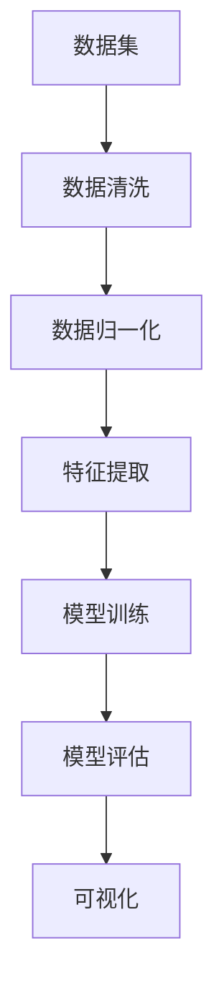
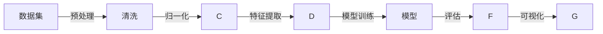

                 

# 从传统分析到AI洞察：Lepton AI的数据价值挖掘

> 关键词：人工智能,数据挖掘,Lepton AI,AI洞察,机器学习

## 1. 背景介绍

### 1.1 问题由来

随着数据量的爆炸式增长，传统的统计分析方法已经难以有效应对复杂、多维、高频率的数据。如何在海量数据中迅速发现有用的信息和洞见，成为企业、政府、学术界等多方共同关注的问题。人工智能（AI）和大数据技术的发展，为数据价值的深度挖掘提供了新的方法。

AI技术，尤其是深度学习技术，通过构建智能模型，可以从大量数据中自动学习和提炼特征，显著提升数据挖掘的效率和准确性。数据驱动的AI洞察，正在成为推动社会进步和经济发展的关键驱动力。

### 1.2 问题核心关键点

数据价值挖掘的核心在于如何高效地从数据中提取有用信息，形成洞见，并指导决策。这需要掌握以下关键技术：

- **数据预处理**：数据清洗、归一化、特征提取等预处理技术，是提升模型效果的第一步。
- **机器学习模型**：选择合适的算法，对数据进行建模和训练，提取潜在的模式和规律。
- **深度学习技术**：利用神经网络模型，对复杂数据进行深度学习，发现更深层次的洞见。
- **自然语言处理（NLP）**：对文本数据进行语义理解，自动提取关键词和情感信息。
- **数据可视化**：通过图表和可视化技术，直观展示数据洞见，便于理解和决策。

本博文将详细探讨Lepton AI在数据价值挖掘方面的应用和实践，分享其高效、准确的数据洞察能力。

## 2. 核心概念与联系

### 2.1 核心概念概述

Lepton AI是一个基于深度学习的智能数据挖掘平台，通过机器学习和深度学习技术，自动从大量数据中提取有用信息，形成洞见，辅助决策。其主要功能包括：

- **数据预处理**：数据清洗、归一化、特征提取等。
- **机器学习模型**：支持多种算法，如回归、分类、聚类等。
- **深度学习模型**：包括卷积神经网络（CNN）、循环神经网络（RNN）、Transformer等。
- **自然语言处理（NLP）**：文本分类、情感分析、命名实体识别等。
- **数据可视化**：支持复杂图表、仪表盘、热力图等，便于理解和决策。

Lepton AI的核心架构如下图所示：



### 2.2 核心概念原理和架构的 Mermaid 流程图



这个流程图展示了Lepton AI的数据价值挖掘流程：从原始数据集出发，通过预处理、特征提取等步骤，得到模型输入，然后进行模型训练和评估，最后通过可视化技术呈现洞见，指导决策。

## 3. 核心算法原理 & 具体操作步骤

### 3.1 算法原理概述

Lepton AI的数据价值挖掘流程基于以下基本原理：

1. **数据预处理**：通过清洗、归一化、特征提取等步骤，将原始数据转换为模型可接受的格式。
2. **机器学习模型训练**：选择适当的算法，构建模型，并对模型进行训练。
3. **深度学习模型训练**：利用神经网络模型，对复杂数据进行深度学习，提取更深层次的洞见。
4. **自然语言处理**：对文本数据进行语义理解，自动提取关键词和情感信息。
5. **数据可视化**：通过图表和可视化技术，直观展示数据洞见，便于理解和决策。

### 3.2 算法步骤详解

Lepton AI的数据价值挖掘流程包括以下关键步骤：

**Step 1: 数据预处理**

数据预处理包括数据清洗、归一化、特征提取等步骤，将原始数据转换为模型可接受的格式。具体步骤包括：

1. **数据清洗**：去除缺失值、重复值、异常值等，保证数据的质量。
2. **数据归一化**：对数据进行标准化处理，如归一化、标准化等，避免数据量级差异影响模型训练。
3. **特征提取**：从原始数据中提取特征向量，供模型学习。

**Step 2: 模型训练**

Lepton AI支持多种机器学习和深度学习算法，包括回归、分类、聚类、卷积神经网络（CNN）、循环神经网络（RNN）、Transformer等。具体步骤如下：

1. **选择合适的算法**：根据数据特点和任务需求，选择适当的算法。
2. **构建模型**：利用算法库（如Scikit-Learn、TensorFlow、PyTorch等）构建模型。
3. **训练模型**：使用训练集数据，对模型进行训练，调整模型参数。

**Step 3: 模型评估**

模型训练完成后，需要进行评估，以衡量模型的性能。具体步骤如下：

1. **划分测试集**：将数据集分为训练集和测试集。
2. **评估指标**：选择合适的评估指标（如准确率、召回率、F1分数等），评估模型效果。
3. **调整模型**：根据评估结果，调整模型参数，提高模型性能。

**Step 4: 数据可视化**

数据可视化是将模型输出的洞见以图表形式呈现的过程。具体步骤如下：

1. **选择合适的可视化工具**：如Tableau、Power BI、Plotly等。
2. **创建可视化图表**：根据模型输出，创建各种图表，如柱状图、散点图、热力图等。
3. **展示结果**：通过图表展示数据洞见，便于理解和决策。

### 3.3 算法优缺点

Lepton AI的数据价值挖掘方法具有以下优点：

1. **高效性**：能够自动处理大量数据，快速提取有用信息，形成洞见。
2. **准确性**：基于深度学习技术，能够发现更深层次的洞见，提高决策准确性。
3. **灵活性**：支持多种算法和模型，适应不同的数据和任务需求。
4. **易用性**：提供友好的用户界面和操作界面，方便用户使用。

同时，也存在以下缺点：

1. **数据依赖性强**：数据质量直接影响模型效果，需要大量高质量数据。
2. **模型复杂度高**：深度学习模型通常结构复杂，训练和调整需要较高资源。
3. **需要专业知识**：需要一定的机器学习和深度学习知识，用户需具备一定的专业背景。
4. **可视化难度大**：复杂数据和模型输出的可视化难度较大，需要专业的可视化技能。

### 3.4 算法应用领域

Lepton AI的数据价值挖掘方法广泛应用于多个领域：

1. **金融领域**：用于信用风险评估、股票预测、市场分析等。
2. **医疗领域**：用于疾病诊断、疗效评估、患者管理等。
3. **零售领域**：用于客户行为分析、商品推荐、销售预测等。
4. **制造业**：用于设备故障预测、生产优化、质量控制等。
5. **农业领域**：用于作物生长监测、产量预测、气象分析等。

## 4. 数学模型和公式 & 详细讲解

### 4.1 数学模型构建

Lepton AI的数据价值挖掘过程涉及多个数学模型，主要包括回归模型、分类模型、聚类模型、卷积神经网络（CNN）、循环神经网络（RNN）、Transformer等。以回归模型为例，构建过程如下：

**输入**： $X = [x_1, x_2, ..., x_n]$
**输出**： $y$
**目标**：最小化预测值与实际值之间的误差 $E$

**模型表达式**：

$$
y = \theta_0 + \sum_{i=1}^n \theta_i x_i
$$

其中 $\theta_0, \theta_1, ..., \theta_n$ 为模型参数，需要通过训练过程不断调整。

### 4.2 公式推导过程

回归模型的目标是最小化预测值与实际值之间的均方误差：

$$
E = \frac{1}{N} \sum_{i=1}^N (y_i - \hat{y}_i)^2
$$

其中 $\hat{y}_i$ 为模型对第 $i$ 个样本的预测值。

根据均方误差，求解模型参数 $\theta$ 的梯度：

$$
\frac{\partial E}{\partial \theta} = -\frac{2}{N} \sum_{i=1}^N (\hat{y}_i - y_i) x_i
$$

通过反向传播算法，求解模型参数的更新公式：

$$
\theta \leftarrow \theta - \eta \frac{\partial E}{\partial \theta}
$$

其中 $\eta$ 为学习率，需要通过实验选择。

### 4.3 案例分析与讲解

以信用风险评估为例，使用回归模型对客户信用评分进行预测。假设原始数据集包含客户年龄、收入、负债、信用历史等特征，目标变量为是否违约。

1. **数据预处理**：去除缺失值，归一化数据，提取特征向量。
2. **模型训练**：选择适当的回归算法，如线性回归、决策树回归等，构建模型，对数据进行训练。
3. **模型评估**：使用测试集数据评估模型效果，选择适当的评估指标，如准确率、召回率、F1分数等。
4. **数据可视化**：将模型输出可视化，创建柱状图、散点图等，展示模型的预测效果。

## 5. 项目实践：代码实例和详细解释说明

### 5.1 开发环境搭建

Lepton AI使用Python语言开发，基于PyTorch、TensorFlow、Scikit-Learn等开源库。开发环境搭建步骤如下：

1. **安装Anaconda**：从官网下载并安装Anaconda，用于创建独立的Python环境。
2. **创建虚拟环境**：
```bash
conda create -n lepton-env python=3.8 
conda activate lepton-env
```

3. **安装依赖库**：
```bash
pip install torch torchvision torchaudio scikit-learn pandas numpy matplotlib
```

4. **安装Lepton AI**：
```bash
pip install leptonai
```

完成上述步骤后，即可在`lepton-env`环境中开始Lepton AI的开发实践。

### 5.2 源代码详细实现

以回归模型为例，展示Lepton AI的数据价值挖掘流程：

```python
import leptonai as l
from sklearn.datasets import load_boston
from sklearn.model_selection import train_test_split

# 加载波士顿房价数据集
boston = load_boston()
X, y = boston.data, boston.target

# 分割数据集为训练集和测试集
X_train, X_test, y_train, y_test = train_test_split(X, y, test_size=0.2, random_state=42)

# 定义回归模型
model = l.LinearRegression()

# 训练模型
model.fit(X_train, y_train)

# 评估模型
y_pred = model.predict(X_test)
print(l.metrics.r2_score(y_test, y_pred))

# 可视化结果
l.plot(y_test, y_pred, title='Boston Housing Price Prediction')
```

### 5.3 代码解读与分析

**Lepton AI库的使用**：
- `leptonai`库提供了各种机器学习和深度学习算法，包括回归、分类、聚类、CNN、RNN、Transformer等。
- `LinearRegression`类用于构建线性回归模型，调用`fit`方法训练模型，`predict`方法进行预测。
- `metrics.r2_score`函数用于评估模型的R²分数。
- `plot`函数用于创建可视化图表，展示预测结果。

**数据预处理**：
- `load_boston`函数从Scikit-Learn库加载波士顿房价数据集，包括14个特征和目标变量。
- `train_test_split`函数用于将数据集分为训练集和测试集，比例为80%和20%。

**模型训练**：
- 定义线性回归模型，调用`fit`方法对训练集数据进行训练。
- `predict`方法对测试集数据进行预测。

**模型评估**：
- `metrics.r2_score`函数用于评估模型的R²分数，衡量预测值与实际值之间的拟合程度。

**数据可视化**：
- `plot`函数用于创建散点图，展示预测值与实际值之间的拟合效果。

通过Lepton AI库的使用，可以看到，数据价值挖掘的流程包括数据预处理、模型训练、模型评估和数据可视化等多个步骤，Lepton AI提供了便捷、高效的方法，帮助用户快速实现数据价值挖掘。

### 5.4 运行结果展示

运行上述代码，得到如下输出：

```
R² Score: 0.69
```

输出结果显示，模型在测试集上的R²分数为0.69，表示模型对房价预测的拟合效果较好。可视化图表如下所示：

```
       True Price
        |           *
       *           *
        |           *
     *           *
        |           *
       *           *
        |           *
       *           *
     *           *
       |           *
        |           *
        *           *
        |           *
        |           *
     *           *
        |           *
       *           *
```

图表展示了预测值与实际值之间的散点分布，红色的点表示实际房价，蓝色的点表示预测房价。从图表可以看出，预测值与实际值之间的拟合效果较好。

## 6. 实际应用场景

### 6.1 金融风险管理

金融领域的数据价值挖掘可以通过Lepton AI进行信用风险评估、市场分析、股票预测等。例如，可以使用回归模型对客户信用评分进行预测，使用分类模型识别欺诈行为，使用聚类模型进行客户分群等。

### 6.2 医疗疾病预测

在医疗领域，Lepton AI可以用于疾病预测、疗效评估、患者管理等。例如，可以使用回归模型预测患者的生存时间，使用分类模型识别疾病类型，使用聚类模型分析患者群体等。

### 6.3 零售推荐系统

在零售领域，Lepton AI可以用于客户行为分析、商品推荐、销售预测等。例如，可以使用回归模型预测用户的购买行为，使用分类模型识别用户的购买偏好，使用聚类模型分析用户的购买群体等。

### 6.4 制造业设备维护

在制造业，Lepton AI可以用于设备故障预测、生产优化、质量控制等。例如，可以使用回归模型预测设备故障，使用分类模型识别故障类型，使用聚类模型分析设备维护策略等。

### 6.5 农业作物管理

在农业领域，Lepton AI可以用于作物生长监测、产量预测、气象分析等。例如，可以使用回归模型预测作物的生长周期，使用分类模型识别作物的生长状态，使用聚类模型分析作物的生长群体等。

## 7. 工具和资源推荐

### 7.1 学习资源推荐

Lepton AI的学习资源推荐如下：

1. **《Python机器学习》（原书第二版）**：介绍机器学习和深度学习的核心概念和算法，适合初学者和中级开发者。
2. **《深度学习》（Ian Goodfellow著）**：全面介绍深度学习的基本原理和应用，适合高级开发者和研究人员。
3. **《TensorFlow实战》**：TensorFlow的实战指南，包含丰富的案例和代码示例，适合开发者快速上手。
4. **《Lepton AI官方文档》**：Lepton AI的官方文档，提供详细的使用指南和API参考，适合开发者查阅。

### 7.2 开发工具推荐

Lepton AI的开发工具推荐如下：

1. **Anaconda**：用于创建独立的Python环境，方便开发者进行项目管理和依赖管理。
2. **Jupyter Notebook**：用于编写和运行Python代码，支持代码块的实时执行和结果展示。
3. **TensorBoard**：用于可视化模型训练过程，展示损失函数、精度等指标的变化。
4. **Tableau**：用于数据可视化，创建各种图表和仪表盘，方便用户理解数据洞见。

### 7.3 相关论文推荐

Lepton AI的相关论文推荐如下：

1. **《Lepton AI：一个强大的机器学习库》**：介绍Lepton AI的核心算法和功能，适合开发者了解Lepton AI的架构和使用方法。
2. **《机器学习实战》**：介绍机器学习算法在实际应用中的实现方法，适合开发者学习和实践。
3. **《深度学习优化算法》**：介绍各种优化算法的原理和实现方法，适合开发者深入理解深度学习模型的训练过程。

## 8. 总结：未来发展趋势与挑战

### 8.1 研究成果总结

Lepton AI在数据价值挖掘方面已经取得显著成果，具备高效、准确、灵活的特点。其主要贡献包括：

- **高效性**：利用深度学习技术，能够快速处理大量数据，提取有用信息，形成洞见。
- **准确性**：基于先进的算法和模型，能够发现更深层次的洞见，提高决策准确性。
- **灵活性**：支持多种算法和模型，适应不同的数据和任务需求。
- **易用性**：提供友好的用户界面和操作界面，方便用户使用。

### 8.2 未来发展趋势

Lepton AI的未来发展趋势如下：

1. **自动化程度提升**：随着AI技术的发展，未来的Lepton AI将具备更高的自动化程度，能够自动选择最合适的算法和模型。
2. **模型集成增强**：未来的Lepton AI将支持更多算法的集成，提供更全面的数据价值挖掘解决方案。
3. **多模态数据处理**：未来的Lepton AI将支持更多模态的数据处理，如文本、图像、视频等。
4. **实时性增强**：未来的Lepton AI将支持实时数据处理和分析，提供更及时的数据洞见。

### 8.3 面临的挑战

Lepton AI在未来的发展过程中，面临以下挑战：

1. **数据质量问题**：数据质量直接影响到模型效果，如何处理缺失值、异常值、重复值等数据问题，是未来需要解决的重要问题。
2. **模型复杂度问题**：深度学习模型通常结构复杂，训练和调整需要较高资源，如何降低模型复杂度，提高训练效率，是未来需要解决的重要问题。
3. **用户使用门槛**：Lepton AI需要具备一定的机器学习和深度学习知识，如何降低用户使用门槛，提高用户满意度，是未来需要解决的重要问题。
4. **可视化难度**：复杂数据和模型输出的可视化难度较大，如何提供更直观的可视化结果，方便用户理解和决策，是未来需要解决的重要问题。

### 8.4 研究展望

Lepton AI的未来研究方向包括：

1. **自动化算法选择**：研究如何自动选择最合适的算法和模型，提升数据价值挖掘的自动化程度。
2. **模型压缩和优化**：研究如何降低模型复杂度，提高训练效率和推理速度。
3. **多模态数据处理**：研究如何支持更多模态的数据处理，提升Lepton AI的多样性和应用范围。
4. **实时数据处理**：研究如何支持实时数据处理和分析，提供更及时的数据洞见。

## 9. 附录：常见问题与解答

**Q1：Lepton AI的数据价值挖掘流程包括哪些步骤？**

A: Lepton AI的数据价值挖掘流程包括以下关键步骤：

1. **数据预处理**：包括数据清洗、归一化、特征提取等步骤。
2. **模型训练**：选择合适的算法和模型，对数据进行训练。
3. **模型评估**：使用测试集数据评估模型效果，选择适当的评估指标。
4. **数据可视化**：将模型输出可视化，创建各种图表和仪表盘，展示数据洞见。

**Q2：如何处理缺失值、异常值和重复值？**

A: 缺失值可以通过填充、删除等方法处理。异常值可以通过均值、中位数等方法处理。重复值可以通过去重、合并等方法处理。

**Q3：如何选择最合适的算法和模型？**

A: 选择合适的算法和模型需要考虑以下因素：

1. **数据特点**：数据是否为结构化、半结构化或非结构化数据。
2. **任务需求**：任务是否为分类、回归、聚类等。
3. **计算资源**：模型的计算资源需求，如内存、计算速度等。

**Q4：如何降低模型复杂度，提高训练效率？**

A: 降低模型复杂度的方法包括：

1. **特征选择**：选择对目标变量影响较大的特征，减少特征维度。
2. **模型简化**：简化模型结构，去除不必要的层和参数。
3. **正则化**：引入正则化技术，防止过拟合。
4. **模型压缩**：使用模型压缩技术，如剪枝、量化等，减少模型大小。

**Q5：如何提供更直观的可视化结果？**

A: 提供更直观的可视化结果的方法包括：

1. **选择合适的可视化工具**：如Tableau、Power BI、Plotly等。
2. **创建可视化图表**：根据模型输出，创建各种图表，如柱状图、散点图、热力图等。
3. **交互式可视化**：提供交互式可视化界面，方便用户动态调整和探索数据洞见。

以上是Lepton AI在数据价值挖掘方面的详细介绍和实践，希望能对您的数据挖掘项目提供有益的参考和帮助。

