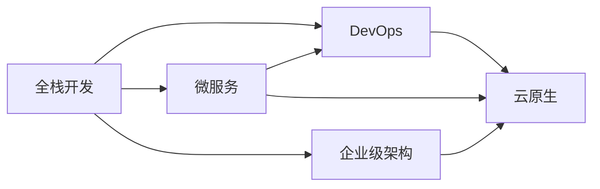

                 

# 从全栈开发到企业级架构师的进阶之路

> 关键词：全栈开发,企业级架构,技术栈,微服务,DevOps,云原生

## 1. 背景介绍

### 1.1 问题由来
随着信息技术的高速发展和应用场景的日益复杂，传统单技能的全栈开发人员已无法满足企业对信息化建设提出的新需求。企业级架构师成为日益紧缺的人才，同时承担起优化技术栈、推动数字化转型的重要职责。企业级架构师需要对信息技术架构进行顶层设计，兼顾可用性、安全性和可扩展性，同时实现技术与业务融合。本文将从全栈开发人员着手，探讨如何通过系统学习和实践，逐步成长为一位经验丰富的企业级架构师。

### 1.2 问题核心关键点
全栈开发向企业级架构师进阶，需要从多个维度跨越，涉及技术栈选择、系统架构设计、分布式系统设计、云计算与云原生架构、DevOps工具链、项目管理与协作工具等多个方面。进阶之路的关键在于理解系统的复杂性，积累架构设计经验，学习与实践相结合，持续跟进技术前沿。

### 1.3 问题研究意义
从全栈开发进阶为企业级架构师，不仅是个人技能提升的体现，更是企业技术能力提升、数字化转型成功与否的关键。深入理解企业级架构的核心价值和关键技术，可以更好地为企业提供技术支撑，推动业务创新，实现长期可持续的商业价值。

## 2. 核心概念与联系

### 2.1 核心概念概述

企业级架构师需要深入理解以下几个关键概念：

- **全栈开发**：掌握前端和后端的开发技术，能够独立完成从需求分析到项目交付的全过程。
- **微服务架构**：将系统拆分成多个独立的小服务，每个服务独立部署、运行和扩展，提高系统的灵活性和可维护性。
- **DevOps**：集成开发、测试和运维，通过持续集成和持续交付，缩短软件交付周期，提高系统稳定性和响应速度。
- **云原生架构**：基于容器化、自动化、服务网格等技术，构建弹性、可伸缩、自愈的分布式系统。
- **企业级架构**：从系统架构的角度出发，进行顶层设计，确保系统的高可用性、安全性和可扩展性。

这些概念之间的关系可以通过以下Mermaid流程图来展示：



这个流程图展示了全栈开发与企业级架构师成长过程中的主要技术范式和技术栈，各技术范式相互促进，逐步向企业级架构演进。

## 3. 核心算法原理 & 具体操作步骤
### 3.1 算法原理概述

企业级架构师在实际工作中，往往需要面对复杂多变的需求和业务环境，需要设计、构建和运维一个可扩展、高可用、安全的分布式系统。从全栈开发向企业级架构师进阶，需要深入理解以下算法原理：

- **分布式系统算法**：掌握一致性协议、分区容错性、网络通信原理等。
- **数据库算法**：理解ACID事务、数据库分片、数据一致性等。
- **容错算法**：掌握故障检测、系统重启、服务降级等。
- **负载均衡算法**：实现流量分发、负载均衡等。

这些算法构成了企业级架构师必备的技术基础。

### 3.2 算法步骤详解

1. **选择适合的微服务架构**：
    - 根据业务需求和技术栈特点，选择微服务架构，并进行模块拆分。
    - 定义微服务的职责边界和服务接口，确保各服务独立自治。

2. **设计服务间通信协议**：
    - 确定服务间通信方式（HTTP REST、gRPC、Thrift等），并实现API网关、消息队列等通信机制。
    - 定义服务间的调度和负载均衡策略，实现高可用和性能优化。

3. **实现服务发现和注册**：
    - 设计服务发现机制，使用如Zookeeper、Eureka等注册中心。
    - 实现服务实例的动态注册和发现，确保服务的动态管理和扩展。

4. **构建自动化运维工具**：
    - 使用Docker、Kubernetes等容器编排工具实现服务的容器化、自动化部署。
    - 实现CI/CD流水线，集成Jenkins、GitLab CI等工具，提升开发效率和质量。

5. **实现分布式事务和跨服务一致性**：
    - 使用TCC（Try-Confirm-Cancel）、Saga等事务管理方案，保证跨服务的一致性。
    - 实现分布式事务的隔离和补偿机制，保障系统的可靠性和稳定性。

### 3.3 算法优缺点

微服务架构具有以下优点：
- 高扩展性：每个服务可以独立扩展，提升系统的可扩展性。
- 高可用性：服务实例可以分布式部署，提升系统的可用性。
- 灵活性：服务间耦合度低，便于独立维护和升级。

同时，微服务架构也存在以下缺点：
- 复杂性高：服务间依赖多，设计复杂。
- 调试困难：跨服务调用可能导致问题链条长，难以定位问题。
- 运维难度大：需要管理大量服务实例，运维难度大。

### 3.4 算法应用领域

微服务架构广泛适用于各种场景：
- 电商平台：电商系统对性能、可用性要求高，微服务架构能够提升系统的可扩展性和稳定性。
- 金融系统：金融系统对数据一致性、安全性要求严格，微服务架构能够实现高一致性和强健性。
- 移动应用：微服务架构能够实现服务粒度的独立部署和更新，提升应用的敏捷性。

## 4. 数学模型和公式 & 详细讲解  
### 4.1 数学模型构建

在分布式系统设计中，关键问题是如何通过算法确保系统的高可用性和一致性。这里以ACID事务模型为例，构建数学模型。

设一个系统包含多个服务，每个服务有两个状态：活跃状态和失败状态。定义事务的四个特性（原子性、一致性、隔离性、持久性），可以用以下数学模型来描述：

- 原子性（A）：事务要么全部执行，要么全部不执行。
- 一致性（C）：事务执行前后，数据状态一致。
- 隔离性（I）：事务间执行互不影响。
- 持久性（D）：事务完成后，数据状态永久保存。

数学模型定义如下：

$$
A \wedge C \wedge I \wedge D
$$

### 4.2 公式推导过程

事务的一致性模型可以通过假设和推导得出。假设事务T由多个操作组成，每个操作在执行过程中存在两种状态：已完成和未完成。如果事务的所有操作都已完成，则事务视为一致。用数学公式表示：

$$
\forall x \in T, x \in \{\text{已完成}, \text{未完成}\}
$$

只有当所有操作都完成后，事务视为一致。数学公式表示为：

$$
\bigwedge_{x \in T} (x = \text{已完成})
$$

这个推导过程展示了如何通过假设和推理，构建起分布式系统的事务一致性模型。

### 4.3 案例分析与讲解

以电商平台的订单系统为例，分析如何设计一致性的微服务架构：

- **设计原则**：每个服务独立自治，服务之间通过API网关和消息队列通信，减少直接调用，提高系统鲁棒性。
- **事务管理**：使用TCC模式，在订单服务中进行分布式事务管理，确保订单操作的一致性和可靠性。
- **故障处理**：实现服务降级和重试机制，当订单服务故障时，暂时降级至本地事务，恢复后自动补偿。

## 5. 项目实践：代码实例和详细解释说明
### 5.1 开发环境搭建

在微服务架构开发中，需要使用到多个技术和工具，如Docker、Kubernetes、Jenkins等。以下是搭建开发环境的详细步骤：

1. **安装Docker**：
    - 下载Docker安装程序，安装并配置系统环境。
    - 在Docker中安装Python、Node.js等常用开发工具。

2. **配置Kubernetes**：
    - 安装Kubernetes集群管理工具，如Minikube、kubeadm等。
    - 部署Kubernetes环境，创建服务节点和Pod。

3. **配置Jenkins CI/CD**：
    - 安装Jenkins服务器，配置权限和插件。
    - 创建CI/CD流水线，包括代码扫描、构建、测试、部署等步骤。

4. **配置源代码管理**：
    - 使用Git实现版本控制，配置GitLab或GitHub仓库。
    - 配置CI/CD流水线的代码拉取和推送，实现自动化构建和部署。

### 5.2 源代码详细实现

以电商订单系统为例，编写订单服务的Docker镜像和Kubernetes配置文件：

**Dockerfile**：
```Dockerfile
FROM python:3.8
WORKDIR /app
COPY . /app
RUN pip install -r requirements.txt
EXPOSE 8080
CMD ["python", "app.py"]
```

**Kubernetes配置文件**：
```yaml
apiVersion: apps/v1
kind: Deployment
metadata:
  name: order-service
spec:
  replicas: 3
  selector:
    matchLabels:
      app: order-service
  template:
    metadata:
      labels:
        app: order-service
    spec:
      containers:
      - name: order-service
        image: order-service:latest
        ports:
        - containerPort: 8080
```

### 5.3 代码解读与分析

**Dockerfile**：
- 从Python 3.8镜像开始，设置工作目录和工作空间。
- 复制代码文件到Docker镜像中，安装依赖包。
- 暴露8080端口，指定运行脚本。

**Kubernetes配置文件**：
- 指定Deployment类型，创建订单服务部署。
- 设置3个Pod副本，确保服务高可用。
- 定义Pod模板，包括镜像、端口、标签等。

通过以上代码实现，订单服务能够被打包为Docker镜像，并运行在Kubernetes集群中，实现自动化部署和水平扩展。

### 5.4 运行结果展示

运行部署后的订单服务，可以通过curl命令测试服务响应：

```bash
$ curl http://order-service:8080/place-order
{
    "status": "success",
    "message": "Order placed successfully"
}
```

## 6. 实际应用场景
### 6.1 电商系统架构

电商系统是一个典型的高性能、高可用、高扩展的分布式系统，可以采用微服务架构进行设计：

1. **订单服务**：负责订单管理、支付、库存同步等。
2. **商品服务**：负责商品管理、推荐、搜索等。
3. **用户服务**：负责用户管理、权限、认证等。

通过微服务架构，系统能够实现服务间的解耦、高扩展性和高可用性，支持海量用户和订单的处理。

### 6.2 金融系统架构

金融系统对数据一致性和安全性要求极高，可以采用微服务架构进行设计：

1. **交易服务**：负责交易处理、资金清算等。
2. **结算服务**：负责账户余额、财务报表等。
3. **风控服务**：负责风险评估、合规检查等。

通过微服务架构，系统能够实现跨服务一致性、事务管理、异常处理等，提升系统的可靠性和安全性。

## 7. 工具和资源推荐
### 7.1 学习资源推荐

为快速掌握微服务架构、云原生技术等前沿知识，推荐以下学习资源：

1. **《微服务架构设计》**：深入浅出地讲解了微服务架构的核心概念、设计原则和实践经验。
2. **《云原生实践》**：介绍了云原生技术栈、Kubernetes、Docker等工具的实际应用。
3. **《DevOps工具链》**：详细介绍了DevOps工具链的构建和应用，涵盖Jenkins、GitLab CI等工具。
4. **《分布式系统算法》**：系统讲解了分布式系统设计中的关键算法和协议，如一致性协议、负载均衡等。

### 7.2 开发工具推荐

选择合适的开发工具是高效开发微服务系统的关键。以下是推荐的一些工具：

1. **Docker**：容器化技术，支持跨平台部署。
2. **Kubernetes**：容器编排工具，支持分布式系统管理。
3. **Jenkins**：持续集成工具，支持自动化构建和部署。
4. **GitLab**：版本控制和CI/CD平台，支持代码管理、版本控制和自动化测试。
5. **Prometheus**：监控工具，支持实时数据采集和可视化。
6. **Grafana**：可视化工具，支持监控数据的展示和分析。

### 7.3 相关论文推荐

深入研究微服务架构、云原生技术等领域的前沿论文，可以帮助理解最新的技术趋势和研究动态。以下是推荐的一些论文：

1. **《服务网格在微服务架构中的应用》**：讲解了服务网格技术，支持分布式系统的负载均衡、流量控制等功能。
2. **《分布式系统中的因果关系建模》**：研究了因果关系建模，解决微服务架构中的依赖问题。
3. **《云原生应用架构设计》**：详细介绍了云原生应用架构的设计和实现方法。
4. **《DevOps工具链的构建与实践》**：探讨了DevOps工具链的构建和应用，提升软件开发效率。

## 8. 总结：未来发展趋势与挑战
### 8.1 总结

本文从全栈开发人员着手，详细介绍了如何通过系统学习和实践，逐步成长为经验丰富的企业级架构师。从微服务架构、DevOps工具链、云原生技术等多个角度，揭示了企业级架构的核心价值和关键技术。通过系统学习和实践，全栈开发人员可以不断提升技能，拓展技术边界，最终成为一名合格的企业级架构师。

### 8.2 未来发展趋势

未来企业级架构将继续向以下几个方向发展：

1. **微服务架构的普及**：微服务架构将更加普及，更多企业会采用微服务架构进行系统构建。
2. **DevOps工具链的成熟**：DevOps工具链将更加成熟，实现更高效的开发和运维。
3. **云原生技术的深入应用**：云原生技术将更加深入应用，支持更高效、可扩展的分布式系统。
4. **自动化测试和持续交付**：自动化测试和持续交付将成为系统构建的标准流程，提升开发效率和系统可靠性。
5. **人工智能和大数据的应用**：AI和大数据技术将更加深入应用，提升系统分析和决策能力。

### 8.3 面临的挑战

尽管微服务架构和DevOps工具链在不断发展，但在实际应用中也面临诸多挑战：

1. **复杂性高**：微服务架构和DevOps工具链设计复杂，需要系统理解。
2. **运维难度大**：分布式系统运维难度大，需要持续监控和优化。
3. **技术更新快**：新技术不断涌现，需要持续学习。
4. **人才缺口大**：具备架构设计和DevOps能力的人才供不应求。
5. **成本高**：微服务架构和DevOps工具链的引入，需要大量人力和物力投入。

### 8.4 研究展望

为应对这些挑战，未来需要在以下几个方面进行研究：

1. **技术栈优化**：持续优化技术栈，提升系统性能和稳定性。
2. **自动化工具**：进一步优化DevOps工具链，提升自动化程度。
3. **人才培养**：加强技术人才的培养，提升技术栈和架构设计能力。
4. **开源社区**：积极参与开源社区，提升技术水平和交流能力。

## 9. 附录：常见问题与解答

**Q1：企业级架构师需要哪些核心技能？**

A: 企业级架构师需要掌握以下核心技能：
- 系统架构设计：具备系统架构设计能力，能够设计可扩展、高可用、安全的系统。
- 分布式系统设计：理解分布式系统算法，能够设计高可用、高性能的分布式系统。
- 云原生技术：熟悉云原生技术栈，能够实现高效、可扩展的云原生应用。
- DevOps工具链：熟练使用DevOps工具链，实现自动化构建、部署和运维。
- 项目管理与协作：具备项目管理与协作能力，能够组织团队高效完成系统构建。

**Q2：如何选择适合的微服务架构？**

A: 选择合适的微服务架构需要考虑以下因素：
- 业务复杂度：根据业务复杂度选择微服务拆分粒度。
- 团队能力：根据团队技术栈和能力选择微服务架构。
- 扩展性需求：根据系统扩展性需求选择微服务架构。

**Q3：如何实现分布式事务管理？**

A: 实现分布式事务管理，可以使用以下技术：
- TCC模式：在事务开始前进行资源锁定，事务执行过程中对资源进行分布式控制。
- Saga模式：定义事务各个阶段的执行逻辑，实现回滚和重试。

**Q4：如何进行系统监控和故障处理？**

A: 系统监控和故障处理需要以下工具和技术：
- Prometheus：实时数据采集和可视化。
- Grafana：可视化展示和分析。
- ELK栈：日志收集和分析。

**Q5：如何优化微服务架构？**

A: 优化微服务架构需要以下方法：
- 服务合并：合并低耦合的服务，减少服务间依赖。
- 服务降级：在关键路径上实现服务降级，保障系统稳定。
- 自动化测试：引入自动化测试，提升系统可靠性。

---

作者：禅与计算机程序设计艺术 / Zen and the Art of Computer Programming

