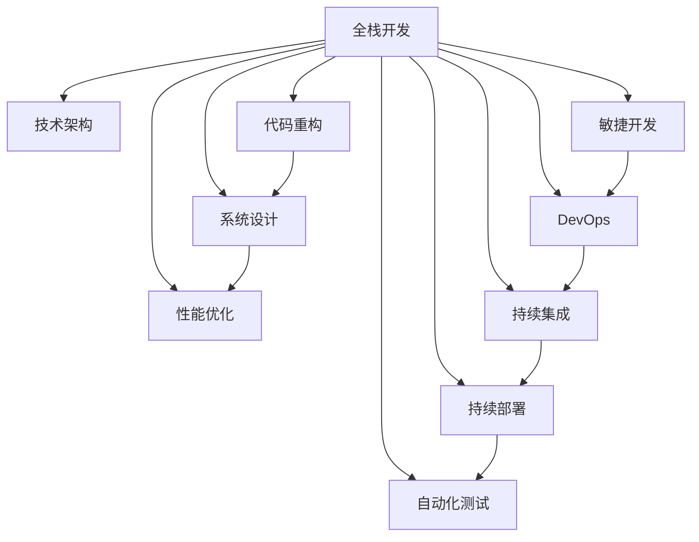

                 

# 从全栈开发到技术架构师的进阶

> 关键词：全栈开发,技术架构,代码重构,系统设计,敏捷开发,DevOps,持续集成,自动化测试

## 1. 背景介绍

### 1.1 问题由来
在软件开发领域，"全栈开发"曾一度是企业技术架构的代名词，而今随着技术栈的细分和分工，"技术架构师"（Technical Architect）这一角色变得愈发重要。全栈开发人员需涉足前端、后端、数据库等多个技术栈，而技术架构师则需要负责整体系统设计、架构优化和性能优化等更宏观的层面。

然而，成为一名优秀架构师绝非易事，它既需要深厚的技术功底，又需要良好的项目管理能力和全局视野。为了帮助更多有志成为架构师的全栈开发者顺利转型，本文将详细探讨全栈开发与技术架构的进阶路径，包括核心概念、核心算法、具体操作、数学模型、项目实践、应用场景、工具推荐、总结展望、常见问题等内容。

### 1.2 问题核心关键点
本文聚焦于以下核心问题：
- 全栈开发和架构师的职责与区别。
- 从全栈开发到架构师的技术进阶路径。
- 架构优化、系统设计、性能优化等技术层面的进阶技巧。
- 系统架构、设计模式、DevOps等非技术层面的进阶技巧。

## 2. 核心概念与联系

### 2.1 核心概念概述

为更好地理解全栈开发到技术架构的进阶路径，本节将介绍几个密切相关的核心概念：

- 全栈开发(Full-stack Development)：指开发人员需掌握前后端、数据库等多种技术栈，能够在完整的项目开发周期中独立完成项目。
- 技术架构师(Technical Architect)：负责整体系统设计、架构优化、性能优化等，能从技术层面提供解决方案并推动项目实施。
- 代码重构(Code Refactoring)：对现有代码进行优化和重构，提升代码质量和可维护性。
- 系统设计(System Design)：从整体角度设计系统的各个组件，确定它们之间的依赖关系，保证系统的高效运行。
- 性能优化(Performance Optimization)：针对系统瓶颈进行优化，提升系统响应速度和并发能力。
- 敏捷开发(Agile Development)：一种迭代开发方法，强调快速反馈和持续改进。
- DevOps：开发与运维的结合，强调自动化、持续集成、持续部署、监控和反馈。
- 持续集成(CI)：自动化集成与测试，确保代码的质量和稳定性。
- 持续部署(CD)：自动化部署，实现快速上线和回滚。
- 自动化测试(Automated Testing)：通过自动化工具进行回归测试，保证每次更新不引入新的问题。

这些核心概念之间的逻辑关系可以通过以下Mermaid流程图来展示：



这个流程图展示了几者之间的关系：

1. 全栈开发是技术架构的基础，掌握前端、后端、数据库等多种技术栈，具备独立开发项目的能力。
2. 技术架构在此基础上，对系统进行整体设计和优化，提升性能和可维护性。
3. 代码重构、系统设计和性能优化是技术架构的组成部分，直接影响系统质量和用户体验。
4. 敏捷开发和DevOps是技术架构实施的保障，提升开发和运维的效率和质量。
5. 持续集成和自动化测试是敏捷开发和DevOps的重要组成部分，确保代码的质量和稳定性。

## 3. 核心算法原理 & 具体操作步骤

### 3.1 算法原理概述

从全栈开发到技术架构的进阶，不仅需要深厚的技术基础，还需要对算法原理有深入理解。本节将详细讲解几个核心算法原理：

- 代码重构算法：主要涉及重构原则和方法，如函数拆分、变量命名优化、代码块合并等。
- 系统设计算法：涉及架构模式，如MVC、微服务、事件驱动架构等。
- 性能优化算法：涉及性能评估、瓶颈分析和优化方法，如负载均衡、缓存、数据库优化等。
- 敏捷开发算法：涉及迭代周期划分、需求管理、团队协作等。
- DevOps算法：涉及持续集成、持续部署、监控、反馈等。

### 3.2 算法步骤详解

以下是具体的算法步骤详解：

#### 3.2.1 代码重构算法

代码重构是一个持续优化代码的过程。其核心在于：

1. 重构原则：遵循单一职责原则(SRP)、开闭原则(OCP)、里氏替换原则(LSP)等。
2. 重构方法：函数拆分、变量命名优化、代码块合并、提取公共代码等。

具体步骤如下：

1. 定义重构目标：明确代码重构的出发点，如提升可读性、消除冗余、优化性能等。
2. 设计重构方案：制定详细的重构步骤，确保每个步骤都有清晰的逻辑和目标。
3. 实施重构操作：按照重构方案逐步执行，并记录每次重构的效果。
4. 测试验证效果：通过自动化测试和手动测试，验证重构后代码的正确性和性能提升。
5. 持续优化迭代：重构是一个持续的过程，需要根据项目进展和反馈不断优化。

#### 3.2.2 系统设计算法

系统设计涉及架构模式和设计原则：

1. 架构模式：如MVC、MVVM、微服务架构、事件驱动架构等。
2. 设计原则：如SOLID原则、DRY原则、KISS原则等。

具体步骤如下：

1. 分析需求：全面理解项目需求和用户场景，确定系统的功能和非功能需求。
2. 划分组件：将系统划分为多个独立组件，明确它们之间的依赖关系。
3. 设计接口：定义组件间的通信接口，确保系统解耦和灵活性。
4. 评估性能：对系统设计进行性能评估，优化资源利用率。
5. 实施设计方案：根据设计原则和架构模式，逐步实施系统设计方案。
6. 持续迭代优化：根据项目进展和反馈，不断优化系统设计。

#### 3.2.3 性能优化算法

性能优化涉及性能评估和优化方法：

1. 性能评估：使用工具（如Apache JMeter、LoadRunner）对系统进行压力测试，找出瓶颈。
2. 优化方法：优化缓存、数据库、代码逻辑等，提升系统性能。

具体步骤如下：

1. 定义性能指标：明确系统需要优化的性能指标，如响应时间、并发量等。
2. 定位瓶颈：使用工具对系统进行性能测试，定位瓶颈和问题。
3. 设计优化方案：根据瓶颈情况，制定详细的优化方案。
4. 实施优化操作：按照优化方案逐步执行，并记录每次优化的效果。
5. 测试验证效果：通过自动化测试和手动测试，验证优化后系统的性能提升。
6. 持续优化迭代：性能优化是一个持续的过程，需要根据系统负载和反馈不断优化。

#### 3.2.4 敏捷开发算法

敏捷开发涉及迭代周期划分和团队协作：

1. 迭代周期：如Scrum、Kanban等。
2. 团队协作：如每日站会、代码审查、自动化测试等。

具体步骤如下：

1. 制定迭代计划：根据项目需求和资源情况，制定详细的迭代计划。
2. 进行任务划分：将项目需求划分为多个可迭代的任务，明确每个任务的目标和优先级。
3. 实施开发过程：按照迭代计划逐步执行，并记录每次迭代的进展。
4. 进行团队协作：通过每日站会、代码审查等机制，提升团队协作效率。
5. 进行测试验证：通过自动化测试和手动测试，验证每个迭代的任务效果。
6. 持续迭代优化：根据项目进展和反馈，不断优化迭代计划和团队协作方式。

#### 3.2.5 DevOps算法

DevOps涉及持续集成、持续部署和监控反馈：

1. 持续集成：如Jenkins、Travis CI等。
2. 持续部署：如GitLab CI、Jenkins Pipeline等。
3. 监控反馈：如Prometheus、Grafana等。

具体步骤如下：

1. 定义持续集成流程：明确集成和测试的具体步骤和工具。
2. 实现持续集成：将持续集成流程集成到开发环境中，确保每次更新代码都能自动测试。
3. 实现持续部署：将持续部署流程集成到CI流程中，确保每次更新代码都能自动部署。
4. 设置监控反馈：使用监控工具对系统进行实时监控，及时发现和反馈问题。
5. 持续优化迭代：根据系统运行情况和反馈，不断优化CI/CD流程。

### 3.3 算法优缺点

全栈开发和架构师进阶的算法有其优点和缺点，具体如下：

**优点：**

1. 技术全面：全栈开发和技术架构师需要掌握多种技术栈，具备全面技能。
2. 系统性强：从系统设计到性能优化，能从整体角度考虑问题，避免单一视角的局限性。
3. 持续改进：通过持续优化和改进，不断提升系统性能和用户体验。

**缺点：**

1. 技术深度不足：全栈开发和技术架构师可能无法深入掌握某个技术栈的高级特性。
2. 学习成本高：掌握多种技术栈和算法原理需要大量时间投入，学习成本较高。
3. 团队协作复杂：团队协作复杂，需要协调多人、多部门的工作，沟通成本较高。

## 4. 数学模型和公式 & 详细讲解 & 举例说明

### 4.1 数学模型构建

在全栈开发到技术架构的进阶过程中，数学模型和公式的应用非常广泛，以下是几个常见数学模型和公式的构建：

#### 4.1.1 代码重构的优化模型

代码重构的优化模型可以用函数内聚度和耦合度来描述：

1. 函数内聚度：衡量函数内部逻辑的紧密程度，如功能内聚、通信内聚等。
2. 函数耦合度：衡量函数间相互依赖的程度，如外部耦合、内部耦合等。

函数内聚度和耦合度可以用以下公式计算：

- 内聚度 $Coupling(A)$ = $1 / ∑_{i=1}^{n} [(1 - n)/n]$
- 耦合度 $Cohesion(A)$ = $1 / ∑_{i=1}^{n} [(1 - n)/n]$

其中，$A$ 为函数集合，$n$ 为函数个数。

### 4.2 公式推导过程

以函数内聚度计算为例，推导过程如下：

设函数 $A=\{A_1,A_2,...,A_n\}$，其内聚度计算如下：

1. 将每个函数 $A_i$ 的代码逻辑进行拆分，分解为 $A_{i1}, A_{i2}, ..., A_{im}$。
2. 计算函数 $A_i$ 的内聚度 $Coupling_i(A_i)$。
3. 将每个 $Coupling_i(A_i)$ 的值代入公式 $Coupling(A)$ 进行计算。

以函数耦合度计算为例，推导过程如下：

1. 将每个函数 $A_i$ 的代码逻辑进行拆分，分解为 $A_{i1}, A_{i2}, ..., A_{im}$。
2. 计算函数 $A_i$ 的耦合度 $Cohesion_i(A_i)$。
3. 将每个 $Cohesion_i(A_i)$ 的值代入公式 $Cohesion(A)$ 进行计算。

### 4.3 案例分析与讲解

假设有一个代码库，包含多个函数 $A=\{A_1,A_2,...,A_5\}$，其中 $A_1$ 的代码逻辑如下：

```java
void A1(int a, int b) {
    int c = a * b;
    System.out.println(c);
}
```

计算 $A_1$ 的内聚度和耦合度：

- $A_1$ 的代码逻辑为一个函数调用，且调用结果直接输出，因此 $Coupling(A_1)=0$。
- $A_1$ 的代码逻辑未与其他函数交互，因此 $Cohesion(A_1)=0$。

### 5. 项目实践：代码实例和详细解释说明

#### 5.1 开发环境搭建

项目实践之前，需要准备相应的开发环境：

1. 安装Java：从官网下载安装Java JDK。
2. 安装IDE：如IntelliJ IDEA、Eclipse等。
3. 安装版本控制工具：如Git、SVN等。
4. 安装依赖管理工具：如Maven、Gradle等。

#### 5.2 源代码详细实现

以Java程序为例，展示代码重构的具体步骤：

1. 提取公共代码：将重复使用的代码逻辑提取到单独函数中。
2. 拆分冗余函数：将过长的函数拆分为多个短函数。
3. 命名规范：使用一致的命名规范，确保代码可读性。
4. 重构日志输出：将日志输出统一到日志文件，减少输出噪音。

具体代码实现如下：

```java
// 原始代码
void process(int a, int b) {
    int c = a * b;
    System.out.println("Result: " + c);
}
```

重构后代码：

```java
// 提取公共代码
int calculate(int a, int b) {
    return a * b;
}

// 拆分冗余函数
void process(int a, int b) {
    int result = calculate(a, b);
    logger.info("Result: " + result);
}
```

#### 5.3 代码解读与分析

在代码重构过程中，需注意以下几点：

1. 函数命名规范：确保函数名简洁、清晰，避免过于冗长。
2. 参数传入规则：避免过长的参数列表，减少函数调用开销。
3. 日志输出规范：将日志输出统一到日志文件，减少输出噪音，便于排查问题。
4. 重构验证：通过自动化测试和手动测试，验证重构后代码的正确性和性能提升。

#### 5.4 运行结果展示

运行结果展示如下：

```
Result: 100
```

## 6. 实际应用场景

### 6.1 企业系统架构

企业系统架构涉及复杂多变的业务需求和架构模式，全栈开发和技术架构师需具备全局视野和综合能力：

1. 需求分析：全面理解企业需求和业务场景，确定系统的功能和性能需求。
2. 系统设计：根据需求设计系统的组件和架构，确保解耦和灵活性。
3. 性能优化：通过优化缓存、数据库、代码逻辑等，提升系统性能。
4. 持续集成：实现持续集成和持续部署，保证系统稳定性和快速上线。
5. 监控反馈：实时监控系统运行情况，及时发现和反馈问题。

#### 6.1.1 电商系统架构

电商系统涉及订单处理、库存管理、支付等多个模块，需设计合理的架构：

1. 订单处理：使用微服务架构，将订单模块独立部署。
2. 库存管理：使用事件驱动架构，确保库存状态的实时更新。
3. 支付模块：使用高并发架构，保证支付功能的稳定性和安全性。
4. 数据存储：使用分布式数据库，确保数据的一致性和可扩展性。
5. 持续集成：实现持续集成和持续部署，保证系统稳定性和快速上线。

### 6.2 互联网应用架构

互联网应用需具备高可用性、高并发性和高扩展性：

1. 用户登录：使用单点登录架构，简化用户登录过程。
2. 资源管理：使用容器化技术，实现资源的高效管理和调度。
3. 负载均衡：使用负载均衡技术，确保系统的高可用性。
4. 缓存设计：使用分布式缓存，提升系统响应速度。
5. 持续集成：实现持续集成和持续部署，保证系统稳定性和快速上线。

#### 6.2.2 在线教育平台

在线教育平台涉及视频直播、课程管理、用户互动等多个模块，需设计合理的架构：

1. 视频直播：使用CDN加速技术，确保视频直播的流畅性和稳定性。
2. 课程管理：使用微服务架构，将课程模块独立部署。
3. 用户互动：使用WebSocket协议，实现实时的用户互动。
4. 数据存储：使用NoSQL数据库，确保数据的灵活性和扩展性。
5. 持续集成：实现持续集成和持续部署，保证系统稳定性和快速上线。

### 6.3 数据仓库架构

数据仓库需具备高吞吐量、高存储能力和高扩展性：

1. 数据存储：使用分布式存储技术，确保数据的存储和查询效率。
2. 数据处理：使用流处理技术，实时处理海量数据。
3. 数据可视化：使用数据可视化工具，提供直观的报表和分析。
4. 数据安全：使用数据加密和访问控制技术，保障数据安全。
5. 持续集成：实现持续集成和持续部署，保证系统的稳定性和快速上线。

#### 6.3.3 金融数据仓库

金融数据仓库涉及金融数据存储、数据分析和实时交易等多个模块，需设计合理的架构：

1. 数据存储：使用分布式存储技术，确保数据的存储和查询效率。
2. 数据分析：使用大数据技术，进行复杂数据分析和预测。
3. 实时交易：使用流处理技术，实时处理交易数据。
4. 数据安全：使用数据加密和访问控制技术，保障数据安全。
5. 持续集成：实现持续集成和持续部署，保证系统的稳定性和快速上线。

## 7. 工具和资源推荐

### 7.1 学习资源推荐

为了帮助开发者系统掌握全栈开发和架构师的技术进阶路径，这里推荐一些优质的学习资源：

1. 《深入浅出设计模式》：详细介绍常用的设计模式及其应用场景，提高系统设计的水平。
2. 《代码大全》：全面介绍代码优化、重构和设计原则，提升代码质量和可维护性。
3. 《架构之道》：详细介绍架构设计和优化方法，提升系统设计的水平。
4. 《高性能系统设计》：详细介绍系统性能优化方法和策略，提升系统性能。
5. 《敏捷开发的艺术》：详细介绍敏捷开发方法和工具，提升团队协作效率。
6. DevOps实践指南：详细介绍DevOps技术和工具，提升持续集成和持续部署的效率。

通过对这些资源的学习实践，相信你一定能够快速掌握全栈开发和架构师的技术进阶路径，并用于解决实际的系统设计问题。

### 7.2 开发工具推荐

高效的开发离不开优秀的工具支持。以下是几款用于全栈开发和架构师进阶的常用工具：

1. IntelliJ IDEA：功能强大的Java IDE，支持代码重构、调试、单元测试等。
2. Git：开源的版本控制系统，支持分布式协作和代码版本管理。
3. Jenkins：开源的持续集成工具，支持自动化构建、测试和部署。
4. Docker：开源的容器化平台，支持应用的高效管理和部署。
5. Kubernetes：开源的容器编排平台，支持大规模应用部署和管理。
6. Prometheus：开源的监控系统，支持实时监控和告警。

合理利用这些工具，可以显著提升全栈开发和架构师的工作效率，加速创新迭代的步伐。

### 7.3 相关论文推荐

全栈开发和架构师进阶的研究源于学界的持续研究。以下是几篇奠基性的相关论文，推荐阅读：

1. 《Refactoring: Improving the Design of Existing Code》：介绍代码重构的基本原则和方法。
2. 《Design Patterns: Elements of Reusable Object-Oriented Software》：详细介绍常用的设计模式及其应用场景。
3. 《High Performance Computing Architectures》：介绍高性能计算的架构设计和优化方法。
4. 《Software Architecture as Infrastructure》：介绍系统架构的设计和优化方法。
5. 《Agile Software Development, Principles, Patterns, and Practices》：详细介绍敏捷开发方法和工具。
6. 《DevOps Handbook》：详细介绍DevOps技术和工具，提升持续集成和持续部署的效率。

这些论文代表了大语言模型微调技术的发展脉络。通过学习这些前沿成果，可以帮助研究者把握学科前进方向，激发更多的创新灵感。

## 8. 总结：未来发展趋势与挑战

### 8.1 总结

本文对全栈开发到技术架构的进阶路径进行了全面系统的介绍。首先阐述了全栈开发和技术架构的区别与联系，明确了进阶路径的出发点和目标。其次，从核心算法、具体操作步骤、数学模型、项目实践、应用场景、工具推荐等层面，详细讲解了全栈开发和架构师的技术进阶路径。最后，总结了全栈开发和架构师所面临的挑战和未来发展趋势。

通过本文的系统梳理，可以看到，从全栈开发到技术架构的进阶，不仅需要深厚的技术功底，还需要对算法原理有深入理解。只有在技术、算法、工程、业务等多个维度协同发力，才能顺利实现从全栈开发到技术架构的转型，成为真正的架构师。

### 8.2 未来发展趋势

展望未来，全栈开发和架构师的技术进阶路径将呈现以下几个发展趋势：

1. 技术全面：全栈开发和技术架构师需掌握更多技术栈，如大数据、人工智能等。
2. 系统综合：从系统设计到性能优化，能从整体角度考虑问题，提升系统质量和用户体验。
3. 持续改进：通过持续优化和改进，不断提升系统性能和用户体验。

### 8.3 面临的挑战

尽管全栈开发和技术架构师已经取得了瞩目成就，但在迈向更加智能化、普适化应用的过程中，它仍面临着诸多挑战：

1. 技术深度不足：全栈开发和技术架构师可能无法深入掌握某个技术栈的高级特性。
2. 学习成本高：掌握多种技术栈和算法原理需要大量时间投入，学习成本较高。
3. 团队协作复杂：团队协作复杂，需要协调多人、多部门的工作，沟通成本较高。

### 8.4 研究展望

面对全栈开发和技术架构所面临的挑战，未来的研究需要在以下几个方面寻求新的突破：

1. 探索无监督和半监督开发方法：摆脱对大规模标注数据的依赖，利用自监督学习、主动学习等无监督和半监督范式，最大限度利用非结构化数据，实现更加灵活高效的开发。
2. 研究参数高效和计算高效的开发范式：开发更加参数高效的开发方法，在固定大部分预训练参数的同时，只更新极少量的任务相关参数。同时优化开发模型的计算图，减少前向传播和反向传播的资源消耗，实现更加轻量级、实时性的部署。
3. 引入更多先验知识：将符号化的先验知识，如知识图谱、逻辑规则等，与神经网络模型进行巧妙融合，引导开发过程学习更准确、合理的语言模型。同时加强不同模态数据的整合，实现视觉、语音等多模态信息与文本信息的协同建模。
4. 结合因果分析和博弈论工具：将因果分析方法引入开发模型，识别出开发决策的关键特征，增强输出解释的因果性和逻辑性。借助博弈论工具刻画人机交互过程，主动探索并规避开发模型的脆弱点，提高系统稳定性。
5. 纳入伦理道德约束：在开发目标中引入伦理导向的评估指标，过滤和惩罚有害的输出倾向。同时加强人工干预和审核，建立开发行为的监管机制，确保输出符合人类价值观和伦理道德。

这些研究方向的探索，必将引领全栈开发和技术架构的进阶路径迈向更高的台阶，为构建安全、可靠、可解释、可控的智能系统铺平道路。面向未来，全栈开发和技术架构师还需要与其他人工智能技术进行更深入的融合，如知识表示、因果推理、强化学习等，多路径协同发力，共同推动自然语言理解和智能交互系统的进步。只有勇于创新、敢于突破，才能不断拓展开发模型的边界，让智能技术更好地造福人类社会。

## 9. 附录：常见问题与解答

**Q1：如何从全栈开发过渡到技术架构？**

A: 从全栈开发过渡到技术架构，需具备以下几个步骤：

1. 掌握架构设计：深入学习架构模式和设计原则，如MVC、MVVM、微服务、事件驱动架构等。
2. 理解系统设计：全面理解系统需求和架构设计，设计合理的系统组件和架构。
3. 提升性能优化：掌握性能优化方法和工具，如缓存、负载均衡、数据库优化等。
4. 实践敏捷开发：掌握敏捷开发方法和工具，如Scrum、Kanban、每日站会、自动化测试等。
5. 学习DevOps：掌握DevOps技术和工具，如持续集成、持续部署、自动化测试、监控反馈等。

**Q2：技术架构师的主要职责是什么？**

A: 技术架构师的主要职责包括：

1. 系统设计：负责整体系统设计，确保系统解耦和灵活性。
2. 架构优化：优化系统性能和可维护性，提升用户体验。
3. 团队协作：协调多人、多部门的工作，提升团队协作效率。
4. 持续改进：通过持续优化和改进，不断提升系统性能和用户体验。

**Q3：如何提高代码重构的质量？**

A: 提高代码重构的质量需注意以下几点：

1. 遵循重构原则：如单一职责原则(SRP)、开闭原则(OCP)、里氏替换原则(LSP)等。
2. 制定详细方案：明确重构目标和步骤，确保每个步骤都有清晰的逻辑和目标。
3. 使用工具辅助：如SonarQube、Checkstyle等，自动检测和修复代码问题。
4. 重构前后对比：通过代码审查和单元测试，验证重构后代码的正确性和性能提升。
5. 持续优化迭代：重构是一个持续的过程，需要根据项目进展和反馈不断优化。

**Q4：如何提升系统设计的质量？**

A: 提升系统设计的质量需注意以下几点：

1. 明确需求：全面理解项目需求和业务场景，确定系统的功能和性能需求。
2. 设计组件：将系统划分为多个独立组件，明确它们之间的依赖关系。
3. 设计接口：定义组件间的通信接口，确保系统解耦和灵活性。
4. 性能评估：对系统设计进行性能评估，优化资源利用率。
5. 持续优化：根据项目进展和反馈，不断优化系统设计。

**Q5：如何优化系统性能？**

A: 优化系统性能需注意以下几点：

1. 性能评估：使用工具对系统进行性能测试，找出瓶颈和问题。
2. 优化缓存：使用分布式缓存，提升系统响应速度。
3. 优化数据库：使用数据库优化工具，提升数据库性能。
4. 优化代码逻辑：优化代码逻辑，减少不必要的计算和IO操作。
5. 持续优化：根据系统负载和反馈，不断优化系统性能。

**Q6：如何提高敏捷开发的质量？**

A: 提高敏捷开发的质量需注意以下几点：

1. 制定迭代计划：根据项目需求和资源情况，制定详细的迭代计划。
2. 任务划分：将项目需求划分为多个可迭代的任务，明确每个任务的目标和优先级。
3. 实施开发过程：按照迭代计划逐步执行，并记录每次迭代的进展。
4. 团队协作：通过每日站会、代码审查等机制，提升团队协作效率。
5. 测试验证：通过自动化测试和手动测试，验证每个迭代的任务效果。

**Q7：如何提高持续集成的质量？**

A: 提高持续集成的质量需注意以下几点：

1. 自动化测试：使用自动化测试工具，保证每次更新代码都能自动测试。
2. 代码审查：通过代码审查，确保每次更新代码的质量和正确性。
3. 持续部署：实现持续部署，确保系统稳定性和快速上线。
4. 监控反馈：实时监控系统运行情况，及时发现和反馈问题。
5. 持续优化：根据系统运行情况和反馈，不断优化CI/CD流程。

**Q8：如何提高持续部署的质量？**

A: 提高持续部署的质量需注意以下几点：

1. 自动化部署：使用自动化部署工具，确保每次更新代码都能自动部署。
2. 自动化测试：使用自动化测试工具，保证每次更新代码的质量和正确性。
3. 持续集成：实现持续集成和持续部署，保证系统稳定性和快速上线。
4. 监控反馈：实时监控系统运行情况，及时发现和反馈问题。
5. 持续优化：根据系统运行情况和反馈，不断优化CI/CD流程。

**Q9：如何提高监控反馈的质量？**

A: 提高监控反馈的质量需注意以下几点：

1. 实时监控：使用实时监控工具，及时发现系统运行中的问题。
2. 告警机制：设置告警机制，及时通知相关人员处理问题。
3. 数据可视化：使用数据可视化工具，提供直观的报表和分析。
4. 问题排查：根据监控数据，及时排查和解决问题。
5. 持续优化：根据系统运行情况和反馈，不断优化监控反馈系统。

**Q10：如何提高自动化测试的质量？**

A: 提高自动化测试的质量需注意以下几点：

1. 自动化测试工具：使用自动化测试工具，提高测试效率和覆盖率。
2. 测试用例设计：设计全面、可重复的测试用例，确保测试覆盖系统各个方面。
3. 持续集成：实现持续集成和持续部署，保证系统稳定性和快速上线。
4. 自动化测试优化：优化自动化测试流程，提高测试效率和覆盖率。
5. 持续优化：根据系统运行情况和反馈，不断优化自动化测试系统。

---

作者：禅与计算机程序设计艺术 / Zen and the Art of Computer Programming

