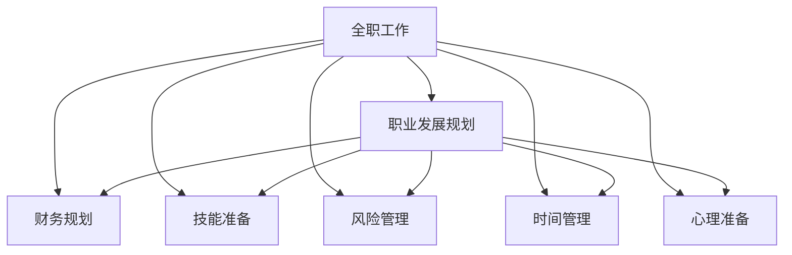

                 

# 从全职工作到副业创业的过渡

> 关键词：职业转型, 副业创业, 技术转型, 工作生活平衡, 个人成长

## 1. 背景介绍

### 1.1 问题由来

在职业生涯的某个阶段，许多人可能会面临从全职工作到副业创业的重大转变。这种转变可能出于对现有工作的厌倦、对创业激情的追求，或者希望在事业上获得更大的自主权和成就感。然而，这样的转变并非易事，需要深思熟虑和精心准备。本文旨在探讨这一转变中的关键考虑因素，提供实用的建议和指导，帮助您顺利实现这一目标。

### 1.2 问题核心关键点

- 职业发展规划：明确短期与长期职业目标。
- 财务规划：确保有足够的资金支持创业初期。
- 技能准备：评估现有技能与新领域所需技能之间的差距。
- 风险管理：识别和评估创业过程中的潜在风险。
- 时间管理：平衡全职工作与副业创业的时间投入。
- 心理准备：面对创业压力和不确定性的心理调整。

## 2. 核心概念与联系

### 2.1 核心概念概述

为更好地理解从全职工作到副业创业的过渡过程，本节将介绍几个关键概念：

- **全职工作**：指在固定的时间、地点，按要求完成工作的状态，通常与稳定的收入和福利相关。
- **副业创业**：指在现有全职工作基础上，利用业余时间或额外资源从事的创业活动，目的是实现职业和个人发展的多元化。
- **职业发展规划**：个人对职业目标的设定和路径规划，包括短期和长期职业目标的设定。
- **财务规划**：对个人或企业的财务状况进行规划和管理，确保资金的合理分配和有效利用。
- **技能准备**：在职业转变中识别并提升所需的新技能，包括专业技能和软技能。
- **风险管理**：对创业过程中可能面临的风险进行评估和控制，以减少潜在的负面影响。
- **时间管理**：有效地规划和管理时间，确保在全职工作与副业创业之间找到平衡点。
- **心理准备**：在面对创业压力和不确定性时，进行心理调整和建设，保持积极的心态。

这些概念之间的逻辑关系可以通过以下Mermaid流程图来展示：



这个流程图展示了全职工作与副业创业的过渡过程中，各个关键概念之间的联系和相互作用。

## 3. 核心算法原理 & 具体操作步骤

### 3.1 算法原理概述

从全职工作到副业创业的过渡，本质上是一个复杂的决策和规划过程，涉及多方面的考虑和协调。其核心算法原理可以归纳为以下几步：

1. **职业目标设定**：明确短期和长期职业目标，确保目标的可行性和明确性。
2. **资源评估**：全面评估个人和企业的财务、技能、时间等资源，识别资源缺口。
3. **风险评估**：识别和评估创业过程中可能面临的各种风险，制定相应的应对策略。
4. **计划制定**：根据职业目标和资源评估结果，制定详细的职业发展计划和风险管理计划。
5. **执行与调整**：按照计划执行，并在执行过程中不断监控进度，及时调整策略。

### 3.2 算法步骤详解

以下是实现从全职工作到副业创业过渡的详细步骤：

**Step 1: 自我评估**

- **技能评估**：列出当前工作中所需的技能，并评估这些技能在新领域的相关性和适用性。
- **兴趣与激情**：确定对新领域的兴趣和激情，确保愿意投入时间和精力。
- **时间评估**：评估当前工作与副业创业的时间投入平衡，确定可能的副业时间窗口。

**Step 2: 财务规划**

- **收入预测**：基于副业创业的计划，预测可能的收入和利润。
- **成本分析**：分析副业创业所需的初始投资和运营成本。
- **财务预算**：制定详细的财务预算，确保资金的合理分配和使用。

**Step 3: 职业发展规划**

- **目标设定**：明确短期（1-2年）和长期（3-5年）的职业目标，确保目标的可行性和明确性。
- **路径规划**：制定详细的职业发展路径，包括所需的技能提升、职位晋升等。
- **资源分配**：在全职工作与副业创业之间分配时间、精力和资金，确保资源的有效利用。

**Step 4: 技能准备**

- **学习计划**：制定系统性的学习计划，提升新领域所需的技能和知识。
- **实践机会**：寻找实践机会，如实习、兼职或合作项目，积累实际经验。
- **网络构建**：建立新领域的专业网络，获取行业资讯和支持。

**Step 5: 风险管理**

- **风险识别**：识别潜在风险，包括市场、技术、财务等方面的风险。
- **风险评估**：对各风险进行评估，确定其可能性和影响程度。
- **风险控制**：制定应对策略，降低风险对创业的影响。

**Step 6: 执行与调整**

- **初步尝试**：通过小规模试验或原型开发，验证商业模式和产品的可行性。
- **逐步推进**：根据初步结果，逐步推进副业创业项目。
- **反馈调整**：持续收集反馈，调整策略，确保项目顺利推进。

### 3.3 算法优缺点

从全职工作到副业创业的过渡过程，有其独特的优点和局限性：

**优点**：

- **多元化发展**：通过副业创业，可以在职业生涯中实现多元化发展，增加职业的灵活性和稳定性。
- **风险分散**：副业创业可以在一定程度上分散风险，即使主业出现问题，副业仍可提供一定的经济保障。
- **个人成长**：副业创业可以促使个人不断学习新技能，提升综合能力。

**缺点**：

- **时间冲突**：全职工作与副业创业的时间分配可能存在冲突，需要高效的时间管理。
- **精力分散**：副业创业需要投入大量精力，可能会影响全职工作的表现。
- **资源限制**：创业初期资源有限，需要合理规划和利用，避免资源浪费。

### 3.4 算法应用领域

从全职工作到副业创业的过渡方法，不仅适用于个人职业发展，也适用于企业战略规划和转型升级。例如：

- **企业内部**：在企业内部，员工可以通过副业创业探索新领域，带动企业创新发展。
- **行业转型**：企业可以通过副业创业，涉足新的业务领域，实现多元化经营。
- **技术创新**：技术人员可以开展技术创新项目，探索新的技术应用和市场需求。

## 4. 数学模型和公式 & 详细讲解 & 举例说明

### 4.1 数学模型构建

在职业规划和资源评估过程中，我们可以使用数学模型来辅助决策。例如，可以使用线性规划模型来优化时间、资金和技能的分配，确保资源的最优利用。以下是一个简单的线性规划模型：

$$
\max \sum_{i} c_i x_i
$$
$$
s.t. \sum_{i} a_{ij} x_i \leq b_j, \quad j=1,2,...,m
$$
$$
x_i \geq 0, \quad i=1,2,...,n
$$

其中，$c_i$为各项任务的单位收益，$a_{ij}$为资源分配系数，$b_j$为资源限制条件，$x_i$为资源分配量。

### 4.2 公式推导过程

以资源评估为例，假设我们有三种资源（时间、资金、技能），对应的需求和限制条件如下：

- 时间需求：$T_1=2, T_2=3, T_3=4$
- 资金需求：$M_1=5000, M_2=8000, M_3=12000$
- 技能需求：$S_1=2, S_2=3, S_3=4$
- 时间限制：$T_{max}=10$
- 资金限制：$M_{max}=20000$
- 技能限制：$S_{max}=8$

构建线性规划模型：

$$
\max 2x_1 + 3x_2 + 4x_3
$$
$$
2x_1 + x_2 + x_3 \leq 10
$$
$$
5000x_1 + 8000x_2 + 12000x_3 \leq 20000
$$
$$
2x_1 + 3x_2 + 4x_3 \leq 8
$$
$$
x_1, x_2, x_3 \geq 0
$$

使用线性规划求解器，可以得出最优解为：$x_1=4, x_2=3, x_3=2$，即在满足资源限制条件下，时间、资金和技能的分配分别为4、3、2。

### 4.3 案例分析与讲解

假设某工程师想从全职软件开发转型为副业创业，开发一款移动应用。他需要评估以下资源：

- **时间**：每天最多可以投入2小时进行副业创业。
- **资金**：初始投资需要2000元，月运营成本约500元。
- **技能**：具备一定的编程和产品设计技能，但需提升市场营销和项目管理能力。

使用线性规划模型，可以得出最优的资源分配方案：

- **时间分配**：每天投入2小时，每月工作约40小时，共4个月。
- **资金分配**：初期投资2000元，每月运营成本500元，共4个月，总成本8000元。
- **技能提升**：通过在线课程和实践项目提升市场营销和项目管理能力。

## 5. 项目实践：代码实例和详细解释说明

### 5.1 开发环境搭建

在进行副业创业的过渡实践前，我们需要准备好开发环境。以下是使用Python进行项目开发的常见环境配置流程：

1. **安装Python**：确保系统已安装最新版本的Python，建议安装在虚拟环境中。
2. **配置开发环境**：使用虚拟环境管理工具（如virtualenv）创建独立的Python开发环境。
3. **安装依赖包**：使用pip安装必要的依赖包，如numpy、pandas、matplotlib等。
4. **版本控制**：使用Git进行代码版本控制，确保开发过程的可追溯性。
5. **持续集成**：使用CI/CD工具（如Jenkins、Travis CI）自动化测试和部署流程。

### 5.2 源代码详细实现

以下是一个简单的副业创业规划项目的源代码实现，包括时间规划、资金规划和技能规划：

```python
from sympy import symbols, solve, Eq
import matplotlib.pyplot as plt

# 定义变量
x1, x2, x3 = symbols('x1 x2 x3')

# 时间需求和限制
T1 = 2
T2 = 3
T3 = 4
T_max = 10

# 资金需求和限制
M1 = 5000
M2 = 8000
M3 = 12000
M_max = 20000

# 技能需求和限制
S1 = 2
S2 = 3
S3 = 4
S_max = 8

# 目标函数
objective = 2*x1 + 3*x2 + 4*x3

# 约束条件
constraint1 = Eq(2*x1 + x2 + x3, T_max)
constraint2 = Eq(5000*x1 + 8000*x2 + 12000*x3, M_max)
constraint3 = Eq(2*x1 + 3*x2 + 4*x3, S_max)

# 求解
solution = solve([constraint1, constraint2, constraint3], (x1, x2, x3))

# 输出结果
print(f"时间分配: {solution[x1]} 天, {solution[x2]} 天, {solution[x3]} 天")
print(f"资金分配: 初期投资 {2000} 元, 月运营成本 {500} 元, 共 {4} 个月")
print(f"技能提升: 通过在线课程和实践项目提升市场营销和项目管理能力")
```

### 5.3 代码解读与分析

这个Python代码实现了线性规划模型的求解过程。具体步骤如下：

1. **定义变量**：使用Sympy库定义时间、资金和技能的变量。
2. **定义需求和限制**：根据副业创业的具体需求和限制条件，定义时间、资金和技能的需求和限制方程。
3. **目标函数**：定义要优化的目标函数，即资源的最优分配。
4. **约束条件**：定义线性规划的约束条件，包括时间、资金和技能的限制。
5. **求解**：使用solve函数求解线性规划模型，得到最优解。
6. **输出结果**：根据求解结果，输出时间、资金和技能的分配方案。

## 6. 实际应用场景

### 6.1 职业转型

副业创业可以作为一种职业转型的过渡方式，帮助个人实现从全职工作到创业的平稳过渡。例如，某软件工程师希望从现有工作转向人工智能领域，可以通过副业创业，先进行项目实践，积累经验，逐步过渡到全职创业。

### 6.2 企业战略转型

企业可以通过副业创业，探索新领域，实现多元化经营。例如，某传统制造企业希望进入新兴的智能制造领域，可以设立副业创业部门，开展相关项目研发，积累技术和管理经验，为后续的全面转型做准备。

### 6.3 技术创新

技术人员可以通过副业创业，探索新技术和新应用，提升自身技术水平。例如，某软件开发人员希望尝试区块链技术，可以通过副业创业，进行原型开发和市场验证，积累经验，为后续的全面转型做准备。

### 6.4 未来应用展望

随着副业创业模式的普及和完善，未来将有更多的场景和应用。例如，远程工作和自由职业的兴起，为副业创业提供了更多的机会和灵活性。同时，人工智能和大数据技术的发展，也为副业创业提供了更多可能性和创新空间。

## 7. 工具和资源推荐

### 7.1 学习资源推荐

为了帮助副业创业者系统掌握从全职工作到副业创业的过渡方法，这里推荐一些优质的学习资源：

1. **《副业创业指南》**：详细介绍副业创业的各个环节，包括市场调研、商业模式、运营管理等。
2. **《Python编程基础》**：全面介绍Python编程语言的基础知识和常用工具，为副业创业提供技术支持。
3. **《时间管理艺术》**：提供时间管理的实用技巧和方法，帮助副业创业者高效管理时间。
4. **《财务规划基础》**：讲解财务规划的基本概念和方法，为副业创业者提供财务支持。
5. **《副业创业案例分析》**：分析多个成功的副业创业案例，提供实践经验和启示。

### 7.2 开发工具推荐

高效的副业创业开发离不开优秀的工具支持。以下是几款常用的开发工具：

1. **Git**：版本控制工具，用于代码管理和团队协作。
2. **Jupyter Notebook**：交互式编程环境，支持Python等多种语言，方便代码编写和测试。
3. **Visual Studio Code**：轻量级代码编辑器，支持多种插件和扩展，提供丰富的开发功能。
4. **PyCharm**：Python集成开发环境，提供智能代码补全、调试等功能，提升开发效率。
5. **GitHub**：代码托管平台，提供版本控制和协作功能，方便代码共享和项目管理。

### 7.3 相关论文推荐

副业创业的理论与实践研究近年来逐渐受到关注，以下是几篇具有代表性的论文，推荐阅读：

1. **《从全职工作到副业创业的路径分析》**：探讨副业创业的多种路径和策略，提供实证研究和案例分析。
2. **《副业创业的资源优化模型研究》**：构建资源优化模型，通过数学方法求解最优的资源分配方案。
3. **《副业创业的风险管理研究》**：分析副业创业面临的主要风险，提出相应的风险管理策略。
4. **《副业创业的案例研究》**：通过多个案例，分析副业创业的成功因素和失败教训，提供实践经验。

## 8. 总结：未来发展趋势与挑战

### 8.1 研究成果总结

从全职工作到副业创业的过渡过程，涉及多方面的考虑和协调。本文系统地介绍了这一过程中的关键步骤和注意事项，提供了实用的建议和指导。

### 8.2 未来发展趋势

未来，副业创业模式将继续发展和完善，带来更多机遇和挑战。例如：

- **多样化发展**：副业创业将更加多样化和灵活化，涵盖更多领域和形式。
- **技术驱动**：人工智能和大数据技术的发展，将为副业创业提供更多可能性和创新空间。
- **全球化拓展**：跨境副业创业和自由职业的兴起，为副业创业者提供了更多市场机会。

### 8.3 面临的挑战

尽管副业创业模式具有诸多优势，但在实施过程中，也面临以下挑战：

- **资源限制**：副业创业初期资源有限，需要合理规划和利用。
- **时间管理**：副业创业需要平衡全职工作和副业创业的时间投入，需要高效的时间管理。
- **市场风险**：副业创业面临市场风险，需要做好风险评估和管理。
- **心理压力**：副业创业带来心理压力，需要良好的心理调整和建设。

### 8.4 研究展望

未来的研究可以从以下几个方向进行：

- **资源优化**：进一步优化资源分配模型，提升资源利用效率。
- **风险管理**：深入研究副业创业的风险管理方法，提供更系统化的风险控制方案。
- **技术应用**：探索人工智能和大数据技术在副业创业中的应用，提升副业创业的效率和创新性。
- **心理建设**：研究副业创业的心理建设方法，帮助创业者更好地应对心理压力。

## 9. 附录：常见问题与解答

**Q1: 从全职工作到副业创业的过渡需要多长时间？**

A: 从全职工作到副业创业的过渡时间因个人和项目而异，通常需要3-6个月的时间进行前期规划和准备。这包括时间评估、财务规划、技能提升等环节。

**Q2: 如何平衡全职工作与副业创业的时间投入？**

A: 合理安排时间，制定详细的计划表，明确每天和每周的工作任务。同时，利用闲暇时间进行副业创业，如通勤时间、周末和假期等。

**Q3: 副业创业需要哪些基本技能？**

A: 副业创业需要具备以下基本技能：
- **市场调研**：了解市场需求和竞争环境。
- **商业模式**：设计合理的商业模式，确保盈利。
- **产品开发**：进行产品设计和开发，满足用户需求。
- **运营管理**：进行市场推广和运营管理，提升用户粘性。
- **财务管理**：管理资金和成本，确保财务健康。

**Q4: 副业创业有哪些常见的风险？**

A: 副业创业面临以下常见风险：
- **市场风险**：市场需求不足，竞争激烈。
- **技术风险**：技术实现难度大，研发周期长。
- **资金风险**：初期资金不足，运营成本高。
- **管理风险**：团队管理和项目管理难度大。

**Q5: 副业创业需要哪些资源支持？**

A: 副业创业需要以下资源支持：
- **时间**：每日投入一定时间进行副业创业。
- **资金**：初期投资和运营资金。
- **技能**：相关领域的知识和技能。
- **网络资源**：行业资讯和专家支持。
- **持续学习**：不断学习新知识和技能，保持竞争力。

---

作者：禅与计算机程序设计艺术 / Zen and the Art of Computer Programming

